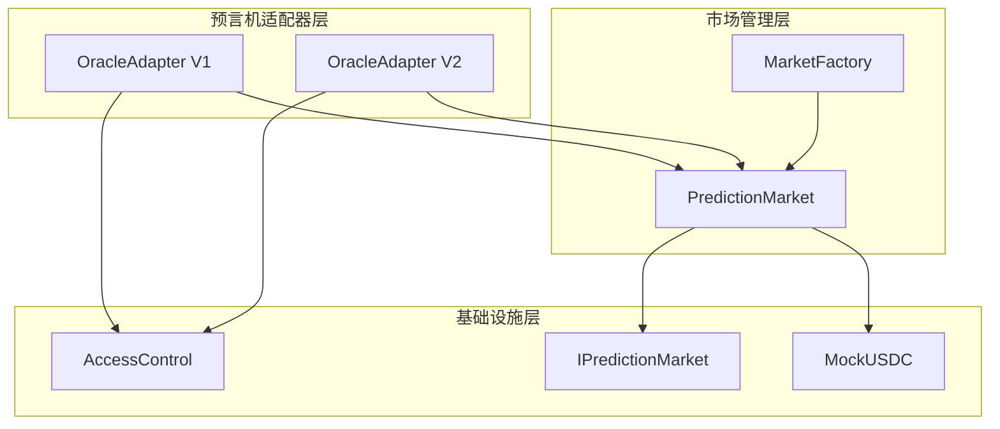
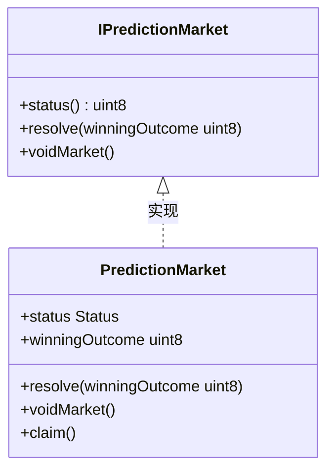
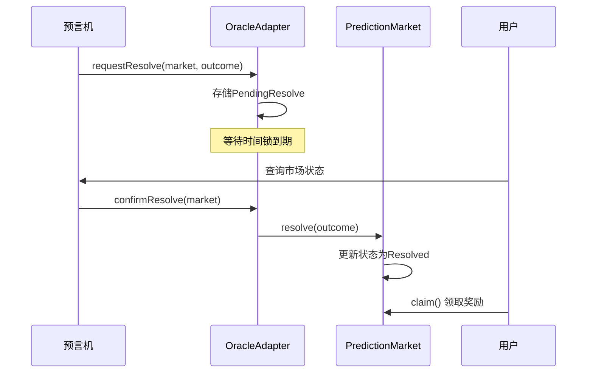
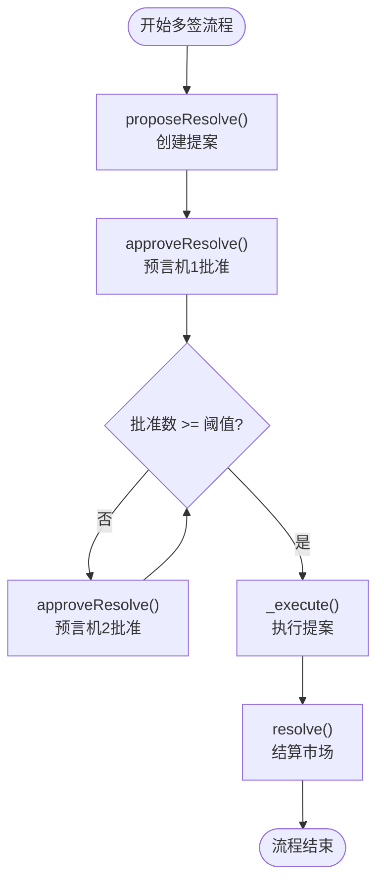
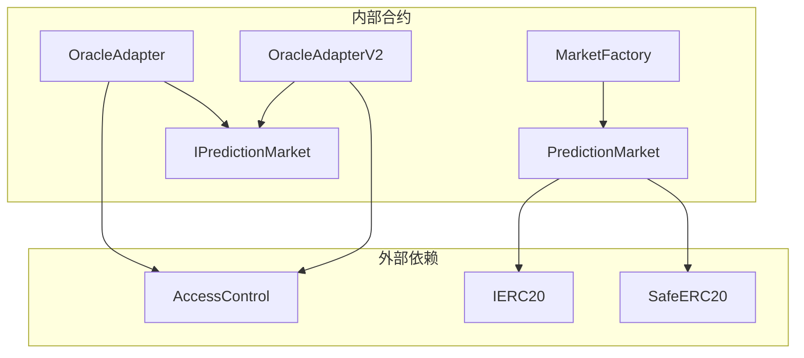
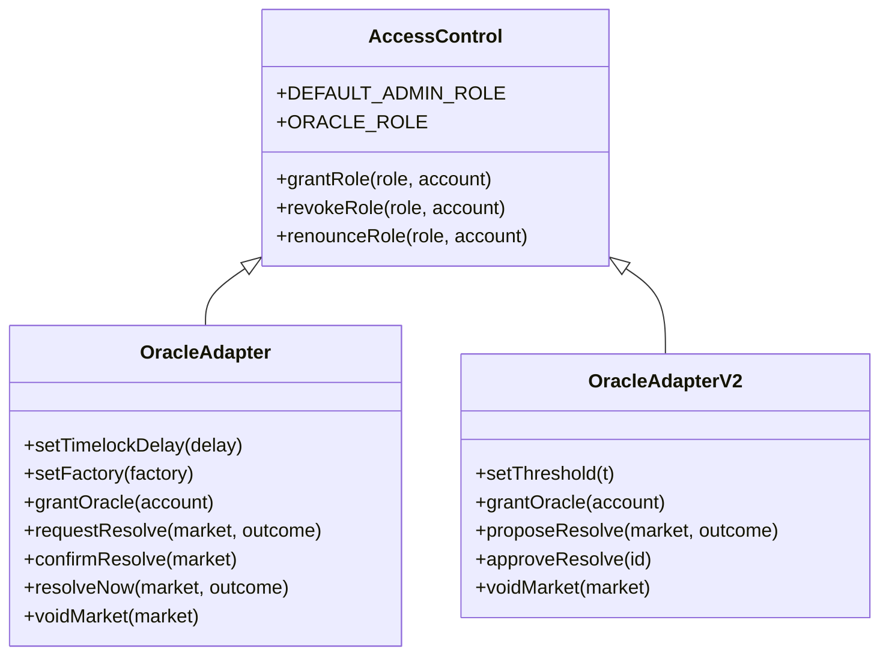

# 预言机适配器API

<cite>
**本文档引用的文件**
- [OracleAdapter.sol](file://contracts/OracleAdapter.sol)
- [OracleAdapterV2.sol](file://contracts/OracleAdapterV2.sol)
- [IPredictionMarket.sol](file://contracts/interfaces/IPredictionMarket.sol)
- [PredictionMarket.sol](file://contracts/PredictionMarket.sol)
- [OracleAdapter.test.js](file://test/OracleAdapter.test.js)
- [deploy.js](file://scripts/deploy.js)
</cite>

## 目录
1. [简介](#简介)
2. [项目结构](#项目结构)
3. [核心组件](#核心组件)
4. [架构概览](#架构概览)
5. [详细组件分析](#详细组件分析)
6. [依赖关系分析](#依赖关系分析)
7. [性能考虑](#性能考虑)
8. [故障排除指南](#故障排除指南)
9. [结论](#结论)

## 简介

预言机适配器合约是PredictionDID项目中的关键组件，负责管理预测市场的结算流程。该系统提供了两种不同的适配器实现：

- **OracleAdapter（V1）**：基于时间锁机制的单签结算适配器
- **OracleAdapterV2（V2）**：基于m-of-n多签机制的多签结算适配器

这些适配器通过访问控制机制确保只有授权的预言机可以执行市场结算和作废操作，同时提供了灵活的时间锁配置和多签验证流程。

## 项目结构

PredictionDID项目采用模块化设计，主要包含以下核心组件：

**图表来源**
- [OracleAdapter.sol:1-96](file://contracts/OracleAdapter.sol#L1-L96)
- [OracleAdapterV2.sol:1-95](file://contracts/OracleAdapterV2.sol#L1-L95)
- [PredictionMarket.sol:1-145](file://contracts/PredictionMarket.sol#L1-L145)

**章节来源**
- [OracleAdapter.sol:1-96](file://contracts/OracleAdapter.sol#L1-L96)
- [OracleAdapterV2.sol:1-95](file://contracts/OracleAdapterV2.sol#L1-L95)
- [PredictionMarket.sol:1-145](file://contracts/PredictionMarket.sol#L1-L145)

## 核心组件

### 访问控制机制

两个适配器都继承自OpenZeppelin的AccessControl合约，实现了基于角色的权限控制系统：

- **DEFAULT_ADMIN_ROLE**：管理员角色，拥有最高权限
- **ORACLE_ROLE**：预言机角色，用于执行结算和作废操作

### 预言机接口

IPredictionMarket接口定义了预测市场必须实现的核心方法：

**图表来源**
- [IPredictionMarket.sol:7-14](file://contracts/interfaces/IPredictionMarket.sol#L7-L14)
- [PredictionMarket.sol:90-104](file://contracts/PredictionMarket.sol#L90-L104)

**章节来源**
- [IPredictionMarket.sol:7-14](file://contracts/interfaces/IPredictionMarket.sol#L7-L14)
- [PredictionMarket.sol:90-104](file://contracts/PredictionMarket.sol#L90-L104)

## 架构概览

### 时间锁机制（V1）

OracleAdapter V1采用简单的时间锁机制：

**图表来源**
- [OracleAdapter.sol:57-78](file://contracts/OracleAdapter.sol#L57-L78)
- [PredictionMarket.sol:90-97](file://contracts/PredictionMarket.sol#L90-L97)

### 多签机制（V2）

OracleAdapter V2采用m-of-n多签机制：

**图表来源**
- [OracleAdapterV2.sol:51-86](file://contracts/OracleAdapterV2.sol#L51-L86)

**章节来源**
- [OracleAdapter.sol:57-78](file://contracts/OracleAdapter.sol#L57-L78)
- [OracleAdapterV2.sol:51-86](file://contracts/OracleAdapterV2.sol#L51-L86)

## 详细组件分析

### OracleAdapter V1 API参考

#### 构造函数
- **功能**：初始化适配器，设置管理员和时间锁延迟
- **参数**：
  - `admin`: 管理员地址
  - `_timelockDelay`: 时间锁延迟（秒）
- **权限**：无需特殊权限

#### 管理函数

##### setTimelockDelay
- **功能**：更新时间锁延迟
- **参数**：`delay`: 新的时间锁延迟
- **权限**：DEFAULT_ADMIN_ROLE
- **返回**：无

##### setFactory
- **功能**：设置工厂合约地址
- **参数**：`_factory`: 工厂合约地址
- **权限**：DEFAULT_ADMIN_ROLE
- **返回**：无

##### grantOracle
- **功能**：授予账户预言机角色
- **参数**：`account`: 账户地址
- **权限**：DEFAULT_ADMIN_ROLE
- **返回**：无

#### 预言机操作函数

##### requestResolve
- **功能**：请求结算市场（启动时间锁）
- **参数**：
  - `market`: 市场合约地址
  - `outcome`: 结果编号（0或1）
- **权限**：ORACLE_ROLE
- **前置条件**：
  - 市场状态必须为开放（0）
  - 结果必须在有效范围内
- **事件**：OracleResolveRequested

##### confirmResolve
- **功能**：确认并执行结算（时间锁到期后）
- **参数**：`market`: 市场合约地址
- **权限**：ORACLE_ROLE
- **前置条件**：
  - 存在待处理的结算请求
  - 时间锁必须已过期
- **事件**：OracleResolveConfirmed

##### resolveNow
- **功能**：快速结算（时间锁为0时使用）
- **参数**：
  - `market`: 市场合约地址
  - `outcome`: 结果编号
- **权限**：ORACLE_ROLE
- **前置条件**：时间锁延迟必须为0
- **事件**：OracleResolveConfirmed

##### voidMarket
- **功能**：作废市场
- **参数**：`market`: 市场合约地址
- **权限**：ORACLE_ROLE
- **前置条件**：市场状态必须为开放
- **事件**：MarketVoided

**章节来源**
- [OracleAdapter.sol:35-94](file://contracts/OracleAdapter.sol#L35-L94)

### OracleAdapter V2 API参考

#### 构造函数
- **功能**：初始化适配器，设置管理员和多签阈值
- **参数**：
  - `admin`: 管理员地址
  - `_threshold`: 多签阈值
- **权限**：无需特殊权限

#### 管理函数

##### setThreshold
- **功能**：设置多签阈值
- **参数**：`t`: 新的阈值
- **权限**：DEFAULT_ADMIN_ROLE
- **前置条件**：阈值必须大于0

##### grantOracle
- **功能**：授予账户预言机角色
- **参数**：`account`: 账户地址
- **权限**：DEFAULT_ADMIN_ROLE

#### 预言机操作函数

##### proposeResolve
- **功能**：提议结算市场
- **参数**：
  - `market`: 市场合约地址
  - `outcome`: 结果编号（0-7）
- **权限**：ORACLE_ROLE
- **前置条件**：
  - 市场状态必须为开放
  - 结果必须在有效范围内
- **返回**：`id`: 新提案的ID
- **事件**：ProposalCreated

##### approveResolve
- **功能**：批准现有提案
- **参数**：`id`: 提案ID
- **权限**：ORACLE_ROLE
- **前置条件**：
  - 提案必须存在且未执行
  - 调用者必须是预言机
  - 调用者必须未批准过此提案
- **事件**：ProposalApproved

##### voidMarket
- **功能**：作废市场
- **参数**：`market`: 市场合约地址
- **权限**：ORACLE_ROLE
- **前置条件**：市场状态必须为开放
- **事件**：MarketVoided

**章节来源**
- [OracleAdapterV2.sol:33-93](file://contracts/OracleAdapterV2.sol#L33-L93)

### 数据结构详解

#### OracleAdapter V1 - PendingResolve结构体
- `outcome`: 结果编号（0或1）
- `executeAfter`: 可执行时间戳
- `active`: 是否活跃状态

#### OracleAdapter V2 - Proposal结构体
- `market`: 目标市场地址
- `outcome`: 提议结果编号（0-7）
- `approvals`: 已获得的批准数
- `executed`: 是否已执行

**章节来源**
- [OracleAdapter.sol:17-24](file://contracts/OracleAdapter.sol#L17-L24)
- [OracleAdapterV2.sol:17-26](file://contracts/OracleAdapterV2.sol#L17-L26)

## 依赖关系分析

### 合约依赖图

**图表来源**
- [OracleAdapter.sol:6-7](file://contracts/OracleAdapter.sol#L6-L7)
- [OracleAdapterV2.sol:6-7](file://contracts/OracleAdapterV2.sol#L6-L7)
- [PredictionMarket.sol:6-7](file://contracts/PredictionMarket.sol#L6-L7)

### 访问控制关系

**图表来源**
- [OracleAdapter.sol:11](file://contracts/OracleAdapter.sol#L11)
- [OracleAdapterV2.sol:11](file://contracts/OracleAdapterV2.sol#L11)

**章节来源**
- [OracleAdapter.sol:11](file://contracts/OracleAdapter.sol#L11)
- [OracleAdapterV2.sol:11](file://contracts/OracleAdapterV2.sol#L11)

## 性能考虑

### Gas优化建议

1. **批量操作**：对于多个市场的结算，优先使用OracleAdapter V2的多签机制，避免重复的时间锁等待
2. **阈值设置**：合理设置多签阈值，平衡安全性与效率
3. **时间锁策略**：根据市场类型设置合适的时间锁延迟，避免过长导致用户体验不佳

### 最佳实践

1. **权限分离**：确保管理员和预言机角色分离，避免权限过度集中
2. **监控机制**：定期检查待处理的结算请求和提案状态
3. **备份方案**：为关键操作提供多重备份和恢复机制

## 故障排除指南

### 常见错误及解决方案

#### 时间锁相关错误

**错误**："timelock"
- **原因**：尝试在时间锁未到期时确认结算
- **解决方案**：等待时间锁到期后再调用confirmResolve

**错误**："use request+confirm"
- **原因**：在非零时间锁情况下使用resolveNow
- **解决方案**：设置时间锁为0或使用requestResolve+confirmResolve流程

#### 权限相关错误

**错误**："not oracle"
- **原因**：调用者没有预言机角色
- **解决方案**：使用grantOracle为账户授予权限

**错误**："no pending"
- **原因**：不存在待处理的结算请求
- **解决方案**：先调用requestResolve创建请求

#### 市场状态错误

**错误**："not open"
- **原因**：市场状态不是开放状态
- **解决方案**：检查市场状态，确保市场处于开放状态

### 调试技巧

1. **事件监听**：监听OracleResolveRequested、ProposalCreated等事件来跟踪操作状态
2. **状态查询**：使用IPredictionMarket.status()查询市场状态
3. **时间同步**：使用block.timestamp确保时间戳准确性

**章节来源**
- [OracleAdapter.test.js:8-27](file://test/OracleAdapter.test.js#L8-L27)
- [OracleAdapter.test.js:29-51](file://test/OracleAdapter.test.js#L29-L51)

## 结论

预言机适配器合约提供了灵活而安全的预测市场结算解决方案。通过V1和V2两个版本，系统能够满足不同场景下的需求：

- **V1版本**适合简单的单签场景，具有较低的复杂度和成本
- **V2版本**适合需要多签验证的高安全性场景，提供更好的去中心化特性

两个版本都遵循了最佳的安全实践，包括严格的权限控制、清晰的状态管理和完善的事件日志。通过合理的配置和使用，可以构建出既安全又高效的预测市场生态系统。