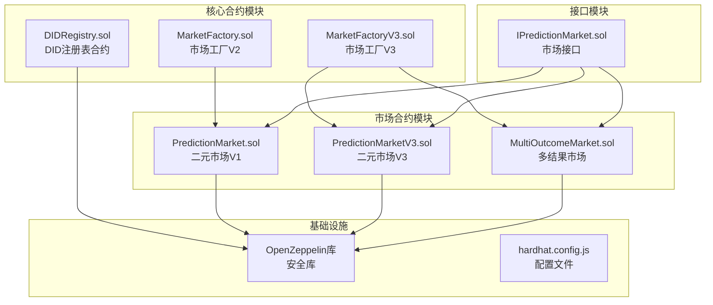
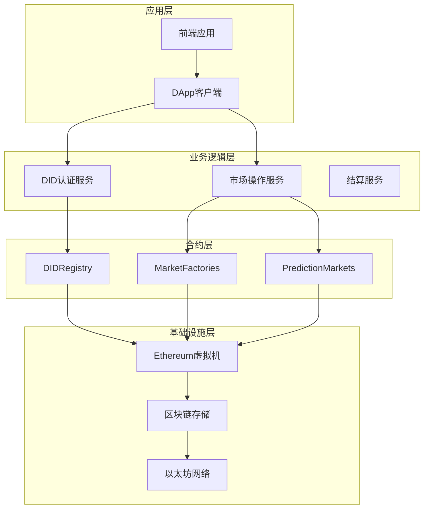
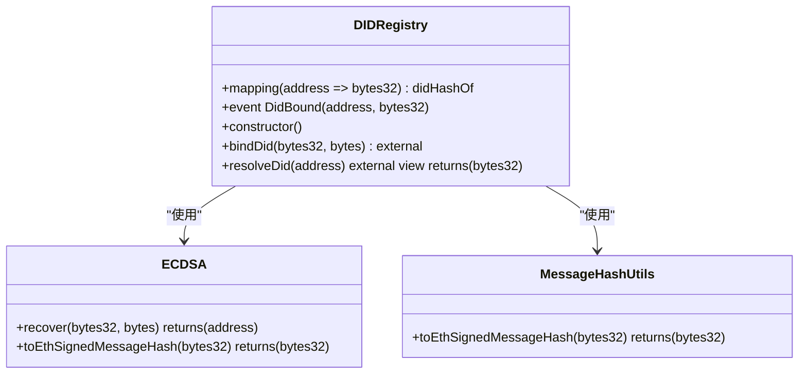
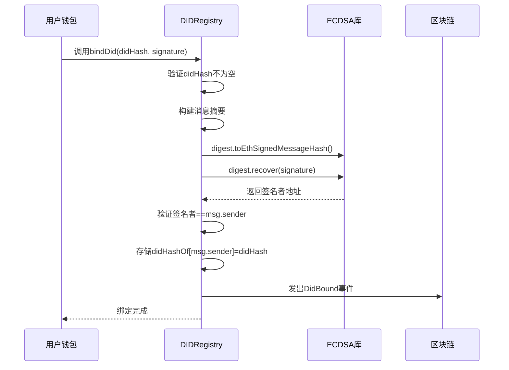
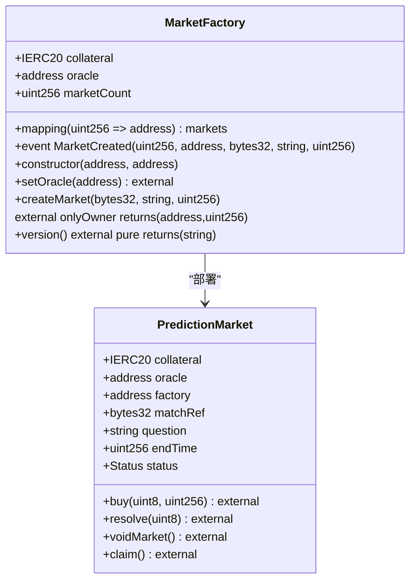
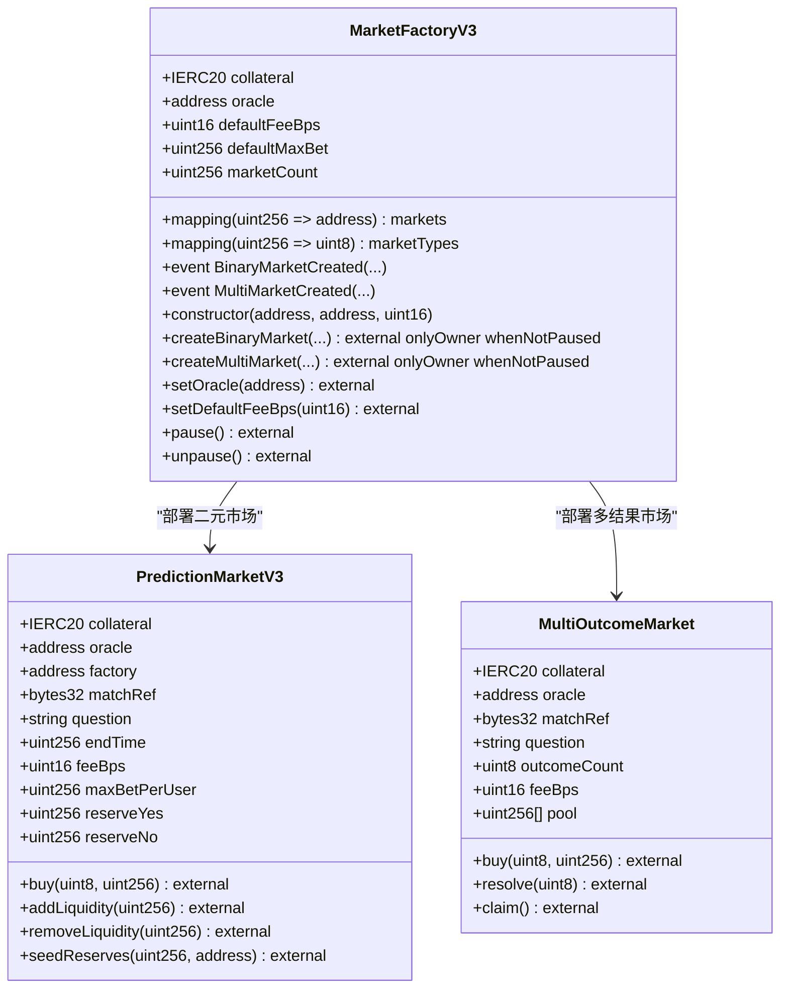
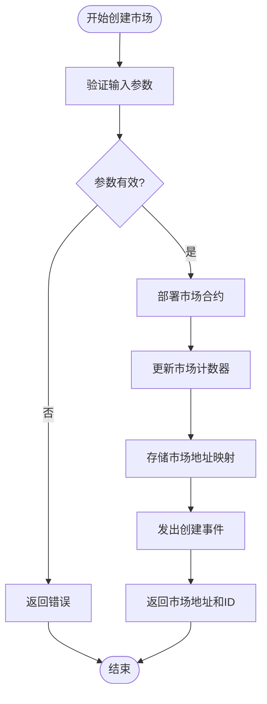
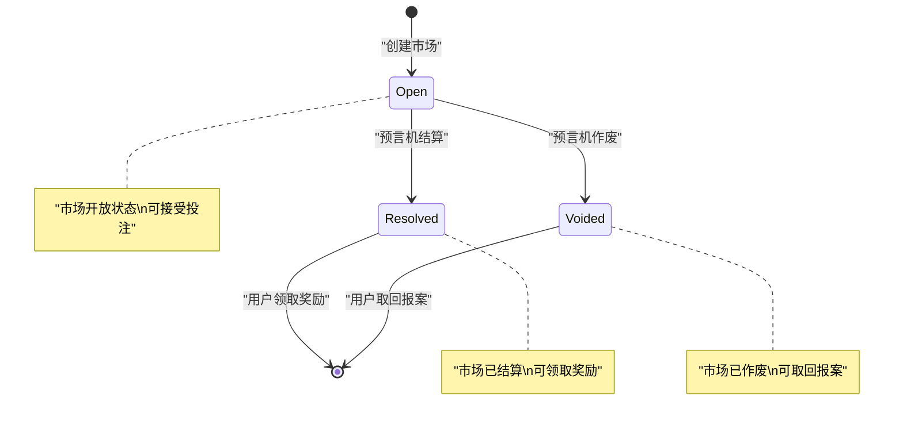
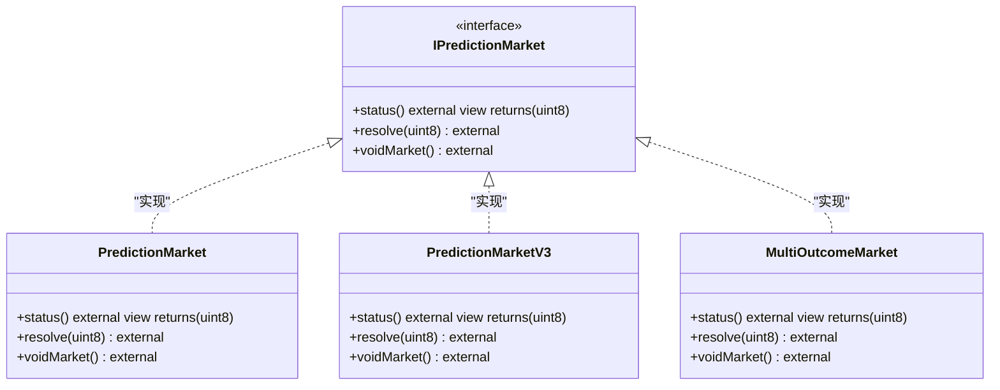
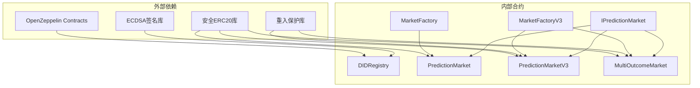

# DID认证系统

<cite>
**本文档引用的文件**
- [DIDRegistry.sol](file://contracts/contracts/DIDRegistry.sol)
- [DIDRegistry.json](file://contracts/artifacts/contracts/DIDRegistry.sol/DIDRegistry.json)
- [MarketFactory.sol](file://contracts/contracts/MarketFactory.sol)
- [MarketFactoryV3.sol](file://contracts/contracts/MarketFactoryV3.sol)
- [PredictionMarket.sol](file://contracts/contracts/PredictionMarket.sol)
- [PredictionMarketV3.sol](file://contracts/contracts/PredictionMarketV3.sol)
- [MultiOutcomeMarket.sol](file://contracts/contracts/MultiOutcomeMarket.sol)
- [IPredictionMarket.sol](file://contracts/contracts/interfaces/IPredictionMarket.sol)
- [hardhat.config.js](file://contracts/hardhat.config.js)
- [deploy.js](file://contracts/scripts/deploy.js)
- [seed-markets.js](file://contracts/scripts/seed-markets.js)
- [Phase3.test.js](file://contracts/test/Phase3.test.js)
- [PredictionMarket.test.js](file://contracts/test/PredictionMarket.test.js)
</cite>

## 目录
1. [简介](#简介)
2. [项目结构](#项目结构)
3. [核心组件](#核心组件)
4. [架构概览](#架构概览)
5. [详细组件分析](#详细组件分析)
6. [依赖关系分析](#依赖关系分析)
7. [性能考虑](#性能考虑)
8. [故障排除指南](#故障排除指南)
9. [结论](#结论)
10. [附录](#附录)

## 简介
本项目是一个基于以太坊的预测市场平台，集成了去中心化身份（DID）认证功能。系统采用OpenZeppelin合约库构建，支持二元和多结果预测市场，具备完整的市场生命周期管理能力。

系统的核心特性包括：
- **DID认证系统**：通过链上DID哈希绑定实现用户身份验证
- **多市场支持**：支持二元市场和多结果市场
- **CPMM机制**：采用常数乘积市场 Maker（CPMM）模型
- **手续费系统**：支持可配置的交易手续费
- **预言机集成**：通过预言机进行市场结算和作废

## 项目结构
项目采用模块化设计，主要包含以下核心模块：



**图表来源**
- [DIDRegistry.sol:1-39](file://contracts/contracts/DIDRegistry.sol#L1-L39)
- [MarketFactory.sol:1-68](file://contracts/contracts/MarketFactory.sol#L1-L68)
- [MarketFactoryV3.sol:1-104](file://contracts/contracts/MarketFactoryV3.sol#L1-L104)

**章节来源**
- [hardhat.config.js:1-33](file://contracts/hardhat.config.js#L1-L33)

## 核心组件
系统由四个主要组件构成，每个组件都有明确的职责分工：

### DID注册表组件
DID注册表是整个认证系统的核心，负责管理用户身份与DID哈希的绑定关系。

### 市场工厂组件
市场工厂负责创建和管理各种类型的预测市场，提供标准化的市场部署流程。

### 预测市场组件
预测市场实现具体的交易逻辑，支持不同的市场模型和结算机制。

### 接口定义组件
接口定义确保不同版本的市场合约具有一致的API规范。

**章节来源**
- [DIDRegistry.sol:12-38](file://contracts/contracts/DIDRegistry.sol#L12-L38)
- [MarketFactory.sol:12-67](file://contracts/contracts/MarketFactory.sol#L12-L67)
- [MarketFactoryV3.sol:14-103](file://contracts/contracts/MarketFactoryV3.sol#L14-L103)

## 架构概览
系统采用分层架构设计，从底层基础设施到上层应用形成清晰的层次结构：



**图表来源**
- [DIDRegistry.sol:12-38](file://contracts/contracts/DIDRegistry.sol#L12-L38)
- [MarketFactoryV3.sol:14-103](file://contracts/contracts/MarketFactoryV3.sol#L14-L103)

## 详细组件分析

### DID注册表合约分析

DID注册表合约实现了去中心化身份的核心功能，通过密码学签名验证确保身份绑定的安全性。

#### 核心数据结构
合约使用简单的映射表存储地址到DID哈希的对应关系：



**图表来源**
- [DIDRegistry.sol:12-38](file://contracts/contracts/DIDRegistry.sol#L12-L38)

#### 绑定流程序列图


**图表来源**
- [DIDRegistry.sol:23-32](file://contracts/contracts/DIDRegistry.sol#L23-L32)

#### 关键接口说明

**bindDid函数**
- 参数：`didHash` (bytes32) - DID哈希值
- 参数：`signature` (bytes) - 数字签名
- 返回：无
- 权限：外部可调用
- 功能：将DID哈希绑定到调用者地址

**resolveDid函数**
- 参数：`account` (address) - 要查询的账户地址
- 返回：`bytes32` - 对应的DID哈希值
- 权限：外部只读
- 功能：解析指定地址绑定的DID哈希

**章节来源**
- [DIDRegistry.sol:23-37](file://contracts/contracts/DIDRegistry.sol#L23-L37)
- [DIDRegistry.json:99-172](file://contracts/artifacts/contracts/DIDRegistry.sol/DIDRegistry.json#L99-L172)

### 市场工厂组件分析

市场工厂提供标准化的市场创建和管理功能，支持不同版本的市场合约。

#### 市场工厂V2架构


**图表来源**
- [MarketFactory.sol:12-67](file://contracts/contracts/MarketFactory.sol#L12-L67)

#### 市场工厂V3增强功能


**图表来源**
- [MarketFactoryV3.sol:14-103](file://contracts/contracts/MarketFactoryV3.sol#L14-L103)

#### 工厂创建流程


**图表来源**
- [MarketFactory.sol:44-61](file://contracts/contracts/MarketFactory.sol#L44-L61)

**章节来源**
- [MarketFactory.sol:12-67](file://contracts/contracts/MarketFactory.sol#L12-L67)
- [MarketFactoryV3.sol:14-103](file://contracts/contracts/MarketFactoryV3.sol#L14-L103)

### 预测市场组件分析

预测市场实现具体的交易逻辑，支持不同的市场模型和结算机制。

#### 二元市场V1架构
```mermaid
classDiagram
class PredictionMarket {
+enum Status {Open, Resolved, Voided}
+IERC20 collateral
+address oracle
+address factory
+bytes32 matchRef
+string question
+uint256 endTime
+Status status
+uint8 winningOutcome
+uint256 yesPool
+uint256 noPool
+mapping(address => uint256) yesBalance
+mapping(address => uint256) noBalance
+buy(uint8, uint256) external
+resolve(uint8) external
+voidMarket() external
+claim() external
}
class SafeERC20 {
+safeTransferFrom(address,address,uint256)
+safeTransfer(address,uint256)
}
PredictionMarket --> SafeERC20 : "使用"
```

**图表来源**
- [PredictionMarket.sol:11-145](file://contracts/contracts/PredictionMarket.sol#L11-L145)

#### 二元市场V3架构
```mermaid
classDiagram
class PredictionMarketV3 {
+enum Status {Open, Resolved, Voided}
+IERC20 collateral
+address oracle
+address factory
+bytes32 matchRef
+string question
+uint256 endTime
+uint16 feeBps
+uint256 maxBetPerUser
+uint256 reserveYes
+uint256 reserveNo
+uint256 totalLPSupply
+uint256 collectedFees
+mapping(address => uint256) yesBalance
+mapping(address => uint256) noBalance
+mapping(address => uint256) lpBalance
+buy(uint8, uint256) external
+addLiquidity(uint256) external
+removeLiquidity(uint256) external
+seedReserves(uint256, address) external
+getPoolState() external view
}
class ReentrancyGuard {
+modifier nonReentrant
}
class SafeERC20 {
+safeTransferFrom(address,address,uint256)
+safeTransfer(address,uint256)
}
PredictionMarketV3 --> ReentrancyGuard : "继承"
PredictionMarketV3 --> SafeERC20 : "使用"
```

**图表来源**
- [PredictionMarketV3.sol:12-218](file://contracts/contracts/PredictionMarketV3.sol#L12-L218)

#### 多结果市场架构
```mermaid
classDiagram
class MultiOutcomeMarket {
+enum Status {Open, Resolved, Voided}
+IERC20 collateral
+address oracle
+bytes32 matchRef
+string question
+uint8 outcomeCount
+uint16 feeBps
+uint256[] pool
+mapping(address => mapping(uint8 => uint256)) stake
+buy(uint8, uint256) external
+resolve(uint8) external
+claim() external
}
class ReentrancyGuard {
+modifier nonReentrant
}
MultiOutcomeMarket --> ReentrancyGuard : "继承"
```

**图表来源**
- [MultiOutcomeMarket.sol:12-124](file://contracts/contracts/MultiOutcomeMarket.sol#L12-L124)

#### 市场状态转换图


**图表来源**
- [PredictionMarket.sol:15-19](file://contracts/contracts/PredictionMarket.sol#L15-L19)
- [PredictionMarketV3.sol:16](file://contracts/contracts/PredictionMarketV3.sol#L16)

**章节来源**
- [PredictionMarket.sol:11-145](file://contracts/contracts/PredictionMarket.sol#L11-L145)
- [PredictionMarketV3.sol:12-218](file://contracts/contracts/PredictionMarketV3.sol#L12-L218)
- [MultiOutcomeMarket.sol:12-124](file://contracts/contracts/MultiOutcomeMarket.sol#L12-L124)

### 接口定义分析

接口定义确保了不同版本市场合约的一致性和互操作性。

#### 市场接口规范


**图表来源**
- [IPredictionMarket.sol:7-14](file://contracts/contracts/interfaces/IPredictionMarket.sol#L7-L14)

**章节来源**
- [IPredictionMarket.sol:7-14](file://contracts/contracts/interfaces/IPredictionMarket.sol#L7-L14)

## 依赖关系分析

系统采用模块化设计，各组件之间的依赖关系清晰明确：



**图表来源**
- [DIDRegistry.sol:6-8](file://contracts/contracts/DIDRegistry.sol#L6-L8)
- [PredictionMarket.sol:6-7](file://contracts/contracts/PredictionMarket.sol#L6-L7)
- [PredictionMarketV3.sol:6-8](file://contracts/contracts/PredictionMarketV3.sol#L6-L8)
- [MultiOutcomeMarket.sol:6-8](file://contracts/contracts/MultiOutcomeMarket.sol#L6-L8)

**章节来源**
- [DIDRegistry.sol:6-8](file://contracts/contracts/DIDRegistry.sol#L6-L8)
- [PredictionMarket.sol:6-7](file://contracts/contracts/PredictionMarket.sol#L6-L7)
- [PredictionMarketV3.sol:6-8](file://contracts/contracts/PredictionMarketV3.sol#L6-L8)
- [MultiOutcomeMarket.sol:6-8](file://contracts/contracts/MultiOutcomeMarket.sol#L6-L8)

## 性能考虑

系统在设计时充分考虑了性能优化和安全性要求：

### Gas优化策略
- **存储布局优化**：合理安排状态变量的存储位置，减少存储槽访问成本
- **批量操作**：通过工厂合约批量部署市场，降低部署成本
- **条件检查前置**：在函数开始处进行参数验证，避免不必要的Gas消耗

### 安全性措施
- **重入攻击防护**：V3版本市场合约使用ReentrancyGuard防止重入攻击
- **权限控制**：严格的身份验证和权限管理机制
- **输入验证**：全面的参数验证和边界检查

### 扩展性设计
- **模块化架构**：清晰的模块分离便于功能扩展
- **接口抽象**：通过接口定义实现合约间的松耦合
- **版本兼容**：支持多版本市场合约并存

## 故障排除指南

### 常见问题及解决方案

#### DID绑定失败
**问题描述**：用户无法成功绑定DID到钱包地址
**可能原因**：
- DID哈希为空值
- 数字签名无效或过期
- 签名者与调用者不匹配

**解决方案**：
1. 确认DID哈希值非空
2. 验证签名的有效性和时效性
3. 确保使用正确的私钥进行签名

#### 市场创建失败
**问题描述**：市场工厂无法创建新的预测市场
**可能原因**：
- 抵押品地址或预言机地址为零地址
- 市场截止时间设置在过去
- 工厂合约权限不足

**解决方案**：
1. 验证抵押品和预言机地址的有效性
2. 确保截止时间在未来时刻
3. 检查调用者的所有权权限

#### 交易执行异常
**问题描述**：用户在市场中进行交易时出现错误
**可能原因**：
- 市场状态不是开放状态
- 投注金额超出限制
- 资产余额不足

**解决方案**：
1. 确认市场处于开放状态
2. 检查用户的最大投注限额
3. 验证用户的资产余额

**章节来源**
- [DIDRegistry.sol:24-29](file://contracts/contracts/DIDRegistry.sol#L24-L29)
- [MarketFactory.sol:31-35](file://contracts/contracts/MarketFactory.sol#L31-L35)
- [PredictionMarket.sol:71-88](file://contracts/contracts/PredictionMarket.sol#L71-L88)

## 结论

本DID认证系统通过精心设计的合约架构，成功实现了去中心化身份验证与预测市场功能的有机结合。系统具有以下优势：

### 技术优势
- **安全性高**：采用经过审计的OpenZeppelin库，具备完善的权限控制和安全防护机制
- **扩展性强**：模块化设计支持功能扩展和版本演进
- **性能优化**：合理的Gas优化策略确保交易效率

### 实用价值
- **身份验证**：通过DID哈希绑定提供可信的身份标识
- **市场多样性**：支持二元和多结果市场，满足不同场景需求
- **自动化程度高**：通过工厂合约实现市场自动部署和管理

### 发展前景
系统为预测市场生态提供了坚实的基础，未来可以进一步扩展功能，如增加更多市场类型、优化用户体验、集成更多预言机等。

## 附录

### 配置选项说明

#### 编译器配置
- **Solidity版本**：0.8.24
- **优化器**：启用，运行200次
- **EVM版本**：Cancun

#### 网络配置
- **Hardhat网络**：链ID 31337
- **本地网络**：RPC地址 http://127.0.0.1:8545

### 部署脚本示例

#### 基础部署流程
```javascript
// 部署DID注册表
const registry = await Registry.deploy();
await registry.waitForDeployment();

// 部署市场工厂
const factory = await Factory.deploy(usdcAddr, adapterAddr);
await factory.waitForDeployment();

// 设置预言机权限
await adapter.setFactory(factoryAddr);
await adapter.grantOracle(deployer.address);
```

**章节来源**
- [hardhat.config.js:10-16](file://contracts/hardhat.config.js#L10-L16)
- [deploy.js:22-48](file://contracts/scripts/deploy.js#L22-L48)