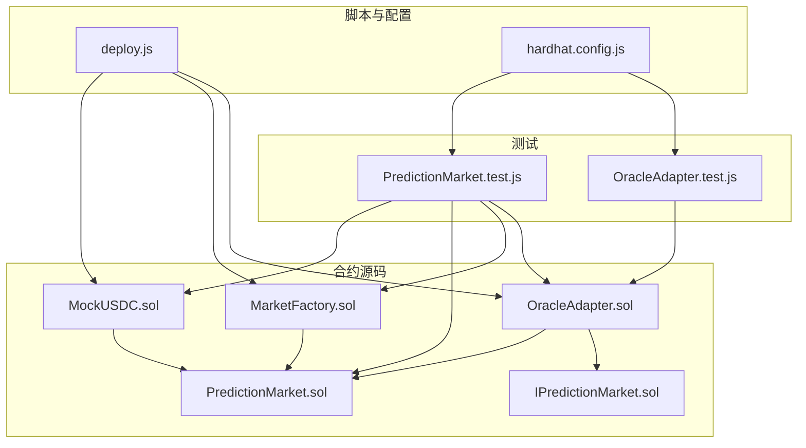
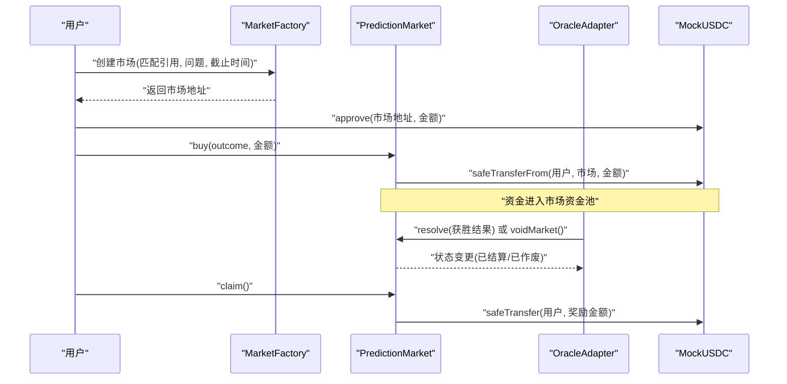
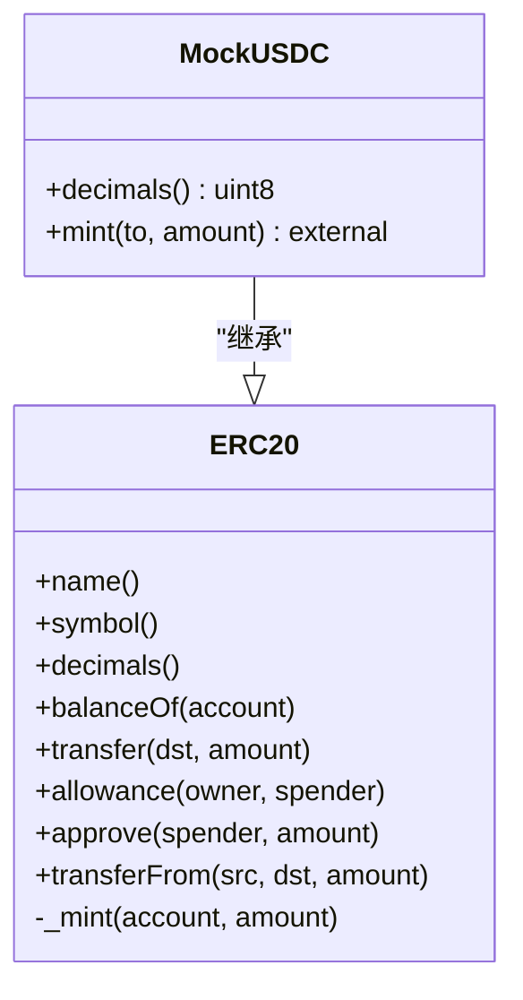
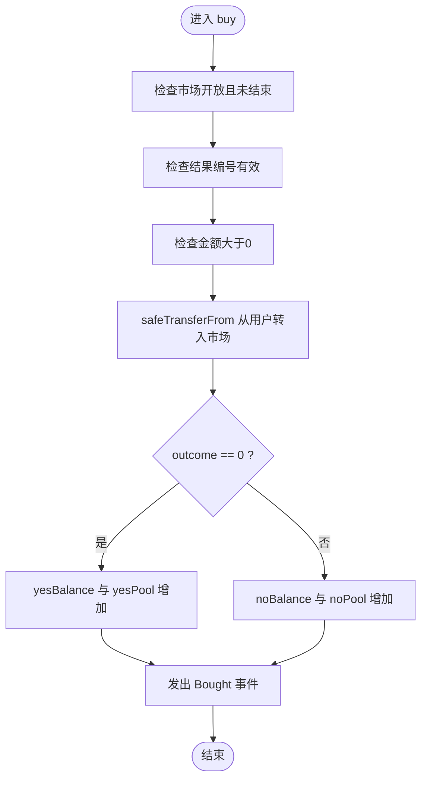
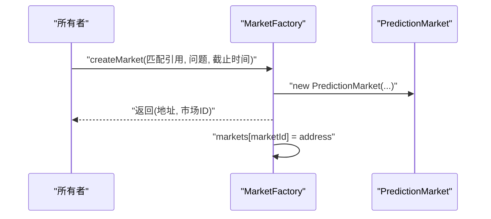
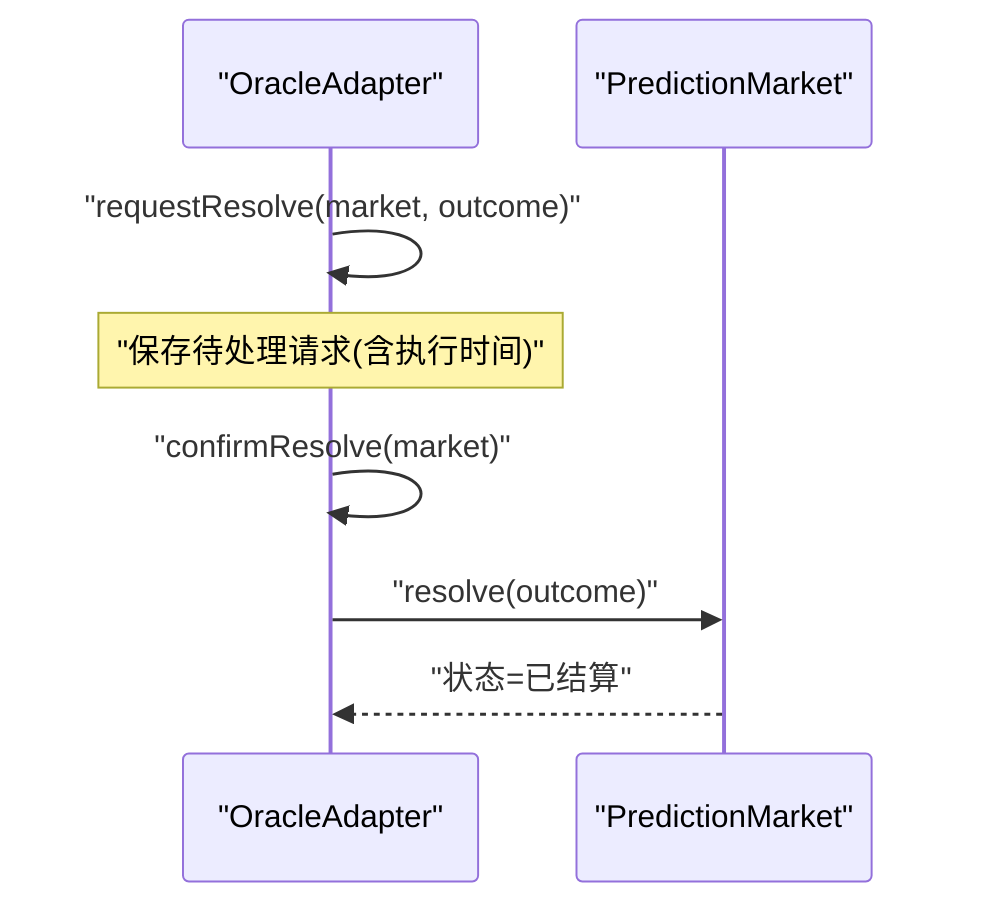
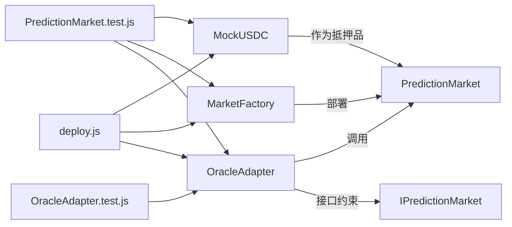

# 代币系统

<cite>
**本文档引用的文件**
- [MockUSDC.sol](file://contracts/MockUSDC.sol)
- [PredictionMarket.sol](file://contracts/PredictionMarket.sol)
- [MarketFactory.sol](file://contracts/MarketFactory.sol)
- [IPredictionMarket.sol](file://contracts/interfaces/IPredictionMarket.sol)
- [OracleAdapter.sol](file://contracts/OracleAdapter.sol)
- [PredictionMarket.test.js](file://test/PredictionMarket.test.js)
- [OracleAdapter.test.js](file://test/OracleAdapter.test.js)
- [deploy.js](file://scripts/deploy.js)
- [hardhat.config.js](file://hardhat.config.js)
</cite>

## 目录
1. [简介](#简介)
2. [项目结构](#项目结构)
3. [核心组件](#核心组件)
4. [架构总览](#架构总览)
5. [详细组件分析](#详细组件分析)
6. [依赖关系分析](#依赖关系分析)
7. [性能考虑](#性能考虑)
8. [故障排除指南](#故障排除指南)
9. [结论](#结论)
10. [附录](#附录)

## 简介
本文件面向代币系统（MockUSDC）与预测市场生态，提供从合约实现、调用关系、接口规范到测试与部署的完整技术文档。重点覆盖：
- MockUSDC 的实现细节与用途
- 代币管理机制（精度、铸造、授权与转账）
- 与预测市场合约（PredictionMarket）及工厂合约（MarketFactory）的协作方式
- 与预言机适配器（OracleAdapter）的结算流程
- 测试环境配置与常见问题排查

## 项目结构
该仓库采用按功能分层的组织方式：合约源码位于 contracts 目录，测试位于 test 目录，部署脚本位于 scripts 目录，Hardhat 配置位于根目录。

图表来源
- [MockUSDC.sol:1-24](file://contracts/MockUSDC.sol#L1-L24)
- [PredictionMarket.sol:1-145](file://contracts/PredictionMarket.sol#L1-L145)
- [MarketFactory.sol:1-68](file://contracts/MarketFactory.sol#L1-L68)
- [OracleAdapter.sol:1-200](file://contracts/OracleAdapter.sol#L1-L200)
- [IPredictionMarket.sol:1-15](file://contracts/interfaces/IPredictionMarket.sol#L1-L15)
- [PredictionMarket.test.js:1-77](file://test/PredictionMarket.test.js#L1-L77)
- [OracleAdapter.test.js:1-37](file://test/OracleAdapter.test.js#L1-L37)
- [deploy.js:1-60](file://scripts/deploy.js#L1-L60)
- [hardhat.config.js:1-33](file://hardhat.config.js#L1-L33)

章节来源
- [hardhat.config.js:1-33](file://hardhat.config.js#L1-L33)

## 核心组件
- MockUSDC：基于 OpenZeppelin ERC20 实现的测试代币，精度为 6 位（与 USDC 对齐），提供 mint 铸造能力，供测试环境发放抵押品。
- PredictionMarket：二元预测市场合约，支持“是/否”投注、资金池管理、结算与作废、奖励领取等。
- MarketFactory：工厂合约，负责部署 PredictionMarket，并集中管理预言机与抵押品。
- OracleAdapter：预言机适配器，封装结算请求、时间锁与快速结算路径，通过角色控制保证安全性。
- IPredictionMarket：预测市场接口，定义外部可调用的核心方法集合。

章节来源
- [MockUSDC.sol:1-24](file://contracts/MockUSDC.sol#L1-L24)
- [PredictionMarket.sol:1-145](file://contracts/PredictionMarket.sol#L1-L145)
- [MarketFactory.sol:1-68](file://contracts/MarketFactory.sol#L1-L68)
- [OracleAdapter.sol:1-200](file://contracts/OracleAdapter.sol#L1-L200)
- [IPredictionMarket.sol:1-15](file://contracts/interfaces/IPredictionMarket.sol#L1-L15)

## 架构总览
下图展示代币系统在预测市场中的关键交互：MockUSDC 作为抵押品，MarketFactory 部署 PredictionMarket，OracleAdapter 提供结算通道，用户通过授权与转账参与投注与领取。

图表来源
- [MarketFactory.sol:44-61](file://contracts/MarketFactory.sol#L44-L61)
- [PredictionMarket.sol:70-123](file://contracts/PredictionMarket.sol#L70-L123)
- [OracleAdapter.sol:60-83](file://contracts/OracleAdapter.sol#L60-L83)
- [MockUSDC.sol:20-22](file://contracts/MockUSDC.sol#L20-L22)

## 详细组件分析

### MockUSDC 组件分析
- 设计要点
  - 继承 ERC20，构造函数初始化名称与符号，便于识别与显示。
  - decimals 覆写为 6，与 USDC 保持一致，简化测试与前端显示。
  - mint 外部函数允许任意地址向目标地址增发代币，仅用于测试环境。
- 数据结构与复杂度
  - 余额与总供应量基于 ERC20 内部存储，读写均为 O(1)。
  - mint 为 O(1) 写操作。
- 错误处理与边界
  - 仅在测试中使用，不涉及权限控制；生产环境应替换为真实稳定币。
- 性能影响
  - 6 位精度减少前端换算开销，提升 UX；对链上 gas 无显著差异。

图表来源
- [MockUSDC.sol:6-22](file://contracts/MockUSDC.sol#L6-L22)

章节来源
- [MockUSDC.sol:1-24](file://contracts/MockUSDC.sol#L1-L24)

### PredictionMarket 组件分析
- 功能概述
  - 支持“是/否”二元投注，资金进入对应资金池。
  - 仅预言机可调用结算/作废；支持时间锁或快速结算。
  - 领取阶段根据结算或作废规则进行奖励分配。
- 关键接口与行为
  - buy(outcome, amount)：校验状态、截止时间、结果编号与金额，从用户转账至市场，并更新资金池与用户余额。
  - resolve(winningOutcome)：仅预言机调用，标记市场为已结算。
  - voidMarket()：仅预言机调用，标记市场为已作废。
  - claim()：根据状态计算奖励，转账给用户。
  - _payoutResolved(user)：按用户在获胜方的押注占获胜方总池的比例分配总池。
- 数据模型
  - 状态枚举：Open、Resolved、Voided。
  - 资金池：yesPool、noPool。
  - 用户余额：yesBalance、noBalance。
  - 其他：question、endTime、oracle、factory、matchRef 等。

图表来源
- [PredictionMarket.sol:70-88](file://contracts/PredictionMarket.sol#L70-L88)

章节来源
- [PredictionMarket.sol:1-145](file://contracts/PredictionMarket.sol#L1-L145)

### MarketFactory 组件分析
- 职责
  - 以 Ownable 管理权限，仅所有者可设置预言机与创建市场。
  - 部署 PredictionMarket 并维护市场映射。
- 关键接口
  - setOracle(address)：仅所有者，更新预言机地址。
  - createMarket(bytes32, string calldata, uint256)：仅所有者，部署市场并登记。
  - version()：返回当前版本字符串。

图表来源
- [MarketFactory.sol:44-61](file://contracts/MarketFactory.sol#L44-L61)

章节来源
- [MarketFactory.sol:1-68](file://contracts/MarketFactory.sol#L1-L68)

### OracleAdapter 组件分析
- 职责
  - 作为预言机入口，统一处理结算请求与确认，支持时间锁。
  - 通过 AccessControl 控制 ORACLE_ROLE，限制调用者。
- 关键流程
  - requestResolve(market, outcome)：在时间锁期内保存待处理请求。
  - confirmResolve(market)：时间锁到期后执行结算，调用市场合约 resolve。
  - resolveNow(market, outcome)：当时间锁为 0 时直接结算。
- 与市场接口的契约
  - 通过 IPredictionMarket 强约束市场合约需实现状态查询与结算/作废方法。

图表来源
- [OracleAdapter.sol:60-83](file://contracts/OracleAdapter.sol#L60-L83)
- [IPredictionMarket.sol:8-14](file://contracts/interfaces/IPredictionMarket.sol#L8-L14)

章节来源
- [OracleAdapter.sol:1-200](file://contracts/OracleAdapter.sol#L1-L200)
- [IPredictionMarket.sol:1-15](file://contracts/interfaces/IPredictionMarket.sol#L1-L15)

### 接口与使用模式
- IPredictionMarket 接口
  - 方法：status()、resolve(uint8)、voidMarket()。
  - 作用：对外暴露市场状态与结算控制，便于适配器与外部系统集成。
- 使用模式
  - 投注：用户先 approve，再调用 buy(outcome, amount)。
  - 结算：预言机通过 OracleAdapter.requestResolve/confirmResolve 或 resolveNow 进行结算。
  - 领取：用户在市场结算或作废后调用 claim()。

章节来源
- [IPredictionMarket.sol:1-15](file://contracts/interfaces/IPredictionMarket.sol#L1-L15)
- [PredictionMarket.sol:70-123](file://contracts/PredictionMarket.sol#L70-L123)
- [OracleAdapter.sol:60-83](file://contracts/OracleAdapter.sol#L60-L83)

## 依赖关系分析
- 合约依赖
  - MockUSDC 依赖 OpenZeppelin ERC20。
  - PredictionMarket 依赖 IERC20 与 SafeERC20。
  - MarketFactory 依赖 Ownable 与 IERC20。
  - OracleAdapter 依赖 AccessControl 与 IPredictionMarket。
- 测试依赖
  - 测试脚本通过 Hardhat Ethers 获取合约工厂与实例，模拟用户、预言机与工厂交互。
- 部署脚本
  - 自动部署 MockUSDC、OracleAdapter、DIDRegistry、MarketFactory，并授予预言机角色与初始铸造。

图表来源
- [MockUSDC.sol:6-22](file://contracts/MockUSDC.sol#L6-L22)
- [PredictionMarket.sol:6-12](file://contracts/PredictionMarket.sol#L6-L12)
- [MarketFactory.sol:6-8](file://contracts/MarketFactory.sol#L6-L8)
- [OracleAdapter.sol:1-20](file://contracts/OracleAdapter.sol#L1-L20)
- [IPredictionMarket.sol:1-15](file://contracts/interfaces/IPredictionMarket.sol#L1-L15)
- [PredictionMarket.test.js:1-34](file://test/PredictionMarket.test.js#L1-L34)
- [OracleAdapter.test.js:1-37](file://test/OracleAdapter.test.js#L1-L37)
- [deploy.js:11-32](file://scripts/deploy.js#L11-L32)

章节来源
- [PredictionMarket.sol:6-12](file://contracts/PredictionMarket.sol#L6-L12)
- [MarketFactory.sol:6-8](file://contracts/MarketFactory.sol#L6-L8)
- [OracleAdapter.sol:1-20](file://contracts/OracleAdapter.sol#L1-L20)
- [PredictionMarket.test.js:1-34](file://test/PredictionMarket.test.js#L1-L34)
- [OracleAdapter.test.js:1-37](file://test/OracleAdapter.test.js#L1-L37)
- [deploy.js:11-32](file://scripts/deploy.js#L11-L32)

## 性能考虑
- 代币精度与前端显示
  - MockUSDC 使用 6 位精度，降低前端换算成本，提升用户体验。
- 转账与授权
  - 使用 SafeERC20 的 safeTransferFrom/safeTransfer，避免回退导致的资源泄漏。
- 结算路径
  - 时间锁路径增加一次存储与时间判断，但保障了治理安全；0 时间锁路径更高效。
- Gas 优化
  - 合约内多数为 O(1) 操作；建议在批量操作时合并交易以降低总体 gas。

## 故障排除指南
- 非预言机调用结算
  - 现象：调用 resolve 或 voidMarket 报错“not oracle”。
  - 解决：确保调用者具备预言机角色，或使用 OracleAdapter 的请求/确认流程。
- 重复领取
  - 现象：claim 报错“already claimed”。
  - 解决：确认用户尚未领取，或等待市场状态变化。
- 领取失败（无可领）
  - 现象：claim 报错“nothing to claim”。
  - 解决：仅在市场已结算且用户在获胜方有押注，或市场作废时可领取。
- 非法输入
  - 现象：buy/outcome/resolve 参数非法导致回退。
  - 解决：确保 outcome 为 0 或 1，amount > 0，且市场处于开放且未结束状态。
- 时间锁未过期
  - 现象：confirmResolve 报错“timelock”。
  - 解决：等待时间锁到期后再确认，或在部署时将时间锁设为 0 使用 resolveNow。

章节来源
- [PredictionMarket.test.js:56-75](file://test/PredictionMarket.test.js#L56-L75)
- [OracleAdapter.test.js:8-27](file://test/OracleAdapter.test.js#L8-L27)
- [PredictionMarket.sol:70-123](file://contracts/PredictionMarket.sol#L70-L123)
- [OracleAdapter.sol:70-83](file://contracts/OracleAdapter.sol#L70-L83)

## 结论
本代币系统以 MockUSDC 为核心测试资产，结合 MarketFactory、PredictionMarket 与 OracleAdapter 形成完整的预测市场基础设施。通过严格的权限控制、明确的状态机与清晰的接口契约，系统在测试环境中实现了高可用性与可扩展性。建议在生产环境替换为真实稳定币与多重签名治理方案，并引入更完善的审计与监控机制。

## 附录

### 配置选项与参数
- 部署脚本参数
  - ORACLE_TIMELOCK_SECONDS：预言机时间锁延迟（秒），默认 120。
  - 部署产物包含：chainId、mockUSDC、oracleAdapter、didRegistry、marketFactory、oracle、timelockSeconds、deployedAt。
- Hardhat 配置
  - 编译器版本：0.8.24
  - 优化器：enabled=true, runs=200
  - EVM 版本：cancun
  - 网络：hardhat（chainId=31337）、localhost（url=http://127.0.0.1:8545）

章节来源
- [deploy.js:8-52](file://scripts/deploy.js#L8-L52)
- [hardhat.config.js:10-25](file://hardhat.config.js#L10-L25)

### 返回值与事件
- PredictionMarket
  - 事件：Bought、Resolved、Claimed、MarketVoided
  - 状态：0=Open、1=Resolved、2=Voided
- MarketFactory
  - 事件：MarketCreated
- OracleAdapter
  - 事件：OracleResolveRequested、OracleResolveConfirmed

章节来源
- [PredictionMarket.sol:38-41](file://contracts/PredictionMarket.sol#L38-L41)
- [MarketFactory.sol:21-27](file://contracts/MarketFactory.sol#L21-L27)
- [OracleAdapter.sol:1-200](file://contracts/OracleAdapter.sol#L1-L200)