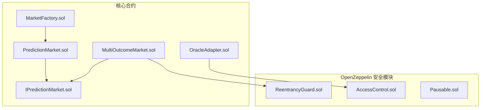
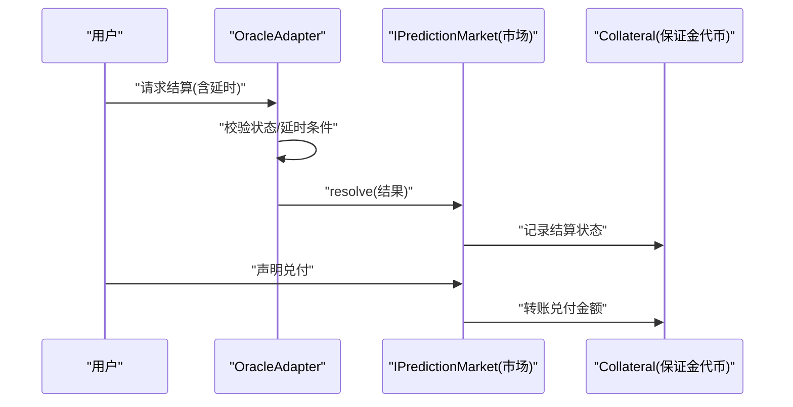
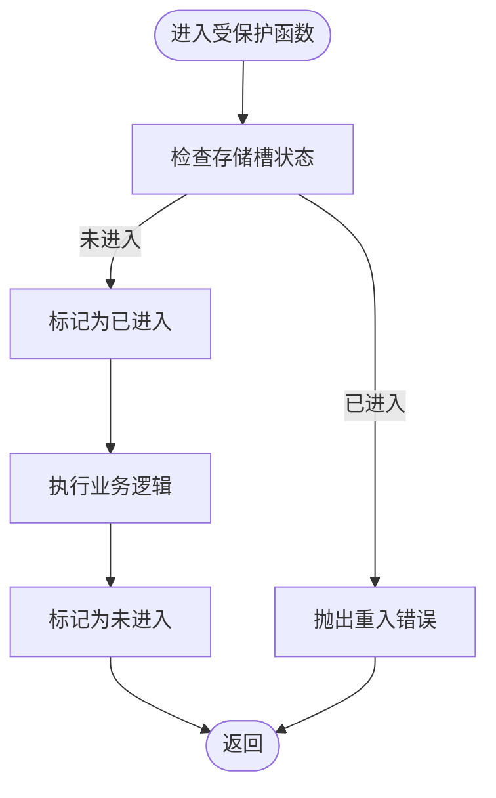
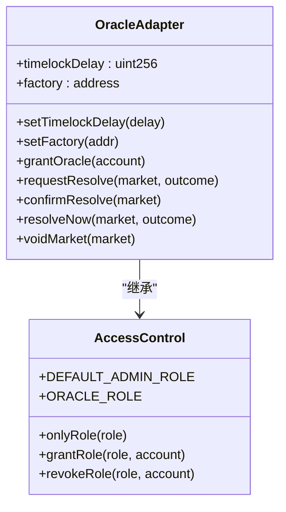
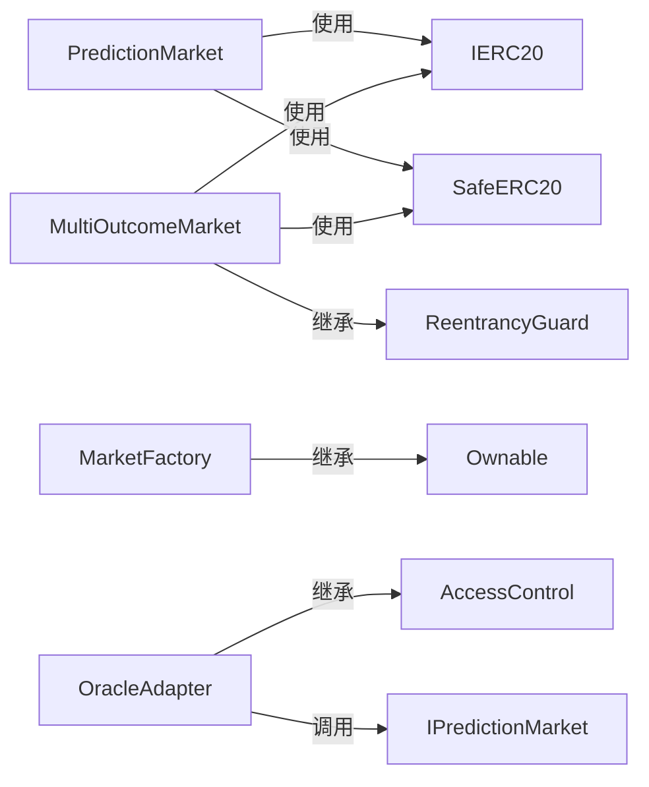

# 安全分析

<cite>
**本文引用的文件**
- [PredictionMarket.sol](file://contracts/contracts/PredictionMarket.sol)
- [MultiOutcomeMarket.sol](file://contracts/contracts/MultiOutcomeMarket.sol)
- [MarketFactory.sol](file://contracts/contracts/MarketFactory.sol)
- [OracleAdapter.sol](file://contracts/contracts/OracleAdapter.sol)
- [IPredictionMarket.sol](file://contracts/contracts/interfaces/IPredictionMarket.sol)
- [ReentrancyGuard.sol](file://node_modules/@openzeppelin/contracts/utils/ReentrancyGuard.sol)
- [AccessControl.sol](file://node_modules/@openzeppelin/contracts/access/AccessControl.sol)
- [Pausable.sol](file://node_modules/@openzeppelin/contracts/utils/Pausable.sol)
- [PredictionMarket.test.js](file://test/PredictionMarket.test.js)
</cite>

## 目录
1. [引言](#引言)
2. [项目结构](#项目结构)
3. [核心组件](#核心组件)
4. [架构总览](#架构总览)
5. [详细组件分析](#详细组件分析)
6. [依赖关系分析](#依赖关系分析)
7. [性能与安全权衡](#性能与安全权衡)
8. [故障排查指南](#故障排查指南)
9. [结论](#结论)
10. [附录：安全审计清单与测试案例](#附录安全审计清单与测试案例)

## 引言
本文件面向预测市场系统，聚焦于安全威胁与防护机制，系统性解析以下主题：
- 预测市场的潜在安全威胁与攻击向量
- 重入攻击防护机制与 ReentrancyGuard 的实现原理
- 访问控制机制与 AccessControl 的安全设计
- Pausable 暂停功能的安全考量与使用场景
- 安全编码最佳实践与常见漏洞预防
- 安全审计标准流程与检查清单
- 具体安全测试案例与模拟攻击场景
- 如何建立安全的开发与部署流程

## 项目结构
该仓库采用按功能模块划分的组织方式，核心合约围绕“市场”“工厂”“预言机适配器”“接口”展开；同时通过 OpenZeppelin 合约复用通用安全模块（重入保护、访问控制、暂停）。

图表来源
- [PredictionMarket.sol](file://contracts/contracts/PredictionMarket.sol#L1-L134)
- [MultiOutcomeMarket.sol](file://contracts/contracts/MultiOutcomeMarket.sol#L1-L113)
- [MarketFactory.sol](file://contracts/contracts/MarketFactory.sol#L1-L60)
- [OracleAdapter.sol](file://contracts/contracts/OracleAdapter.sol#L1-L83)
- [IPredictionMarket.sol](file://contracts/contracts/interfaces/IPredictionMarket.sol#L1-L9)
- [ReentrancyGuard.sol](file://node_modules/@openzeppelin/contracts/utils/ReentrancyGuard.sol#L1-L120)
- [AccessControl.sol](file://node_modules/@openzeppelin/contracts/access/AccessControl.sol#L1-L208)
- [Pausable.sol](file://node_modules/@openzeppelin/contracts/utils/Pausable.sol#L1-L113)

章节来源
- [PredictionMarket.sol](file://contracts/contracts/PredictionMarket.sol#L1-L134)
- [MultiOutcomeMarket.sol](file://contracts/contracts/MultiOutcomeMarket.sol#L1-L113)
- [MarketFactory.sol](file://contracts/contracts/MarketFactory.sol#L1-L60)
- [OracleAdapter.sol](file://contracts/contracts/OracleAdapter.sol#L1-L83)
- [IPredictionMarket.sol](file://contracts/contracts/interfaces/IPredictionMarket.sol#L1-L9)

## 核心组件
- PredictionMarket：二元预测市场，支持买入、结算、退费、声明兑付，内置仅预言机可调用的结算/作废函数。
- MultiOutcomeMarket：多结果预测市场，继承 ReentrancyGuard，支持手续费、多池、声明兑付。
- MarketFactory：所有者权限管理，负责部署二元市场实例，维护市场映射。
- OracleAdapter：基于 AccessControl 的预言机适配层，提供延时执行的 resolve/void 能力，支持管理员角色变更。
- 接口 IPredictionMarket：统一市场能力接口，供适配器调用。

章节来源
- [PredictionMarket.sol](file://contracts/contracts/PredictionMarket.sol#L1-L134)
- [MultiOutcomeMarket.sol](file://contracts/contracts/MultiOutcomeMarket.sol#L1-L113)
- [MarketFactory.sol](file://contracts/contracts/MarketFactory.sol#L1-L60)
- [OracleAdapter.sol](file://contracts/contracts/OracleAdapter.sol#L1-L83)
- [IPredictionMarket.sol](file://contracts/contracts/interfaces/IPredictionMarket.sol#L1-L9)

## 架构总览
预测市场的安全架构以“职责分离 + 多层访问控制 + 状态约束”为核心：
- 市场合约只处理资金与状态，不直接参与结果判定；
- 预言机适配器集中管理结果与作废能力，并引入延时窗口降低抢先交易风险；
- 工厂合约通过 Ownable/AccessControl 控制部署与参数修改；
- 多结果市场直接采用 ReentrancyGuard 防护，二元市场通过自定义修饰符实现等价保护思路。

图表来源
- [OracleAdapter.sol](file://contracts/contracts/OracleAdapter.sol#L48-L75)
- [IPredictionMarket.sol](file://contracts/contracts/interfaces/IPredictionMarket.sol#L1-L9)
- [PredictionMarket.sol](file://contracts/contracts/PredictionMarket.sol#L83-L95)
- [MultiOutcomeMarket.sol](file://contracts/contracts/MultiOutcomeMarket.sol#L76-L87)

## 详细组件分析

### 重入攻击防护与 ReentrancyGuard 实现原理
- MultiOutcomeMarket 显式继承 ReentrancyGuard，并在关键函数 buy/claim 上标注 nonReentrant，确保同一调用栈内不会重复进入受保护函数。
- ReentrancyGuard 使用存储槽保存“进入/未进入”状态，在进入前写入“已进入”，退出后恢复“未进入”。若检测到已在“已进入”状态再次进入，将触发错误。
- 注意事项：
  - 函数间互相调用受保护函数需改为外部入口+内部私有实现，避免递归触发保护；
  - 视函数（view/pure）应使用非受保护版本，防止读取不一致状态。

图表来源
- [ReentrancyGuard.sol](file://node_modules/@openzeppelin/contracts/utils/ReentrancyGuard.sol#L69-L106)
- [MultiOutcomeMarket.sol](file://contracts/contracts/MultiOutcomeMarket.sol#L65-L74)
- [MultiOutcomeMarket.sol](file://contracts/contracts/MultiOutcomeMarket.sol#L89-L111)

章节来源
- [ReentrancyGuard.sol](file://node_modules/@openzeppelin/contracts/utils/ReentrancyGuard.sol#L1-L120)
- [MultiOutcomeMarket.sol](file://contracts/contracts/MultiOutcomeMarket.sol#L1-L113)

### 访问控制机制与 AccessControl 的安全设计
- OracleAdapter 使用 AccessControl，定义 DEFAULT_ADMIN_ROLE 与 ORACLE_ROLE，仅授权账户可请求/确认结算或作废。
- 关键安全点：
  - 管理员可设置延时、工厂地址、授予/撤销预言机角色；
  - resolve/void 必须由 ORACLE_ROLE 调用，且需满足市场处于开放状态；
  - 延时窗口（timelockDelay）可设为 0 时走“即时路径”，否则必须等待延时到期后确认执行；
  - 通过 onlyRole 修饰符强制角色校验，避免误用。

图表来源
- [OracleAdapter.sol](file://contracts/contracts/OracleAdapter.sol#L1-L83)
- [AccessControl.sol](file://node_modules/@openzeppelin/contracts/access/AccessControl.sol#L49-L208)

章节来源
- [OracleAdapter.sol](file://contracts/contracts/OracleAdapter.sol#L1-L83)
- [AccessControl.sol](file://node_modules/@openzeppelin/contracts/access/AccessControl.sol#L1-L208)

### Pausable 暂停功能的安全考虑与使用场景
- Pausable 提供 whenNotPaused/whenPaused 修饰符与 _pause/_unpause 能力，用于紧急状态下阻止危险操作。
- 在预测市场中的适用场景建议：
  - 发现重大漏洞或争议事件时，暂停所有市场相关操作，待修复与审计后再恢复；
  - 与 AccessControl 结合，仅管理员可触发暂停/恢复；
  - 暂停期间应对外披露原因与预计恢复时间，保障透明度。
- 当前代码未直接使用 Pausable，但可在工厂或适配器层面引入以增强应急响应能力。

章节来源
- [Pausable.sol](file://node_modules/@openzeppelin/contracts/utils/Pausable.sol#L1-L113)
- [MarketFactory.sol](file://contracts/contracts/MarketFactory.sol#L1-L60)
- [OracleAdapter.sol](file://contracts/contracts/OracleAdapter.sol#L1-L83)

### 预测市场安全威胁与攻击向量
- 重入攻击：若声明兑付逻辑在转账前未更新状态，恶意合约可能在回调中重复触发兑付。
  - 防护：MultiOutcomeMarket 已采用 ReentrancyGuard；二元市场通过 onlyOracle 与状态机约束降低风险。
- 仅预言机访问控制绕过：若 ORACLE_ROLE 配置不当，可能导致任意账户结算/作废。
  - 防护：严格管理员治理，最小权限原则，定期审计角色分配。
- 延迟窗口滥用：短延时或无延时可能被抢先交易利用。
  - 防护：合理设置 timelockDelay，必要时启用 onlyRole 限制即时路径。
- 状态竞态与顺序依赖：买入/结算/兑付顺序不当可能导致状态不一致。
  - 防护：严格的枚举状态机与前置条件校验。

章节来源
- [MultiOutcomeMarket.sol](file://contracts/contracts/MultiOutcomeMarket.sol#L1-L113)
- [PredictionMarket.sol](file://contracts/contracts/PredictionMarket.sol#L1-L134)
- [OracleAdapter.sol](file://contracts/contracts/OracleAdapter.sol#L1-L83)

### 二元市场与多结果市场的安全对比
- 二元市场：
  - 使用自定义修饰符限制结算/作废仅限预言机；
  - 声明兑付前检查状态与是否已兑付，避免重复兑付；
  - 采用 SafeERC20 转账，降低失败回滚风险。
- 多结果市场：
  - 继承 ReentrancyGuard 并在关键函数上标注 nonReentrant；
  - 支持手续费计算与多池聚合，兑付公式明确，减少溢出/除零风险；
  - 对空池兑付进行显式校验。

章节来源
- [PredictionMarket.sol](file://contracts/contracts/PredictionMarket.sol#L1-L134)
- [MultiOutcomeMarket.sol](file://contracts/contracts/MultiOutcomeMarket.sol#L1-L113)

## 依赖关系分析
- PredictionMarket 依赖 IERC20 与 SafeERC20，状态机清晰，但未使用 ReentrancyGuard；
- MultiOutcomeMarket 依赖 IERC20、SafeERC20、ReentrancyGuard，具备更强的重入防护；
- MarketFactory 依赖 Ownable，提供所有者权限与参数配置；
- OracleAdapter 依赖 AccessControl，提供角色化权限与延时结算；
- IPredictionMarket 作为统一接口，便于适配器对不同市场类型进行操作。

图表来源
- [PredictionMarket.sol](file://contracts/contracts/PredictionMarket.sol#L4-L9)
- [MultiOutcomeMarket.sol](file://contracts/contracts/MultiOutcomeMarket.sol#L4-L10)
- [MarketFactory.sol](file://contracts/contracts/MarketFactory.sol#L4)
- [OracleAdapter.sol](file://contracts/contracts/OracleAdapter.sol#L4)
- [IPredictionMarket.sol](file://contracts/contracts/interfaces/IPredictionMarket.sol#L1-L9)

章节来源
- [PredictionMarket.sol](file://contracts/contracts/PredictionMarket.sol#L1-L134)
- [MultiOutcomeMarket.sol](file://contracts/contracts/MultiOutcomeMarket.sol#L1-L113)
- [MarketFactory.sol](file://contracts/contracts/MarketFactory.sol#L1-L60)
- [OracleAdapter.sol](file://contracts/contracts/OracleAdapter.sol#L1-L83)
- [IPredictionMarket.sol](file://contracts/contracts/interfaces/IPredictionMarket.sol#L1-L9)

## 性能与安全权衡
- ReentrancyGuard 使用存储槽记录状态，带来少量额外写入成本；在高并发场景下，建议：
  - 将受保护函数拆分为外部入口与内部实现，避免相互调用；
  - 合理设计状态更新顺序，减少跨池/跨映射写入次数。
- AccessControl 的角色查询为 O(1)，适合频繁权限判断场景；注意避免在热路径中进行复杂角色链遍历。
- Pausable 在暂停期间会阻断关键操作，建议仅在极端情况下启用，并配合事件日志与公告。

## 故障排查指南
- 声明兑付失败“尚未可兑付”：检查市场状态是否为已结算或已作废，兑付前需满足状态条件。
- 重复兑付失败“已兑付”：确认 claimed 映射是否正确更新，避免重放攻击。
- 非预言机结算失败“非预言机”：核对 OracleAdapter 的角色授予与调用方地址。
- 延时结算未生效：确认 timelockDelay 设置与当前区块时间，确保在延时结束后再调用确认。

章节来源
- [PredictionMarket.sol](file://contracts/contracts/PredictionMarket.sol#L97-L113)
- [MultiOutcomeMarket.sol](file://contracts/contracts/MultiOutcomeMarket.sol#L89-L111)
- [OracleAdapter.sol](file://contracts/contracts/OracleAdapter.sol#L48-L75)

## 结论
该预测市场体系通过“工厂-市场-适配器-接口”的分层设计，结合 OpenZeppelin 的访问控制与重入防护，构建了较为完善的安全基线。二元市场通过状态机与仅预言机控制有效降低了常见风险；多结果市场进一步强化了重入防护。建议在生产环境中补充 Pausable 应急机制、完善角色治理流程，并持续进行安全审计与渗透测试。

## 附录：安全审计清单与测试案例

### 安全审计清单
- 访问控制
  - 是否仅授权角色可执行关键操作（结算/作废/参数修改）
  - 是否存在默认管理员权限滥用风险
  - 角色授予/撤销流程是否可追溯
- 重入防护
  - 所有涉及外部转账与状态更新的关键函数是否受保护
  - 是否避免函数间相互调用受保护函数
- 状态一致性
  - 市场状态机是否覆盖所有边界条件（未开始/已结束/已结算/已作废）
  - 声明兑付是否幂等且防重放
- 输入验证
  - 结果值范围、时间戳、金额合法性校验是否完备
- 延时机制
  - timelockDelay 是否合理，是否存在绕过路径
- 错误处理
  - revert 信息是否清晰，是否暴露敏感状态
- 测试覆盖
  - 是否包含正向、反向、边界与异常场景

### 安全测试案例与模拟攻击场景
- 重入攻击模拟
  - 构造恶意合约，在声明兑付回调中再次触发兑付，验证 MultiOutcomeMarket 的 ReentrancyGuard 是否生效
  - 参考测试路径：[MultiOutcomeMarket.sol](file://contracts/contracts/MultiOutcomeMarket.sol#L89-L111)
- 非授权结算/作废
  - 使用非 ORACLE_ROLE 账户调用 resolve/void，验证 AccessControl 修饰符是否拦截
  - 参考测试路径：[OracleAdapter.sol](file://contracts/contracts/OracleAdapter.sol#L48-L81)
- 延时窗口绕过
  - 设置极短延时或零延时，验证即时路径与延时路径的行为差异
  - 参考测试路径：[OracleAdapter.sol](file://contracts/contracts/OracleAdapter.sol#L30-L38)
- 重复兑付
  - 已兑付后再次调用 claim，验证 claimed 标记与错误信息
  - 参考测试路径：[PredictionMarket.test.js](file://test/PredictionMarket.test.js#L59-L64)
- 状态竞态
  - 在市场结束前与结束后分别尝试兑付，验证状态前置条件
  - 参考测试路径：[PredictionMarket.sol](file://contracts/contracts/PredictionMarket.sol#L64-L81)

章节来源
- [PredictionMarket.test.js](file://test/PredictionMarket.test.js#L1-L70)
- [OracleAdapter.sol](file://contracts/contracts/OracleAdapter.sol#L1-L83)
- [MultiOutcomeMarket.sol](file://contracts/contracts/MultiOutcomeMarket.sol#L1-L113)
- [PredictionMarket.sol](file://contracts/contracts/PredictionMarket.sol#L1-L134)