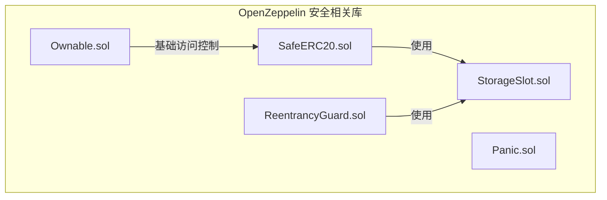
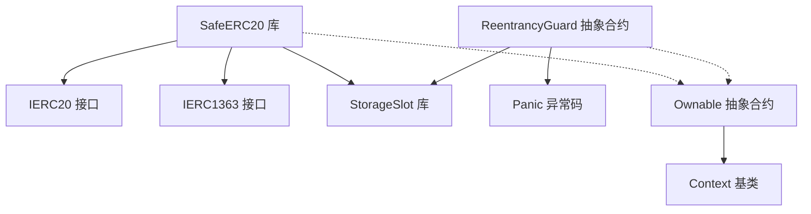
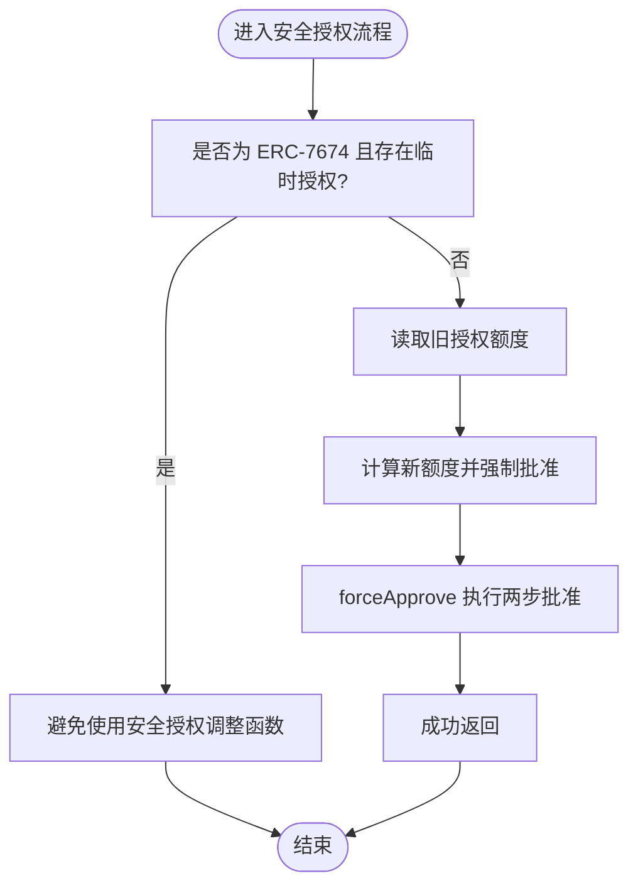
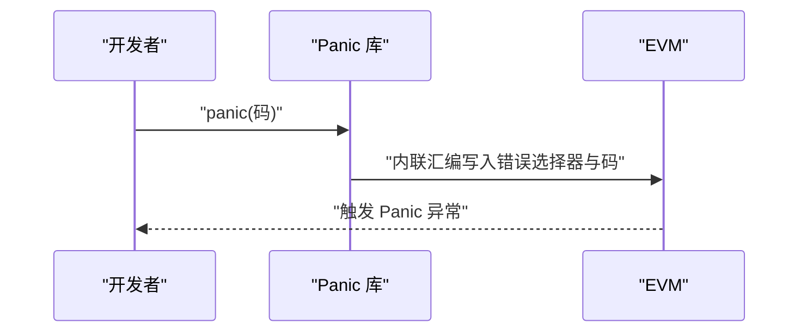
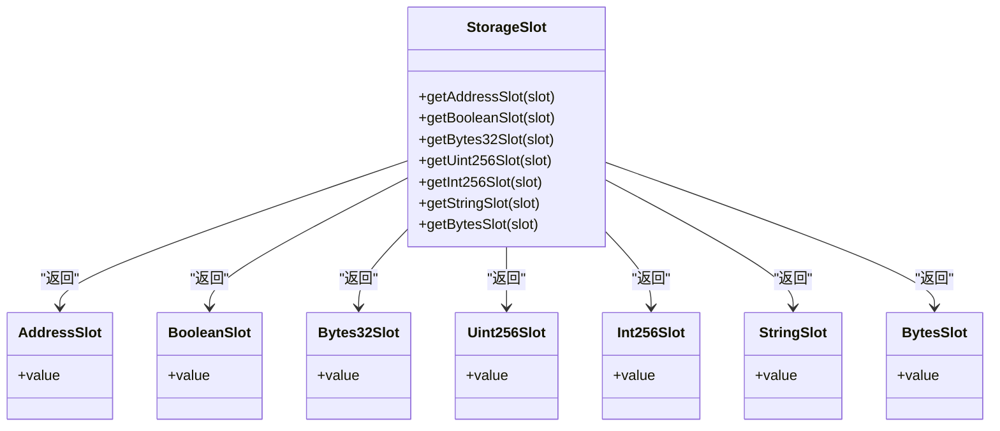
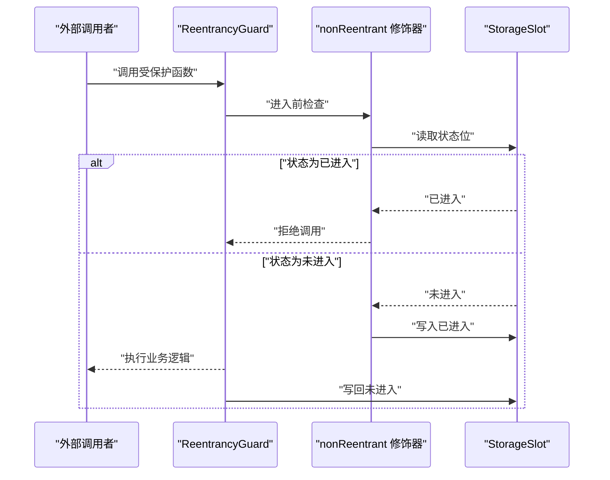
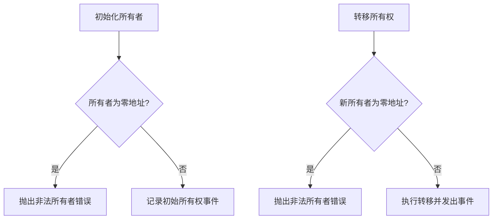
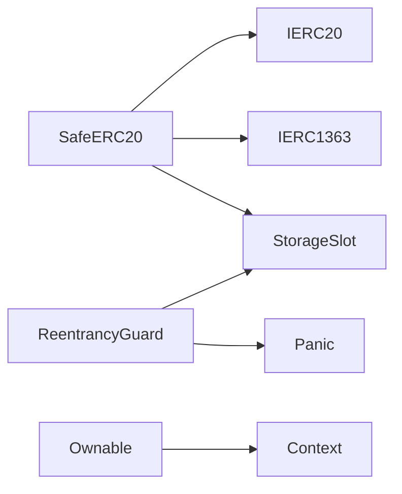

# 安全最佳实践

<cite>
**本文引用的文件**
- [SafeERC20.sol](file://node_modules/@openzeppelin/contracts/token/ERC20/utils/SafeERC20.sol)
- [Panic.sol](file://node_modules/@openzeppelin/contracts/utils/Panic.sol)
- [StorageSlot.sol](file://node_modules/@openzeppelin/contracts/utils/StorageSlot.sol)
- [ReentrancyGuard.sol](file://node_modules/@openzeppelin/contracts/utils/ReentrancyGuard.sol)
- [Ownable.sol](file://node_modules/@openzeppelin/contracts/access/Ownable.sol)
</cite>

## 目录
1. [引言](#引言)
2. [项目结构](#项目结构)
3. [核心组件](#核心组件)
4. [架构总览](#架构总览)
5. [详细组件分析](#详细组件分析)
6. [依赖关系分析](#依赖关系分析)
7. [性能考量](#性能考量)
8. [故障排查指南](#故障排查指南)
9. [结论](#结论)
10. [附录](#附录)

## 引言
本指南聚焦于智能合约安全最佳实践，围绕以下主题展开：SafeERC20 的 ERC20 安全操作、Panic 异常与错误恢复策略、StorageSlot 存储槽操作的安全注意事项、通用安全编码规范与检查清单、常见漏洞识别与修复、安全审计与代码审查流程、安全测试方法与工具推荐、以及安全的开发与部署流程与应急响应机制。本文所有技术细节均基于仓库中 OpenZeppelin 合约库的实际实现。

## 项目结构
本项目在 artifacts 与 node_modules 中提供了 OpenZeppelin 合约库，其中与安全密切相关的组件包括：
- token/ERC20/utils/SafeERC20.sol：封装 ERC20 安全调用与批准流程
- utils/Panic.sol：标准化 Panic 异常码
- utils/StorageSlot.sol：安全访问特定存储槽
- utils/ReentrancyGuard.sol：重入保护（状态守卫）
- access/Ownable.sol：所有权控制与访问限制

**图表来源**
- [SafeERC20.sol](file://node_modules/@openzeppelin/contracts/token/ERC20/utils/SafeERC20.sol#L1-L281)
- [Panic.sol](file://node_modules/@openzeppelin/contracts/utils/Panic.sol#L1-L58)
- [StorageSlot.sol](file://node_modules/@openzeppelin/contracts/utils/StorageSlot.sol#L1-L144)
- [ReentrancyGuard.sol](file://node_modules/@openzeppelin/contracts/utils/ReentrancyGuard.sol#L1-L120)
- [Ownable.sol](file://node_modules/@openzeppelin/contracts/access/Ownable.sol#L1-L101)

**章节来源**
- [SafeERC20.sol](file://node_modules/@openzeppelin/contracts/token/ERC20/utils/SafeERC20.sol#L1-L281)
- [Panic.sol](file://node_modules/@openzeppelin/contracts/utils/Panic.sol#L1-L58)
- [StorageSlot.sol](file://node_modules/@openzeppelin/contracts/utils/StorageSlot.sol#L1-L144)
- [ReentrancyGuard.sol](file://node_modules/@openzeppelin/contracts/utils/ReentrancyGuard.sol#L1-L120)
- [Ownable.sol](file://node_modules/@openzeppelin/contracts/access/Ownable.sol#L1-L101)

## 核心组件
- SafeERC20：对 ERC20 交易、授权与回调（ERC1363）进行安全封装，统一失败处理与返回值兼容性
- Panic：标准化 Panic 异常码，便于调试与监控
- StorageSlot：以类型化存储槽访问替代内联汇编，降低升级与冲突风险
- ReentrancyGuard：通过状态位防止重入攻击
- Ownable：提供仅所有者可调用的访问控制

**章节来源**
- [SafeERC20.sol](file://node_modules/@openzeppelin/contracts/token/ERC20/utils/SafeERC20.sol#L18-L281)
- [Panic.sol](file://node_modules/@openzeppelin/contracts/utils/Panic.sol#L26-L58)
- [StorageSlot.sol](file://node_modules/@openzeppelin/contracts/utils/StorageSlot.sol#L34-L144)
- [ReentrancyGuard.sol](file://node_modules/@openzeppelin/contracts/utils/ReentrancyGuard.sol#L32-L120)
- [Ownable.sol](file://node_modules/@openzeppelin/contracts/access/Ownable.sol#L20-L101)

## 架构总览
下图展示了安全相关模块之间的依赖与交互：

**图表来源**
- [SafeERC20.sol](file://node_modules/@openzeppelin/contracts/token/ERC20/utils/SafeERC20.sol#L6-L8)
- [StorageSlot.sol](file://node_modules/@openzeppelin/contracts/utils/StorageSlot.sol#L34-L144)
- [ReentrancyGuard.sol](file://node_modules/@openzeppelin/contracts/utils/ReentrancyGuard.sol#L6-L33)
- [Panic.sol](file://node_modules/@openzeppelin/contracts/utils/Panic.sol#L26-L58)
- [Ownable.sol](file://node_modules/@openzeppelin/contracts/access/Ownable.sol#L6-L20)

## 详细组件分析

### SafeERC20：ERC20 安全操作实践
- 设计目标
  - 统一处理 ERC20 返回值语义差异：支持返回布尔值、无返回值或回滚的代币
  - 提供“冒泡”与“布尔返回”两种失败处理模式
  - 针对 ERC1363 回调场景提供宽松安全封装
- 关键能力
  - 安全转账与授权：safeTransfer、safeTransferFrom、safeIncreaseAllowance、safeDecreaseAllowance、forceApprove
  - 可恢复调用：trySafeTransfer、trySafeTransferFrom
  - ERC1363 支持：transferAndCallRelaxed、transferFromAndCallRelaxed、approveAndCallRelaxed
  - 内部安全封装：_safeTransfer、_safeTransferFrom、_safeApprove
- 失败与错误
  - 使用专用错误类型报告操作失败与授权减少失败
  - 对于 ERC-7674 临时授权，建议避免使用安全授权调整函数，以免产生非预期行为
- 安全注意事项
  - 在需要先清零再设置授权的代币（如部分稳定币）时，优先使用 forceApprove
  - 对外部合约接收者，谨慎使用 ERC1363 回调；若接收方无代码则回退到普通 ERC20 调用
  - 使用 try 系列函数进行幂等或可恢复流程，避免阻断主流程

**图表来源**
- [SafeERC20.sol](file://node_modules/@openzeppelin/contracts/token/ERC20/utils/SafeERC20.sol#L66-L110)

**章节来源**
- [SafeERC20.sol](file://node_modules/@openzeppelin/contracts/token/ERC20/utils/SafeERC20.sol#L18-L281)

### Panic：异常与错误恢复策略
- 标准化 Panic 码
  - 提供常用 Panic 码常量，覆盖断言、算术溢出/下溢、除零、枚举转换、存储编码、数组越界、资源错误、内部函数无效等
- 触发机制
  - 通过内联汇编构造标准错误选择器与数据，直接触发 Panic
- 实战建议
  - 将通用错误映射为标准化 Panic 码，便于链上日志与监控系统识别
  - 在开发阶段使用 Panic 辅助定位底层问题，上线后结合业务错误类型与事件记录

**图表来源**
- [Panic.sol](file://node_modules/@openzeppelin/contracts/utils/Panic.sol#L50-L56)

**章节来源**
- [Panic.sol](file://node_modules/@openzeppelin/contracts/utils/Panic.sol#L26-L58)

### StorageSlot：存储槽操作的安全注意事项
- 类型化存储槽
  - 提供 Address、Boolean、Bytes32、Uint256、Int256、String、Bytes 等类型化存储槽访问
- 升级与冲突规避
  - 通过固定存储槽定位避免与未来字段布局冲突
  - 与 SlotDerivation 等工具配合，确保槽位派生一致性
- 安全要点
  - 写入前校验地址有效性（如实现地址必须可执行）
  - 读写操作需保证类型匹配，避免误读/误写导致的状态污染
  - 在代理模式中，严格管理存储槽命名与布局

**图表来源**
- [StorageSlot.sol](file://node_modules/@openzeppelin/contracts/utils/StorageSlot.sol#L34-L143)

**章节来源**
- [StorageSlot.sol](file://node_modules/@openzeppelin/contracts/utils/StorageSlot.sol#L34-L144)

### ReentrancyGuard：重入保护与状态守卫
- 工作原理
  - 使用单个存储槽保存“已进入/未进入”状态位，修饰器在进入与退出时切换状态
  - 防止同一调用栈内的重入调用
- 注意事项
  - 不要在标记为 nonReentrant 的函数之间互相调用；可通过拆分为 external 入口与 private 实现
  - 该版本为基于存储的状态守卫，将在 v6.0 被基于瞬态存储的变体替代
- 与 StorageSlot 的协作
  - 通过 StorageSlot 访问固定存储槽，避免与用户态字段冲突

**图表来源**
- [ReentrancyGuard.sol](file://node_modules/@openzeppelin/contracts/utils/ReentrancyGuard.sol#L69-L106)
- [StorageSlot.sol](file://node_modules/@openzeppelin/contracts/utils/StorageSlot.sol#L93-L96)

**章节来源**
- [ReentrancyGuard.sol](file://node_modules/@openzeppelin/contracts/utils/ReentrancyGuard.sol#L32-L120)
- [StorageSlot.sol](file://node_modules/@openzeppelin/contracts/utils/StorageSlot.sol#L34-L144)

### Ownable：所有权与访问控制
- 核心职责
  - 提供仅所有者可调用的访问控制修饰符
  - 初始化时校验所有者地址合法性
  - 提供所有权转移与放弃功能，并发出事件
- 安全建议
  - 转移所有权前验证新所有者地址有效性
  - 在关键函数上使用 onlyOwner 修饰符
  - 结合最小权限原则，避免将过多敏感操作暴露给单一所有者角色

**图表来源**
- [Ownable.sol](file://node_modules/@openzeppelin/contracts/access/Ownable.sol#L38-L99)

**章节来源**
- [Ownable.sol](file://node_modules/@openzeppelin/contracts/access/Ownable.sol#L20-L101)

## 依赖关系分析
- SafeERC20 依赖 IERC20/IERC1363 接口与 StorageSlot 进行低层调用与类型化存储
- ReentrancyGuard 依赖 StorageSlot 管理状态位
- Ownable 作为访问控制基类被其他合约继承使用
- Panic 为异常处理提供统一码表

**图表来源**
- [SafeERC20.sol](file://node_modules/@openzeppelin/contracts/token/ERC20/utils/SafeERC20.sol#L6-L8)
- [ReentrancyGuard.sol](file://node_modules/@openzeppelin/contracts/utils/ReentrancyGuard.sol#L6-L33)
- [Panic.sol](file://node_modules/@openzeppelin/contracts/utils/Panic.sol#L26-L58)
- [Ownable.sol](file://node_modules/@openzeppelin/contracts/access/Ownable.sol#L6-L20)

**章节来源**
- [SafeERC20.sol](file://node_modules/@openzeppelin/contracts/token/ERC20/utils/SafeERC20.sol#L1-L281)
- [ReentrancyGuard.sol](file://node_modules/@openzeppelin/contracts/utils/ReentrancyGuard.sol#L1-L120)
- [Panic.sol](file://node_modules/@openzeppelin/contracts/utils/Panic.sol#L1-L58)
- [Ownable.sol](file://node_modules/@openzeppelin/contracts/access/Ownable.sol#L1-L101)

## 性能考量
- SafeERC20 的内联汇编调用与返回值判定在 gas 上较为高效，但需注意：
  - 对于无返回值的代币，采用空返回数据判断可避免额外开销
  - ERC1363 回调会引入额外的合约交互成本，应按需使用
- StorageSlot 通过类型化槽位访问避免了复杂布局推导，有助于长期维护与升级
- ReentrancyGuard 使用单字状态位，gas 成本较低，但需避免在高频视图函数中滥用
- Ownable 的所有权检查为常数时间与常量 gas，影响有限

[本节为通用指导，不直接分析具体文件]

## 故障排查指南
- SafeERC20 失败定位
  - 检查是否为 ERC-7674 临时授权导致的授权调整异常
  - 使用 try 系列函数捕获失败并记录上下文
  - 对于需要先清零再设置授权的代币，确认 forceApprove 的两步流程是否成功
- Panic 异常诊断
  - 根据 Panic 码快速定位问题类型（断言、溢出、除零、数组越界等）
  - 结合链上日志与事件，复现触发条件
- StorageSlot 写入失败
  - 校验目标地址可执行性与类型匹配
  - 确认存储槽未被其他字段占用
- 重入问题
  - 检查是否存在修饰器未正确应用的函数相互调用
  - 确认状态位切换逻辑在进入与退出时均被执行
- 所有者相关错误
  - 核对所有权转移与放弃流程中的地址校验与事件发出

**章节来源**
- [SafeERC20.sol](file://node_modules/@openzeppelin/contracts/token/ERC20/utils/SafeERC20.sol#L22-L27)
- [Panic.sol](file://node_modules/@openzeppelin/contracts/utils/Panic.sol#L27-L46)
- [StorageSlot.sol](file://node_modules/@openzeppelin/contracts/utils/StorageSlot.sol#L26-L28)
- [ReentrancyGuard.sol](file://node_modules/@openzeppelin/contracts/utils/ReentrancyGuard.sol#L56-L91)
- [Ownable.sol](file://node_modules/@openzeppelin/contracts/access/Ownable.sol#L26-L31)

## 结论
通过在项目中系统性地采用 SafeERC20、Panic、StorageSlot、ReentrancyGuard 与 Ownable 等安全组件，可以显著提升智能合约的安全性与可维护性。建议在开发流程中将这些组件作为默认配置，并结合完善的审计、测试与应急响应机制，持续保障系统的稳健运行。

[本节为总结性内容，不直接分析具体文件]

## 附录

### 安全编码规范与检查清单
- 通用
  - 优先使用库函数而非内联汇编；必要时使用类型化 StorageSlot
  - 明确区分“冒泡失败”与“布尔返回”，根据业务需求选择合适接口
  - 对外部合约交互使用 ERC1363 回调时，明确接收方是否具备合约代码
- ERC20
  - 对需要先清零再设置授权的代币，使用 forceApprove
  - 避免在 ERC-7674 场景下使用安全授权调整函数
  - 使用 try 系列函数构建可恢复流程
- Panic
  - 将业务异常映射为标准化 Panic 码，便于监控与排障
- 存储槽
  - 写入前校验地址有效性；确保类型匹配与槽位唯一性
- 重入
  - 对易受攻击的关键函数添加 nonReentrant 修饰
  - 避免在受保护函数间互相调用
- 所有权
  - 仅授予最小权限；转移所有权前进行充分验证

[本节为通用指导，不直接分析具体文件]

### 安全审计与代码审查
- 审计范围
  - 业务逻辑正确性与边界条件
  - 安全组件使用是否符合最佳实践
  - 存储布局与升级兼容性
- 审查清单
  - 是否使用 SafeERC20 进行 ERC20 操作
  - 是否存在潜在重入点
  - 是否对所有者权限进行了严格控制
  - 是否对 Panic 码进行了合理使用

[本节为通用指导，不直接分析具体文件]

### 安全测试方法与工具推荐
- 单元测试
  - 使用 try 系列函数覆盖失败路径
  - 针对不同代币类型（有返回值/无返回值/回滚）编写测试
- 集成测试
  - 模拟外部合约接收者与回滚场景
- 静态分析
  - 使用 Slither、Mythril 等工具进行漏洞扫描
- 动态分析
  - 使用 Foundry/Hardhat 进行 fuzz 测试与压力测试
- 日志与监控
  - 记录 Panic 码与关键事件，建立告警机制

[本节为通用指导，不直接分析具体文件]

### 安全开发与部署流程
- 开发阶段
  - 默认启用安全组件；对关键路径进行注释与文档化
- 测试阶段
  - 完整的单元与集成测试；静态与动态分析并行
- 部署阶段
  - 使用代理模式与类型化存储槽；严格验证初始化参数
- 运维阶段
  - 建立变更审批与回滚预案；监控 Panic 码与异常事件

[本节为通用指导，不直接分析具体文件]

### 应急响应与漏洞修复
- 快速响应
  - 基于 Panic 码与事件日志快速定位问题
  - 临时冻结高危功能或限制权限
- 修复与回滚
  - 通过代理升级修复；确保向后兼容
  - 发布补丁版本并通知用户
- 复盘与改进
  - 分析根本原因；更新安全规范与测试用例

[本节为通用指导，不直接分析具体文件]