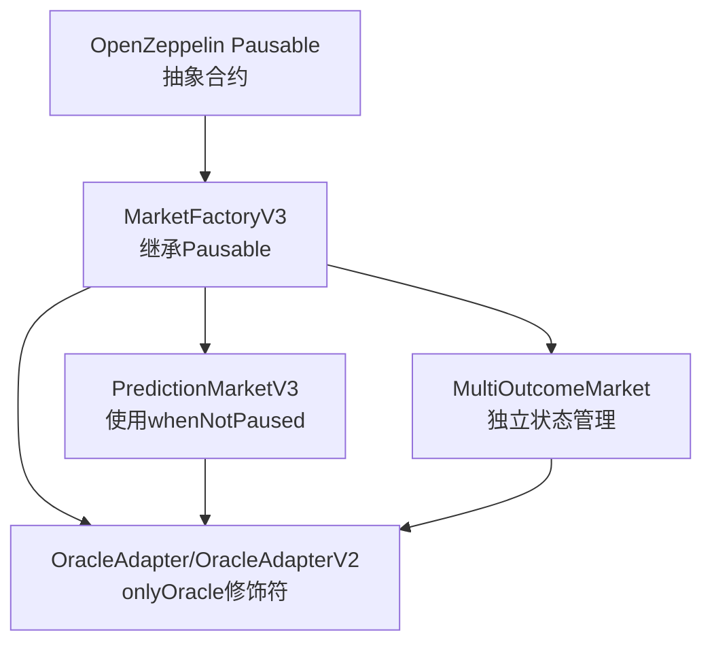
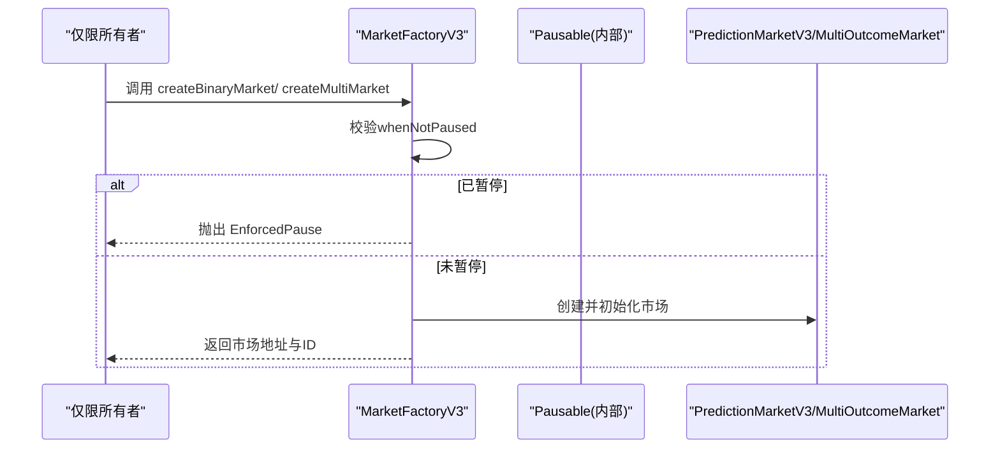
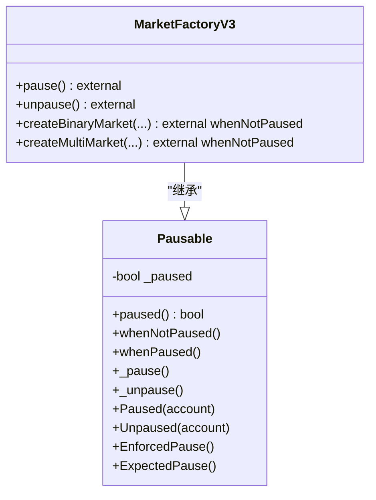
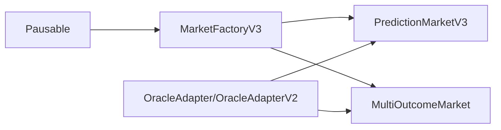

# 暂停机制

<cite>
**本文引用的文件**
- [MarketFactoryV3.sol](file://contracts/contracts/MarketFactoryV3.sol)
- [Pausable.sol](file://node_modules/@openzeppelin/contracts/utils/Pausable.sol)
- [PredictionMarketV3.sol](file://contracts/contracts/PredictionMarketV3.sol)
- [MultiOutcomeMarket.sol](file://contracts/contracts/MultiOutcomeMarket.sol)
- [MarketFactory.sol](file://contracts/contracts/MarketFactory.sol)
- [PredictionMarket.sol](file://contracts/contracts/PredictionMarket.sol)
- [IPredictionMarket.sol](file://contracts/contracts/interfaces/IPredictionMarket.sol)
- [Phase3.test.js](file://contracts/test/Phase3.test.js)
</cite>

## 目录
1. [简介](#简介)
2. [项目结构](#项目结构)
3. [核心组件](#核心组件)
4. [架构总览](#架构总览)
5. [详细组件分析](#详细组件分析)
6. [依赖关系分析](#依赖关系分析)
7. [性能考量](#性能考量)
8. [故障排查指南](#故障排查指南)
9. [结论](#结论)
10. [附录](#附录)

## 简介
本文件聚焦于预测市场中的“暂停机制”，系统性阐述 Pausable 合约的暂停与恢复实现原理，并结合 MarketFactoryV3 的实际集成，说明在预测市场中暂停的触发场景（如系统维护、安全事件响应、紧急情况）、暂停状态下的操作限制与安全考虑、暂停与恢复的调用流程与代码路径、权限分配与使用限制、对用户体验与系统可用性的影响、自动化响应机制以及紧急情况下的快速恢复策略。

## 项目结构
- 暂停机制由 OpenZeppelin 的 Pausable 抽象合约提供，MarketFactoryV3 继承该合约并暴露外部暂停/恢复入口。
- 预言机适配器与市场合约通过 onlyOracle 修饰符控制关键决议操作的执行者，与暂停机制共同构成安全边界。
- 测试文件展示了 Phase3 场景下 CPMM 市场的创建与交易行为，为理解暂停前后的行为差异提供参考。

图表来源
- [MarketFactoryV3.sol](file://contracts/contracts/MarketFactoryV3.sol#L11-L32)
- [Pausable.sol](file://node_modules/@openzeppelin/contracts/utils/Pausable.sol#L17-L112)
- [PredictionMarketV3.sol](file://contracts/contracts/PredictionMarketV3.sol#L92-L149)
- [MultiOutcomeMarket.sol](file://contracts/contracts/MultiOutcomeMarket.sol#L65-L87)

章节来源
- [MarketFactoryV3.sol](file://contracts/contracts/MarketFactoryV3.sol#L1-L94)
- [Pausable.sol](file://node_modules/@openzeppelin/contracts/utils/Pausable.sol#L1-L113)

## 核心组件
- Pausable 抽象合约：提供 paused 状态查询、whenNotPaused/whenPaused 修饰符、_pause/_unpause 内部方法及 Paused/Unpaused 事件。
- MarketFactoryV3：继承 Pausable，对外暴露 pause()/unpause()，并在创建市场函数上使用 whenNotPaused 修饰符，确保暂停期间无法创建新市场。
- PredictionMarketV3 与 MultiOutcomeMarket：各自维护内部状态（如 marketStatus），在关键函数中检查状态是否为 Open；暂停期间这些函数仍可被调用，但不会改变状态或产生副作用，直到恢复后由预言机进行最终决议。

章节来源
- [Pausable.sol](file://node_modules/@openzeppelin/contracts/utils/Pausable.sol#L17-L112)
- [MarketFactoryV3.sol](file://contracts/contracts/MarketFactoryV3.sol#L11-L32)
- [PredictionMarketV3.sol](file://contracts/contracts/PredictionMarketV3.sol#L92-L149)
- [MultiOutcomeMarket.sol](file://contracts/contracts/MultiOutcomeMarket.sol#L65-L87)

## 架构总览
暂停机制通过“状态+修饰符”的方式实现：当 paused 为真时，所有标注 whenNotPaused 的函数均会因抛出 EnforcedPause 错误而失败；当 paused 为假时，函数正常执行。MarketFactoryV3 在创建市场时利用此机制阻止业务逻辑在暂停状态下继续推进。

图表来源
- [MarketFactoryV3.sol](file://contracts/contracts/MarketFactoryV3.sol#L37-L88)
- [Pausable.sol](file://node_modules/@openzeppelin/contracts/utils/Pausable.sol#L47-L78)

## 详细组件分析

### Pausable 合约与 MarketFactoryV3 集成
- 权限模型：onlyOwner 限定 pause()/unpause() 的调用者为合约所有者。
- 修饰符约束：whenNotPaused 应用于创建市场的外部函数，确保暂停期间无法新增市场。
- 状态传播：_pause() 将内部 paused 状态置为 true 并发出 Paused 事件；_unpause() 反之。

图表来源
- [Pausable.sol](file://node_modules/@openzeppelin/contracts/utils/Pausable.sol#L17-L112)
- [MarketFactoryV3.sol](file://contracts/contracts/MarketFactoryV3.sol#L11-L32)

章节来源
- [Pausable.sol](file://node_modules/@openzeppelin/contracts/utils/Pausable.sol#L17-L112)
- [MarketFactoryV3.sol](file://contracts/contracts/MarketFactoryV3.sol#L11-L32)

### 暂停状态下的操作限制与安全考虑
- 创建市场：在暂停期间，createBinaryMarket/createMultiMarket 会因 whenNotPaused 校验失败而直接回滚，避免在未知风险下引入新市场。
- 交易与流动性：已部署的 PredictionMarketV3/MultiOutcomeMarket 在暂停期间仍可接收用户调用，但不会改变其内部状态（如 marketStatus/Open）。只有在恢复后，预言机才能通过 resolve/voidMarket 正式变更状态。
- 安全边界：onlyOracle 修饰符保证只有授权预言机能进行最终决议，暂停不改变这一边界；同时暂停可作为阻断器，防止错误决议在异常状态下生效。

章节来源
- [MarketFactoryV3.sol](file://contracts/contracts/MarketFactoryV3.sol#L42-L88)
- [PredictionMarketV3.sol](file://contracts/contracts/PredictionMarketV3.sol#L92-L149)
- [MultiOutcomeMarket.sol](file://contracts/contracts/MultiOutcomeMarket.sol#L65-L87)

### 暂停与恢复的调用流程与代码示例路径
- 暂停流程
  1) 仅所有者调用 MarketFactoryV3.pause()。
  2) pause() 内部委托到 _pause()，设置 paused=true 并发出 Paused 事件。
  3) 之后任何调用 createBinaryMarket/createMultiMarket 均会因 whenNotPaused 校验失败而抛出 EnforcedPause。
- 恢复流程
  1) 仅所有者调用 MarketFactoryV3.unpause()。
  2) unpause() 内部委托到 _unpause()，设置 paused=false 并发出 Unpaused 事件。
  3) 之后创建市场接口恢复正常。

章节来源
- [MarketFactoryV3.sol](file://contracts/contracts/MarketFactoryV3.sol#L31-L32)
- [Pausable.sol](file://node_modules/@openzeppelin/contracts/utils/Pausable.sol#L96-L111)

### 暂停权限的分配与使用限制
- 权限主体：onlyOwner 限定为合约所有者，确保暂停/恢复由受信任方执行。
- 使用限制：暂停应遵循最小化原则，仅在确有必要时启用；恢复需有明确的恢复计划与验证步骤。
- 事件记录：Paused/Unpaused 事件便于审计与监控，便于追踪暂停窗口与影响范围。

章节来源
- [MarketFactoryV3.sol](file://contracts/contracts/MarketFactoryV3.sol#L31-L32)
- [Pausable.sol](file://node_modules/@openzeppelin/contracts/utils/Pausable.sol#L23-L28)

### 对用户体验与系统可用性的影响
- 用户体验：暂停期间无法创建新市场，但不影响已有市场的查询与结算流程；用户可在恢复后继续参与。
- 系统可用性：暂停作为紧急阻断器，可避免在系统维护或安全事件期间继续处理业务，降低整体风险暴露时间。

章节来源
- [MarketFactoryV3.sol](file://contracts/contracts/MarketFactoryV3.sol#L42-L88)

### 触发条件与自动化响应机制
- 触发条件（示例）：检测到异常交易模式、预言机数据异常、外部依赖服务不可用、安全漏洞披露等。
- 自动化建议：可通过链上事件订阅与外部监控系统联动，在检测到特定条件时自动调用 pause()；恢复则需要人工审批或满足预设条件后调用 unpause()。

章节来源
- [Pausable.sol](file://node_modules/@openzeppelin/contracts/utils/Pausable.sol#L47-L78)

### 紧急情况下的快速响应与恢复
- 快速响应：一旦发现风险，立即暂停创建新市场，隔离潜在风险面；同时通知运营团队进行调查与修复。
- 恢复策略：修复完成后，先在测试环境验证无误，再在主网恢复；恢复后持续监控系统指标与交易行为，确认稳定后再解除紧急状态。

章节来源
- [MarketFactoryV3.sol](file://contracts/contracts/MarketFactoryV3.sol#L31-L32)

## 依赖关系分析
- MarketFactoryV3 依赖 Pausable 提供的暂停能力，并通过 whenNotPaused 修饰符将其应用到创建市场函数。
- 预言机适配器通过 onlyOracle 修饰符控制 resolve/voidMarket 的调用者，与暂停机制共同形成“权限+状态”的双重安全控制。

图表来源
- [MarketFactoryV3.sol](file://contracts/contracts/MarketFactoryV3.sol#L6-L11)
- [PredictionMarketV3.sol](file://contracts/contracts/PredictionMarketV3.sol#L44-L47)
- [MultiOutcomeMarket.sol](file://contracts/contracts/MultiOutcomeMarket.sol#L34-L37)

章节来源
- [MarketFactoryV3.sol](file://contracts/contracts/MarketFactoryV3.sol#L6-L11)
- [PredictionMarketV3.sol](file://contracts/contracts/PredictionMarketV3.sol#L44-L47)
- [MultiOutcomeMarket.sol](file://contracts/contracts/MultiOutcomeMarket.sol#L34-L37)

## 性能考量
- 暂停机制本身不涉及复杂计算，主要通过状态判断与错误抛出来实现，对链上 gas 消耗影响极小。
- 在暂停期间，未受影响的只读查询（如查询池子状态、余额等）仍可正常执行，不影响用户侧的可观测性。

章节来源
- [Pausable.sol](file://node_modules/@openzeppelin/contracts/utils/Pausable.sol#L74-L87)
- [PredictionMarketV3.sol](file://contracts/contracts/PredictionMarketV3.sol#L167-L176)

## 故障排查指南
- 现象：调用 createBinaryMarket/createMultiMarket 失败并提示 EnforcedPause。
  - 排查：确认合约 paused 状态；检查是否由 onlyOwner 调用；确认调用时机是否处于暂停窗口内。
- 现象：暂停后交易仍可进行，但状态未更新。
  - 排查：确认市场合约内部状态（如 marketStatus）仅在恢复后由预言机决议更新。
- 现象：恢复后仍无法创建新市场。
  - 排查：确认 unpause() 是否成功执行且 paused 状态已变为 false。

章节来源
- [Pausable.sol](file://node_modules/@openzeppelin/contracts/utils/Pausable.sol#L33-L38)
- [MarketFactoryV3.sol](file://contracts/contracts/MarketFactoryV3.sol#L31-L32)

## 结论
Pausable 与 MarketFactoryV3 的集成提供了简洁可靠的暂停/恢复能力：通过 onlyOwner 的权限与 whenNotPaused 的修饰符，确保在暂停期间阻断业务推进；恢复后由预言机完成最终决议，保障系统在紧急情况下能够快速止损并有序恢复。配合严格的权限管理与事件审计，暂停机制成为预测市场在维护与安全事件中的关键工具。

## 附录
- 相关接口定义：IPredictionMarket 提供状态查询与决议/作废接口，便于前端与监控系统集成。
- 测试参考：Phase3 测试展示了市场创建与交易流程，可作为暂停前后行为对比的基准。

章节来源
- [IPredictionMarket.sol](file://contracts/contracts/interfaces/IPredictionMarket.sol#L4-L8)
- [Phase3.test.js](file://contracts/test/Phase3.test.js#L1-L74)