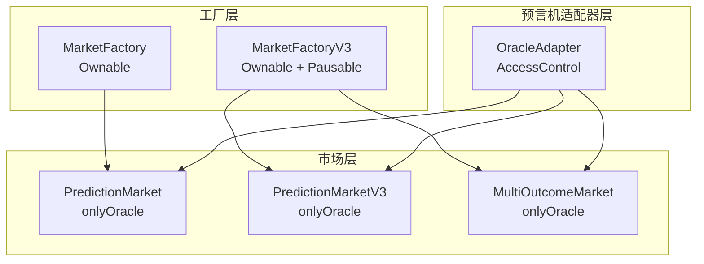
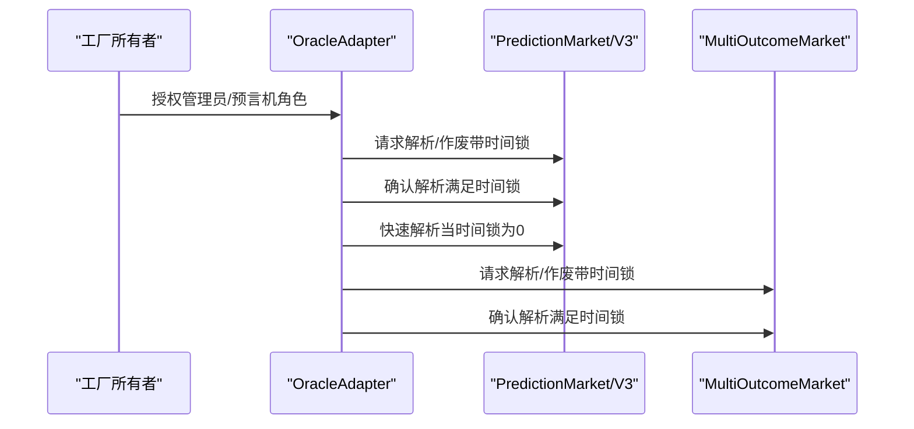
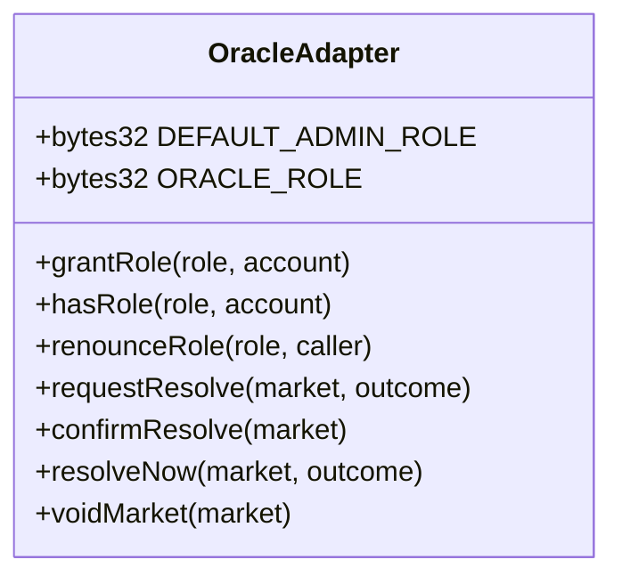
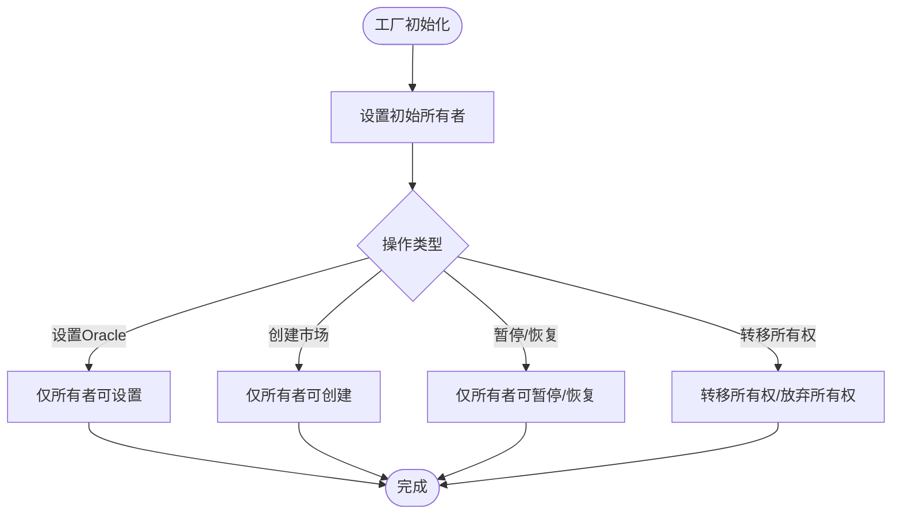
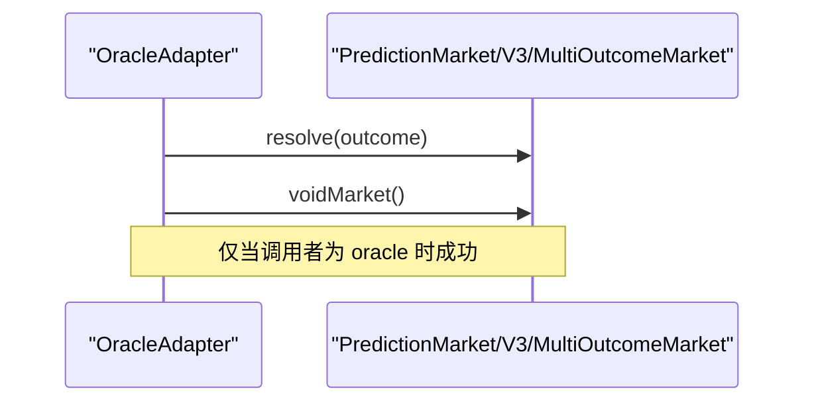
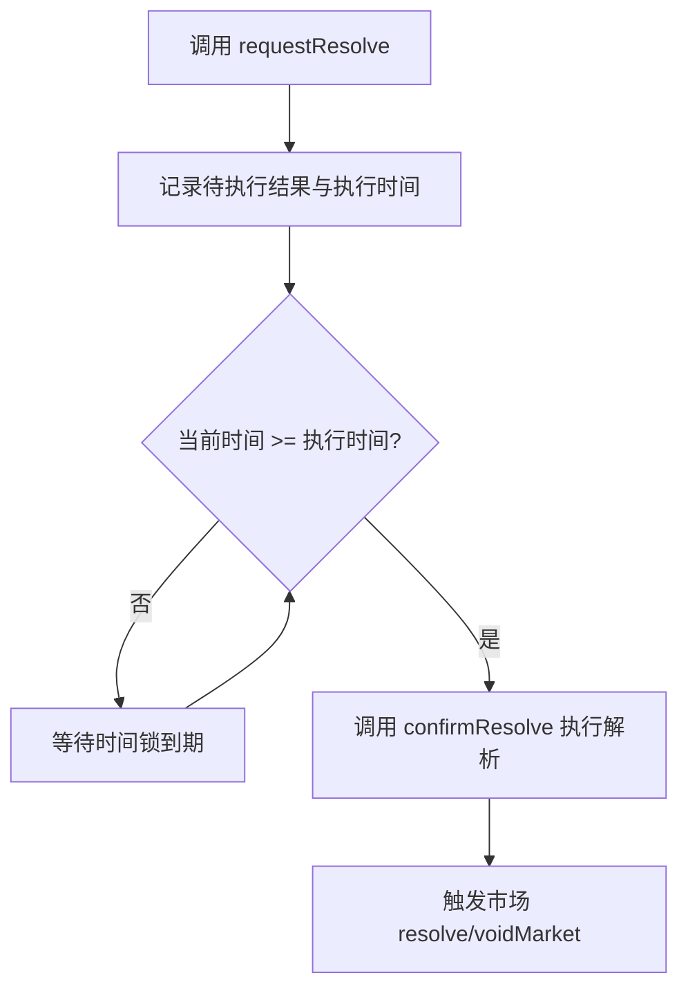
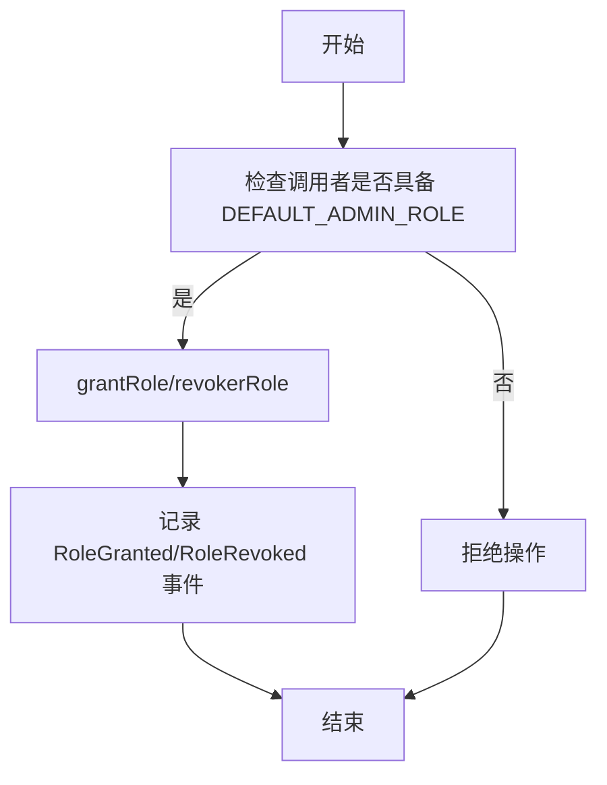
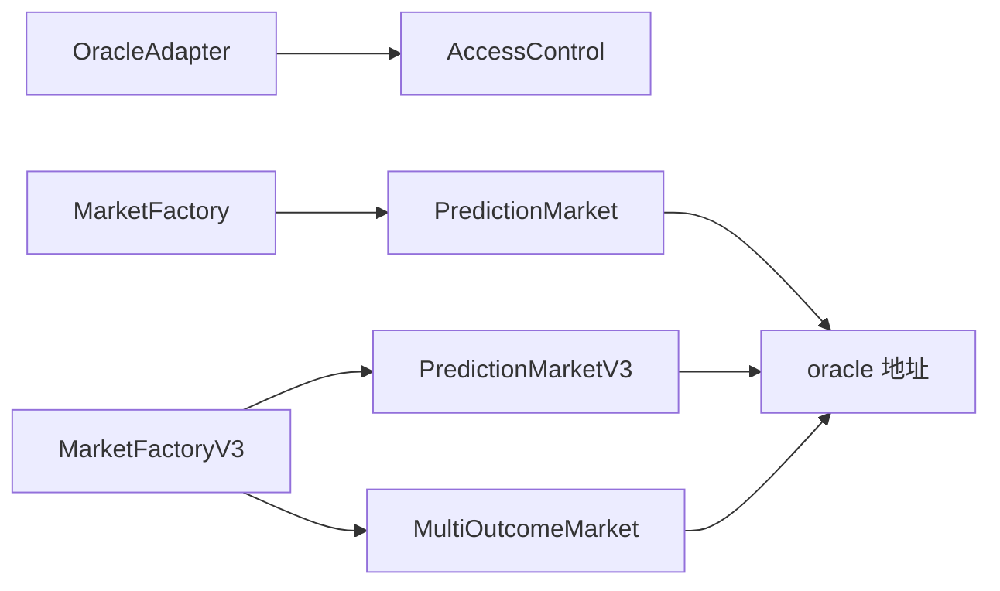

# 访问控制机制

<cite>
**本文引用的文件**
- [PredictionMarket.sol](file://contracts/contracts/PredictionMarket.sol)
- [MarketFactory.sol](file://contracts/contracts/MarketFactory.sol)
- [OracleAdapter.sol](file://contracts/contracts/OracleAdapter.sol)
- [PredictionMarketV3.sol](file://contracts/contracts/PredictionMarketV3.sol)
- [MarketFactoryV3.sol](file://contracts/contracts/MarketFactoryV3.sol)
- [MultiOutcomeMarket.sol](file://contracts/contracts/MultiOutcomeMarket.sol)
- [IAccessControl.sol](file://contracts/artifacts/@openzeppelin/contracts/access/IAccessControl.sol)
- [AccessControl.json](file://contracts/artifacts/@openzeppelin/contracts/access/AccessControl.sol/AccessControl.json)
- [MarketFactory.json](file://contracts/artifacts/contracts/MarketFactory.sol/MarketFactory.json)
</cite>

## 目录
1. [引言](#引言)
2. [项目结构](#项目结构)
3. [核心组件](#核心组件)
4. [架构总览](#架构总览)
5. [详细组件分析](#详细组件分析)
6. [依赖关系分析](#依赖关系分析)
7. [性能考量](#性能考量)
8. [故障排查指南](#故障排查指南)
9. [结论](#结论)
10. [附录](#附录)

## 引言
本文件系统性梳理预测市场中的访问控制机制，重点覆盖以下方面：
- AccessControl 的权限模型与角色管理（含默认管理员与自定义角色）
- Ownable 合约的简单所有权控制机制
- 预测市场中不同角色的权限分配：市场创建者、预言机、管理员等
- 权限升级与降级的操作流程
- 多签名权限控制的实现思路与落地方式
- 权限滥用的风险与防范措施
- 权限管理最佳实践与安全配置建议

## 项目结构
本项目围绕“工厂-市场-预言机适配器”三层结构构建访问控制：
- 工厂层：负责部署市场、设置全局参数、持有所有权
- 市场层：具体市场合约，内置仅“预言机”可执行的关键操作
- 预言机适配器层：集中式权限入口，支持角色授权、时间锁与快速通道

图表来源
- [MarketFactory.sol](file://contracts/contracts/MarketFactory.sol#L1-L60)
- [MarketFactoryV3.sol](file://contracts/contracts/MarketFactoryV3.sol#L1-L94)
- [PredictionMarket.sol](file://contracts/contracts/PredictionMarket.sol#L1-L134)
- [PredictionMarketV3.sol](file://contracts/contracts/PredictionMarketV3.sol#L1-L200)
- [MultiOutcomeMarket.sol](file://contracts/contracts/MultiOutcomeMarket.sol#L1-L113)
- [OracleAdapter.sol](file://contracts/contracts/OracleAdapter.sol#L1-L83)

章节来源
- [MarketFactory.sol](file://contracts/contracts/MarketFactory.sol#L1-L60)
- [MarketFactoryV3.sol](file://contracts/contracts/MarketFactoryV3.sol#L1-L94)
- [OracleAdapter.sol](file://contracts/contracts/OracleAdapter.sol#L1-L83)

## 核心组件
- AccessControl 权限模型
  - 默认管理员角色 DEFAULT_ADMIN_ROLE
  - 自定义角色常量（如 ORACLE_ROLE）
  - 角色查询、授权、撤销接口
- Ownable 所有权模型
  - owner 持有者地址
  - 转移所有权、放弃所有权
- 市场合约的“仅预言机”修饰器
  - 通过 onlyOracle 限制 resolve/voidMarket 等关键操作

章节来源
- [OracleAdapter.sol](file://contracts/contracts/OracleAdapter.sol#L1-L83)
- [PredictionMarket.sol](file://contracts/contracts/PredictionMarket.sol#L39-L42)
- [PredictionMarketV3.sol](file://contracts/contracts/PredictionMarketV3.sol#L44-L47)
- [MultiOutcomeMarket.sol](file://contracts/contracts/MultiOutcomeMarket.sol#L34-L37)
- [IAccessControl.sol](file://contracts/artifacts/@openzeppelin/contracts/access/IAccessControl.sol#L1-L177)
- [AccessControl.json](file://contracts/artifacts/@openzeppelin/contracts/access/AccessControl.sol/AccessControl.json#L102-L177)
- [MarketFactory.json](file://contracts/artifacts/contracts/MarketFactory.sol/MarketFactory.json#L176-L236)

## 架构总览
下图展示权限流经路径：工厂拥有者授予适配器管理员与预言机角色；适配器再向市场广播解析或作废请求，并受时间锁保护。

图表来源
- [OracleAdapter.sol](file://contracts/contracts/OracleAdapter.sol#L30-L81)
- [PredictionMarket.sol](file://contracts/contracts/PredictionMarket.sol#L83-L95)
- [PredictionMarketV3.sol](file://contracts/contracts/PredictionMarketV3.sol#L137-L149)
- [MultiOutcomeMarket.sol](file://contracts/contracts/MultiOutcomeMarket.sol#L76-L87)

## 详细组件分析

### AccessControl 权限模型与角色管理
- 角色定义与查询
  - DEFAULT_ADMIN_ROLE：默认管理员角色
  - ORACLE_ROLE：自定义预言机角色
  - hasRole(role, account)：查询账户是否具备某角色
  - getRoleAdmin(role)：查询角色的管理员角色
- 授权与撤销
  - grantRole(role, account)：向账户授予角色
  - renounceRole(role, caller)：调用者放弃自身角色
  - revokeRole(role, account)：撤销账户的角色（需由对应管理员执行）
- 事件
  - RoleAdminChanged：角色管理员变更
  - RoleGranted：角色被授予
  - RoleRevoked：角色被撤销

图表来源
- [OracleAdapter.sol](file://contracts/contracts/OracleAdapter.sol#L8-L82)
- [IAccessControl.sol](file://contracts/artifacts/@openzeppelin/contracts/access/IAccessControl.sol#L102-L177)
- [AccessControl.json](file://contracts/artifacts/@openzeppelin/contracts/access/AccessControl.sol/AccessControl.json#L102-L177)

章节来源
- [OracleAdapter.sol](file://contracts/contracts/OracleAdapter.sol#L1-L83)
- [IAccessControl.sol](file://contracts/artifacts/@openzeppelin/contracts/access/IAccessControl.sol#L1-L177)
- [AccessControl.json](file://contracts/artifacts/@openzeppelin/contracts/access/AccessControl.sol/AccessControl.json#L102-L177)

### Ownable 合约的简单所有权控制机制
- 关键函数
  - owner()：查询当前所有者
  - transferOwnership(newOwner)：转移所有权
  - renounceOwnership()：放弃所有权
- 在工厂中的应用
  - MarketFactory：仅 owner 可设置 oracle、创建市场
  - MarketFactoryV3：仅 owner 可暂停/恢复、设置参数、创建市场

图表来源
- [MarketFactory.sol](file://contracts/contracts/MarketFactory.sol#L25-L54)
- [MarketFactoryV3.sol](file://contracts/contracts/MarketFactoryV3.sol#L31-L35)
- [MarketFactory.json](file://contracts/artifacts/contracts/MarketFactory.sol/MarketFactory.json#L176-L236)

章节来源
- [MarketFactory.sol](file://contracts/contracts/MarketFactory.sol#L1-L60)
- [MarketFactoryV3.sol](file://contracts/contracts/MarketFactoryV3.sol#L1-L94)
- [MarketFactory.json](file://contracts/artifacts/contracts/MarketFactory.sol/MarketFactory.json#L176-L236)

### 市场合约的“仅预言机”权限控制
- 修饰器 onlyOracle
  - 仅允许 oracle 地址调用 resolve/voidMarket 等关键函数
- 在各版本市场中的体现
  - PredictionMarket：resolve/voidMarket 使用 onlyOracle
  - PredictionMarketV3：resolve/voidMarket 使用 onlyOracle
  - MultiOutcomeMarket：resolve/voidMarket 使用 onlyOracle

图表来源
- [PredictionMarket.sol](file://contracts/contracts/PredictionMarket.sol#L83-L95)
- [PredictionMarketV3.sol](file://contracts/contracts/PredictionMarketV3.sol#L137-L149)
- [MultiOutcomeMarket.sol](file://contracts/contracts/MultiOutcomeMarket.sol#L76-L87)

章节来源
- [PredictionMarket.sol](file://contracts/contracts/PredictionMarket.sol#L39-L42)
- [PredictionMarketV3.sol](file://contracts/contracts/PredictionMarketV3.sol#L44-L47)
- [MultiOutcomeMarket.sol](file://contracts/contracts/MultiOutcomeMarket.sol#L34-L37)

### 预言机适配器的时间锁与快速通道
- 时间锁设计
  - requestResolve：记录待执行结果与执行时间点
  - confirmResolve：满足时间锁后执行解析
- 快速通道
  - resolveNow：当时间锁为0时直接解析
- 管理员能力
  - setTimelockDelay/setFactory/grantOracle：仅 DEFAULT_ADMIN_ROLE 可调用

图表来源
- [OracleAdapter.sol](file://contracts/contracts/OracleAdapter.sol#L48-L75)

章节来源
- [OracleAdapter.sol](file://contracts/contracts/OracleAdapter.sol#L1-L83)

### 多签名权限控制的实现方式
- 设计思路
  - 将 DEFAULT_ADMIN_ROLE 分配给多签钱包地址
  - 将 ORACLE_ROLE 分配给多个可信预言机地址
  - 通过模块化授权与撤销，实现“去中心化治理”
- 落地要点
  - 仅多签成员可调用 setTimelockDelay/setFactory/grantOracle
  - 通过多重签名提案与确认，降低单点风险
  - 对高危操作（如时间锁调整）设置更长等待期

章节来源
- [OracleAdapter.sol](file://contracts/contracts/OracleAdapter.sol#L30-L46)

### 权限升级与降级的操作流程
- 升级（提升权限）
  - 由 DEFAULT_ADMIN_ROLE 调用 grantRole(ORACLE_ROLE, account)
- 降级（撤销权限）
  - 由 DEFAULT_ADMIN_ROLE 调用 revokeRole(ORACLE_ROLE, account)
  - 或账户自行 renounceRole(ORACLE_ROLE, caller)
- 流程示意

图表来源
- [OracleAdapter.sol](file://contracts/contracts/OracleAdapter.sol#L36-L46)
- [IAccessControl.sol](file://contracts/artifacts/@openzeppelin/contracts/access/IAccessControl.sol#L134-L177)

章节来源
- [OracleAdapter.sol](file://contracts/contracts/OracleAdapter.sol#L1-L83)
- [IAccessControl.sol](file://contracts/artifacts/@openzeppelin/contracts/access/IAccessControl.sol#L1-L177)

### 不同角色的权限分配与使用场景
- 市场创建者（工厂所有者）
  - 创建市场、设置全局参数、暂停/恢复工厂
  - 适用场景：链上治理委员会或单一管理员
- 预言机（ORACLE_ROLE）
  - 解析/作废市场，必须通过适配器统一入口
  - 适用场景：可信预言机节点或多方共识
- 管理员（DEFAULT_ADMIN_ROLE）
  - 维护适配器参数、授权/撤销角色、设置工厂参数
  - 适用场景：多签钱包或治理合约

章节来源
- [MarketFactory.sol](file://contracts/contracts/MarketFactory.sol#L32-L35)
- [MarketFactoryV3.sol](file://contracts/contracts/MarketFactoryV3.sol#L31-L35)
- [OracleAdapter.sol](file://contracts/contracts/OracleAdapter.sol#L30-L46)

## 依赖关系分析
- 组件耦合
  - OracleAdapter 依赖 AccessControl 提供角色管理
  - 市场合约依赖 oracle 地址进行关键操作
  - 工厂合约持有所有权并对市场进行初始化
- 外部依赖
  - OpenZeppelin AccessControl/Ownable/IERC20/SafeERC20/ReentrancyGuard/Pausable

图表来源
- [OracleAdapter.sol](file://contracts/contracts/OracleAdapter.sol#L4-L8)
- [PredictionMarket.sol](file://contracts/contracts/PredictionMarket.sol#L17-L19)
- [PredictionMarketV3.sol](file://contracts/contracts/PredictionMarketV3.sol#L14-L16)
- [MultiOutcomeMarket.sol](file://contracts/contracts/MultiOutcomeMarket.sol#L14-L16)
- [MarketFactory.sol](file://contracts/contracts/MarketFactory.sol#L4-L6)
- [MarketFactoryV3.sol](file://contracts/contracts/MarketFactoryV3.sol#L4-L8)

章节来源
- [OracleAdapter.sol](file://contracts/contracts/OracleAdapter.sol#L1-L83)
- [PredictionMarket.sol](file://contracts/contracts/PredictionMarket.sol#L1-L134)
- [PredictionMarketV3.sol](file://contracts/contracts/PredictionMarketV3.sol#L1-L200)
- [MultiOutcomeMarket.sol](file://contracts/contracts/MultiOutcomeMarket.sol#L1-L113)
- [MarketFactory.sol](file://contracts/contracts/MarketFactory.sol#L1-L60)
- [MarketFactoryV3.sol](file://contracts/contracts/MarketFactoryV3.sol#L1-L94)

## 性能考量
- 角色查询与授权为 O(1) 级别，对交易成本影响有限
- 时间锁机制增加链上等待，但显著降低误操作风险
- 多签钱包可能引入签名收集与延迟成本，需在安全与效率间平衡

## 故障排查指南
- 常见错误与定位
  - “not oracle”：调用方非 oracle 地址
  - “not open”：市场状态不为开放
  - “timelock”：未到时间锁结束时间
  - “invalid outcome”：结果超出范围
- 排查步骤
  - 确认调用者是否具备相应角色
  - 检查市场状态与时间锁条件
  - 核对输入参数合法性

章节来源
- [PredictionMarket.sol](file://contracts/contracts/PredictionMarket.sol#L83-L95)
- [PredictionMarketV3.sol](file://contracts/contracts/PredictionMarketV3.sol#L137-L149)
- [MultiOutcomeMarket.sol](file://contracts/contracts/MultiOutcomeMarket.sol#L76-L87)
- [OracleAdapter.sol](file://contracts/contracts/OracleAdapter.sol#L60-L67)

## 结论
本项目采用“工厂-适配器-市场”的分层权限设计：工厂持有所有权，适配器集中管理角色并引入时间锁，市场仅接受来自适配器的权威指令。该模式在保障安全性的同时，提供了灵活的治理与运营能力。建议结合多签钱包与最小权限原则，持续优化角色与参数配置，以应对不断演进的安全挑战。

## 附录
- 最佳实践清单
  - 将 DEFAULT_ADMIN_ROLE 授权给多签钱包
  - 严格限制 ORACLE_ROLE 数量与来源
  - 设置合理时间锁周期，平衡安全与效率
  - 定期审计角色授权与撤销记录
  - 对高危操作（如时间锁调整）设置额外治理流程
- 安全配置建议
  - 初始化时明确管理员与预言机地址
  - 建立角色变更的公开记录与通知机制
  - 对工厂暂停/恢复与市场作废建立治理流程
  - 定期评估并调整费用比例与最大投注额等风控参数