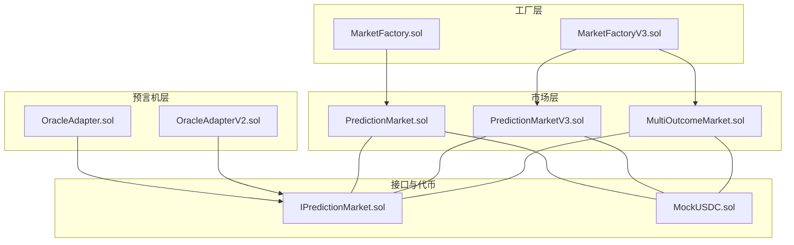
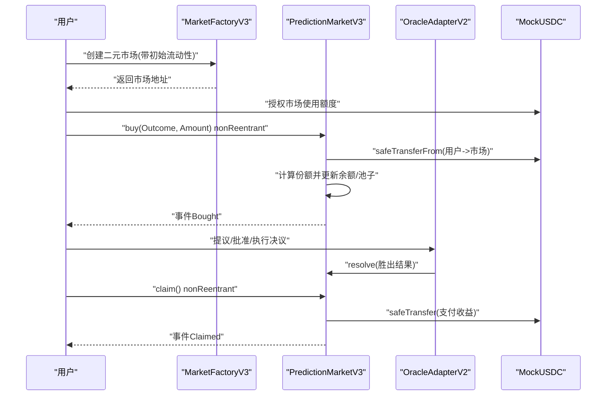
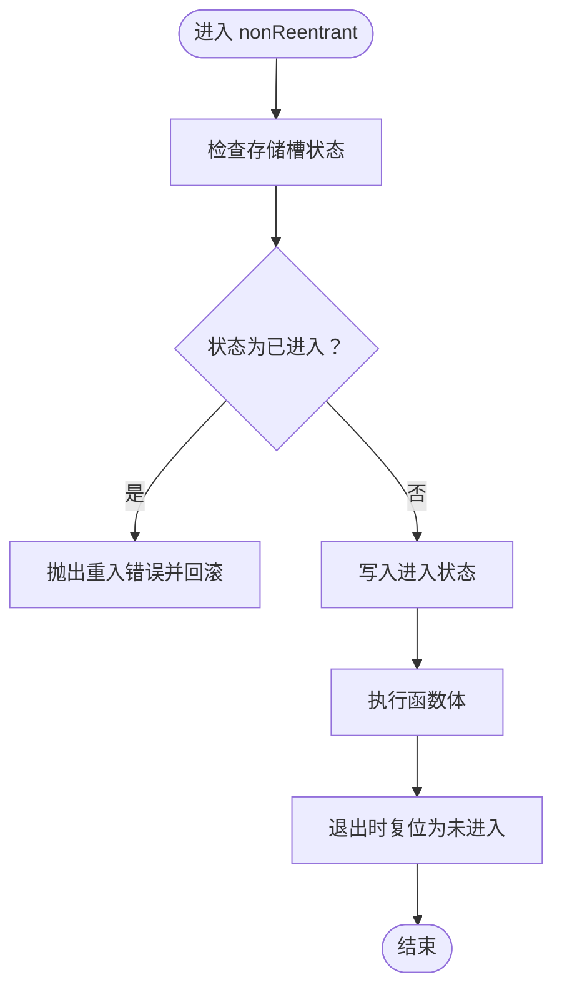
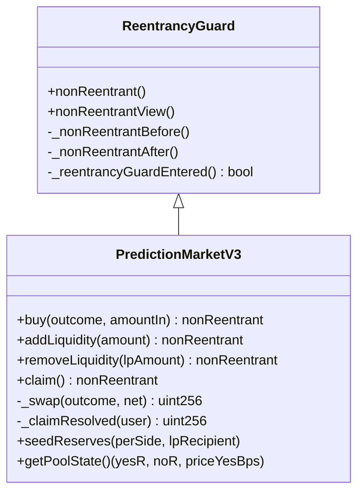
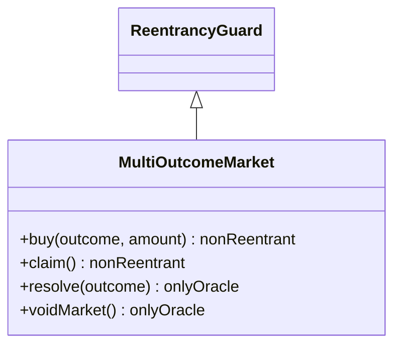
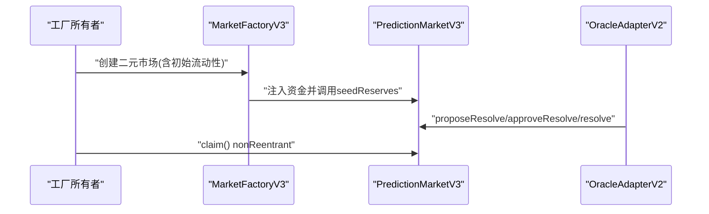
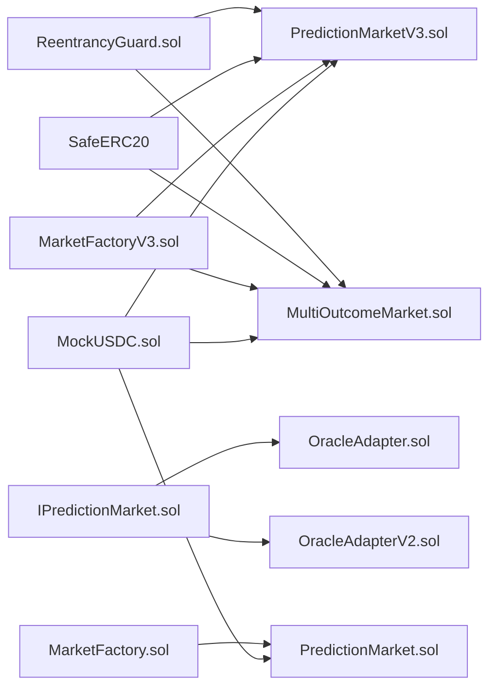

# 重入攻击防护

<cite>
**本文引用的文件**
- [ReentrancyGuard.sol](file://node_modules/@openzeppelin/contracts/utils/ReentrancyGuard.sol)
- [PredictionMarket.sol](file://contracts/contracts/PredictionMarket.sol)
- [PredictionMarketV3.sol](file://contracts/contracts/PredictionMarketV3.sol)
- [MultiOutcomeMarket.sol](file://contracts/contracts/MultiOutcomeMarket.sol)
- [MarketFactory.sol](file://contracts/contracts/MarketFactory.sol)
- [MarketFactoryV3.sol](file://contracts/contracts/MarketFactoryV3.sol)
- [OracleAdapter.sol](file://contracts/contracts/OracleAdapter.sol)
- [OracleAdapterV2.sol](file://contracts/contracts/OracleAdapterV2.sol)
- [IPredictionMarket.sol](file://contracts/contracts/interfaces/IPredictionMarket.sol)
- [MockUSDC.sol](file://contracts/contracts/MockUSDC.sol)
- [PredictionMarket.test.js](file://contracts/test/PredictionMarket.test.js)
- [Phase3.test.js](file://contracts/test/Phase3.test.js)
</cite>

## 目录
1. [引言](#引言)
2. [项目结构](#项目结构)
3. [核心组件](#核心组件)
4. [架构总览](#架构总览)
5. [详细组件分析](#详细组件分析)
6. [依赖关系分析](#依赖关系分析)
7. [性能考量](#性能考量)
8. [故障排查指南](#故障排查指南)
9. [结论](#结论)
10. [附录](#附录)

## 引言
本文件系统性阐述预测市场的重入攻击原理与危害，并结合代码库中的实际实现，重点解析 OpenZeppelin 的 ReentrancyGuard 在合约中的应用机制、状态变量的使用方式以及重入检测逻辑。同时给出在预测市场中资金提取与流动性操作等场景下的安全防护策略，提供可直接参考的代码片段路径与最佳实践。

## 项目结构
该仓库围绕“预测市场”构建，包含二元市场（PredictionMarket）、基于 CPMM 的三版二元市场（PredictionMarketV3）、多结果市场（MultiOutcomeMarket）以及工厂与预言机适配器等配套模块。其中 V3 版本明确继承 ReentrancyGuard 并在关键函数上使用 nonReentrant 修饰符，形成对重入攻击的有效防护。

图表来源
- [MarketFactory.sol](file://contracts/contracts/MarketFactory.sol#L1-L60)
- [MarketFactoryV3.sol](file://contracts/contracts/MarketFactoryV3.sol#L1-L94)
- [PredictionMarket.sol](file://contracts/contracts/PredictionMarket.sol#L1-L134)
- [PredictionMarketV3.sol](file://contracts/contracts/PredictionMarketV3.sol#L1-L200)
- [MultiOutcomeMarket.sol](file://contracts/contracts/MultiOutcomeMarket.sol#L1-L113)
- [OracleAdapter.sol](file://contracts/contracts/OracleAdapter.sol#L1-L83)
- [OracleAdapterV2.sol](file://contracts/contracts/OracleAdapterV2.sol#L1-L83)
- [IPredictionMarket.sol](file://contracts/contracts/interfaces/IPredictionMarket.sol#L1-L9)
- [MockUSDC.sol](file://contracts/contracts/MockUSDC.sol#L1-L18)

章节来源
- [MarketFactory.sol](file://contracts/contracts/MarketFactory.sol#L1-L60)
- [MarketFactoryV3.sol](file://contracts/contracts/MarketFactoryV3.sol#L1-L94)
- [PredictionMarket.sol](file://contracts/contracts/PredictionMarket.sol#L1-L134)
- [PredictionMarketV3.sol](file://contracts/contracts/PredictionMarketV3.sol#L1-L200)
- [MultiOutcomeMarket.sol](file://contracts/contracts/MultiOutcomeMarket.sol#L1-L113)
- [OracleAdapter.sol](file://contracts/contracts/OracleAdapter.sol#L1-L83)
- [OracleAdapterV2.sol](file://contracts/contracts/OracleAdapterV2.sol#L1-L83)
- [IPredictionMarket.sol](file://contracts/contracts/interfaces/IPredictionMarket.sol#L1-L9)
- [MockUSDC.sol](file://contracts/contracts/MockUSDC.sol#L1-L18)

## 核心组件
- ReentrancyGuard：通过存储槽记录进入状态，利用修饰符在函数入口与出口设置/复位标志，防止同一调用栈内的重复进入。
- PredictionMarketV3 与 MultiOutcomeMarket：均继承 ReentrancyGuard，并在 buy、addLiquidity、removeLiquidity、claim 等关键函数上标注 nonReentrant，确保资金转移与余额更新的原子性。
- PredictionMarket：未使用 ReentrancyGuard，存在潜在重入风险，建议迁移至 V3 或显式引入防护。
- 工厂与预言机：负责市场创建与状态决议，不直接处理资金转移时的重入风险，但需避免在 resolve/void 中触发外部回调。

章节来源
- [ReentrancyGuard.sol](file://node_modules/@openzeppelin/contracts/utils/ReentrancyGuard.sol#L32-L120)
- [PredictionMarketV3.sol](file://contracts/contracts/PredictionMarketV3.sol#L9-L200)
- [MultiOutcomeMarket.sol](file://contracts/contracts/MultiOutcomeMarket.sol#L9-L113)
- [PredictionMarket.sol](file://contracts/contracts/PredictionMarket.sol#L1-L134)

## 架构总览
下图展示了从用户到工厂、再到市场的交互流程，以及在 V3 市场中非重入修饰符如何贯穿购买、流动性操作与领取流程：

图表来源
- [MarketFactoryV3.sol](file://contracts/contracts/MarketFactoryV3.sol#L37-L66)
- [PredictionMarketV3.sol](file://contracts/contracts/PredictionMarketV3.sol#L92-L165)
- [OracleAdapterV2.sol](file://contracts/contracts/OracleAdapterV2.sol#L44-L75)
- [MockUSDC.sol](file://contracts/contracts/MockUSDC.sol#L1-L18)

## 详细组件分析

### ReentrancyGuard 实现机制
- 存储槽定位：通过固定哈希值定位一个专用存储槽，避免与用户态状态冲突。
- 状态常量：NOT_ENTERED 与 ENTERED 两个状态值用于判断是否处于重入调用。
- 修饰符行为：
  - nonReentrant：在进入前检查状态，若已进入则回滚；在退出后将状态复位为未进入。
  - nonReentrantView：仅阻止 view 函数被重入，不改变状态。
- 错误类型：当检测到重入调用时抛出 ReentrancyGuardReentrantCall 错误。

图表来源
- [ReentrancyGuard.sol](file://node_modules/@openzeppelin/contracts/utils/ReentrancyGuard.sol#L69-L106)

章节来源
- [ReentrancyGuard.sol](file://node_modules/@openzeppelin/contracts/utils/ReentrancyGuard.sol#L32-L120)

### PredictionMarketV3 的重入防护
- 继承关系：合约直接继承 ReentrancyGuard。
- 关键函数标注：
  - buy：nonReentrant，先扣款再计算份额与余额，避免外部回调读取到中间态。
  - addLiquidity/removeLiquidity：nonReentrant，保证池子与 LP 总量的原子性更新。
  - claim：nonReentrant，确保只可领取一次且金额大于零。
- 内部状态：
  - reserveYes/reserveNo：池子资金，用于 CPMM 计算。
  - lpBalance/totalLPSupply：流动性提供者份额。
  - userBetTotal：用户单笔最大下注限制的累计。
- 与工厂/预言机协作：工厂负责注入初始流动性并播种池子；预言机负责最终状态决议。

图表来源
- [ReentrancyGuard.sol](file://node_modules/@openzeppelin/contracts/utils/ReentrancyGuard.sol#L32-L120)
- [PredictionMarketV3.sol](file://contracts/contracts/PredictionMarketV3.sol#L9-L200)

章节来源
- [PredictionMarketV3.sol](file://contracts/contracts/PredictionMarketV3.sol#L92-L165)
- [PredictionMarketV3.sol](file://contracts/contracts/PredictionMarketV3.sol#L178-L188)
- [PredictionMarketV3.sol](file://contracts/contracts/PredictionMarketV3.sol#L190-L198)

### MultiOutcomeMarket 的重入防护
- 继承关系：同样继承 ReentrancyGuard。
- 关键函数标注：
  - buy：nonReentrant，按结果池累加资金与用户份额。
  - claim：nonReentrant，根据胜出池与总池计算收益并一次性转出。
- 多结果支持：通过数组 pool 与二维映射 stake 支持 2–8 结果。

图表来源
- [MultiOutcomeMarket.sol](file://contracts/contracts/MultiOutcomeMarket.sol#L9-L113)

章节来源
- [MultiOutcomeMarket.sol](file://contracts/contracts/MultiOutcomeMarket.sol#L65-L74)
- [MultiOutcomeMarket.sol](file://contracts/contracts/MultiOutcomeMarket.sol#L89-L111)

### PredictionMarket 的重入风险与迁移建议
- 现状：未继承 ReentrancyGuard，buy/claim 等函数在外部回调时可能被重入，导致状态不一致或超额提取。
- 风险点：
  - claim 中在转账前才检查可提取金额，若回调中再次调用，可能重复领取。
  - buy 中在转账后再更新余额与池子，若回调中读取余额，可能读到中间态。
- 迁移建议：
  - 将合约升级为 V3 版本，或在当前版本显式引入 ReentrancyGuard 并在所有资金相关函数上标注 nonReentrant。
  - 调整状态更新顺序：先更新内部状态，再进行外部转账。

章节来源
- [PredictionMarket.sol](file://contracts/contracts/PredictionMarket.sol#L97-L113)
- [PredictionMarket.sol](file://contracts/contracts/PredictionMarket.sol#L64-L81)

### 工厂与预言机的协作
- MarketFactoryV3：负责部署 V3 市场并注入初始流动性，随后调用 seedReserves 完成池子播种。
- OracleAdapterV2：采用 m-of-n 多签模式，通过提案与批准流程最终执行 resolve，避免单点作恶。
- 协作要点：在 resolve/void 执行前，确保市场状态为 Open；执行后由用户主动发起 claim。

图表来源
- [MarketFactoryV3.sol](file://contracts/contracts/MarketFactoryV3.sol#L46-L66)
- [OracleAdapterV2.sol](file://contracts/contracts/OracleAdapterV2.sol#L44-L75)
- [PredictionMarketV3.sol](file://contracts/contracts/PredictionMarketV3.sol#L151-L165)

章节来源
- [MarketFactoryV3.sol](file://contracts/contracts/MarketFactoryV3.sol#L37-L66)
- [OracleAdapterV2.sol](file://contracts/contracts/OracleAdapterV2.sol#L44-L75)

## 依赖关系分析
- 合约间依赖：
  - V3 市场与多结果市场均依赖 SafeERC20 进行代币安全转账。
  - 工厂依赖 IPredictionMarket 接口以调用 resolve/void。
  - 预言机适配器依赖 AccessControl 控制角色权限。
- 外部依赖：
  - ReentrancyGuard 提供非重入保障。
  - 测试合约依赖 Hardhat 与 Chai 断言框架验证行为。

图表来源
- [ReentrancyGuard.sol](file://node_modules/@openzeppelin/contracts/utils/ReentrancyGuard.sol#L1-L120)
- [PredictionMarketV3.sol](file://contracts/contracts/PredictionMarketV3.sol#L1-L200)
- [MultiOutcomeMarket.sol](file://contracts/contracts/MultiOutcomeMarket.sol#L1-L113)
- [IPredictionMarket.sol](file://contracts/contracts/interfaces/IPredictionMarket.sol#L1-L9)
- [OracleAdapter.sol](file://contracts/contracts/OracleAdapter.sol#L1-L83)
- [OracleAdapterV2.sol](file://contracts/contracts/OracleAdapterV2.sol#L1-L83)
- [MarketFactory.sol](file://contracts/contracts/MarketFactory.sol#L1-L60)
- [MarketFactoryV3.sol](file://contracts/contracts/MarketFactoryV3.sol#L1-L94)
- [MockUSDC.sol](file://contracts/contracts/MockUSDC.sol#L1-L18)

章节来源
- [PredictionMarketV3.sol](file://contracts/contracts/PredictionMarketV3.sol#L1-L200)
- [MultiOutcomeMarket.sol](file://contracts/contracts/MultiOutcomeMarket.sol#L1-L113)
- [OracleAdapter.sol](file://contracts/contracts/OracleAdapter.sol#L1-L83)
- [OracleAdapterV2.sol](file://contracts/contracts/OracleAdapterV2.sol#L1-L83)
- [IPredictionMarket.sol](file://contracts/contracts/interfaces/IPredictionMarket.sol#L1-L9)
- [MockUSDC.sol](file://contracts/contracts/MockUSDC.sol#L1-L18)

## 性能考量
- 存储槽写入成本：每次进入/退出非重入函数都会写入一次存储槽，带来额外的 Gas 成本。
- 视图函数保护：nonReentrantView 可阻止 view 函数被重入，避免读取到不一致状态，但不会改变状态。
- 最佳实践：
  - 对高频资金操作函数使用 nonReentrant。
  - 将相互调用的非重入函数拆分为外部入口与内部实现，避免自调用。
  - 使用 transient storage（如可用）替代 storage-based guard，减少持久化写入。

章节来源
- [ReentrancyGuard.sol](file://node_modules/@openzeppelin/contracts/utils/ReentrancyGuard.sol#L39-L50)
- [ReentrancyGuard.sol](file://node_modules/@openzeppelin/contracts/utils/ReentrancyGuard.sol#L83-L92)

## 故障排查指南
- 常见错误与定位：
  - “already claimed”：已在 V3 市场中通过 claimed 标记防重，若仍出现，检查是否绕过 claim 或存在多重调用。
  - “nothing to claim”：在 resolved 状态下无有效收益或在 Voided 状态下余额为零。
  - “not oracle”：resolve/void 仅允许授权角色调用。
- 测试用例参考：
  - 预言机适配器的多签流程与时间锁路径，可用于验证重放与重入场景。
  - V3 市场的价格滑点与收益计算，可用于验证非重入带来的状态一致性。

章节来源
- [PredictionMarket.test.js](file://contracts/test/PredictionMarket.test.js#L59-L64)
- [Phase3.test.js](file://contracts/test/Phase3.test.js#L6-L27)
- [Phase3.test.js](file://contracts/test/Phase3.test.js#L29-L50)

## 结论
- PredictionMarketV3 与 MultiOutcomeMarket 通过继承 ReentrancyGuard 并在关键函数上使用 nonReentrant，有效阻断了重入攻击路径，保障了资金与状态的一致性。
- PredictionMarket 由于缺少非重入保护，存在明显风险，建议尽快迁移至 V3 或引入同等防护机制。
- 工厂与预言机的配合完善了从创建到结算的全链路，但需避免在决议阶段触发外部回调，降低复杂度与风险面。

## 附录

### 经典 DAO 攻击与重入原理概述
- 原理：攻击者通过回调在收款人合约完成转账前再次触发提现，从而多次取出超过其应得的资产。
- 危害：可能导致资金池被掏空、状态不一致、收益分配失衡。
- 防护：在资金转移前更新状态，在资金转移后不再读取或修改相关状态；使用非重入修饰符或互斥锁。

### 在预测市场中的应用场景与防护策略
- 资金提取（claim）：
  - 策略：先标记已领取，再进行转账；使用 nonReentrant 保证原子性。
  - 参考路径：[PredictionMarketV3.sol](file://contracts/contracts/PredictionMarketV3.sol#L151-L165)、[MultiOutcomeMarket.sol](file://contracts/contracts/MultiOutcomeMarket.sol#L89-L111)
- 池子操作（buy/addLiquidity/removeLiquidity）：
  - 策略：先计算份额/更新池子，再进行转账；使用 nonReentrant 防止外部回调读取中间态。
  - 参考路径：[PredictionMarketV3.sol](file://contracts/contracts/PredictionMarketV3.sol#L92-L135)、[PredictionMarketV3.sol](file://contracts/contracts/PredictionMarketV3.sol#L178-L188)

### 如何正确使用 ReentrancyGuard 修饰符
- 在函数签名处添加 nonReentrant：
  - 示例路径：[PredictionMarketV3.sol](file://contracts/contracts/PredictionMarketV3.sol#L92-L92)、[PredictionMarketV3.sol](file://contracts/contracts/PredictionMarketV3.sol#L113-L113)、[PredictionMarketV3.sol](file://contracts/contracts/PredictionMarketV3.sol#L125-L125)、[PredictionMarketV3.sol](file://contracts/contracts/PredictionMarketV3.sol#L151-L151)
  - 示例路径：[MultiOutcomeMarket.sol](file://contracts/contracts/MultiOutcomeMarket.sol#L65-L65)、[MultiOutcomeMarket.sol](file://contracts/contracts/MultiOutcomeMarket.sol#L89-L89)
- 将相互调用的非重入函数拆分为外部入口与内部实现，避免自调用导致的递归重入。

### 不同合约中的重入风险差异与策略
- PredictionMarket（未使用 ReentrancyGuard）：
  - 风险高：buy/claim 存在重入隐患。
  - 策略：迁移至 V3 或引入非重入保护；调整状态更新顺序。
  - 参考路径：[PredictionMarket.sol](file://contracts/contracts/PredictionMarket.sol#L64-L81)、[PredictionMarket.sol](file://contracts/contracts/PredictionMarket.sol#L97-L113)
- PredictionMarketV3 与 MultiOutcomeMarket（已使用 ReentrancyGuard）：
  - 风险低：通过修饰符与状态管理实现强一致性。
  - 策略：保持现状，持续监控新功能引入的外部回调点。

### 重入攻击的检测与预防最佳实践
- 检测方法：
  - 代码审计：识别资金转移前后是否存在外部回调点。
  - 单元测试：构造恶意回调场景，验证非重入修饰符是否生效。
  - 参考路径：[PredictionMarket.test.js](file://contracts/test/PredictionMarket.test.js#L59-L64)、[Phase3.test.js](file://contracts/test/Phase3.test.js#L6-L27)
- 预防措施：
  - 在转账前更新状态并在转账后不再读取相关状态。
  - 使用非重入修饰符保护所有资金相关函数。
  - 避免在状态变更后立即调用外部合约，必要时采用最小权限与白名单。