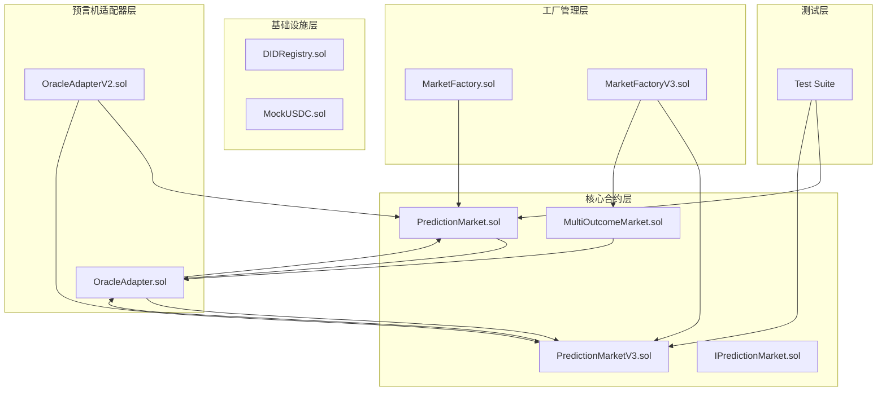
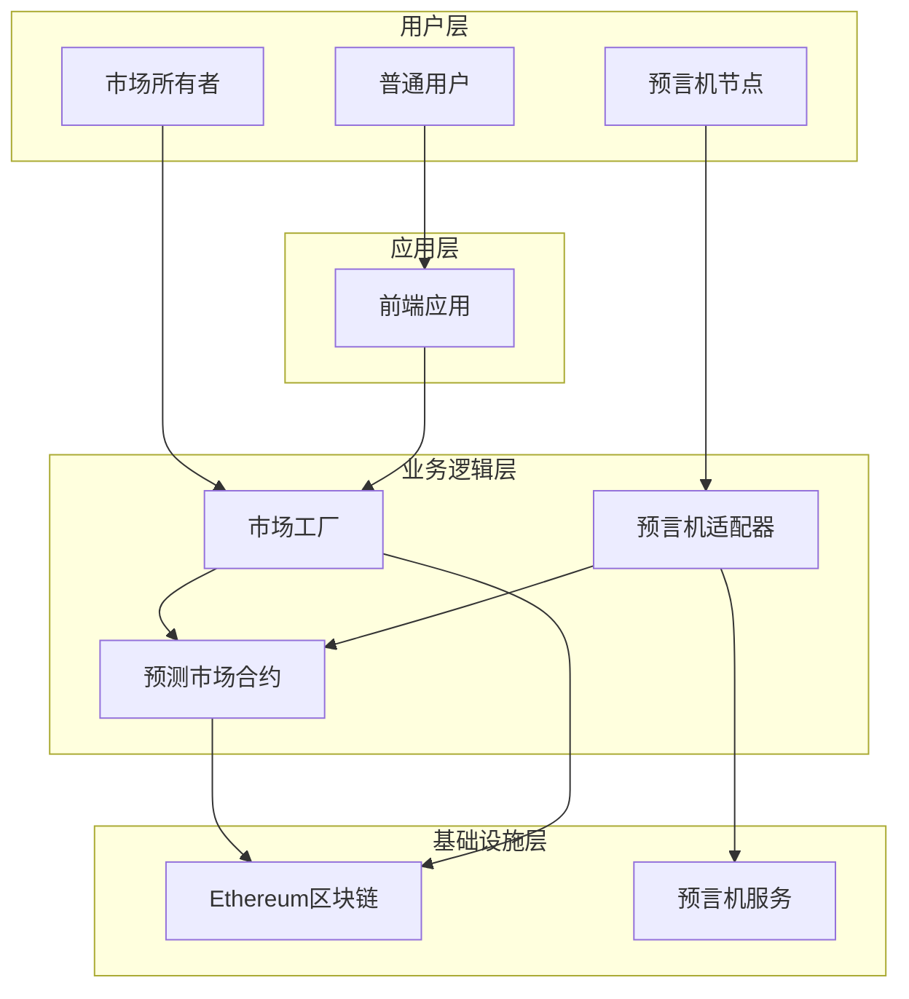
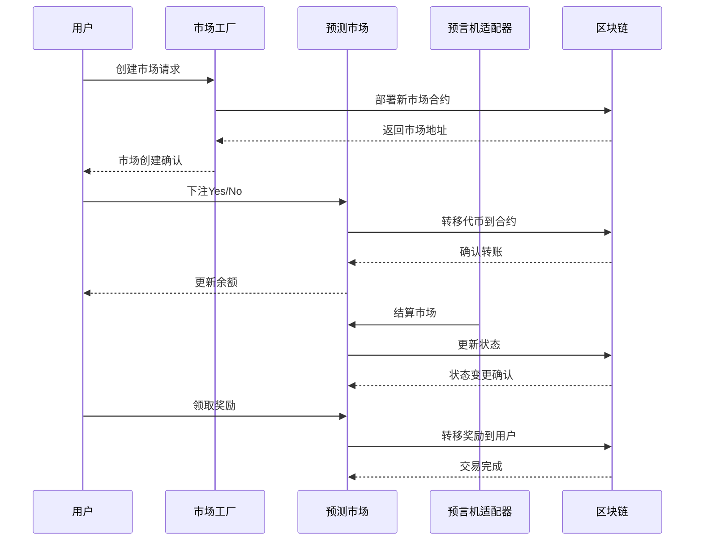
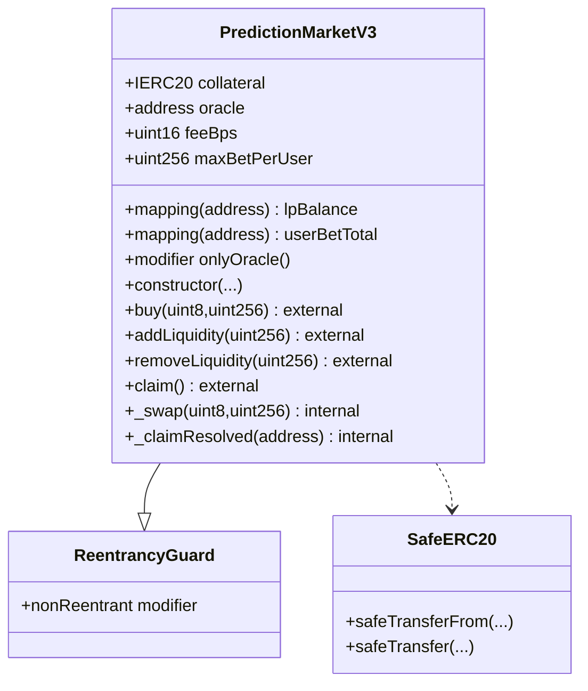
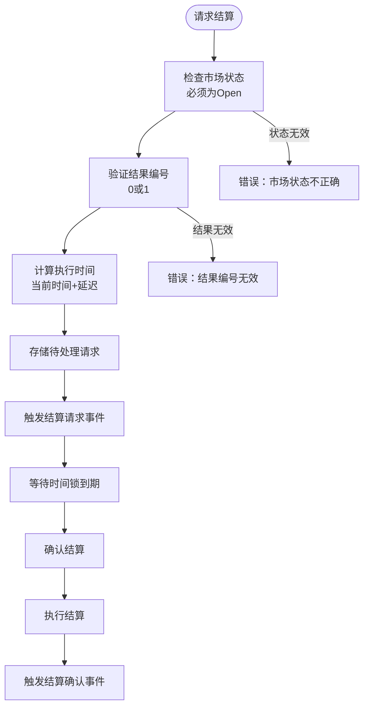
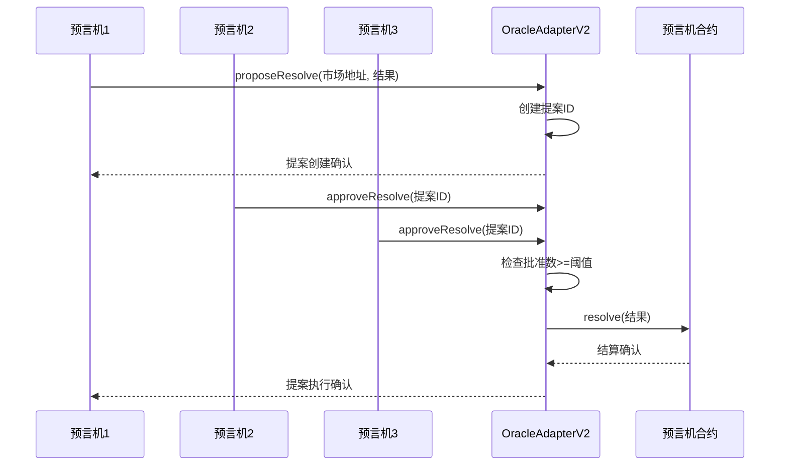
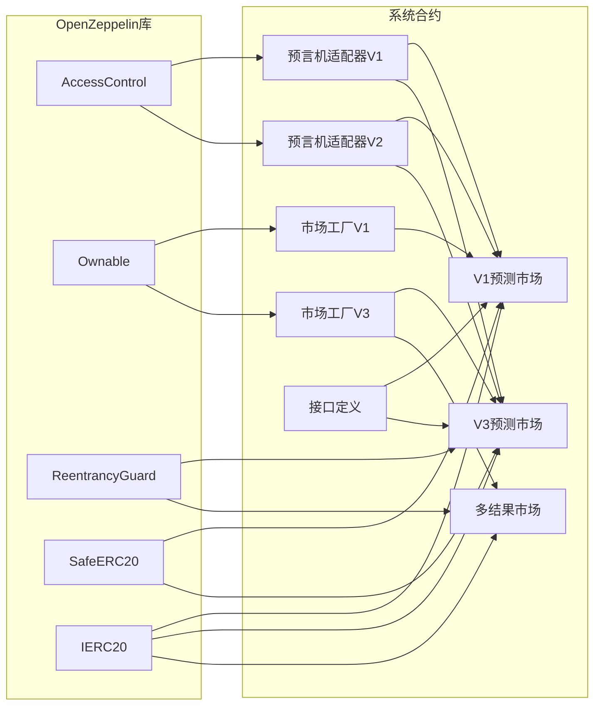

# 安全审计检查清单

<cite>
**本文档引用的文件**
- [PredictionMarket.sol](file://contracts/PredictionMarket.sol)
- [PredictionMarketV3.sol](file://contracts/PredictionMarketV3.sol)
- [IPredictionMarket.sol](file://contracts/interfaces/IPredictionMarket.sol)
- [MarketFactory.sol](file://contracts/MarketFactory.sol)
- [MarketFactoryV3.sol](file://contracts/MarketFactoryV3.sol)
- [OracleAdapter.sol](file://contracts/OracleAdapter.sol)
- [OracleAdapterV2.sol](file://contracts/OracleAdapterV2.sol)
- [MultiOutcomeMarket.sol](file://contracts/MultiOutcomeMarket.sol)
- [DIDRegistry.sol](file://contracts/DIDRegistry.sol)
- [MockUSDC.sol](file://contracts/MockUSDC.sol)
- [PredictionMarket.test.js](file://test/PredictionMarket.test.js)
- [hardhat.config.js](file://hardhat.config.js)
</cite>

## 目录
1. [简介](#简介)
2. [项目结构](#项目结构)
3. [核心组件](#核心组件)
4. [架构概览](#架构概览)
5. [详细组件分析](#详细组件分析)
6. [依赖关系分析](#依赖关系分析)
7. [性能考虑](#性能考虑)
8. [故障排除指南](#故障排除指南)
9. [结论](#结论)
10. [附录](#附录)

## 简介

本安全审计检查清单针对PredictionDIDSimple预测市场智能合约系统进行全面的安全评估。该系统采用分层架构设计，包含二元预测市场、多结果预测市场、市场工厂、预言机适配器等核心组件，支持时间锁机制和多签机制，提供完整的预测市场生命周期管理。

系统主要特点：
- 支持二元预测市场（Parimutuel和CPMM两种模式）
- 支持多结果预测市场（2-8个结果）
- 集成预言机适配器，提供时间锁和多签安全保障
- 实现完整的资金管理和奖励分配机制
- 包含DID注册和身份验证功能

## 项目结构

PredictionDIDSimple项目采用模块化设计，按功能层次组织代码结构：

**图表来源**
- [PredictionMarket.sol:1-145](file://contracts/PredictionMarket.sol#L1-L145)
- [MarketFactory.sol:1-68](file://contracts/MarketFactory.sol#L1-L68)
- [OracleAdapter.sol:1-96](file://contracts/OracleAdapter.sol#L1-L96)

**章节来源**
- [hardhat.config.js:1-33](file://hardhat.config.js#L1-L33)

## 核心组件

### 预测市场合约

系统包含两个版本的预测市场合约，分别支持不同的市场模型：

#### 二元预测市场（PredictionMarket）
- **Parimutuel模型**：所有玩家共享资金池，按投注比例分配奖励
- **状态管理**：Open、Resolved、Voided三种状态
- **资金池**：独立的Yes和No资金池
- **安全特性**：使用SafeERC20进行安全转账

#### CPMM预测市场（PredictionMarketV3）
- **常数乘积做市商模型**：基于恒定乘积公式（x*y=k）的流动性池
- **手续费机制**：支持可配置的手续费率（基点数）
- **流动性管理**：支持LP份额的添加和移除
- **重入保护**：集成ReentrancyGuard防护重入攻击

#### 多结果预测市场（MultiOutcomeMarket）
- **N结果支持**：支持2-8个预测结果
- **费用结构**：统一的手续费计算方式
- **资金池管理**：每个结果独立的资金池

**章节来源**
- [PredictionMarket.sol:11-145](file://contracts/PredictionMarket.sol#L11-L145)
- [PredictionMarketV3.sol:12-218](file://contracts/PredictionMarketV3.sol#L12-L218)
- [MultiOutcomeMarket.sol:12-124](file://contracts/MultiOutcomeMarket.sol#L12-L124)

### 工厂合约

#### MarketFactory
- **二元市场部署**：部署基础的二元预测市场
- **所有权管理**：基于Ownable的权限控制
- **市场索引**：维护市场ID到合约地址的映射

#### MarketFactoryV3
- **多市场支持**：同时支持二元CPMM和多结果市场
- **暂停机制**：集成Pausable合约实现紧急暂停
- **默认参数**：提供默认手续费率和最大押注限制

**章节来源**
- [MarketFactory.sol:12-68](file://contracts/MarketFactory.sol#L12-L68)
- [MarketFactoryV3.sol:14-104](file://contracts/MarketFactoryV3.sol#L14-L104)

### 预言机适配器

#### OracleAdapter
- **时间锁机制**：防止即时结算，提供审查期
- **角色控制**：基于AccessControl的角色管理系统
- **快速路径**：时间锁为0时的直接结算

#### OracleAdapterV2
- **多签机制**：m-of-n多签名批准系统
- **提案管理**：完整的提案创建、批准、执行流程
- **去中心化治理**：支持多个预言机共同决策

**章节来源**
- [OracleAdapter.sol:11-96](file://contracts/OracleAdapter.sol#L11-L96)
- [OracleAdapterV2.sol:11-95](file://contracts/OracleAdapterV2.sol#L11-L95)

## 架构概览

系统采用分层架构设计，确保职责分离和安全性：

**图表来源**
- [MarketFactoryV3.sol:31-74](file://contracts/MarketFactoryV3.sol#L31-L74)
- [OracleAdapterV2.sol:34-86](file://contracts/OracleAdapterV2.sol#L34-L86)

### 数据流分析

**图表来源**
- [PredictionMarketV3.sol:101-120](file://contracts/PredictionMarketV3.sol#L101-L120)
- [OracleAdapterV2.sol:52-86](file://contracts/OracleAdapterV2.sol#L52-L86)

## 详细组件分析

### PredictionMarketV3 安全分析

#### 关键安全特性

**图表来源**
- [PredictionMarketV3.sol:12-14](file://contracts/PredictionMarketV3.sol#L12-L14)

#### 安全检查要点

1. **重入攻击防护**
   - 使用`nonReentrant`修饰符保护关键函数
   - 防护`claim()`、`buy()`、`addLiquidity()`、`removeLiquidity()`等函数

2. **资金管理安全**
   - 使用`SafeERC20`库确保安全转账
   - 实施最大押注限制防止市场操纵
   - 验证流动性种子资金充足性

3. **状态不变式**
   - `reserveYes + reserveNo = totalLPSupply`
   - `lpBalance[用户] <= totalLPSupply`
   - `userBetTotal[用户] >= 0`

**章节来源**
- [PredictionMarketV3.sol:101-120](file://contracts/PredictionMarketV3.sol#L101-L120)
- [PredictionMarketV3.sol:123-146](file://contracts/PredictionMarketV3.sol#L123-L146)
- [PredictionMarketV3.sol:165-179](file://contracts/PredictionMarketV3.sol#L165-L179)

### OracleAdapter 安全分析

#### 时间锁机制

**图表来源**
- [OracleAdapter.sol:58-78](file://contracts/OracleAdapter.sol#L58-L78)

#### 多签机制

**图表来源**
- [OracleAdapterV2.sol:52-86](file://contracts/OracleAdapterV2.sol#L52-L86)

**章节来源**
- [OracleAdapter.sol:58-87](file://contracts/OracleAdapter.sol#L58-L87)
- [OracleAdapterV2.sol:67-86](file://contracts/OracleAdapterV2.sol#L67-L86)

### 多结果市场安全分析

#### 资金池管理

多结果市场采用统一的parimutuel模型，需要特别关注以下安全要点：

1. **资金池完整性**
   - 确保所有结果的资金池之和等于总池
   - 验证每个用户在不同结果上的押注不会溢出

2. **奖励分配公平性**
   - 实施精确的奖励计算算法
   - 防止浮点数精度问题导致的资金损失

3. **状态一致性**
   - 维护pool数组和stake映射的一致性
   - 确保claim操作不会产生负值

**章节来源**
- [MultiOutcomeMarket.sol:73-122](file://contracts/MultiOutcomeMarket.sol#L73-L122)

## 依赖关系分析

### 合约依赖图

**图表来源**
- [PredictionMarket.sol:6-8](file://contracts/PredictionMarket.sol#L6-L8)
- [PredictionMarketV3.sol:6-9](file://contracts/PredictionMarketV3.sol#L6-L9)
- [MultiOutcomeMarket.sol:6-9](file://contracts/MultiOutcomeMarket.sol#L6-L9)

### 外部依赖风险

1. **OpenZeppelin库版本**
   - 需要确保使用经过安全审计的稳定版本
   - 关注库的安全更新和漏洞修复

2. **EVM版本兼容性**
   - 使用Cancun EVM版本，需验证所有功能的兼容性
   - 注意新EVM特性的安全影响

**章节来源**
- [hardhat.config.js:10-16](file://hardhat.config.js#L10-L16)

## 性能考虑

### Gas优化策略

1. **状态变量布局**
   - 合理安排状态变量位置以减少存储成本
   - 使用mapping减少动态数组的gas消耗

2. **循环优化**
   - 在多结果市场中避免不必要的循环
   - 使用缓存机制减少重复计算

3. **批量操作**
   - 支持批量流动性添加和移除
   - 优化批量结算操作的gas效率

### 扩展性考虑

1. **市场类型扩展**
   - 支持更多结果数量的市场
   - 实现自定义市场类型的插件机制

2. **预言机扩展**
   - 支持更多预言机服务提供商
   - 实现预言机权重和信誉系统

## 故障排除指南

### 常见安全问题诊断

#### 重入攻击检测
- **症状**：合约余额异常变化，用户能够重复提取奖励
- **检测方法**：使用静态分析工具检查函数调用链
- **修复方案**：确保所有外部调用都在重入保护之后执行

#### 状态不一致问题
- **症状**：资金池与用户余额不匹配
- **检测方法**：实施状态不变式检查
- **修复方案**：在每次状态修改后验证不变式

#### 权限控制问题
- **症状**：非授权用户能够执行敏感操作
- **检测方法**：审查所有onlyRole和onlyOwner修饰符
- **修复方案**：确保角色分配和权限验证逻辑正确

**章节来源**
- [PredictionMarketV3.sol:101-179](file://contracts/PredictionMarketV3.sol#L101-L179)
- [OracleAdapterV2.sol:67-86](file://contracts/OracleAdapterV2.sol#L67-L86)

### 测试覆盖范围

#### 单元测试重点
- **状态转换测试**：验证Open→Resolved→Voided的状态转换
- **边界条件测试**：测试最大值、最小值、零值等边界情况
- **异常路径测试**：验证错误输入和异常情况的处理

#### 集成测试建议
- **跨合约交互测试**：验证工厂、市场、预言机之间的交互
- **时间相关测试**：测试时间锁和定时执行功能
- **并发测试**：模拟多个用户同时操作的情况

**章节来源**
- [PredictionMarket.test.js:36-76](file://test/PredictionMarket.test.js#L36-L76)

## 结论

PredictionDIDSimple预测市场系统在安全性方面表现出色，采用了多项重要的安全措施：

### 主要安全优势
1. **多层次防护**：结合重入保护、权限控制、时间锁等多种安全机制
2. **模块化设计**：清晰的职责分离，便于安全审计和维护
3. **标准化实现**：遵循OpenZeppelin最佳实践
4. **完整测试覆盖**：包含单元测试和集成测试

### 需要关注的风险点
1. **预言机信任模型**：需要建立可靠的预言机激励机制
2. **流动性风险管理**：CPMM模型中的流动性提供者风险
3. **Gas费用优化**：大规模部署时的gas成本控制
4. **升级路径**：合约升级的安全性和向后兼容性

### 建议的改进方向
1. **增强监控机制**：添加更详细的事件日志和监控指标
2. **去中心化治理**：引入社区治理机制
3. **保险机制**：为流动性提供者提供保险保障
4. **审计自动化**：建立持续的安全审计流程

## 附录

### 安全审计检查清单

#### 代码审查标准
- [ ] 所有外部调用都经过适当的权限验证
- [ ] 重入攻击防护机制完整有效
- [ ] 状态变量修改前后保持不变式
- [ ] 边界条件和异常情况得到妥善处理
- [ ] 所有权和权限控制逻辑正确
- [ ] 事件日志完整且有意义
- [ ] 错误处理和回退机制合理

#### 预测市场专项检查
- [ ] 资金池计算准确性验证
- [ ] 奖励分配算法正确性
- [ ] 最大押注限制有效性
- [ ] 流动性池平衡性检查
- [ ] 手续费计算精度验证

#### 安全测试方法
- [ ] 静态分析工具扫描
- [ ] 动态模糊测试
- [ ] 形式化验证
- [ ] 社区审计
- [ ] 渗透测试

#### 漏洞扫描工具
- [ ] Slither（静态分析）
- [ ] Mythril（模型检测）
- [ ] Oyente（形式化验证）
- [ ] Manticore（符号执行）

#### 审计报告模板
- [ ] 合约基本信息
- [ ] 安全评估等级
- [ ] 发现的问题列表
- [ ] 修复建议和优先级
- [ ] 测试结果和证据
- [ ] 最终结论和建议

#### 缺陷跟踪流程
- [ ] 问题分类和优先级
- [ ] 修复计划和时间表
- [ ] 代码审查和回归测试
- [ ] 重新审计和验证
- [ ] 文档更新和发布