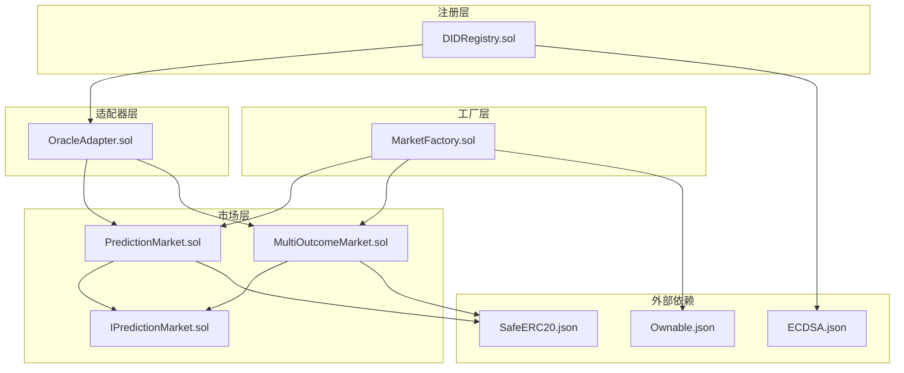
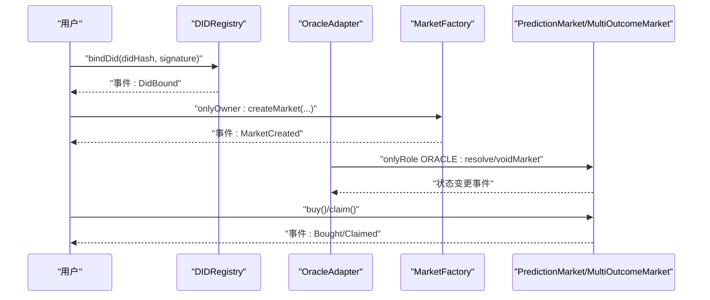
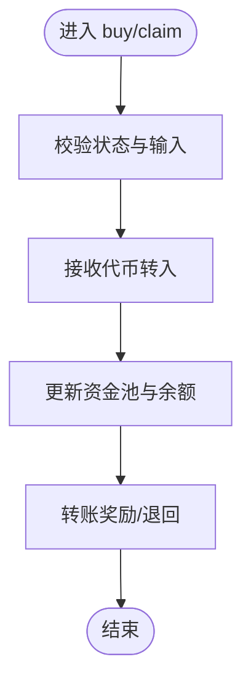
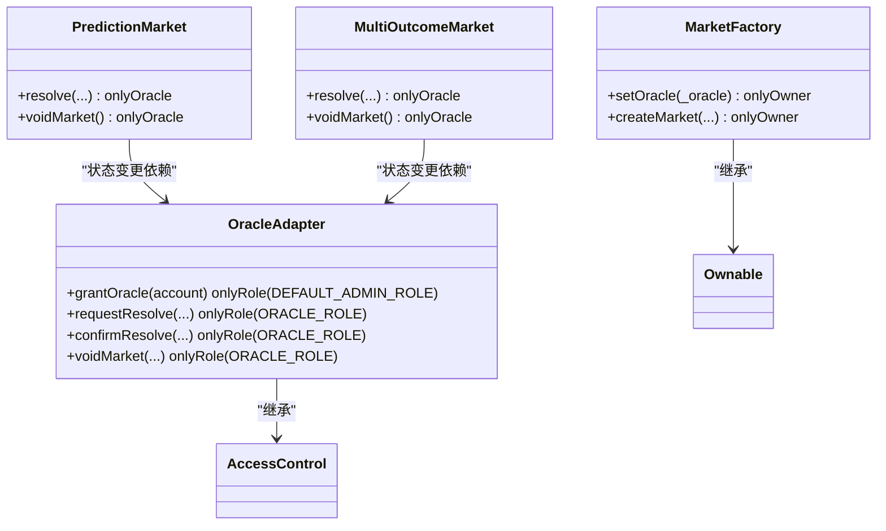
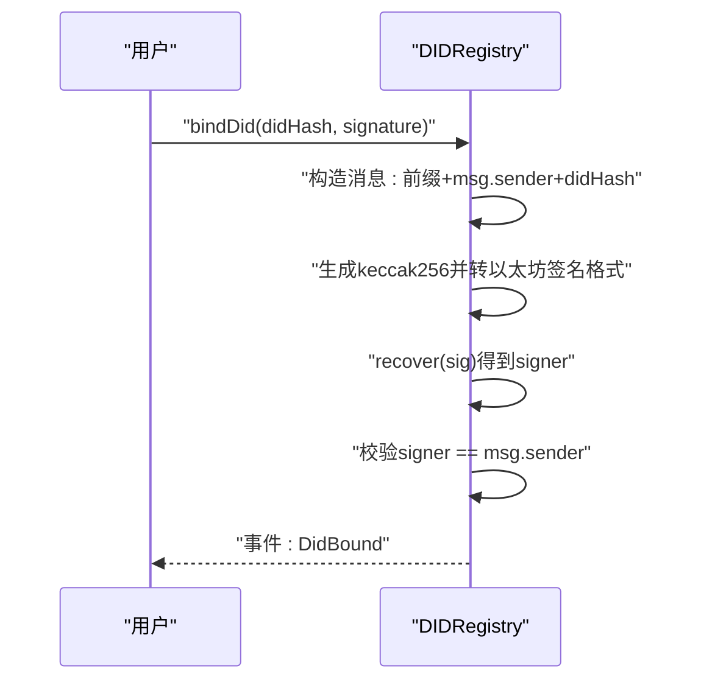
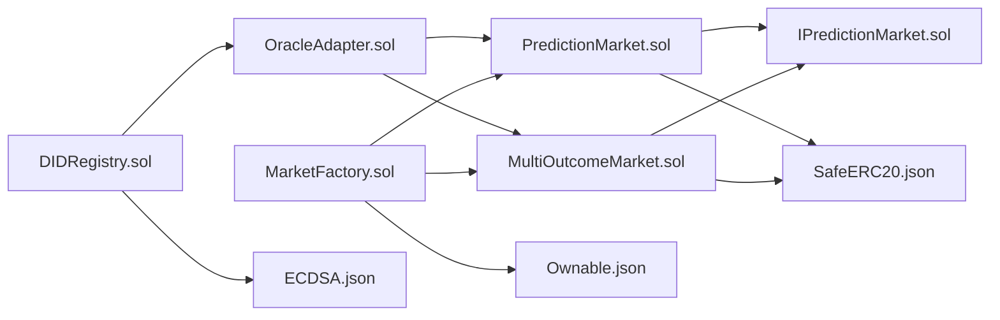

# 安全考虑

<cite>
**本文档引用的文件**
- [DIDRegistry.sol](file://contracts/DIDRegistry.sol)
- [PredictionMarket.sol](file://contracts/PredictionMarket.sol)
- [MultiOutcomeMarket.sol](file://contracts/MultiOutcomeMarket.sol)
- [MarketFactory.sol](file://contracts/MarketFactory.sol)
- [OracleAdapter.sol](file://contracts/OracleAdapter.sol)
- [IPredictionMarket.sol](file://contracts/interfaces/IPredictionMarket.sol)
- [Ownable.json](file://artifacts/@openzeppelin/contracts/access/Ownable.sol/Ownable.json)
- [ECDSA.json](file://artifacts/@openzeppelin/contracts/utils/cryptography/ECDSA.sol/ECDSA.json)
- [SafeERC20.json](file://artifacts/@openzeppelin/contracts/token/ERC20/utils/SafeERC20.sol/SafeERC20.json)
- [PredictionMarket.test.js](file://test/PredictionMarket.test.js)
- [hardhat.config.js](file://hardhat.config.js)
</cite>

## 目录
1. [引言](#引言)
2. [项目结构](#项目结构)
3. [核心组件](#核心组件)
4. [架构总览](#架构总览)
5. [详细组件分析](#详细组件分析)
6. [依赖分析](#依赖分析)
7. [性能考虑](#性能考虑)
8. [故障排查指南](#故障排查指南)
9. [结论](#结论)
10. [附录](#附录)

## 引言
本文件面向预测市场DID认证系统，聚焦于安全审计要点、常见漏洞防范与最佳实践。通过对代码库中的合约与测试进行深入分析，总结重入攻击防护、访问控制机制、安全修饰符使用、签名验证与权限模型等关键安全主题，并给出风险评估、威胁建模、缓解策略、代码审查清单、安全测试方法与监控建议，帮助开发者构建更稳健的智能合约系统。

## 项目结构
系统由以下模块构成：
- 市场层：二元与多结果预测市场合约，负责资金池、投注、结算与领奖流程
- 工厂层：负责市场部署与基本参数管理
- 适配器层：基于角色的预言机适配器，提供时间锁与快速结算路径
- 注册层：DID注册与解析，结合签名验证确保身份绑定
- 接口层：定义市场核心能力契约
- 测试与配置：通过Hardhat与Chai进行单元测试与覆盖率统计

图表来源
- [DIDRegistry.sol:12-38](file://contracts/DIDRegistry.sol#L12-L38)
- [MarketFactory.sol:12-67](file://contracts/MarketFactory.sol#L12-L67)
- [PredictionMarket.sol:11-145](file://contracts/PredictionMarket.sol#L11-L145)
- [MultiOutcomeMarket.sol:12-124](file://contracts/MultiOutcomeMarket.sol#L12-L124)
- [OracleAdapter.sol:11-96](file://contracts/OracleAdapter.sol#L11-L96)
- [IPredictionMarket.sol:7-15](file://contracts/interfaces/IPredictionMarket.sol#L7-L15)
- [Ownable.json:1-86](file://artifacts/@openzeppelin/contracts/access/Ownable.sol/Ownable.json#L1-L86)
- [ECDSA.json:1-39](file://artifacts/@openzeppelin/contracts/utils/cryptography/ECDSA.sol/ECDSA.json#L1-L39)
- [SafeERC20.json:1-44](file://artifacts/@openzeppelin/contracts/token/ERC20/utils/SafeERC20.sol/SafeERC20.json#L1-L44)

章节来源
- [DIDRegistry.sol:12-38](file://contracts/DIDRegistry.sol#L12-L38)
- [MarketFactory.sol:12-67](file://contracts/MarketFactory.sol#L12-L67)
- [PredictionMarket.sol:11-145](file://contracts/PredictionMarket.sol#L11-L145)
- [MultiOutcomeMarket.sol:12-124](file://contracts/MultiOutcomeMarket.sol#L12-L124)
- [OracleAdapter.sol:11-96](file://contracts/OracleAdapter.sol#L11-L96)
- [IPredictionMarket.sol:7-15](file://contracts/interfaces/IPredictionMarket.sol#L7-L15)

## 核心组件
- DID注册与解析：通过ECDSA签名验证绑定DID哈希，防止他人冒用身份
- 市场合约：二元与多结果市场，采用安全ERC20转账与资金池逻辑
- 工厂合约：Ownable权限模型，限制市场创建与预言机变更
- 适配器合约：AccessControl角色模型，时间锁机制降低预言机滥用风险
- 接口契约：统一市场能力，便于适配器与外部集成

章节来源
- [DIDRegistry.sol:22-37](file://contracts/DIDRegistry.sol#L22-L37)
- [PredictionMarket.sol:71-123](file://contracts/PredictionMarket.sol#L71-L123)
- [MultiOutcomeMarket.sol:73-122](file://contracts/MultiOutcomeMarket.sol#L73-L122)
- [MarketFactory.sol:37-61](file://contracts/MarketFactory.sol#L37-L61)
- [OracleAdapter.sol:11-96](file://contracts/OracleAdapter.sol#L11-L96)
- [IPredictionMarket.sol:8-14](file://contracts/interfaces/IPredictionMarket.sol#L8-L14)

## 架构总览
系统采用分层设计，注册层提供身份绑定，工厂层负责市场生命周期管理，适配器层提供预言机能力与时间锁，市场层实现资金池与结算逻辑。权限模型贯穿各层，确保关键操作受控。

图表来源
- [DIDRegistry.sol:22-37](file://contracts/DIDRegistry.sol#L22-L37)
- [OracleAdapter.sol:57-94](file://contracts/OracleAdapter.sol#L57-L94)
- [MarketFactory.sol:43-61](file://contracts/MarketFactory.sol#L43-L61)
- [PredictionMarket.sol:71-123](file://contracts/PredictionMarket.sol#L71-L123)
- [MultiOutcomeMarket.sol:73-122](file://contracts/MultiOutcomeMarket.sol#L73-L122)

## 详细组件分析

### 重入攻击防护
- 多结果市场合约直接继承重入保护基类，关键函数使用非重入修饰符，有效阻断递归调用与外部恶意回调
- 二元市场合约未显式使用非重入修饰符，但其内部状态更新顺序与资金转移均在最后一步完成，降低了重入窗口；仍建议在外部可重入调用路径上补充非重入保护

图表来源
- [MultiOutcomeMarket.sol:73-82](file://contracts/MultiOutcomeMarket.sol#L73-L82)
- [MultiOutcomeMarket.sol:99-122](file://contracts/MultiOutcomeMarket.sol#L99-L122)
- [PredictionMarket.sol:71-88](file://contracts/PredictionMarket.sol#L71-L88)
- [PredictionMarket.sol:107-123](file://contracts/PredictionMarket.sol#L107-L123)

章节来源
- [MultiOutcomeMarket.sol:12-12](file://contracts/MultiOutcomeMarket.sol#L12)
- [MultiOutcomeMarket.sol:73-82](file://contracts/MultiOutcomeMarket.sol#L73-L82)
- [MultiOutcomeMarket.sol:99-122](file://contracts/MultiOutcomeMarket.sol#L99-L122)
- [PredictionMarket.sol:71-88](file://contracts/PredictionMarket.sol#L71-L88)
- [PredictionMarket.sol:107-123](file://contracts/PredictionMarket.sol#L107-L123)

### 访问控制机制与安全修饰符
- Ownable：工厂合约使用所有者修饰符限制关键配置与创建操作
- AccessControl：适配器使用角色模型，仅授予ORACLE_ROLE的账户可执行结算与作废
- 自定义onlyOracle：市场合约使用自定义修饰符限定结算与作废操作仅由预言机调用
- 修饰符组合：在需要时可将多个修饰符叠加，形成更强的权限约束

图表来源
- [MarketFactory.sol:37-61](file://contracts/MarketFactory.sol#L37-L61)
- [OracleAdapter.sol:52-94](file://contracts/OracleAdapter.sol#L52-L94)
- [PredictionMarket.sol:90-104](file://contracts/PredictionMarket.sol#L90-L104)
- [MultiOutcomeMarket.sol:84-97](file://contracts/MultiOutcomeMarket.sol#L84-L97)

章节来源
- [MarketFactory.sol:12-12](file://contracts/MarketFactory.sol#L12)
- [MarketFactory.sol:37-61](file://contracts/MarketFactory.sol#L37-L61)
- [OracleAdapter.sol:11-11](file://contracts/OracleAdapter.sol#L11-L11)
- [OracleAdapter.sol:52-94](file://contracts/OracleAdapter.sol#L52-L94)
- [PredictionMarket.sol:43-47](file://contracts/PredictionMarket.sol#L43-L47)
- [PredictionMarket.sol:90-104](file://contracts/PredictionMarket.sol#L90-L104)
- [MultiOutcomeMarket.sol:38-42](file://contracts/MultiOutcomeMarket.sol#L38-L42)
- [MultiOutcomeMarket.sol:84-97](file://contracts/MultiOutcomeMarket.sol#L84-L97)

### 签名验证与身份绑定
- DID注册合约通过ECDSA对“前缀+地址+哈希”的消息进行签名验证，确保绑定请求由账户私钥签发
- 使用消息哈希工具转换为以太坊签名格式，提升跨客户端兼容性

图表来源
- [DIDRegistry.sol:22-32](file://contracts/DIDRegistry.sol#L22-L32)
- [ECDSA.json:1-39](file://artifacts/@openzeppelin/contracts/utils/cryptography/ECDSA.sol/ECDSA.json#L1-L39)

章节来源
- [DIDRegistry.sol:22-32](file://contracts/DIDRegistry.sol#L22-L32)
- [ECDSA.json:1-39](file://artifacts/@openzeppelin/contracts/utils/cryptography/ECDSA.sol/ECDSA.json#L1-L39)

### 代币安全与资金池逻辑
- 二元与多结果市场均使用安全ERC20转账库，避免低级错误导致资金损失
- 资金池与用户余额更新遵循先增减再转账的原则，减少状态不一致风险

章节来源
- [PredictionMarket.sol:12-12](file://contracts/PredictionMarket.sol#L12)
- [MultiOutcomeMarket.sol:12-12](file://contracts/MultiOutcomeMarket.sol#L12)
- [SafeERC20.json:1-44](file://artifacts/@openzeppelin/contracts/token/ERC20/utils/SafeERC20.sol/SafeERC20.json#L1-L44)

### 时间锁与快速路径
- 适配器提供时间锁延迟，要求先请求再确认，降低预言机误操作与抢先交易风险
- 当时间锁为0时提供快速结算路径，简化正常场景下的调用

章节来源
- [OracleAdapter.sol:57-87](file://contracts/OracleAdapter.sol#L57-L87)

## 依赖分析
- OpenZeppelin库广泛用于权限控制、加密工具与安全转账
- 合约间通过接口契约解耦，适配器与市场通过状态查询与外部调用交互
- 工厂合约作为部署入口，集中管理市场地址映射与版本信息

图表来源
- [IPredictionMarket.sol:7-15](file://contracts/interfaces/IPredictionMarket.sol#L7-L15)
- [OracleAdapter.sol:11-96](file://contracts/OracleAdapter.sol#L11-L96)
- [MarketFactory.sol:12-67](file://contracts/MarketFactory.sol#L12-L67)
- [DIDRegistry.sol:12-38](file://contracts/DIDRegistry.sol#L12-L38)
- [PredictionMarket.sol:11-145](file://contracts/PredictionMarket.sol#L11-L145)
- [MultiOutcomeMarket.sol:12-124](file://contracts/MultiOutcomeMarket.sol#L12-L124)
- [Ownable.json:1-86](file://artifacts/@openzeppelin/contracts/access/Ownable.sol/Ownable.json#L1-L86)
- [ECDSA.json:1-39](file://artifacts/@openzeppelin/contracts/utils/cryptography/ECDSA.sol/ECDSA.json#L1-L39)
- [SafeERC20.json:1-44](file://artifacts/@openzeppelin/contracts/token/ERC20/utils/SafeERC20.sol/SafeERC20.json#L1-L44)

章节来源
- [IPredictionMarket.sol:7-15](file://contracts/interfaces/IPredictionMarket.sol#L7-L15)
- [OracleAdapter.sol:11-96](file://contracts/OracleAdapter.sol#L11-L96)
- [MarketFactory.sol:12-67](file://contracts/MarketFactory.sol#L12-L67)
- [DIDRegistry.sol:12-38](file://contracts/DIDRegistry.sol#L12-L38)
- [PredictionMarket.sol:11-145](file://contracts/PredictionMarket.sol#L11-L145)
- [MultiOutcomeMarket.sol:12-124](file://contracts/MultiOutcomeMarket.sol#L12-L124)
- [Ownable.json:1-86](file://artifacts/@openzeppelin/contracts/access/Ownable.sol/Ownable.json#L1-L86)
- [ECDSA.json:1-39](file://artifacts/@openzeppelin/contracts/utils/cryptography/ECDSA.sol/ECDSA.json#L1-L39)
- [SafeERC20.json:1-44](file://artifacts/@openzeppelin/contracts/token/ERC20/utils/SafeERC20.sol/SafeERC20.json#L1-L44)

## 性能考虑
- 优化器开启与EVM版本选择：配置中启用了编译器优化与较新的EVM版本，有助于降低Gas消耗
- 资金池与余额映射：采用简单数组与映射，读写复杂度低，适合高频交易场景
- 事件日志：合理使用事件记录关键状态变化，便于前端索引与链下监控

章节来源
- [hardhat.config.js:10-16](file://hardhat.config.js#L10-L16)

## 故障排查指南
- 权限错误
  - Ownable：检查调用者是否为合约所有者
  - AccessControl：检查是否授予了ORACLE_ROLE
  - 自定义修饰符：确认调用者满足onlyOracle条件
- 状态错误
  - 市场未开放或已过期：检查状态与截止时间
  - 已作废或已结算：确认领取逻辑与状态匹配
- 重复操作
  - 领取奖励需去重标记，避免重复领取
- 代币授权
  - 用户需预先授权市场合约使用代币额度
- 测试参考
  - 单元测试覆盖了购买、结算、领取与权限拒绝等关键路径

章节来源
- [PredictionMarket.test.js:36-76](file://test/PredictionMarket.test.js#L36-L76)
- [Ownable.json:14-27](file://artifacts/@openzeppelin/contracts/access/Ownable.sol/Ownable.json#L14-L27)
- [ECDSA.json:6-32](file://artifacts/@openzeppelin/contracts/utils/cryptography/ECDSA.sol/ECDSA.json#L6-L32)
- [SafeERC20.json:6-37](file://artifacts/@openzeppelin/contracts/token/ERC20/utils/SafeERC20.sol/SafeERC20.json#L6-L37)

## 结论
本系统在权限模型、签名验证与资金安全方面具备良好基础，重入攻击防护在多结果市场中得到强化。建议在二元市场中引入非重入保护，在接口契约与适配器层面进一步细化权限边界，并完善链上与链下监控体系，持续提升整体安全性与可维护性。

## 附录

### 安全审计要点清单
- 权限模型
  - 是否使用最小权限原则
  - 是否区分默认管理员与业务角色
  - 是否存在权限升级路径与回退机制
- 输入校验
  - 是否对所有外部输入进行范围与格式校验
  - 是否处理边界值与溢出风险
- 状态一致性
  - 是否遵循先状态后转账的模式
  - 是否存在跨调用的状态竞态
- 重入攻击
  - 关键函数是否使用非重入保护
  - 是否避免在转账前后调用外部合约
- 加密与签名
  - 是否使用标准消息格式与哈希工具
  - 是否对签名长度与有效性进行严格校验
- 事件与日志
  - 是否完整记录关键状态变更
  - 是否便于链下检索与审计

### 威胁建模与缓解策略
- 威胁：预言机滥用
  - 缓解：时间锁延迟与角色分离，必要时引入多重签名
- 威胁：重入攻击
  - 缓解：在外部可重入路径使用非重入修饰符，避免在转账前调用未知合约
- 威胁：权限提升
  - 缓解：定期审计所有者与角色授权，实施治理提案与延迟执行
- 威胁：签名伪造
  - 缓解：标准化消息格式，严格校验签名长度与恢复地址

### 代码审查检查清单
- 权限
  - 关键函数是否标注正确修饰符
  - 是否存在未授权访问的公共函数
- 状态
  - 状态变更是否幂等
  - 是否存在未清理的中间状态
- 代币
  - 是否使用安全转账库
  - 是否检查授权额度与余额
- 边界
  - 是否处理0值与最大值
  - 是否考虑整数溢出与下溢
- 事件
  - 是否记录足够上下文
  - 是否避免冗余事件

### 安全测试方法
- 单元测试
  - 覆盖正常路径、异常路径与边界条件
  - 针对权限、状态与资金流分别编写用例
- 集成测试
  - 模拟适配器与市场的交互序列
  - 验证时间锁与快速路径的行为差异
- 模糊测试
  - 对输入空间进行随机化测试
  - 关注重入、权限与溢出场景
- 静态分析
  - 使用编译器警告与形式化验证工具
  - 关注未使用变量与潜在安全问题

### 监控建议
- 区块链监控
  - 关注高价值交易与异常批量操作
  - 监控权限变更与状态异常事件
- 日志与告警
  - 对关键函数调用建立链上日志
  - 设置阈值告警与人工复核流程
- 运维流程
  - 实施变更审批与灰度发布
  - 建立应急响应预案与热修复通道