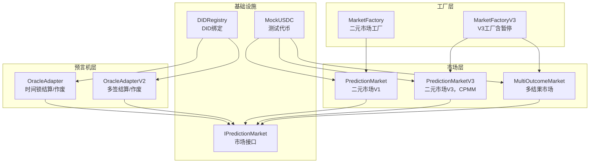
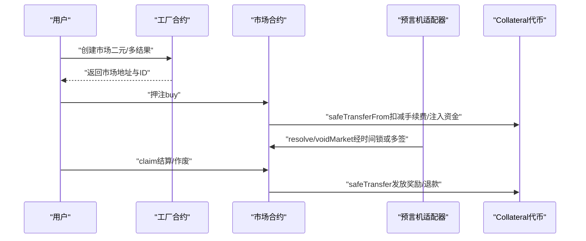
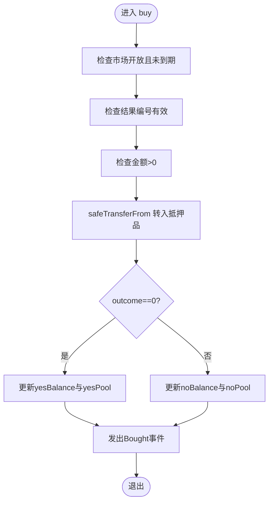
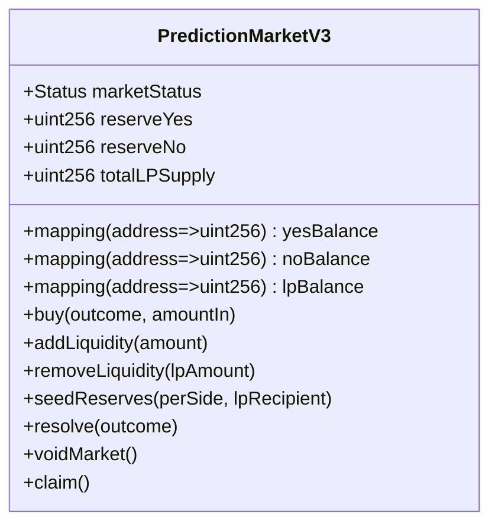
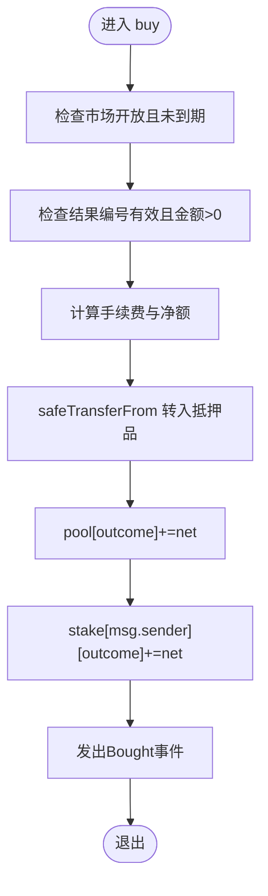
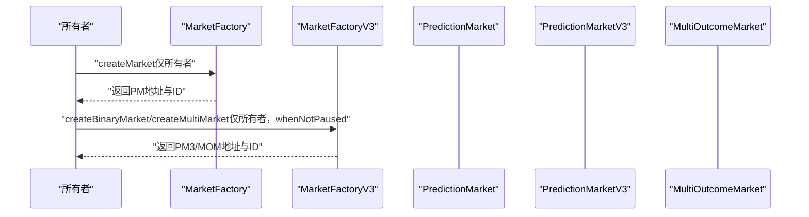
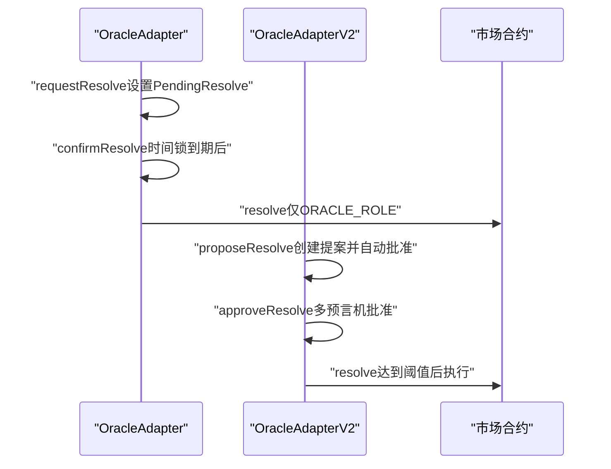
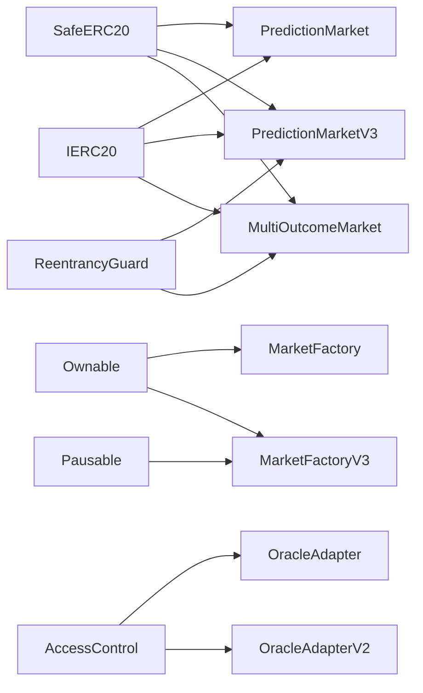

# 市场安全模式

<cite>
**本文档引用的文件**
- [PredictionMarket.sol](file://contracts/PredictionMarket.sol)
- [MultiOutcomeMarket.sol](file://contracts/MultiOutcomeMarket.sol)
- [PredictionMarketV3.sol](file://contracts/PredictionMarketV3.sol)
- [MarketFactory.sol](file://contracts/MarketFactory.sol)
- [MarketFactoryV3.sol](file://contracts/MarketFactoryV3.sol)
- [OracleAdapter.sol](file://contracts/OracleAdapter.sol)
- [OracleAdapterV2.sol](file://contracts/OracleAdapterV2.sol)
- [IPredictionMarket.sol](file://contracts/interfaces/IPredictionMarket.sol)
- [MockUSDC.sol](file://contracts/MockUSDC.sol)
- [DIDRegistry.sol](file://contracts/DIDRegistry.sol)
</cite>

## 目录
1. [引言](#引言)
2. [项目结构](#项目结构)
3. [核心组件](#核心组件)
4. [架构概览](#架构概览)
5. [详细组件分析](#详细组件分析)
6. [依赖分析](#依赖分析)
7. [性能考虑](#性能考虑)
8. [故障排除指南](#故障排除指南)
9. [结论](#结论)
10. [附录](#附录)

## 引言
本文件面向预测市场合约的安全文档，系统性梳理二元与多结果市场合约在资金池管理、押注处理、奖励分配、状态转换、暂停/恢复以及异常处理方面的安全设计模式与实现细节。重点覆盖以下方面：
- 资金池管理：恒定乘积做市商模型（CPMM）、资金池隔离与手续费处理
- 押注处理：输入校验、重入保护、最大押注限制
- 奖励分配：按份额比例分配、作废退款机制
- 市场状态转换：开放、结算、作废三态模型与访问控制
- 暂停/恢复：工厂合约级暂停机制
- 异常处理：错误前置校验、不可重入保护、时间锁与多签治理
- 安全最佳实践：权限控制、输入验证、边界检查、事件审计
- 常见漏洞与防范：整数溢出/下溢、重入攻击、状态不一致、权限滥用
- 监控、审计与异常检测：事件日志、访问控制、治理流程

## 项目结构
该项目采用模块化合约组织方式，围绕市场工厂、市场合约、预言机适配器和辅助工具展开：
- 市场工厂：负责部署与管理市场合约，提供暂停/恢复能力
- 市场合约：实现二元与多结果市场的核心逻辑，包括资金池、押注、结算与奖励
- 预言机适配器：提供治理化的结算与作废流程，支持时间锁与多签
- 辅助工具：DID注册、测试代币等

**图表来源**
- [MarketFactory.sol:12-67](file://contracts/MarketFactory.sol#L12-L67)
- [MarketFactoryV3.sol:14-103](file://contracts/MarketFactoryV3.sol#L14-L103)
- [PredictionMarket.sol:11-144](file://contracts/PredictionMarket.sol#L11-L144)
- [PredictionMarketV3.sol:12-217](file://contracts/PredictionMarketV3.sol#L12-L217)
- [MultiOutcomeMarket.sol:12-123](file://contracts/MultiOutcomeMarket.sol#L12-L123)
- [OracleAdapter.sol:11-95](file://contracts/OracleAdapter.sol#L11-L95)
- [OracleAdapterV2.sol:11-94](file://contracts/OracleAdapterV2.sol#L11-L94)
- [IPredictionMarket.sol:7-14](file://contracts/interfaces/IPredictionMarket.sol#L7-L14)
- [DIDRegistry.sol:12-38](file://contracts/DIDRegistry.sol#L12-L38)
- [MockUSDC.sol:10-23](file://contracts/MockUSDC.sol#L10-L23)

**章节来源**
- [MarketFactory.sol:12-67](file://contracts/MarketFactory.sol#L12-L67)
- [MarketFactoryV3.sol:14-103](file://contracts/MarketFactoryV3.sol#L14-L103)
- [PredictionMarket.sol:11-144](file://contracts/PredictionMarket.sol#L11-L144)
- [PredictionMarketV3.sol:12-217](file://contracts/PredictionMarketV3.sol#L12-L217)
- [MultiOutcomeMarket.sol:12-123](file://contracts/MultiOutcomeMarket.sol#L12-L123)
- [OracleAdapter.sol:11-95](file://contracts/OracleAdapter.sol#L11-L95)
- [OracleAdapterV2.sol:11-94](file://contracts/OracleAdapterV2.sol#L11-L94)
- [IPredictionMarket.sol:7-14](file://contracts/interfaces/IPredictionMarket.sol#L7-L14)
- [DIDRegistry.sol:12-38](file://contracts/DIDRegistry.sol#L12-L38)
- [MockUSDC.sol:10-23](file://contracts/MockUSDC.sol#L10-L23)

## 核心组件
- 市场状态模型：开放（Open）、已结算（Resolved）、已作废（Voided）。状态转换严格受访问控制约束。
- 资金池模型：
  - V1二元市场：两池（是/否）独立资金池，按用户押注占获胜池的比例分配。
  - V3二元市场：CPMM恒定乘积模型，两侧储备金动态平衡，支持流动性提供与移除。
  - 多结果市场：N池（2-8）资金池，按用户在获胜结果上的押注占比分配。
- 权限模型：预言机角色（onlyOracle修饰符）控制结算与作废；工厂合约（Ownable/Pausable）控制部署与暂停；AccessControl用于多签与时间锁适配器。
- 安全特性：SafeERC20转账、ReentrancyGuard重入保护、输入参数前置校验、事件审计。

**章节来源**
- [PredictionMarket.sol:14-28](file://contracts/PredictionMarket.sol#L14-L28)
- [PredictionMarketV3.sol:15-33](file://contracts/PredictionMarketV3.sol#L15-L33)
- [MultiOutcomeMarket.sol:15-31](file://contracts/MultiOutcomeMarket.sol#L15-L31)
- [OracleAdapter.sol:11-40](file://contracts/OracleAdapter.sol#L11-L40)
- [OracleAdapterV2.sol:11-38](file://contracts/OracleAdapterV2.sol#L11-L38)

## 架构概览
预测市场的运行链路由“工厂部署 → 市场开放 → 用户押注 → 预言机结算/作废 → 用户领奖”构成。工厂合约提供暂停能力，适配器引入治理与时间锁/多签控制，确保最终状态变更的透明与可控。

**图表来源**
- [MarketFactoryV3.sol:44-97](file://contracts/MarketFactoryV3.sol#L44-L97)
- [PredictionMarketV3.sol:100-120](file://contracts/PredictionMarketV3.sol#L100-L120)
- [OracleAdapter.sol:57-87](file://contracts/OracleAdapter.sol#L57-L87)
- [OracleAdapterV2.sol:51-86](file://contracts/OracleAdapterV2.sol#L51-L86)
- [MultiOutcomeMarket.sol:72-82](file://contracts/MultiOutcomeMarket.sol#L72-L82)

## 详细组件分析

### 二元预测市场 V1（PredictionMarket）
- 资金池：yesPool/noPool双池，独立追踪用户在两方的余额。
- 押注流程：校验状态、截止时间、结果编号与金额；使用SafeERC20转入抵押品；更新用户余额与资金池。
- 结算/作废：onlyOracle修饰符限制调用者；结算记录获胜结果；作废直接退回用户押注。
- 奖励分配：结算时按用户在获胜方的押注占获胜池的比例分配总池（总池=两池之和）。
- 安全要点：状态前置校验、结果范围校验、零地址与零金额校验、事件审计。

**图表来源**
- [PredictionMarket.sol:71-88](file://contracts/PredictionMarket.sol#L71-L88)

**章节来源**
- [PredictionMarket.sol:11-144](file://contracts/PredictionMarket.sol#L11-L144)

### 二元预测市场 V3（PredictionMarketV3）
- CPMM模型：reserveYes/reserveNo两侧储备金，按恒定乘积公式计算份额；buy时先扣手续费再换份额。
- 流动性管理：addLiquidity/removeLiquidity，按比例分配/回收储备金；seedReserves由工厂注入初始流动性。
- 押注上限：maxBetPerUser限制单用户累计押注，防止集中风险。
- 结算/作废/领奖：与V1一致，但结算奖励基于份额与总储备的比例计算。
- 安全要点：nonReentrant、输入校验、LP份额与储备金的精确计算、事件审计。

**图表来源**
- [PredictionMarketV3.sol:12-79](file://contracts/PredictionMarketV3.sol#L12-L79)

**章节来源**
- [PredictionMarketV3.sol:12-217](file://contracts/PredictionMarketV3.sol#L12-L217)

### 多结果预测市场（MultiOutcomeMarket）
- 资金池：pool[]数组维护每个结果的资金池；stake映射记录用户在各结果的押注。
- 手续费：buy时按feeBps计算手续费，净额注入对应池；结算时按用户在获胜结果的押注占获胜池的比例分配。
- 结算/作废/领奖：与二元市场一致，但结算奖励需遍历所有池累加总池。
- 安全要点：结果编号范围校验、nonReentrant、获胜池非空校验、事件审计。

**图表来源**
- [MultiOutcomeMarket.sol:72-82](file://contracts/MultiOutcomeMarket.sol#L72-L82)

**章节来源**
- [MultiOutcomeMarket.sol:12-123](file://contracts/MultiOutcomeMarket.sol#L12-L123)

### 市场工厂（MarketFactory / MarketFactoryV3）
- 市场部署：onlyOwner限制；MarketFactoryV3引入Pausable，支持暂停/恢复。
- 配置管理：设置预言机地址、默认手续费、默认最大押注等。
- 版本标识：version返回当前阶段版本号，便于审计与升级追踪。

**图表来源**
- [MarketFactory.sol:43-61](file://contracts/MarketFactory.sol#L43-L61)
- [MarketFactoryV3.sol:44-97](file://contracts/MarketFactoryV3.sol#L44-L97)

**章节来源**
- [MarketFactory.sol:12-67](file://contracts/MarketFactory.sol#L12-L67)
- [MarketFactoryV3.sol:14-103](file://contracts/MarketFactoryV3.sol#L14-L103)

### 预言机适配器（OracleAdapter / OracleAdapterV2）
- 时间锁结算（OracleAdapter）：onlyRole(ORACLE_ROLE)发起requestResolve，等待timelockDelay后confirmResolve执行resolve；支持resolveNow（当timelockDelay==0时）。
- 多签结算（OracleAdapterV2）：提案创建后，多个预言机逐步批准，达到阈值threshold后自动执行resolve。
- 作废：两个适配器均支持voidMarket，要求市场处于Open状态。

**图表来源**
- [OracleAdapter.sol:57-87](file://contracts/OracleAdapter.sol#L57-L87)
- [OracleAdapterV2.sol:51-86](file://contracts/OracleAdapterV2.sol#L51-L86)

**章节来源**
- [OracleAdapter.sol:11-95](file://contracts/OracleAdapter.sol#L11-L95)
- [OracleAdapterV2.sol:11-94](file://contracts/OracleAdapterV2.sol#L11-L94)

### 接口与辅助工具
- IPredictionMarket：统一的市场接口，定义status、resolve、voidMarket方法，便于适配器与工厂解耦。
- DIDRegistry：基于ECDSA签名的DID哈希绑定，提供账户到DID的映射与解析。
- MockUSDC：测试用ERC20代币，模拟USDC的小数精度，便于本地测试与集成。

**章节来源**
- [IPredictionMarket.sol:7-14](file://contracts/interfaces/IPredictionMarket.sol#L7-L14)
- [DIDRegistry.sol:12-38](file://contracts/DIDRegistry.sol#L12-L38)
- [MockUSDC.sol:10-23](file://contracts/MockUSDC.sol#L10-L23)

## 依赖分析
- 组件耦合：
  - 市场合约依赖OpenZeppelin的SafeERC20与ReentrancyGuard，确保转账安全与重入防护。
  - 工厂合约依赖Ownable与Pausable，提供所有权与暂停能力。
  - 预言机适配器依赖AccessControl，提供角色管理与治理流程。
- 直接依赖关系：
  - MarketFactory/MarketFactoryV3 → PredictionMarket/MultiOutcomeMarket/PredictionMarketV3
  - OracleAdapter/OracleAdapterV2 → IPredictionMarket → 具体市场合约
  - 所有市场合约 → IERC20（抵押品）

**图表来源**
- [PredictionMarket.sol:6-12](file://contracts/PredictionMarket.sol#L6-L12)
- [PredictionMarketV3.sol:6-13](file://contracts/PredictionMarketV3.sol#L6-L13)
- [MultiOutcomeMarket.sol:6-13](file://contracts/MultiOutcomeMarket.sol#L6-L13)
- [MarketFactory.sol:6-12](file://contracts/MarketFactory.sol#L6-L12)
- [MarketFactoryV3.sol:6-10](file://contracts/MarketFactoryV3.sol#L6-L10)
- [OracleAdapter.sol:6-11](file://contracts/OracleAdapter.sol#L6-L11)
- [OracleAdapterV2.sol:6-11](file://contracts/OracleAdapterV2.sol#L6-L11)

**章节来源**
- [PredictionMarket.sol:6-12](file://contracts/PredictionMarket.sol#L6-L12)
- [PredictionMarketV3.sol:6-13](file://contracts/PredictionMarketV3.sol#L6-L13)
- [MultiOutcomeMarket.sol:6-13](file://contracts/MultiOutcomeMarket.sol#L6-L13)
- [MarketFactory.sol:6-12](file://contracts/MarketFactory.sol#L6-L12)
- [MarketFactoryV3.sol:6-10](file://contracts/MarketFactoryV3.sol#L6-L10)
- [OracleAdapter.sol:6-11](file://contracts/OracleAdapter.sol#L6-L11)
- [OracleAdapterV2.sol:6-11](file://contracts/OracleAdapterV2.sol#L6-L11)

## 性能考虑
- 计算复杂度：
  - V1二元市场：押注与结算均为O(1)，内存访问简单。
  - V3二元市场：buy涉及CPMM计算与份额换算，仍为O(1)；add/removeLiquidity为O(1)。
  - 多结果市场：结算时需遍历所有池累加总池，复杂度O(N)。
- 存储优化：
  - 使用映射而非数组存储用户余额，降低读写成本。
  - V3通过seedReserves一次性注入初始流动性，减少后续操作的复杂度。
- Gas优化建议：
  - 合理设置maxBetPerUser，避免超大交易导致Gas过高。
  - 在多结果市场中，若结果数固定且较小（2-8），性能影响有限。

[本节为通用性能讨论，无需具体文件引用]

## 故障排除指南
- 常见错误与定位：
  - “not open/ended”：检查市场状态与截止时间；确认工厂未暂停（V3）。
  - “invalid outcome/invalid”：检查结果编号范围与输入有效性。
  - “zero amount/zero”：检查金额是否大于0。
  - “already claimed/claimed”：确认用户未重复领奖。
  - “not oracle/oracle role”：确认调用者具备相应角色或权限。
  - “not claimable”：检查市场状态是否允许领奖（已结算或已作废）。
  - “empty/insufficient seed”：多结果市场结算前获胜池应非空；V3种子注入需满足余额条件。
- 排查步骤：
  - 使用事件日志（Bought/Resolved/Claimed/MarketVoided/LiquidityAdded/Removed）核对关键节点。
  - 检查预言机适配器的pending状态（时间锁）或提案状态（多签）。
  - 验证工厂合约的暂停状态与配置参数（手续费、最大押注）。

**章节来源**
- [PredictionMarket.sol:71-88](file://contracts/PredictionMarket.sol#L71-L88)
- [PredictionMarketV3.sol:100-120](file://contracts/PredictionMarketV3.sol#L100-L120)
- [MultiOutcomeMarket.sol:72-82](file://contracts/MultiOutcomeMarket.sol#L72-L82)
- [OracleAdapter.sol:57-87](file://contracts/OracleAdapter.sol#L57-L87)
- [OracleAdapterV2.sol:51-86](file://contracts/OracleAdapterV2.sol#L51-L86)

## 结论
本项目通过清晰的状态模型、严格的权限控制与多重安全机制，构建了稳健的预测市场基础设施。V3引入CPMM与流动性管理，进一步提升了资金效率与抗风险能力；工厂合约的暂停机制与预言机适配器的时间锁/多签治理，确保了最终状态变更的透明与可控。建议在生产部署中结合事件审计、权限最小化与参数监控，持续完善安全策略。

[本节为总结性内容，无需具体文件引用]

## 附录

### 安全最佳实践清单
- 权限控制
  - 仅授权角色可调用结算/作废；工厂合约仅所有者可部署/配置；适配器仅管理员可修改阈值/延迟。
- 输入验证
  - 对所有外部输入进行范围与类型校验；禁止零地址与零金额。
- 重入防护
  - 在所有外部转账与状态变更函数上使用nonReentrant或onlyOracle修饰符。
- 资金安全
  - 使用SafeERC20进行ERC20转账；在CPMM中确保reserve非负；在seedReserves中校验余额充足。
- 状态一致性
  - 结算前检查获胜池非空；作废时正确退还用户押注/份额。
- 事件审计
  - 关键操作均发出事件，便于链上监控与溯源。

### 常见漏洞与防范
- 整数溢出/下溢
  - 防范：使用SafeMath/SafeCast（OpenZeppelin）；在CPMM中注意除法与乘法顺序；在seedReserves中先校验余额。
- 重入攻击
  - 防范：在所有外部转账与状态变更函数上使用ReentrancyGuard；仅预言机可调用结算/作废。
- 状态不一致
  - 防范：在resolve/voidMarket前检查市场状态；在claim前检查payout>0。
- 权限滥用
  - 防范：使用AccessControl/Ownable；最小权限原则；定期审查角色与阈值。

### 监控、审计与异常检测
- 事件监控
  - 监听Bought/Resolved/Claimed/MarketVoided/LiquidityAdded/Removed等事件，建立告警规则。
- 权限审计
  - 定期核查预言机角色与管理员角色分配；检查阈值与延迟配置。
- 参数审计
  - 审核手续费、最大押注、时间锁与多签阈值；关注异常交易行为（巨量押注、频繁领奖）。

[本节为通用指导，无需具体文件引用]