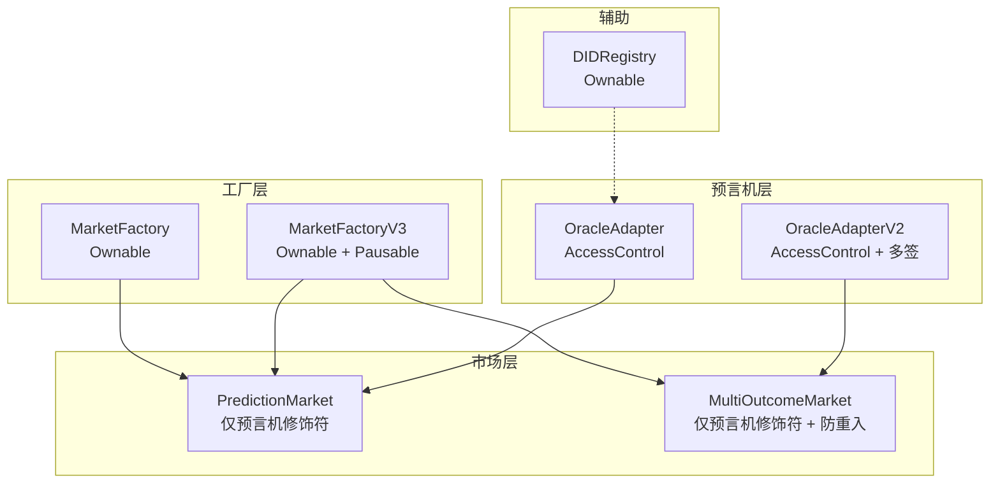
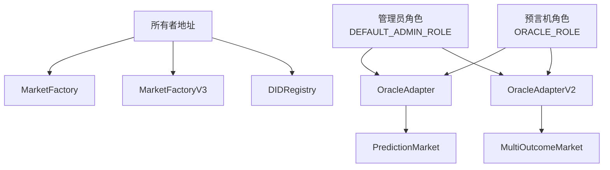
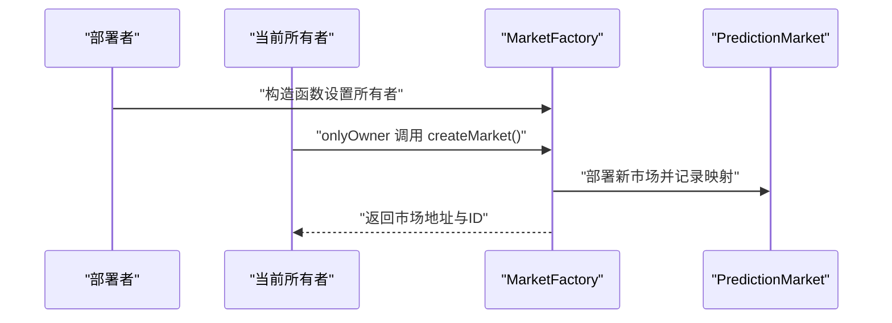
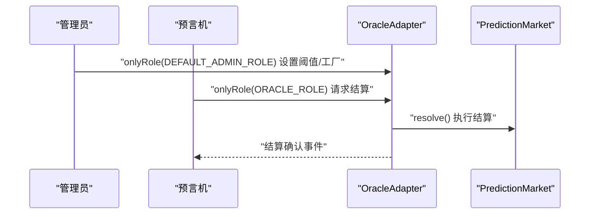
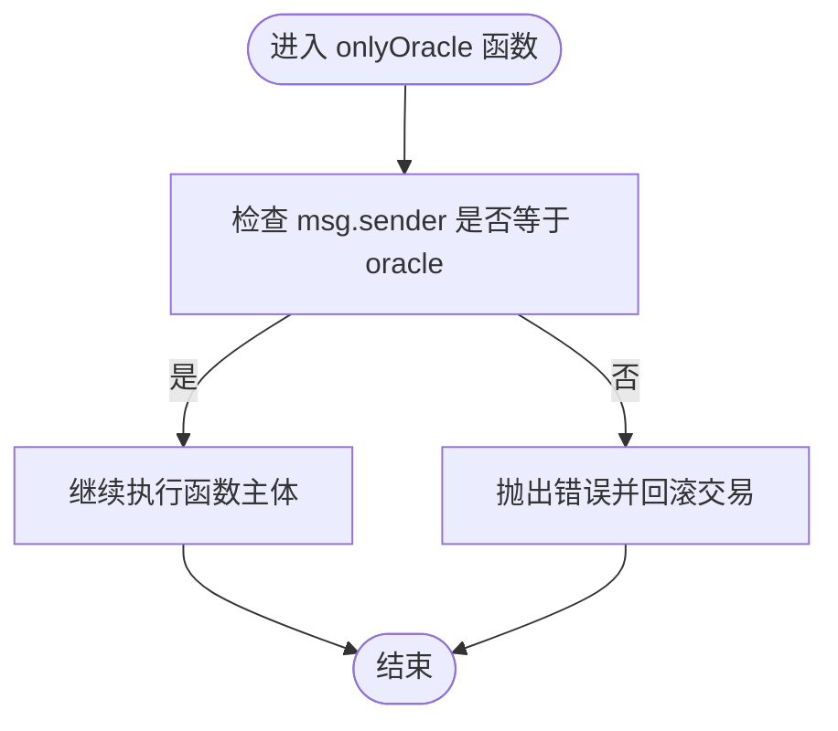
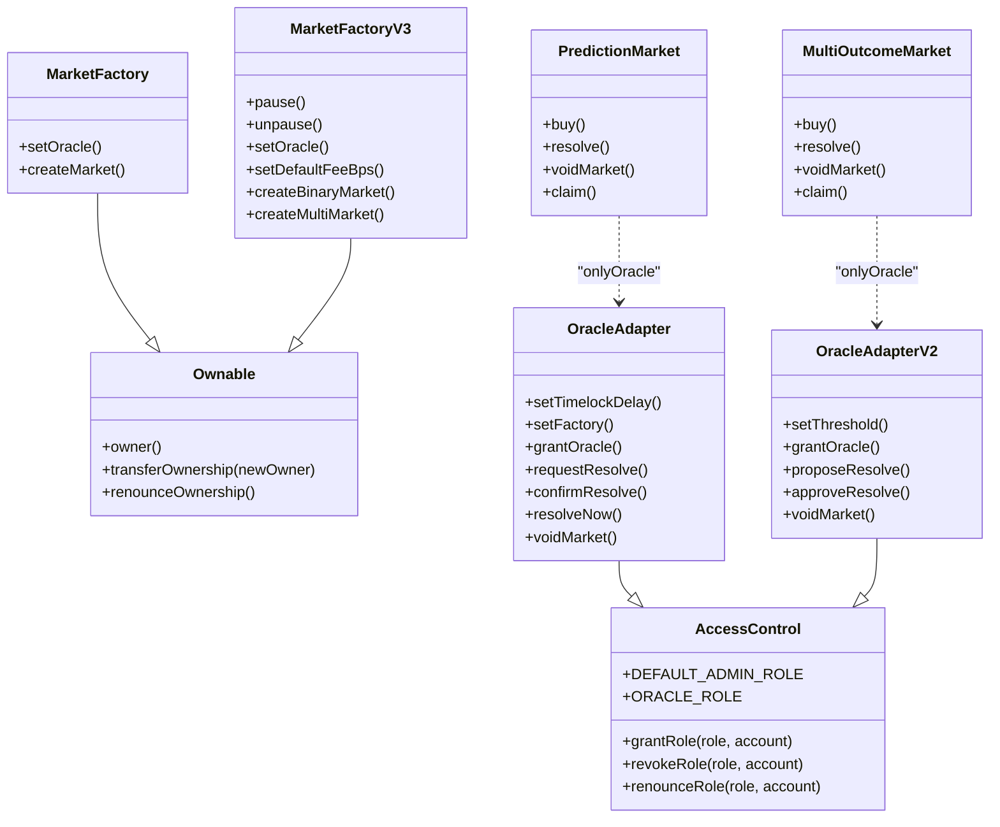

# 访问控制安全

<cite>
**本文档引用的文件**
- [DIDRegistry.sol](file://contracts/DIDRegistry.sol)
- [MarketFactory.sol](file://contracts/MarketFactory.sol)
- [MarketFactoryV3.sol](file://contracts/MarketFactoryV3.sol)
- [PredictionMarket.sol](file://contracts/PredictionMarket.sol)
- [MultiOutcomeMarket.sol](file://contracts/MultiOutcomeMarket.sol)
- [OracleAdapter.sol](file://contracts/OracleAdapter.sol)
- [OracleAdapterV2.sol](file://contracts/OracleAdapterV2.sol)
- [AccessControl.sol](file://artifacts/@openzeppelin/contracts/access/AccessControl.sol/AccessControl.json)
- [IAccessControl.sol](file://artifacts/@openzeppelin/contracts/access/IAccessControl.sol/IAccessControl.json)
</cite>

## 目录
1. [简介](#简介)
2. [项目结构](#项目结构)
3. [核心组件](#核心组件)
4. [架构概览](#架构概览)
5. [详细组件分析](#详细组件分析)
6. [依赖关系分析](#依赖关系分析)
7. [性能考量](#性能考量)
8. [故障排除指南](#故障排除指南)
9. [结论](#结论)
10. [附录](#附录)

## 简介
本文件聚焦于预测市场系统中的访问控制安全，深入解析 Ownable 与 AccessControl 合约的实现原理与安全机制，涵盖所有权转移的安全考量、权限验证流程与角色管理策略。同时提供常见访问控制漏洞（如权限提升、权限绕过）的识别与防范措施，并给出权限设计最佳实践与代码审查检查清单。

## 项目结构
预测市场系统由多个合约组成，围绕工厂合约、市场合约与预言机适配器展开。工厂合约负责部署与配置市场；市场合约承载业务逻辑与资金池；预言机适配器作为外部权威来源，通过时间锁或多签机制对市场进行结算与作废操作。系统同时使用 Ownable 与 AccessControl 两种访问控制模型：

- Ownable：基于单一所有者地址的简单所有权模型，适用于工厂合约等集中式管理场景。
- AccessControl：基于角色的细粒度权限模型，适用于需要多角色协作（如管理员、预言机）的场景。

图表来源
- [MarketFactory.sol:12](file://contracts/MarketFactory.sol#L12)
- [MarketFactoryV3.sol:14](file://contracts/MarketFactoryV3.sol#L14)
- [PredictionMarket.sol:11](file://contracts/PredictionMarket.sol#L11)
- [MultiOutcomeMarket.sol:12](file://contracts/MultiOutcomeMarket.sol#L12)
- [OracleAdapter.sol:11](file://contracts/OracleAdapter.sol#L11)
- [OracleAdapterV2.sol:11](file://contracts/OracleAdapterV2.sol#L11)
- [DIDRegistry.sol:12](file://contracts/DIDRegistry.sol#L12)

章节来源
- [MarketFactory.sol:1-68](file://contracts/MarketFactory.sol#L1-L68)
- [MarketFactoryV3.sol:1-104](file://contracts/MarketFactoryV3.sol#L1-L104)
- [PredictionMarket.sol:1-145](file://contracts/PredictionMarket.sol#L1-L145)
- [MultiOutcomeMarket.sol:1-124](file://contracts/MultiOutcomeMarket.sol#L1-L124)
- [OracleAdapter.sol:1-96](file://contracts/OracleAdapter.sol#L1-L96)
- [OracleAdapterV2.sol:1-95](file://contracts/OracleAdapterV2.sol#L1-L95)
- [DIDRegistry.sol:1-39](file://contracts/DIDRegistry.sol#L1-L39)

## 核心组件
本节概述访问控制相关的核心组件及其职责：
- Ownable 模型：通过 onlyOwner 修饰符限制函数调用者为合约所有者，适用于工厂合约与注册表合约。
- AccessControl 模型：通过角色（role）与 onlyRole 修饰符实现细粒度权限控制，适用于预言机适配器与需要多角色协作的场景。
- 自定义修饰符：如 onlyOracle，用于限定特定外部权威来源的调用权限。

章节来源
- [MarketFactory.sol:37-61](file://contracts/MarketFactory.sol#L37-L61)
- [MarketFactoryV3.sol:37-97](file://contracts/MarketFactoryV3.sol#L37-L97)
- [PredictionMarket.sol:43-47](file://contracts/PredictionMarket.sol#L43-L47)
- [MultiOutcomeMarket.sol:38-42](file://contracts/MultiOutcomeMarket.sol#L38-L42)
- [OracleAdapter.sol:11](file://contracts/OracleAdapter.sol#L11)
- [OracleAdapterV2.sol:11](file://contracts/OracleAdapterV2.sol#L11)

## 架构概览
下图展示了访问控制在系统中的整体交互：工厂合约负责创建市场并设置参数；预言机适配器通过角色授权对市场进行结算与作废；DID 注册表提供可选的身份绑定能力。

图表来源
- [MarketFactory.sol:30](file://contracts/MarketFactory.sol#L30)
- [MarketFactoryV3.sol:31](file://contracts/MarketFactoryV3.sol#L31)
- [OracleAdapter.sol:36-40](file://contracts/OracleAdapter.sol#L36-L40)
- [OracleAdapterV2.sol:34-38](file://contracts/OracleAdapterV2.sol#L34-L38)
- [PredictionMarket.sol:90-104](file://contracts/PredictionMarket.sol#L90-L104)
- [MultiOutcomeMarket.sol:84-97](file://contracts/MultiOutcomeMarket.sol#L84-L97)
- [DIDRegistry.sol:20](file://contracts/DIDRegistry.sol#L20)

## 详细组件分析

### Ownable 权限模型
- 所有权转移流程
  - 构造函数将部署者设为初始所有者。
  - 通过 onlyOwner 修饰符保护关键函数，确保只有当前所有者可以调用。
  - 所有者可委托其他地址执行受保护的操作，但需谨慎管理权限。
- 安全考虑
  - 避免将高危函数（如暂停合约、修改参数）暴露给不受信任地址。
  - 在升级或迁移过程中，确保所有权移交的原子性与可审计性。
  - 使用代理合约模式时，需明确代理与实现合约的所有权分离。

图表来源
- [MarketFactory.sol:30](file://contracts/MarketFactory.sol#L30)
- [MarketFactory.sol:44-61](file://contracts/MarketFactory.sol#L44-L61)

章节来源
- [MarketFactory.sol:12](file://contracts/MarketFactory.sol#L12)
- [MarketFactory.sol:30](file://contracts/MarketFactory.sol#L30)
- [MarketFactory.sol:37-61](file://contracts/MarketFactory.sol#L37-L61)
- [MarketFactoryV3.sol:14](file://contracts/MarketFactoryV3.sol#L14)
- [MarketFactoryV3.sol:31](file://contracts/MarketFactoryV3.sol#L31)
- [MarketFactoryV3.sol:37-97](file://contracts/MarketFactoryV3.sol#L37-L97)
- [DIDRegistry.sol:20](file://contracts/DIDRegistry.sol#L20)

### AccessControl 角色权限模型
- 角色与权限
  - DEFAULT_ADMIN_ROLE：最高权限，可授予/撤销其他角色。
  - ORACLE_ROLE：预言机角色，用于结算与作废市场。
- 权限验证流程
  - 通过 onlyRole 修饰符在函数入口进行权限校验。
  - 支持角色继承与撤销，便于精细化治理。
- 安全考虑
  - 管理员应采用多重签名或去中心化治理，避免单点风险。
  - 定期审计角色分配，清理不再使用的角色。
  - 对敏感函数使用更严格的权限（如 DEFAULT_ADMIN_ROLE）。

图表来源
- [OracleAdapter.sol:42-55](file://contracts/OracleAdapter.sol#L42-L55)
- [OracleAdapter.sol:57-87](file://contracts/OracleAdapter.sol#L57-L87)
- [OracleAdapter.sol:89-94](file://contracts/OracleAdapter.sol#L89-L94)
- [PredictionMarket.sol:90-97](file://contracts/PredictionMarket.sol#L90-L97)

章节来源
- [OracleAdapter.sol:11](file://contracts/OracleAdapter.sol#L11)
- [OracleAdapter.sol:36-40](file://contracts/OracleAdapter.sol#L36-L40)
- [OracleAdapter.sol:42-55](file://contracts/OracleAdapter.sol#L42-L55)
- [OracleAdapter.sol:57-87](file://contracts/OracleAdapter.sol#L57-L87)
- [OracleAdapter.sol:89-94](file://contracts/OracleAdapter.sol#L89-L94)
- [OracleAdapterV2.sol:11](file://contracts/OracleAdapterV2.sol#L11)
- [OracleAdapterV2.sol:34-38](file://contracts/OracleAdapterV2.sol#L34-L38)
- [OracleAdapterV2.sol:40-49](file://contracts/OracleAdapterV2.sol#L40-L49)
- [OracleAdapterV2.sol:51-86](file://contracts/OracleAdapterV2.sol#L51-L86)
- [OracleAdapterV2.sol:88-93](file://contracts/OracleAdapterV2.sol#L88-L93)

### 自定义修饰符：onlyOracle
- 设计目的：限制市场结算与作废操作只能由授权的预言机调用。
- 实现要点：直接比较 msg.sender 与 oracle 存储值，简洁高效。
- 安全建议：确保 oracle 地址的正确性与可用性，结合 AccessControl 的 ORACLE_ROLE 进行双重保障。

图表来源
- [PredictionMarket.sol:43-47](file://contracts/PredictionMarket.sol#L43-L47)
- [MultiOutcomeMarket.sol:38-42](file://contracts/MultiOutcomeMarket.sol#L38-L42)

章节来源
- [PredictionMarket.sol:43-47](file://contracts/PredictionMarket.sol#L43-L47)
- [MultiOutcomeMarket.sol:38-42](file://contracts/MultiOutcomeMarket.sol#L38-L42)

### 权限检查模式示例
以下为正确的权限检查模式示例（以路径引用代替具体代码内容）：
- 使用 onlyOwner 保护工厂函数
  - [MarketFactory.sol:37-41](file://contracts/MarketFactory.sol#L37-L41)
  - [MarketFactory.sol:44-61](file://contracts/MarketFactory.sol#L44-L61)
  - [MarketFactoryV3.sol:37-43](file://contracts/MarketFactoryV3.sol#L37-L43)
- 使用 onlyRole 保护管理员与预言机函数
  - [OracleAdapter.sol:42-45](file://contracts/OracleAdapter.sol#L42-L45)
  - [OracleAdapter.sol:47-50](file://contracts/OracleAdapter.sol#L47-L50)
  - [OracleAdapter.sol:52-55](file://contracts/OracleAdapter.sol#L52-L55)
  - [OracleAdapterV2.sol:40-44](file://contracts/OracleAdapterV2.sol#L40-L44)
  - [OracleAdapterV2.sol:46-49](file://contracts/OracleAdapterV2.sol#L46-L49)
- 使用自定义修饰符 onlyOracle
  - [PredictionMarket.sol:90-97](file://contracts/PredictionMarket.sol#L90-L97)
  - [MultiOutcomeMarket.sol:84-97](file://contracts/MultiOutcomeMarket.sol#L84-L97)

章节来源
- [MarketFactory.sol:37-61](file://contracts/MarketFactory.sol#L37-L61)
- [MarketFactoryV3.sol:37-97](file://contracts/MarketFactoryV3.sol#L37-L97)
- [OracleAdapter.sol:42-55](file://contracts/OracleAdapter.sol#L42-L55)
- [OracleAdapterV2.sol:40-49](file://contracts/OracleAdapterV2.sol#L40-L49)
- [PredictionMarket.sol:90-97](file://contracts/PredictionMarket.sol#L90-L97)
- [MultiOutcomeMarket.sol:84-97](file://contracts/MultiOutcomeMarket.sol#L84-L97)

## 依赖关系分析
- 继承关系
  - MarketFactory 与 MarketFactoryV3 继承 Ownable。
  - OracleAdapter 与 OracleAdapterV2 继承 AccessControl。
  - PredictionMarket 与 MultiOutcomeMarket 使用自定义修饰符实现权限控制。
- 外部依赖
  - OpenZeppelin AccessControl/Ownable 提供标准权限模型。
  - SafeERC20 用于安全的 ERC20 转账。
  - ReentrancyGuard 用于防止重入攻击。

图表来源
- [MarketFactory.sol:12](file://contracts/MarketFactory.sol#L12)
- [MarketFactoryV3.sol:14](file://contracts/MarketFactoryV3.sol#L14)
- [OracleAdapter.sol:11](file://contracts/OracleAdapter.sol#L11)
- [OracleAdapterV2.sol:11](file://contracts/OracleAdapterV2.sol#L11)
- [PredictionMarket.sol:11](file://contracts/PredictionMarket.sol#L11)
- [MultiOutcomeMarket.sol:12](file://contracts/MultiOutcomeMarket.sol#L12)

章节来源
- [MarketFactory.sol:12](file://contracts/MarketFactory.sol#L12)
- [MarketFactoryV3.sol:14](file://contracts/MarketFactoryV3.sol#L14)
- [OracleAdapter.sol:11](file://contracts/OracleAdapter.sol#L11)
- [OracleAdapterV2.sol:11](file://contracts/OracleAdapterV2.sol#L11)
- [PredictionMarket.sol:11](file://contracts/PredictionMarket.sol#L11)
- [MultiOutcomeMarket.sol:12](file://contracts/MultiOutcomeMarket.sol#L12)

## 性能考量
- 权限检查成本：onlyOwner/onlyRole/自定义修饰符均为常量级开销，对交易性能影响可忽略。
- 角色查询优化：AccessControl 使用哈希索引存储角色，查询与更新均摊复杂度较低。
- 修饰符组合：在同一函数上叠加多个修饰符会增加调用栈深度，需避免过度嵌套。

## 故障排除指南
- 常见错误与定位
  - 未满足 onlyOwner 条件：检查当前所有者地址与调用者是否一致。
  - 未满足 onlyRole 条件：确认账户是否被授予相应角色，以及角色管理员是否正确配置。
  - 未满足 onlyOracle 条件：核对 oracle 地址是否正确设置，且调用者为授权地址。
- 审计要点
  - 所有权与角色的授予/撤销流程是否可审计。
  - 关键函数是否存在多重权限修饰符，是否存在权限冲突。
  - 预言机地址与工厂地址是否正确绑定，避免误操作导致资金损失。

章节来源
- [MarketFactory.sol:37-61](file://contracts/MarketFactory.sol#L37-L61)
- [MarketFactoryV3.sol:37-97](file://contracts/MarketFactoryV3.sol#L37-L97)
- [OracleAdapter.sol:42-55](file://contracts/OracleAdapter.sol#L42-L55)
- [OracleAdapterV2.sol:40-49](file://contracts/OracleAdapterV2.sol#L40-L49)
- [PredictionMarket.sol:90-97](file://contracts/PredictionMarket.sol#L90-L97)
- [MultiOutcomeMarket.sol:84-97](file://contracts/MultiOutcomeMarket.sol#L84-L97)

## 结论
本项目通过 Ownable 与 AccessControl 的组合实现了清晰的权限分层：工厂与注册表采用单一所有者模型，简化管理；预言机适配器采用角色模型，支持多角色协作与治理。配合自定义修饰符与安全库，系统在保证功能灵活性的同时，显著降低了权限滥用的风险。建议持续完善角色治理流程与代码审查机制，确保长期安全性与可维护性。

## 附录

### 常见访问控制漏洞与防范
- 权限提升
  - 风险：通过不当的权限继承或角色授予导致越权。
  - 防范：最小权限原则，定期审计角色分配，避免授予不必要的管理员角色。
- 权限绕过
  - 风险：利用构造函数、代理升级或外部调用绕过权限检查。
  - 防范：在关键路径添加多重权限校验，结合时间锁与多签机制。
- 重入攻击
  - 风险：在权限变更后立即执行外部调用，可能被恶意合约回调。
  - 防范：使用 ReentrancyGuard 或在权限变更后延迟执行外部操作。
- 单点故障
  - 风险：所有者或管理员地址丢失或被接管。
  - 防范：采用多重签名或去中心化治理，分散权限。

### 权限设计最佳实践
- 明确职责分离：将管理、运营、审计等职责分配至不同角色。
- 最小权限原则：仅授予完成任务所需的最低权限。
- 可审计性：保留角色授予/撤销的日志，便于追踪与审计。
- 多重保障：对高危操作采用多签或时间锁机制。
- 定期复审：定期评估角色分配与权限配置，及时调整。

### 代码审查检查清单
- 所有受保护函数是否正确标注 onlyOwner/onlyRole/自定义修饰符？
- 角色管理员是否为 DEFAULT_ADMIN_ROLE，避免普通管理员拥有最高权限？
- 预言机地址是否正确设置，且仅授权可信地址？
- 是否存在权限冲突或修饰符叠加导致的逻辑漏洞？
- 关键流程是否具备时间锁或多签机制？
- 是否使用 SafeERC20/ReentrancyGuard 等安全库？