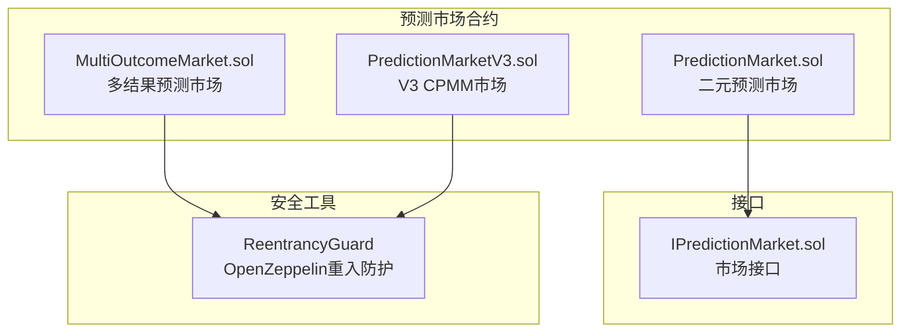
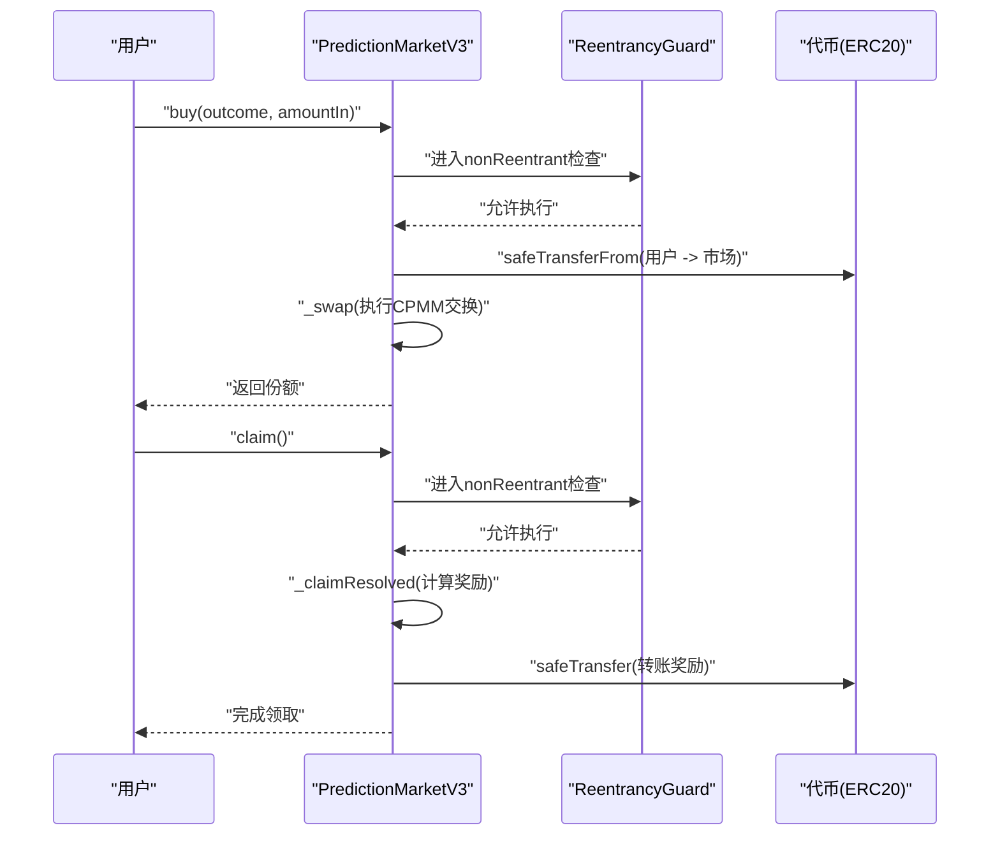
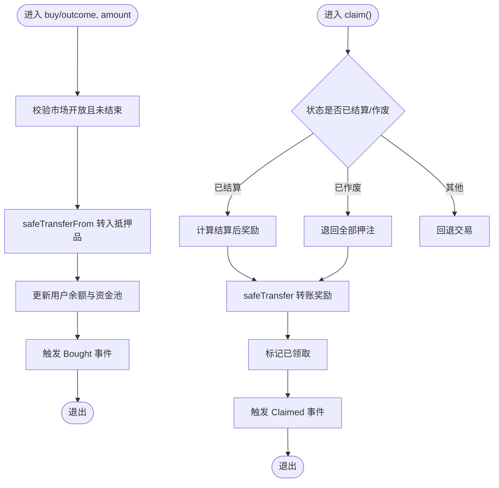
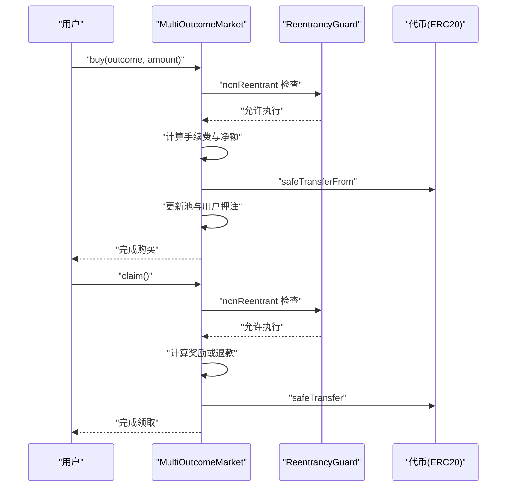
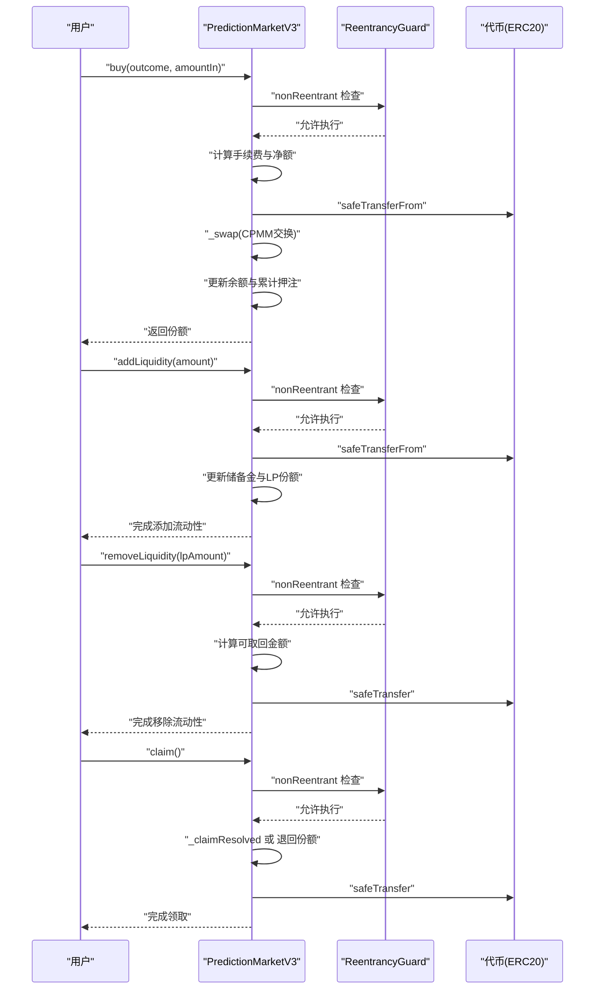
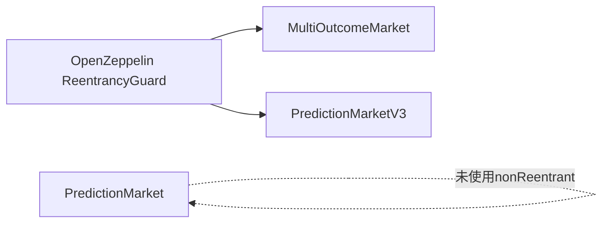

# 重入攻击防护

<cite>
**本文档引用的文件**
- [PredictionMarket.sol](file://contracts/PredictionMarket.sol)
- [MultiOutcomeMarket.sol](file://contracts/MultiOutcomeMarket.sol)
- [PredictionMarketV3.sol](file://contracts/PredictionMarketV3.sol)
- [IPredictionMarket.sol](file://contracts/interfaces/IPredictionMarket.sol)
- [ReentrancyGuard.json](file://artifacts/@openzeppelin/contracts/utils/ReentrancyGuard.sol/ReentrancyGuard.json)
</cite>

## 目录
1. [引言](#引言)
2. [项目结构](#项目结构)
3. [核心组件](#核心组件)
4. [架构概览](#架构概览)
5. [详细组件分析](#详细组件分析)
6. [依赖分析](#依赖分析)
7. [性能考虑](#性能考虑)
8. [故障排查指南](#故障排查指南)
9. [结论](#结论)
10. [附录](#附录)

## 引言
本文件聚焦于重入攻击（Reentrancy Attack）的原理、危害与防护策略，并结合代码库中的实际实现，系统阐述OpenZeppelin ReentrancyGuard在预测市场合约中的应用方式与最佳实践。通过对二元预测市场、多结果预测市场以及带流动性池的预测市场V3的源码分析，给出资金管理的安全注意事项、状态更新顺序、外部调用防护等关键指导，并提供检测与预防重入攻击的实用建议。

## 项目结构
本项目围绕预测市场合约展开，包含基础二元市场、多结果市场以及V3版本的CPMM（常数乘积做市商）模型。其中，V3版本明确引入了重入防护机制，作为安全基线在关键函数上使用nonReentrant修饰符。

图表来源
- [PredictionMarket.sol:1-145](file://contracts/PredictionMarket.sol#L1-L145)
- [MultiOutcomeMarket.sol:1-124](file://contracts/MultiOutcomeMarket.sol#L1-L124)
- [PredictionMarketV3.sol:1-218](file://contracts/PredictionMarketV3.sol#L1-L218)
- [IPredictionMarket.sol:1-15](file://contracts/interfaces/IPredictionMarket.sol#L1-L15)
- [ReentrancyGuard.json:1-16](file://artifacts/@openzeppelin/contracts/utils/ReentrancyGuard.sol/ReentrancyGuard.json#L1-L16)

章节来源
- [PredictionMarket.sol:1-145](file://contracts/PredictionMarket.sol#L1-L145)
- [MultiOutcomeMarket.sol:1-124](file://contracts/MultiOutcomeMarket.sol#L1-L124)
- [PredictionMarketV3.sol:1-218](file://contracts/PredictionMarketV3.sol#L1-L218)
- [IPredictionMarket.sol:1-15](file://contracts/interfaces/IPredictionMarket.sol#L1-L15)
- [ReentrancyGuard.json:1-16](file://artifacts/@openzeppelin/contracts/utils/ReentrancyGuard.sol/ReentrancyGuard.json#L1-L16)

## 核心组件
- 二元预测市场（PredictionMarket）：提供基础的押注与领取流程，但未直接使用重入防护修饰符。
- 多结果预测市场（MultiOutcomeMarket）：继承自ReentrancyGuard，在buy与claim函数上使用nonReentrant修饰符。
- V3预测市场（PredictionMarketV3）：继承自ReentrancyGuard，在buy、addLiquidity、removeLiquidity、claim等关键函数上使用nonReentrant修饰符。
- 接口（IPredictionMarket）：定义市场核心方法，便于统一调用与扩展。

章节来源
- [PredictionMarket.sol:11-145](file://contracts/PredictionMarket.sol#L11-L145)
- [MultiOutcomeMarket.sol:12-124](file://contracts/MultiOutcomeMarket.sol#L12-L124)
- [PredictionMarketV3.sol:12-218](file://contracts/PredictionMarketV3.sol#L12-L218)
- [IPredictionMarket.sol:7-15](file://contracts/interfaces/IPredictionMarket.sol#L7-L15)

## 架构概览
下图展示了V3版本中关键函数的执行路径与重入防护的覆盖范围：

图表来源
- [PredictionMarketV3.sol:100-120](file://contracts/PredictionMarketV3.sol#L100-L120)
- [PredictionMarketV3.sol:164-179](file://contracts/PredictionMarketV3.sol#L164-L179)
- [ReentrancyGuard.json:5-11](file://artifacts/@openzeppelin/contracts/utils/ReentrancyGuard.sol/ReentrancyGuard.json#L5-L11)

## 详细组件分析

### 二元预测市场（PredictionMarket）
- 职责：接收押注、记录余额与资金池、由预言机结算或作废、支持用户领取。
- 重入防护现状：未使用nonReentrant修饰符；存在潜在风险。
- 关键流程：
  - buy：校验状态与时间、转账抵押品、更新余额与资金池。
  - resolve/voidMarket：仅预言机可调用，修改状态。
  - claim：根据状态计算奖励并转账。

图表来源
- [PredictionMarket.sol:70-88](file://contracts/PredictionMarket.sol#L70-L88)
- [PredictionMarket.sol:106-123](file://contracts/PredictionMarket.sol#L106-L123)

章节来源
- [PredictionMarket.sol:70-145](file://contracts/PredictionMarket.sol#L70-L145)

### 多结果预测市场（MultiOutcomeMarket）
- 继承ReentrancyGuard并在关键函数上使用nonReentrant。
- 关键流程：
  - buy：扣费后将净额加入对应结果池，记录用户押注。
  - claim：按比例计算奖励或退回所有押注，转账后标记已领取。

图表来源
- [MultiOutcomeMarket.sol:72-82](file://contracts/MultiOutcomeMarket.sol#L72-L82)
- [MultiOutcomeMarket.sol:99-122](file://contracts/MultiOutcomeMarket.sol#L99-L122)
- [ReentrancyGuard.json:5-11](file://artifacts/@openzeppelin/contracts/utils/ReentrancyGuard.sol/ReentrancyGuard.json#L5-L11)

章节来源
- [MultiOutcomeMarket.sol:12-124](file://contracts/MultiOutcomeMarket.sol#L12-L124)

### V3预测市场（PredictionMarketV3）
- 继承ReentrancyGuard并在多个关键函数上使用nonReentrant。
- 关键流程：
  - buy：校验限额、计算手续费、执行CPMM交换、更新余额与累计押注。
  - add/removeLiquidity：维护双侧储备金与LP份额。
  - claim：根据结算或作废状态计算奖励并转账。

图表来源
- [PredictionMarketV3.sol:100-120](file://contracts/PredictionMarketV3.sol#L100-L120)
- [PredictionMarketV3.sol:122-146](file://contracts/PredictionMarketV3.sol#L122-L146)
- [PredictionMarketV3.sol:164-179](file://contracts/PredictionMarketV3.sol#L164-L179)
- [ReentrancyGuard.json:5-11](file://artifacts/@openzeppelin/contracts/utils/ReentrancyGuard.sol/ReentrancyGuard.json#L5-L11)

章节来源
- [PredictionMarketV3.sol:12-218](file://contracts/PredictionMarketV3.sol#L12-L218)

### ReentrancyGuard 实现机制与使用模式
- 错误类型：ReentrancyGuardReentrantCall（当检测到重入时抛出）。
- 使用模式：在需要防止重入的关键函数上添加nonReentrant修饰符，确保同一调用栈内不会再次进入受保护函数。
- 适用场景：涉及外部转账、状态更新与外部调用的函数，如buy、claim、addLiquidity、removeLiquidity等。

章节来源
- [ReentrancyGuard.json:5-11](file://artifacts/@openzeppelin/contracts/utils/ReentrancyGuard.sol/ReentrancyGuard.json#L5-L11)

## 依赖分析
- MultiOutcomeMarket与PredictionMarketV3均通过继承ReentrancyGuard获得非重入保护。
- 二者在buy与claim等关键路径上均采用SafeERC20进行转账，降低失败回滚导致的状态不一致风险。
- PredictionMarket未直接使用nonReentrant，存在重入隐患，建议在类似路径中增加保护。

图表来源
- [MultiOutcomeMarket.sol:8](file://contracts/MultiOutcomeMarket.sol#L8)
- [PredictionMarketV3.sol:8](file://contracts/PredictionMarketV3.sol#L8)
- [PredictionMarket.sol:1-145](file://contracts/PredictionMarket.sol#L1-L145)

章节来源
- [MultiOutcomeMarket.sol:12-124](file://contracts/MultiOutcomeMarket.sol#L12-L124)
- [PredictionMarketV3.sol:12-218](file://contracts/PredictionMarketV3.sol#L12-L218)
- [PredictionMarket.sol:11-145](file://contracts/PredictionMarket.sol#L11-L145)

## 性能考虑
- 非重入检查的开销：nonReentrant基于状态位检查，通常为常数级gas成本，对吞吐影响有限。
- 状态更新顺序：先更新状态/余额，再进行外部转账，避免中间态被利用。
- 外部调用最小化：尽量减少在状态更新前后的外部调用，降低重入窗口。

## 故障排查指南
- 现象：交易回滚并提示重入错误。
  - 排查：确认调用链中是否存在对受保护函数的递归或外部回调。
  - 处理：在关键函数上添加nonReentrant修饰符；调整状态更新顺序。
- 现象：资金异常或余额不一致。
  - 排查：检查转账是否发生在状态更新之前；确认是否使用SafeERC20。
  - 处理：遵循“先状态后转账”的原则；确保外部调用失败时回滚状态。
- 现象：V3版本仍出现重入风险。
  - 排查：确认所有外部转账与状态更新的关键路径均受nonReentrant保护。
  - 处理：对新增函数同样应用nonReentrant；避免在修饰符之外执行外部调用。

章节来源
- [ReentrancyGuard.json:5-11](file://artifacts/@openzeppelin/contracts/utils/ReentrancyGuard.sol/ReentrancyGuard.json#L5-L11)
- [MultiOutcomeMarket.sol:72-82](file://contracts/MultiOutcomeMarket.sol#L72-L82)
- [PredictionMarketV3.sol:100-120](file://contracts/PredictionMarketV3.sol#L100-L120)

## 结论
- 重入攻击通过递归调用或外部回调在状态更新前反复执行恶意逻辑，造成资金损失。
- 在涉及外部转账与状态变更的关键路径上，使用nonReentrant修饰符是低成本、高收益的防护手段。
- V3版本在buy、addLiquidity、removeLiquidity、claim等函数上已全面应用重入防护，形成稳健的安全基线。
- 建议将此模式推广至PredictionMarket等其他合约，确保资金管理流程的确定性与安全性。

## 附录

### 重入攻击常见向量与防护要点
- 常见向量
  - 在转账前读取余额并据此计算奖励，随后再转账。
  - 在状态更新后才进行外部转账，导致中间态可被利用。
  - 允许外部合约回调，未限制调用深度或条件。
- 防护要点
  - 使用nonReentrant修饰符保护关键函数。
  - 遵循“先状态后转账”的顺序，必要时在转账失败时回滚状态。
  - 最小化外部调用，避免在受保护函数中执行未知合约的回调。

### 代码示例路径（不展示具体代码内容）
- V3购买流程（含手续费与CPMM交换）：[PredictionMarketV3.sol:100-120](file://contracts/PredictionMarketV3.sol#L100-L120)
- V3添加/移除流动性（含nonReentrant）：[PredictionMarketV3.sol:122-146](file://contracts/PredictionMarketV3.sol#L122-L146)
- 多结果市场购买与领取（含nonReentrant）：[MultiOutcomeMarket.sol:72-82](file://contracts/MultiOutcomeMarket.sol#L72-L82), [MultiOutcomeMarket.sol:99-122](file://contracts/MultiOutcomeMarket.sol#L99-L122)
- 二元市场购买与领取（建议增加nonReentrant）：[PredictionMarket.sol:70-88](file://contracts/PredictionMarket.sol#L70-L88), [PredictionMarket.sol:106-123](file://contracts/PredictionMarket.sol#L106-L123)