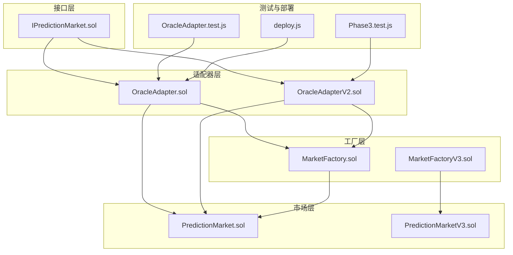
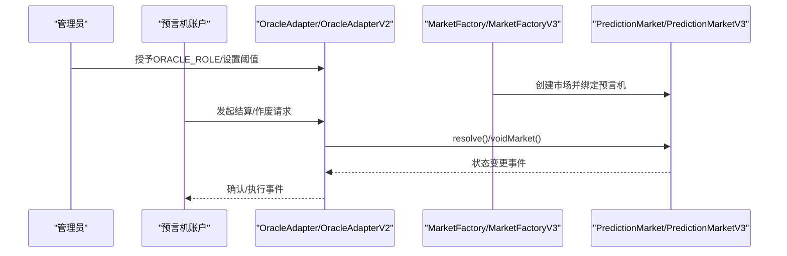
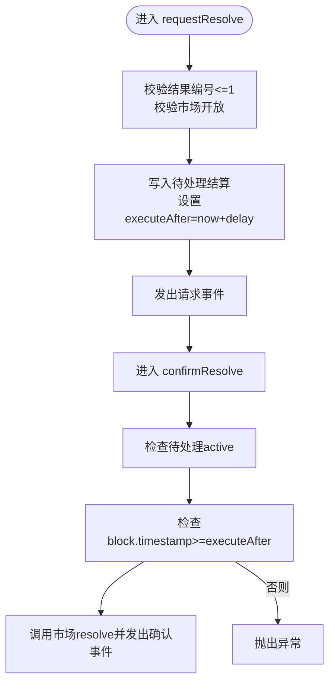
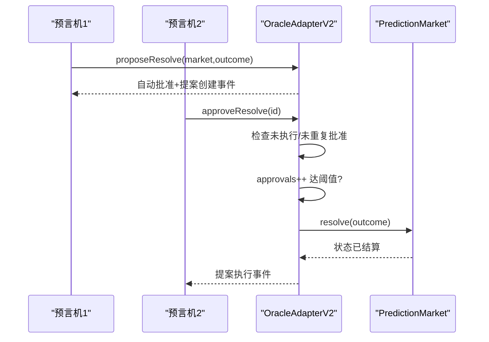
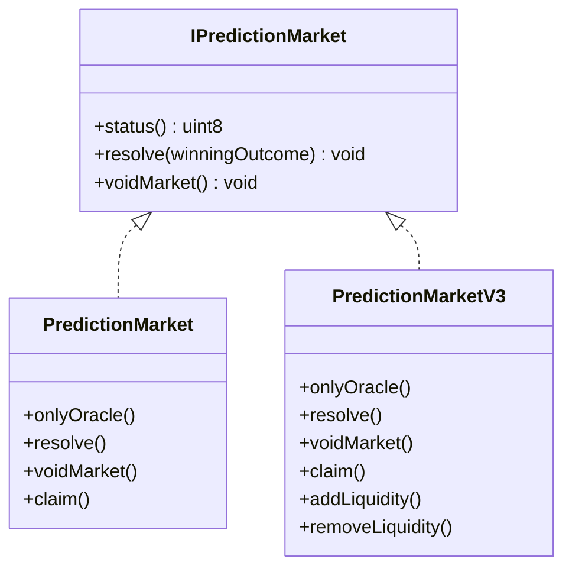
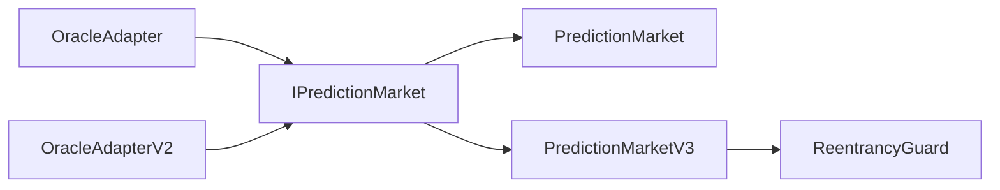

# 预言机安全机制

<cite>
**本文档引用的文件**
- [OracleAdapter.sol](file://contracts/contracts/OracleAdapter.sol)
- [OracleAdapterV2.sol](file://contracts/contracts/OracleAdapterV2.sol)
- [PredictionMarket.sol](file://contracts/contracts/PredictionMarket.sol)
- [PredictionMarketV3.sol](file://contracts/contracts/PredictionMarketV3.sol)
- [IPredictionMarket.sol](file://contracts/contracts/interfaces/IPredictionMarket.sol)
- [MarketFactory.sol](file://contracts/contracts/MarketFactory.sol)
- [MarketFactoryV3.sol](file://contracts/contracts/MarketFactoryV3.sol)
- [OracleAdapter.test.js](file://test/OracleAdapter.test.js)
- [Phase3.test.js](file://test/Phase3.test.js)
- [deploy.js](file://scripts/deploy.js)
</cite>

## 目录
1. [简介](#简介)
2. [项目结构](#项目结构)
3. [核心组件](#核心组件)
4. [架构概览](#架构概览)
5. [详细组件分析](#详细组件分析)
6. [依赖关系分析](#依赖关系分析)
7. [性能考虑](#性能考虑)
8. [故障排查指南](#故障排查指南)
9. [结论](#结论)
10. [附录](#附录)

## 简介
本文件面向预言机安全机制，系统性梳理 PredictionDIDSimple 项目中 OracleAdapter 与 OracleAdapterV2 的安全设计与实现要点，结合时间锁、多签验证、状态同步等机制，给出数据验证、来源可信度检查与防篡改的实践指南，并总结常见攻击场景（如 51% 攻击、数据污染）及缓解策略，最后提供配置安全与监控建议。

## 项目结构
项目采用合约分层组织方式：
- 接口层：定义预言机适配器与市场之间的契约，确保解耦与可替换性
- 适配器层：OracleAdapter（时间锁）、OracleAdapterV2（多签）
- 市场层：PredictionMarket（二元互池）、PredictionMarketV3（CPMM + 流动性池）
- 工厂层：MarketFactory（V2）、MarketFactoryV3（V3 + 多结果）
- 测试与部署：单元测试覆盖关键安全路径，部署脚本支持时间锁参数化

图表来源
- [OracleAdapter.sol:1-96](file://contracts/contracts/OracleAdapter.sol#L1-L96)
- [OracleAdapterV2.sol:1-95](file://contracts/contracts/OracleAdapterV2.sol#L1-L95)
- [PredictionMarket.sol:1-145](file://contracts/contracts/PredictionMarket.sol#L1-L145)
- [PredictionMarketV3.sol:1-218](file://contracts/contracts/PredictionMarketV3.sol#L1-L218)
- [IPredictionMarket.sol:1-15](file://contracts/contracts/interfaces/IPredictionMarket.sol#L1-L15)
- [MarketFactory.sol:1-68](file://contracts/contracts/MarketFactory.sol#L1-L68)
- [MarketFactoryV3.sol:1-104](file://contracts/contracts/MarketFactoryV3.sol#L1-L104)
- [OracleAdapter.test.js:1-53](file://test/OracleAdapter.test.js#L1-L53)
- [Phase3.test.js:50-77](file://test/Phase3.test.js#L50-L77)
- [deploy.js:1-59](file://scripts/deploy.js#L1-L59)

章节来源
- [OracleAdapter.sol:1-96](file://contracts/contracts/OracleAdapter.sol#L1-L96)
- [OracleAdapterV2.sol:1-95](file://contracts/contracts/OracleAdapterV2.sol#L1-L95)
- [PredictionMarket.sol:1-145](file://contracts/contracts/PredictionMarket.sol#L1-L145)
- [PredictionMarketV3.sol:1-218](file://contracts/contracts/PredictionMarketV3.sol#L1-L218)
- [IPredictionMarket.sol:1-15](file://contracts/contracts/interfaces/IPredictionMarket.sol#L1-L15)
- [MarketFactory.sol:1-68](file://contracts/contracts/MarketFactory.sol#L1-L68)
- [MarketFactoryV3.sol:1-104](file://contracts/contracts/MarketFactoryV3.sol#L1-L104)
- [OracleAdapter.test.js:1-53](file://test/OracleAdapter.test.js#L1-L53)
- [Phase3.test.js:50-77](file://test/Phase3.test.js#L50-L77)
- [deploy.js:1-59](file://scripts/deploy.js#L1-L59)

## 核心组件
- OracleAdapter（时间锁结算）
  - 通过时间锁延迟与待处理结算队列，强制在固定窗口内完成结算，降低抢先交易与短期价格操纵风险
  - 仅授予 ORACLE_ROLE 的账户可发起请求与确认，配合 DEFAULT_ADMIN_ROLE 实现权限分离
- OracleAdapterV2（多签结算）
  - 引入 m-of-n 多签阈值，提升抗中心化与单点故障能力；提案需累积足够批准才可执行
  - 使用提案计数器与批准映射，避免重复批准与竞态条件
- PredictionMarket / PredictionMarketV3（市场）
  - 仅预言机可调用 resolve/voidMarket，保障外部输入来源的权威性
  - V3 引入 ReentrancyGuard 与手续费、最大押注限制，增强资金安全与风控
- 工厂合约（MarketFactory / MarketFactoryV3）
  - 统一创建市场并绑定预言机地址，支持暂停与参数化配置，便于集中治理与审计

章节来源
- [OracleAdapter.sol:11-96](file://contracts/contracts/OracleAdapter.sol#L11-L96)
- [OracleAdapterV2.sol:11-95](file://contracts/contracts/OracleAdapterV2.sol#L11-L95)
- [PredictionMarket.sol:43-104](file://contracts/contracts/PredictionMarket.sol#L43-L104)
- [PredictionMarketV3.sol:12-52](file://contracts/contracts/PredictionMarketV3.sol#L12-L52)
- [MarketFactory.sol:12-67](file://contracts/contracts/MarketFactory.sol#L12-L67)
- [MarketFactoryV3.sol:14-103](file://contracts/contracts/MarketFactoryV3.sol#L14-L103)

## 架构概览
下图展示预言机适配器与市场之间的交互流程，以及权限控制与状态流转：

图表来源
- [OracleAdapter.sol:35-96](file://contracts/contracts/OracleAdapter.sol#L35-L96)
- [OracleAdapterV2.sol:33-95](file://contracts/contracts/OracleAdapterV2.sol#L33-L95)
- [MarketFactory.sol:43-61](file://contracts/contracts/MarketFactory.sol#L43-L61)
- [MarketFactoryV3.sol:44-97](file://contracts/contracts/MarketFactoryV3.sol#L44-L97)
- [PredictionMarket.sol:90-104](file://contracts/contracts/PredictionMarket.sol#L90-L104)
- [PredictionMarketV3.sol:148-162](file://contracts/contracts/PredictionMarketV3.sol#L148-L162)

## 详细组件分析

### OracleAdapter（时间锁机制）
- 权限模型
  - DEFAULT_ADMIN_ROLE：设置时间锁、工厂地址、授予 ORACLE_ROLE
  - ORACLE_ROLE：发起请求、确认结算、作废市场
- 关键流程
  - requestResolve：校验结果编号与市场开放状态，写入待处理结算（含 executeAfter）
  - confirmResolve：校验待处理与时间锁到期，调用市场 resolve
  - resolveNow：当时间锁为 0 时的快速路径
  - voidMarket：在开放状态下直接作废市场
- 安全要点
  - 时间锁防止即时结算带来的价格操纵与抢先交易
  - 仅 ORACLE_ROLE 可操作，避免非授权结算
  - 待处理状态 active 标记避免重复执行

图表来源
- [OracleAdapter.sol:57-78](file://contracts/contracts/OracleAdapter.sol#L57-L78)

章节来源
- [OracleAdapter.sol:11-96](file://contracts/contracts/OracleAdapter.sol#L11-L96)
- [OracleAdapter.test.js:7-27](file://test/OracleAdapter.test.js#L7-L27)

### OracleAdapterV2（多签验证）
- 权限模型
  - DEFAULT_ADMIN_ROLE：设置阈值、授予 ORACLE_ROLE
  - ORACLE_ROLE：提案、批准、作废
- 关键流程
  - proposeResolve：创建提案并自动批准（提案者）
  - approveResolve：累计批准数，达到阈值后内部执行
  - _execute：标记执行并调用市场 resolve
  - voidMarket：在开放状态下作废
- 安全要点
  - 阈值门槛提升抗攻击能力
  - 批准去重与执行幂等，避免重复执行
  - 提案ID自增，便于审计与追踪

图表来源
- [OracleAdapterV2.sol:51-86](file://contracts/contracts/OracleAdapterV2.sol#L51-L86)

章节来源
- [OracleAdapterV2.sol:11-95](file://contracts/contracts/OracleAdapterV2.sol#L11-L95)
- [Phase3.test.js:55-77](file://test/Phase3.test.js#L55-L77)

### 市场合约（状态同步与结算）
- PredictionMarket
  - onlyOracle 修饰符确保外部输入权威性
  - resolve/voidMarket 更新状态并触发事件
- PredictionMarketV3
  - 引入 ReentrancyGuard 防范重入攻击
  - 增加手续费、最大押注、流动性池等风控字段
  - 仅预言机可调用结算/作废，保障状态一致性

图表来源
- [IPredictionMarket.sol:7-14](file://contracts/contracts/interfaces/IPredictionMarket.sol#L7-L14)
- [PredictionMarket.sol:90-104](file://contracts/contracts/PredictionMarket.sol#L90-L104)
- [PredictionMarketV3.sol:148-162](file://contracts/contracts/PredictionMarketV3.sol#L148-L162)

章节来源
- [PredictionMarket.sol:11-145](file://contracts/contracts/PredictionMarket.sol#L11-L145)
- [PredictionMarketV3.sol:12-218](file://contracts/contracts/PredictionMarketV3.sol#L12-L218)

### 工厂合约（市场创建与治理）
- MarketFactory
  - 仅所有者可创建市场并设置预言机
  - 记录市场ID与地址映射，便于查询
- MarketFactoryV3
  - 支持暂停/恢复，统一默认参数
  - 创建二元 V3 市场与多结果市场，便于扩展

章节来源
- [MarketFactory.sol:12-67](file://contracts/contracts/MarketFactory.sol#L12-L67)
- [MarketFactoryV3.sol:14-103](file://contracts/contracts/MarketFactoryV3.sol#L14-L103)

## 依赖关系分析
- 适配器对市场的依赖
  - 通过 IPredictionMarket 接口调用 resolve/voidMarket，实现解耦
- 权限与角色
  - AccessControl 提供 DEFAULT_ADMIN_ROLE 与 ORACLE_ROLE，严格限制操作范围
- 防重入与状态约束
  - PredictionMarketV3 使用 ReentrancyGuard，降低重入攻击风险
  - 市场状态枚举（Open/Resolved/Voided）保证状态机正确性

图表来源
- [OracleAdapter.sol:6-7](file://contracts/contracts/OracleAdapter.sol#L6-L7)
- [OracleAdapterV2.sol:6-7](file://contracts/contracts/OracleAdapterV2.sol#L6-L7)
- [IPredictionMarket.sol:7-14](file://contracts/contracts/interfaces/IPredictionMarket.sol#L7-L14)
- [PredictionMarketV3.sol:8](file://contracts/contracts/PredictionMarketV3.sol#L8)

章节来源
- [OracleAdapter.sol:1-96](file://contracts/contracts/OracleAdapter.sol#L1-L96)
- [OracleAdapterV2.sol:1-95](file://contracts/contracts/OracleAdapterV2.sol#L1-L95)
- [PredictionMarketV3.sol:8](file://contracts/contracts/PredictionMarketV3.sol#L8)

## 性能考虑
- 时间锁与多签的权衡
  - 时间锁适合低频高价值结算，减少链上冲突；多签适合高频共识场景
- 事件与存储
  - 适配器使用映射与计数器，读写复杂度低；注意链上日志成本
- 重入防护
  - V3 引入 ReentrancyGuard，虽带来少量 gas 成本，但显著提升安全性

## 故障排查指南
- 时间锁未到期导致 confirmResolve 失败
  - 现象：抛出时间锁异常
  - 处理：等待时间锁到期后再次调用 confirmResolve
  - 参考测试：[OracleAdapter.test.js:22-26](file://test/OracleAdapter.test.js#L22-L26)
- 多签阈值不足导致提案未执行
  - 现象：提案 approvals 未达 threshold
  - 处理：由其他预言机账户批准，直至满足阈值
  - 参考测试：[Phase3.test.js:69-76](file://test/Phase3.test.js#L69-L76)
- 作废市场后用户无法领取
  - 现象：状态不匹配导致无法领取
  - 处理：确认市场状态为 Voided 后再进行 claim
  - 参考测试：[OracleAdapter.test.js:29-51](file://test/OracleAdapter.test.js#L29-L51)
- 部署参数校验
  - 现象：时间锁参数缺失或无效
  - 处理：通过部署脚本设置 ORACLE_TIMELOCK_SECONDS 环境变量
  - 参考脚本：[deploy.js:8-18](file://scripts/deploy.js#L8-L18)

章节来源
- [OracleAdapter.test.js:7-27](file://test/OracleAdapter.test.js#L7-L27)
- [Phase3.test.js:55-77](file://test/Phase3.test.js#L55-L77)
- [deploy.js:8-18](file://scripts/deploy.js#L8-L18)

## 结论
本项目通过 AccessControl 实现精细权限控制，结合 OracleAdapter 的时间锁与 OracleAdapterV2 的多签机制，形成“延迟确认 + 共识批准”的双重安全屏障。配合 PredictionMarket/PredictionMarketV3 的 onlyOracle 与 ReentrancyGuard，有效降低了外部攻击面与内部风险。建议在生产环境中：
- 采用 OracleAdapterV2 并合理设置阈值
- 严格管理 ORACLE_ROLE 与 DEFAULT_ADMIN_ROLE
- 对预言机节点实施多活与密钥分层
- 建立链上事件监控与告警机制

## 附录

### 数据验证与来源可信度检查清单
- 输入校验
  - 结果编号范围校验（二元：0/1；多结果：0-7）
  - 市场状态必须为开放
- 来源可信度
  - 仅 ORACLE_ROLE 可调用结算/作废
  - 适配器与工厂地址需与白名单一致
- 防篡改
  - 事件日志保留证据链
  - 多签阈值与批准映射可审计

### 常见攻击与缓解策略
- 51% 攻击
  - 风险：恶意方控制多数预言机节点
  - 缓解：提高阈值、分散节点、引入跨链多重签名
- 数据污染
  - 风险：伪造或篡改结果
  - 缓解：链上公开验证、多源交叉核验、时间戳与区块号绑定
- 前置交易与抢先交易
  - 风险：在结算前观测并抢先下单
  - 缓解：时间锁延迟、最小化结算窗口、链上随机数/哈希承诺

### 配置安全与监控建议
- 配置安全
  - 时间锁：根据业务周期设定合理延迟
  - 阈值：≥2，避免单点失效；支持动态调整
  - 白名单：仅授权地址可成为 ORACLE_ROLE
- 监控建议
  - 事件监控：OracleResolveRequested/ProposalCreated/ProposalExecuted
  - 告警：阈值变更、批量作废、异常时间戳
  - 审计：定期导出链上事件，比对历史结算记录