# CPMM做市商模型

<cite>
**本文档引用的文件**
- [PredictionMarketV3.sol](file://contracts/PredictionMarketV3.sol)
- [MarketFactoryV3.sol](file://contracts/MarketFactoryV3.sol)
- [MultiOutcomeMarket.sol](file://contracts/MultiOutcomeMarket.sol)
- [IPredictionMarket.sol](file://contracts/interfaces/IPredictionMarket.sol)
- [PredictionMarketV3.json](file://artifacts/contracts/PredictionMarketV3.sol/PredictionMarketV3.json)
- [Phase3.test.js](file://test/Phase3.test.js)
</cite>

## 目录
1. [简介](#简介)
2. [项目结构](#项目结构)
3. [核心组件](#核心组件)
4. [架构概览](#架构概览)
5. [详细组件分析](#详细组件分析)
6. [依赖关系分析](#依赖关系分析)
7. [性能考虑](#性能考虑)
8. [故障排除指南](#故障排除指南)
9. [结论](#结论)
10. [附录](#附录)

## 简介

本文件详细阐述了PredictionMarketV3合约中的CPMM（常数乘积做市商）模型实现。CPMM是一种基于数学函数的自动化做市机制，通过维护一个常数K值来实现流动性提供和价格发现。该系统相比传统Parimutuel市场具有显著优势：提供持续的流动性、支持连续价格、允许即时交易，但同时也带来了复杂性和滑点成本等挑战。

CPMM的核心思想是通过两个储备金账户（Yes和No）维持恒定的乘积关系，使得价格随市场供需动态调整。当用户买入某一分支时，会改变两个储备金的比例，从而反映在价格上。

## 项目结构

该项目采用模块化设计，主要包含以下核心组件：

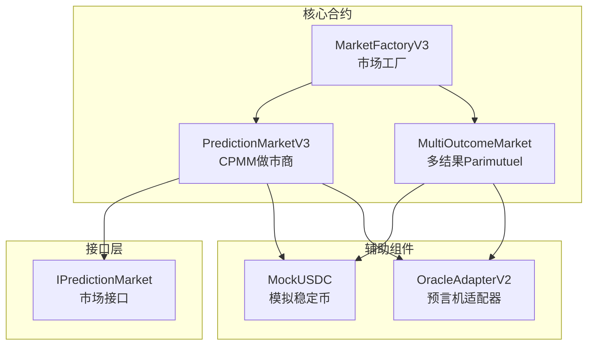

**图表来源**
- [MarketFactoryV3.sol](file://contracts/MarketFactoryV3.sol#L1-L94)
- [PredictionMarketV3.sol](file://contracts/PredictionMarketV3.sol#L1-L200)

**章节来源**
- [MarketFactoryV3.sol](file://contracts/MarketFactoryV3.sol#L1-L94)
- [PredictionMarketV3.sol](file://contracts/PredictionMarketV3.sol#L1-L200)

## 核心组件

### PredictionMarketV3 - CPMM做市商核心

PredictionMarketV3是整个系统的中心合约，实现了完整的CPMM机制：

#### 关键数据结构

| 数据成员 | 类型 | 描述 |
|---------|------|------|
| `reserveYes` | uint256 | Yes分支的流动性储备 |
| `reserveNo` | uint256 | No分支的流动性储备 |
| `totalLPSupply` | uint256 | 流动性池总份额 |
| `feeBps` | uint16 | 交易费用率（基点） |
| `maxBetPerUser` | uint256 | 用户单次最大投注额 |

#### 核心状态管理

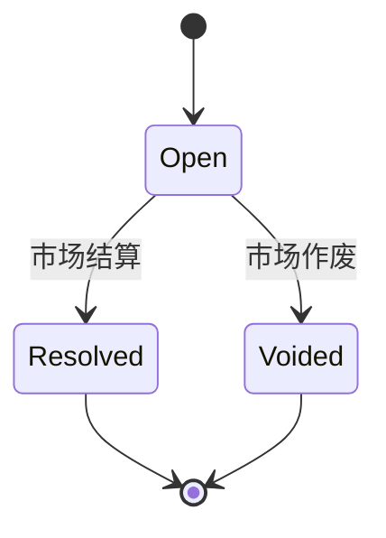

**图表来源**
- [PredictionMarketV3.sol](file://contracts/PredictionMarketV3.sol#L12-L24)

#### 价格计算机制

CPMM系统的核心是价格计算公式：
- **Yes价格** = `reserveNo / (reserveYes + reserveNo) × 10000`
- **No价格** = `reserveYes / (reserveYes + reserveNo) × 10000`

这种设计确保了价格始终在0-10000基点范围内，并且满足`PriceYes + PriceNo = 10000`的约束条件。

**章节来源**
- [PredictionMarketV3.sol](file://contracts/PredictionMarketV3.sol#L26-L29)
- [PredictionMarketV3.sol](file://contracts/PredictionMarketV3.sol#L171-L176)

## 架构概览

### 整体系统架构

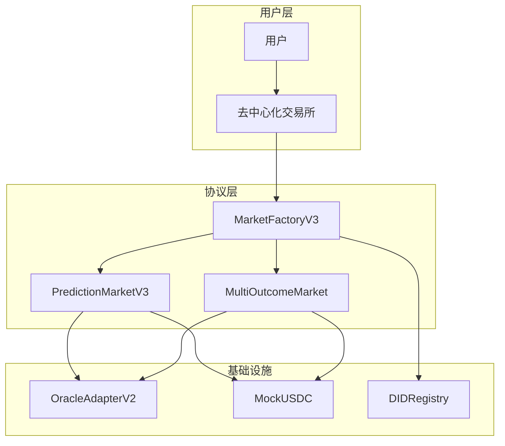

**图表来源**
- [MarketFactoryV3.sol](file://contracts/MarketFactoryV3.sol#L1-L94)
- [PredictionMarketV3.sol](file://contracts/PredictionMarketV3.sol#L1-L200)
- [MultiOutcomeMarket.sol](file://contracts/MultiOutcomeMarket.sol#L1-L113)

### CPMM数学模型详解

#### 常数K值维护

CPMM的核心数学基础是保持常数K不变：
- **初始状态**：`K = reserveYes × reserveNo`
- **交易后**：`K = (reserveYes ± Δshares) × (reserveNo ± Δnet) = K`

其中Δnet是扣除手续费后的净金额，Δshares是获得的份额数量。

#### 价格曲线推导

从常数K的约束条件可以推导出价格曲线：

1. **价格定义**：
   - `P_yes = reserveNo / (reserveYes + reserveNo)`
   - `P_no = reserveYes / (reserveYes + reserveNo)`

2. **边际价格**（价格对交易量的导数）：
   - `dP_yes/dΔnet = -reserveNo/(reserveYes + reserveNo)²`
   - `dP_no/dΔnet = reserveYes/(reserveYes + reserveNo)²`

3. **价格弹性**：
   - 当储备金比例接近1:1时，价格对交易最敏感
   - 当某一分支储备金远大于另一分支时，价格趋于饱和

#### 套利机制分析

CPMM系统天然存在套利机会：

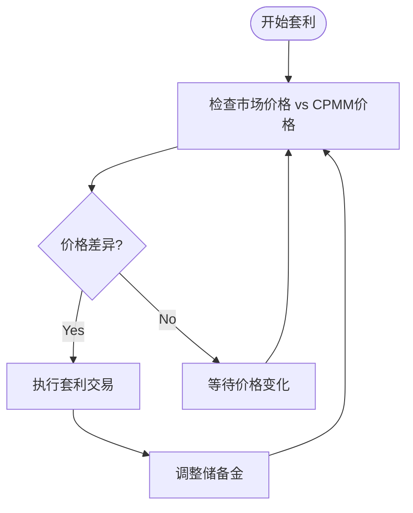

**图表来源**
- [PredictionMarketV3.sol](file://contracts/PredictionMarketV3.sol#L178-L188)

**章节来源**
- [PredictionMarketV3.sol](file://contracts/PredictionMarketV3.sol#L178-L188)

## 详细组件分析

### 交易流程分析

#### 买入操作流程

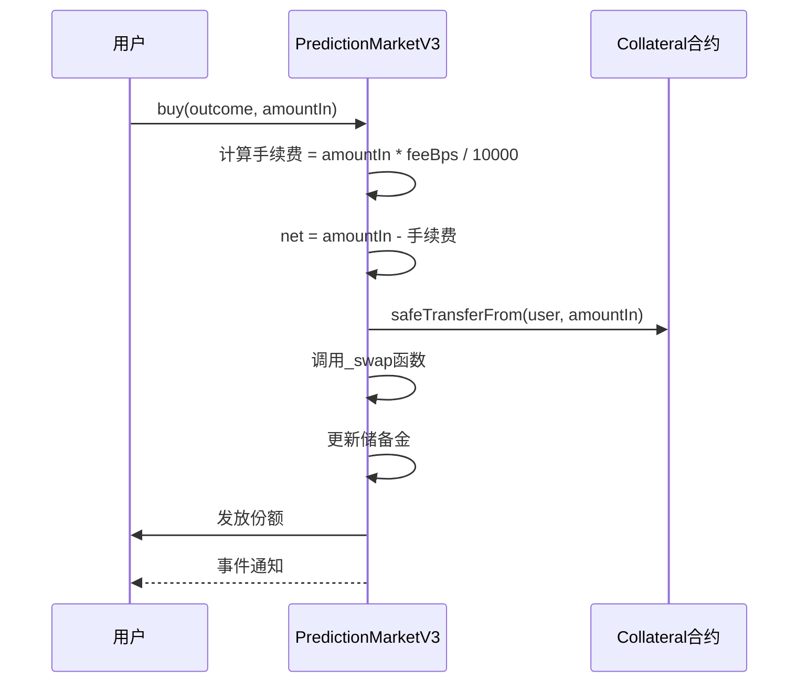

**图表来源**
- [PredictionMarketV3.sol](file://contracts/PredictionMarketV3.sol#L92-L111)

#### 流动性提供机制

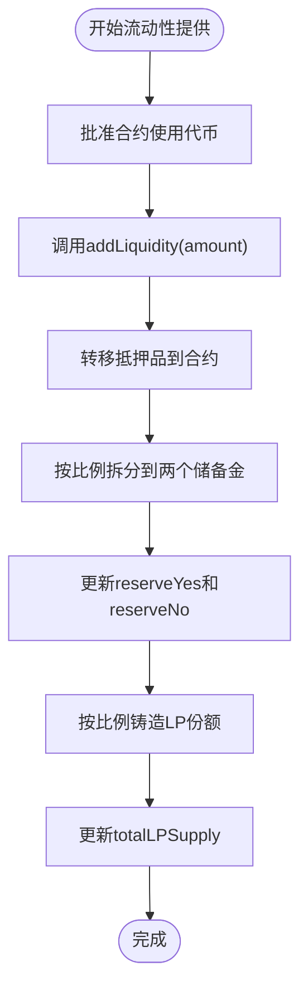

**图表来源**
- [PredictionMarketV3.sol](file://contracts/PredictionMarketV3.sol#L113-L123)

#### 流动性移除机制

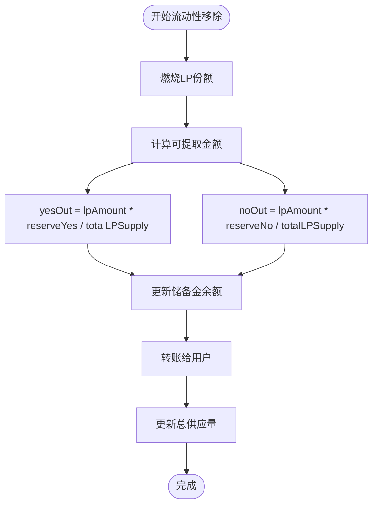

**图表来源**
- [PredictionMarketV3.sol](file://contracts/PredictionMarketV3.sol#L125-L135)

### 数学模型详细推导

#### 交换函数数学分析

CPMM交换函数的关键公式：

1. **Yes分支买入**：
   ```
   sharesOut = (net × reserveYes) / (reserveNo + net)
   reserveYes = reserveYes - sharesOut
   reserveNo = reserveNo + net
   ```

2. **No分支买入**：
   ```
   sharesOut = (net × reserveNo) / (reserveYes + net)
   reserveNo = reserveNo - sharesOut
   reserveYes = reserveYes + net
   ```

3. **验证常数K**：
   ```
   oldK = reserveYes_old × reserveNo_old
   newK = reserveYes_new × reserveNo_new
   需要 oldK ≈ newK
   ```

#### 价格发现机制

CPMM的价格发现基于供需关系：

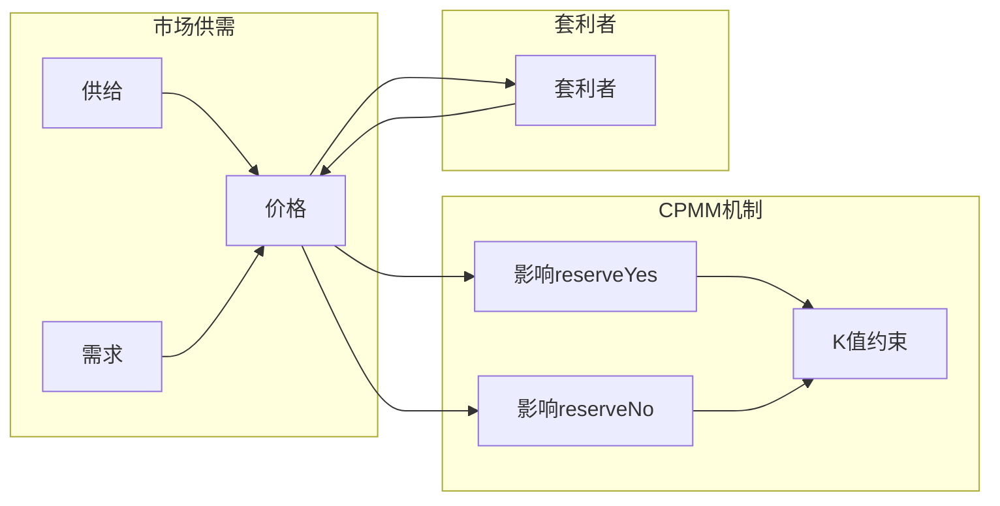

**图表来源**
- [PredictionMarketV3.sol](file://contracts/PredictionMarketV3.sol#L178-L188)

**章节来源**
- [PredictionMarketV3.sol](file://contracts/PredictionMarketV3.sol#L92-L111)
- [PredictionMarketV3.sol](file://contracts/PredictionMarketV3.sol#L113-L135)

### 交易费用结构

#### 费用收集机制

CPMM系统采用交易费用结构：

1. **费用计算**：`fee = amountIn × feeBps / 10000`
2. **费用用途**：
   - 流动性提供者按份额比例分享
   - 协议可能保留部分费用用于治理
3. **费用处理**：费用直接进入合约地址，不参与流动性池

#### 费用分配策略

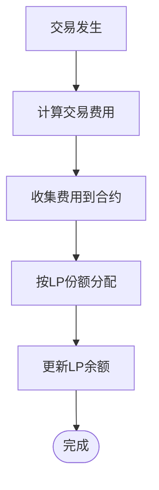

**图表来源**
- [PredictionMarketV3.sol](file://contracts/PredictionMarketV3.sol#L98-L100)

**章节来源**
- [PredictionMarketV3.sol](file://contracts/PredictionMarketV3.sol#L98-L100)

### 经济模型分析

#### 流动性挖矿激励

CPMM系统通过以下机制激励流动性提供：

1. **费用分享**：流动性提供者按份额比例分享交易费用
2. **价格稳定性**：充足的流动性减少价格波动
3. **深度保障**：大额交易不会造成大幅价格移动

#### 风险评估

| 风险类型 | 描述 | 缓解措施 |
|---------|------|----------|
| 滑点风险 | 大额交易造成的价格偏离 | 设置最大投注限制 |
| 套利风险 | 价格与外部市场差异 | 套利者自动纠正 |
| 储备金风险 | 单一分支储备金不足 | 动态调整流动性 |
| 合约风险 | 智能合约漏洞 | 安全审计和升级机制 |

**章节来源**
- [PredictionMarketV3.sol](file://contracts/PredictionMarketV3.sol#L20-L21)
- [PredictionMarketV3.sol](file://contracts/PredictionMarketV3.sol#L96)

## 依赖关系分析

### 合约间依赖关系

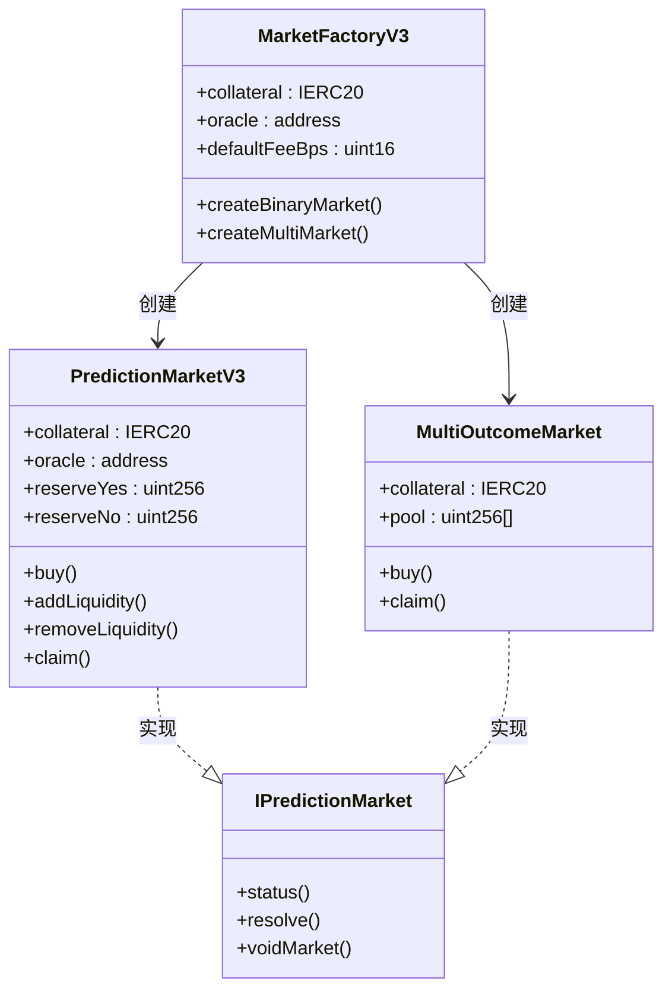

**图表来源**
- [MarketFactoryV3.sol](file://contracts/MarketFactoryV3.sol#L11-L19)
- [PredictionMarketV3.sol](file://contracts/PredictionMarketV3.sol#L8-L35)
- [MultiOutcomeMarket.sol](file://contracts/MultiOutcomeMarket.sol#L8-L32)
- [IPredictionMarket.sol](file://contracts/interfaces/IPredictionMarket.sol#L4-L8)

### 外部依赖分析

#### OpenZeppelin库依赖

系统大量使用OpenZeppelin的安全库：

- **SafeERC20**：安全的ERC20代币操作
- **ReentrancyGuard**：防止重入攻击
- **Ownable**：所有权控制
- **Pausable**：暂停功能

#### 测试依赖

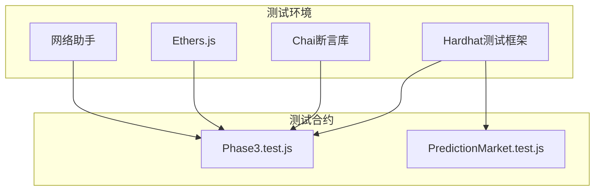

**图表来源**
- [Phase3.test.js](file://test/Phase3.test.js#L1-L74)

**章节来源**
- [MarketFactoryV3.sol](file://contracts/MarketFactoryV3.sol#L4-L8)
- [PredictionMarketV3.sol](file://contracts/PredictionMarketV3.sol#L4-L6)
- [Phase3.test.js](file://test/Phase3.test.js#L1-L74)

## 性能考虑

### Gas优化策略

#### 交易路径优化

1. **批量操作**：合并多个操作以减少Gas消耗
2. **状态检查**：在函数开始进行快速失败检查
3. **存储访问**：最小化存储读写次数

#### 存储布局优化

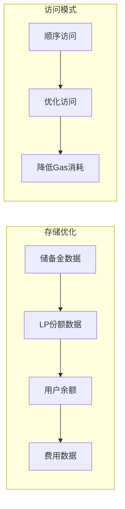

### 并发安全性

系统通过以下机制确保并发安全：

1. **ReentrancyGuard**：防止重入攻击
2. **状态原子性**：所有状态变更在单一事务中完成
3. **输入验证**：严格的参数验证和边界检查

## 故障排除指南

### 常见问题诊断

#### 交易失败排查

| 错误类型 | 可能原因 | 解决方案 |
|---------|----------|----------|
| "not open" | 市场未开放或已结束 | 检查市场状态和结束时间 |
| "invalid" | 参数无效 | 验证outcome值和amountIn |
| "max bet" | 超过用户最大投注限制 | 调整maxBetPerUser或用户限额 |
| "insufficient seed" | 种子流动性不足 | 增加初始流动性提供量 |

#### 流动性问题

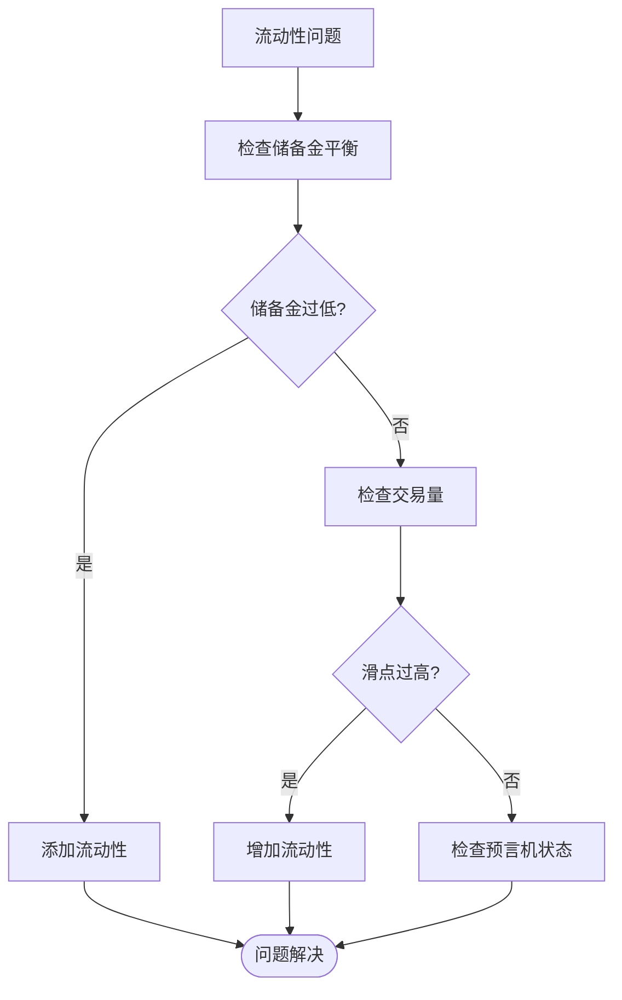

**图表来源**
- [PredictionMarketV3.sol](file://contracts/PredictionMarketV3.sol#L92-L111)

### 调试工具和方法

#### 状态查询

系统提供了多种状态查询接口：

1. **getPoolState()**：获取当前池状态和价格
2. **balance查询**：查看用户余额和LP份额
3. **市场状态**：检查市场是否开放、结算或作废

#### 日志监控

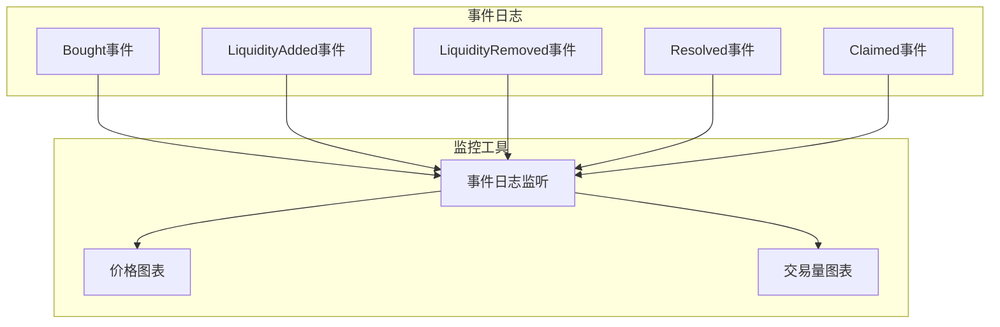

**图表来源**
- [PredictionMarketV3.sol](file://contracts/PredictionMarketV3.sol#L37-L42)

**章节来源**
- [PredictionMarketV3.sol](file://contracts/PredictionMarketV3.sol#L37-L42)
- [PredictionMarketV3.sol](file://contracts/PredictionMarketV3.sol#L171-L176)

## 结论

PredictionMarketV3合约成功实现了CPMM做市商模型，提供了以下关键特性：

### 主要优势

1. **流动性充足**：通过LP机制确保市场始终有流动性
2. **价格连续**：支持连续交易，避免间断性价格跳跃
3. **去中心化**：无需中介即可进行预测市场交易
4. **透明度高**：所有交易和价格都可在链上公开查看

### 技术特点

1. **数学严谨**：基于严格的数学模型保证价格合理性
2. **安全可靠**：采用多重安全机制防止各种攻击
3. **扩展性强**：模块化设计便于功能扩展
4. **治理友好**：支持协议升级和参数调整

### 改进建议

1. **滑点控制**：进一步优化大额交易的滑点处理
2. **费用模型**：探索更公平的费用分配机制
3. **风险管理**：增强风险控制和保护机制
4. **用户体验**：简化用户界面和交互流程

该系统为预测市场提供了一个稳健、透明且高效的基础设施，为DeFi预测市场的进一步发展奠定了坚实基础。

## 附录

### 实际计算示例

#### 示例1：基础交易计算

假设初始状态：
- reserveYes = 1000
- reserveNo = 1000
- feeBps = 100 (1%)

用户购买Yes分支100 USDC：
1. 手续费 = 100 × 100/10000 = 1
2. 净额 = 100 - 1 = 99
3. sharesOut = (99 × 1000) / (1000 + 99) = 90.09
4. 新状态：reserveYes = 1000 - 90.09 = 909.91, reserveNo = 1000 + 99 = 1099

#### 示例2：流动性提供

用户提供2000 USDC作为流动性：
1. 1000 USDC进入Yes储备
2. 1000 USDC进入No储备
3. mint 2000 LP份额
4. totalLPSupply = 2000

### 相关文件参考

**章节来源**
- [Phase3.test.js](file://test/Phase3.test.js#L6-L27)
- [PredictionMarketV3.json](file://artifacts/contracts/PredictionMarketV3.sol/PredictionMarketV3.json#L1-L588)