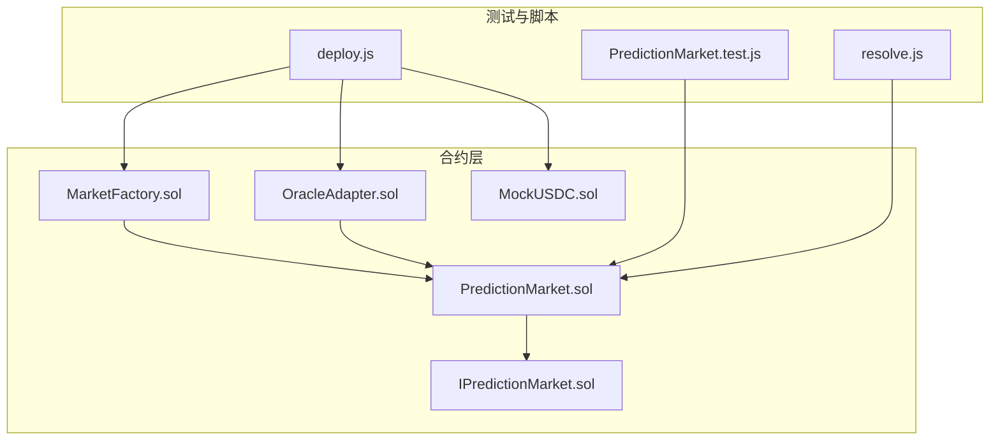
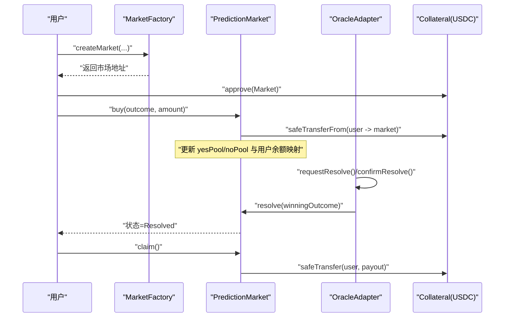
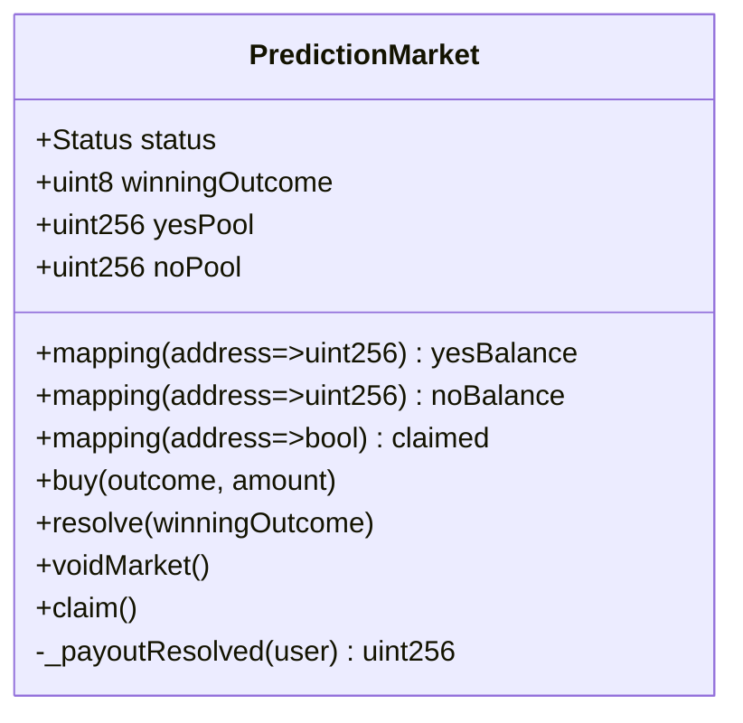
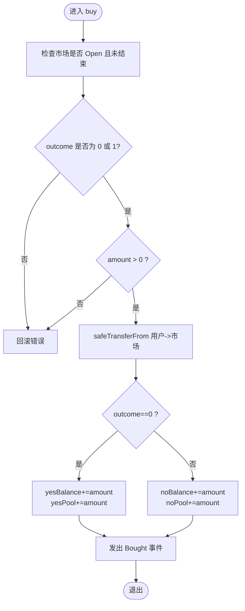
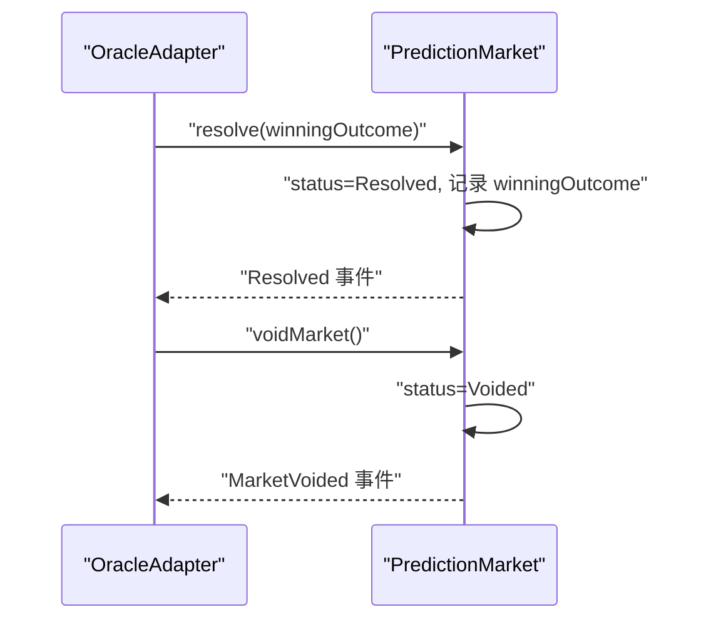
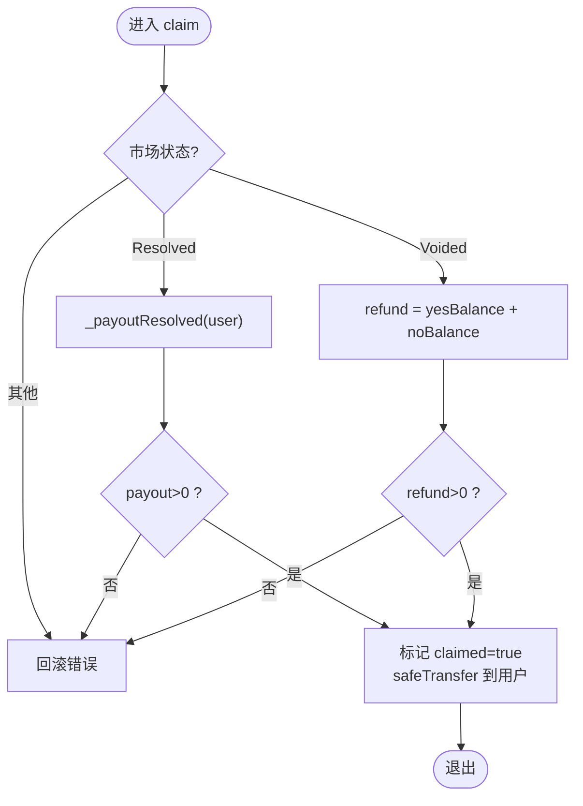
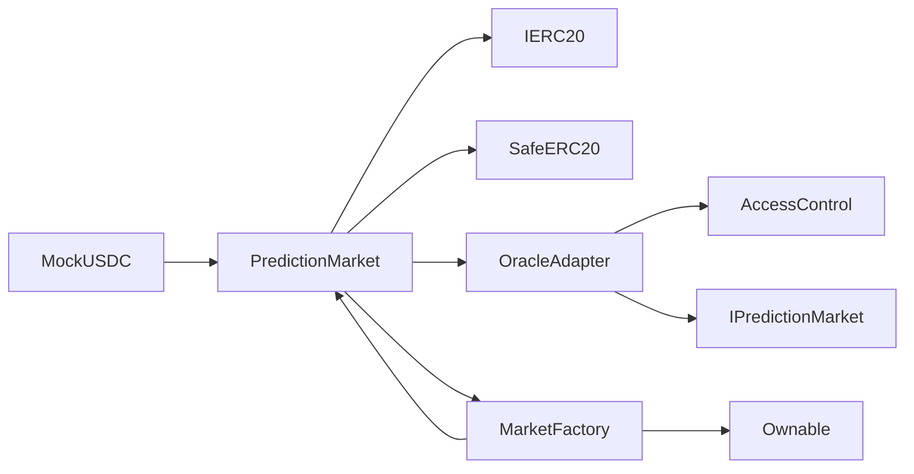

# 二元市场（Yes/No）

<cite>
**本文引用的文件列表**
- [PredictionMarket.sol](file://contracts/PredictionMarket.sol)
- [IPredictionMarket.sol](file://contracts/interfaces/IPredictionMarket.sol)
- [MarketFactory.sol](file://contracts/MarketFactory.sol)
- [OracleAdapter.sol](file://contracts/OracleAdapter.sol)
- [MockUSDC.sol](file://contracts/MockUSDC.sol)
- [PredictionMarket.test.js](file://test/PredictionMarket.test.js)
- [deploy.js](file://scripts/deploy.js)
- [resolve.js](file://scripts/resolve.js)
- [PredictionMarketV3.sol](file://contracts/PredictionMarketV3.sol)
</cite>

## 目录
1. [简介](#简介)
2. [项目结构](#项目结构)
3. [核心组件](#核心组件)
4. [架构总览](#架构总览)
5. [详细组件分析](#详细组件分析)
6. [依赖关系分析](#依赖关系分析)
7. [性能与复杂度](#性能与复杂度)
8. [故障排查指南](#故障排查指南)
9. [结论](#结论)
10. [附录：使用场景与示例](#附录使用场景与示例)

## 简介
本文件面向二元市场（Yes/No）的预测合约实现，重点解析 PredictionMarket 合约在 Parimutuel 共同赔付机制下的工作原理，涵盖数据结构设计（yesPool/noPool 池与用户余额映射）、投注 buy() 的逻辑、解决 resolve() 的流程、收益提取 claim() 的规则，以及数学公式与示例。同时对比 V3 版本的 CPMM 机制差异，帮助读者理解该系统的优势（简单性、低摩擦）与局限性（流动性不足、价格发现有限），并提供可操作的部署与使用脚本路径。

## 项目结构
该仓库采用按功能模块划分的组织方式：
- 合约层：PredictionMarket（二元市场）、MarketFactory（市场工厂）、OracleAdapter（时间锁/多签解决适配器）、MockUSDC（测试代币）、接口定义等
- 测试层：PredictionMarket.test.js 验证核心行为
- 脚本层：deploy.js 部署、resolve.js 解决调用

图表来源
- [PredictionMarket.sol](file://contracts/PredictionMarket.sol#L1-L134)
- [IPredictionMarket.sol](file://contracts/interfaces/IPredictionMarket.sol#L1-L9)
- [MarketFactory.sol](file://contracts/MarketFactory.sol#L1-L60)
- [OracleAdapter.sol](file://contracts/OracleAdapter.sol#L1-L83)
- [MockUSDC.sol](file://contracts/MockUSDC.sol#L1-L18)
- [PredictionMarket.test.js](file://test/PredictionMarket.test.js#L1-L70)
- [deploy.js](file://scripts/deploy.js#L1-L57)
- [resolve.js](file://scripts/resolve.js#L1-L20)

章节来源
- [PredictionMarket.sol](file://contracts/PredictionMarket.sol#L1-L134)
- [MarketFactory.sol](file://contracts/MarketFactory.sol#L1-L60)
- [OracleAdapter.sol](file://contracts/OracleAdapter.sol#L1-L83)
- [MockUSDC.sol](file://contracts/MockUSDC.sol#L1-L18)
- [PredictionMarket.test.js](file://test/PredictionMarket.test.js#L1-L70)
- [deploy.js](file://scripts/deploy.js#L1-L57)
- [resolve.js](file://scripts/resolve.js#L1-L20)

## 核心组件
- PredictionMarket：二元 Yes/No 市场的核心合约，支持投注、时间锁/多签解决、市场作废、收益提取
- MarketFactory：负责创建市场实例，注入 collateral、oracle、factory、matchRef、question、endTime 等参数
- OracleAdapter：为市场提供时间锁/多签解决能力，支持请求、确认、立即解决、作废
- MockUSDC：测试用稳定币，模拟真实代币的转账与余额
- 接口 IPredictionMarket：暴露状态查询与解决/作废接口

章节来源
- [PredictionMarket.sol](file://contracts/PredictionMarket.sol#L1-L134)
- [MarketFactory.sol](file://contracts/MarketFactory.sol#L1-L60)
- [OracleAdapter.sol](file://contracts/OracleAdapter.sol#L1-L83)
- [MockUSDC.sol](file://contracts/MockUSDC.sol#L1-L18)
- [IPredictionMarket.sol](file://contracts/interfaces/IPredictionMarket.sol#L1-L9)

## 架构总览
二元市场通过 MarketFactory 创建 PredictionMarket 实例；OracleAdapter 提供时间锁/多签解决流程；用户通过 approve 后调用 buy 投注；最终由 OracleAdapter 在满足条件后调用 resolve 或 voidMarket；赢家通过 claim 提取收益。

图表来源
- [MarketFactory.sol](file://contracts/MarketFactory.sol#L37-L54)
- [PredictionMarket.sol](file://contracts/PredictionMarket.sol#L64-L113)
- [OracleAdapter.sol](file://contracts/OracleAdapter.sol#L48-L81)
- [MockUSDC.sol](file://contracts/MockUSDC.sol#L14-L16)

## 详细组件分析

### 数据结构与状态机
- 状态枚举：Open、Resolved、Voided
- 资产池：yesPool、noPool
- 用户余额映射：yesBalance、noBalance、claimed
- 关键字段：collateral、oracle、factory、matchRef、question、endTime

图表来源
- [PredictionMarket.sol](file://contracts/PredictionMarket.sol#L11-L37)
- [PredictionMarket.sol](file://contracts/PredictionMarket.sol#L64-L132)

章节来源
- [PredictionMarket.sol](file://contracts/PredictionMarket.sol#L11-L37)

### 投注 buy() 逻辑
- 条件校验：市场开放、未结束、outcome 有效、amount>0
- 转账：从用户转入市场合约
- 更新：根据 outcome 增加对应余额与池子
- 事件：Bought

图表来源
- [PredictionMarket.sol](file://contracts/PredictionMarket.sol#L64-L81)

章节来源
- [PredictionMarket.sol](file://contracts/PredictionMarket.sol#L64-L81)

### 解决 resolve() 与作废 voidMarket()
- resolve：仅允许 oracle 调用，将状态置为 Resolved 并记录胜出方向
- voidMarket：仅允许 oracle 调用，将状态置为 Voided

图表来源
- [OracleAdapter.sol](file://contracts/OracleAdapter.sol#L48-L81)
- [PredictionMarket.sol](file://contracts/PredictionMarket.sol#L83-L95)

章节来源
- [OracleAdapter.sol](file://contracts/OracleAdapter.sol#L48-L81)
- [PredictionMarket.sol](file://contracts/PredictionMarket.sol#L83-L95)

### 收益提取 claim() 与收益计算
- claim 规则：
  - Resolved：调用内部 _payoutResolved 计算
  - Voided：退还用户在 yesBalance 和 noBalance 中的全部金额
  - 已领取过则禁止重复领取
- _payoutResolved 计算：
  - 若胜出方向池子为 0 或用户在该方向无余额，则收益为 0
  - 否则收益 = 用户在该方向的余额 × 总池子 / 胜出方向池子

图表来源
- [PredictionMarket.sol](file://contracts/PredictionMarket.sol#L97-L113)
- [PredictionMarket.sol](file://contracts/PredictionMarket.sol#L115-L132)

章节来源
- [PredictionMarket.sol](file://contracts/PredictionMarket.sol#L97-L113)
- [PredictionMarket.sol](file://contracts/PredictionMarket.sol#L115-L132)

### 数学公式与示例
- 总池子：totalPool = yesPool + noPool
- 胜出方向池子：winSideTotal（当 winningOutcome=0 时为 yesPool，否则为 noPool）
- 用户在胜出方向的余额：userStake（当 winningOutcome=0 时为 yesBalance[user]，否则为 noBalance[user]）
- 收益计算（非零情况）：
  - payout = userStake × totalPool / winSideTotal

示例（单位：最小单位，如 USDC 的 6 位小数）：
- 场景一：Alice 投注 Yes 100，Bob 投注 No 50，最终 Yes 获胜
  - totalPool = 150，winSideTotal = 100，Alice 在 Yes 的余额为 100
  - Alice 收益 = 100 × 150 / 100 = 150
- 场景二：Alice 投注 Yes 100，Bob 投注 No 100，最终 No 获胜
  - totalPool = 200，winSideTotal = 100，Bob 在 No 的余额为 100
  - Bob 收益 = 100 × 200 / 100 = 200

章节来源
- [PredictionMarket.sol](file://contracts/PredictionMarket.sol#L115-L132)
- [PredictionMarket.test.js](file://test/PredictionMarket.test.js#L41-L50)

### 与 V3 版本的对比（CPMM 机制）
- V3 使用 reserveYes/reserveNo 的恒定乘积做市商模型，引入手续费、LP、最大单用户下注额度等
- V3 的收益计算基于 LP 持仓与池子规模，公式与 V1 不同
- V1 更简单直接，V3 更接近传统 AMM 的价格发现与流动性提供

章节来源
- [PredictionMarketV3.sol](file://contracts/PredictionMarketV3.sol#L1-L200)

## 依赖关系分析
- PredictionMarket 依赖：
  - IERC20（collateral）
  - SafeERC20（安全转账）
  - OracleAdapter（resolve/void）
  - MarketFactory（创建实例）
- OracleAdapter 依赖：
  - AccessControl（角色控制）
  - IPredictionMarket（调用 resolve/void）
- MarketFactory 依赖：
  - Ownable（所有权）
  - PredictionMarket（构造市场）

图表来源
- [PredictionMarket.sol](file://contracts/PredictionMarket.sol#L4-L9)
- [OracleAdapter.sol](file://contracts/OracleAdapter.sol#L4-L5)
- [MarketFactory.sol](file://contracts/MarketFactory.sol#L4-L6)
- [MockUSDC.sol](file://contracts/MockUSDC.sol#L4-L5)

章节来源
- [PredictionMarket.sol](file://contracts/PredictionMarket.sol#L4-L9)
- [OracleAdapter.sol](file://contracts/OracleAdapter.sol#L4-L5)
- [MarketFactory.sol](file://contracts/MarketFactory.sol#L4-L6)
- [MockUSDC.sol](file://contracts/MockUSDC.sol#L4-L5)

## 性能与复杂度
- buy/claim/resolve/void：均为 O(1) 纯映射读写与基本算术
- 存储热点：yesPool/noPool、用户余额映射、状态标志
- 安全性：SafeERC20 防止 reentrancy 与代币异常；onlyOracle 限制解决权限；onlyOwner 限制工厂配置
- 可扩展性：V3 引入手续费与 LP，提升流动性与价格发现能力

[本节为通用性能讨论，不直接分析具体文件]

## 故障排查指南
- 无法解决（非 oracle）：resolve/revert("not oracle")
- 市场已关闭：buy/revert("not open" 或 "ended")
- 重复领取：claim/revert("already claimed")
- 无收益可领：claim/revert("nothing to claim")
- 作废退款：Voided 时可提取 yesBalance + noBalance
- 时间锁未到：OracleAdapter.confirmResolve 需等待 timelockDelay

章节来源
- [PredictionMarket.sol](file://contracts/PredictionMarket.sol#L64-L113)
- [OracleAdapter.sol](file://contracts/OracleAdapter.sol#L60-L67)
- [PredictionMarket.test.js](file://test/PredictionMarket.test.js#L52-L68)

## 结论
PredictionMarket 以最简的 Parimutuel 共同赔付模型实现了二元市场：通过两个池子与用户余额映射，实现“赢家共享总池”的公平分配；结合 OracleAdapter 的时间锁/多签机制，确保结果可信。其优势在于简单、低摩擦、易于审计；局限在于缺乏流动性与价格发现能力。若需更丰富的流动性与价格发现，可参考 V3 的 CPMM 模式。

[本节为总结性内容，不直接分析具体文件]

## 附录：使用场景与示例

### 部署与初始化
- 使用 deploy.js 部署 MockUSDC、OracleAdapter、DIDRegistry、MarketFactory，并授予 oracle 角色
- 部署输出包含 chainId、合约地址、oracle、时间锁等信息

章节来源
- [deploy.js](file://scripts/deploy.js#L1-L57)

### 创建市场
- MarketFactory.createMarket(matchRef, question, endTime) 返回市场地址
- 用户需先 approve 再调用 buy

章节来源
- [MarketFactory.sol](file://contracts/MarketFactory.sol#L37-L54)
- [PredictionMarket.test.js](file://test/PredictionMarket.test.js#L22-L32)

### 投注示例
- Alice 投注 Yes 100，Bob 投注 No 50
- 验证 yesPool/noPool 与用户余额映射

章节来源
- [PredictionMarket.test.js](file://test/PredictionMarket.test.js#L34-L39)

### 解决与收益提取
- OracleAdapter.resolveNow 或 requestResolve + confirmResolve
- 赢家调用 claim 提取收益

章节来源
- [OracleAdapter.sol](file://contracts/OracleAdapter.sol#L48-L81)
- [resolve.js](file://scripts/resolve.js#L1-L20)
- [PredictionMarket.test.js](file://test/PredictionMarket.test.js#L41-L50)

### 作废退款
- OracleAdapter.voidMarket 后，用户可提取全部余额

章节来源
- [OracleAdapter.sol](file://contracts/OracleAdapter.sol#L77-L81)
- [PredictionMarket.test.js](file://test/PredictionMarket.test.js#L52-L57)