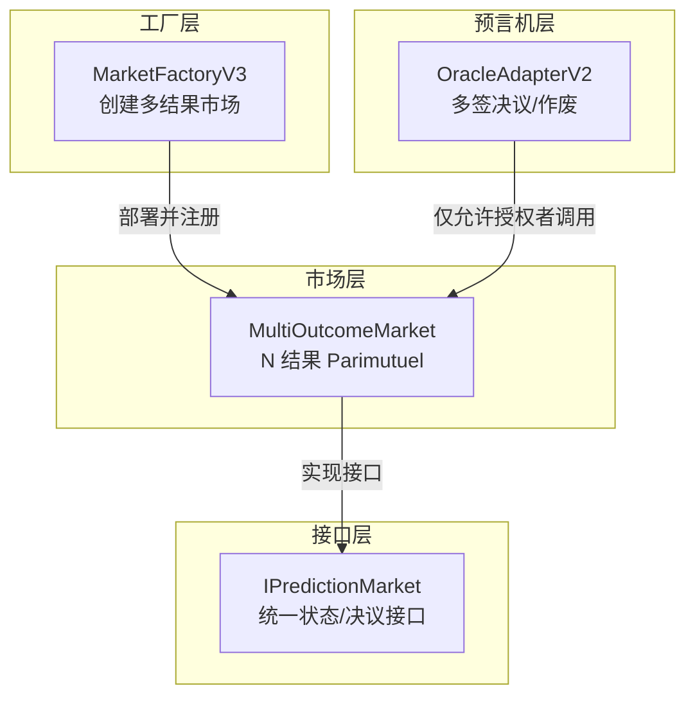
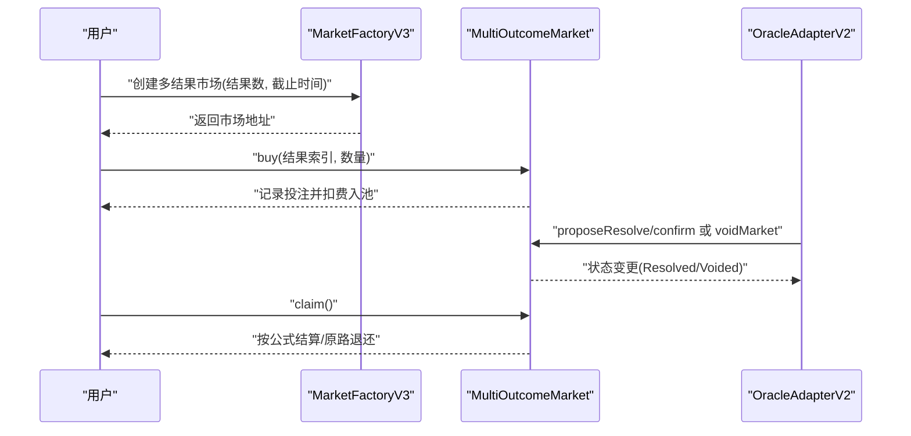
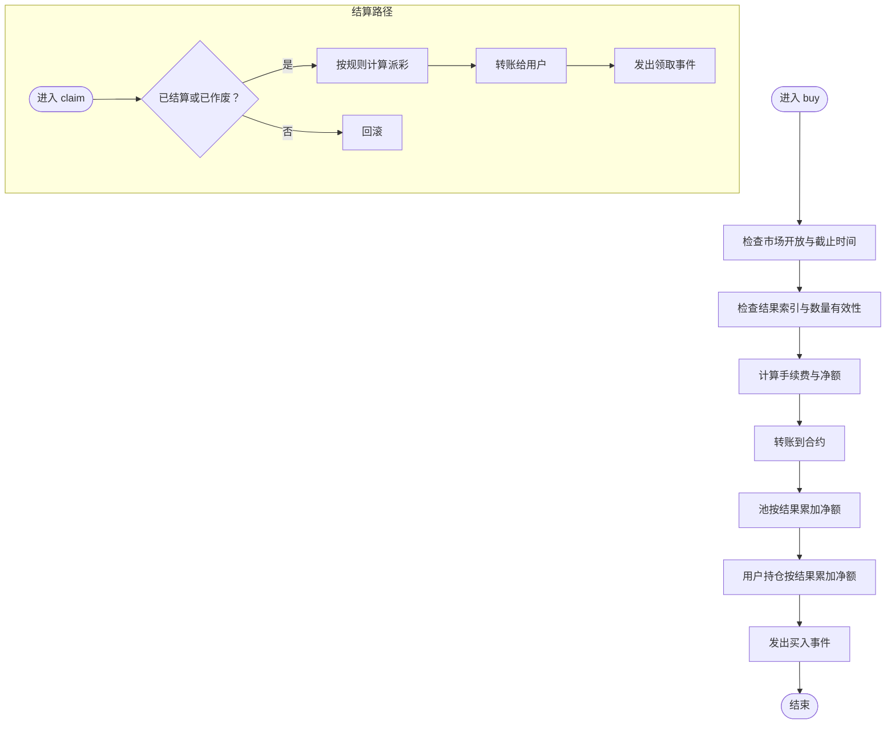
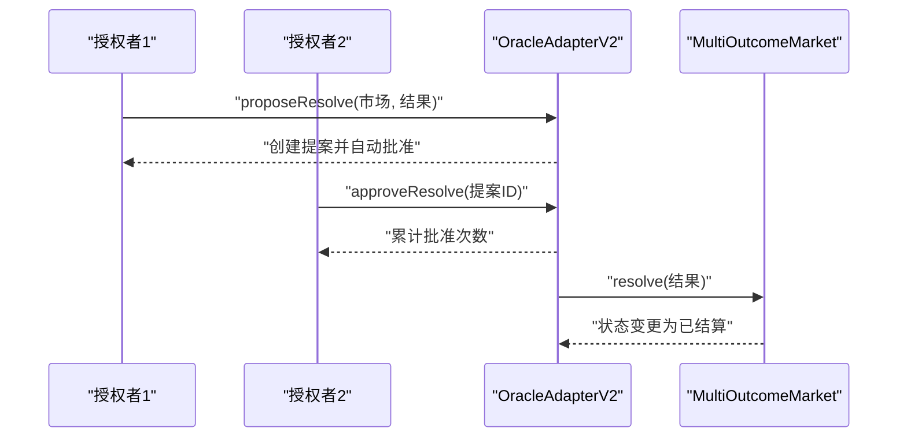
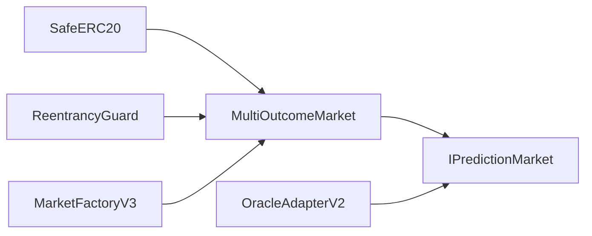

# 多结果市场

<cite>
**本文引用的文件**
- [MultiOutcomeMarket.sol](file://contracts/MultiOutcomeMarket.sol)
- [MarketFactoryV3.sol](file://contracts/MarketFactoryV3.sol)
- [OracleAdapterV2.sol](file://contracts/OracleAdapterV2.sol)
- [IPredictionMarket.sol](file://contracts/interfaces/IPredictionMarket.sol)
- [Phase3.test.js](file://test/Phase3.test.js)
</cite>

## 目录
1. [引言](#引言)
2. [项目结构](#项目结构)
3. [核心组件](#核心组件)
4. [架构总览](#架构总览)
5. [详细组件分析](#详细组件分析)
6. [依赖关系分析](#依赖关系分析)
7. [性能考量](#性能考量)
8. [故障排查指南](#故障排查指南)
9. [结论](#结论)
10. [附录：使用场景与最佳实践](#附录使用场景与最佳实践)

## 引言
本文件面向多结果预测市场的技术实现，系统化解析 MultiOutcomeMarket 合约的架构与运行机制，重点覆盖：
- 支持 2 至 8 个结果的 Parimutuel（共注）模型扩展
- 多结果池子的数据结构设计与费用分离机制
- 不同结果的投注处理流程与结算算法
- 复杂度提升带来的挑战与工程化解决方案
- 实际使用场景、费用结构设计建议与性能优化要点

## 项目结构
MultiOutcomeMarket 所属的模块在工厂与适配器层完成编排，形成“工厂创建市场 + 适配器治理决议”的整体链上治理闭环。

图表来源
- [MarketFactoryV3.sol](file://contracts/MarketFactoryV3.sol#L68-L88)
- [MultiOutcomeMarket.sol](file://contracts/MultiOutcomeMarket.sol#L8-L37)
- [OracleAdapterV2.sol](file://contracts/OracleAdapterV2.sol#L44-L81)
- [IPredictionMarket.sol](file://contracts/interfaces/IPredictionMarket.sol#L4-L8)

章节来源
- [MarketFactoryV3.sol](file://contracts/MarketFactoryV3.sol#L10-L93)
- [MultiOutcomeMarket.sol](file://contracts/MultiOutcomeMarket.sol#L8-L113)
- [OracleAdapterV2.sol](file://contracts/OracleAdapterV2.sol#L8-L83)
- [IPredictionMarket.sol](file://contracts/interfaces/IPredictionMarket.sol#L4-L8)

## 核心组件
- MultiOutcomeMarket：多结果 Parimutuel 市场核心，负责资金池、投注、结算与作废能力
- MarketFactoryV3：多结果市场创建入口，负责参数校验与市场注册
- OracleAdapterV2：多签决议适配器，负责对市场进行“确认获胜结果”或“作废”
- IPredictionMarket：统一的市场接口，定义状态与决议方法

章节来源
- [MultiOutcomeMarket.sol](file://contracts/MultiOutcomeMarket.sol#L8-L113)
- [MarketFactoryV3.sol](file://contracts/MarketFactoryV3.sol#L68-L88)
- [OracleAdapterV2.sol](file://contracts/OracleAdapterV2.sol#L44-L81)
- [IPredictionMarket.sol](file://contracts/interfaces/IPredictionMarket.sol#L4-L8)

## 架构总览
多结果市场的控制流由“创建 -> 投注 -> 决议 -> 结算”构成；其中 OracleAdapterV2 提供多签治理能力，确保市场决议的去中心化与可审计性。

图表来源
- [MarketFactoryV3.sol](file://contracts/MarketFactoryV3.sol#L68-L88)
- [MultiOutcomeMarket.sol](file://contracts/MultiOutcomeMarket.sol#L65-L111)
- [OracleAdapterV2.sol](file://contracts/OracleAdapterV2.sol#L44-L81)

## 详细组件分析

### MultiOutcomeMarket 合约
MultiOutcomeMarket 是多结果 Parimutuel 的核心实现，支持 2–8 个结果，采用统一的费用分离与结算模型。

- 关键数据结构
  - 资产池：按结果索引维护池金额数组
  - 用户持仓：二维映射记录每个用户在各结果上的投注额
  - 状态：Open/Resolved/Voided
  - 费用：以基点计，投注时直接从总额中扣除

- 主要流程
  - 投注 buy：校验市场开放与截止时间、结果索引有效、非零数量；计算费用并转入合约；将净额计入对应池与用户持仓
  - 决议 resolve：仅允许授权者调用，设置获胜结果并置为已结算
  - 作废 voidMarket：仅允许授权者调用，标记为 Voided
  - 结算 claim：若已结算，按“用户胜方持仓 × 总池 / 胜方池”计算；若已作废，按用户所有持仓原路退还

- 费用分离机制
  - 投注金额先按 feeBps 计算手续费，剩余 net 入池
  - 池子与用户持仓均记录 net 额，避免重复抽水
  - 结算时使用原始池总量与胜方池总量，保证公平性

- 并发安全
  - 使用 ReentrancyGuard 防范重入攻击
  - 投注与结算均为非重入修饰

- 复杂度与扩展性
  - 池与用户映射均为线性访问，适合 2–8 结果规模
  - 若扩展至更高结果数，需关注 gas 成本与循环开销

图表来源
- [MultiOutcomeMarket.sol](file://contracts/MultiOutcomeMarket.sol#L65-L111)

章节来源
- [MultiOutcomeMarket.sol](file://contracts/MultiOutcomeMarket.sol#L8-L113)

### MarketFactoryV3 工厂
MarketFactoryV3 负责创建多结果市场，统一注入基础参数（资产、授权预言机、默认费用等），并登记市场类型与 ID。

- 关键点
  - createMultiMarket 接收 outcomeCount 参数，传入 MultiOutcomeMarket 构造函数
  - 默认费用 defaultFeeBps 可配置
  - 市场类型标记为 1（多结果）

章节来源
- [MarketFactoryV3.sol](file://contracts/MarketFactoryV3.sol#L68-L88)

### OracleAdapterV2 适配器
OracleAdapterV2 提供多签治理能力，通过提案与批准流程实现“提议 -> 多签 -> 执行”的治理模式，避免单一权威者滥用。

- 关键点
  - proposeResolve：创建提案并自动批准（首个授权者）
  - approveResolve：其他授权者逐个批准
  - 达到阈值后执行 resolve，否则 voidMarket
  - 对市场状态进行前置校验，防止错误时机操作

图表来源
- [OracleAdapterV2.sol](file://contracts/OracleAdapterV2.sol#L44-L75)
- [MultiOutcomeMarket.sol](file://contracts/MultiOutcomeMarket.sol#L76-L81)

章节来源
- [OracleAdapterV2.sol](file://contracts/OracleAdapterV2.sol#L8-L83)

### IPredictionMarket 接口
IPredictionMarket 定义了市场统一的状态查询与决议方法，便于适配器与工厂层对不同市场类型进行抽象操作。

章节来源
- [IPredictionMarket.sol](file://contracts/interfaces/IPredictionMarket.sol#L4-L8)

### 测试用例验证
测试用例展示了多结果市场的关键行为：
- 创建多结果市场（如 3 结果）
- 用户在多个结果上进行投注
- 通过 OracleAdapterV2 提议并确认决议
- 用户成功领取结算

章节来源
- [Phase3.test.js](file://test/Phase3.test.js#L29-L50)

## 依赖关系分析
- MultiOutcomeMarket 依赖 OpenZeppelin 的 SafeERC20 与 ReentrancyGuard，确保转账安全与防重入
- MarketFactoryV3 依赖 MultiOutcomeMarket 进行部署与注册
- OracleAdapterV2 通过 IPredictionMarket 接口对市场进行决议/作废
- 测试用例通过 Hardhat 与 MockUSDC 验证完整流程

图表来源
- [MultiOutcomeMarket.sol](file://contracts/MultiOutcomeMarket.sol#L4-L10)
- [MarketFactoryV3.sol](file://contracts/MarketFactoryV3.sol#L8-L8)
- [OracleAdapterV2.sol](file://contracts/OracleAdapterV2.sol#L5-L5)

章节来源
- [MultiOutcomeMarket.sol](file://contracts/MultiOutcomeMarket.sol#L4-L10)
- [MarketFactoryV3.sol](file://contracts/MarketFactoryV3.sol#L8-L8)
- [OracleAdapterV2.sol](file://contracts/OracleAdapterV2.sol#L5-L5)

## 性能考量
- 投注与结算的循环复杂度
  - 投注：常数次写入，O(1)
  - 结算（Resolved）：遍历所有结果池求和，O(N)，N≤8，可接受
  - 结算（Voided）：遍历用户在所有结果上的持仓，O(N)，可接受
- Gas 优化建议
  - 将池与用户映射改为固定长度数组（若结果数上限稳定），减少动态扩容与存储读取
  - 在批量结算场景下，考虑外部批处理工具聚合派彩
- 并发与安全
  - 已启用 ReentrancyGuard，建议在外部批处理或链下聚合时避免跨市场重入风险
- 可扩展性
  - 当结果数超过 8 时，需评估 gas 上限与存储成本，必要时引入分页/分片或链下聚合

[本节为通用性能讨论，不直接分析具体文件]

## 故障排查指南
- 投注失败
  - 检查市场是否开放且未过期
  - 检查结果索引是否在 [0, outcomeCount) 范围内
  - 检查输入数量是否大于 0
  - 检查代币授权与余额
- 结算失败
  - 检查市场状态是否为 Resolved 或 Voided
  - Resolved 场景下，胜方池必须非空
  - 已结算用户不可重复领取
- 决议失败
  - 仅授权者可调用 resolve/voidMarket
  - 多签适配器需达到阈值才可执行
- 作废场景
  - 作废后用户可按原路退回所有投注

章节来源
- [MultiOutcomeMarket.sol](file://contracts/MultiOutcomeMarket.sol#L65-L111)
- [OracleAdapterV2.sol](file://contracts/OracleAdapterV2.sol#L44-L81)

## 结论
MultiOutcomeMarket 以简洁的池化与费用分离模型，实现了 2–8 结果的 Parimutuel 市场。配合 MarketFactoryV3 的标准化创建与 OracleAdapterV2 的多签治理，形成从创建到结算的完整链上闭环。在扩展至更高结果数时，应重点关注 gas 成本与存储效率，并结合链下聚合策略提升吞吐。

[本节为总结性内容，不直接分析具体文件]

## 附录：使用场景与最佳实践

- 设计合理的结果选项
  - 明确业务边界，避免语义模糊的结果
  - 控制结果总数在 2–8 以内，确保 gas 与用户体验
  - 对于多阶段事件（如小组赛、淘汰赛），拆分为多个独立市场，降低复杂度

- 费用结构设计
  - 默认费用建议在 0.1%–1% 区间，兼顾流动性与手续费收入
  - 针对高波动事件可适度提高费用，但需平衡用户参与意愿
  - 费用直接从投注额中扣除，不额外收取手续费，简化结算

- 投注与结算策略
  - 在市场关闭前集中投注，避免临近截止时间的 gas 波动
  - 结算时优先处理 Resolved 场，Voided 场次可快速原路退还
  - 对高频交易场景，建议采用链下聚合与链上批量派发

- 治理与安全
  - 多签阈值建议 ≥ 2，避免单点风险
  - 定期审计 OracleAdapterV2 的提案与批准记录
  - 对异常市场（如无投注、长期无人结算）制定自动化处置流程

[本节为通用实践建议，不直接分析具体文件]