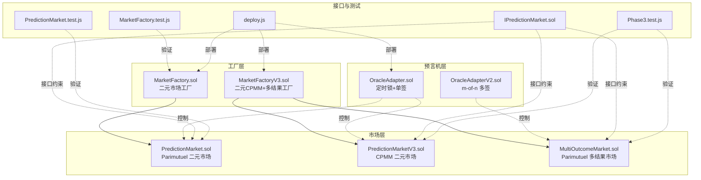
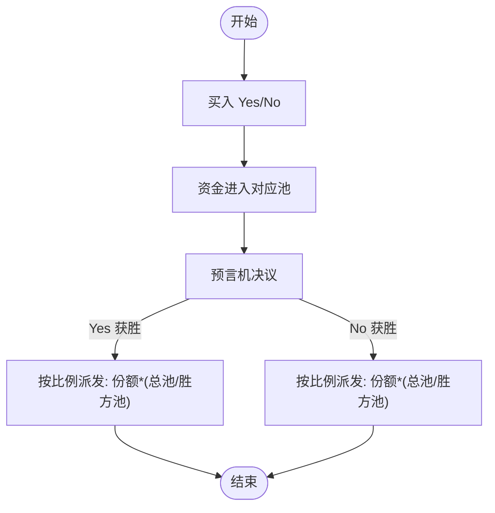
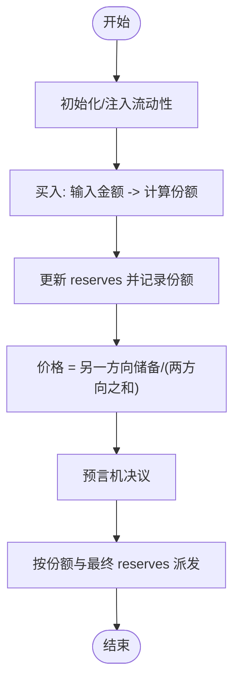
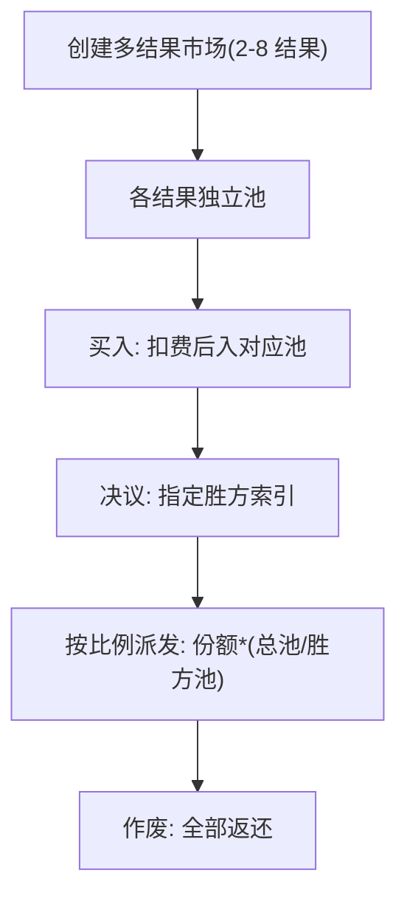
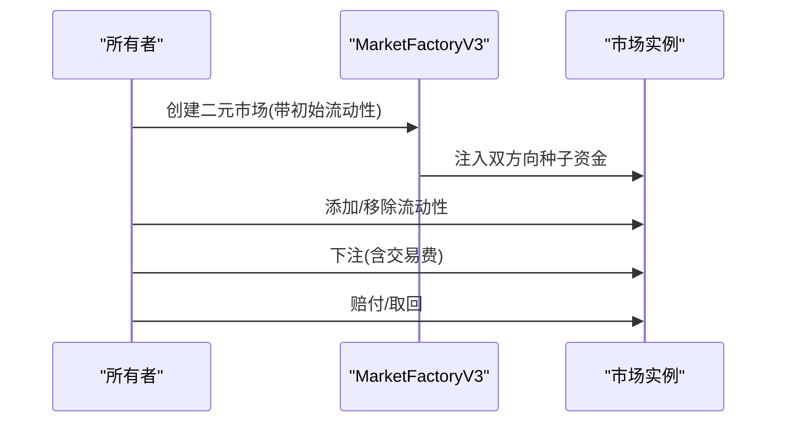
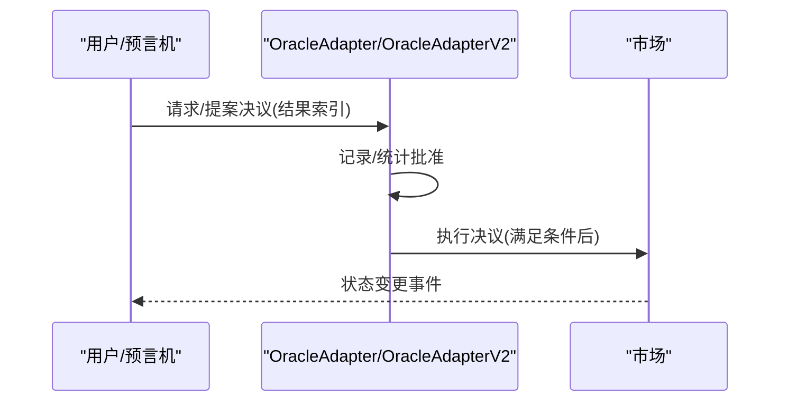
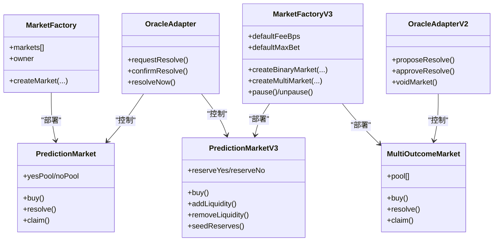

# 市场类型对比

<cite>
**本文引用的文件**
- [PredictionMarket.sol](file://contracts/contracts/PredictionMarket.sol)
- [MultiOutcomeMarket.sol](file://contracts/contracts/MultiOutcomeMarket.sol)
- [MarketFactory.sol](file://contracts/contracts/MarketFactory.sol)
- [MarketFactoryV3.sol](file://contracts/contracts/MarketFactoryV3.sol)
- [PredictionMarketV3.sol](file://contracts/contracts/PredictionMarketV3.sol)
- [IPredictionMarket.sol](file://contracts/contracts/interfaces/IPredictionMarket.sol)
- [OracleAdapter.sol](file://contracts/contracts/OracleAdapter.sol)
- [OracleAdapterV2.sol](file://contracts/contracts/OracleAdapterV2.sol)
- [PredictionMarket.test.js](file://contracts/test/PredictionMarket.test.js)
- [Phase3.test.js](file://contracts/test/Phase3.test.js)
- [MarketFactory.test.js](file://contracts/test/MarketFactory.test.js)
- [deploy.js](file://contracts/scripts/deploy.js)
</cite>

## 目录
1. [引言](#引言)
2. [项目结构](#项目结构)
3. [核心组件](#核心组件)
4. [架构总览](#架构总览)
5. [详细组件分析](#详细组件分析)
6. [依赖关系分析](#依赖关系分析)
7. [性能考量](#性能考量)
8. [故障排查指南](#故障排查指南)
9. [结论](#结论)
10. [附录：数学模型与公式](#附录数学模型与公式)

## 引言
本文件对预测市场的两类核心形态进行系统性对比：二元市场（Yes/No）与多结果市场，并在技术实现层面解析 Parimutuel 机制与 CPMM 模型的差异、费用结构、流动性需求与风险管理策略。同时给出适用场景建议、扩展性与定制化能力说明，以及市场创建的最佳实践与性能优化建议。

## 项目结构
该仓库提供了从工厂到市场的完整链上基础设施，支持两类二元市场与多结果市场，并通过适配器实现可插拔的“事实来源”（Oracle）控制与治理流程。



图表来源
- [MarketFactory.sol](file://contracts/contracts/MarketFactory.sol#L1-L60)
- [MarketFactoryV3.sol](file://contracts/contracts/MarketFactoryV3.sol#L1-L94)
- [PredictionMarket.sol](file://contracts/contracts/PredictionMarket.sol#L1-L134)
- [PredictionMarketV3.sol](file://contracts/contracts/PredictionMarketV3.sol#L1-L200)
- [MultiOutcomeMarket.sol](file://contracts/contracts/MultiOutcomeMarket.sol#L1-L113)
- [OracleAdapter.sol](file://contracts/contracts/OracleAdapter.sol#L1-L83)
- [OracleAdapterV2.sol](file://contracts/contracts/OracleAdapterV2.sol#L1-L83)
- [IPredictionMarket.sol](file://contracts/contracts/interfaces/IPredictionMarket.sol#L1-L9)

章节来源
- [MarketFactory.sol](file://contracts/contracts/MarketFactory.sol#L1-L60)
- [MarketFactoryV3.sol](file://contracts/contracts/MarketFactoryV3.sol#L1-L94)
- [PredictionMarket.sol](file://contracts/contracts/PredictionMarket.sol#L1-L134)
- [PredictionMarketV3.sol](file://contracts/contracts/PredictionMarketV3.sol#L1-L200)
- [MultiOutcomeMarket.sol](file://contracts/contracts/MultiOutcomeMarket.sol#L1-L113)
- [OracleAdapter.sol](file://contracts/contracts/OracleAdapter.sol#L1-L83)
- [OracleAdapterV2.sol](file://contracts/contracts/OracleAdapterV2.sol#L1-L83)
- [IPredictionMarket.sol](file://contracts/contracts/interfaces/IPredictionMarket.sol#L1-L9)

## 核心组件
- 二元 Parimutuel 市场（Yes/No）
  - 合约：PredictionMarket.sol
  - 特点：池化结算、无做市商、无交易费、按总池与胜方池比例派发
- 二元 CPMM 市场（含 LP 与手续费）
  - 合约：PredictionMarketV3.sol
  - 特点：恒定乘积做市模型、LP 提供流动性、收取交易费、价格随买卖动态变化
- 多结果 Parimutuel 市场（2–8 结果）
  - 合约：MultiOutcomeMarket.sol
  - 特点：多池管理、统一交易费、按胜方池与总池比例派发
- 工厂
  - MarketFactory.sol：部署二元 Parimutuel 市场
  - MarketFactoryV3.sol：部署二元 CPMM 与多结果 Parimutuel 市场
- 预言机适配器
  - OracleAdapter.sol：定时锁 + 单签确认/作废
  - OracleAdapterV2.sol：m-of-n 多签提案与执行
- 接口
  - IPredictionMarket.sol：统一状态查询与决议/作废接口

章节来源
- [PredictionMarket.sol](file://contracts/contracts/PredictionMarket.sol#L1-L134)
- [PredictionMarketV3.sol](file://contracts/contracts/PredictionMarketV3.sol#L1-L200)
- [MultiOutcomeMarket.sol](file://contracts/contracts/MultiOutcomeMarket.sol#L1-L113)
- [MarketFactory.sol](file://contracts/contracts/MarketFactory.sol#L1-L60)
- [MarketFactoryV3.sol](file://contracts/contracts/MarketFactoryV3.sol#L1-L94)
- [OracleAdapter.sol](file://contracts/contracts/OracleAdapter.sol#L1-L83)
- [OracleAdapterV2.sol](file://contracts/contracts/OracleAdapterV2.sol#L1-L83)
- [IPredictionMarket.sol](file://contracts/contracts/interfaces/IPredictionMarket.sol#L1-L9)

## 架构总览
下图展示两类二元市场与多结果市场的关键流程与交互：

```mermaid
sequenceDiagram
participant U as "用户"
participant F as "工厂(MarketFactory/MarketFactoryV3)"
participant M as "市场(PredictionMarket/V3 或 MultiOutcomeMarket)"
participant O as "预言机适配器(OracleAdapter/OracleAdapterV2)"
U->>F : 创建市场(参数 : 标识/问题/截止时间/结果数/初始流动性等)
F-->>U : 返回市场地址
U->>M : 下注(二元 : 0/1; 多结果 : 0..N-1)
M-->>U : 记录头寸/更新池或储备
O->>M : 请求/确认/立即决议/作废
M-->>O : 状态变更事件
U->>M : 赔付/取回(已决/作废)
```

图表来源
- [MarketFactory.sol](file://contracts/contracts/MarketFactory.sol#L37-L54)
- [MarketFactoryV3.sol](file://contracts/contracts/MarketFactoryV3.sol#L37-L88)
- [PredictionMarket.sol](file://contracts/contracts/PredictionMarket.sol#L64-L113)
- [PredictionMarketV3.sol](file://contracts/contracts/PredictionMarketV3.sol#L92-L165)
- [MultiOutcomeMarket.sol](file://contracts/contracts/MultiOutcomeMarket.sol#L65-L111)
- [OracleAdapter.sol](file://contracts/contracts/OracleAdapter.sol#L48-L75)
- [OracleAdapterV2.sol](file://contracts/contracts/OracleAdapterV2.sol#L44-L75)

## 详细组件分析

### 二元市场对比：Parimutuel vs CPMM

#### Parimutuel 二元市场（PredictionMarket）
- 交易机制
  - 买入时直接注入池，不改变价格；结算时按总池与胜方池比例派发
  - 不设做市商，无需 LP，但流动性由池内资金承担
- 费用结构
  - 无交易费；所有下注均进入池中
- 风险与流动性
  - 无滑点；但若胜方池为零则无法派发
  - 对极端方向的单边大额下注可能造成池失衡
- 适用场景
  - 小额高频、低滑点要求、强事实来源可信度高的事件



图表来源
- [PredictionMarket.sol](file://contracts/contracts/PredictionMarket.sol#L64-L132)

章节来源
- [PredictionMarket.sol](file://contracts/contracts/PredictionMarket.sol#L1-L134)

#### CPMM 二元市场（PredictionMarketV3）
- 交易机制
  - 使用恒定乘积做市模型：买入某方向获得份额，卖出方向同理
  - 价格由 reserves 的相对大小决定；大额交易会产生滑点
- 费用结构
  - 收取交易费（bps），计入合约并可被 LP 分红或用于激励
- 流动性与风险
  - 需要 LP 注入初始流动性；支持后续加减流动性
  - 价格随买卖波动，存在价格风险与资金门槛
- 适用场景
  - 需要持续报价、滑点可控、有 LP 激励的长期市场



图表来源
- [PredictionMarketV3.sol](file://contracts/contracts/PredictionMarketV3.sol#L76-L135)
- [PredictionMarketV3.sol](file://contracts/contracts/PredictionMarketV3.sol#L178-L198)

章节来源
- [PredictionMarketV3.sol](file://contracts/contracts/PredictionMarketV3.sol#L1-L200)

#### 多结果 Parimutuel 市场（MultiOutcomeMarket）
- 交易机制
  - 每个结果维护独立池；统一收取交易费
  - 决议后按胜方池与总池比例派发
- 适用场景
  - 投票/分组赛/多候选事件；需要统一费用结构与简单结算



图表来源
- [MultiOutcomeMarket.sol](file://contracts/contracts/MultiOutcomeMarket.sol#L39-L111)

章节来源
- [MultiOutcomeMarket.sol](file://contracts/contracts/MultiOutcomeMarket.sol#L1-L113)

### 工厂与部署流程
- MarketFactory.sol
  - 仅部署二元 Parimutuel 市场；无 LP 与交易费配置
- MarketFactoryV3.sol
  - 同时支持二元 CPMM 与多结果 Parimutuel
  - 提供默认费用、最大单用户下注额度、暂停控制
  - 二元市场支持初始流动性注入与 LP 种子



图表来源
- [MarketFactoryV3.sol](file://contracts/contracts/MarketFactoryV3.sol#L37-L88)
- [PredictionMarketV3.sol](file://contracts/contracts/PredictionMarketV3.sol#L76-L135)

章节来源
- [MarketFactory.sol](file://contracts/contracts/MarketFactory.sol#L1-L60)
- [MarketFactoryV3.sol](file://contracts/contracts/MarketFactoryV3.sol#L1-L94)

### 预言机与治理流程
- OracleAdapter.sol（定时锁 + 单签）
  - 请求决议后等待定时锁到期再确认；支持快速路径（当定时锁为 0）
- OracleAdapterV2.sol（m-of-n 多签）
  - 提案 + 多签审批，满足阈值后执行；支持作废



图表来源
- [OracleAdapter.sol](file://contracts/contracts/OracleAdapter.sol#L48-L75)
- [OracleAdapterV2.sol](file://contracts/contracts/OracleAdapterV2.sol#L44-L75)

章节来源
- [OracleAdapter.sol](file://contracts/contracts/OracleAdapter.sol#L1-L83)
- [OracleAdapterV2.sol](file://contracts/contracts/OracleAdapterV2.sol#L1-L83)

## 依赖关系分析
- 继承与安全
  - 多数市场合约使用 ReentrancyGuard 防止多重调用攻击
  - 使用 SafeERC20 进行代币转账的安全封装
- 接口契约
  - IPredictionMarket.sol 定义了状态查询与决议/作废接口，确保不同市场实现的一致性
- 工厂耦合
  - MarketFactoryV3 将二元 CPMM 与多结果市场统一管理，便于版本演进与治理



图表来源
- [MarketFactory.sol](file://contracts/contracts/MarketFactory.sol#L1-L60)
- [MarketFactoryV3.sol](file://contracts/contracts/MarketFactoryV3.sol#L1-L94)
- [PredictionMarket.sol](file://contracts/contracts/PredictionMarket.sol#L1-L134)
- [PredictionMarketV3.sol](file://contracts/contracts/PredictionMarketV3.sol#L1-L200)
- [MultiOutcomeMarket.sol](file://contracts/contracts/MultiOutcomeMarket.sol#L1-L113)
- [OracleAdapter.sol](file://contracts/contracts/OracleAdapter.sol#L1-L83)
- [OracleAdapterV2.sol](file://contracts/contracts/OracleAdapterV2.sol#L1-L83)

章节来源
- [IPredictionMarket.sol](file://contracts/contracts/interfaces/IPredictionMarket.sol#L1-L9)

## 性能考量
- 交易成本
  - Parimutuel：无交易费，但需承担池化风险；适合小额高频
  - CPMM：收取交易费，滑点随交易规模增加；适合中高价值交易
- 流动性门槛
  - CPMM 需要初始流动性与持续 LP 维护；多结果市场需多池平衡
- 并发与重入
  - 合约普遍启用 ReentrancyGuard；建议在前端或应用层避免在同一区块重复提交
- 价格发现
  - CPMM 通过 reserves 动态反映供需；可通过设置最大单用户下注限制控制集中风险

[本节为通用指导，无需列出具体文件来源]

## 故障排查指南
- 无法结算/赔付
  - 检查市场状态是否为已决议或作废；确认胜方池非空（Parimutuel）
  - 对于 CPMM，检查最终 reserves 是否为零导致无法派发
- 交易被拒绝
  - 校验时间窗口、结果索引合法性、交易费与可用余额
  - 对于 CPMM，检查单用户最大下注限额
- 预言机流程异常
  - 定时锁模式：确认请求后是否到达解锁时间
  - 多签模式：确认提案 ID、批准数量是否达到阈值
- 测试参考
  - 二元 Parimutuel 与 CPMM 的行为验证可参考测试用例

章节来源
- [PredictionMarket.test.js](file://contracts/test/PredictionMarket.test.js#L1-L70)
- [Phase3.test.js](file://contracts/test/Phase3.test.js#L1-L74)
- [MarketFactory.test.js](file://contracts/test/MarketFactory.test.js#L1-L28)

## 结论
- 若追求低摩擦、低滑点且事实来源可信度高，优先选择 Parimutuel 二元市场
- 若需要持续报价、可激励 LP、允许滑点以换取深度，选择 CPMM 二元市场
- 多结果事件适合采用 Parimutuel 多结果市场，统一费用与结算逻辑
- 工厂与预言机适配器提供了清晰的扩展点与治理路径，便于按需定制

[本节为总结性内容，无需列出具体文件来源]

## 附录：数学模型与公式

- Parimutuel 二元市场
  - 赔付公式（已决）：  
    $$
    \text{Payout} = \begin{cases}
    \frac{\text{Yes 份额} \times (\text{Yes 池} + \text{No 池})}{\text{Yes 池}}, & \text{若胜方为 Yes} \\
    \frac{\text{No 份额} \times (\text{Yes 池} + \text{No 池})}{\text{No 池}}, & \text{若胜方为 No}
    \end{cases}
    $$  
    当任一边池为 0 时，对应派发为 0。
  - 适用场景：强调公平分配、无交易费、强事实来源

- CPMM 二元市场
  - 交易函数（买入方向 x，另一方向 y 的份额为 s）：  
    $$
    s = \frac{x \times R_y}{R_x + x},\quad R_x \leftarrow R_x + x,\quad R_y \leftarrow R_y - s
    $$  
    价格（胜率近似）：  
    $$
    p = \frac{R_{\text{no}}}{R_{\text{yes}} + R_{\text{no}}} \times 10000\ \text{bps}
    $$  
    赔付（已决）：  
    $$
    \text{Payout} = \begin{cases}
    \frac{\text{Yes 份额} \times (\text{ReserveYes} + \text{ReserveNo})}{\text{ReserveYes}}, & \text{若胜方为 Yes} \\
    \frac{\text{No 份额} \times (\text{ReserveYes} + \text{ReserveNo})}{\text{ReserveNo}}, & \text{若胜方为 No}
    end{cases}
    $$  
  - 适用场景：深度流动性、价格发现、LP 激励

- 多结果 Parimutuel 市场
  - 赔付公式（已决）：  
    $$
    \text{Payout} = \frac{\text{玩家胜方池份额}}{\text{胜方总池}} \times \sum_{i=0}^{N-1} \text{Pool}[i]
    $$  
  - 适用场景：多候选/多阶段事件，统一费用与结算

章节来源
- [PredictionMarket.sol](file://contracts/contracts/PredictionMarket.sol#L115-L132)
- [PredictionMarketV3.sol](file://contracts/contracts/PredictionMarketV3.sol#L178-L198)
- [MultiOutcomeMarket.sol](file://contracts/contracts/MultiOutcomeMarket.sol#L92-L100)