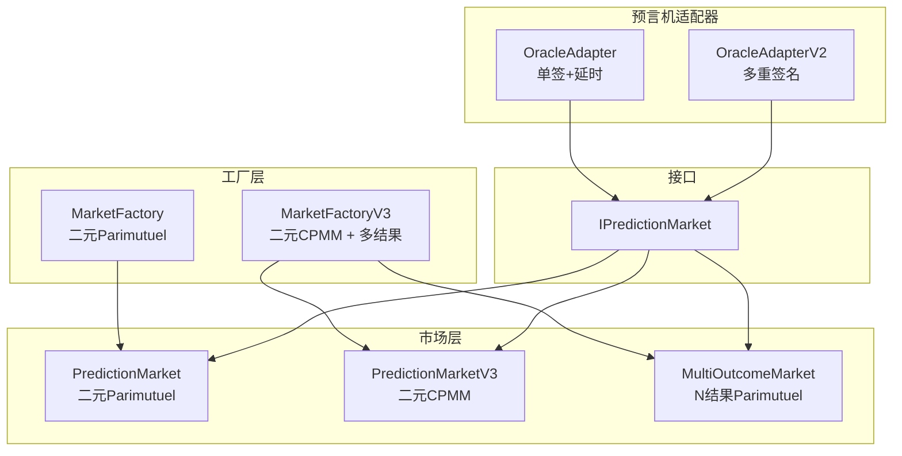
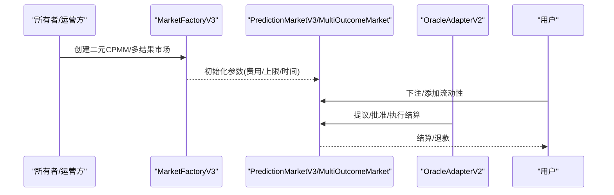
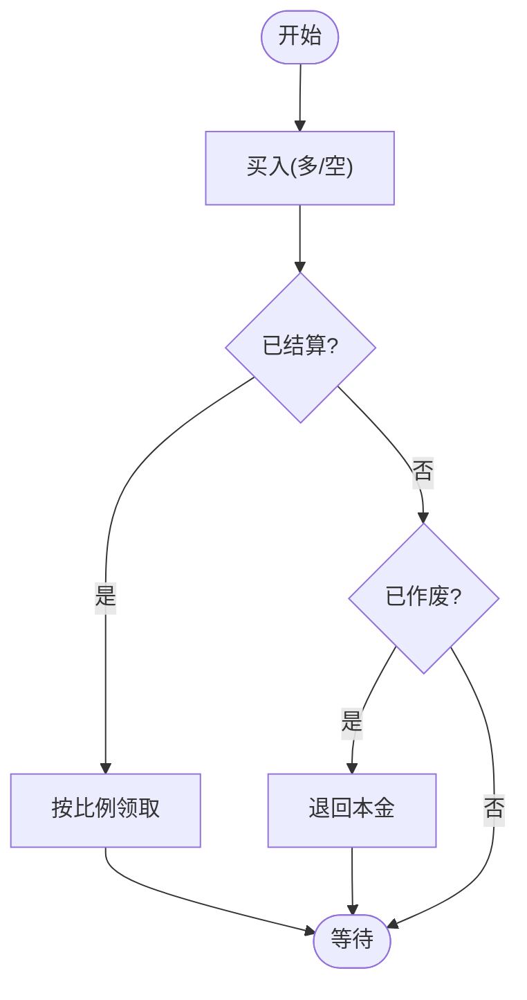
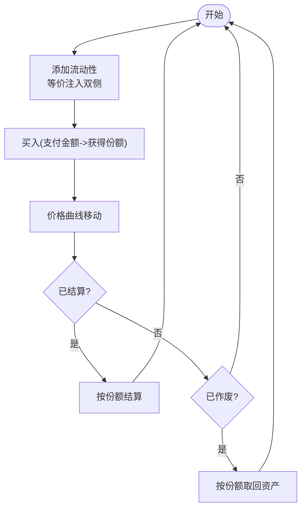
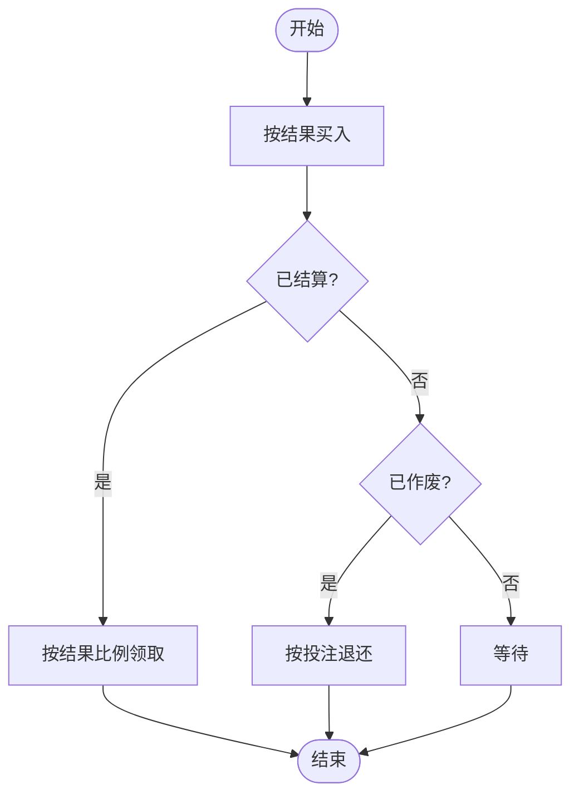
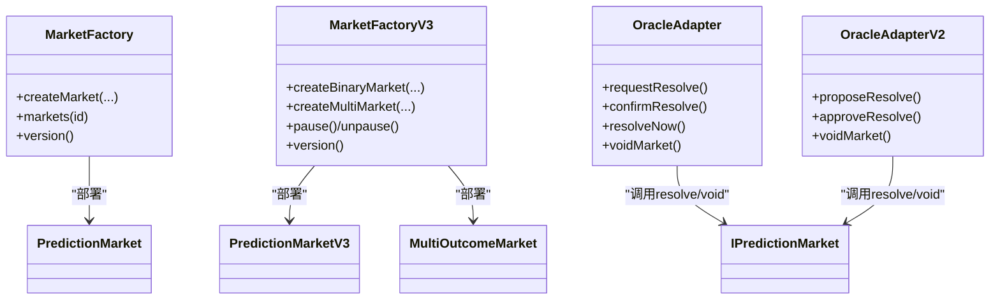
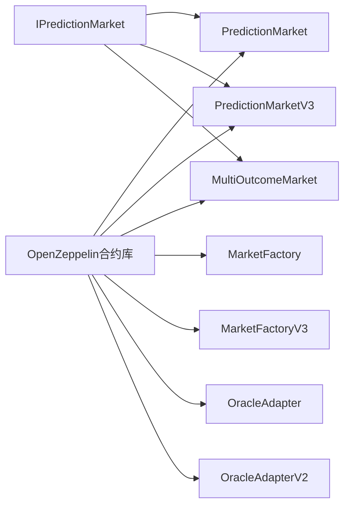
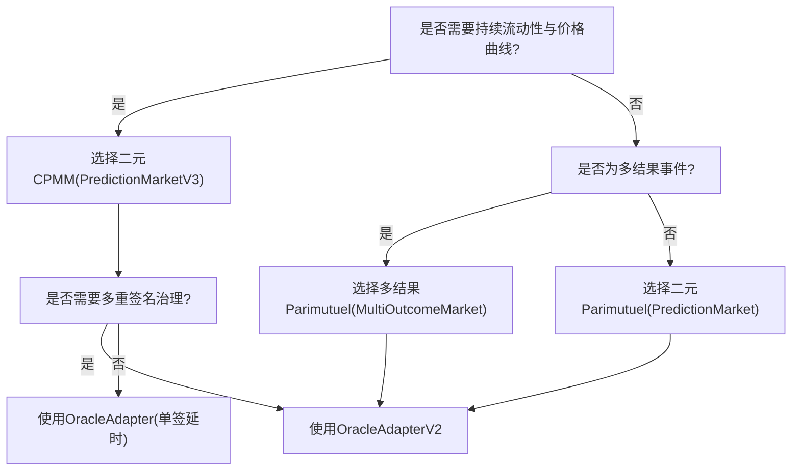

# 机制对比分析

<cite>
**本文引用的文件**
- [contracts/PredictionMarket.sol](file://contracts/PredictionMarket.sol)
- [contracts/PredictionMarketV3.sol](file://contracts/PredictionMarketV3.sol)
- [contracts/MultiOutcomeMarket.sol](file://contracts/MultiOutcomeMarket.sol)
- [contracts/MarketFactory.sol](file://contracts/MarketFactory.sol)
- [contracts/MarketFactoryV3.sol](file://contracts/MarketFactoryV3.sol)
- [contracts/interfaces/IPredictionMarket.sol](file://contracts/interfaces/IPredictionMarket.sol)
- [contracts/OracleAdapter.sol](file://contracts/OracleAdapter.sol)
- [contracts/OracleAdapterV2.sol](file://contracts/OracleAdapterV2.sol)
- [test/PredictionMarket.test.js](file://test/PredictionMarket.test.js)
- [test/MarketFactory.test.js](file://test/MarketFactory.test.js)
- [test/Phase3.test.js](file://test/Phase3.test.js)
- [scripts/deploy.js](file://scripts/deploy.js)
- [package.json](file://package.json)
</cite>

## 目录
1. [引言](#引言)
2. [项目结构](#项目结构)
3. [核心组件](#核心组件)
4. [架构总览](#架构总览)
5. [详细组件分析](#详细组件分析)
6. [依赖关系分析](#依赖关系分析)
7. [性能考量](#性能考量)
8. [故障排查指南](#故障排查指南)
9. [结论](#结论)
10. [附录：决策树与选择指南](#附录决策树与选择指南)

## 引言
本文件面向开发者与产品设计人员，系统性对比三种预测市场机制：二元平分池（Parimutuel）机制、二元CPMM（常数函数做市商）机制以及多结果平分池（Parimutuel）机制。我们将从价格发现、流动性提供、风险控制、适用场景与选择标准、性能指标（Gas消耗、存储开销、执行效率）、对市场深度与价格稳定性的影响、交易成本，以及迁移路径与升级策略等方面进行深入分析与可视化说明。

## 项目结构
该仓库提供了三类市场合约与配套工厂、适配器及测试脚本，形成“工厂-市场-预言机”的分层架构：
- 工厂层：负责部署与配置市场，支持二元Parimutuel与二元CPMM、多结果市场。
- 市场层：实现具体的定价与结算逻辑。
- 预言机适配器层：提供权威决议流程（单签/多重签名），保障可审计与抗篡改。

图表来源
- [contracts/MarketFactory.sol](file://contracts/MarketFactory.sol#L1-L60)
- [contracts/MarketFactoryV3.sol](file://contracts/MarketFactoryV3.sol#L1-L94)
- [contracts/PredictionMarket.sol](file://contracts/PredictionMarket.sol#L1-L134)
- [contracts/PredictionMarketV3.sol](file://contracts/PredictionMarketV3.sol#L1-L200)
- [contracts/MultiOutcomeMarket.sol](file://contracts/MultiOutcomeMarket.sol#L1-L113)
- [contracts/OracleAdapter.sol](file://contracts/OracleAdapter.sol#L1-L83)
- [contracts/OracleAdapterV2.sol](file://contracts/OracleAdapterV2.sol#L1-L83)
- [contracts/interfaces/IPredictionMarket.sol](file://contracts/interfaces/IPredictionMarket.sol#L1-L9)

章节来源
- [contracts/MarketFactory.sol](file://contracts/MarketFactory.sol#L1-L60)
- [contracts/MarketFactoryV3.sol](file://contracts/MarketFactoryV3.sol#L1-L94)
- [contracts/PredictionMarket.sol](file://contracts/PredictionMarket.sol#L1-L134)
- [contracts/PredictionMarketV3.sol](file://contracts/PredictionMarketV3.sol#L1-L200)
- [contracts/MultiOutcomeMarket.sol](file://contracts/MultiOutcomeMarket.sol#L1-L113)
- [contracts/OracleAdapter.sol](file://contracts/OracleAdapter.sol#L1-L83)
- [contracts/OracleAdapterV2.sol](file://contracts/OracleAdapterV2.sol#L1-L83)
- [contracts/interfaces/IPredictionMarket.sol](file://contracts/interfaces/IPredictionMarket.sol#L1-L9)

## 核心组件
- 二元Parimutuel（PredictionMarket）
  - 采用“赢家池/总池”比例结算，无LP，无手续费收入。
  - 适合低频、高确定性事件，强调公平分配。
- 二元CPMM（PredictionMarketV3）
  - 使用恒定乘积做市模型，内置LP份额、手续费、最大单用户下注限制。
  - 适合高频、需要持续流动性的事件。
- 多结果Parimutuel（MultiOutcomeMarket）
  - 支持2–8个结果，统一平分池结算。
  - 适合锦标赛、分组赛等多结果场景。
- 工厂（MarketFactory/MarketFactoryV3）
  - 负责创建市场、设置默认参数、暂停/恢复。
- 预言机适配器（OracleAdapter/OracleAdapterV2）
  - 提供权威决议流程：单签延时或多重签名阈值。

章节来源
- [contracts/PredictionMarket.sol](file://contracts/PredictionMarket.sol#L1-L134)
- [contracts/PredictionMarketV3.sol](file://contracts/PredictionMarketV3.sol#L1-L200)
- [contracts/MultiOutcomeMarket.sol](file://contracts/MultiOutcomeMarket.sol#L1-L113)
- [contracts/MarketFactory.sol](file://contracts/MarketFactory.sol#L1-L60)
- [contracts/MarketFactoryV3.sol](file://contracts/MarketFactoryV3.sol#L1-L94)
- [contracts/OracleAdapter.sol](file://contracts/OracleAdapter.sol#L1-L83)
- [contracts/OracleAdapterV2.sol](file://contracts/OracleAdapterV2.sol#L1-L83)

## 架构总览
下图展示从工厂到市场再到预言机的调用链路与职责边界：

图表来源
- [contracts/MarketFactoryV3.sol](file://contracts/MarketFactoryV3.sol#L37-L88)
- [contracts/PredictionMarketV3.sol](file://contracts/PredictionMarketV3.sol#L92-L111)
- [contracts/MultiOutcomeMarket.sol](file://contracts/MultiOutcomeMarket.sol#L65-L74)
- [contracts/OracleAdapterV2.sol](file://contracts/OracleAdapterV2.sol#L44-L75)

## 详细组件分析

### 二元Parimutuel（PredictionMarket）
- 价格发现
  - 通过“赢家池/总池”比例计算赔付，不直接反映供需曲线。
- 流动性提供
  - 无LP，仅由参与者资金构成池子；深度取决于参与者规模。
- 风险控制
  - 无手续费缓冲；赢家池为零则无法结算。
- 关键数据结构
  - 两池：多/空池；用户余额映射；状态枚举。
- 事件与流程
  - 买入、结算、作废、领取。

图表来源
- [contracts/PredictionMarket.sol](file://contracts/PredictionMarket.sol#L64-L113)

章节来源
- [contracts/PredictionMarket.sol](file://contracts/PredictionMarket.sol#L1-L134)

### 二元CPMM（PredictionMarketV3）
- 价格发现
  - 恒定乘积公式实现价格曲线，买入会推动对手盘价格向中性偏移。
- 流动性提供
  - LP提供双侧储备，获得份额；支持增删流动性。
- 风险控制
  - 手续费归入合约；最大单用户下注限制；重入保护。
- 关键数据结构
  - 双侧储备、LP总量、用户份额、累计下注额、费用收集。
- 事件与流程
  - 买入（含手续费）、添加/移除流动性、查询池状态、结算、作废、领取。

图表来源
- [contracts/PredictionMarketV3.sol](file://contracts/PredictionMarketV3.sol#L113-L135)
- [contracts/PredictionMarketV3.sol](file://contracts/PredictionMarketV3.sol#L178-L188)
- [contracts/PredictionMarketV3.sol](file://contracts/PredictionMarketV3.sol#L190-L198)

章节来源
- [contracts/PredictionMarketV3.sol](file://contracts/PredictionMarketV3.sol#L1-L200)

### 多结果Parimutuel（MultiOutcomeMarket）
- 价格发现
  - 各结果独立池，赢家池/总池比例结算。
- 流动性提供
  - 无LP；深度取决于各结果的投注分布。
- 风险控制
  - 统一手续费；赢家池为空则无法结算。
- 关键数据结构
  - 结果数量、池数组、二维映射（用户->结果->投注额）。
- 事件与流程
  - 买入、结算、作废、领取。

图表来源
- [contracts/MultiOutcomeMarket.sol](file://contracts/MultiOutcomeMarket.sol#L65-L111)

章节来源
- [contracts/MultiOutcomeMarket.sol](file://contracts/MultiOutcomeMarket.sol#L1-L113)

### 工厂与预言机适配器
- 工厂
  - MarketFactory：部署二元Parimutuel市场。
  - MarketFactoryV3：部署二元CPMM与多结果市场，支持暂停/恢复、默认参数。
- 预言机适配器
  - OracleAdapter：单签+延时，支持即时或延时结算。
  - OracleAdapterV2：多重签名阈值，提升治理安全。

图表来源
- [contracts/MarketFactory.sol](file://contracts/MarketFactory.sol#L37-L54)
- [contracts/MarketFactoryV3.sol](file://contracts/MarketFactoryV3.sol#L37-L88)
- [contracts/OracleAdapter.sol](file://contracts/OracleAdapter.sol#L48-L75)
- [contracts/OracleAdapterV2.sol](file://contracts/OracleAdapterV2.sol#L44-L75)
- [contracts/interfaces/IPredictionMarket.sol](file://contracts/interfaces/IPredictionMarket.sol#L4-L8)

章节来源
- [contracts/MarketFactory.sol](file://contracts/MarketFactory.sol#L1-L60)
- [contracts/MarketFactoryV3.sol](file://contracts/MarketFactoryV3.sol#L1-L94)
- [contracts/OracleAdapter.sol](file://contracts/OracleAdapter.sol#L1-L83)
- [contracts/OracleAdapterV2.sol](file://contracts/OracleAdapterV2.sol#L1-L83)
- [contracts/interfaces/IPredictionMarket.sol](file://contracts/interfaces/IPredictionMarket.sol#L1-L9)

## 依赖关系分析
- 组件耦合
  - 市场合约依赖ERC20与安全转账工具；CPMM引入重入保护。
  - 工厂通过接口与市场交互，避免直接耦合具体实现。
  - 预言机适配器通过接口调用市场决议/作废，解耦治理与业务。
- 外部依赖
  - OpenZeppelin库提供访问控制、可暂停、重入保护、安全转账等基础能力。
- 潜在循环依赖
  - 当前结构清晰，未见循环导入。

图表来源
- [contracts/PredictionMarket.sol](file://contracts/PredictionMarket.sol#L4-L10)
- [contracts/PredictionMarketV3.sol](file://contracts/PredictionMarketV3.sol#L4-L10)
- [contracts/MultiOutcomeMarket.sol](file://contracts/MultiOutcomeMarket.sol#L4-L10)
- [contracts/MarketFactory.sol](file://contracts/MarketFactory.sol#L4-L6)
- [contracts/MarketFactoryV3.sol](file://contracts/MarketFactoryV3.sol#L4-L8)
- [contracts/OracleAdapter.sol](file://contracts/OracleAdapter.sol#L4-L5)
- [contracts/OracleAdapterV2.sol](file://contracts/OracleAdapterV2.sol#L4-L5)
- [contracts/interfaces/IPredictionMarket.sol](file://contracts/interfaces/IPredictionMarket.sol#L4-L8)

章节来源
- [contracts/PredictionMarket.sol](file://contracts/PredictionMarket.sol#L1-L134)
- [contracts/PredictionMarketV3.sol](file://contracts/PredictionMarketV3.sol#L1-L200)
- [contracts/MultiOutcomeMarket.sol](file://contracts/MultiOutcomeMarket.sol#L1-L113)
- [contracts/MarketFactory.sol](file://contracts/MarketFactory.sol#L1-L60)
- [contracts/MarketFactoryV3.sol](file://contracts/MarketFactoryV3.sol#L1-L94)
- [contracts/OracleAdapter.sol](file://contracts/OracleAdapter.sol#L1-L83)
- [contracts/OracleAdapterV2.sol](file://contracts/OracleAdapterV2.sol#L1-L83)
- [contracts/interfaces/IPredictionMarket.sol](file://contracts/interfaces/IPredictionMarket.sol#L1-L9)

## 性能考量
- Gas消耗
  - Parimutuel：交易路径短，状态简单，Gas消耗较低。
  - CPMM：涉及池状态更新与手续费计算，Gas略高；添加/移除流动性额外开销。
  - 多结果：池数组长度影响读写成本，结果数越多Gas越高。
- 存储开销
  - Parimutuel：固定两池+用户余额映射，空间小。
  - CPMM：双侧储备、LP份额、用户累计下注等，空间中等。
  - 多结果：池数组长度为结果数，空间随结果数线性增长。
- 执行效率
  - Parimutuel结算为O(1)比例计算。
  - CPMM买卖为恒定乘积更新，O(1)。
  - 多结果结算需遍历赢家池与总池，O(N)。
- 实证参考
  - 测试显示CPMM买入后价格应高于中性（测试断言价格Bps>5000），体现价格曲线生效。

章节来源
- [test/Phase3.test.js](file://test/Phase3.test.js#L6-L27)
- [contracts/PredictionMarket.sol](file://contracts/PredictionMarket.sol#L115-L132)
- [contracts/PredictionMarketV3.sol](file://contracts/PredictionMarketV3.sol#L178-L188)
- [contracts/MultiOutcomeMarket.sol](file://contracts/MultiOutcomeMarket.sol#L92-L99)

## 故障排查指南
- 权限问题
  - 非预言机地址调用结算/作废将被拒绝。
- 状态问题
  - 非开放状态不可买入/结算；已领取不可重复领取。
- 参数问题
  - 结果索引越界、金额为0、超过单用户最大下注等会被拒绝。
- 预言机流程
  - 单签延时：先请求再确认；延时期间不可执行。
  - 多重签名：需达到阈值后方可执行。

章节来源
- [contracts/PredictionMarket.sol](file://contracts/PredictionMarket.sol#L64-L81)
- [contracts/PredictionMarketV3.sol](file://contracts/PredictionMarketV3.sol#L92-L111)
- [contracts/MultiOutcomeMarket.sol](file://contracts/MultiOutcomeMarket.sol#L65-L74)
- [contracts/OracleAdapter.sol](file://contracts/OracleAdapter.sol#L48-L75)
- [contracts/OracleAdapterV2.sol](file://contracts/OracleAdapterV2.sol#L44-L75)

## 结论
- 若追求极简与公平分配且事件确定性强，优先Parimutuel。
- 若需要持续流动性与价格曲线驱动，优先CPMM。
- 若存在多个竞品/结果，优先多结果Parimutuel。
- 在治理与安全性上，建议采用多重签名适配器以降低单点风险。

## 附录：决策树与选择指南
以下为基于仓库现有机制的决策树与选择指南，帮助开发者快速定位合适方案。

图表来源
- [contracts/PredictionMarketV3.sol](file://contracts/PredictionMarketV3.sol#L1-L200)
- [contracts/MultiOutcomeMarket.sol](file://contracts/MultiOutcomeMarket.sol#L1-L113)
- [contracts/PredictionMarket.sol](file://contracts/PredictionMarket.sol#L1-L134)
- [contracts/OracleAdapterV2.sol](file://contracts/OracleAdapterV2.sol#L1-L83)
- [contracts/OracleAdapter.sol](file://contracts/OracleAdapter.sol#L1-L83)

### 迁移路径与升级策略
- 从Phase2到Phase3
  - 使用MarketFactoryV3替代MarketFactory，新增二元CPMM与多结果市场。
  - 将预言机适配器升级至OracleAdapterV2以启用多重签名。
- 运维建议
  - 通过工厂暂停/恢复功能在升级窗口内维护。
  - 逐步引导存量Parimutuel市场迁移至CPMM，利用流动性挖矿与手续费收益增强生态。
- 开发脚手架
  - 使用部署脚本与测试用例验证新机制行为与Gas表现。

章节来源
- [scripts/deploy.js](file://scripts/deploy.js#L1-L57)
- [test/MarketFactory.test.js](file://test/MarketFactory.test.js#L1-L28)
- [test/Phase3.test.js](file://test/Phase3.test.js#L1-L74)
- [package.json](file://package.json#L5-L14)