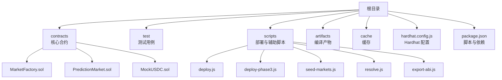
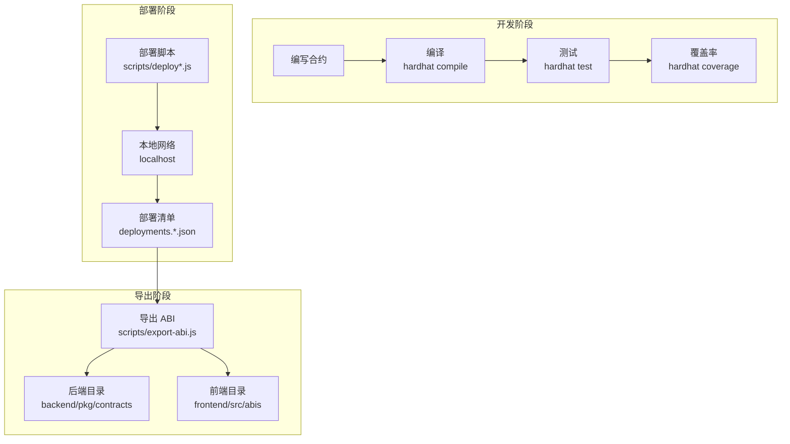
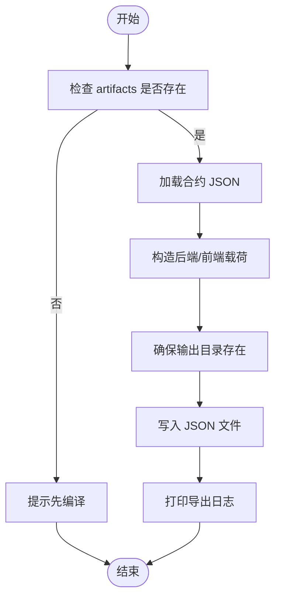
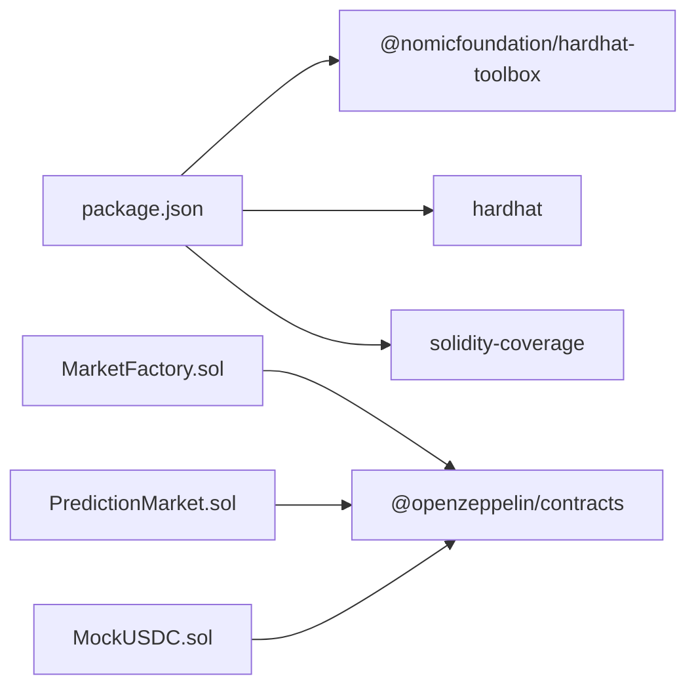

# 开发工具链

<cite>
**本文引用的文件**
- [hardhat.config.js](file://hardhat.config.js)
- [package.json](file://package.json)
- [export-abi.js](file://scripts/export-abi.js)
- [deploy.js](file://scripts/deploy.js)
- [deploy-phase3.js](file://scripts/deploy-phase3.js)
- [seed-markets.js](file://scripts/seed-markets.js)
- [resolve.js](file://scripts/resolve.js)
- [MarketFactory.test.js](file://test/MarketFactory.test.js)
- [MarketFactory.sol](file://contracts/MarketFactory.sol)
- [PredictionMarket.sol](file://contracts/PredictionMarket.sol)
- [MockUSDC.sol](file://contracts/MockUSDC.sol)
- [coverage.json](file://coverage.json)
</cite>

## 目录
1. [简介](#简介)
2. [项目结构](#项目结构)
3. [核心组件](#核心组件)
4. [架构总览](#架构总览)
5. [详细组件分析](#详细组件分析)
6. [依赖分析](#依赖分析)
7. [性能考虑](#性能考虑)
8. [故障排查指南](#故障排查指南)
9. [结论](#结论)
10. [附录](#附录)

## 简介
本指南面向使用 Hardhat 的 Solidity 开发团队，围绕本仓库的工具链进行系统性说明，涵盖以下主题：
- Hardhat 配置文件的关键设置与优化项
- 编译优化、Gas 优化与调试工具的使用
- ABI 导出工具的使用方法与自定义选项
- 开发环境配置与最佳实践
- 代码格式化、静态分析与 linting 的配置思路
- 外部工具与服务的集成方式
- 开发工作流优化与效率提升技巧
- 工具链扩展以满足新开发需求

## 项目结构
该项目采用基于功能模块的组织方式：合约位于 contracts 目录，测试位于 test 目录，部署脚本与辅助脚本位于 scripts 目录；Artifacts、缓存与构建信息由 Hardhat 自动生成。

图表来源
- [hardhat.config.js](file://hardhat.config.js#L1-L30)
- [package.json](file://package.json#L1-L22)
- [MarketFactory.sol](file://contracts/MarketFactory.sol#L1-L60)
- [PredictionMarket.sol](file://contracts/PredictionMarket.sol#L1-L134)
- [MockUSDC.sol](file://contracts/MockUSDC.sol#L1-L18)
- [deploy.js](file://scripts/deploy.js#L1-L57)
- [deploy-phase3.js](file://scripts/deploy-phase3.js#L1-L43)
- [seed-markets.js](file://scripts/seed-markets.js#L1-L34)
- [resolve.js](file://scripts/resolve.js#L1-L20)
- [export-abi.js](file://scripts/export-abi.js#L1-L68)

章节来源
- [hardhat.config.js](file://hardhat.config.js#L1-L30)
- [package.json](file://package.json#L1-L22)

## 核心组件
- Hardhat 配置与网络
  - 使用 @nomicfoundation/hardhat-toolbox 提供默认工具集（含编译器、测试、覆盖率等）
  - 配置了本地网络与 Hardhat 内置网络，便于快速启动与测试
- 合约与工厂模式
  - MarketFactory 负责创建预测市场，继承所有权控制
  - PredictionMarket 实现二元预测市场逻辑，支持买入、结算与认领
  - MockUSDC 作为测试代币，模拟真实稳定币行为
- 测试与覆盖率
  - 使用 Mocha + Chai 进行断言，结合 @nomicfoundation/hardhat-network-helpers 提供时间推进
  - 覆盖率报告生成与可视化
- 部署与辅助脚本
  - deploy.js 与 deploy-phase3.js 分阶段部署核心合约，并输出部署清单
  - seed-markets.js 基于部署清单批量创建市场
  - resolve.js 支持通过环境变量解析市场结果
  - export-abi.js 将 ABI 与字节码导出到后端与前端目录

章节来源
- [MarketFactory.sol](file://contracts/MarketFactory.sol#L1-L60)
- [PredictionMarket.sol](file://contracts/PredictionMarket.sol#L1-L134)
- [MockUSDC.sol](file://contracts/MockUSDC.sol#L1-L18)
- [MarketFactory.test.js](file://test/MarketFactory.test.js#L1-L28)
- [coverage.json](file://coverage.json#L1-L1)

## 架构总览
下图展示了从开发到部署与验证的典型流程，包括编译、测试、覆盖率、部署与 ABI 导出。

图表来源
- [hardhat.config.js](file://hardhat.config.js#L1-L30)
- [package.json](file://package.json#L5-L14)
- [deploy.js](file://scripts/deploy.js#L1-L57)
- [deploy-phase3.js](file://scripts/deploy-phase3.js#L1-L43)
- [seed-markets.js](file://scripts/seed-markets.js#L1-L34)
- [resolve.js](file://scripts/resolve.js#L1-L20)
- [export-abi.js](file://scripts/export-abi.js#L1-L68)

## 详细组件分析

### Hardhat 配置详解
- 版本与优化
  - Solidity 版本固定为 0.8.24，确保兼容性与稳定性
  - 启用编译器优化，runs 参数为 200，适合生产部署场景
  - EVM 版本设置为 cancun，适配最新 EVM 行为
- 网络配置
  - hardhat：内置网络，链 ID 固定为 31337
  - localhost：连接本地节点 URL，链 ID 同样为 31337
- 路径映射
  - 指定源码、测试、缓存与产物目录，便于组织与 CI 集成

章节来源
- [hardhat.config.js](file://hardhat.config.js#L6-L29)

### 编译优化与 Gas 优化
- 编译器优化
  - 在配置中启用 optimizer 并设置 runs=200，可有效降低部署与运行时 Gas 成本
  - 建议在发布前进行多轮 runs 对比，平衡编译时间与 Gas 节省
- 合约层面优化
  - 使用不可变变量存储常量地址，减少运行时读取成本
  - 合理使用访问控制修饰符，避免重复校验
  - 在循环中避免不必要的状态写入，减少 Gas 消耗
- 测试与覆盖率
  - 使用 hardhat coverage 生成覆盖率报告，定位未覆盖路径，指导优化

章节来源
- [hardhat.config.js](file://hardhat.config.js#L8-L12)
- [MarketFactory.sol](file://contracts/MarketFactory.sol#L25-L30)
- [PredictionMarket.sol](file://contracts/PredictionMarket.sol#L64-L81)
- [coverage.json](file://coverage.json#L1-L1)

### 调试工具与最佳实践
- 网络与时间控制
  - 使用 @nomicfoundation/hardhat-network-helpers 提供时间推进能力，便于测试未来事件与到期逻辑
- 断言与事件
  - 使用 Chai 断言与事件监听，确保业务流程正确触发
- 日志与错误处理
  - 在脚本中打印关键信息与错误堆栈，便于定位问题
  - 使用 process.exitCode 控制退出码，利于 CI 集成

章节来源
- [MarketFactory.test.js](file://test/MarketFactory.test.js#L1-L28)

### ABI 导出工具使用指南
- 功能概述
  - 自动扫描 artifacts 中的合约 JSON，提取 ABI 与字节码
  - 输出到后端与前端目录，便于跨端复用
- 使用步骤
  - 先执行编译：npm run compile
  - 执行导出：npm run export-abi
- 自定义选项
  - 可修改 CONTRACTS 列表以包含新增合约
  - 可调整 ARTIFACTS_DIR、BACKEND_DIR、FRONTEND_DIR 以适配项目结构
  - 可选择仅导出 ABI 或同时导出 ABI+字节码

图表来源
- [export-abi.js](file://scripts/export-abi.js#L19-L67)

章节来源
- [export-abi.js](file://scripts/export-abi.js#L1-L68)

### 开发环境配置与最佳实践
- 环境准备
  - 安装依赖：npm install
  - 启动本地节点：npm run node
- 常用脚本
  - 编译：npm run compile
  - 测试：npm run test
  - 覆盖率：npm run coverage
  - 部署：npm run deploy:local
  - 种子数据：npm run seed:local
  - 解析市场：npm run resolve:local
- 最佳实践
  - 使用 .gitignore 忽略 artifacts、cache、部署清单等临时文件
  - 在 CI 中缓存 node_modules，加速构建
  - 将部署参数通过环境变量注入，避免硬编码

章节来源
- [package.json](file://package.json#L5-L14)
- [deploy.js](file://scripts/deploy.js#L1-L57)
- [seed-markets.js](file://scripts/seed-markets.js#L1-L34)
- [resolve.js](file://scripts/resolve.js#L1-L20)

### 代码格式化、静态分析与 Linting
- Solidity 格式化
  - 推荐使用 solhint 或 pretty-ethereum 统一风格
  - 在 CI 中加入格式化检查，确保提交质量
- 静态分析
  - 使用 Slither 或 Mythril 进行安全审计
  - 结合覆盖率与单元测试，形成多层保障
- Linting
  - 在本地配置 pre-commit 钩子，自动执行格式化与基础检查
  - 将规则纳入团队规范，保持一致性

（本节为通用指导，不直接分析具体文件）

### 外部工具与服务集成
- 硬件钱包与签名
  - 可通过 ethers.js Signer 集成硬件钱包，用于高价值交易
- 区块链浏览器与索引
  - 使用 Dune Analytics 或 Subgraphs 订阅事件，便于前端展示
- 持续集成
  - 在 GitHub Actions 中配置编译、测试、覆盖率与部署流水线
- 监控与告警
  - 集成 Tenderly 或 Foundry 火焰图，定位 Gas 高发点

（本节为通用指导，不直接分析具体文件）

### 开发工作流优化与效率提升
- 快速迭代
  - 使用 Hardhat 内置网络进行快速本地回环测试
  - 将常用命令封装为 npm 脚本，减少记忆负担
- 自动化
  - 在本地与 CI 中自动化执行编译、测试与覆盖率
  - 使用脚本批量部署与初始化，减少手工操作
- 文档与规范
  - 为每个模块维护最小可运行示例，便于回归与演示
  - 统一命名与注释规范，降低沟通成本

（本节为通用指导，不直接分析具体文件）

### 工具链扩展建议
- 新增网络
  - 在 networks 中添加主网/测试网配置，设置私钥与 RPC
- 新增脚本
  - 在 scripts 下新增任务脚本，遵循统一的输入输出约定
- 新增工具
  - 引入 Foundry 或 Radix 进行模糊测试，补充传统测试不足
- 新增服务
  - 集成链上存储（如 Arweave 或 IPFS）保存元数据
  - 集成预言机服务（如 Chainlink）以接入真实数据

（本节为通用指导，不直接分析具体文件）

## 依赖分析
- 工具链依赖
  - @nomicfoundation/hardhat-toolbox：提供编译、测试、覆盖率等工具
  - hardhat：核心框架
  - solidity-coverage：覆盖率工具
- 合约依赖
  - OpenZeppelin Contracts：访问控制、ERC20、安全转账等
- 脚本依赖
  - 通过 hre（Hardhat Runtime Environment）访问网络、账户与合约工厂

图表来源
- [package.json](file://package.json#L15-L20)
- [MarketFactory.sol](file://contracts/MarketFactory.sol#L4-L6)
- [PredictionMarket.sol](file://contracts/PredictionMarket.sol#L4-L6)
- [MockUSDC.sol](file://contracts/MockUSDC.sol#L4)

章节来源
- [package.json](file://package.json#L15-L20)
- [MarketFactory.sol](file://contracts/MarketFactory.sol#L4-L6)
- [PredictionMarket.sol](file://contracts/PredictionMarket.sol#L4-L6)
- [MockUSDC.sol](file://contracts/MockUSDC.sol#L4)

## 性能考虑
- 编译优化
  - 合理设置 runs，平衡编译时间与 Gas 成本
  - 使用 EVM 版本匹配目标链特性
- 合约设计
  - 减少状态读写次数，合并相近操作
  - 使用常量与不可变变量，降低运行时开销
- 测试与覆盖率
  - 通过覆盖率报告识别热点路径，针对性优化
  - 在本地网络中进行压力测试，评估 Gas 上限

（本节为通用指导，不直接分析具体文件）

## 故障排查指南
- 编译失败
  - 确认 Solidity 版本与编译器版本一致
  - 清理缓存与 artifacts 后重试
- 测试异常
  - 检查时间推进是否正确，确保事件在预期区块高度触发
  - 校验断言条件与事件参数
- 部署失败
  - 确认本地节点已启动且网络配置正确
  - 检查环境变量是否齐全（如 ORACLE_TIMELOCK_SECONDS、ORACLE_MULTISIG_THRESHOLD）
- ABI 导出失败
  - 确保 artifacts 存在且合约名称与列表一致
  - 检查输出目录权限

章节来源
- [hardhat.config.js](file://hardhat.config.js#L14-L22)
- [deploy.js](file://scripts/deploy.js#L7-L8)
- [deploy-phase3.js](file://scripts/deploy-phase3.js#L7-L8)
- [export-abi.js](file://scripts/export-abi.js#L21-L25)

## 结论
本工具链以 Hardhat 为核心，结合 OpenZeppelin 合约库与覆盖率工具，提供了从编译、测试、部署到 ABI 导出的完整闭环。通过合理的配置与脚本化流程，团队可以高效地完成开发、验证与交付。建议在现有基础上持续引入静态分析与模糊测试，进一步提升安全性与可靠性。

## 附录
- 常用命令速查
  - 编译：npm run compile
  - 测试：npm run test
  - 覆盖率：npm run coverage
  - 本地节点：npm run node
  - 部署本地：npm run deploy:local
  - 种子数据：npm run seed:local
  - 解析市场：npm run resolve:local
  - 导出 ABI：npm run export-abi

章节来源
- [package.json](file://package.json#L5-L14)