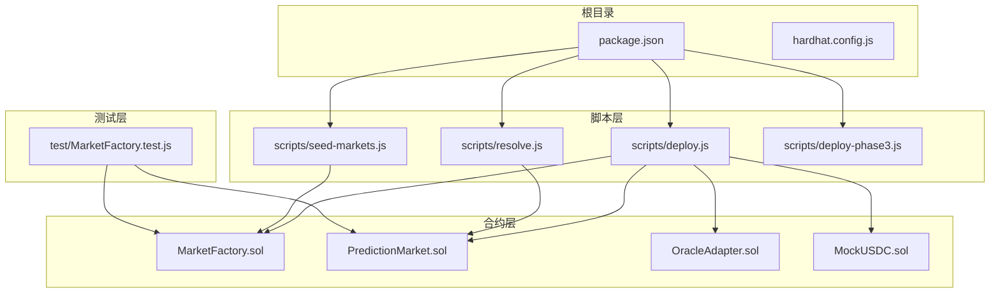
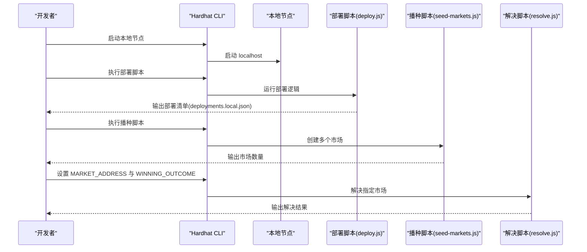
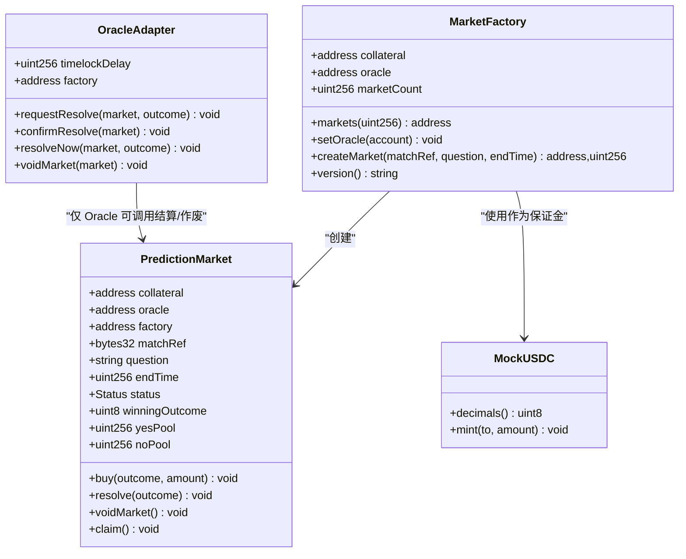
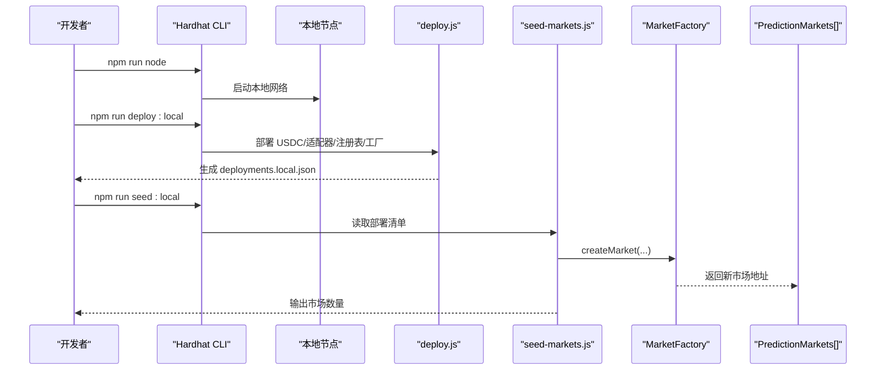
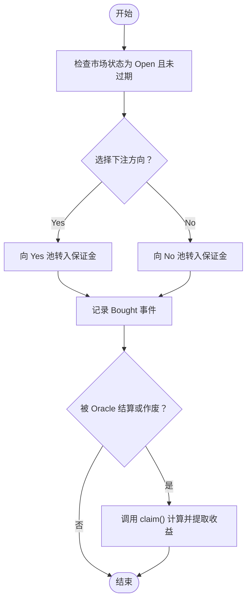
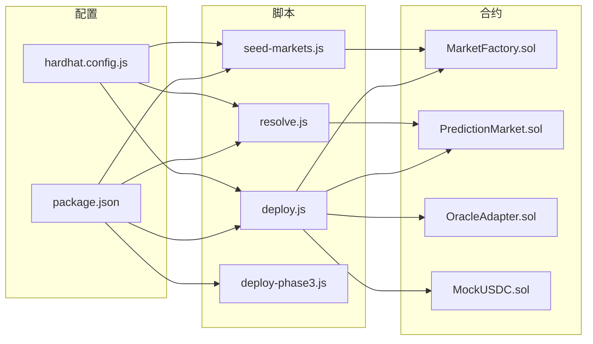

# 快速开始

<cite>
**本文引用的文件**
- [package.json](file://package.json)
- [hardhat.config.js](file://hardhat.config.js)
- [scripts/deploy.js](file://scripts/deploy.js)
- [scripts/seed-markets.js](file://scripts/seed-markets.js)
- [scripts/resolve.js](file://scripts/resolve.js)
- [scripts/deploy-phase3.js](file://scripts/deploy-phase3.js)
- [contracts/MarketFactory.sol](file://contracts/MarketFactory.sol)
- [contracts/PredictionMarket.sol](file://contracts/PredictionMarket.sol)
- [contracts/MockUSDC.sol](file://contracts/MockUSDC.sol)
- [contracts/OracleAdapter.sol](file://contracts/OracleAdapter.sol)
- [test/MarketFactory.test.js](file://test/MarketFactory.test.js)
</cite>

## 目录
1. [简介](#简介)
2. [项目结构](#项目结构)
3. [核心组件](#核心组件)
4. [架构总览](#架构总览)
5. [详细组件分析](#详细组件分析)
6. [依赖关系分析](#依赖关系分析)
7. [性能注意事项](#性能注意事项)
8. [故障排除指南](#故障排除指南)
9. [结论](#结论)
10. [附录](#附录)

## 简介
本指南面向希望快速搭建开发环境并部署首个预测市场的开发者。内容涵盖：
- Node.js 安装与版本要求
- 依赖安装步骤
- Hardhat 配置说明
- 从本地节点启动到合约部署、播种市场、解决市场的完整流程
- 使用提供的脚本进行部署、播种与解决的操作方法
- 基本交互示例：创建市场、下注与提取收益
- 常见问题与故障排除建议

## 项目结构
该仓库采用以“合约层”和“脚本层”为主的组织方式，核心目录如下：
- contracts：Solidity 合约源码，包含市场工厂、预测市场、适配器、DID 注册表等
- scripts：部署与运维脚本，包括部署、播种市场、解决市场等
- test：基于 Hardhat 的测试用例
- artifacts/cache：编译产物与缓存
- 根目录配置：package.json（脚本与依赖）、hardhat.config.js（网络与编译设置）

图表来源
- [package.json](file://package.json#L5-L14)
- [hardhat.config.js](file://hardhat.config.js#L14-L28)
- [scripts/deploy.js](file://scripts/deploy.js#L5-L31)
- [scripts/seed-markets.js](file://scripts/seed-markets.js#L10-L26)
- [scripts/resolve.js](file://scripts/resolve.js#L3-L13)
- [scripts/deploy-phase3.js](file://scripts/deploy-phase3.js#L5-L23)
- [contracts/MarketFactory.sol](file://contracts/MarketFactory.sol#L8-L30)
- [contracts/PredictionMarket.sol](file://contracts/PredictionMarket.sol#L7-L25)
- [contracts/OracleAdapter.sol](file://contracts/OracleAdapter.sol#L7-L18)
- [contracts/MockUSDC.sol](file://contracts/MockUSDC.sol#L6-L16)
- [test/MarketFactory.test.js](file://test/MarketFactory.test.js#L5-L26)

章节来源
- [package.json](file://package.json#L1-L22)
- [hardhat.config.js](file://hardhat.config.js#L1-L30)

## 核心组件
- MarketFactory：负责创建预测市场，管理市场计数与映射，仅所有者可调用
- PredictionMarket：标准二元预测市场（是/否），支持下注、结算与收益提取
- OracleAdapter：为市场提供“时间锁”式的结算与作废能力，通过角色控制
- MockUSDC：测试代币，模拟 USDC（6 位小数），用于下注与结算
- 脚本：deploy.js、seed-markets.js、resolve.js 提供一键部署、播种与解决流程

章节来源
- [contracts/MarketFactory.sol](file://contracts/MarketFactory.sol#L8-L59)
- [contracts/PredictionMarket.sol](file://contracts/PredictionMarket.sol#L7-L134)
- [contracts/OracleAdapter.sol](file://contracts/OracleAdapter.sol#L7-L83)
- [contracts/MockUSDC.sol](file://contracts/MockUSDC.sol#L6-L17)
- [scripts/deploy.js](file://scripts/deploy.js#L5-L51)
- [scripts/seed-markets.js](file://scripts/seed-markets.js#L5-L28)
- [scripts/resolve.js](file://scripts/resolve.js#L3-L14)

## 架构总览
下图展示了从本地网络启动到部署、播种与解决的端到端流程。

图表来源
- [package.json](file://package.json#L8-L13)
- [hardhat.config.js](file://hardhat.config.js#L14-L22)
- [scripts/deploy.js](file://scripts/deploy.js#L5-L51)
- [scripts/seed-markets.js](file://scripts/seed-markets.js#L5-L28)
- [scripts/resolve.js](file://scripts/resolve.js#L3-L14)

## 详细组件分析

### 部署脚本（deploy.js）
- 功能概述
  - 部署 MockUSDC、OracleAdapter、DIDRegistry、MarketFactory
  - 将适配器的工厂地址与 Oracle 角色授权给部署者
  - 为部署者铸造初始代币
  - 写出部署清单（chainId、合约地址、时间锁、部署时间等）
- 关键步骤
  - 获取部署者账户与链 ID
  - 部署 USDC、适配器、注册表、工厂
  - 设置适配器工厂与 Oracle 权限
  - 铸造初始代币
  - 写入 deployments.local.json
- 命令示例
  - 启动本地节点：npm run node
  - 执行部署：npm run deploy:local
- 预期输出
  - 控制台打印部署者地址、各合约地址、时间锁秒数、部署时间
  - 在根目录生成 deployments.local.json

章节来源
- [scripts/deploy.js](file://scripts/deploy.js#L5-L51)
- [package.json](file://package.json#L8-L13)
- [hardhat.config.js](file://hardhat.config.js#L14-L22)

### 种植市场脚本（seed-markets.js）
- 功能概述
  - 读取本地部署清单，获取 MarketFactory 地址
  - 基于种子列表批量创建市场（包含参考标识、问题、结束时间）
- 关键步骤
  - 校验部署清单存在
  - 通过工厂接口调用 createMarket
  - 记录每个市场的创建日志
  - 输出当前市场总数
- 命令示例
  - 执行播种：npm run seed:local
- 预期输出
  - 控制台打印每个已创建的市场信息
  - 输出 marketCount

章节来源
- [scripts/seed-markets.js](file://scripts/seed-markets.js#L5-L28)
- [package.json](file://package.json#L10-L11)

### 解决脚本（resolve.js）
- 功能概述
  - 通过环境变量传入目标市场地址与获胜结果（0/1）
  - 使用 Oracle 账户对市场执行 resolve
- 关键步骤
  - 校验 MARKET_ADDRESS 与 WINNING_OUTCOME
  - 获取 Oracle 账户并连接到市场
  - 调用 resolve 并等待确认
- 命令示例
  - 设置 MARKET_ADDRESS 与 WINNING_OUTCOME 后运行：npm run resolve:local
- 预期输出
  - 控制台打印解决结果

章节来源
- [scripts/resolve.js](file://scripts/resolve.js#L3-L14)
- [package.json](file://package.json#L11-L13)

### 合约组件关系图

图表来源
- [contracts/MarketFactory.sol](file://contracts/MarketFactory.sol#L8-L59)
- [contracts/PredictionMarket.sol](file://contracts/PredictionMarket.sol#L7-L134)
- [contracts/OracleAdapter.sol](file://contracts/OracleAdapter.sol#L7-L83)
- [contracts/MockUSDC.sol](file://contracts/MockUSDC.sol#L6-L17)

### 部署与播种流程时序图

图表来源
- [package.json](file://package.json#L8-L13)
- [scripts/deploy.js](file://scripts/deploy.js#L5-L51)
- [scripts/seed-markets.js](file://scripts/seed-markets.js#L5-L28)
- [contracts/MarketFactory.sol](file://contracts/MarketFactory.sol#L37-L54)

### 下注与提取收益流程图

图表来源
- [contracts/PredictionMarket.sol](file://contracts/PredictionMarket.sol#L64-L113)

## 依赖关系分析
- 脚本依赖
  - package.json 中定义了 npm 脚本，统一通过 Hardhat CLI 运行
  - scripts/* 依赖 hardhat.config.js 中的网络与编译配置
- 合约依赖
  - MarketFactory 依赖 OpenZeppelin Ownable 与 ERC20 接口
  - PredictionMarket 依赖 SafeERC20 与 IERC20
  - OracleAdapter 依赖 AccessControl 与 IPredictionMarket 接口
  - MockUSDC 继承 ERC20 并实现 mint

图表来源
- [package.json](file://package.json#L5-L14)
- [hardhat.config.js](file://hardhat.config.js#L14-L28)
- [scripts/deploy.js](file://scripts/deploy.js#L5-L31)
- [scripts/seed-markets.js](file://scripts/seed-markets.js#L10-L26)
- [scripts/resolve.js](file://scripts/resolve.js#L3-L13)
- [scripts/deploy-phase3.js](file://scripts/deploy-phase3.js#L5-L23)
- [contracts/MarketFactory.sol](file://contracts/MarketFactory.sol#L4-L6)
- [contracts/PredictionMarket.sol](file://contracts/PredictionMarket.sol#L4-L5)
- [contracts/OracleAdapter.sol](file://contracts/OracleAdapter.sol#L4-L5)
- [contracts/MockUSDC.sol](file://contracts/MockUSDC.sol#L4)

章节来源
- [package.json](file://package.json#L1-L22)
- [hardhat.config.js](file://hardhat.config.js#L1-L30)
- [contracts/MarketFactory.sol](file://contracts/MarketFactory.sol#L4-L6)
- [contracts/PredictionMarket.sol](file://contracts/PredictionMarket.sol#L4-L5)
- [contracts/OracleAdapter.sol](file://contracts/OracleAdapter.sol#L4-L5)
- [contracts/MockUSDC.sol](file://contracts/MockUSDC.sol#L4)

## 性能注意事项
- 编译优化
  - Solidity 编译器启用优化器，runs 设为 200，适合本地开发与测试
- EVM 版本
  - 使用 Cancun 版本，确保与最新特性兼容
- 时间锁与批量操作
  - 种植脚本批量创建市场，减少多次交易开销
- 本地网络
  - 使用 localhost 8545，避免外部网络延迟

章节来源
- [hardhat.config.js](file://hardhat.config.js#L7-L13)
- [hardhat.config.js](file://hardhat.config.js#L18-L21)

## 故障排除指南
- 无法找到部署清单
  - 症状：播种脚本报错“请先运行部署脚本”
  - 处理：先执行部署脚本，再执行播种脚本
  - 参考：scripts/seed-markets.js 中的校验逻辑
- 环境变量缺失
  - 症状：解决脚本报错“请设置 MARKET_ADDRESS 与 WINNING_OUTCOME”
  - 处理：在运行前设置 MARKET_ADDRESS 和 WINNING_OUTCOME
  - 参考：scripts/resolve.js 中的校验逻辑
- 合约未部署或地址错误
  - 症状：脚本找不到合约或调用失败
  - 处理：确认 deployments.local.json 是否存在且包含正确地址；重新部署
- 本地节点未启动
  - 症状：npm run deploy:local 报连接失败
  - 处理：先执行 npm run node 启动本地节点
- 测试失败
  - 症状：测试用例不通过
  - 处理：查看 test/MarketFactory.test.js 的断言与前置条件，确保 MockUSDC、OracleAdapter、MarketFactory 正确初始化

章节来源
- [scripts/seed-markets.js](file://scripts/seed-markets.js#L7-L9)
- [scripts/resolve.js](file://scripts/resolve.js#L6-L8)
- [package.json](file://package.json#L8-L13)
- [test/MarketFactory.test.js](file://test/MarketFactory.test.js#L5-L26)

## 结论
通过本指南，您可以在本地快速完成开发环境搭建、部署预测市场合约、播种多个市场，并使用脚本完成市场解决。建议在本地验证后再迁移至测试网或主网，同时结合测试用例与故障排除指南提升稳定性。

## 附录

### 安装与准备
- Node.js
  - 建议使用 LTS 版本（如 v18 或 v20）
  - 安装后可通过命令行验证 node -v 与 npm -v
- 项目依赖
  - 在项目根目录执行安装命令（例如 npm install）
  - 依赖中包含 Hardhat、@nomicfoundation/hardhat-toolbox、OpenZeppelin 合约库等

章节来源
- [package.json](file://package.json#L15-L20)

### 本地开发与部署流程
- 启动本地节点
  - 命令：npm run node
  - 预期输出：显示本地网络监听地址（默认 http://127.0.0.1:8545）
- 执行部署
  - 命令：npm run deploy:local
  - 预期输出：控制台打印部署者地址、各合约地址、时间锁秒数、部署时间；生成 deployments.local.json
- 种植市场
  - 命令：npm run seed:local
  - 预期输出：逐条打印创建的市场信息；最后输出 marketCount
- 解决市场
  - 设置环境变量：MARKET_ADDRESS 与 WINNING_OUTCOME（0/1）
  - 命令：npm run resolve:local
  - 预期输出：控制台打印解决结果

章节来源
- [package.json](file://package.json#L8-L13)
- [scripts/deploy.js](file://scripts/deploy.js#L5-L51)
- [scripts/seed-markets.js](file://scripts/seed-markets.js#L5-L28)
- [scripts/resolve.js](file://scripts/resolve.js#L3-L14)

### 基本交互示例（概念性说明）
- 创建市场
  - 通过 MarketFactory 的 createMarket 方法传入 matchRef、问题与结束时间
  - 工厂返回新市场地址并发出 MarketCreated 事件
- 下注
  - 调用 PredictionMarket.buy，选择 Yes(0)/No(1)，输入金额
  - 合约将相应转入对应池并记录用户余额
- 提取收益
  - 市场被 Oracle 结算后，调用 claim 计算并提取收益
  - 若市场作废，则可提取全部本金

章节来源
- [contracts/MarketFactory.sol](file://contracts/MarketFactory.sol#L37-L54)
- [contracts/PredictionMarket.sol](file://contracts/PredictionMarket.sol#L64-L113)

### 相关脚本与用途对照
- npm run node：启动本地 Hardhat 节点
- npm run deploy:local：部署 MockUSDC、OracleAdapter、DIDRegistry、MarketFactory
- npm run seed:local：根据部署清单播种多个市场
- npm run resolve:local：使用 Oracle 账户解决指定市场
- npm run coverage：运行覆盖率测试
- npm run export-abi：导出 ABI（另有独立脚本）

章节来源
- [package.json](file://package.json#L5-L14)