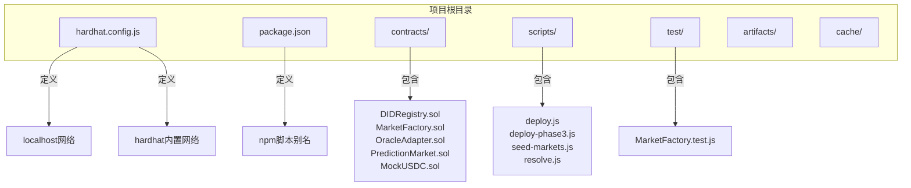
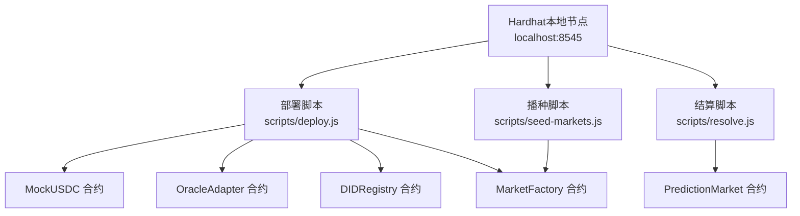
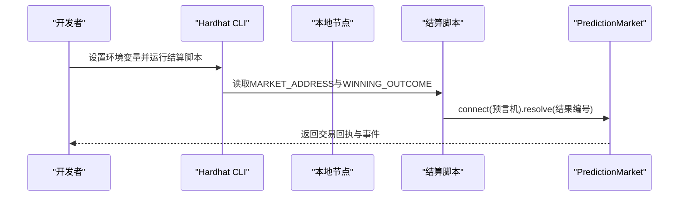
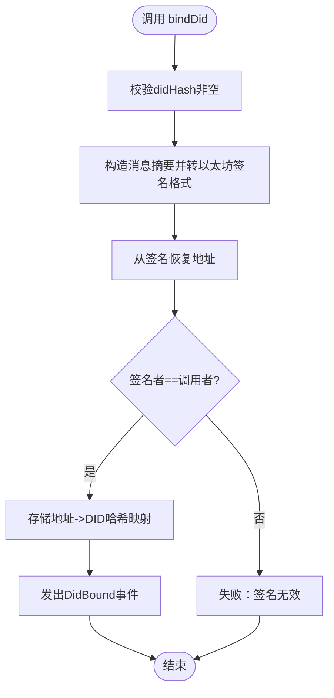
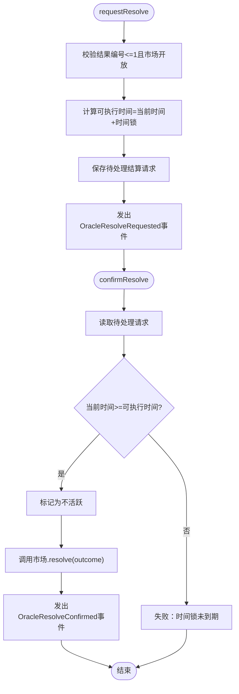
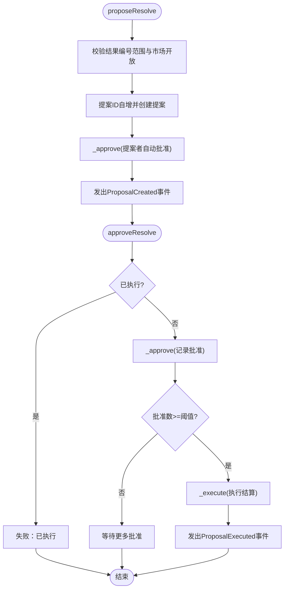
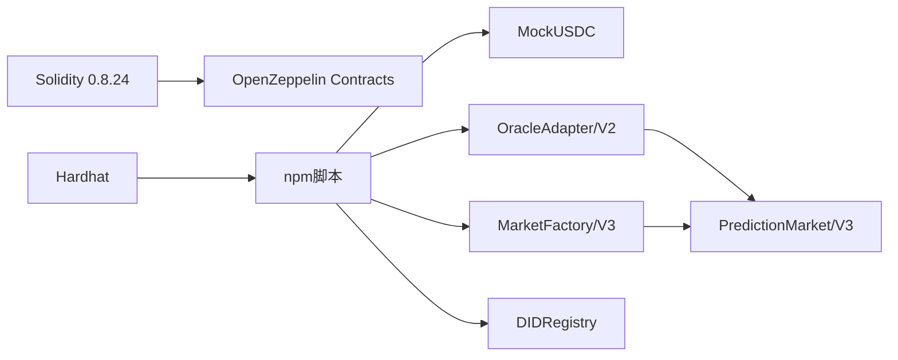

# 快速开始

<cite>
**本文档引用的文件**
- [hardhat.config.js](file://hardhat.config.js)
- [package.json](file://package.json)
- [deploy.js](file://scripts/deploy.js)
- [deploy-phase3.js](file://scripts/deploy-phase3.js)
- [seed-markets.js](file://scripts/seed-markets.js)
- [resolve.js](file://scripts/resolve.js)
- [DIDRegistry.sol](file://contracts/DIDRegistry.sol)
- [MarketFactory.sol](file://contracts/MarketFactory.sol)
- [MockUSDC.sol](file://contracts/MockUSDC.sol)
- [OracleAdapter.sol](file://contracts/OracleAdapter.sol)
- [PredictionMarket.sol](file://contracts/PredictionMarket.sol)
- [OracleAdapterV2.sol](file://contracts/OracleAdapterV2.sol)
- [MarketFactoryV3.sol](file://contracts/MarketFactoryV3.sol)
- [MarketFactory.test.js](file://test/MarketFactory.test.js)
</cite>

## 目录
1. [简介](#简介)
2. [项目结构](#项目结构)
3. [核心组件](#核心组件)
4. [架构总览](#架构总览)
5. [详细组件分析](#详细组件分析)
6. [依赖分析](#依赖分析)
7. [性能考虑](#性能考虑)
8. [故障排除指南](#故障排除指南)
9. [结论](#结论)
10. [附录](#附录)

## 简介
本指南面向希望在30分钟内完成预测市场DID认证系统本地搭建与首次运行的开发者。内容覆盖环境准备、依赖安装、本地节点启动、合约部署、种子市场创建、手动结算以及常见问题排查。文档同时解释Hardhat配置、网络设置与基础合约交互流程，帮助你快速上手。

## 项目结构
该项目采用Hardhat框架组织，核心目录与职责如下：
- contracts：Solidity合约源码，包含DID注册、预言机适配器、市场工厂、预测市场等
- scripts：部署与辅助脚本（部署、播种市场、手动结算、ABI导出）
- test：基于Hardhat Network Helpers的单元测试
- artifacts/cache/coverage：编译产物、缓存与覆盖率报告
- hardhat.config.js：Hardhat配置（编译器、网络、路径）
- package.json：npm脚本与开发依赖

图表来源
- [hardhat.config.js:1-33](file://hardhat.config.js#L1-L33)
- [package.json:1-22](file://package.json#L1-L22)

章节来源
- [hardhat.config.js:1-33](file://hardhat.config.js#L1-L33)
- [package.json:1-22](file://package.json#L1-L22)

## 核心组件
- DID注册表：为用户地址绑定DID哈希，支持签名验证与解析
- 预言机适配器（V1/V2）：负责市场结算/作废的权限控制与时间锁或多签流程
- 市场工厂（V2/V3）：创建二元或多元预测市场，管理默认费用、暂停状态等
- 预测市场（V2/V3）：实现资金池、买卖、结算、作废与奖励领取
- MockUSDC：测试用稳定币（6位精度），便于本地测试

章节来源
- [DIDRegistry.sol:1-39](file://contracts/DIDRegistry.sol#L1-L39)
- [OracleAdapter.sol:1-96](file://contracts/OracleAdapter.sol#L1-L96)
- [OracleAdapterV2.sol:1-95](file://contracts/OracleAdapterV2.sol#L1-L95)
- [MarketFactory.sol:1-68](file://contracts/MarketFactory.sol#L1-L68)
- [MarketFactoryV3.sol:1-104](file://contracts/MarketFactoryV3.sol#L1-L104)
- [PredictionMarket.sol:1-145](file://contracts/PredictionMarket.sol#L1-L145)
- [MockUSDC.sol:1-24](file://contracts/MockUSDC.sol#L1-L24)

## 架构总览
下图展示本地开发与部署的关键交互：本地Hardhat节点提供账户与链环境；部署脚本依次部署MockUSDC、预言机适配器、DID注册表与市场工厂；随后播种市场并进行手动结算。

图表来源
- [hardhat.config.js:17-25](file://hardhat.config.js#L17-L25)
- [deploy.js:6-53](file://scripts/deploy.js#L6-L53)
- [seed-markets.js:6-30](file://scripts/seed-markets.js#L6-L30)
- [resolve.js:4-15](file://scripts/resolve.js#L4-L15)

## 详细组件分析

### 合约交互序列：部署与播种

```mermaid
sequenceDiagram
participant Dev as "开发者"
participant HH as "Hardhat CLI"
participant Node as "本地节点"
participant Script as "部署脚本"
participant USDC as "MockUSDC"
participant AD as "OracleAdapter"
participant REG as "DIDRegistry"
participant FAC as "MarketFactory"
participant Seed as "播种脚本"
Dev->>HH : 运行 npm脚本
HH->>Node : 启动本地节点
HH->>Script : 执行部署
Script->>USDC : 部署MockUSDC
Script->>AD : 部署OracleAdapter(传入管理员与时间锁)
Script->>REG : 部署DIDRegistry
Script->>FAC : 部署MarketFactory(传入USDC与Adapter)
Script->>AD : setFactory(FAC)
Script->>AD : grantOracle(管理员)
Script->>USDC : mint(部署者, 10万单位)
HH->>Seed : 执行播种
Seed->>FAC : createMarket(多个种子市场)
FAC-->>Dev : 返回市场ID与地址
```

图表来源
- [deploy.js:6-53](file://scripts/deploy.js#L6-L53)
- [seed-markets.js:6-30](file://scripts/seed-markets.js#L6-L30)
- [MarketFactory.sol:44-61](file://contracts/MarketFactory.sol#L44-L61)

章节来源
- [deploy.js:6-53](file://scripts/deploy.js#L6-L53)
- [seed-markets.js:6-30](file://scripts/seed-markets.js#L6-L30)
- [MarketFactory.sol:44-61](file://contracts/MarketFactory.sol#L44-L61)

### 合约交互序列：手动结算

图表来源
- [resolve.js:4-15](file://scripts/resolve.js#L4-L15)
- [PredictionMarket.sol:90-97](file://contracts/PredictionMarket.sol#L90-L97)

章节来源
- [resolve.js:4-15](file://scripts/resolve.js#L4-L15)
- [PredictionMarket.sol:90-97](file://contracts/PredictionMarket.sol#L90-L97)

### 关键流程：DID绑定与解析

图表来源
- [DIDRegistry.sol:23-32](file://contracts/DIDRegistry.sol#L23-L32)

章节来源
- [DIDRegistry.sol:23-32](file://contracts/DIDRegistry.sol#L23-L32)

### 关键流程：V1预言机适配器结算（含时间锁）

图表来源
- [OracleAdapter.sol:57-78](file://contracts/OracleAdapter.sol#L57-L78)

章节来源
- [OracleAdapter.sol:57-78](file://contracts/OracleAdapter.sol#L57-L78)

### 关键流程：V2多签适配器提案与执行

图表来源
- [OracleAdapterV2.sol:51-86](file://contracts/OracleAdapterV2.sol#L51-L86)

章节来源
- [OracleAdapterV2.sol:51-86](file://contracts/OracleAdapterV2.sol#L51-L86)

## 依赖分析
- 编译器与EVM：Solidity 0.8.24，EVM Cancun
- 访问控制：OpenZeppelin AccessControl/Ownable
- 代币标准：ERC20（MockUSDC）
- 网络：hardhat与localhost（127.0.0.1:8545）
- 脚本：通过npm脚本封装部署、播种、结算、覆盖率与ABI导出

图表来源
- [hardhat.config.js:10-16](file://hardhat.config.js#L10-L16)
- [package.json:15-20](file://package.json#L15-L20)

章节来源
- [hardhat.config.js:10-16](file://hardhat.config.js#L10-L16)
- [package.json:15-20](file://package.json#L15-L20)

## 性能考虑
- 编译优化：启用优化器并设置合理runs次数，平衡gas与编译时间
- EVM版本：Cancun特性支持更高效的字节码与操作
- 本地网络：hardhat内置网络提供快速回滚与调试能力
- 脚本化：通过脚本批量部署与播种，减少重复操作

## 故障排除指南
- 未找到部署信息文件
  - 现象：播种脚本报错提示先运行部署脚本
  - 处理：先执行部署脚本生成部署信息文件后再播种
  - 参考
    - [seed-markets.js:8-10](file://scripts/seed-markets.js#L8-L10)
- 缺少必要环境变量
  - 现象：结算脚本报错提示设置MARKET_ADDRESS与WINNING_OUTCOME
  - 处理：按要求设置环境变量后重试
  - 参考
    - [resolve.js:7-9](file://scripts/resolve.js#L7-L9)
- 预言机角色缺失
  - 现象：结算或作废失败
  - 处理：确认已授予预言机角色（部署脚本默认授予管理员）
  - 参考
    - [deploy.js:32](file://scripts/deploy.js#L32)
    - [OracleAdapter.sol:52-55](file://contracts/OracleAdapter.sol#L52-L55)
- 市场状态不符
  - 现象：结算或作废要求市场处于开放状态
  - 处理：检查市场状态或等待时间锁到期
  - 参考
    - [OracleAdapter.sol:60](file://contracts/OracleAdapter.sol#L60)
    - [PredictionMarket.sol:90-104](file://contracts/PredictionMarket.sol#L90-L104)
- 本地节点未启动
  - 现象：部署/播种/结算脚本无法连接RPC
  - 处理：先运行本地节点再执行脚本
  - 参考
    - [package.json:8](file://package.json#L8)
    - [hardhat.config.js:21-24](file://hardhat.config.js#L21-L24)

章节来源
- [seed-markets.js:8-10](file://scripts/seed-markets.js#L8-L10)
- [resolve.js:7-9](file://scripts/resolve.js#L7-L9)
- [deploy.js:32](file://scripts/deploy.js#L32)
- [OracleAdapter.sol:52-55](file://contracts/OracleAdapter.sol#L52-L55)
- [OracleAdapter.sol:60](file://contracts/OracleAdapter.sol#L60)
- [PredictionMarket.sol:90-104](file://contracts/PredictionMarket.sol#L90-L104)
- [package.json:8](file://package.json#L8)
- [hardhat.config.js:21-24](file://hardhat.config.js#L21-L24)

## 结论
通过本指南，你可以在本地快速搭建预测市场DID认证系统，完成合约部署、播种市场与手动结算。建议在完成本地验证后，逐步引入多签适配器与V3工厂以体验更丰富的市场形态与治理机制。

## 附录

### 环境要求与安装
- 安装Node.js与npm（推荐使用长期支持版本）
- 在项目根目录安装依赖
  - 命令：npm install
  - 说明：安装Hardhat、OpenZeppelin合约与覆盖率插件
- 启动本地节点
  - 命令：npm run node
  - 说明：启动本地Hardhat节点，监听127.0.0.1:8545

章节来源
- [package.json:15-20](file://package.json#L15-L20)
- [package.json:8](file://package.json#L8)
- [hardhat.config.js:21-24](file://hardhat.config.js#L21-L24)

### 首次部署步骤
- 执行部署脚本
  - 命令：npm run deploy:local
  - 说明：部署MockUSDC、OracleAdapter、DIDRegistry与MarketFactory，并输出部署信息文件
- 查看部署信息
  - 文件：deployments.local.json
  - 内容：包含链ID、合约地址、时间锁等
- 种植种子市场
  - 命令：npm run seed:local
  - 说明：根据配置批量创建预测市场
- 手动结算
  - 命令：MARKET_ADDRESS=... WINNING_OUTCOME=... npm run resolve:local
  - 说明：设置市场地址与获胜结果后执行结算

章节来源
- [package.json:9-11](file://package.json#L9-L11)
- [deploy.js:6-53](file://scripts/deploy.js#L6-L53)
- [seed-markets.js:6-30](file://scripts/seed-markets.js#L6-L30)
- [resolve.js:4-15](file://scripts/resolve.js#L4-L15)

### Hardhat配置要点
- 编译器与优化
  - 版本：0.8.24
  - 优化器：启用，runs=200
  - EVM：Cancun
- 网络
  - hardhat：内置网络，chainId=31337
  - localhost：RPC=http://127.0.0.1:8545，chainId=31337
- 路径
  - sources/tests/cache/artifacts：分别指向contracts/test/cache/artifacts

章节来源
- [hardhat.config.js:10-16](file://hardhat.config.js#L10-L16)
- [hardhat.config.js:17-25](file://hardhat.config.js#L17-L25)
- [hardhat.config.js:26-31](file://hardhat.config.js#L26-L31)

### 基础合约交互方法
- 部署相关
  - 部署MockUSDC：调用mint向账户铸币
  - 部署OracleAdapter：构造函数传入管理员与时间锁
  - 部署MarketFactory：构造函数传入USDC与Adapter
- 市场相关
  - 创建市场：MarketFactory.createMarket
  - 下注：PredictionMarket.buy
  - 结算：OracleAdapter.requestResolve/confirmResolve 或直接resolve（V1时间锁为0时）
  - 作废：OracleAdapter.voidMarket
  - 领取奖励：PredictionMarket.claim
- DID相关
  - 绑定：DIDRegistry.bindDid(didHash, signature)
  - 解析：DIDRegistry.resolveDid(account)

章节来源
- [MockUSDC.sol:20-22](file://contracts/MockUSDC.sol#L20-L22)
- [OracleAdapter.sol:36-40](file://contracts/OracleAdapter.sol#L36-L40)
- [MarketFactory.sol:44-61](file://contracts/MarketFactory.sol#L44-L61)
- [PredictionMarket.sol:71-88](file://contracts/PredictionMarket.sol#L71-L88)
- [OracleAdapter.sol:57-78](file://contracts/OracleAdapter.sol#L57-L78)
- [OracleAdapter.sol:89-94](file://contracts/OracleAdapter.sol#L89-L94)
- [PredictionMarket.sol:106-123](file://contracts/PredictionMarket.sol#L106-L123)
- [DIDRegistry.sol:23-32](file://contracts/DIDRegistry.sol#L23-L32)
- [DIDRegistry.sol:35-37](file://contracts/DIDRegistry.sol#L35-L37)

### 测试参考
- MarketFactory测试：验证创建市场事件、市场计数与问题字段
- 网络时间助手：可用于推进时间或冻结时间以验证时间锁

章节来源
- [MarketFactory.test.js:1-31](file://test/MarketFactory.test.js#L1-L31)