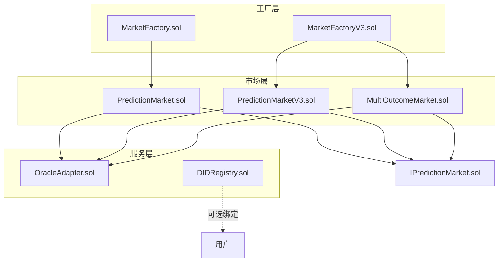
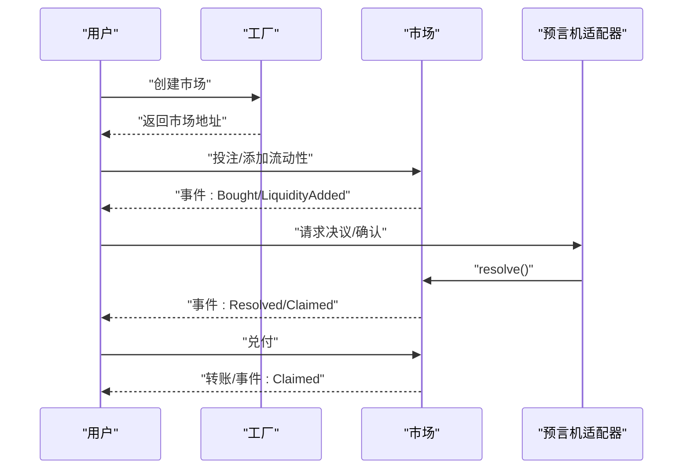
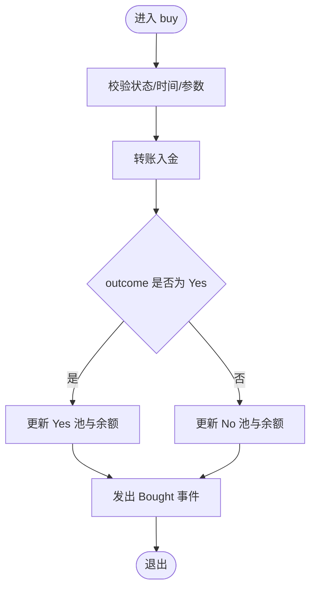
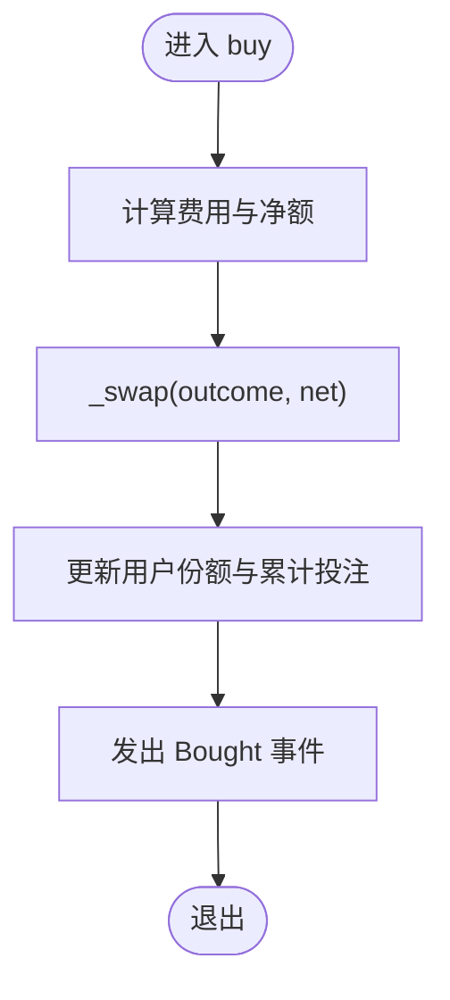
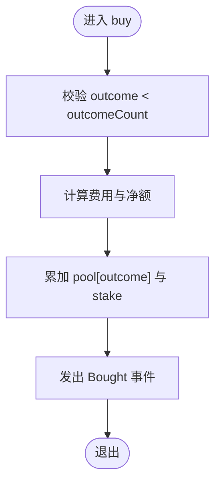
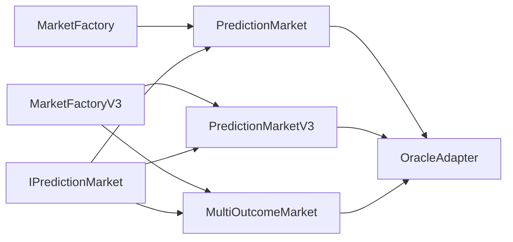

# 性能优化

<cite>
**本文引用的文件**
- [PredictionMarket.sol](file://contracts/contracts/PredictionMarket.sol)
- [PredictionMarketV3.sol](file://contracts/contracts/PredictionMarketV3.sol)
- [MultiOutcomeMarket.sol](file://contracts/contracts/MultiOutcomeMarket.sol)
- [MarketFactory.sol](file://contracts/contracts/MarketFactory.sol)
- [MarketFactoryV3.sol](file://contracts/contracts/MarketFactoryV3.sol)
- [OracleAdapter.sol](file://contracts/contracts/OracleAdapter.sol)
- [DIDRegistry.sol](file://contracts/contracts/DIDRegistry.sol)
- [IPredictionMarket.sol](file://contracts/contracts/interfaces/IPredictionMarket.sol)
- [hardhat.config.js](file://contracts/hardhat.config.js)
- [package.json](file://contracts/package.json)
- [PredictionMarket.test.js](file://contracts/test/PredictionMarket.test.js)
- [deploy.js](file://contracts/scripts/deploy.js)
- [coverage.json](file://contracts/coverage.json)
</cite>

## 目录
1. [引言](#引言)
2. [项目结构](#项目结构)
3. [核心组件](#核心组件)
4. [架构总览](#架构总览)
5. [详细组件分析](#详细组件分析)
6. [依赖关系分析](#依赖关系分析)
7. [性能考量与优化建议](#性能考量与优化建议)
8. [故障排查指南](#故障排查指南)
9. [结论](#结论)
10. [附录：基准测试与监控](#附录基准测试与监控)

## 引言
本指南聚焦于该预测市场合约代码库的性能优化，围绕以下目标展开：
- 分析Gas消耗模式与优化机会
- 存储优化策略与数据结构设计
- 计算复杂度分析与优化方法
- 具体Gas优化技术与最佳实践
- 合约执行时间与存储成本优化
- 基准测试方法、工具与监控手段
- 扩展性与可伸缩性设计
- 平衡性能与安全性的策略

## 项目结构
该项目采用按功能模块划分的组织方式，核心由“工厂”“市场”“预言机适配器”“注册表”等模块组成，并通过OpenZeppelin库复用安全、通用的基础设施。

图表来源
- [MarketFactory.sol](file://contracts/contracts/MarketFactory.sol#L1-L60)
- [MarketFactoryV3.sol](file://contracts/contracts/MarketFactoryV3.sol#L1-L94)
- [PredictionMarket.sol](file://contracts/contracts/PredictionMarket.sol#L1-L134)
- [PredictionMarketV3.sol](file://contracts/contracts/PredictionMarketV3.sol#L1-L200)
- [MultiOutcomeMarket.sol](file://contracts/contracts/MultiOutcomeMarket.sol#L1-L113)
- [OracleAdapter.sol](file://contracts/contracts/OracleAdapter.sol#L1-L83)
- [DIDRegistry.sol](file://contracts/contracts/DIDRegistry.sol#L1-L34)
- [IPredictionMarket.sol](file://contracts/contracts/interfaces/IPredictionMarket.sol#L1-L9)

章节来源
- [MarketFactory.sol](file://contracts/contracts/MarketFactory.sol#L1-L60)
- [MarketFactoryV3.sol](file://contracts/contracts/MarketFactoryV3.sol#L1-L94)
- [PredictionMarket.sol](file://contracts/contracts/PredictionMarket.sol#L1-L134)
- [PredictionMarketV3.sol](file://contracts/contracts/PredictionMarketV3.sol#L1-L200)
- [MultiOutcomeMarket.sol](file://contracts/contracts/MultiOutcomeMarket.sol#L1-L113)
- [OracleAdapter.sol](file://contracts/contracts/OracleAdapter.sol#L1-L83)
- [DIDRegistry.sol](file://contracts/contracts/DIDRegistry.sol#L1-L34)
- [IPredictionMarket.sol](file://contracts/contracts/interfaces/IPredictionMarket.sol#L1-L9)

## 核心组件
- 工厂（MarketFactory/MarketFactoryV3）：负责部署与管理市场实例，支持二元市场与多结果市场；V3引入暂停机制与默认参数。
- 市场（PredictionMarket/PredictionMarketV3/MultiOutcomeMarket）：实现投注、流动性、结算与兑付逻辑；V3引入CPMM与费用。
- 预言机适配器（OracleAdapter）：提供带延时的决议流程，避免即时操纵；支持快速路径（延时为0）。
- 注册表（DIDRegistry）：可选的DID哈希绑定，便于链上身份关联。
- 接口（IPredictionMarket）：统一市场能力接口，便于适配不同版本。

章节来源
- [MarketFactory.sol](file://contracts/contracts/MarketFactory.sol#L1-L60)
- [MarketFactoryV3.sol](file://contracts/contracts/MarketFactoryV3.sol#L1-L94)
- [PredictionMarket.sol](file://contracts/contracts/PredictionMarket.sol#L1-L134)
- [PredictionMarketV3.sol](file://contracts/contracts/PredictionMarketV3.sol#L1-L200)
- [MultiOutcomeMarket.sol](file://contracts/contracts/MultiOutcomeMarket.sol#L1-L113)
- [OracleAdapter.sol](file://contracts/contracts/OracleAdapter.sol#L1-L83)
- [DIDRegistry.sol](file://contracts/contracts/DIDRegistry.sol#L1-L34)
- [IPredictionMarket.sol](file://contracts/contracts/interfaces/IPredictionMarket.sol#L1-L9)

## 架构总览
下图展示从用户到市场的调用链路及关键状态变更点，有助于定位Gas热点与潜在瓶颈。

图表来源
- [MarketFactoryV3.sol](file://contracts/contracts/MarketFactoryV3.sol#L37-L66)
- [PredictionMarketV3.sol](file://contracts/contracts/PredictionMarketV3.sol#L92-L111)
- [OracleAdapter.sol](file://contracts/contracts/OracleAdapter.sol#L48-L67)

## 详细组件分析

### PredictionMarket（二元市场）
- 数据结构
  - 状态枚举：Open/Resolved/Voided
  - 资产池：yesPool/noPool
  - 用户余额映射：yesBalance/noBalance/claimed
- 关键流程
  - 投注：校验状态与时间，转账入金，更新对应池与余额
  - 决议：仅预言机可调用，设置胜出方向
  - 兑付：根据parimutuel规则计算，或在作废时退回全部
- 复杂度与Gas
  - 投注/兑付均为O(1)，读写固定槽位
  - 兑付分支选择影响Gas，Resolved路径包含除法与乘法
- 优化要点
  - 将常量查询缓存至本地变量，减少重复SLOAD
  - 在Resolved路径中优先检查零值，尽早返回
  - 使用SafeERC20减少回退风险与额外开销

图表来源
- [PredictionMarket.sol](file://contracts/contracts/PredictionMarket.sol#L64-L81)

章节来源
- [PredictionMarket.sol](file://contracts/contracts/PredictionMarket.sol#L1-L134)

### PredictionMarketV3（二元CPMM + 流动性）
- 数据结构
  - reserves: reserveYes/reserveNo
  - LP: totalLPSupply/lpBalance
  - 用户：yesBalance/noBalance/userBetTotal/claimed
  - feeBps/maxBetPerUser
- 关键流程
  - 投注：收取费用，计算份额，更新reserve与用户份额
  - 添加/移除流动性：按比例增减reserve与LP份额
  - 决议/作废/兑付：与Resolved/Voided分支一致
- 复杂度与Gas
  - swap/claim为O(1)，但涉及多次除法与乘法
  - addLiquidity/removeLiquidity为O(1)
- 优化要点
  - 将net金额与fee提前计算并缓存
  - 在removeLiquidity中先计算再扣减，避免中间态溢出
  - 控制maxBetPerUser以降低批量兑付时的循环成本

图表来源
- [PredictionMarketV3.sol](file://contracts/contracts/PredictionMarketV3.sol#L92-L111)
- [PredictionMarketV3.sol](file://contracts/contracts/PredictionMarketV3.sol#L178-L188)

章节来源
- [PredictionMarketV3.sol](file://contracts/contracts/PredictionMarketV3.sol#L1-L200)

### MultiOutcomeMarket（多结果市场）
- 数据结构
  - pool数组：按结果索引维护池
  - stake映射：用户在各结果上的投注
- 关键流程
  - 投注：按结果索引累加池与用户份额
  - 兑付：遍历pool求总量，按胜出结果计算
- 复杂度与Gas
  - 兑付包含循环，复杂度O(N)，N为结果数（2-8）
  - 循环内读取多个storage槽，增加Gas
- 优化要点
  - 限制outcomeCount范围，确保上限可控
  - 在resolve前预计算totalPool，兑付时直接使用
  - 若结果数较多，考虑分批处理或外部聚合

图表来源
- [MultiOutcomeMarket.sol](file://contracts/contracts/MultiOutcomeMarket.sol#L65-L74)

章节来源
- [MultiOutcomeMarket.sol](file://contracts/contracts/MultiOutcomeMarket.sol#L1-L113)

### MarketFactory 与 MarketFactoryV3
- 职责
  - 创建市场实例，维护市场映射与类型
  - V3新增暂停控制、默认费用与最大投注限制
- 性能关注
  - 部署成本主要来自新合约创建与初始化
  - 暂停机制可避免在异常情况下产生额外Gas消耗

章节来源
- [MarketFactory.sol](file://contracts/contracts/MarketFactory.sol#L1-L60)
- [MarketFactoryV3.sol](file://contracts/contracts/MarketFactoryV3.sol#L1-L94)

### OracleAdapter（预言机适配器）
- 职责
  - 提供延时决议与作废流程，防止短期操纵
  - 支持快速路径（延时为0）用于测试或特定场景
- 性能关注
  - 请求与确认分离，避免单次调用中执行过多逻辑
  - 使用AccessControl角色控制，减少不必要的权限检查开销

章节来源
- [OracleAdapter.sol](file://contracts/contracts/OracleAdapter.sol#L1-L83)

### DIDRegistry（可选注册表）
- 职责
  - 绑定用户与DID哈希，便于链上身份验证
- 性能关注
  - 读操作O(1)，写操作O(1)，对Gas影响较小
  - 仅在需要身份绑定时启用

章节来源
- [DIDRegistry.sol](file://contracts/contracts/DIDRegistry.sol#L1-L34)

## 依赖关系分析
- 组件耦合
  - 市场依赖工厂与预言机适配器；工厂负责生命周期管理
  - 多结果市场与二元市场共享接口IPredictionMarket，便于统一接入
- 外部依赖
  - OpenZeppelin库提供安全的ERC20转账、访问控制、重入保护等
- 潜在环依赖
  - 当前未见直接环依赖；通过接口与工厂间接耦合

图表来源
- [PredictionMarket.sol](file://contracts/contracts/PredictionMarket.sol#L1-L134)
- [PredictionMarketV3.sol](file://contracts/contracts/PredictionMarketV3.sol#L1-L200)
- [MultiOutcomeMarket.sol](file://contracts/contracts/MultiOutcomeMarket.sol#L1-L113)
- [MarketFactory.sol](file://contracts/contracts/MarketFactory.sol#L1-L60)
- [MarketFactoryV3.sol](file://contracts/contracts/MarketFactoryV3.sol#L1-L94)
- [IPredictionMarket.sol](file://contracts/contracts/interfaces/IPredictionMarket.sol#L1-L9)

## 性能考量与优化建议

### Gas消耗模式与热点
- 投注（PredictionMarket）：固定槽位写入，Gas稳定；Resolved路径包含除法运算
- 投注（PredictionMarketV3）：除法/乘法较多，swap与fee计算为Gas主项
- 多结果兑付（MultiOutcomeMarket）：兑付时循环读取多个池，Gas随结果数线性增长
- 兑付（所有版本）：分支判断与条件检查会带来额外Gas
- 预言机流程（OracleAdapter）：请求与确认分离，避免单次调用过大

章节来源
- [PredictionMarket.sol](file://contracts/contracts/PredictionMarket.sol#L64-L132)
- [PredictionMarketV3.sol](file://contracts/contracts/PredictionMarketV3.sol#L92-L198)
- [MultiOutcomeMarket.sol](file://contracts/contracts/MultiOutcomeMarket.sol#L65-L111)
- [OracleAdapter.sol](file://contracts/contracts/OracleAdapter.sol#L48-L75)

### 存储优化策略与数据结构设计
- 固化字段布局
  - 将不变或低频变更字段置于合约前部，利用SSTORE压缩
- 映射与数组
  - 使用映射替代稀疏数组，减少读写成本
  - 多结果市场使用固定长度数组，避免动态扩容
- 状态压缩
  - 将布尔标志与小整型打包至同一slot（需谨慎以避免边界问题）
- 读写分离
  - 先读取再写入，减少重复SLOAD
  - 对可能为0的中间值进行早返回，避免无效写入

章节来源
- [PredictionMarket.sol](file://contracts/contracts/PredictionMarket.sol#L29-L37)
- [PredictionMarketV3.sol](file://contracts/contracts/PredictionMarketV3.sol#L26-L35)
- [MultiOutcomeMarket.sol](file://contracts/contracts/MultiOutcomeMarket.sol#L25-L27)

### 计算复杂度分析与优化
- PredictionMarket
  - 投注/兑付：O(1)，优化重点在减少分支与除法次数
- PredictionMarketV3
  - swap/claim：O(1)，注意除零与溢出检查的成本
- MultiOutcomeMarket
  - 兑付：O(N)，建议在resolve前汇总totalPool，兑付时直接使用
- 通用优化
  - 缓存全局状态到局部变量，减少SLOAD
  - 条件短路与早返回，避免无谓计算

章节来源
- [PredictionMarket.sol](file://contracts/contracts/PredictionMarket.sol#L115-L132)
- [PredictionMarketV3.sol](file://contracts/contracts/PredictionMarketV3.sol#L178-L198)
- [MultiOutcomeMarket.sol](file://contracts/contracts/MultiOutcomeMarket.sol#L89-L111)

### 具体Gas优化技术与最佳实践
- 使用非重入保护
  - 在所有状态修改函数上启用nonReentrant，避免重复计算与回退
- 安全转账
  - 使用SafeERC20的safeTransferFrom/safeTransfer，减少回退开销
- 早期返回
  - 在可能为0或非法输入时立即返回，避免后续昂贵操作
- 除法与乘法顺序
  - 先乘后除，尽量避免大数除法；必要时使用近似或定点运算
- 事件与日志
  - 合理使用事件，避免在事件中进行复杂计算

章节来源
- [PredictionMarket.sol](file://contracts/contracts/PredictionMarket.sol#L64-L81)
- [PredictionMarketV3.sol](file://contracts/contracts/PredictionMarketV3.sol#L92-L111)
- [MultiOutcomeMarket.sol](file://contracts/contracts/MultiOutcomeMarket.sol#L65-L74)

### 执行时间与存储成本优化
- 批量操作
  - 在工厂层集中初始化与播种，减少单次调用中的存储写入次数
- 存储播种
  - V3通过seedReserves一次性播种，避免多次写入
- 用户限额
  - 设置maxBetPerUser，限制兑付时的循环与计算

章节来源
- [PredictionMarketV3.sol](file://contracts/contracts/PredictionMarketV3.sol#L76-L90)
- [MarketFactoryV3.sol](file://contracts/contracts/MarketFactoryV3.sol#L37-L66)

### 扩展性与可伸缩性设计
- 结果数上限
  - MultiOutcomeMarket限制2-8个结果，避免无限循环带来的Gas爆炸
- 版本演进
  - 通过接口IPredictionMarket抽象，允许不同实现共存与迁移
- 暂停机制
  - MarketFactoryV3引入Pausable，在紧急情况下停止交易，保护系统

章节来源
- [MultiOutcomeMarket.sol](file://contracts/contracts/MultiOutcomeMarket.sol#L48-L58)
- [IPredictionMarket.sol](file://contracts/contracts/interfaces/IPredictionMarket.sol#L1-L9)
- [MarketFactoryV3.sol](file://contracts/contracts/MarketFactoryV3.sol#L31-L32)

### 平衡性能与安全性
- 重入保护与权限控制
  - ReentrancyGuard与AccessControl共同保障状态一致性与调用安全
- 时间锁与延迟
  - OracleAdapter的时间锁机制降低短期攻击面，同时保持可审计性
- 最小权限原则
  - 仅授权必要账户进行resolve/void，减少误操作与滥用

章节来源
- [PredictionMarketV3.sol](file://contracts/contracts/PredictionMarketV3.sol#L9)
- [OracleAdapter.sol](file://contracts/contracts/OracleAdapter.sol#L30-L34)
- [MarketFactoryV3.sol](file://contracts/contracts/MarketFactoryV3.sol#L31-L32)

## 故障排查指南
- 常见错误与定位
  - “not open/ended”：检查市场状态与结束时间
  - “invalid outcome/zero amount”：核对输入参数与边界条件
  - “already claimed/nothing to claim”：确认兑付分支与状态
  - “not oracle”：核对调用者权限与角色授予
- 单元测试参考
  - 测试覆盖了基本购买、兑付、作废与权限校验，可作为回归基准

章节来源
- [PredictionMarket.test.js](file://contracts/test/PredictionMarket.test.js#L34-L68)
- [PredictionMarket.sol](file://contracts/contracts/PredictionMarket.sol#L64-L113)
- [PredictionMarketV3.sol](file://contracts/contracts/PredictionMarketV3.sol#L92-L165)
- [MultiOutcomeMarket.sol](file://contracts/contracts/MultiOutcomeMarket.sol#L65-L111)
- [OracleAdapter.sol](file://contracts/contracts/OracleAdapter.sol#L48-L81)

## 结论
本项目在功能层面已具备清晰的性能边界：二元市场与V3 CPMM的Gas消耗主要集中在除法与转账；多结果市场受结果数影响较大。通过合理的数据结构设计、状态缓存、早返回与权限控制，可在不牺牲安全性的前提下显著降低Gas成本并提升吞吐。建议在生产部署前完成基准测试与压力测试，并持续监控关键指标。

## 附录：基准测试与监控

### 基准测试方法与工具
- 编译与优化配置
  - 启用Solidity优化器，设置合理runs次数；选择合适的EVM版本
- 测试脚本
  - 使用Hardhat与Chai编写测试，覆盖不同路径与边界条件
- 部署与种子脚本
  - 通过脚本批量部署与播种，模拟真实使用场景

章节来源
- [hardhat.config.js](file://contracts/hardhat.config.js#L7-L13)
- [package.json](file://contracts/package.json#L5-L14)
- [deploy.js](file://contracts/scripts/deploy.js#L1-L57)
- [PredictionMarket.test.js](file://contracts/test/PredictionMarket.test.js#L1-L70)

### 覆盖率与质量度量
- 使用solidity-coverage生成覆盖率报告，识别未覆盖路径
- 结合测试用例评估关键分支的触发概率

章节来源
- [package.json](file://contracts/package.json#L19-L19)
- [coverage.json](file://contracts/coverage.json#L1-L1)

### 监控与分析建议
- 区块链浏览器与链上指标
  - 关注关键事件的Gas消耗分布与失败率
- 日志与链上追踪
  - 通过事件与状态变化追踪用户行为与系统负载
- 运行时参数调整
  - 动态调节maxBetPerUser、feeBps与暂停开关，以应对不同市场阶段

章节来源
- [MarketFactoryV3.sol](file://contracts/contracts/MarketFactoryV3.sol#L35-L36)
- [PredictionMarketV3.sol](file://contracts/contracts/PredictionMarketV3.sol#L20-L21)