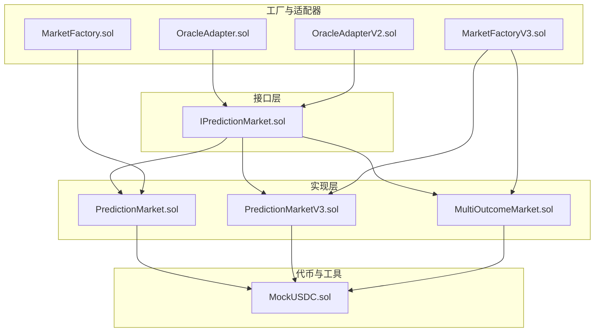
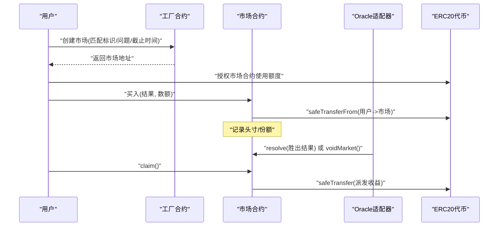
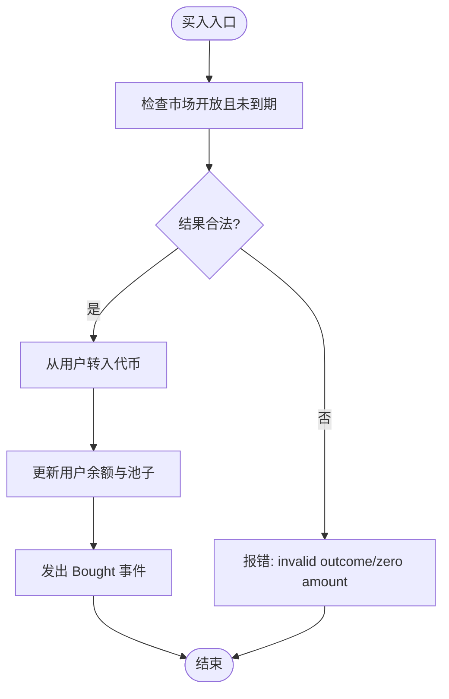
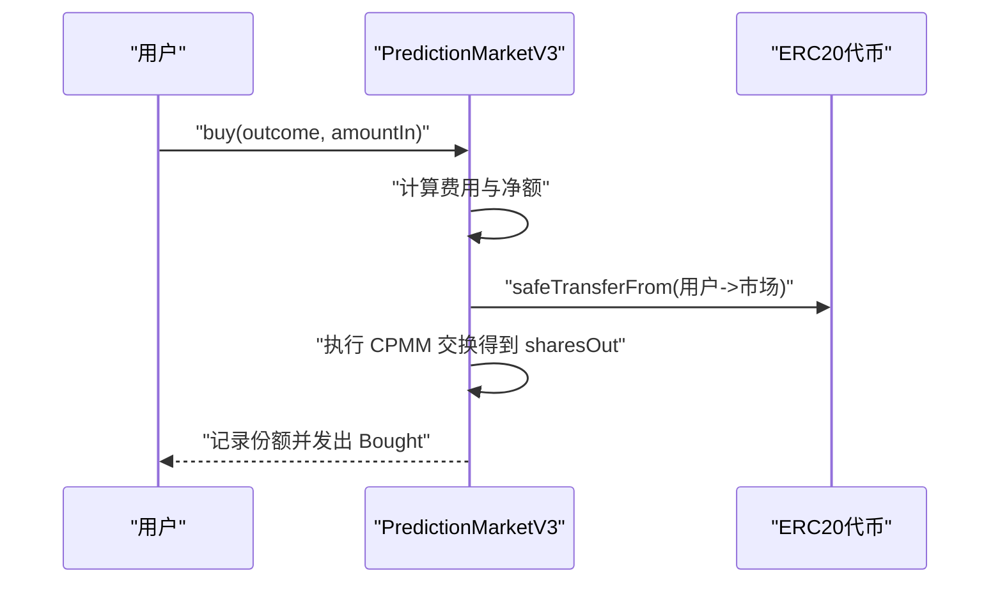
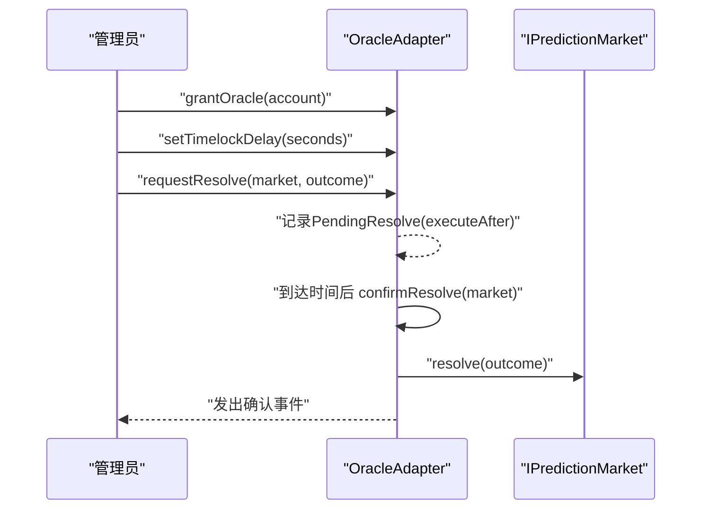
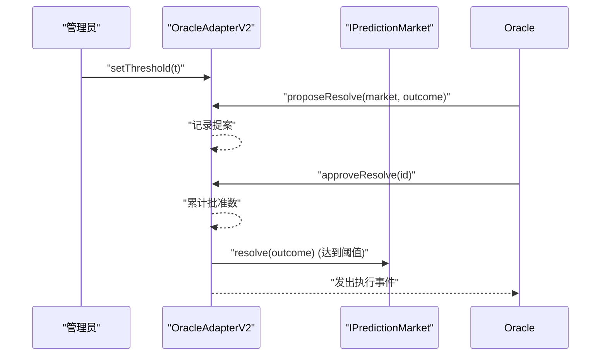
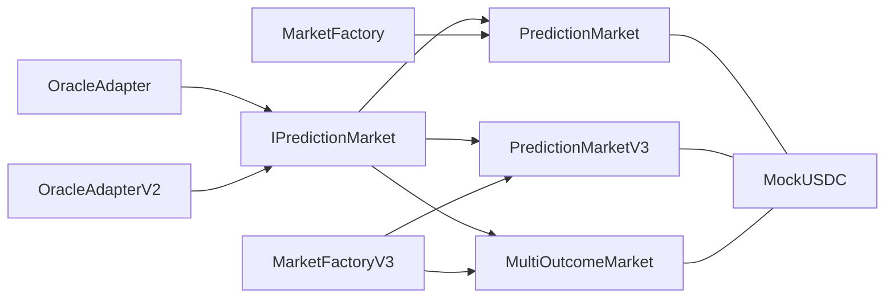

# 接口规范

<cite>
**本文引用的文件**
- [IPredictionMarket.sol](file://contracts/contracts/interfaces/IPredictionMarket.sol)
- [PredictionMarket.sol](file://contracts/contracts/PredictionMarket.sol)
- [PredictionMarketV3.sol](file://contracts/contracts/PredictionMarketV3.sol)
- [MultiOutcomeMarket.sol](file://contracts/contracts/MultiOutcomeMarket.sol)
- [OracleAdapter.sol](file://contracts/contracts/OracleAdapter.sol)
- [OracleAdapterV2.sol](file://contracts/contracts/OracleAdapterV2.sol)
- [MarketFactory.sol](file://contracts/contracts/MarketFactory.sol)
- [MarketFactoryV3.sol](file://contracts/contracts/MarketFactoryV3.sol)
- [MockUSDC.sol](file://contracts/contracts/MockUSDC.sol)
- [PredictionMarket.test.js](file://contracts/test/PredictionMarket.test.js)
- [deploy.js](file://contracts/scripts/deploy.js)
- [hardhat.config.js](file://contracts/hardhat.config.js)
</cite>

## 目录
1. [简介](#简介)
2. [项目结构](#项目结构)
3. [核心组件](#核心组件)
4. [架构总览](#架构总览)
5. [详细组件分析](#详细组件分析)
6. [依赖关系分析](#依赖关系分析)
7. [性能考量](#性能考量)
8. [故障排查指南](#故障排查指南)
9. [结论](#结论)
10. [附录：接口使用与集成指南](#附录接口使用与集成指南)

## 简介
本文件为预测市场系统的标准化接口规范，聚焦于 IPredictionMarket 接口及其在不同实现中的行为一致性，明确各函数、参数与返回值；同时阐述 ERC20 代币接口的集成方式与代币转移机制、AccessControl 权限管理的实现要点、最佳实践与兼容性要求、版本管理与向后兼容策略，以及如何扩展接口以支持新功能。

## 项目结构
该仓库采用按合约类型分层组织的方式：
- interfaces：定义标准化接口（如 IPredictionMarket）
- contracts：核心业务实现（PredictionMarket、PredictionMarketV3、MultiOutcomeMarket、MarketFactory、MarketFactoryV3、OracleAdapter、OracleAdapterV2、DIDRegistry、MockUSDC）
- test：前端链上交互用例（如 PredictionMarket.test.js）
- scripts：部署脚本（如 deploy.js）
- hardhat.config.js：编译与网络配置

图表来源
- [IPredictionMarket.sol](file://contracts/contracts/interfaces/IPredictionMarket.sol#L1-L9)
- [PredictionMarket.sol](file://contracts/contracts/PredictionMarket.sol#L1-L134)
- [PredictionMarketV3.sol](file://contracts/contracts/PredictionMarketV3.sol#L1-L200)
- [MultiOutcomeMarket.sol](file://contracts/contracts/MultiOutcomeMarket.sol#L1-L113)
- [MarketFactory.sol](file://contracts/contracts/MarketFactory.sol#L1-L60)
- [MarketFactoryV3.sol](file://contracts/contracts/MarketFactoryV3.sol#L1-L94)
- [OracleAdapter.sol](file://contracts/contracts/OracleAdapter.sol#L1-L83)
- [OracleAdapterV2.sol](file://contracts/contracts/OracleAdapterV2.sol#L1-L83)
- [MockUSDC.sol](file://contracts/contracts/MockUSDC.sol#L1-L18)

章节来源
- [IPredictionMarket.sol](file://contracts/contracts/interfaces/IPredictionMarket.sol#L1-L9)
- [PredictionMarket.sol](file://contracts/contracts/PredictionMarket.sol#L1-L134)
- [PredictionMarketV3.sol](file://contracts/contracts/PredictionMarketV3.sol#L1-L200)
- [MultiOutcomeMarket.sol](file://contracts/contracts/MultiOutcomeMarket.sol#L1-L113)
- [MarketFactory.sol](file://contracts/contracts/MarketFactory.sol#L1-L60)
- [MarketFactoryV3.sol](file://contracts/contracts/MarketFactoryV3.sol#L1-L94)
- [OracleAdapter.sol](file://contracts/contracts/OracleAdapter.sol#L1-L83)
- [OracleAdapterV2.sol](file://contracts/contracts/OracleAdapterV2.sol#L1-L83)
- [MockUSDC.sol](file://contracts/contracts/MockUSDC.sol#L1-L18)

## 核心组件
本节聚焦标准化接口 IPredictionMarket 的设计与实现一致性，以及与 ERC20、AccessControl 的集成方式。

- IPredictionMarket 接口
  - 函数：status()、resolve(winningOutcome)、voidMarket()
  - 设计原则：最小可用集合，仅暴露状态查询与结果决议/作废能力，便于适配不同内部实现（二元、多结果、CPMM 等）
  - 标准化考虑：通过统一接口屏蔽具体实现细节，调用方无需关心内部池子、费用、流动性等复杂逻辑

- ERC20 集成与代币转移
  - 所有市场实现均持有 IERC20 池化代币引用，使用 SafeERC20 进行安全转账
  - 交易流程：用户授权额度 → 市场合约从用户地址转入代币 → 记录用户头寸或份额 → 依据规则结算派发
  - 代币精度：MockUSDC 使用 6 位小数，确保与现实世界稳定币一致

- AccessControl 权限管理
  - OracleAdapter：基于 OpenZeppelin AccessControl，定义 ORACLE_ROLE，支持管理员授予、设置延时、请求/确认决议、即时决议、作废
  - OracleAdapterV2：多签模式，提案 + 多重批准阈值触发执行，提升抗审查与安全性
  - 工厂合约：Ownable 所有权模型，仅所有者可创建市场、修改默认参数

章节来源
- [IPredictionMarket.sol](file://contracts/contracts/interfaces/IPredictionMarket.sol#L1-L9)
- [PredictionMarket.sol](file://contracts/contracts/PredictionMarket.sol#L4-L9)
- [PredictionMarketV3.sol](file://contracts/contracts/PredictionMarketV3.sol#L4-L10)
- [MultiOutcomeMarket.sol](file://contracts/contracts/MultiOutcomeMarket.sol#L4-L6)
- [OracleAdapter.sol](file://contracts/contracts/OracleAdapter.sol#L4-L8)
- [OracleAdapterV2.sol](file://contracts/contracts/OracleAdapterV2.sol#L4-L8)
- [MarketFactory.sol](file://contracts/contracts/MarketFactory.sol#L4-L6)
- [MarketFactoryV3.sol](file://contracts/contracts/MarketFactoryV3.sol#L4-L7)
- [MockUSDC.sol](file://contracts/contracts/MockUSDC.sol#L7-L12)

## 架构总览
预测市场的整体架构围绕“工厂—市场—适配器—代币”展开，工厂负责创建市场实例，适配器负责权威决议与作废，市场实现负责交易、结算与派发，代币作为结算介质。

图表来源
- [MarketFactory.sol](file://contracts/contracts/MarketFactory.sol#L37-L54)
- [PredictionMarket.sol](file://contracts/contracts/PredictionMarket.sol#L64-L81)
- [OracleAdapter.sol](file://contracts/contracts/OracleAdapter.sol#L48-L75)
- [MockUSDC.sol](file://contracts/contracts/MockUSDC.sol#L14-L16)

## 详细组件分析

### IPredictionMarket 接口规范
- 函数定义与语义
  - status(): 返回当前市场状态（Open/Resolved/Voided），用于调用方判断是否可进行交易、结算或派发
  - resolve(winningOutcome): 由授权角色调用，将市场置为已解决状态并记录胜出结果
  - voidMarket(): 由授权角色调用，将市场置为作废状态，允许用户按原始投注金额回退

- 参数与返回值
  - winningOutcome: 二元市场取 0/1；多结果市场取 0..N-1
  - status(): 返回 0/1/2 对应 Open/Resolved/Voided

- 设计原则
  - 最小接口：仅暴露必要方法，避免泄露内部实现细节
  - 可组合性：不同实现均可满足此接口，便于替换与升级
  - 明确的错误条件：通过状态检查与输入校验保证幂等与一致性

章节来源
- [IPredictionMarket.sol](file://contracts/contracts/interfaces/IPredictionMarket.sol#L4-L8)

### PredictionMarket（二元市场，传统帕西米特）
- 关键字段与事件
  - 字段：collateral、oracle、factory、matchRef、question、endTime、status、winningOutcome、yesPool/noPool、用户余额映射、已领取标记
  - 事件：Bought、Resolved、Claimed、MarketVoided

- 交易与结算流程
  - 买入：校验市场开放、未过期、结果合法、数量大于 0；从用户地址转入代币，更新池子与用户余额
  - 结算：仅授权角色可调用 resolve，记录胜出结果；voidMarket 允许作废
  - 派发：根据总池与赢家池比例计算派发金额，使用 safeTransfer 转账

- 与 IPredictionMarket 的一致性
  - 实现了 status/resolve/voidMarket，满足标准化接口

- 与 ERC20 的集成
  - 使用 IERC20 与 SafeERC20，确保转账安全与失败回滚

- 与 AccessControl 的集成
  - 通过 onlyOracle 修饰符限制 resolve/voidMarket 的调用者为 oracle 地址（在该合约中直接比较）

图表来源
- [PredictionMarket.sol](file://contracts/contracts/PredictionMarket.sol#L64-L81)

章节来源
- [PredictionMarket.sol](file://contracts/contracts/PredictionMarket.sol#L7-L134)

### PredictionMarketV3（二元 CPMM 市场，带流动性与费用）
- 关键字段与事件
  - 字段：collateral、oracle、factory、matchRef、question、endTime、feeBps、maxBetPerUser、reserveYes/reserveNo、totalLPSupply、collectedFees、LP 余额映射、用户总投注、已领取标记
  - 事件：Bought、LiquidityAdded、LiquidityRemoved、Resolved、Claimed、MarketVoided

- 交易与结算流程
  - 买入：收取费用，计算净额，执行 CPMM 交换，记录用户份额；支持单用户最大投注限制
  - 流动性：addLiquidity/removeLiquidity，按比例调整 reserves 与 LP 总量
  - 结算与作废：resolve/voidMarket
  - 派发：根据 CPMM 规则计算派发金额

- 与 IPredictionMarket 的一致性
  - 提供 status() 与 resolve/voidMarket，满足接口

- 与 ERC20 的集成
  - 使用 IERC20 与 SafeERC20，费用与代币安全处理

- 与 AccessControl 的集成
  - 通过 onlyOracle 修饰符限制 resolve/voidMarket 的调用者为 oracle 地址

图表来源
- [PredictionMarketV3.sol](file://contracts/contracts/PredictionMarketV3.sol#L92-L111)

章节来源
- [PredictionMarketV3.sol](file://contracts/contracts/PredictionMarketV3.sol#L8-L200)

### MultiOutcomeMarket（多结果市场，2-8 结果）
- 关键字段与事件
  - 字段：collateral、oracle、matchRef、question、endTime、outcomeCount、feeBps、pool 数组、stake 映射、已领取标记
  - 事件：Bought、Resolved、Claimed、MarketVoided

- 交易与结算流程
  - 买入：校验结果索引与数量，收取费用，累加对应池
  - 结算与作废：resolve/voidMarket
  - 派发：按赢家池与用户在赢家池的占比计算派发

- 与 IPredictionMarket 的一致性
  - 提供 status() 与 resolve/voidMarket，满足接口

- 与 ERC20 的集成
  - 使用 IERC20 与 SafeERC20

- 与 AccessControl 的集成
  - 通过 onlyOracle 修饰符限制 resolve/voidMarket 的调用者为 oracle 地址

章节来源
- [MultiOutcomeMarket.sol](file://contracts/contracts/MultiOutcomeMarket.sol#L8-L113)

### OracleAdapter（单 Oracle 角色，带延时）
- 角色与权限
  - DEFAULT_ADMIN_ROLE：可设置延时、工厂、授予 ORACLE_ROLE
  - ORACLE_ROLE：可请求/确认决议、即时决议、作废市场

- 关键流程
  - 请求决议：记录待执行提案与执行时间
  - 确认决议：延时到期后执行 resolve
  - 即时决议：当延时为 0 时直接 resolve
  - 作废：调用市场 voidMarket

图表来源
- [OracleAdapter.sol](file://contracts/contracts/OracleAdapter.sol#L30-L75)

章节来源
- [OracleAdapter.sol](file://contracts/contracts/OracleAdapter.sol#L7-L83)

### OracleAdapterV2（多签 Oracle，m-of-n）
- 角色与权限
  - DEFAULT_ADMIN_ROLE：可设置阈值、授予 ORACLE_ROLE
  - ORACLE_ROLE：可发起提案、批准提案、执行决议
  - 阈值：达到阈值后自动执行

- 关键流程
  - 提案：proposeResolve 创建提案并自动批准
  - 批准：approveResolve 累计批准数
  - 执行：达到阈值后 _execute 调用市场 resolve
  - 作废：调用市场 voidMarket

图表来源
- [OracleAdapterV2.sol](file://contracts/contracts/OracleAdapterV2.sol#L29-L75)

章节来源
- [OracleAdapterV2.sol](file://contracts/contracts/OracleAdapterV2.sol#L7-L83)

### MarketFactory 与 MarketFactoryV3（工厂）
- MarketFactory（v2）
  - Ownable：仅所有者可创建市场
  - createMarket：构造 PredictionMarket 并登记
  - 版本号：version 返回字符串

- MarketFactoryV3（v3）
  - Ownable + Pausable：支持暂停/恢复
  - createBinaryMarket：支持初始流动性注入与种子
  - createMultiMarket：创建多结果市场
  - 默认参数：defaultFeeBps、defaultMaxBet
  - 版本号：version 返回字符串

章节来源
- [MarketFactory.sol](file://contracts/contracts/MarketFactory.sol#L8-L60)
- [MarketFactoryV3.sol](file://contracts/contracts/MarketFactoryV3.sol#L10-L94)

### 代币与测试
- MockUSDC：6 位小数的测试代币，提供 mint 便于测试
- 测试用例：演示买入、结算、派发、权限控制与错误场景

章节来源
- [MockUSDC.sol](file://contracts/contracts/MockUSDC.sol#L6-L17)
- [PredictionMarket.test.js](file://contracts/test/PredictionMarket.test.js#L5-L70)

## 依赖关系分析
- 接口到实现
  - IPredictionMarket 被 PredictionMarket、PredictionMarketV3、MultiOutcomeMarket 实现
- 适配器到接口
  - OracleAdapter 与 OracleAdapterV2 通过 IPredictionMarket 调用 resolve/voidMarket
- 工厂到实现
  - MarketFactory 创建 PredictionMarket；MarketFactoryV3 创建 PredictionMarketV3 与 MultiOutcomeMarket
- 代币到实现
  - 各市场实现依赖 IERC20 与 SafeERC20

图表来源
- [IPredictionMarket.sol](file://contracts/contracts/interfaces/IPredictionMarket.sol#L4-L8)
- [PredictionMarket.sol](file://contracts/contracts/PredictionMarket.sol#L17-L25)
- [PredictionMarketV3.sol](file://contracts/contracts/PredictionMarketV3.sol#L14-L24)
- [MultiOutcomeMarket.sol](file://contracts/contracts/MultiOutcomeMarket.sol#L14-L20)
- [OracleAdapter.sol](file://contracts/contracts/OracleAdapter.sol#L4-L5)
- [OracleAdapterV2.sol](file://contracts/contracts/OracleAdapterV2.sol#L4-L5)
- [MarketFactory.sol](file://contracts/contracts/MarketFactory.sol#L4-L6)
- [MarketFactoryV3.sol](file://contracts/contracts/MarketFactoryV3.sol#L4-L8)
- [MockUSDC.sol](file://contracts/contracts/MockUSDC.sol#L7-L12)

章节来源
- [IPredictionMarket.sol](file://contracts/contracts/interfaces/IPredictionMarket.sol#L4-L8)
- [PredictionMarket.sol](file://contracts/contracts/PredictionMarket.sol#L17-L25)
- [PredictionMarketV3.sol](file://contracts/contracts/PredictionMarketV3.sol#L14-L24)
- [MultiOutcomeMarket.sol](file://contracts/contracts/MultiOutcomeMarket.sol#L14-L20)
- [OracleAdapter.sol](file://contracts/contracts/OracleAdapter.sol#L4-L5)
- [OracleAdapterV2.sol](file://contracts/contracts/OracleAdapterV2.sol#L4-L5)
- [MarketFactory.sol](file://contracts/contracts/MarketFactory.sol#L4-L6)
- [MarketFactoryV3.sol](file://contracts/contracts/MarketFactoryV3.sol#L4-L8)
- [MockUSDC.sol](file://contracts/contracts/MockUSDC.sol#L7-L12)

## 性能考量
- 优化建议
  - 使用 SafeERC20 与非重入保护（ReentrancyGuard）降低安全风险与回滚成本
  - 在多结果市场中，派发时遍历池数组需注意 gas 成本，可通过预聚合或缓存减少重复计算
  - CPMM 市场的 swap 与派发计算为常数时间，但需关注数值溢出与除零保护
- 编译与运行
  - Solidity 版本与优化器配置见 hardhat.config.js，建议在生产环境启用合理的 runs 与 EVM 版本

章节来源
- [PredictionMarketV3.sol](file://contracts/contracts/PredictionMarketV3.sol#L6-L9)
- [MultiOutcomeMarket.sol](file://contracts/contracts/MultiOutcomeMarket.sol#L5-L6)
- [hardhat.config.js](file://contracts/hardhat.config.js#L7-L13)

## 故障排查指南
- 常见错误与定位
  - 非开放市场：买入/结算前检查 status 是否为 Open
  - 已过期：endTime 小于当前区块时间导致交易失败
  - 非法结果：outcome 超出范围（二元为 0/1，多结果为 0..N-1）
  - 无权调用：resolve/voidMarket 需要 ORACLE_ROLE
  - 重复派发：已领取标记防止重复 claim
  - 适配器延时：requestResolve 后需等待延时到期再 confirmResolve
  - 多签阈值：OracleAdapterV2 需达到阈值才执行
- 测试参考
  - 测试用例覆盖了买入、结算、派发、权限与错误场景，可据此快速定位问题

章节来源
- [PredictionMarket.sol](file://contracts/contracts/PredictionMarket.sol#L64-L95)
- [PredictionMarketV3.sol](file://contracts/contracts/PredictionMarketV3.sol#L92-L165)
- [MultiOutcomeMarket.sol](file://contracts/contracts/MultiOutcomeMarket.sol#L65-L111)
- [OracleAdapter.sol](file://contracts/contracts/OracleAdapter.sol#L48-L75)
- [OracleAdapterV2.sol](file://contracts/contracts/OracleAdapterV2.sol#L44-L75)
- [PredictionMarket.test.js](file://contracts/test/PredictionMarket.test.js#L34-L68)

## 结论
IPredictionMarket 作为预测市场的标准化接口，成功屏蔽了不同实现的内部差异，使工厂、适配器与调用方之间保持低耦合高内聚。通过 ERC20 与 SafeERC20 的集成，实现了安全可靠的代币流转；借助 AccessControl 的角色体系，保障了权威决议的安全可控。版本演进从 v2 到 v3，逐步引入 CPMM、多结果、多签适配器与暂停机制，体现了清晰的向后兼容策略与可扩展性。

## 附录：接口使用与集成指南

### IPredictionMarket 接口函数规范
- status()
  - 输入：无
  - 返回：uint8，0=Open、1=Resolved、2=Voided
  - 用途：查询市场状态，决定后续操作可行性
- resolve(winningOutcome)
  - 输入：uint8 胜出结果索引
  - 行为：将市场置为已解决并记录胜出结果
  - 权限：仅授权角色（oracle）可调用
- voidMarket()
  - 输入：无
  - 行为：将市场置为作废
  - 权限：仅授权角色（oracle）可调用

章节来源
- [IPredictionMarket.sol](file://contracts/contracts/interfaces/IPredictionMarket.sol#L4-L8)

### ERC20 集成与代币转移机制
- 代币引用：各市场实现持有 IERC20 引用，使用 SafeERC20.safeTransferFrom/safeTransfer
- 授权流程：用户需先对市场合约进行 approve，再执行买入/添加流动性等操作
- 费用处理：CPMM 市场按 feeBps 收取费用，计入 collectedFees 并参与最终派发

章节来源
- [PredictionMarket.sol](file://contracts/contracts/PredictionMarket.sol#L4-L9)
- [PredictionMarketV3.sol](file://contracts/contracts/PredictionMarketV3.sol#L4-L10)
- [MultiOutcomeMarket.sol](file://contracts/contracts/MultiOutcomeMarket.sol#L4-L6)
- [MockUSDC.sol](file://contracts/contracts/MockUSDC.sol#L7-L12)

### AccessControl 权限管理实现
- OracleAdapter
  - 角色：DEFAULT_ADMIN_ROLE、ORACLE_ROLE
  - 功能：设置延时、设置工厂、授予 oracle、请求/确认决议、即时决议、作废
- OracleAdapterV2
  - 角色：DEFAULT_ADMIN_ROLE、ORACLE_ROLE
  - 功能：设置阈值、授予 oracle、提案、批准、执行、作废
- 工厂合约
  - MarketFactory：Ownable，仅所有者可创建市场
  - MarketFactoryV3：Ownable + Pausable，支持暂停/恢复

章节来源
- [OracleAdapter.sol](file://contracts/contracts/OracleAdapter.sol#L8-L34)
- [OracleAdapterV2.sol](file://contracts/contracts/OracleAdapterV2.sol#L8-L33)
- [MarketFactory.sol](file://contracts/contracts/MarketFactory.sol#L9-L30)
- [MarketFactoryV3.sol](file://contracts/contracts/MarketFactoryV3.sol#L11-L29)

### 最佳实践与兼容性要求
- 最佳实践
  - 严格遵循 IPredictionMarket 接口，避免直接依赖具体实现细节
  - 使用 SafeERC20 与 ReentrancyGuard，确保转账与状态变更原子性
  - 在多结果市场中，合理设置 outcomeCount 与 maxBetPerUser
  - 适配器层集中处理权限与延时，业务层专注交易与结算
- 兼容性要求
  - 新实现必须提供 status()/resolve()/voidMarket()，并保持状态机一致
  - 交易与派发逻辑需与现有实现保持等价行为，确保用户资产安全

章节来源
- [IPredictionMarket.sol](file://contracts/contracts/interfaces/IPredictionMarket.sol#L4-L8)
- [PredictionMarketV3.sol](file://contracts/contracts/PredictionMarketV3.sol#L6-L9)
- [MultiOutcomeMarket.sol](file://contracts/contracts/MultiOutcomeMarket.sol#L5-L6)

### 接口使用示例与集成指南
- 示例一：二元市场买入与派发
  - 步骤：授权 → 买入 → 结算 → 派发
  - 参考：测试用例演示了买入、结算与派发流程
- 示例二：CPMM 市场流动性与交易
  - 步骤：添加流动性 → 买入（含费用）→ 结算 → 派发
  - 参考：v3 市场实现与测试用例
- 示例三：多结果市场
  - 步骤：买入指定结果 → 结算 → 派发
  - 参考：多结果市场实现

章节来源
- [PredictionMarket.test.js](file://contracts/test/PredictionMarket.test.js#L34-L68)
- [PredictionMarketV3.sol](file://contracts/contracts/PredictionMarketV3.sol#L92-L165)
- [MultiOutcomeMarket.sol](file://contracts/contracts/MultiOutcomeMarket.sol#L65-L111)

### 版本管理与向后兼容策略
- 版本标识
  - MarketFactory.version(): "2.0.0-phase2"
  - MarketFactoryV3.version(): "3.0.0-phase3"
- 向后兼容
  - 新增 v3 市场与多签适配器，不改变 v2 接口与行为
  - 通过工厂选择创建不同版本市场，调用方可渐进迁移
- 升级路径
  - 优先使用 IPredictionMarket 抽象，逐步迁移到 v3 市场与 OracleAdapterV2

章节来源
- [MarketFactory.sol](file://contracts/contracts/MarketFactory.sol#L56-L58)
- [MarketFactoryV3.sol](file://contracts/contracts/MarketFactoryV3.sol#L90-L92)

### 如何扩展接口以支持新功能需求
- 扩展点建议
  - 新增只读查询：如 getPoolState、getUserStake、getFeeInfo 等，保持只读与无副作用
  - 新增治理功能：如 pause/resume、setParams 等，通过 AccessControl 严格限制
  - 新增事件：为链上可观测性增加更细粒度事件
- 实现原则
  - 保持 IPredictionMarket 最小集合不变，新增功能通过工厂或适配器层扩展
  - 严格遵守 ERC20 安全转账与 ReentrancyGuard 使用
  - 通过测试用例覆盖新功能的边界条件与错误场景

章节来源
- [IPredictionMarket.sol](file://contracts/contracts/interfaces/IPredictionMarket.sol#L4-L8)
- [PredictionMarketV3.sol](file://contracts/contracts/PredictionMarketV3.sol#L167-L176)
- [OracleAdapterV2.sol](file://contracts/contracts/OracleAdapterV2.sol#L35-L42)