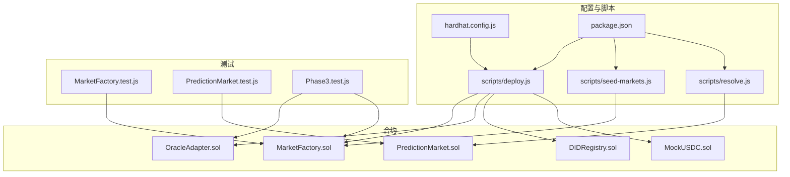
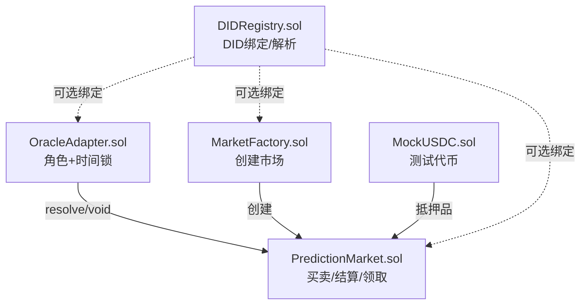
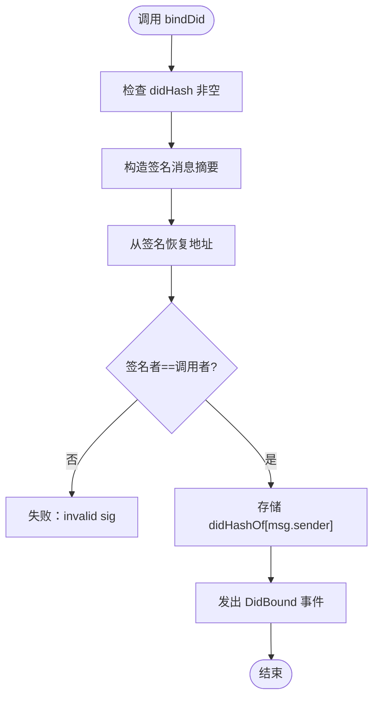
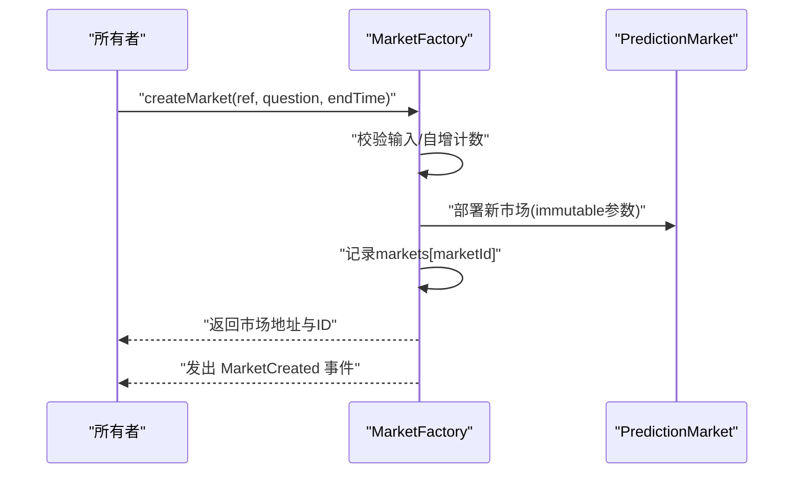
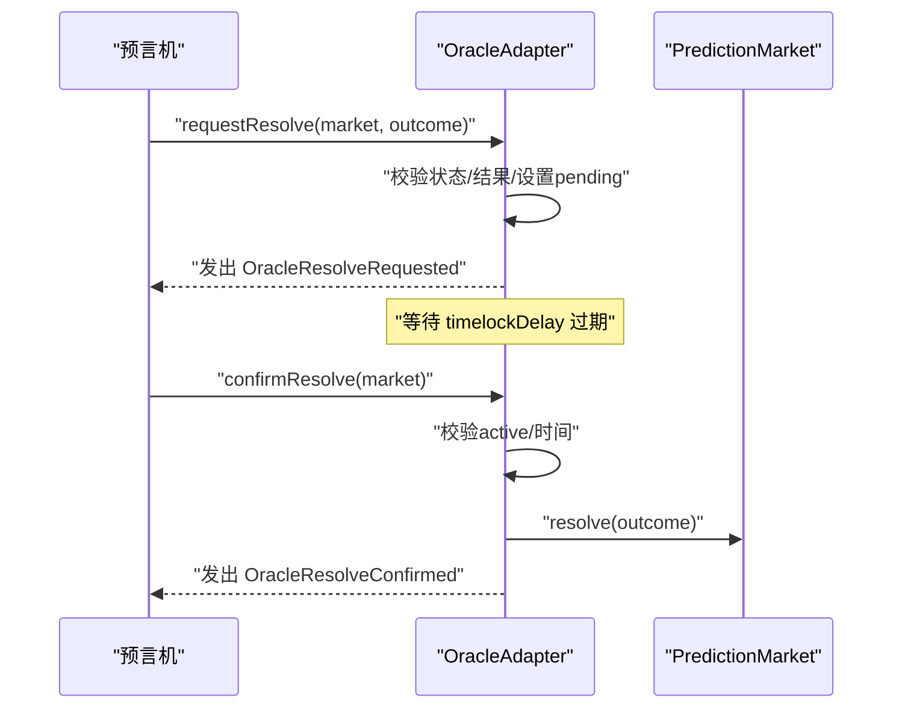
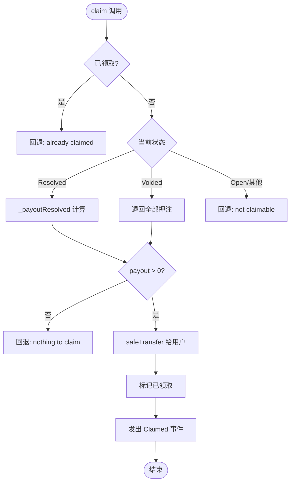
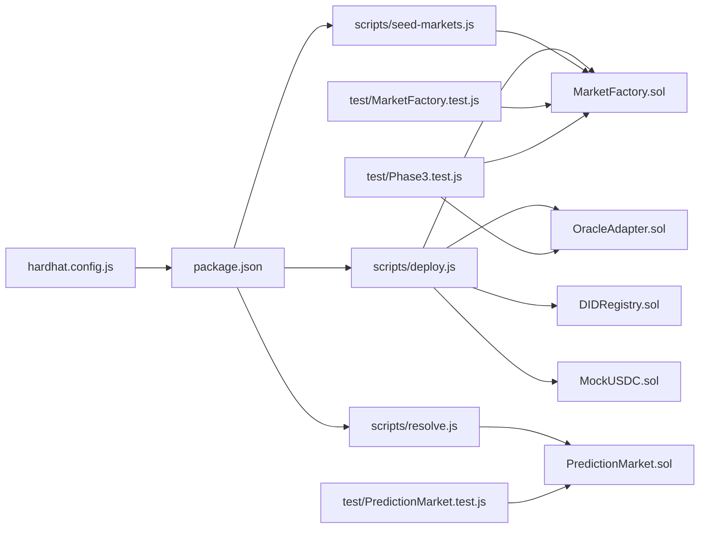

# 故障排除

<cite>
**本文档引用的文件**
- [hardhat.config.js](file://hardhat.config.js)
- [package.json](file://package.json)
- [deploy.js](file://scripts/deploy.js)
- [seed-markets.js](file://scripts/seed-markets.js)
- [resolve.js](file://scripts/resolve.js)
- [MarketFactory.test.js](file://test/MarketFactory.test.js)
- [PredictionMarket.test.js](file://test/PredictionMarket.test.js)
- [Phase3.test.js](file://test/Phase3.test.js)
- [DIDRegistry.sol](file://contracts/DIDRegistry.sol)
- [MarketFactory.sol](file://contracts/MarketFactory.sol)
- [PredictionMarket.sol](file://contracts/PredictionMarket.sol)
- [MockUSDC.sol](file://contracts/MockUSDC.sol)
- [OracleAdapter.sol](file://contracts/OracleAdapter.sol)
</cite>

## 目录
1. [简介](#简介)
2. [项目结构](#项目结构)
3. [核心组件](#核心组件)
4. [架构总览](#架构总览)
5. [详细组件分析](#详细组件分析)
6. [依赖分析](#依赖分析)
7. [性能考虑](#性能考虑)
8. [故障排除指南](#故障排除指南)
9. [结论](#结论)
10. [附录](#附录)

## 简介
本指南面向预测市场DID认证系统的开发者与运维人员，聚焦于编译错误、部署失败、测试异常与运行时错误的诊断与修复。内容覆盖日志分析、错误代码解读、命令行操作与配置调整，并提供针对开发环境、网络连接与合约交互的实用排错流程与工具箱。

## 项目结构
项目采用基于功能与层次混合的组织方式：
- contracts：核心合约（含DID注册、市场工厂、预言机适配器、预测市场、Mock代币等）
- scripts：部署、播种市场、手动结算等自动化脚本
- test：单元与集成测试，覆盖市场创建、买卖、结算、领取等关键流程
- artifacts/cache/coverage：构建与覆盖率产物
- hardhat.config.js/package.json：构建与脚本配置

图表来源
- [hardhat.config.js:1-33](file://hardhat.config.js#L1-L33)
- [package.json:1-22](file://package.json#L1-L22)
- [deploy.js:1-60](file://scripts/deploy.js#L1-L60)
- [seed-markets.js:1-37](file://scripts/seed-markets.js#L1-L37)
- [resolve.js:1-22](file://scripts/resolve.js#L1-L22)
- [DIDRegistry.sol:1-39](file://contracts/DIDRegistry.sol#L1-L39)
- [MarketFactory.sol:1-68](file://contracts/MarketFactory.sol#L1-L68)
- [PredictionMarket.sol:1-145](file://contracts/PredictionMarket.sol#L1-L145)
- [MockUSDC.sol:1-24](file://contracts/MockUSDC.sol#L1-L24)
- [OracleAdapter.sol:1-96](file://contracts/OracleAdapter.sol#L1-L96)
- [MarketFactory.test.js:1-31](file://test/MarketFactory.test.js#L1-L31)
- [PredictionMarket.test.js:1-77](file://test/PredictionMarket.test.js#L1-L77)
- [Phase3.test.js:1-78](file://test/Phase3.test.js#L1-L78)

章节来源
- [hardhat.config.js:1-33](file://hardhat.config.js#L1-L33)
- [package.json:1-22](file://package.json#L1-L22)

## 核心组件
- DID注册表：实现DID哈希与账户地址的绑定与解析，具备签名验证与事件记录。
- 市场工厂：负责创建二元预测市场，维护市场列表与版本信息，支持设置预言机。
- 预言机适配器：通过角色控制与时间锁机制协调市场结算与作废，支持快速结算路径。
- 预测市场：实现互池式Yes/No市场，支持购买、结算、作废与奖励领取。
- MockUSDC：测试用稳定币，模拟USDC精度与铸造能力。

章节来源
- [DIDRegistry.sol:1-39](file://contracts/DIDRegistry.sol#L1-L39)
- [MarketFactory.sol:1-68](file://contracts/MarketFactory.sol#L1-L68)
- [OracleAdapter.sol:1-96](file://contracts/OracleAdapter.sol#L1-L96)
- [PredictionMarket.sol:1-145](file://contracts/PredictionMarket.sol#L1-L145)
- [MockUSDC.sol:1-24](file://contracts/MockUSDC.sol#L1-L24)

## 架构总览
系统围绕“工厂-市场-适配器-代币”的协作展开，DID注册表作为可选的链上身份绑定层。部署与运行通过Hardhat脚本驱动，测试覆盖关键业务流程。

图表来源
- [OracleAdapter.sol:1-96](file://contracts/OracleAdapter.sol#L1-L96)
- [MarketFactory.sol:1-68](file://contracts/MarketFactory.sol#L1-L68)
- [PredictionMarket.sol:1-145](file://contracts/PredictionMarket.sol#L1-L145)
- [MockUSDC.sol:1-24](file://contracts/MockUSDC.sol#L1-L24)
- [DIDRegistry.sol:1-39](file://contracts/DIDRegistry.sol#L1-L39)

## 详细组件分析

### DID注册表（DIDRegistry）
- 关键点：绑定函数要求非空DID哈希；签名需匹配调用者；解析函数按地址返回绑定哈希。
- 常见问题：空DID哈希导致校验失败；签名不匹配导致恢复地址失败；未正确导入ECDSA与消息哈希工具。

图表来源
- [DIDRegistry.sol:23-32](file://contracts/DIDRegistry.sol#L23-L32)

章节来源
- [DIDRegistry.sol:1-39](file://contracts/DIDRegistry.sol#L1-L39)

### 市场工厂（MarketFactory）
- 关键点：构造函数校验抵押品与预言机地址；onlyOwner限制创建与设置；emit MarketCreated事件。
- 常见问题：传入零地址导致初始化失败；非所有者调用创建或设置预言机会被拒绝。

图表来源
- [MarketFactory.sol:44-61](file://contracts/MarketFactory.sol#L44-L61)

章节来源
- [MarketFactory.sol:1-68](file://contracts/MarketFactory.sol#L1-L68)

### 预言机适配器（OracleAdapter）
- 关键点：角色控制（ORACLE_ROLE）；时间锁延迟；requestResolve/confirmResolve双步结算；resolveNow快速路径；voidMarket作废。
- 常见问题：时间锁未到期导致confirm失败；非预言机调用；无效结果编号；工厂地址未设置。

图表来源
- [OracleAdapter.sol:58-78](file://contracts/OracleAdapter.sol#L58-L78)
- [OracleAdapter.sol:82-87](file://contracts/OracleAdapter.sol#L82-L87)

章节来源
- [OracleAdapter.sol:1-96](file://contracts/OracleAdapter.sol#L1-L96)

### 预测市场（PredictionMarket）
- 关键点：onlyOracle修饰符；状态机Open/Resolved/Voided；buy校验与资金池更新；claim根据状态计算赔付。
- 常见问题：非开放市场购买/结算；超截止时间；重复领取；无可领取金额。

图表来源
- [PredictionMarket.sol:107-123](file://contracts/PredictionMarket.sol#L107-L123)
- [PredictionMarket.sol:126-143](file://contracts/PredictionMarket.sol#L126-L143)

章节来源
- [PredictionMarket.sol:1-145](file://contracts/PredictionMarket.sol#L1-L145)

### MockUSDC
- 关键点：测试用代币，6位精度；mint公开用于测试资金注入。
- 常见问题：精度不匹配导致测试断言失败；未授权或余额不足。

章节来源
- [MockUSDC.sol:1-24](file://contracts/MockUSDC.sol#L1-L24)

## 依赖分析
- 构建与运行：Hardhat工具箱、OpenZeppelin合约库、覆盖率插件。
- 脚本与测试：通过Hardhat运行时加载合约工厂与实例，依赖网络RPC与账户权限。
- 合约间耦合：工厂创建市场；适配器控制市场结算/作废；市场依赖代币进行支付与结算。

图表来源
- [hardhat.config.js:1-33](file://hardhat.config.js#L1-L33)
- [package.json:1-22](file://package.json#L1-L22)
- [deploy.js:1-60](file://scripts/deploy.js#L1-L60)
- [seed-markets.js:1-37](file://scripts/seed-markets.js#L1-L37)
- [resolve.js:1-22](file://scripts/resolve.js#L1-L22)
- [MarketFactory.sol:1-68](file://contracts/MarketFactory.sol#L1-L68)
- [OracleAdapter.sol:1-96](file://contracts/OracleAdapter.sol#L1-L96)
- [DIDRegistry.sol:1-39](file://contracts/DIDRegistry.sol#L1-L39)
- [MockUSDC.sol:1-24](file://contracts/MockUSDC.sol#L1-L24)
- [PredictionMarket.sol:1-145](file://contracts/PredictionMarket.sol#L1-L145)
- [MarketFactory.test.js:1-31](file://test/MarketFactory.test.js#L1-L31)
- [PredictionMarket.test.js:1-77](file://test/PredictionMarket.test.js#L1-L77)
- [Phase3.test.js:1-78](file://test/Phase3.test.js#L1-L78)

章节来源
- [hardhat.config.js:1-33](file://hardhat.config.js#L1-L33)
- [package.json:1-22](file://package.json#L1-L22)

## 性能考虑
- 编译优化：启用优化器并设置合理runs次数，平衡gas与编译时间。
- EVM版本：选择目标EVM版本以兼容特性与gas消耗。
- 交易批量：在脚本中合并多次调用以减少往返。
- 日志与事件：通过事件追踪状态变化，便于审计与排错。

## 故障排除指南

### 一、编译错误
- 症状
  - 编译失败，提示语法或类型错误
  - 依赖合约找不到或版本不匹配
- 诊断步骤
  - 检查Solidity版本与编译器设置一致性
  - 确认OpenZeppelin依赖已安装且版本兼容
  - 核对导入路径与合约命名
- 修复建议
  - 使用配置中的Solidity版本进行编译
  - 清理缓存后重新安装依赖
  - 对齐合约与库的版本

章节来源
- [hardhat.config.js:10-16](file://hardhat.config.js#L10-L16)
- [package.json:15-20](file://package.json#L15-L20)

### 二、部署失败
- 症状
  - 部署脚本抛出异常或进程退出码非0
  - 本地节点未启动或RPC不可达
- 诊断步骤
  - 确认本地节点已启动并监听默认端口
  - 检查部署脚本所需环境变量与账户权限
  - 校验部署顺序与依赖合约地址
- 修复建议
  - 启动本地节点后再执行部署
  - 按脚本顺序执行：先部署MockUSDC，再部署适配器与注册表，最后工厂
  - 确保适配器设置工厂地址与授予预言机角色

命令示例
- 启动本地节点：[package.json:8](file://package.json#L8)
- 执行部署：[package.json:9](file://package.json#L9)
- 写入部署信息：[deploy.js:38-52](file://scripts/deploy.js#L38-L52)

章节来源
- [deploy.js:1-60](file://scripts/deploy.js#L1-L60)
- [hardhat.config.js:17-25](file://hardhat.config.js#L17-L25)

### 三、测试异常
- 症状
  - 测试用例断言失败或抛出特定错误字符串
  - 无法获取市场实例或事件未触发
- 诊断步骤
  - 检查测试账户权限与授权额度
  - 确认市场状态与截止时间设置合理
  - 核对预言机角色授予与调用者身份
- 修复建议
  - 为测试账户注入足够代币并授权市场合约
  - 使用测试助手设置未来时间或推进区块时间
  - 确保预言机角色已授予对应账户

命令示例
- 运行测试：[package.json:7](file://package.json#L7)
- 市场创建事件断言：[MarketFactory.test.js:20-22](file://test/MarketFactory.test.js#L20-L22)
- 预言机结算与领取断言：[PredictionMarket.test.js:45-54](file://test/PredictionMarket.test.js#L45-L54)

章节来源
- [MarketFactory.test.js:1-31](file://test/MarketFactory.test.js#L1-L31)
- [PredictionMarket.test.js:1-77](file://test/PredictionMarket.test.js#L1-L77)
- [Phase3.test.js:1-78](file://test/Phase3.test.js#L1-L78)

### 四、运行时错误
- 症状
  - 调用失败并提示“not oracle”、“already claimed”、“not open”等
  - 结算或领取逻辑异常
- 诊断步骤
  - 检查调用者是否具备预言机角色
  - 核对市场状态与时间锁条件
  - 确认用户余额与授权额度满足购买
- 修复建议
  - 通过适配器授予预言机角色
  - 等待时间锁到期或在本地网络中使用快速结算
  - 避免重复领取，确保状态机流转正确

命令示例
- 手动结算脚本：[package.json:11](file://package.json#L11)，[resolve.js:5-14](file://scripts/resolve.js#L5-L14)
- 种子市场脚本：[package.json:10](file://package.json#L10)，[seed-markets.js:7-29](file://scripts/seed-markets.js#L7-L29)

章节来源
- [OracleAdapter.sol:44-47](file://contracts/OracleAdapter.sol#L44-L47)
- [PredictionMarket.sol:107-123](file://contracts/PredictionMarket.sol#L107-L123)
- [resolve.js:1-22](file://scripts/resolve.js#L1-L22)
- [seed-markets.js:1-37](file://scripts/seed-markets.js#L1-L37)

### 五、日志分析与错误代码解读
- 常见错误字符串定位
  - “not oracle”：调用者非预言机角色
  - “already claimed”：重复领取
  - “not open”：市场状态不符
  - “invalid outcome”：结果编号非法
  - “empty did” / “invalid sig”：DID绑定失败
- 分析方法
  - 查看事件日志定位关键步骤
  - 结合测试用例复现并缩小范围
  - 使用Hardhat网络助手推进时间或区块

章节来源
- [PredictionMarket.sol:44-47](file://contracts/PredictionMarket.sol#L44-L47)
- [PredictionMarket.sol:107-123](file://contracts/PredictionMarket.sol#L107-L123)
- [DIDRegistry.sol:24-29](file://contracts/DIDRegistry.sol#L24-L29)

### 六、开发环境问题
- 症状
  - 依赖安装失败或版本冲突
  - 缓存损坏导致编译异常
- 修复建议
  - 清理缓存与node_modules后重装
  - 使用锁定的依赖版本
  - 确认Node与npm版本满足Hardhat要求

章节来源
- [package.json:15-20](file://package.json#L15-L20)

### 七、网络连接问题
- 症状
  - 本地RPC连接失败或超时
  - 远程网络不稳定导致交易失败
- 修复建议
  - 确认本地节点监听地址与端口
  - 检查防火墙与代理设置
  - 使用备用RPC节点或提高超时配置

章节来源
- [hardhat.config.js:21-24](file://hardhat.config.js#L21-L24)

### 八、合约交互问题
- 症状
  - 交易被回滚但无明确原因
  - 事件未触发或参数不正确
- 修复建议
  - 使用链上浏览器或日志查看回滚原因
  - 校验参数类型与长度
  - 确保账户有足够ETH支付gas

章节来源
- [MarketFactory.sol:20-27](file://contracts/MarketFactory.sol#L20-L27)
- [OracleAdapter.sol:26-33](file://contracts/OracleAdapter.sol#L26-L33)

## 结论
通过规范的部署流程、完善的测试覆盖与严谨的日志分析，可高效定位并修复预测市场DID认证系统中的各类问题。建议在开发与测试环境中优先使用本地节点与快速结算路径，在生产部署前进行全面的Gas优化与安全审计。

## 附录

### A. 常用命令速查
- 启动本地节点：[package.json:8](file://package.json#L8)
- 编译合约：[package.json:6](file://package.json#L6)
- 运行测试：[package.json:7](file://package.json#L7)
- 部署到本地网络：[package.json:9](file://package.json#L9)
- 种子市场：[package.json:10](file://package.json#L10)
- 手动结算：[package.json:11](file://package.json#L11)

### B. 关键配置项
- Solidity编译器版本与优化器：[hardhat.config.js:10-16](file://hardhat.config.js#L10-L16)
- 网络RPC与链ID：[hardhat.config.js:17-25](file://hardhat.config.js#L17-L25)
- 路径配置：[hardhat.config.js:26-31](file://hardhat.config.js#L26-L31)