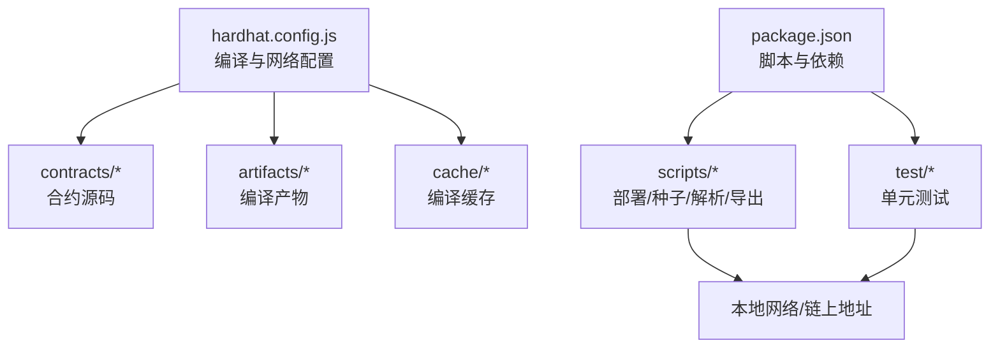
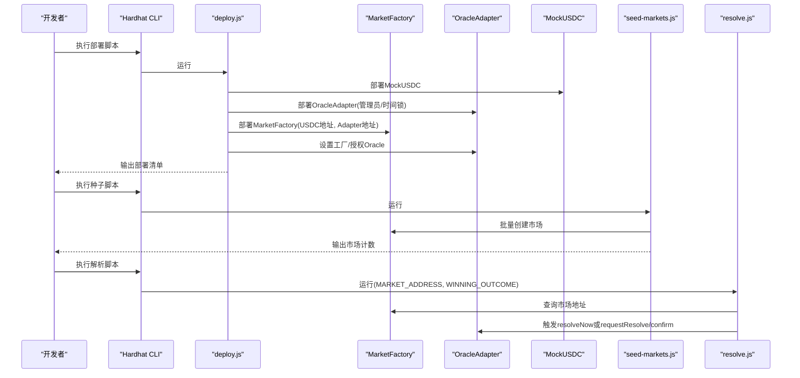
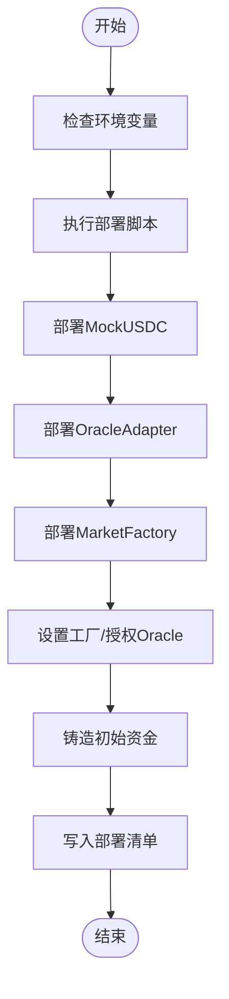
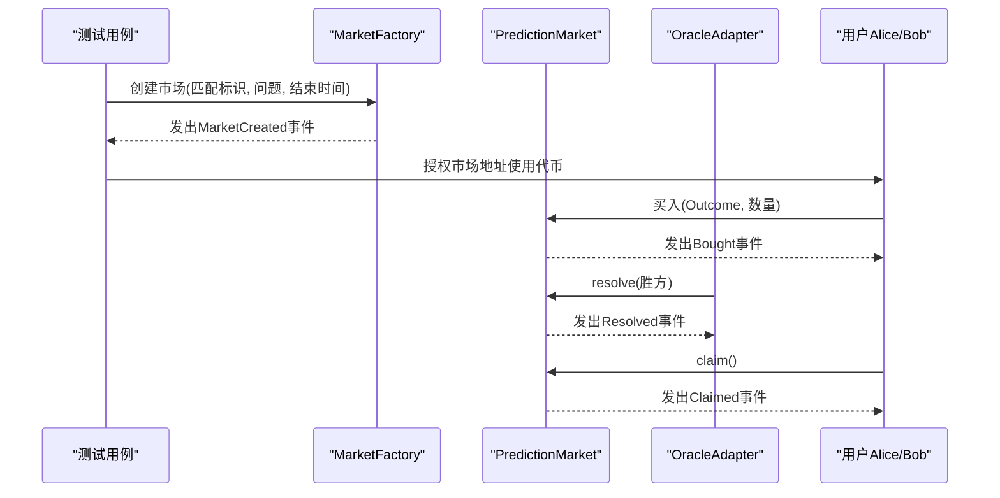
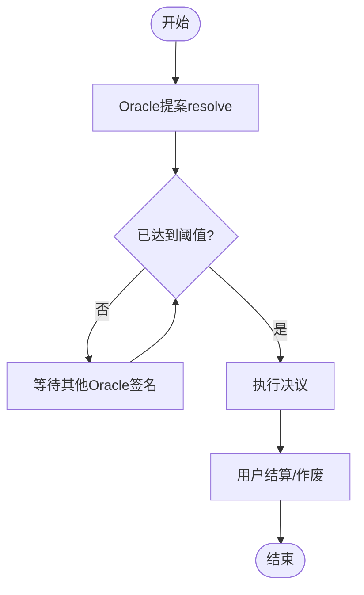
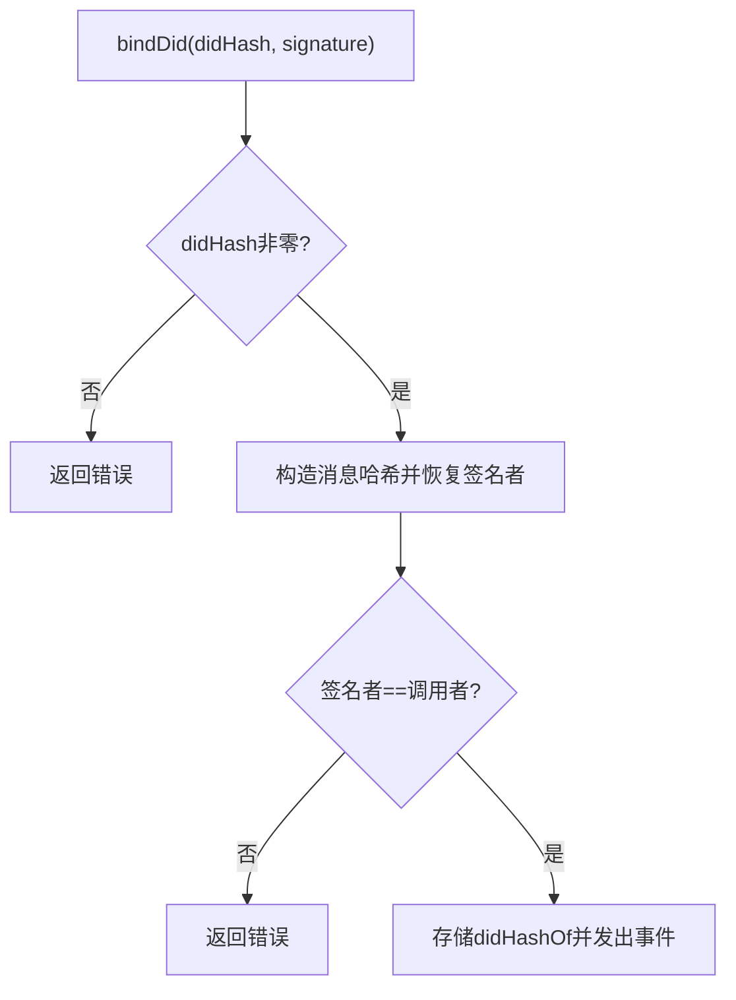
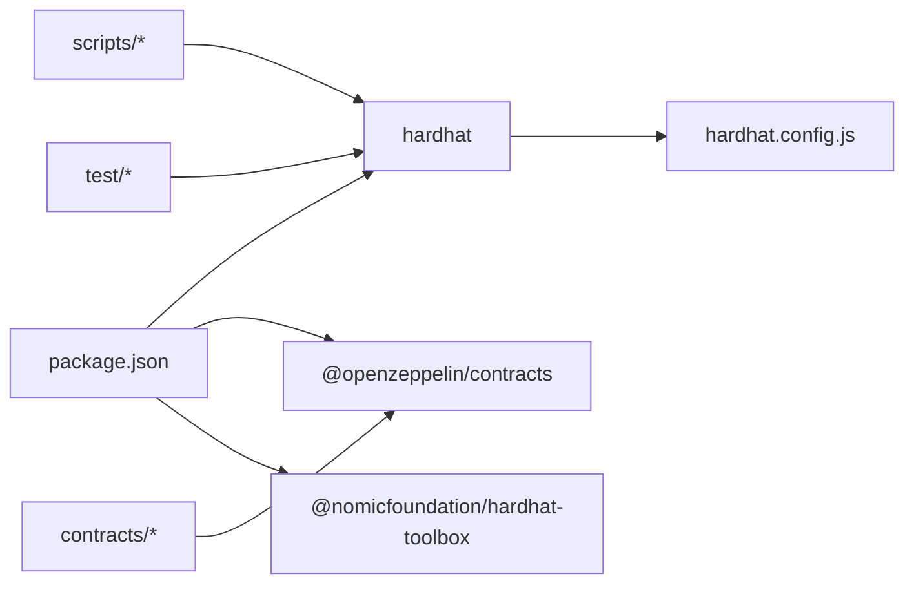

# 故障排除指南

<cite>
**本文引用的文件**
- [hardhat.config.js](file://hardhat.config.js)
- [package.json](file://package.json)
- [deploy.js](file://scripts/deploy.js)
- [deploy-phase3.js](file://scripts/deploy-phase3.js)
- [seed-markets.js](file://scripts/seed-markets.js)
- [resolve.js](file://scripts/resolve.js)
- [export-abi.js](file://scripts/export-abi.js)
- [MarketFactory.test.js](file://test/MarketFactory.test.js)
- [PredictionMarket.test.js](file://test/PredictionMarket.test.js)
- [Phase3.test.js](file://test/Phase3.test.js)
- [DIDRegistry.sol](file://contracts/DIDRegistry.sol)
- [MarketFactory.sol](file://contracts/MarketFactory.sol)
- [MockUSDC.sol](file://contracts/MockUSDC.sol)
- [OracleAdapter.sol](file://contracts/OracleAdapter.sol)
- [PredictionMarket.sol](file://contracts/PredictionMarket.sol)
</cite>

## 目录
1. [简介](#简介)
2. [项目结构](#项目结构)
3. [核心组件](#核心组件)
4. [架构总览](#架构总览)
5. [详细组件分析](#详细组件分析)
6. [依赖关系分析](#依赖关系分析)
7. [性能与Gas优化故障排除](#性能与gas优化故障排除)
8. [故障排除指南](#故障排除指南)
9. [结论](#结论)
10. [附录](#附录)

## 简介
本指南面向开发与运维工程师，聚焦于PredictionDIDSimple_cursor项目在本地开发、测试、部署与运行阶段的常见问题与系统化排障流程。内容涵盖编译错误、部署失败、运行时错误、性能与Gas优化、合约交互问题、日志与调试技巧，以及社区支持与问题反馈最佳实践。

## 项目结构
项目采用Hardhat框架组织，核心目录与职责如下：
- contracts：Solidity合约源码（含接口与实现）
- artifacts：编译产物（ABI、字节码、调试信息）
- cache：编译缓存
- scripts：部署、种子数据、解析、ABI导出等脚本
- test：基于Hardhat的测试用例
- hardhat.config.js：编译器版本、优化器、EVM版本、网络与路径配置
- package.json：脚本命令、开发依赖

图表来源
- [hardhat.config.js](file://hardhat.config.js#L1-L30)
- [package.json](file://package.json#L1-L22)

章节来源
- [hardhat.config.js](file://hardhat.config.js#L1-L30)
- [package.json](file://package.json#L1-L22)

## 核心组件
- 编译与网络配置：指定Solidity版本、优化器runs、EVM版本、本地网络端点与路径映射
- 合约模块：
  - 市场工厂与预测市场（v2）：创建、买卖、结算、争议处理
  - Oracle适配器（v1/v2）：时间锁决议、多签决议、作废市场
  - 模拟USDC：测试代币（6位小数）
  - DID注册表：账户到DID的绑定与解析
- 脚本工具：部署、种子市场、解析、ABI导出
- 测试套件：覆盖市场创建、买卖、结算、多签决议等场景

章节来源
- [MarketFactory.sol](file://contracts/MarketFactory.sol#L1-L60)
- [PredictionMarket.sol](file://contracts/PredictionMarket.sol#L1-L134)
- [OracleAdapter.sol](file://contracts/OracleAdapter.sol#L1-L83)
- [MockUSDC.sol](file://contracts/MockUSDC.sol#L1-L18)
- [DIDRegistry.sol](file://contracts/DIDRegistry.sol#L1-L34)

## 架构总览
下图展示本地部署与交互的关键流程：部署脚本初始化合约、授予角色、生成部署清单；种子脚本批量创建市场；解析脚本通过Oracle触发决议；前端/后端消费ABI进行交互。

图表来源
- [deploy.js](file://scripts/deploy.js#L1-L57)
- [deploy-phase3.js](file://scripts/deploy-phase3.js#L1-L43)
- [seed-markets.js](file://scripts/seed-markets.js#L1-L34)
- [resolve.js](file://scripts/resolve.js#L1-L20)
- [MarketFactory.sol](file://contracts/MarketFactory.sol#L1-L60)
- [OracleAdapter.sol](file://contracts/OracleAdapter.sol#L1-L83)
- [MockUSDC.sol](file://contracts/MockUSDC.sol#L1-L18)

## 详细组件分析

### 组件A：部署与初始化流程
- 入口：npm run deploy:local 或直接调用scripts/deploy.js
- 关键步骤：部署MockUSDC → 部署OracleAdapter → 部署MarketFactory → 设置工厂/授权Oracle → 铸造初始资金 → 写入部署清单
- 常见问题：
  - 未启动本地节点导致连接失败
  - 环境变量缺失（如ORACLE_TIMELOCK_SECONDS）
  - 部署顺序错误或地址为空
  - 权限不足导致无法授权Oracle或设置工厂

图表来源
- [deploy.js](file://scripts/deploy.js#L1-L57)

章节来源
- [deploy.js](file://scripts/deploy.js#L1-L57)

### 组件B：市场创建与交易流程
- 流程：工厂创建市场 → 用户授权代币 → 买入Yes/No → Oracle决议 → 结算/作废
- 关键断言与事件：
  - 市场创建事件与计数递增
  - 买入成功更新池子与余额
  - 决议仅允许Oracle调用
  - 结算仅在已决议或作废状态下允许

图表来源
- [MarketFactory.test.js](file://test/MarketFactory.test.js#L1-L28)
- [PredictionMarket.test.js](file://test/PredictionMarket.test.js#L1-L70)
- [MarketFactory.sol](file://contracts/MarketFactory.sol#L1-L60)
- [PredictionMarket.sol](file://contracts/PredictionMarket.sol#L1-L134)
- [OracleAdapter.sol](file://contracts/OracleAdapter.sol#L1-L83)

章节来源
- [MarketFactory.test.js](file://test/MarketFactory.test.js#L1-L28)
- [PredictionMarket.test.js](file://test/PredictionMarket.test.js#L1-L70)

### 组件C：多签与V3特性（Phase3）
- 多签阈值：需要多个Oracle签名才能执行决议
- V3特性：流动性注入、价格调整、多结果市场
- 关键断言：
  - 单签提案未执行，双签后执行
  - 多结果市场结算逻辑正确
  - CPMM买入推动价格变化

图表来源
- [Phase3.test.js](file://test/Phase3.test.js#L1-L74)
- [OracleAdapter.sol](file://contracts/OracleAdapter.sol#L1-L83)

章节来源
- [Phase3.test.js](file://test/Phase3.test.js#L1-L74)

### 组件D：DID绑定与解析
- 功能：账户绑定DID哈希，验证签名有效性，查询DID
- 常见问题：空DID、签名不匹配、未授权调用

图表来源
- [DIDRegistry.sol](file://contracts/DIDRegistry.sol#L1-L34)

章节来源
- [DIDRegistry.sol](file://contracts/DIDRegistry.sol#L1-L34)

## 依赖关系分析
- 编译与运行时依赖：@nomicfoundation/hardhat-toolbox、@openzeppelin/contracts、hardhat、solidity-coverage
- 脚本依赖：Hardhat运行时环境、文件系统、路径解析
- 合约依赖：OpenZeppelin访问控制、可重入保护、安全转账、数学工具

图表来源
- [package.json](file://package.json#L1-L22)
- [hardhat.config.js](file://hardhat.config.js#L1-L30)

章节来源
- [package.json](file://package.json#L1-L22)
- [hardhat.config.js](file://hardhat.config.js#L1-L30)

## 性能与Gas优化故障排除
- 编译器与优化
  - 版本与EVM：确认solidity版本与目标EVM版本一致，避免兼容性问题
  - 优化器：合理设置runs参数，平衡编译时间与运行时Gas
- 合约层面
  - 使用安全转账与不可重入保护，减少回滚与重试成本
  - 合理的数据结构布局，降低存储读写次数
  - 在批量操作中合并事务，减少链上往返
- 测试与覆盖率
  - 使用覆盖率工具定位热点路径，识别冗余计算
  - 在测试中模拟高负载场景，验证Gas上限与失败分支

章节来源
- [hardhat.config.js](file://hardhat.config.js#L7-L13)
- [package.json](file://package.json#L15-L20)

## 故障排除指南

### 一、编译错误
- 症状：编译失败、找不到合约、版本不匹配
- 排查步骤：
  - 确认Solidity版本与编译器插件版本一致
  - 清理缓存后重新编译
  - 检查导入路径是否正确
- 相关文件
  - [hardhat.config.js](file://hardhat.config.js#L7-L13)
  - [package.json](file://package.json#L15-L20)

章节来源
- [hardhat.config.js](file://hardhat.config.js#L7-L13)
- [package.json](file://package.json#L15-L20)

### 二、部署失败
- 症状：连接本地节点失败、权限不足、地址为零
- 排查步骤：
  - 启动本地节点并确认URL可达
  - 检查环境变量（如ORACLE_TIMELOCK_SECONDS、ORACLE_MULTISIG_THRESHOLD）
  - 确保部署脚本按顺序执行，且各合约地址有效
- 相关文件
  - [deploy.js](file://scripts/deploy.js#L1-L57)
  - [deploy-phase3.js](file://scripts/deploy-phase3.js#L1-L43)
  - [hardhat.config.js](file://hardhat.config.js#L14-L22)

章节来源
- [deploy.js](file://scripts/deploy.js#L1-L57)
- [deploy-phase3.js](file://scripts/deploy-phase3.js#L1-L43)
- [hardhat.config.js](file://hardhat.config.js#L14-L22)

### 三、运行时错误
- 常见错误类型与定位：
  - 权限错误：仅Oracle可决议，检查角色授权
  - 时间锁未到期：确认时间锁延迟与当前区块时间
  - 市场状态不符：仅开放市场可交易/决议
  - 已结算重复结算：检查已结算标记
- 定位方法：
  - 查看事件日志（MarketCreated、Bought、Resolved、Claimed、OracleResolveRequested/Confirmed）
  - 使用测试用例复现最小可复现场景
- 相关文件
  - [PredictionMarket.test.js](file://test/PredictionMarket.test.js#L1-L70)
  - [MarketFactory.test.js](file://test/MarketFactory.test.js#L1-L28)
  - [OracleAdapter.sol](file://contracts/OracleAdapter.sol#L48-L75)
  - [PredictionMarket.sol](file://contracts/PredictionMarket.sol#L83-L113)

章节来源
- [PredictionMarket.test.js](file://test/PredictionMarket.test.js#L1-L70)
- [MarketFactory.test.js](file://test/MarketFactory.test.js#L1-L28)
- [OracleAdapter.sol](file://contracts/OracleAdapter.sol#L48-L75)
- [PredictionMarket.sol](file://contracts/PredictionMarket.sol#L83-L113)

### 四、合约交互问题
- 问题：解析脚本无法决议、种子脚本报“请先部署”
- 排查步骤：
  - 确认部署清单存在且包含工厂地址
  - 指定MARKET_ADDRESS与WINNING_OUTCOME环境变量
  - 验证Oracle角色已授权
- 相关文件
  - [seed-markets.js](file://scripts/seed-markets.js#L1-L34)
  - [resolve.js](file://scripts/resolve.js#L1-L20)
  - [OracleAdapter.sol](file://contracts/OracleAdapter.sol#L44-L46)

章节来源
- [seed-markets.js](file://scripts/seed-markets.js#L1-L34)
- [resolve.js](file://scripts/resolve.js#L1-L20)
- [OracleAdapter.sol](file://contracts/OracleAdapter.sol#L44-L46)

### 五、日志与调试技巧
- 日志输出：
  - 部署脚本打印部署清单与关键地址
  - 种子脚本打印创建的市场与计数
  - 解析脚本打印决议结果
- 调试建议：
  - 使用Hardhat Network Helpers管理时间推进
  - 在测试中逐步断言中间状态与事件
  - 对比ABI导出一致性，确保前后端一致

章节来源
- [deploy.js](file://scripts/deploy.js#L36-L50)
- [seed-markets.js](file://scripts/seed-markets.js#L21-L27)
- [resolve.js](file://scripts/resolve.js#L11-L13)

### 六、ABI导出与集成
- 导出流程：从artifacts读取ABI与字节码，分别写入后端与前端目录
- 常见问题：未编译导致artifact缺失
- 相关文件
  - [export-abi.js](file://scripts/export-abi.js#L1-L68)

章节来源
- [export-abi.js](file://scripts/export-abi.js#L1-L68)

### 七、性能与Gas优化
- 优化策略：
  - 合理设置optimizer runs，平衡体积与Gas
  - 减少存储读写与分支复杂度
  - 合批处理与合并事务
- 测试验证：
  - 使用覆盖率工具定位热点
  - 在测试中模拟高负载路径

章节来源
- [hardhat.config.js](file://hardhat.config.js#L9-L12)
- [package.json](file://package.json#L15-L20)

### 八、社区支持与问题反馈
- 获取帮助渠道：
  - Hardhat官方文档与社区论坛
  - OpenZeppelin文档与GitHub讨论区
  - 以太坊Stack Exchange与相关技术群组
- 问题报告最佳实践：
  - 提供最小可复现场景（脚本/测试用例）
  - 附带编译配置、网络配置与版本信息
  - 明确期望行为与实际行为差异
  - 分离编译、部署、运行三个阶段的日志

## 结论
本指南提供了从编译、部署到运行与性能优化的全链路故障排除方法。建议在日常开发中：
- 将部署与交互流程脚本化并纳入CI
- 以测试驱动定位边界条件与错误分支
- 建立统一的ABI导出与版本管理机制
- 基于日志与事件构建可观测性体系

## 附录

### A. 常用命令速查
- 编译：npm run compile
- 本地节点：npm run node
- 单元测试：npm run test
- 部署本地：npm run deploy:local
- 种子市场：npm run seed:local
- 解析市场：npm run resolve:local
- 生成ABI：npm run export-abi
- 代码覆盖率：npm run coverage

章节来源
- [package.json](file://package.json#L5-L14)

### B. 关键配置项对照
- Solidity版本与EVM：确保与链上目标一致
- 优化器runs：根据部署频率与交易量权衡
- 网络端点：localhost与外部RPC的一致性
- 路径映射：sources/tests/cache/artifacts

章节来源
- [hardhat.config.js](file://hardhat.config.js#L7-L29)