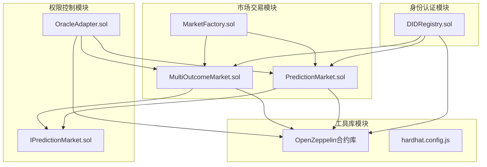
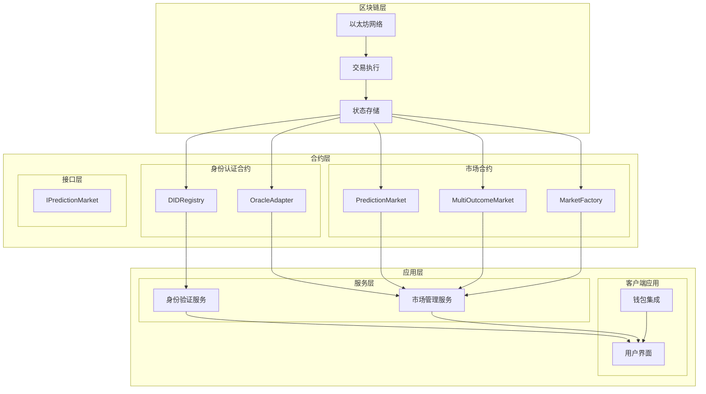
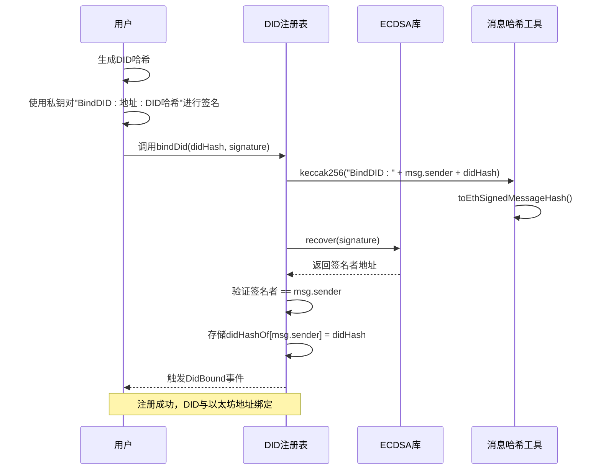
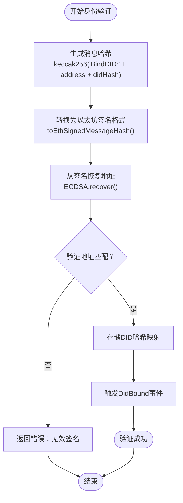
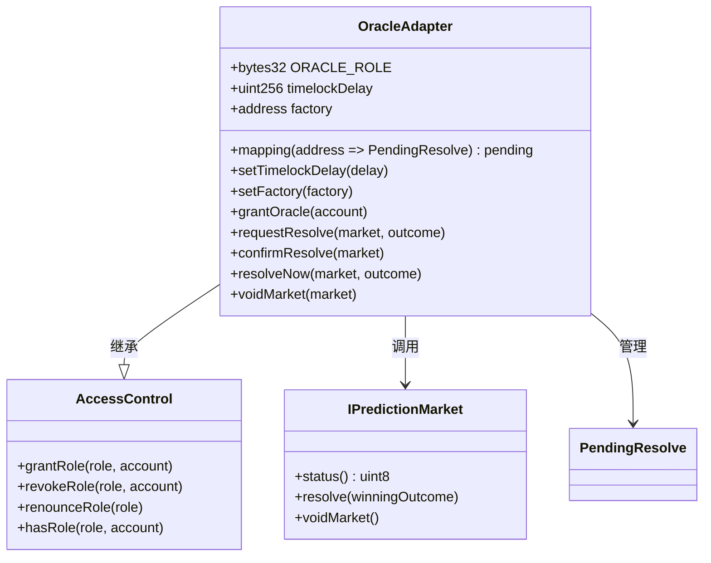
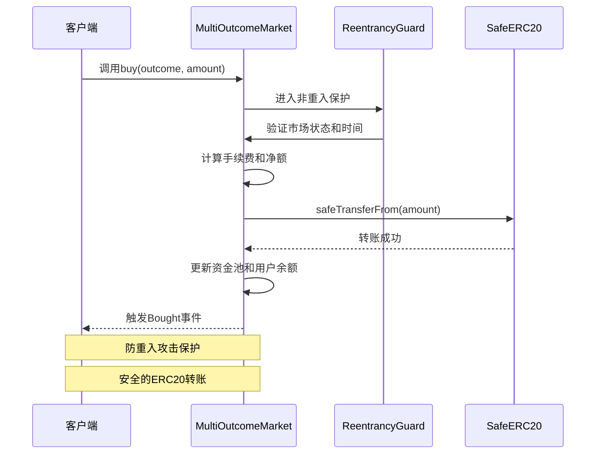
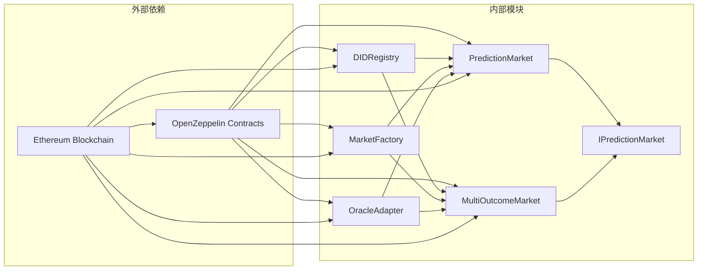

# DID认证架构

<cite>
**本文档引用的文件**
- [DIDRegistry.sol](file://contracts/contracts/DIDRegistry.sol)
- [PredictionMarket.sol](file://contracts/contracts/PredictionMarket.sol)
- [MultiOutcomeMarket.sol](file://contracts/contracts/MultiOutcomeMarket.sol)
- [MarketFactory.sol](file://contracts/contracts/MarketFactory.sol)
- [OracleAdapter.sol](file://contracts/contracts/OracleAdapter.sol)
- [IPredictionMarket.sol](file://contracts/contracts/interfaces/IPredictionMarket.sol)
- [DIDRegistry.json](file://artifacts/contracts/DIDRegistry.sol/DIDRegistry.json)
- [hardhat.config.js](file://hardhat.config.js)
- [deploy.js](file://scripts/deploy.js)
</cite>

## 目录
1. [引言](#引言)
2. [项目结构](#项目结构)
3. [核心组件](#核心组件)
4. [架构概览](#架构概览)
5. [详细组件分析](#详细组件分析)
6. [依赖关系分析](#依赖关系分析)
7. [性能考虑](#性能考虑)
8. [故障排除指南](#故障排除指南)
9. [结论](#结论)
10. [附录](#附录)

## 引言

本项目是一个基于以太坊的DID（去中心化身份）认证系统，专为预测市场设计。该系统实现了完整的DID注册、验证和权限控制机制，为预测市场提供了可信的身份基础设施。

系统采用模块化架构设计，包含以下核心功能：
- DID哈希绑定和解析
- 多种预测市场类型支持
- 基于角色的访问控制
- 时间锁机制确保交易安全性
- 互池式投注机制

## 项目结构

项目采用按功能模块组织的结构，主要包含四个核心模块：

**图表来源**
- [DIDRegistry.sol:1-39](file://contracts/contracts/DIDRegistry.sol#L1-L39)
- [PredictionMarket.sol:1-145](file://contracts/contracts/PredictionMarket.sol#L1-L145)
- [MultiOutcomeMarket.sol:1-124](file://contracts/contracts/MultiOutcomeMarket.sol#L1-L124)
- [MarketFactory.sol:1-68](file://contracts/contracts/MarketFactory.sol#L1-L68)
- [OracleAdapter.sol:1-96](file://contracts/contracts/OracleAdapter.sol#L1-L96)

**章节来源**
- [DIDRegistry.sol:1-39](file://contracts/contracts/DIDRegistry.sol#L1-L39)
- [hardhat.config.js:1-33](file://hardhat.config.js#L1-L33)

## 核心组件

### DID注册表组件

DID注册表是整个系统的核心身份认证组件，负责管理去中心化身份的注册和验证。

**主要特性：**
- 基于ECDSA的数字签名验证
- 唯一的地址到DID哈希映射
- 不可篡改的身份绑定记录
- 事件驱动的身份变更通知

**数据结构：**
- `didHashOf`: 映射地址到DID哈希的存储结构
- 支持DID绑定和解析操作

**章节来源**
- [DIDRegistry.sol:16-37](file://contracts/contracts/DIDRegistry.sol#L16-L37)
- [DIDRegistry.json:99-172](file://artifacts/contracts/DIDRegistry.sol/DIDRegistry.json#L99-L172)

### 预测市场组件

系统支持两种类型的预测市场：二元市场和多结果市场，都采用互池式投注机制。

**二元预测市场特性：**
- 简化的Yes/No投注选项
- 直观的资金池分配机制
- 标准的市场生命周期管理

**多结果预测市场特性：**
- 支持2-8个结果的复杂市场
- 可配置的手续费结构
- 增强的重入攻击防护

**章节来源**
- [PredictionMarket.sol:14-41](file://contracts/contracts/PredictionMarket.sol#L14-L41)
- [MultiOutcomeMarket.sol:15-36](file://contracts/contracts/MultiOutcomeMarket.sol#L15-L36)

### 权限控制系统

Oracle适配器实现了基于角色的访问控制，确保只有授权实体可以执行关键操作。

**角色管理：**
- DEFAULT_ADMIN_ROLE：默认管理员角色
- ORACLE_ROLE：预言机操作角色
- 动态角色授予和撤销机制

**安全特性：**
- 时间锁机制防止恶意操作
- 交易确认流程确保操作安全性
- 严格的输入验证和状态检查

**章节来源**
- [OracleAdapter.sol:11-24](file://contracts/contracts/OracleAdapter.sol#L11-L24)
- [OracleAdapter.sol:57-94](file://contracts/contracts/OracleAdapter.sol#L57-L94)

## 架构概览

系统采用分层架构设计，从底层的区块链基础设施到上层的应用服务形成完整的身份认证生态系统。

**图表来源**
- [DIDRegistry.sol:12](file://contracts/contracts/DIDRegistry.sol#L12)
- [OracleAdapter.sol:11](file://contracts/contracts/OracleAdapter.sol#L11)
- [PredictionMarket.sol:11](file://contracts/contracts/PredictionMarket.sol#L11)
- [MultiOutcomeMarket.sol:12](file://contracts/contracts/MultiOutcomeMarket.sol#L12)
- [MarketFactory.sol:12](file://contracts/contracts/MarketFactory.sol#L12)

## 详细组件分析

### DID注册流程

DID注册流程是身份认证系统的核心，确保用户身份的唯一性和不可伪造性。

**图表来源**
- [DIDRegistry.sol:23-32](file://contracts/contracts/DIDRegistry.sol#L23-L32)
- [DIDRegistry.sol:25-27](file://contracts/contracts/DIDRegistry.sol#L25-L27)
- [DIDRegistry.sol:28](file://contracts/contracts/DIDRegistry.sol#L28)

**流程特点：**
- 双重验证机制：哈希验证和签名验证
- 不可逆的绑定过程
- 透明的事件记录
- 完全去中心化的信任模型

**章节来源**
- [DIDRegistry.sol:22-32](file://contracts/contracts/DIDRegistry.sol#L22-L32)

### 身份验证算法

系统采用标准的以太坊签名验证算法，确保身份认证的安全性和可靠性。

**图表来源**
- [DIDRegistry.sol:25-29](file://contracts/contracts/DIDRegistry.sol#L25-L29)

**算法优势：**
- 基于椭圆曲线密码学的标准安全性
- 与以太坊原生兼容的签名格式
- 防止重放攻击的消息绑定机制
- 完全透明的验证过程

**章节来源**
- [DIDRegistry.sol:13-14](file://contracts/contracts/DIDRegistry.sol#L13-L14)

### 市场权限系统集成

系统通过Oracle适配器实现了灵活的权限控制机制，支持多种操作模式。

**图表来源**
- [OracleAdapter.sol:11-94](file://contracts/contracts/OracleAdapter.sol#L11-L94)
- [IPredictionMarket.sol:7-14](file://contracts/contracts/interfaces/IPredictionMarket.sol#L7-L14)

**权限控制策略：**
- 基于角色的细粒度权限管理
- 时间锁机制确保操作安全性
- 动态角色授予和撤销能力
- 透明的操作审计日志

**章节来源**
- [OracleAdapter.sol:35-45](file://contracts/contracts/OracleAdapter.sol#L35-L45)

### 预测市场访问控制

多结果市场实现了增强的访问控制和安全机制。

**图表来源**
- [MultiOutcomeMarket.sol:73-82](file://contracts/contracts/MultiOutcomeMarket.sol#L73-L82)
- [MultiOutcomeMarket.sol:12](file://contracts/contracts/MultiOutcomeMarket.sol#L12)

**安全特性：**
- ReentrancyGuard防止重入攻击
- SafeERC20确保安全的代币转账
- 严格的状态验证和输入检查
- 完整的事件记录和审计追踪

**章节来源**
- [MultiOutcomeMarket.sol:12-13](file://contracts/contracts/MultiOutcomeMarket.sol#L12-L13)

## 依赖关系分析

系统采用模块化设计，各组件之间的依赖关系清晰明确。

**图表来源**
- [DIDRegistry.sol:6-8](file://contracts/contracts/DIDRegistry.sol#L6-L8)
- [PredictionMarket.sol:6-7](file://contracts/contracts/PredictionMarket.sol#L6-L7)
- [MultiOutcomeMarket.sol:6-8](file://contracts/contracts/MultiOutcomeMarket.sol#L6-L8)
- [MarketFactory.sol:6-8](file://contracts/contracts/MarketFactory.sol#L6-L8)
- [OracleAdapter.sol:6](file://contracts/contracts/OracleAdapter.sol#L6)

**依赖特点：**
- 标准化的OpenZeppelin合约库集成
- 最小化的内部耦合度
- 清晰的接口定义和实现分离
- 可扩展的模块化架构

**章节来源**
- [DIDRegistry.sol:6-8](file://contracts/contracts/DIDRegistry.sol#L6-L8)
- [hardhat.config.js:10-16](file://hardhat.config.js#L10-L16)

## 性能考虑

系统在设计时充分考虑了性能优化和资源效率。

**Gas费用优化：**
- 简化的存储结构减少写入成本
- 批量操作支持降低交易开销
- 高效的数据压缩和编码方案

**可扩展性设计：**
- 模块化架构支持独立扩展
- 可插拔的市场类型支持
- 灵活的权限控制机制

**安全性保障：**
- 多层验证机制防止攻击
- 时间锁机制确保操作安全
- 完善的错误处理和回滚机制

## 故障排除指南

### 常见问题诊断

**DID注册失败：**
- 检查签名是否有效且未过期
- 验证DID哈希格式正确性
- 确认账户余额充足支付Gas费用

**市场操作异常：**
- 验证市场状态是否为Open
- 检查截止时间是否已过
- 确认Oracle权限是否正确配置

**权限访问被拒绝：**
- 验证角色授予状态
- 检查时间锁是否已过期
- 确认操作权限是否正确

**章节来源**
- [DIDRegistry.sol:24-29](file://contracts/contracts/DIDRegistry.sol#L24-L29)
- [PredictionMarket.sol:71-88](file://contracts/contracts/PredictionMarket.sol#L71-L88)
- [OracleAdapter.sol:57-78](file://contracts/contracts/OracleAdapter.sol#L57-L78)

## 结论

本DID认证系统为预测市场提供了一个完整、安全、可扩展的身份认证解决方案。通过去中心化身份管理和基于角色的权限控制，系统实现了可信的身份验证和访问控制机制。

**核心优势：**
- 完全去中心化的身份验证
- 灵活的权限控制和时间锁机制
- 高效的互池式市场运作
- 完善的安全防护和审计功能

**技术特色：**
- 基于标准ECDSA算法的签名验证
- 模块化设计支持功能扩展
- 透明的事件记录便于审计
- 与以太坊生态系统的完全兼容

该系统为预测市场的可信运营提供了坚实的技术基础，支持各种复杂的金融应用场景。

## 附录

### 部署配置

系统使用Hardhat作为开发和部署框架，配置了优化的编译参数和网络设置。

**编译器配置：**
- Solidity版本：0.8.24
- 优化器启用：200次运行
- EVM版本：Cancun

**网络配置：**
- 默认本地网络：localhost:8545
- 链ID：31337
- 开发环境：Hardhat内置网络

**章节来源**
- [hardhat.config.js:10-25](file://hardhat.config.js#L10-L25)

### 部署流程

系统提供自动化部署脚本，支持一键部署完整的DID认证和预测市场基础设施。

**部署步骤：**
1. 部署MockUSDC代币合约
2. 部署DID注册表合约
3. 部署Oracle适配器合约
4. 部署市场工厂合约
5. 配置权限和初始参数
6. 进行系统集成测试

**章节来源**
- [deploy.js:22-48](file://scripts/deploy.js#L22-L48)