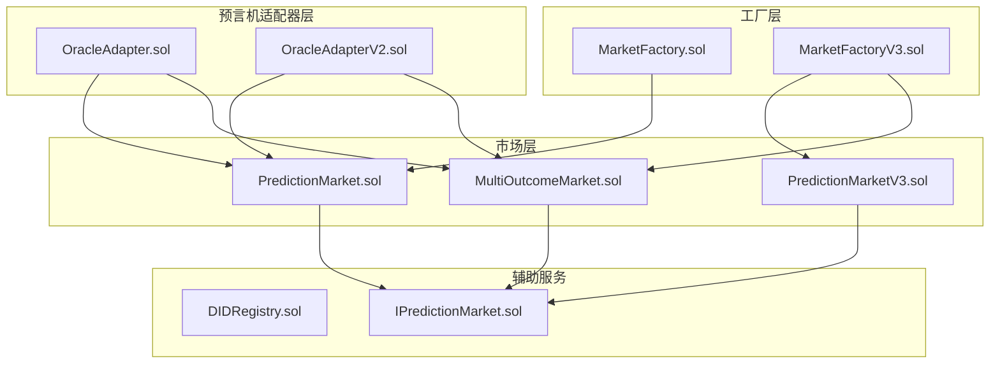
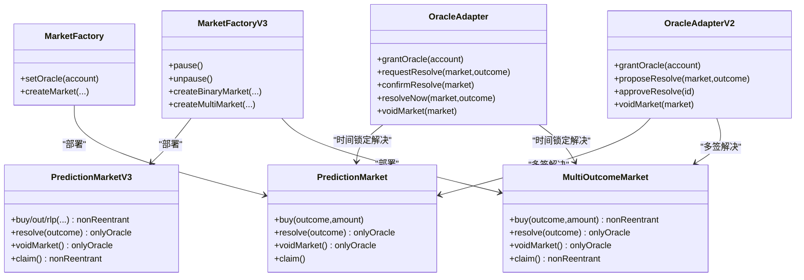
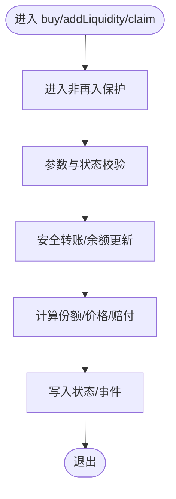
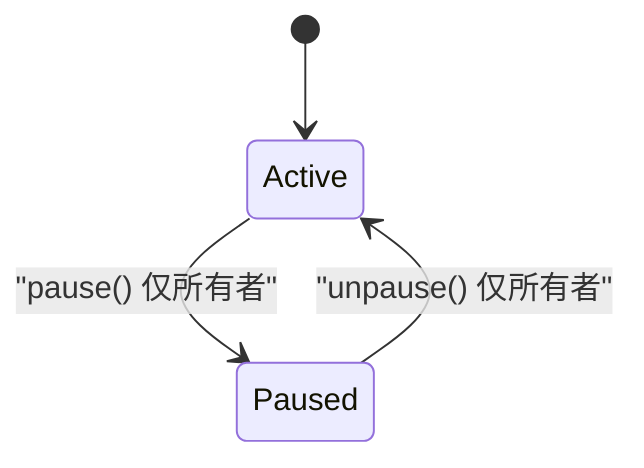
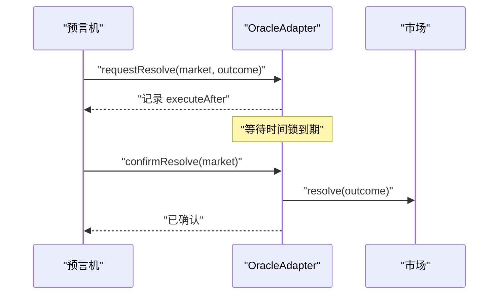
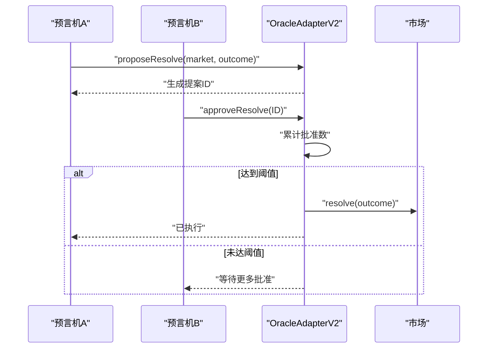
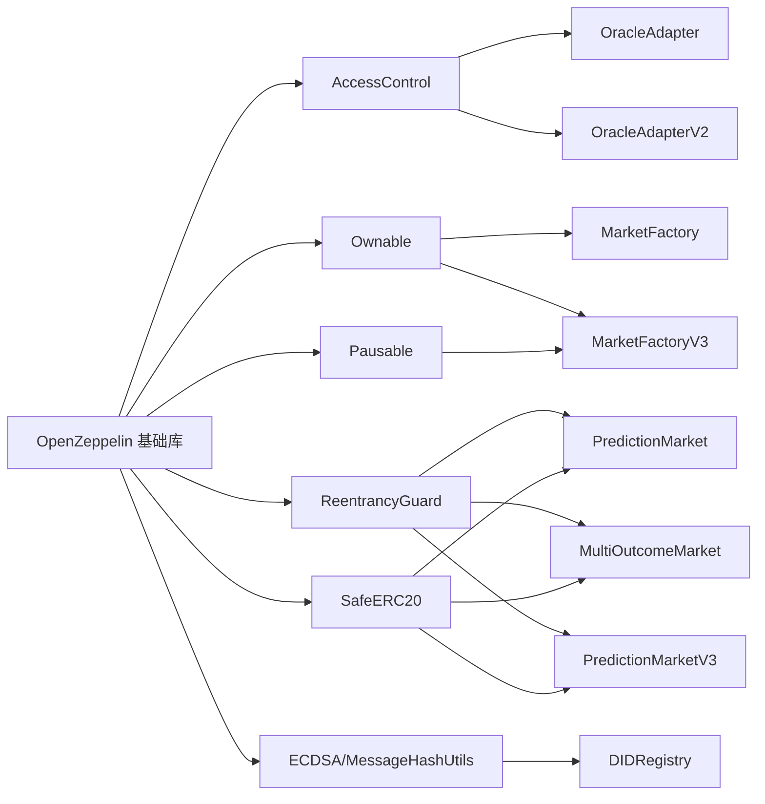

# 安全架构框架

<cite>
**本文档引用的文件**
- [PredictionMarket.sol](file://contracts/contracts/PredictionMarket.sol)
- [OracleAdapter.sol](file://contracts/contracts/OracleAdapter.sol)
- [MarketFactory.sol](file://contracts/contracts/MarketFactory.sol)
- [DIDRegistry.sol](file://contracts/contracts/DIDRegistry.sol)
- [IPredictionMarket.sol](file://contracts/contracts/interfaces/IPredictionMarket.sol)
- [MultiOutcomeMarket.sol](file://contracts/contracts/MultiOutcomeMarket.sol)
- [OracleAdapterV2.sol](file://contracts/contracts/OracleAdapterV2.sol)
- [MarketFactoryV3.sol](file://contracts/contracts/MarketFactoryV3.sol)
- [PredictionMarketV3.sol](file://contracts/contracts/PredictionMarketV3.sol)
- [hardhat.config.js](file://contracts/hardhat.config.js)
- [PredictionMarket.test.js](file://contracts/test/PredictionMarket.test.js)
- [OracleAdapter.test.js](file://contracts/test/OracleAdapter.test.js)
- [package.json](file://contracts/package.json)
- [deploy.js](file://contracts/scripts/deploy.js)
- [seed-markets.js](file://contracts/scripts/seed-markets.js)
</cite>

## 目录
1. [引言](#引言)
2. [项目结构](#项目结构)
3. [核心组件](#核心组件)
4. [架构总览](#架构总览)
5. [详细组件分析](#详细组件分析)
6. [依赖关系分析](#依赖关系分析)
7. [性能考量](#性能考量)
8. [故障排除指南](#故障排除指南)
9. [结论](#结论)
10. [附录](#附录)

## 引言
本文件构建预测市场系统的安全架构框架，系统性阐述访问控制、重入攻击防护、暂停机制、权限分离、时间锁定机制、多签名共识等多重安全机制的设计理念与实现策略。文档同时覆盖信任模型、激励与经济安全设计，提供威胁分析、防护策略、应急响应机制、安全审计清单与最佳实践，并解释安全架构与业务逻辑之间的平衡与取舍。

## 项目结构
该仓库采用按功能模块划分的组织方式，核心合约围绕“工厂-市场-预言机适配器”三层结构展开，配合可选的DID绑定与测试脚本，形成从部署到运营的完整链上基础设施。



图表来源
- [MarketFactory.sol](file://contracts/contracts/MarketFactory.sol#L1-L60)
- [MarketFactoryV3.sol](file://contracts/contracts/MarketFactoryV3.sol#L1-L94)
- [PredictionMarket.sol](file://contracts/contracts/PredictionMarket.sol#L1-L134)
- [PredictionMarketV3.sol](file://contracts/contracts/PredictionMarketV3.sol#L1-L200)
- [MultiOutcomeMarket.sol](file://contracts/contracts/MultiOutcomeMarket.sol#L1-L113)
- [OracleAdapter.sol](file://contracts/contracts/OracleAdapter.sol#L1-L83)
- [OracleAdapterV2.sol](file://contracts/contracts/OracleAdapterV2.sol#L1-L83)
- [DIDRegistry.sol](file://contracts/contracts/DIDRegistry.sol#L1-L34)
- [IPredictionMarket.sol](file://contracts/contracts/interfaces/IPredictionMarket.sol#L1-L9)

章节来源
- [MarketFactory.sol](file://contracts/contracts/MarketFactory.sol#L1-L60)
- [MarketFactoryV3.sol](file://contracts/contracts/MarketFactoryV3.sol#L1-L94)
- [PredictionMarket.sol](file://contracts/contracts/PredictionMarket.sol#L1-L134)
- [PredictionMarketV3.sol](file://contracts/contracts/PredictionMarketV3.sol#L1-L200)
- [MultiOutcomeMarket.sol](file://contracts/contracts/MultiOutcomeMarket.sol#L1-L113)
- [OracleAdapter.sol](file://contracts/contracts/OracleAdapter.sol#L1-L83)
- [OracleAdapterV2.sol](file://contracts/contracts/OracleAdapterV2.sol#L1-L83)
- [DIDRegistry.sol](file://contracts/contracts/DIDRegistry.sol#L1-L34)
- [IPredictionMarket.sol](file://contracts/contracts/interfaces/IPredictionMarket.sol#L1-L9)

## 核心组件
- 市场合约（二元/多结果）：负责交易、流动性、结算与赔付，内置状态机与访问控制。
- 预言机适配器（V1/V2）：提供时间锁定与多签共识，隔离执行权限与决策权限。
- 工厂合约：集中管理部署、参数与暂停能力，实现权限分离与治理。
- DID注册：可选的身份绑定，增强可审计性与跨链互操作基础。
- 接口契约：统一外部交互入口，确保多版本兼容与一致性。

章节来源
- [PredictionMarket.sol](file://contracts/contracts/PredictionMarket.sol#L1-L134)
- [MultiOutcomeMarket.sol](file://contracts/contracts/MultiOutcomeMarket.sol#L1-L113)
- [PredictionMarketV3.sol](file://contracts/contracts/PredictionMarketV3.sol#L1-L200)
- [OracleAdapter.sol](file://contracts/contracts/OracleAdapter.sol#L1-L83)
- [OracleAdapterV2.sol](file://contracts/contracts/OracleAdapterV2.sol#L1-L83)
- [MarketFactory.sol](file://contracts/contracts/MarketFactory.sol#L1-L60)
- [MarketFactoryV3.sol](file://contracts/contracts/MarketFactoryV3.sol#L1-L94)
- [DIDRegistry.sol](file://contracts/contracts/DIDRegistry.sol#L1-L34)
- [IPredictionMarket.sol](file://contracts/contracts/interfaces/IPredictionMarket.sol#L1-L9)

## 架构总览
预测市场的安全架构以“权限分层 + 决策执行分离 + 多重防护”为核心原则，通过OpenZeppelin安全基元与自定义适配器实现：

- 访问控制：基于角色的权限（AccessControl）与所有权（Ownable），限定关键操作仅由授权主体执行。
- 重入防护：在关键函数中启用非再入保护，避免递归调用导致的资金损失。
- 暂停机制：工厂层支持暂停/恢复，用于紧急处置与升级窗口。
- 权限分离：预言机仅能发起请求，实际执行需满足时间锁定或多签阈值。
- 时间锁定：阻止即时结算，为市场参与者与监管者提供观察期。
- 多签名共识：提升决策抗审查与抗单点故障能力。
- 经济安全：通过费用、上限与CPMM机制对冲市场操纵与流动性风险。

```mermaid
sequenceDiagram
participant U as "用户"
participant F as "工厂(Ownable/Pausable)"
participant M as "市场(ReentrancyGuard)"
participant OA as "预言机适配器(AccessControl)"
participant OAV2 as "多签适配器(AccessControl)"
U->>F : "创建市场(仅所有者/暂停时不可用)"
F-->>U : "返回市场地址"
U->>M : "购买/添加流动性(仅开放且未结束)"
M-->>U : "确认交易与份额"
Note over OA,OAV2 : "结算阶段"
OA->>M : "请求解决(时间锁定)"
OA->>OA : "等待时间锁定到期"
OA->>M : "确认解决(执行)"
或
OAV2->>OAV2 : "提案并投票(达到阈值)"
OAV2->>M : "执行解决"
```

图表来源
- [MarketFactory.sol](file://contracts/contracts/MarketFactory.sol#L1-L60)
- [MarketFactoryV3.sol](file://contracts/contracts/MarketFactoryV3.sol#L1-L94)
- [OracleAdapter.sol](file://contracts/contracts/OracleAdapter.sol#L1-L83)
- [OracleAdapterV2.sol](file://contracts/contracts/OracleAdapterV2.sol#L1-L83)
- [PredictionMarket.sol](file://contracts/contracts/PredictionMarket.sol#L1-L134)
- [MultiOutcomeMarket.sol](file://contracts/contracts/MultiOutcomeMarket.sol#L1-L113)
- [PredictionMarketV3.sol](file://contracts/contracts/PredictionMarketV3.sol#L1-L200)

## 详细组件分析

### 访问控制与权限分离
- Ownable/AccessControl：工厂与适配器使用默认管理员与角色，限制配置变更与关键操作。
- onlyOracle修饰符：市场合约仅允许指定预言机地址调用结算/作废。
- 角色授予：管理员可向多个账户授予ORACLE_ROLE，实现去中心化的决策节点集合。



图表来源
- [MarketFactory.sol](file://contracts/contracts/MarketFactory.sol#L1-L60)
- [MarketFactoryV3.sol](file://contracts/contracts/MarketFactoryV3.sol#L1-L94)
- [OracleAdapter.sol](file://contracts/contracts/OracleAdapter.sol#L1-L83)
- [OracleAdapterV2.sol](file://contracts/contracts/OracleAdapterV2.sol#L1-L83)
- [PredictionMarket.sol](file://contracts/contracts/PredictionMarket.sol#L1-L134)
- [MultiOutcomeMarket.sol](file://contracts/contracts/MultiOutcomeMarket.sol#L1-L113)
- [PredictionMarketV3.sol](file://contracts/contracts/PredictionMarketV3.sol#L1-L200)

章节来源
- [MarketFactory.sol](file://contracts/contracts/MarketFactory.sol#L1-L60)
- [MarketFactoryV3.sol](file://contracts/contracts/MarketFactoryV3.sol#L1-L94)
- [OracleAdapter.sol](file://contracts/contracts/OracleAdapter.sol#L1-L83)
- [OracleAdapterV2.sol](file://contracts/contracts/OracleAdapterV2.sol#L1-L83)
- [PredictionMarket.sol](file://contracts/contracts/PredictionMarket.sol#L1-L134)
- [MultiOutcomeMarket.sol](file://contracts/contracts/MultiOutcomeMarket.sol#L1-L113)
- [PredictionMarketV3.sol](file://contracts/contracts/PredictionMarketV3.sol#L1-L200)

### 重入攻击防护
- ReentrancyGuard：在二元与多结果市场、V3市场中广泛使用，确保买/流动性操作的原子性。
- SafeERC20：在转账前进行代币安全检查，降低失败回滚与重入风险。



图表来源
- [MultiOutcomeMarket.sol](file://contracts/contracts/MultiOutcomeMarket.sol#L1-L113)
- [PredictionMarketV3.sol](file://contracts/contracts/PredictionMarketV3.sol#L1-L200)
- [PredictionMarket.sol](file://contracts/contracts/PredictionMarket.sol#L1-L134)

章节来源
- [MultiOutcomeMarket.sol](file://contracts/contracts/MultiOutcomeMarket.sol#L1-L113)
- [PredictionMarketV3.sol](file://contracts/contracts/PredictionMarketV3.sol#L1-L200)
- [PredictionMarket.sol](file://contracts/contracts/PredictionMarket.sol#L1-L134)

### 暂停机制
- Pausable：工厂V3引入暂停/恢复，仅所有者可触发，用于紧急处置与升级窗口。
- 与onlyOwner结合：确保只有受信任方可在极端情况下中断市场活动。



图表来源
- [MarketFactoryV3.sol](file://contracts/contracts/MarketFactoryV3.sol#L1-L94)

章节来源
- [MarketFactoryV3.sol](file://contracts/contracts/MarketFactoryV3.sol#L1-L94)

### 权限分离与时间锁定
- OracleAdapter（V1）：请求-确认两段式，请求时记录执行时间，确认时必须超过时间锁。
- resolveNow：当时间锁为0时走快速通道，否则必须等待。
- voidMarket：在开放状态下作废市场，保障用户资金可退回。



图表来源
- [OracleAdapter.sol](file://contracts/contracts/OracleAdapter.sol#L1-L83)
- [PredictionMarket.sol](file://contracts/contracts/PredictionMarket.sol#L1-L134)

章节来源
- [OracleAdapter.sol](file://contracts/contracts/OracleAdapter.sol#L1-L83)
- [PredictionMarket.sol](file://contracts/contracts/PredictionMarket.sol#L1-L134)

### 多签名共识
- OracleAdapterV2：提案-投票-执行三段式，达到阈值后自动执行。
- 支持多ORACLE_ROLE持有者参与，降低单点故障风险，提升抗审查能力。



图表来源
- [OracleAdapterV2.sol](file://contracts/contracts/OracleAdapterV2.sol#L1-L83)
- [PredictionMarket.sol](file://contracts/contracts/PredictionMarket.sol#L1-L134)

章节来源
- [OracleAdapterV2.sol](file://contracts/contracts/OracleAdapterV2.sol#L1-L83)
- [PredictionMarket.sol](file://contracts/contracts/PredictionMarket.sol#L1-L134)

### 经济安全与激励
- 费用与上限：V3市场支持费用基点与单用户最大投注上限，抑制过度投机与操纵。
- CPMM与流动性：V3采用常数乘法做市商模型，通过流动性池稳定价格发现。
- 双重安全：状态机（Open/Resolved/Voided）与访问控制共同保证结算顺序与资金安全。

章节来源
- [PredictionMarketV3.sol](file://contracts/contracts/PredictionMarketV3.sol#L1-L200)
- [MultiOutcomeMarket.sol](file://contracts/contracts/MultiOutcomeMarket.sol#L1-L113)

### DID绑定与可审计性
- DIDRegistry：支持账户与DID哈希绑定，便于跨链溯源与合规审计。
- 签名验证：通过消息哈希与ECDSA恢复签名者，确保绑定真实性。

章节来源
- [DIDRegistry.sol](file://contracts/contracts/DIDRegistry.sol#L1-L34)

## 依赖关系分析
- OpenZeppelin依赖：AccessControl、Ownable、Pausable、ReentrancyGuard、SafeERC20、ECDSA、MessageHashUtils。
- 合约间耦合：工厂负责部署与参数管理；适配器负责结算流程的权限与时间/多签约束；市场负责业务逻辑与状态机。
- 测试与脚本：通过Hardhat测试与部署脚本验证安全机制与业务流程。



图表来源
- [OracleAdapter.sol](file://contracts/contracts/OracleAdapter.sol#L1-L83)
- [OracleAdapterV2.sol](file://contracts/contracts/OracleAdapterV2.sol#L1-L83)
- [MarketFactory.sol](file://contracts/contracts/MarketFactory.sol#L1-L60)
- [MarketFactoryV3.sol](file://contracts/contracts/MarketFactoryV3.sol#L1-L94)
- [PredictionMarket.sol](file://contracts/contracts/PredictionMarket.sol#L1-L134)
- [MultiOutcomeMarket.sol](file://contracts/contracts/MultiOutcomeMarket.sol#L1-L113)
- [PredictionMarketV3.sol](file://contracts/contracts/PredictionMarketV3.sol#L1-L200)
- [DIDRegistry.sol](file://contracts/contracts/DIDRegistry.sol#L1-L34)

章节来源
- [hardhat.config.js](file://contracts/hardhat.config.js#L1-L30)
- [package.json](file://contracts/package.json#L1-L22)

## 性能考量
- 编译优化：启用编译器优化器与EVM版本配置，平衡Gas消耗与代码大小。
- Gas效率：SafeERC20与非再入保护减少失败回滚成本；CPMM计算在视图函数中完成，降低写入开销。
- 扩展性：多结果市场与多签适配器支持更大范围的场景扩展。

章节来源
- [hardhat.config.js](file://contracts/hardhat.config.js#L1-L30)
- [package.json](file://contracts/package.json#L1-L22)

## 故障排除指南
- 非开放状态交易：检查市场状态与结束时间，确保在开放期内进行交易。
- 重复领取：已领取标记防止二次结算，需等待正确状态或作废能够退款。
- 非预言机调用：resolve/voidMarket仅允许指定预言机地址，检查角色授权。
- 时间锁定未到期：V1适配器在确认前需等待时间锁，使用测试工具推进时间或调整延迟。
- 多签未达阈值：V2适配器需累积足够批准，检查ORACLE_ROLE持有者与提案状态。

章节来源
- [PredictionMarket.test.js](file://contracts/test/PredictionMarket.test.js#L1-L70)
- [OracleAdapter.test.js](file://contracts/test/OracleAdapter.test.js#L1-L50)
- [PredictionMarket.sol](file://contracts/contracts/PredictionMarket.sol#L1-L134)
- [OracleAdapter.sol](file://contracts/contracts/OracleAdapter.sol#L1-L83)
- [OracleAdapterV2.sol](file://contracts/contracts/OracleAdapterV2.sol#L1-L83)

## 结论
该安全架构通过“权限分层 + 决策执行分离 + 多重防护”实现了对预测市场的经济与技术安全保障。时间锁定与多签共识有效缓解预言机攻击与单点故障风险；重入防护与非再入保护确保资金安全；暂停机制提供紧急处置能力；费用与上限机制平衡激励与风险。整体设计在安全性与可用性之间取得稳健平衡，适合在生产环境中部署与运营。

## 附录

### 安全威胁分析与防护策略
- 预言机攻击：通过时间锁定与多签共识，降低恶意结算风险；仅授权账户可调用结算接口。
- 重入攻击：在所有关键写入路径启用非再入保护，配合SafeERC20降低回滚风险。
- 单点故障：多签阈值与多ORACLE_ROLE持有者分散风险；管理员权限最小化。
- 市场操纵：V3的CPMM与费用机制抑制高频套利；最大投注上限限制集中风险。
- 紧急处置：暂停/恢复机制为升级与修复提供窗口。

### 应急响应机制
- 立即暂停：在检测异常后，立即调用暂停，阻断进一步交易。
- 多签确认：通过多签适配器执行最终结算，确保多方共识。
- 回滚与补偿：在明确错误后，通过作废能力与退款流程保障用户资金。

### 安全审计清单
- 权限审计：确认所有关键函数的访问控制是否正确；管理员与ORACLE_ROLE分配是否最小化。
- 状态机审计：检查Open/Resolved/Voided状态转换是否严格受控。
- 时间锁与多签：验证请求-确认流程与阈值设置是否合理。
- Gas与重入：确认所有写入路径均使用非再入保护与SafeERC20。
- 参数校验：检查边界条件与输入验证，防止溢出与越界。
- 测试覆盖：确保关键路径与异常分支均有测试覆盖。

### 最佳实践指南
- 最小权限原则：仅授予必要角色；定期审查与轮换。
- 分层治理：管理员负责参数与暂停，预言机负责结算，避免权限聚合。
- 透明度与可审计：启用事件日志与DID绑定，便于追踪与合规。
- 持续监控：对异常交易与结算延迟建立告警机制。
- 渐进升级：通过V2/V3版本迭代，逐步引入新机制并保持向后兼容。