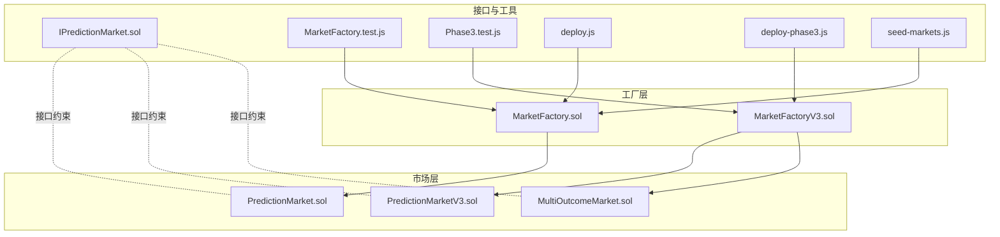
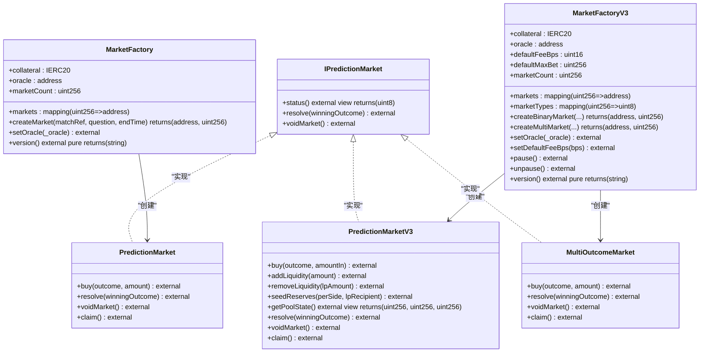
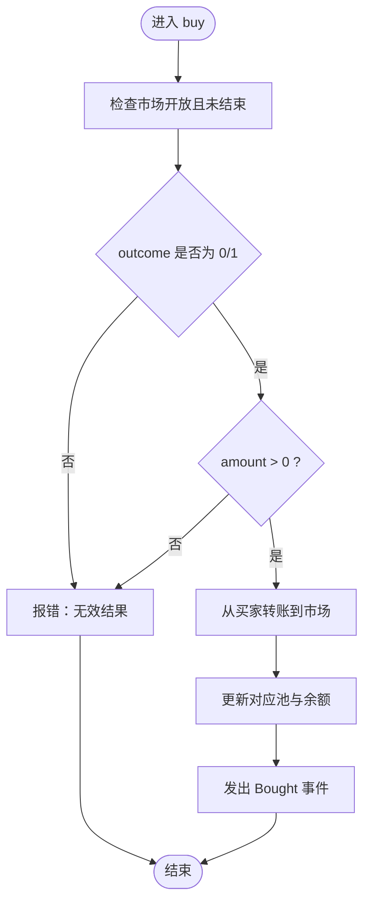
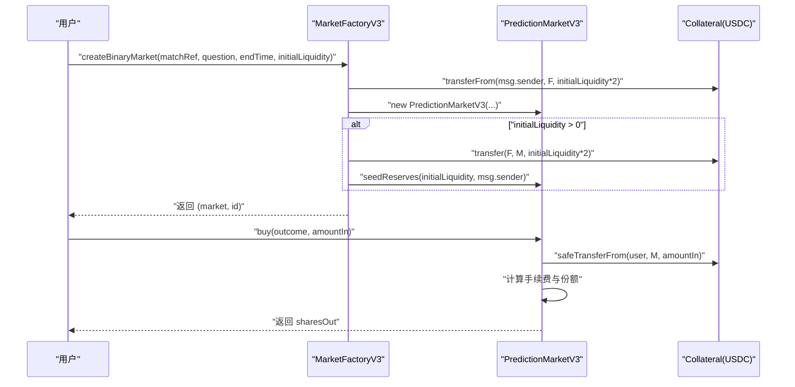
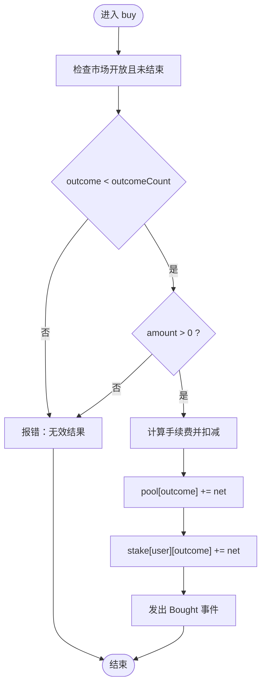
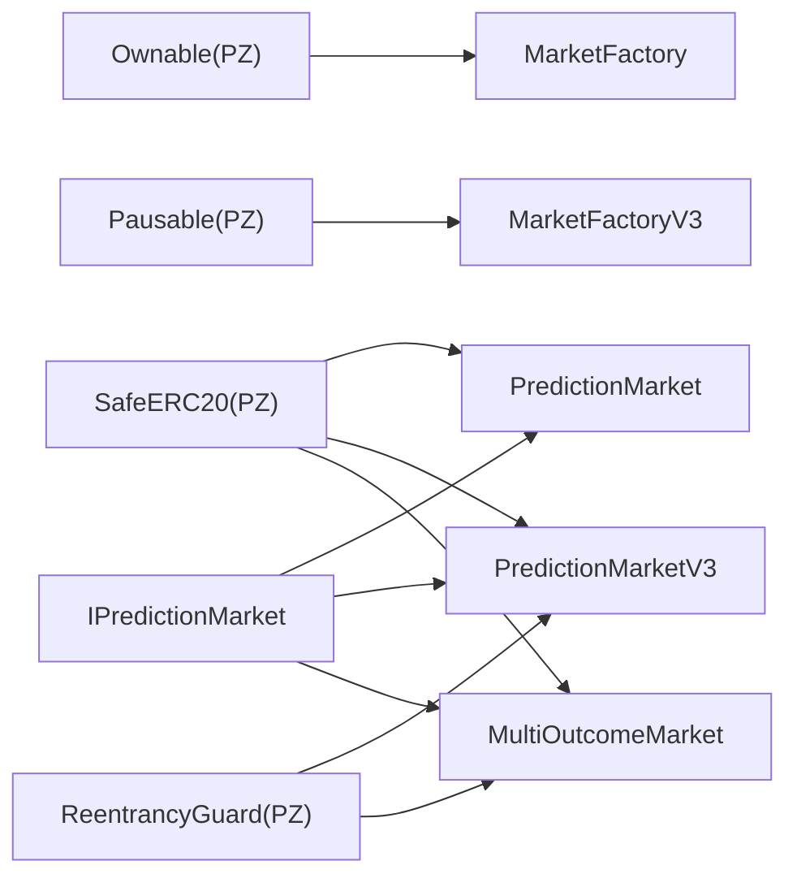

# 工厂模式架构

<cite>
**本文档引用的文件**
- [MarketFactory.sol](file://contracts/MarketFactory.sol)
- [MarketFactoryV3.sol](file://contracts/MarketFactoryV3.sol)
- [PredictionMarket.sol](file://contracts/PredictionMarket.sol)
- [PredictionMarketV3.sol](file://contracts/PredictionMarketV3.sol)
- [MultiOutcomeMarket.sol](file://contracts/MultiOutcomeMarket.sol)
- [IPredictionMarket.sol](file://contracts/interfaces/IPredictionMarket.sol)
- [MarketFactory.test.js](file://test/MarketFactory.test.js)
- [Phase3.test.js](file://test/Phase3.test.js)
- [deploy.js](file://scripts/deploy.js)
- [deploy-phase3.js](file://scripts/deploy-phase3.js)
- [seed-markets.js](file://scripts/seed-markets.js)
</cite>

## 目录
1. [简介](#简介)
2. [项目结构](#项目结构)
3. [核心组件](#核心组件)
4. [架构总览](#架构总览)
5. [详细组件分析](#详细组件分析)
6. [依赖关系分析](#依赖关系分析)
7. [性能考量](#性能考量)
8. [故障排查指南](#故障排查指南)
9. [结论](#结论)
10. [附录](#附录)

## 简介
本文件系统性阐述预测市场工厂模式架构，重点解析 MarketFactory 与 MarketFactoryV3 的设计理念与实现细节。工厂模式在此场景中用于封装市场实例化流程，统一参数校验、所有权管理和事件发布，支持从基础二元市场到基于 CPMM 的二元市场以及多结果市场的扩展。文档覆盖：
- 市场创建生命周期：从参数校验到实例部署与注册
- 参数传递机制与所有权管理
- 基础版 MarketFactory 与 V3 版本的架构差异
- 工厂模式优势、扩展性与性能影响
- 具体调用示例与返回值处理指引（以源码路径代替代码片段）

## 项目结构
该仓库采用按功能模块划分的组织方式，核心文件如下：
- 工厂合约：MarketFactory（基础二元市场）、MarketFactoryV3（CPMM 二元+多结果）
- 市场合约：PredictionMarket（基础二元）、PredictionMarketV3（CPMM 二元）、MultiOutcomeMarket（多结果）
- 接口：IPredictionMarket（统一接口）
- 测试与脚本：单元测试、部署脚本、种子市场脚本

图表来源
- [MarketFactory.sol](file://contracts/MarketFactory.sol#L1-L60)
- [MarketFactoryV3.sol](file://contracts/MarketFactoryV3.sol#L1-L94)
- [PredictionMarket.sol](file://contracts/PredictionMarket.sol#L1-L134)
- [PredictionMarketV3.sol](file://contracts/PredictionMarketV3.sol#L1-L200)
- [MultiOutcomeMarket.sol](file://contracts/MultiOutcomeMarket.sol#L1-L113)
- [IPredictionMarket.sol](file://contracts/interfaces/IPredictionMarket.sol#L1-L9)

章节来源
- [MarketFactory.sol](file://contracts/MarketFactory.sol#L1-L60)
- [MarketFactoryV3.sol](file://contracts/MarketFactoryV3.sol#L1-L94)

## 核心组件
- MarketFactory：面向基础二元预测市场的工厂，负责创建 PredictionMarket 实例，维护市场计数与映射，仅允许所有者调用。
- MarketFactoryV3：面向 Phase3 的工厂，支持：
  - CPMM 二元市场（PredictionMarketV3）：内置流动性池、手续费、最大投注限制、暂停机制
  - 多结果市场（MultiOutcomeMarket）：支持 2-8 结果的同质化池化市场
  - 默认费用、默认最大投注、默认流动性注入等配置
- 市场合约：
  - PredictionMarket：Parimutuel 二元市场，支持购买、结算、退费
  - PredictionMarketV3：CPMM 二元市场，支持流动性添加/移除、价格计算、手续费收集
  - MultiOutcomeMarket：N 结果 Parimutuel 市场，支持购买、结算、退费
- 接口 IPredictionMarket：统一的市场状态查询与结算接口

章节来源
- [MarketFactory.sol](file://contracts/MarketFactory.sol#L8-L60)
- [MarketFactoryV3.sol](file://contracts/MarketFactoryV3.sol#L10-L94)
- [PredictionMarket.sol](file://contracts/PredictionMarket.sol#L7-L134)
- [PredictionMarketV3.sol](file://contracts/PredictionMarketV3.sol#L8-L200)
- [MultiOutcomeMarket.sol](file://contracts/MultiOutcomeMarket.sol#L8-L113)
- [IPredictionMarket.sol](file://contracts/interfaces/IPredictionMarket.sol#L4-L9)

## 架构总览
工厂模式在此项目中的作用是：
- 封装市场实例化细节，统一构造参数与初始化逻辑
- 维护市场索引与类型映射，便于查询与治理
- 引入所有权控制与暂停机制，保障安全与可控性
- 支持不同市场模型（Parimutuel 与 CPMM）与多结果扩展

图表来源
- [MarketFactory.sol](file://contracts/MarketFactory.sol#L9-L60)
- [MarketFactoryV3.sol](file://contracts/MarketFactoryV3.sol#L11-L94)
- [PredictionMarket.sol](file://contracts/PredictionMarket.sol#L8-L134)
- [PredictionMarketV3.sol](file://contracts/PredictionMarketV3.sol#L9-L200)
- [MultiOutcomeMarket.sol](file://contracts/MultiOutcomeMarket.sol#L9-L113)
- [IPredictionMarket.sol](file://contracts/interfaces/IPredictionMarket.sol#L4-L9)

## 详细组件分析

### MarketFactory（基础二元市场工厂）
职责与特性：
- 资产与预言机注入：构造时校验地址非零，保存为不可变字段
- 市场创建：仅所有者可调用，创建 PredictionMarket 实例，分配自增 ID 并登记映射
- 事件发布：MarketCreated 包含市场 ID、地址、匹配引用、问题与结束时间
- 版本标识：返回固定字符串标识当前阶段

参数传递与所有权：
- 所有者修饰符确保只有合约所有者能变更预言机或创建市场
- 返回值：返回新市场地址与自增 ID，便于上层业务记录与后续交互

生命周期要点：
- 构造期：校验资产与预言机地址
- 创建期：实例化市场、登记计数与映射、发出事件
- 运行期：由市场合约内部状态与外部调用驱动

章节来源
- [MarketFactory.sol](file://contracts/MarketFactory.sol#L8-L60)

### MarketFactoryV3（CPMM 与多结果工厂）
职责与特性：
- 多市场支持：二元 CPMM（PredictionMarketV3）与多结果（MultiOutcomeMarket）
- 配置管理：默认费用、默认最大投注、默认流动性注入
- 暂停机制：仅所有者可暂停/恢复，防止异常状态下的交易
- 事件区分：BinaryMarketCreated 与 MultiMarketCreated，便于前端与链下服务订阅

CPMM 支持：
- 初始流动性注入：工厂向市场转移双边资金并调用 seedReserves 完成种子池设置
- 交易与手续费：buy 中计算手续费并计入收集池，价格通过 reserves 计算
- 流动性管理：addLiquidity/removeLiquidity 支持 LP 提供/退出

多结果扩展：
- outcomeCount 限定在 2-8，初始化时为每个结果预分配池
- 购买与结算：按结果池聚合，结算时按胜方池与用户投注比例派发

章节来源
- [MarketFactoryV3.sol](file://contracts/MarketFactoryV3.sol#L10-L94)
- [PredictionMarketV3.sol](file://contracts/PredictionMarketV3.sol#L8-L200)
- [MultiOutcomeMarket.sol](file://contracts/MultiOutcomeMarket.sol#L8-L113)

### 市场合约对比与数据流

#### 基础二元市场（PredictionMarket）
- 状态：Open/Resolved/Voided
- 资金模型：Parimutuel，按总池与胜方池比例派发
- 关键函数：buy、resolve、voidMarket、claim

图表来源
- [PredictionMarket.sol](file://contracts/PredictionMarket.sol#L64-L81)

章节来源
- [PredictionMarket.sol](file://contracts/PredictionMarket.sol#L7-L134)

#### CPMM 二元市场（PredictionMarketV3）
- 状态：Open/Resolved/Voided
- 资金模型：CPMM 池，buy 时收取手续费，价格由 reserves 决定
- 关键函数：buy、addLiquidity、removeLiquidity、seedReserves、getPoolState

图表来源
- [MarketFactoryV3.sol](file://contracts/MarketFactoryV3.sol#L37-L66)
- [PredictionMarketV3.sol](file://contracts/PredictionMarketV3.sol#L92-L111)

章节来源
- [MarketFactoryV3.sol](file://contracts/MarketFactoryV3.sol#L37-L66)
- [PredictionMarketV3.sol](file://contracts/PredictionMarketV3.sol#L92-L111)

#### 多结果市场（MultiOutcomeMarket）
- 状态：Open/Resolved/Voided
- 资金模型：各结果独立池，按胜方池与用户投注比例派发
- 关键函数：buy、resolve、voidMarket、claim

图表来源
- [MultiOutcomeMarket.sol](file://contracts/MultiOutcomeMarket.sol#L65-L74)

章节来源
- [MultiOutcomeMarket.sol](file://contracts/MultiOutcomeMarket.sol#L8-L113)

### 工厂方法调用与返回值处理示例（以源码路径为准）
- 基础二元市场创建
  - 调用路径：[MarketFactory.createMarket](file://contracts/MarketFactory.sol#L37-L54)
  - 返回值：返回 (address, uint256)，分别代表市场地址与自增 ID
  - 使用建议：调用后立即读取 [markets(id)](file://contracts/MarketFactory.sol#L15) 获取地址，或使用 [marketCount()](file://contracts/MarketFactory.sol#L13) 验证计数
- CPMM 二元市场创建
  - 调用路径：[MarketFactoryV3.createBinaryMarket](file://contracts/MarketFactoryV3.sol#L37-L66)
  - 返回值：返回 (address, uint256)，同时可查询 [marketTypes(id)](file://contracts/MarketFactoryV3.sol#L19) 判断类型
  - 初始流动性：若传入 initialLiquidity > 0，工厂会先转移资金并调用 [seedReserves](file://contracts/MarketFactoryV3.sol#L57-L60)
- 多结果市场创建
  - 调用路径：[MarketFactoryV3.createMultiMarket](file://contracts/MarketFactoryV3.sol#L68-L88)
  - 返回值：返回 (address, uint256)，类型标记为 1
- 市场状态查询与结算
  - 统一接口：[IPredictionMarket.status](file://contracts/interfaces/IPredictionMarket.sol#L5)
  - 解决与作废：[IPredictionMarket.resolve](file://contracts/interfaces/IPredictionMarket.sol#L6), [IPredictionMarket.voidMarket](file://contracts/interfaces/IPredictionMarket.sol#L7)

章节来源
- [MarketFactory.sol](file://contracts/MarketFactory.sol#L37-L54)
- [MarketFactoryV3.sol](file://contracts/MarketFactoryV3.sol#L37-L88)
- [IPredictionMarket.sol](file://contracts/interfaces/IPredictionMarket.sol#L4-L9)

## 依赖关系分析
- 合约依赖
  - MarketFactory 依赖 PredictionMarket 与 OpenZeppelin Ownable
  - MarketFactoryV3 依赖 PredictionMarketV3、MultiOutcomeMarket、Ownable 与 Pausable
  - 市场合约均依赖 SafeERC20、ReentrancyGuard 与 IERC20
- 接口契约
  - IPredictionMarket 为所有市场提供统一的 resolve/void/status 能力
- 测试与脚本
  - MarketFactory.test.js 验证基础工厂创建与事件
  - Phase3.test.js 验证 CPMM 价格变动与多结果结算
  - deploy.js 与 deploy-phase3.js 分别部署基础与 V3 工厂

图表来源
- [MarketFactory.sol](file://contracts/MarketFactory.sol#L4-L6)
- [MarketFactoryV3.sol](file://contracts/MarketFactoryV3.sol#L4-L8)
- [PredictionMarket.sol](file://contracts/PredictionMarket.sol#L4-L5)
- [PredictionMarketV3.sol](file://contracts/PredictionMarketV3.sol#L4-L6)
- [MultiOutcomeMarket.sol](file://contracts/MultiOutcomeMarket.sol#L4-L6)
- [IPredictionMarket.sol](file://contracts/interfaces/IPredictionMarket.sol#L4-L9)

章节来源
- [MarketFactory.sol](file://contracts/MarketFactory.sol#L4-L6)
- [MarketFactoryV3.sol](file://contracts/MarketFactoryV3.sol#L4-L8)
- [PredictionMarket.sol](file://contracts/PredictionMarket.sol#L4-L5)
- [PredictionMarketV3.sol](file://contracts/PredictionMarketV3.sol#L4-L6)
- [MultiOutcomeMarket.sol](file://contracts/MultiOutcomeMarket.sol#L4-L6)
- [IPredictionMarket.sol](file://contracts/interfaces/IPredictionMarket.sol#L4-L9)

## 性能考量
- 工厂创建成本
  - MarketFactory：构造函数与创建函数均为 O(1)，无循环或复杂存储写入
  - MarketFactoryV3：创建 CPMM 市场时可能涉及初始流动性转账与池种子设置，增加少量链上开销
- 存储访问
  - 市场计数与映射为线性访问，适合批量查询
  - 多结果市场池数组长度固定为 2-8，空间占用有限
- 交易路径
  - PredictionMarketV3 的 buy/addLiquidity/removeLiquidity 均启用非重入保护，避免重入攻击但引入一定 gas 成本
- 可扩展性
  - 工厂通过枚举 marketTypes 支持多模型共存，无需修改现有工厂接口
  - 默认参数集中于工厂，降低调用端配置复杂度

[本节为通用性能讨论，不直接分析具体文件]

## 故障排查指南
- 常见错误与定位
  - “不是预言机”：仅预言机可调用 resolve/voidMarket，检查 OracleAdapter 授权与调用者身份
  - “不是工厂”：seedReserves 仅工厂可调用，确认调用者为工厂地址
  - “已结算/已作废”：仅 Open 状态可购买，检查市场状态与结束时间
  - “无效结果”：outcome 必须在有效范围内（二元为 0/1；多结果为 0..outcomeCount-1）
  - “零金额/超过最大投注”：buy 前检查 amount 与用户累计投注
- 调试步骤
  - 使用测试脚本验证创建与事件：[MarketFactory.test.js](file://test/MarketFactory.test.js#L5-L27), [Phase3.test.js](file://test/Phase3.test.js#L5-L74)
  - 部署脚本辅助本地环境：[deploy.js](file://scripts/deploy.js#L5-L51), [deploy-phase3.js](file://scripts/deploy-phase3.js#L5-L43)
  - 种子市场脚本快速批量创建：[seed-markets.js](file://scripts/seed-markets.js#L15-L27)

章节来源
- [PredictionMarket.sol](file://contracts/PredictionMarket.sol#L39-L42)
- [PredictionMarketV3.sol](file://contracts/PredictionMarketV3.sol#L44-L47)
- [MultiOutcomeMarket.sol](file://contracts/MultiOutcomeMarket.sol#L34-L37)
- [MarketFactory.test.js](file://test/MarketFactory.test.js#L5-L27)
- [Phase3.test.js](file://test/Phase3.test.js#L5-L74)
- [deploy.js](file://scripts/deploy.js#L5-L51)
- [deploy-phase3.js](file://scripts/deploy-phase3.js#L5-L43)
- [seed-markets.js](file://scripts/seed-markets.js#L15-L27)

## 结论
- 工厂模式在本项目中实现了清晰的职责分离：工厂负责实例化与注册，市场合约专注业务逻辑
- MarketFactoryV3 在基础能力之上引入 CPMM 与多结果支持，显著提升市场模型灵活性与交易效率
- 通过接口契约与统一事件，系统具备良好的可观察性与可集成性
- 建议在生产环境持续关注 gas 消耗与市场状态监控，结合暂停机制与阈值授权保障安全

[本节为总结性内容，不直接分析具体文件]

## 附录
- 版本信息
  - MarketFactory：version 返回固定字符串标识阶段
  - MarketFactoryV3：version 返回固定字符串标识 Phase3
- 相关测试与部署
  - 基础工厂测试：[MarketFactory.test.js](file://test/MarketFactory.test.js#L5-L27)
  - Phase3 功能测试：[Phase3.test.js](file://test/Phase3.test.js#L5-L74)
  - 部署脚本：[deploy.js](file://scripts/deploy.js#L5-L51), [deploy-phase3.js](file://scripts/deploy-phase3.js#L5-L43)
  - 种子市场脚本：[seed-markets.js](file://scripts/seed-markets.js#L15-L27)

章节来源
- [MarketFactory.sol](file://contracts/MarketFactory.sol#L56-L58)
- [MarketFactoryV3.sol](file://contracts/MarketFactoryV3.sol#L90-L92)
- [MarketFactory.test.js](file://test/MarketFactory.test.js#L5-L27)
- [Phase3.test.js](file://test/Phase3.test.js#L5-L74)
- [deploy.js](file://scripts/deploy.js#L5-L51)
- [deploy-phase3.js](file://scripts/deploy-phase3.js#L5-L43)
- [seed-markets.js](file://scripts/seed-markets.js#L15-L27)