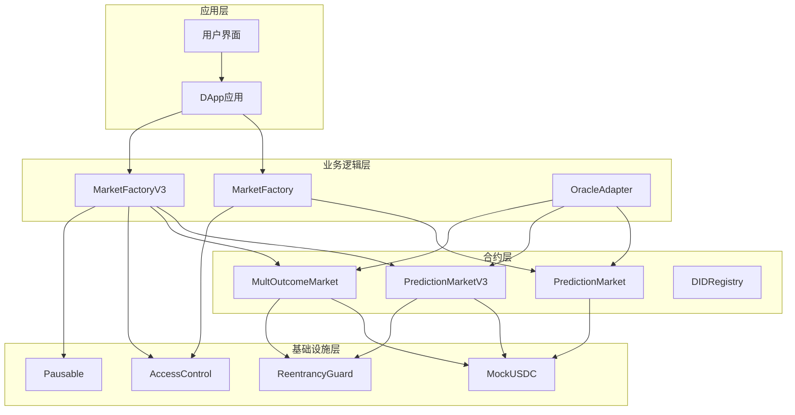
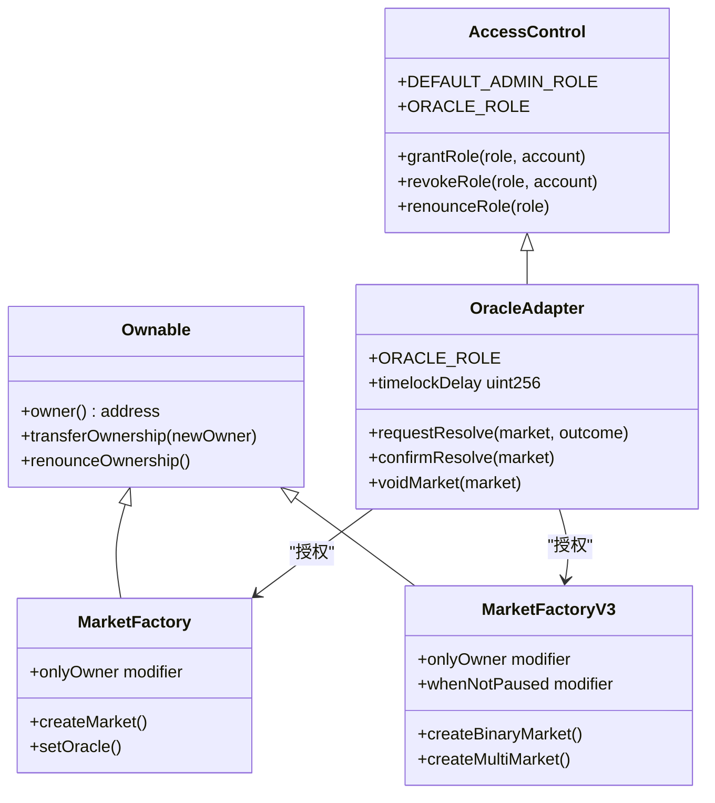
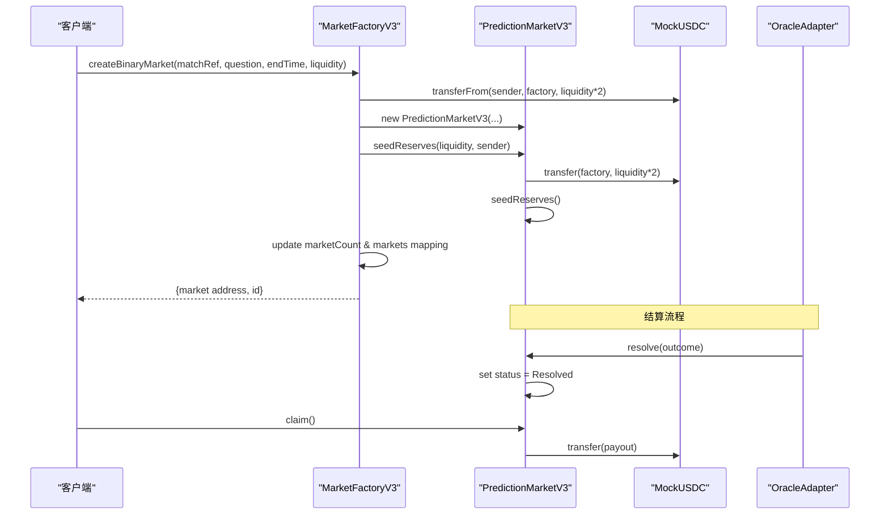
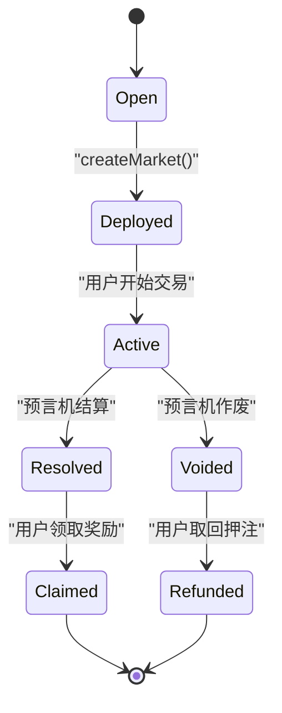
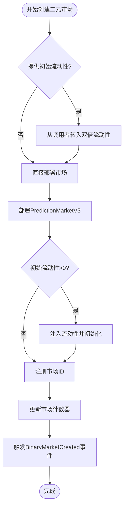
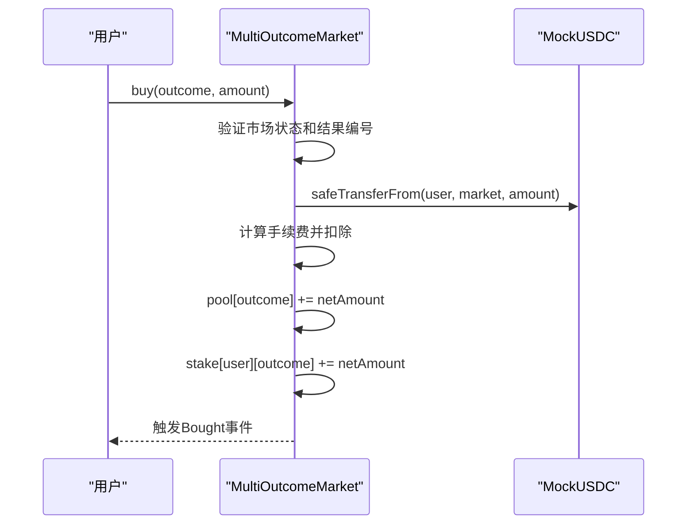
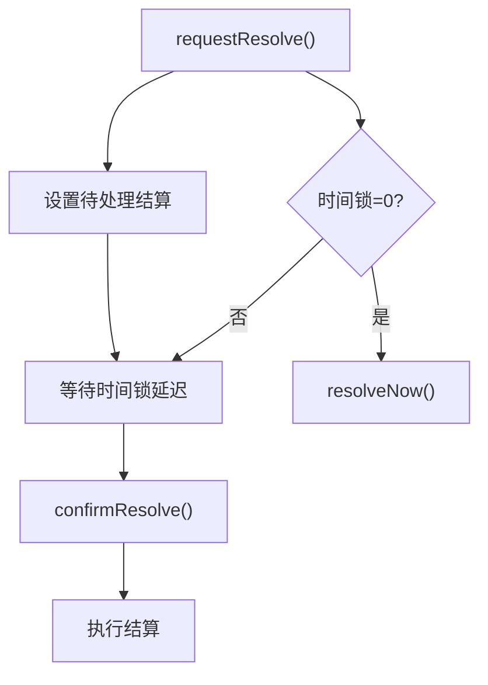
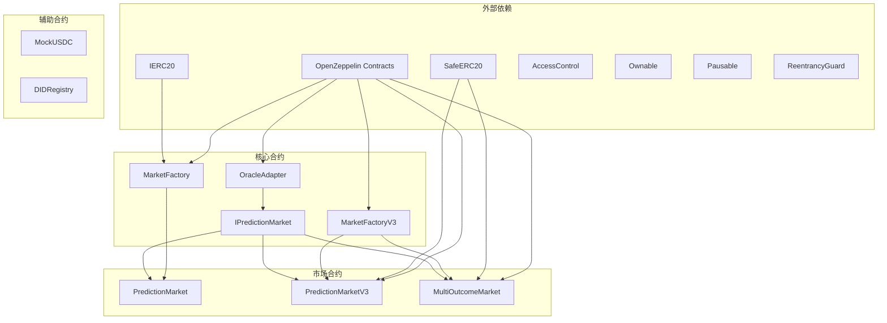
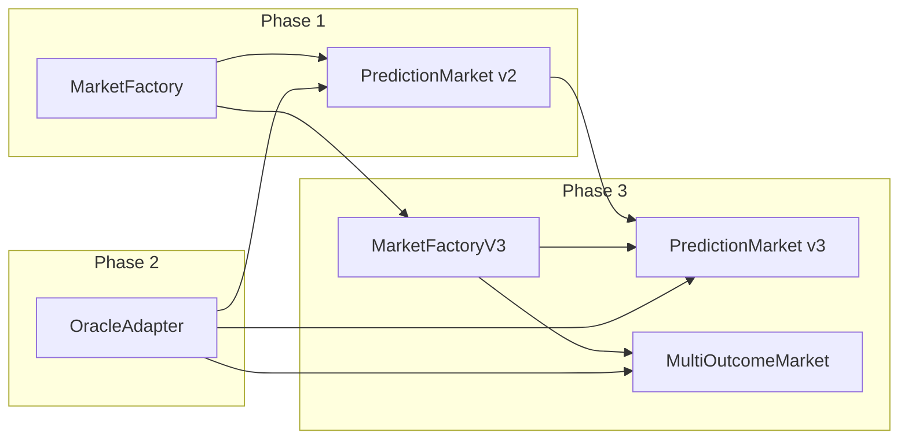

# 工厂模式设计

<cite>
**本文档引用的文件**
- [MarketFactory.sol](file://contracts/MarketFactory.sol)
- [MarketFactoryV3.sol](file://contracts/MarketFactoryV3.sol)
- [PredictionMarket.sol](file://contracts/PredictionMarket.sol)
- [PredictionMarketV3.sol](file://contracts/PredictionMarketV3.sol)
- [MultiOutcomeMarket.sol](file://contracts/MultiOutcomeMarket.sol)
- [OracleAdapter.sol](file://contracts/OracleAdapter.sol)
- [IPredictionMarket.sol](file://contracts/interfaces/IPredictionMarket.sol)
- [MarketFactory.test.js](file://test/MarketFactory.test.js)
- [deploy.js](file://scripts/deploy.js)
- [deploy-phase3.js](file://scripts/deploy-phase3.js)
- [seed-markets.js](file://scripts/seed-markets.js)
</cite>

## 目录
1. [简介](#简介)
2. [项目结构](#项目结构)
3. [核心组件](#核心组件)
4. [架构概览](#架构概览)
5. [详细组件分析](#详细组件分析)
6. [依赖关系分析](#依赖关系分析)
7. [性能考虑](#性能考虑)
8. [故障排除指南](#故障排除指南)
9. [结论](#结论)

## 简介

本文档深入分析了PredictionDIDSimple项目中的工厂模式设计，重点阐述MarketFactory和MarketFactoryV3的设计理念、实现细节和版本演进。该系统采用工厂模式来统一管理和部署预测市场合约，实现了从二元预测市场到多结果市场的完整演进过程。

工厂模式在此系统中的应用体现在：
- 统一的市场创建入口
- 标准化的市场部署流程
- 权限控制和生命周期管理
- 版本化和可扩展的架构设计

## 项目结构

系统采用分层架构，包含以下主要层次：



**图表来源**
- [MarketFactory.sol:12-68](file://contracts/MarketFactory.sol#L12-L68)
- [MarketFactoryV3.sol:14-104](file://contracts/MarketFactoryV3.sol#L14-L104)
- [OracleAdapter.sol:11-96](file://contracts/OracleAdapter.sol#L11-L96)

**章节来源**
- [MarketFactory.sol:1-68](file://contracts/MarketFactory.sol#L1-L68)
- [MarketFactoryV3.sol:1-104](file://contracts/MarketFactoryV3.sol#L1-L104)

## 核心组件

### 工厂合约概述

系统包含两个版本的工厂合约，分别服务于不同的市场类型：

| 组件 | 版本 | 功能特性 | 市场类型 |
|------|------|----------|----------|
| MarketFactory | 2.0.0-phase2 | 二元预测市场部署 | 二元市场 |
| MarketFactoryV3 | 3.0.0-phase3 | 二元CPMM + 多结果市场 | 二元V3 + 多结果 |

### 权限控制系统

系统采用基于角色的权限控制机制：



**图表来源**
- [OracleAdapter.sol:11-96](file://contracts/OracleAdapter.sol#L11-L96)
- [MarketFactory.sol:12-68](file://contracts/MarketFactory.sol#L12-L68)
- [MarketFactoryV3.sol:14-104](file://contracts/MarketFactoryV3.sol#L14-L104)

**章节来源**
- [OracleAdapter.sol:11-96](file://contracts/OracleAdapter.sol#L11-L96)
- [MarketFactory.sol:12-68](file://contracts/MarketFactory.sol#L12-L68)
- [MarketFactoryV3.sol:14-104](file://contracts/MarketFactoryV3.sol#L14-L104)

## 架构概览

系统采用分层架构设计，实现了从简单到复杂的渐进式演进：



**图表来源**
- [MarketFactoryV3.sol:44-74](file://contracts/MarketFactoryV3.sol#L44-L74)
- [PredictionMarketV3.sol:83-98](file://contracts/PredictionMarketV3.sol#L83-L98)

## 详细组件分析

### MarketFactory（版本2）

MarketFactory是系统的第一个版本，专注于二元预测市场的部署：

#### 构造函数参数
- `_collateral`: 抵押品代币合约地址（不可变）
- `_oracle`: 预言机适配器地址（不可变）

#### 核心功能
1. **市场创建**：`createMarket()` - 部署新的二元预测市场
2. **权限控制**：仅合约所有者可调用
3. **事件记录**：`MarketCreated` 事件

#### 生命周期管理


**图表来源**
- [MarketFactory.sol:44-61](file://contracts/MarketFactory.sol#L44-L61)
- [PredictionMarket.sol:14-19](file://contracts/PredictionMarket.sol#L14-L19)

**章节来源**
- [MarketFactory.sol:12-68](file://contracts/MarketFactory.sol#L12-L68)

### MarketFactoryV3（版本3）

MarketFactoryV3是系统的增强版本，支持多种市场类型：

#### 构造函数参数
- `_collateral`: 抵押品代币合约地址（不可变）
- `_oracle`: 预言机适配器地址（不可变）  
- `_feeBps`: 默认手续费基点数（1bps=0.01%）

#### 新增功能特性
1. **暂停机制**：`whenNotPaused` 修饰符
2. **多市场支持**：
   - `createBinaryMarket()` - 二元CPMM市场
   - `createMultiMarket()` - 多结果市场
3. **默认配置**：`defaultFeeBps` 和 `defaultMaxBet`
4. **事件分离**：区分二元和多结果市场事件

#### 二元CPMM市场流程


**图表来源**
- [MarketFactoryV3.sol:44-74](file://contracts/MarketFactoryV3.sol#L44-L74)

**章节来源**
- [MarketFactoryV3.sol:14-104](file://contracts/MarketFactoryV3.sol#L14-L104)

### 预测市场合约对比

#### PredictionMarket（V2 vs V3 对比）

| 特性 | PredictionMarket | PredictionMarketV3 |
|------|------------------|-------------------|
| **定价模型** | 互池式（Parimutuel） | CPMM（常数乘积做市商） |
| **流动性** | 无 | 支持LP流动性池 |
| **手续费** | 无 | 支持可配置手续费 |
| **重入保护** | 无 | 使用ReentrancyGuard |
| **最大押注限制** | 无 | 支持每用户最大押注 |
| **事件丰富度** | 3个事件 | 6个事件 |

#### CPMM算法实现
V3版本采用恒定乘积公式进行做市商计算：

```
k = x × y
shares_out = (amount_in × reserve_in) / (reserve_out + amount_in)
```

其中：
- `k` 是常数乘积
- `x, y` 是两侧储备金
- `amount_in` 是用户投入的金额
- `shares_out` 是获得的份额

**章节来源**
- [PredictionMarket.sol:11-145](file://contracts/PredictionMarket.sol#L11-L145)
- [PredictionMarketV3.sol:12-218](file://contracts/PredictionMarketV3.sol#L12-L218)

### 多结果市场

MultiOutcomeMarket支持2-8个结果的预测市场：

#### 核心数据结构
- `pool[]`: 各结果的资金池数组
- `stake[address][uint8]`: 用户在各结果上的押注金额
- `outcomeCount`: 结果数量（2-8）

#### 购买流程


**图表来源**
- [MultiOutcomeMarket.sol:72-82](file://contracts/MultiOutcomeMarket.sol#L72-L82)

**章节来源**
- [MultiOutcomeMarket.sol:12-124](file://contracts/MultiOutcomeMarket.sol#L12-L124)

### 预言机适配器

OracleAdapter提供时间锁机制和权限控制：

#### 核心功能
1. **时间锁结算**：`requestResolve()` 和 `confirmResolve()`
2. **快速结算**：`resolveNow()`（当时间锁为0时）
3. **市场作废**：`voidMarket()`
4. **角色管理**：`grantOracle()` 授予预言机角色

#### 时间锁流程


**图表来源**
- [OracleAdapter.sol:57-78](file://contracts/OracleAdapter.sol#L57-L78)

**章节来源**
- [OracleAdapter.sol:11-96](file://contracts/OracleAdapter.sol#L11-L96)

## 依赖关系分析

### 合约依赖图



**图表来源**
- [MarketFactory.sol:6-8](file://contracts/MarketFactory.sol#L6-L8)
- [MarketFactoryV3.sol:6-10](file://contracts/MarketFactoryV3.sol#L6-L10)
- [PredictionMarketV3.sol:6-8](file://contracts/PredictionMarketV3.sol#L6-L8)

### 版本演进关系



**图表来源**
- [MarketFactory.sol:10-11](file://contracts/MarketFactory.sol#L10-L11)
- [MarketFactoryV3.sol:12-13](file://contracts/MarketFactoryV3.sol#L12-L13)

**章节来源**
- [MarketFactory.sol:10-11](file://contracts/MarketFactory.sol#L10-L11)
- [MarketFactoryV3.sol:12-13](file://contracts/MarketFactoryV3.sol#L12-L13)

## 性能考虑

### Gas优化策略

1. **批量操作**：使用数组批量处理多个结果
2. **条件检查**：在函数开始处进行输入验证，避免不必要的gas消耗
3. **状态变量压缩**：合理使用状态变量，避免存储膨胀
4. **事件优化**：只记录必要的事件数据

### 可扩展性设计

1. **接口抽象**：通过IPredictionMarket接口实现松耦合
2. **工厂模式**：统一的市场创建入口便于扩展
3. **版本化升级**：支持平滑的版本迁移
4. **模块化设计**：各组件职责明确，易于维护

## 故障排除指南

### 常见问题及解决方案

#### 权限相关错误
- **错误**："not owner" 或 "not oracle"
- **原因**：调用者没有相应权限
- **解决**：确保调用者具有正确的角色或所有权

#### 市场状态错误
- **错误**："not open" 或 "ended"
- **原因**：市场已关闭或已过期
- **解决**：检查市场状态和截止时间

#### 金额验证错误
- **错误**："zero amount" 或 "invalid outcome"
- **原因**：输入参数无效
- **解决**：验证输入参数的有效性

#### 流动性不足
- **错误**："insufficient seed" 或 "not factory"
- **原因**：流动性注入失败
- **解决**：检查合约余额和调用权限

**章节来源**
- [PredictionMarket.sol:71-88](file://contracts/PredictionMarket.sol#L71-L88)
- [PredictionMarketV3.sol:100-120](file://contracts/PredictionMarketV3.sol#L100-L120)
- [MultiOutcomeMarket.sol:72-82](file://contracts/MultiOutcomeMarket.sol#L72-L82)

## 结论

PredictionDIDSimple项目的工厂模式设计展现了从简单到复杂、从单一功能到多功能支持的完整演进过程。通过MarketFactory和MarketFactoryV3的版本化设计，系统实现了：

1. **清晰的架构层次**：从工厂到市场的分层设计
2. **灵活的权限控制**：基于角色的精细化权限管理
3. **可扩展的市场类型**：支持二元和多结果市场
4. **完善的生命周期管理**：从创建到结算的全流程控制
5. **安全的交易机制**：重入攻击防护和时间锁机制

该设计为预测市场的部署和管理提供了标准化的解决方案，为后续的功能扩展和性能优化奠定了坚实的基础。