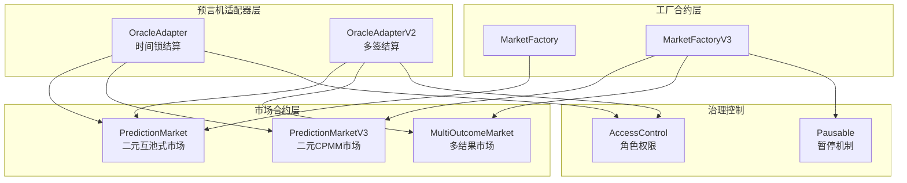
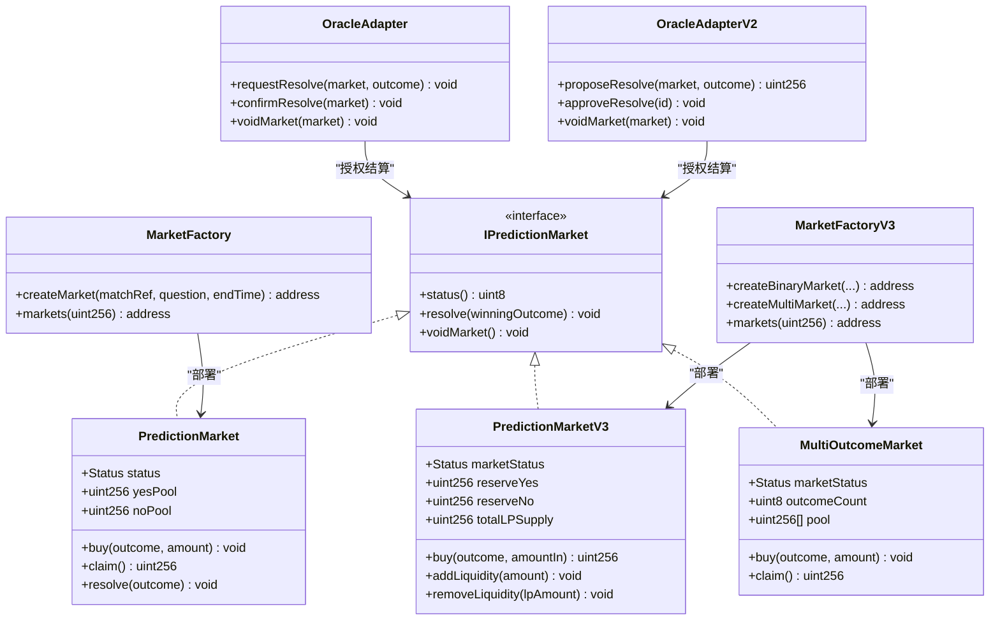
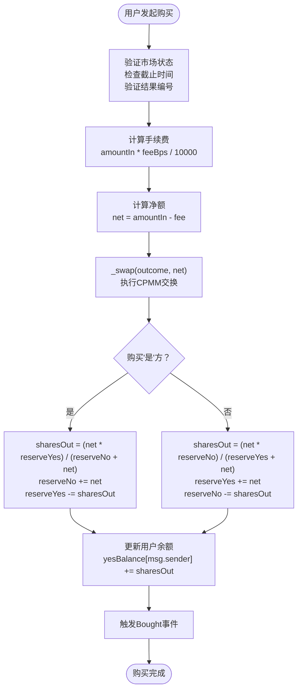
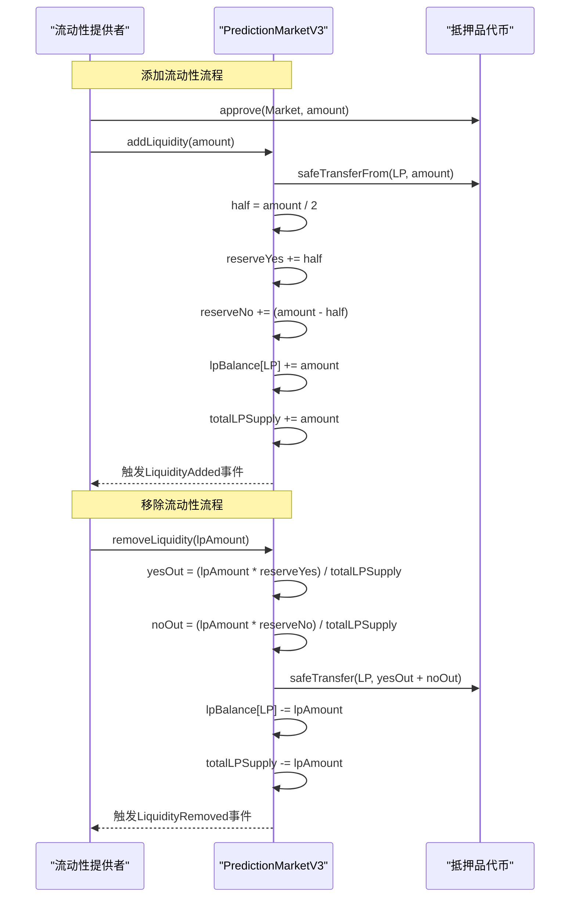
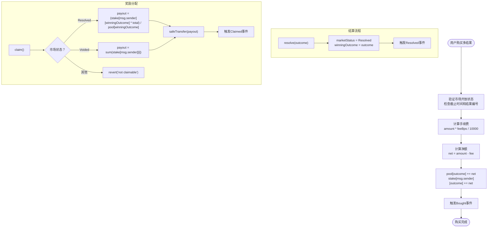
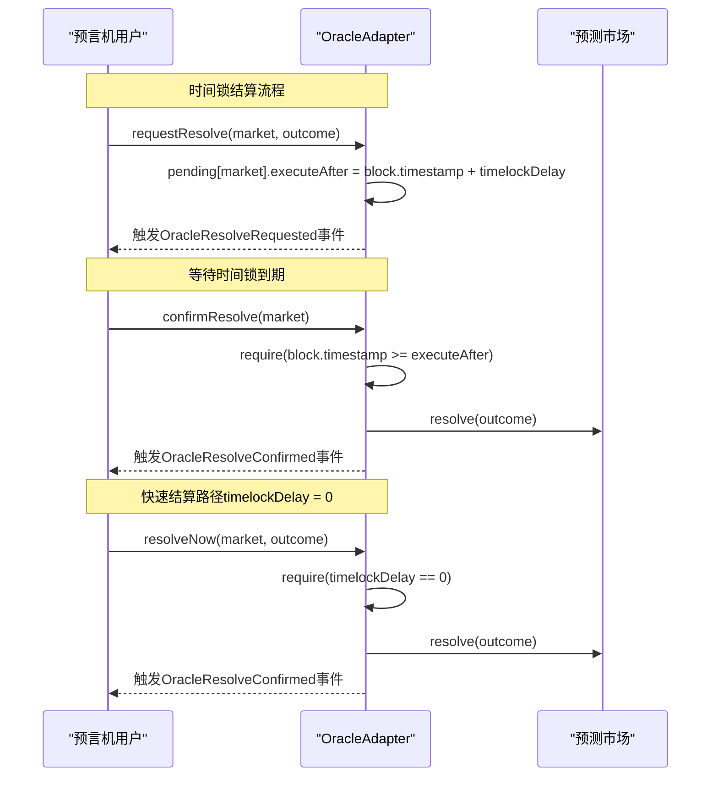
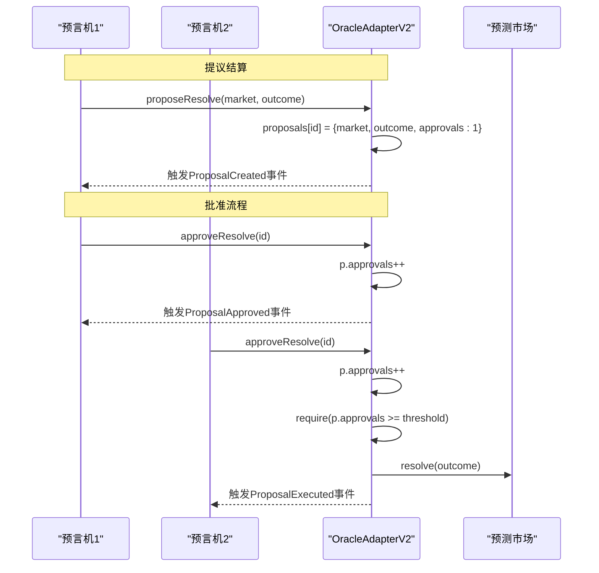
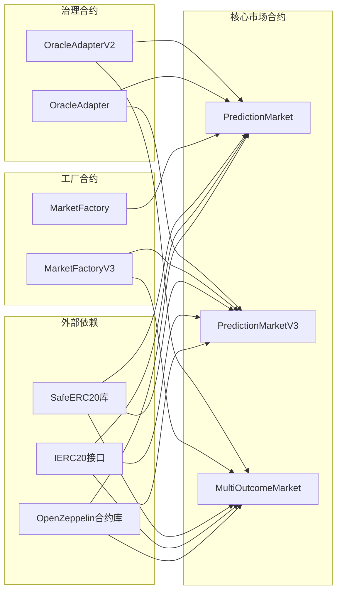
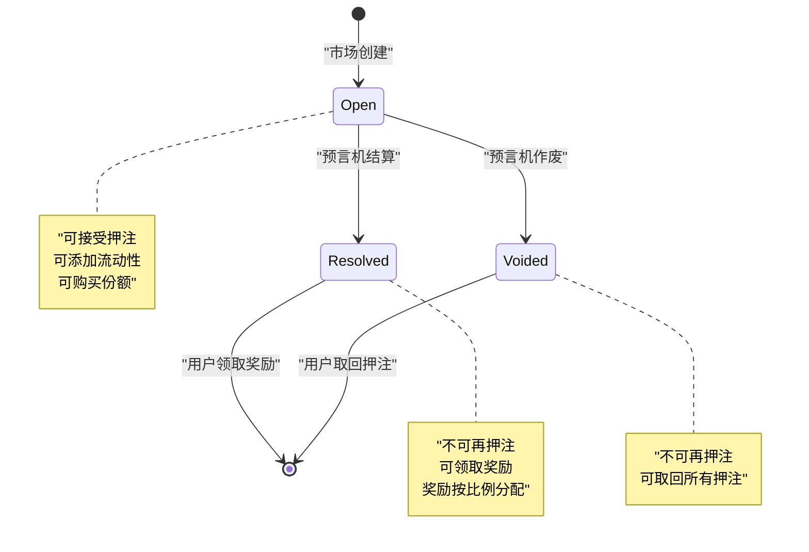

# 市场核心架构

<cite>
**本文档引用的文件**
- [PredictionMarket.sol](file://contracts/PredictionMarket.sol)
- [PredictionMarketV3.sol](file://contracts/PredictionMarketV3.sol)
- [MultiOutcomeMarket.sol](file://contracts/MultiOutcomeMarket.sol)
- [IPredictionMarket.sol](file://contracts/interfaces/IPredictionMarket.sol)
- [MarketFactory.sol](file://contracts/MarketFactory.sol)
- [MarketFactoryV3.sol](file://contracts/MarketFactoryV3.sol)
- [OracleAdapter.sol](file://contracts/OracleAdapter.sol)
- [OracleAdapterV2.sol](file://contracts/OracleAdapterV2.sol)
- [PredictionMarket.test.js](file://test/PredictionMarket.test.js)
- [MarketFactory.test.js](file://test/MarketFactory.test.js)
- [OracleAdapter.test.js](file://test/OracleAdapter.test.js)
- [Phase3.test.js](file://test/Phase3.test.js)
</cite>

## 目录
1. [简介](#简介)
2. [项目结构](#项目结构)
3. [核心组件](#核心组件)
4. [架构概览](#架构概览)
5. [详细组件分析](#详细组件分析)
6. [依赖关系分析](#依赖关系分析)
7. [性能考虑](#性能考虑)
8. [故障排除指南](#故障排除指南)
9. [结论](#结论)

## 简介
本文件为预测市场核心架构的综合技术文档，深入解析PredictionMarket、PredictionMarketV3和MultiOutcomeMarket三种市场类型的架构设计、状态管理机制和资金池运作原理。文档重点阐述二元市场与多结果市场的差异、共同特性以及扩展性设计，涵盖市场状态转换、押注机制、结算流程和奖励分配算法，并提供市场生命周期管理、暂停恢复机制和治理控制的实现细节。

## 项目结构
预测市场系统采用分层架构设计，包含三层核心组件：
- **市场合约层**：负责具体的市场业务逻辑和状态管理
- **工厂合约层**：负责市场部署和生命周期管理
- **预言机适配器层**：负责治理控制和结算授权

**图表来源**
- [MarketFactory.sol:12-67](file://contracts/MarketFactory.sol#L12-L67)
- [MarketFactoryV3.sol:14-103](file://contracts/MarketFactoryV3.sol#L14-L103)
- [OracleAdapter.sol:11-95](file://contracts/OracleAdapter.sol#L11-L95)
- [OracleAdapterV2.sol:11-94](file://contracts/OracleAdapterV2.sol#L11-L94)

**章节来源**
- [MarketFactory.sol:12-67](file://contracts/MarketFactory.sol#L12-L67)
- [MarketFactoryV3.sol:14-103](file://contracts/MarketFactoryV3.sol#L14-L103)
- [OracleAdapter.sol:11-95](file://contracts/OracleAdapter.sol#L11-L95)
- [OracleAdapterV2.sol:11-94](file://contracts/OracleAdapterV2.sol#L11-L94)

## 核心组件
本节详细介绍三个核心市场合约的设计理念和关键特性。

### PredictionMarket（二元互池式市场）
PredictionMarket实现了最基础的二元预测市场模型，采用互池式资金池机制：
- **资金池结构**：维护独立的"是/否"两方资金池
- **奖励分配**：基于用户押注占获胜方总资金池的比例进行分配
- **状态管理**：Open（开放）、Resolved（已结算）、Voided（已作废）三种状态
- **安全性**：使用SafeERC20确保代币转账安全

### PredictionMarketV3（二元CPMM市场）
PredictionMarketV3引入了流动性提供者机制和恒定乘积做市商模型：
- **CPMM机制**：采用恒定乘积公式 x*y = k，实现自动做市
- **流动性池**：独立的"是/否"方储备金，支持LP份额管理
- **费用机制**：可配置的手续费率，收入归流动性提供者
- **用户保护**：防重入攻击保护，防止恶意攻击

### MultiOutcomeMarket（多结果市场）
MultiOutcomeMarket支持2-8个结果的预测市场：
- **多结果支持**：动态资金池数组，支持任意数量的结果
- **统一奖励机制**：基于获胜结果资金池和用户押注比例分配
- **费用处理**：与二元市场相同的手续费处理逻辑
- **扩展性**：通过构造函数参数灵活配置结果数量

**章节来源**
- [PredictionMarket.sol:11-145](file://contracts/PredictionMarket.sol#L11-L145)
- [PredictionMarketV3.sol:12-218](file://contracts/PredictionMarketV3.sol#L12-L218)
- [MultiOutcomeMarket.sol:12-124](file://contracts/MultiOutcomeMarket.sol#L12-L124)

## 架构概览
预测市场的整体架构体现了清晰的职责分离和可扩展设计：

**图表来源**
- [IPredictionMarket.sol:7-14](file://contracts/interfaces/IPredictionMarket.sol#L7-L14)
- [PredictionMarket.sol:14-41](file://contracts/PredictionMarket.sol#L14-L41)
- [PredictionMarketV3.sol:15-46](file://contracts/PredictionMarketV3.sol#L15-L46)
- [MultiOutcomeMarket.sol:15-36](file://contracts/MultiOutcomeMarket.sol#L15-L36)
- [MarketFactory.sol:44-61](file://contracts/MarketFactory.sol#L44-L61)
- [MarketFactoryV3.sol:44-97](file://contracts/MarketFactoryV3.sol#L44-L97)
- [OracleAdapter.sol:57-94](file://contracts/OracleAdapter.sol#L57-L94)
- [OracleAdapterV2.sol:51-93](file://contracts/OracleAdapterV2.sol#L51-L93)

## 详细组件分析

### PredictionMarketV3（二元CPMM市场）深度分析

#### CPMM恒定乘积公式实现
PredictionMarketV3采用了先进的恒定乘积做市商模型，实现了去中心化的价格发现机制：

**图表来源**
- [PredictionMarketV3.sol:101-120](file://contracts/PredictionMarketV3.sol#L101-L120)
- [PredictionMarketV3.sol:194-205](file://contracts/PredictionMarketV3.sol#L194-L205)

#### 流动性提供机制
市场支持完整的流动性提供和移除流程：

**图表来源**
- [PredictionMarketV3.sol:122-146](file://contracts/PredictionMarketV3.sol#L122-L146)

**章节来源**
- [PredictionMarketV3.sol:12-218](file://contracts/PredictionMarketV3.sol#L12-L218)

### MultiOutcomeMarket（多结果市场）分析

#### 多结果资金池管理
MultiOutcomeMarket实现了灵活的多结果支持机制：

**图表来源**
- [MultiOutcomeMarket.sol:72-122](file://contracts/MultiOutcomeMarket.sol#L72-L122)

**章节来源**
- [MultiOutcomeMarket.sol:12-124](file://contracts/MultiOutcomeMarket.sol#L12-L124)

### Oracle治理控制机制

#### OracleAdapter（时间锁机制）
OracleAdapter实现了两级授权机制，确保结算的安全性：

**图表来源**
- [OracleAdapter.sol:57-87](file://contracts/OracleAdapter.sol#L57-L87)

#### OracleAdapterV2（多签机制）
OracleAdapterV2实现了更高级的多签治理模式：

**图表来源**
- [OracleAdapterV2.sol:51-86](file://contracts/OracleAdapterV2.sol#L51-L86)

**章节来源**
- [OracleAdapter.sol:11-95](file://contracts/OracleAdapter.sol#L11-L95)
- [OracleAdapterV2.sol:11-94](file://contracts/OracleAdapterV2.sol#L11-L94)

## 依赖关系分析

### 组件耦合度分析
预测市场系统的组件设计体现了良好的内聚性和低耦合性：

**图表来源**
- [PredictionMarket.sol:6-12](file://contracts/PredictionMarket.sol#L6-L12)
- [PredictionMarketV3.sol:6-13](file://contracts/PredictionMarketV3.sol#L6-L13)
- [MultiOutcomeMarket.sol:6-12](file://contracts/MultiOutcomeMarket.sol#L6-L12)

### 状态转换图
三种市场类型都遵循相似的状态转换模式：

**图表来源**
- [PredictionMarket.sol:15-28](file://contracts/PredictionMarket.sol#L15-L28)
- [PredictionMarketV3.sol:16-28](file://contracts/PredictionMarketV3.sol#L16-L28)
- [MultiOutcomeMarket.sol:16-27](file://contracts/MultiOutcomeMarket.sol#L16-L27)

**章节来源**
- [PredictionMarket.sol:15-145](file://contracts/PredictionMarket.sol#L15-L145)
- [PredictionMarketV3.sol:16-218](file://contracts/PredictionMarketV3.sol#L16-L218)
- [MultiOutcomeMarket.sol:16-124](file://contracts/MultiOutcomeMarket.sol#L16-L124)

## 性能考虑
预测市场系统在设计时充分考虑了性能优化和安全性：

### Gas效率优化
- **存储布局优化**：将常用状态变量放在连续的存储槽中，减少Gas消耗
- **批量操作**：MultiOutcomeMarket使用数组存储多个结果的资金池，避免多次存储读写
- **条件检查**：在函数开始处进行输入验证，及早失败以节省Gas

### 安全性保障
- **重入攻击防护**：PredictionMarketV3和MultiOutcomeMarket使用ReentrancyGuard保护关键函数
- **安全转账**：统一使用SafeERC20库进行ERC20代币转账
- **权限控制**：严格的onlyOracle修饰符和AccessControl角色管理

### 可扩展性设计
- **接口抽象**：通过IPredictionMarket接口定义统一的市场行为规范
- **工厂模式**：MarketFactory和MarketFactoryV3提供标准化的市场部署流程
- **模块化设计**：预言机适配器可独立升级，不影响核心市场逻辑

## 故障排除指南

### 常见错误场景及解决方案

#### 市场状态相关错误
- **"not open"**：市场已关闭或已结算，需等待新的市场创建
- **"ended"**：超过截止时间，无法继续押注
- **"already claimed"**：用户已领取奖励，重复领取会被拒绝

#### 权限相关错误
- **"not oracle"**：调用者没有预言机权限，需要通过AccessControl授予
- **"not factory"**：只有工厂合约可以调用某些特定函数

#### 参数验证错误
- **"invalid outcome"**：结果编号超出范围（0或1用于二元市场，0-7用于多结果市场）
- **"zero amount"**：押注金额必须大于0
- **"max bet"**：超过单用户最大押注限额

**章节来源**
- [PredictionMarket.sol:71-123](file://contracts/PredictionMarket.sol#L71-L123)
- [PredictionMarketV3.sol:101-179](file://contracts/PredictionMarketV3.sol#L101-L179)
- [MultiOutcomeMarket.sol:72-122](file://contracts/MultiOutcomeMarket.sol#L72-L122)

### 调试建议
1. **状态查询**：使用`status()`函数检查市场当前状态
2. **余额检查**：查询用户在各结果上的余额和奖励状态
3. **事件追踪**：监听相关事件了解市场活动历史
4. **Gas监控**：关注高Gas消耗的操作，如大规模流动性操作

## 结论
预测市场核心架构展现了现代DeFi项目的最佳实践，通过以下关键设计实现了高效、安全和可扩展的预测市场服务：

### 设计优势
- **渐进式演进**：从简单的二元互池式市场发展到复杂的CPMM和多结果市场
- **治理安全保障**：通过时间锁和多签机制确保结算决策的安全性
- **模块化架构**：清晰的职责分离和接口抽象，便于维护和扩展
- **性能优化**：针对Gas效率和安全性进行了全面优化

### 技术创新
- **CPMM做市**：引入恒定乘积做市商模型，提供更好的价格发现机制
- **流动性激励**：通过手续费分配机制激励流动性提供者
- **多结果支持**：灵活的多结果市场设计，适应不同应用场景

### 未来发展方向
- **跨链支持**：扩展到多链生态，实现资产跨链转移
- **智能合约升级**：实现向后兼容的合约升级机制
- **用户体验优化**：简化交互流程，降低用户学习成本

该架构为构建去中心化预测市场提供了坚实的技术基础，既满足了当前的应用需求，又为未来的功能扩展预留了充足的空间。