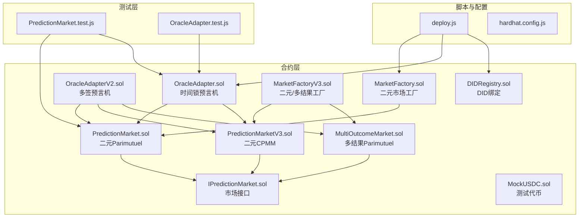
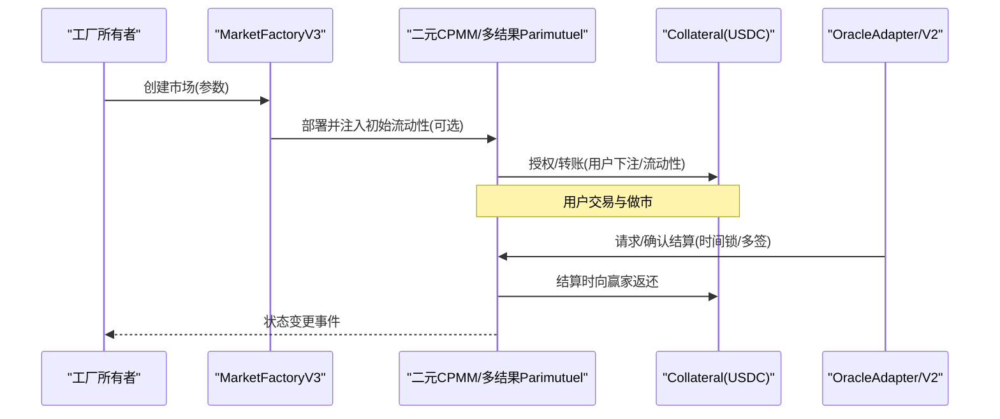
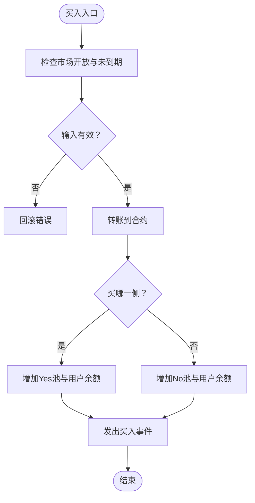
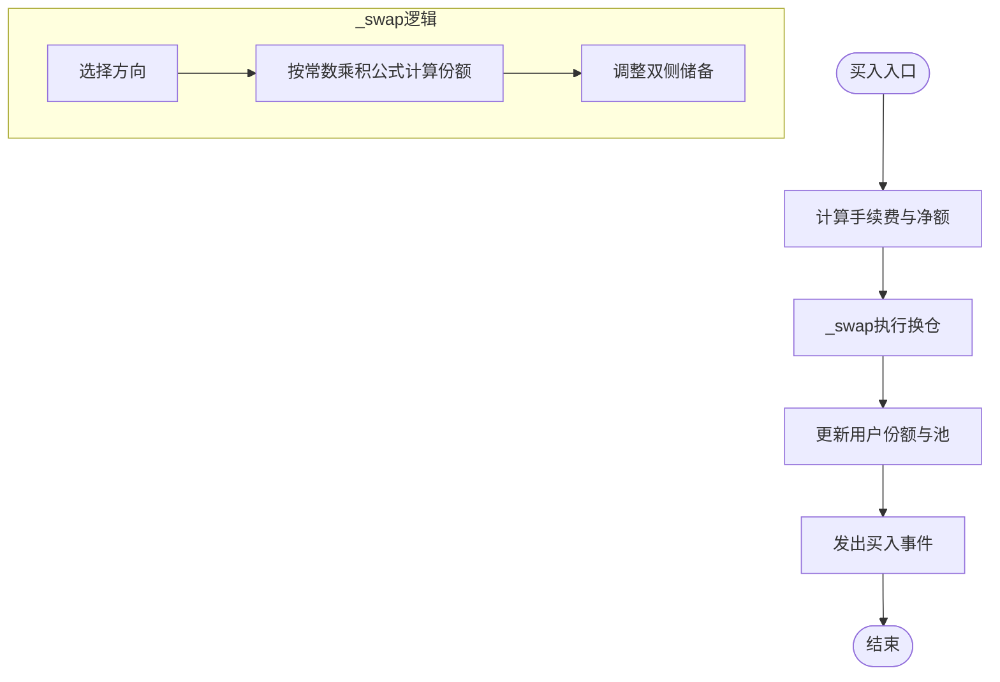
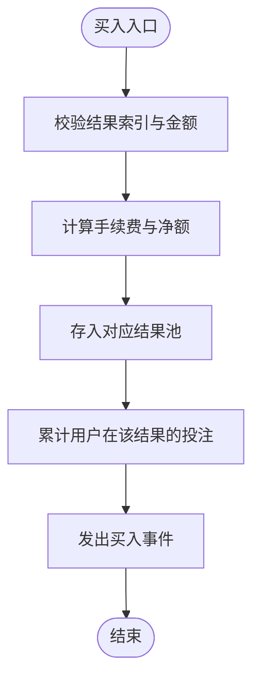
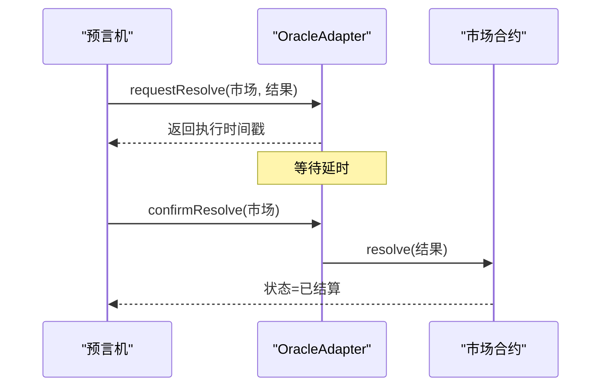
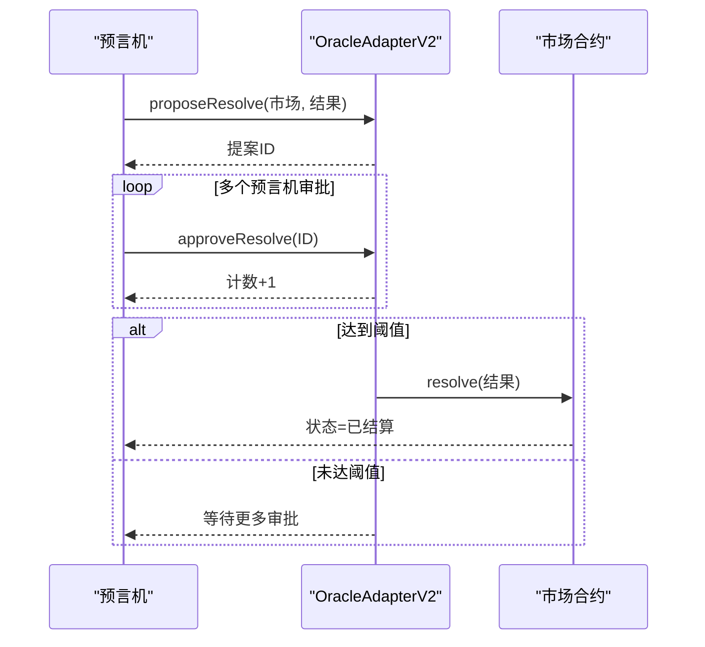
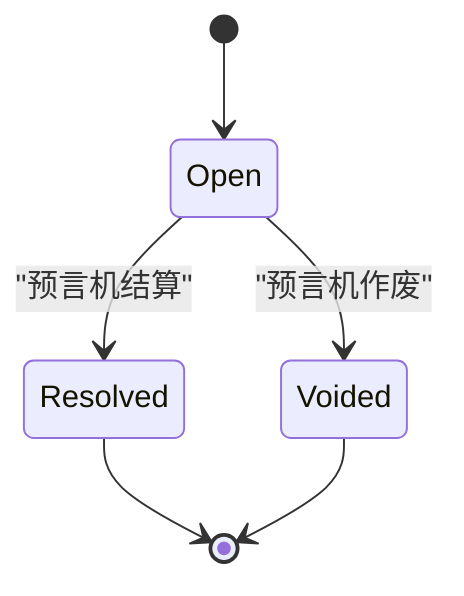
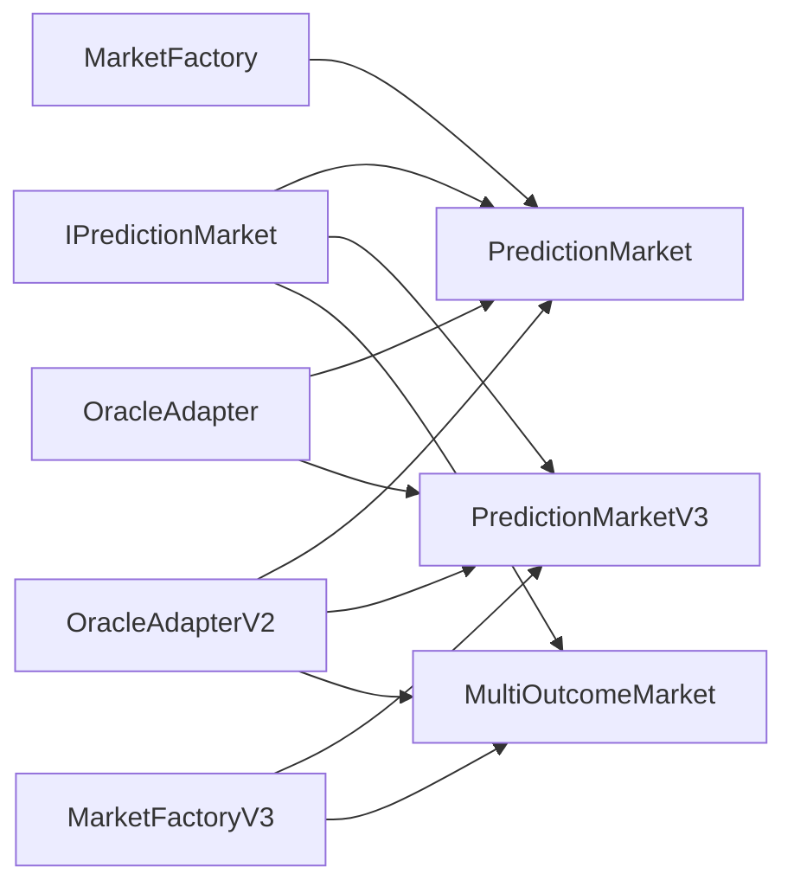

# 市场模型架构

<cite>
**本文引用的文件**
- [PredictionMarket.sol](file://contracts/PredictionMarket.sol)
- [PredictionMarketV3.sol](file://contracts/PredictionMarketV3.sol)
- [MultiOutcomeMarket.sol](file://contracts/MultiOutcomeMarket.sol)
- [OracleAdapter.sol](file://contracts/OracleAdapter.sol)
- [OracleAdapterV2.sol](file://contracts/OracleAdapterV2.sol)
- [MarketFactory.sol](file://contracts/MarketFactory.sol)
- [MarketFactoryV3.sol](file://contracts/MarketFactoryV3.sol)
- [IPredictionMarket.sol](file://contracts/interfaces/IPredictionMarket.sol)
- [DIDRegistry.sol](file://contracts/DIDRegistry.sol)
- [MockUSDC.sol](file://contracts/MockUSDC.sol)
- [PredictionMarket.test.js](file://test/PredictionMarket.test.js)
- [OracleAdapter.test.js](file://test/OracleAdapter.test.js)
- [deploy.js](file://scripts/deploy.js)
- [hardhat.config.js](file://hardhat.config.js)
</cite>

## 目录
1. [引言](#引言)
2. [项目结构](#项目结构)
3. [核心组件](#核心组件)
4. [架构总览](#架构总览)
5. [详细组件分析](#详细组件分析)
6. [依赖关系分析](#依赖关系分析)
7. [性能考量](#性能考量)
8. [故障排查指南](#故障排查指南)
9. [结论](#结论)
10. [附录](#附录)

## 引言
本文件面向预测市场领域的工程师与产品人员，系统化梳理PredictionDIDSimple仓库中的市场模型架构，重点对比Parimutuel（彩票式）与CPMM（常数乘积做市商）两种机制在二元与多结果市场的实现差异；阐述时间锁定与多签名共识如何从架构层面提升预言机可信度；总结市场状态管理、生命周期控制与自动化风控；并给出数学模型与算法实现细节，帮助读者快速理解并安全扩展该系统。

## 项目结构
项目采用按功能分层的组织方式：
- 合约层：市场核心合约（二元Parimutuel、二元CPMM、多结果Parimutuel）、工厂合约、预言机适配器、DID注册表等
- 接口层：统一的市场接口定义
- 测试层：针对市场行为与预言机流程的单元测试
- 脚本与配置：部署脚本与Hardhat配置

图表来源
- [MarketFactory.sol](file://contracts/MarketFactory.sol#L1-L60)
- [MarketFactoryV3.sol](file://contracts/MarketFactoryV3.sol#L1-L94)
- [PredictionMarket.sol](file://contracts/PredictionMarket.sol#L1-L134)
- [PredictionMarketV3.sol](file://contracts/PredictionMarketV3.sol#L1-L200)
- [MultiOutcomeMarket.sol](file://contracts/MultiOutcomeMarket.sol#L1-L113)
- [OracleAdapter.sol](file://contracts/OracleAdapter.sol#L1-L83)
- [OracleAdapterV2.sol](file://contracts/OracleAdapterV2.sol#L1-L83)
- [IPredictionMarket.sol](file://contracts/interfaces/IPredictionMarket.sol#L1-L9)
- [DIDRegistry.sol](file://contracts/DIDRegistry.sol#L1-L34)
- [MockUSDC.sol](file://contracts/MockUSDC.sol#L1-L18)
- [PredictionMarket.test.js](file://test/PredictionMarket.test.js#L1-L70)
- [OracleAdapter.test.js](file://test/OracleAdapter.test.js#L1-L50)
- [deploy.js](file://scripts/deploy.js#L1-L57)
- [hardhat.config.js](file://hardhat.config.js#L1-L30)

章节来源
- [MarketFactory.sol](file://contracts/MarketFactory.sol#L1-L60)
- [MarketFactoryV3.sol](file://contracts/MarketFactoryV3.sol#L1-L94)
- [PredictionMarket.sol](file://contracts/PredictionMarket.sol#L1-L134)
- [PredictionMarketV3.sol](file://contracts/PredictionMarketV3.sol#L1-L200)
- [MultiOutcomeMarket.sol](file://contracts/MultiOutcomeMarket.sol#L1-L113)
- [OracleAdapter.sol](file://contracts/OracleAdapter.sol#L1-L83)
- [OracleAdapterV2.sol](file://contracts/OracleAdapterV2.sol#L1-L83)
- [IPredictionMarket.sol](file://contracts/interfaces/IPredictionMarket.sol#L1-L9)
- [DIDRegistry.sol](file://contracts/DIDRegistry.sol#L1-L34)
- [MockUSDC.sol](file://contracts/MockUSDC.sol#L1-L18)
- [PredictionMarket.test.js](file://test/PredictionMarket.test.js#L1-L70)
- [OracleAdapter.test.js](file://test/OracleAdapter.test.js#L1-L50)
- [deploy.js](file://scripts/deploy.js#L1-L57)
- [hardhat.config.js](file://hardhat.config.js#L1-L30)

## 核心组件
- 二元Parimutuel市场：基于“赢家池”分配机制，买入时资金进入对应侧池，结算时按总池与赢家池比例返还
- 二元CPMM市场：引入流动性池与做市费用，使用常数乘积公式进行价格发现与流动性提供
- 多结果Parimutuel市场：支持2-8个结果，每个结果独立池，结算按赢家池与投注额比例返还
- 预言机适配器：提供时间锁与多签两种治理路径，确保结果发布不可篡改且可审计
- 工厂合约：负责市场部署、参数设置与初始流动性注入
- DID注册表：可选的链上DID哈希绑定，用于身份与数据完整性验证

章节来源
- [PredictionMarket.sol](file://contracts/PredictionMarket.sol#L1-L134)
- [PredictionMarketV3.sol](file://contracts/PredictionMarketV3.sol#L1-L200)
- [MultiOutcomeMarket.sol](file://contracts/MultiOutcomeMarket.sol#L1-L113)
- [OracleAdapter.sol](file://contracts/OracleAdapter.sol#L1-L83)
- [OracleAdapterV2.sol](file://contracts/OracleAdapterV2.sol#L1-L83)
- [MarketFactory.sol](file://contracts/MarketFactory.sol#L1-L60)
- [MarketFactoryV3.sol](file://contracts/MarketFactoryV3.sol#L1-L94)
- [DIDRegistry.sol](file://contracts/DIDRegistry.sol#L1-L34)

## 架构总览
系统采用“工厂-市场-预言机”的分层架构：
- 工厂负责创建与初始化市场，设置默认参数
- 市场合约处理交易、结算与资金分配
- 预言机适配器通过时间锁或多签控制市场状态变更
- DID注册表为可选的身份绑定模块

图表来源
- [MarketFactoryV3.sol](file://contracts/MarketFactoryV3.sol#L37-L88)
- [PredictionMarketV3.sol](file://contracts/PredictionMarketV3.sol#L92-L111)
- [MultiOutcomeMarket.sol](file://contracts/MultiOutcomeMarket.sol#L65-L74)
- [OracleAdapter.sol](file://contracts/OracleAdapter.sol#L48-L67)
- [OracleAdapterV2.sol](file://contracts/OracleAdapterV2.sol#L44-L75)

## 详细组件分析

### 二元Parimutuel市场（PredictionMarket）
- 数据结构
  - 资产池：两个方向池（例如“是/否”），分别跟踪每侧资金规模
  - 用户余额：记录每个地址在两侧的持有份额
  - 状态：开放、已结算、作废
- 关键流程
  - 买入：校验市场开放、未到期、金额有效；资金转入合约，更新对应池与用户余额
  - 解决：仅预言机可调用，设定胜出方向并置为已结算
  - 作废：仅预言机可调用，直接退还用户全部投注
  - 提现：根据结算或作废规则计算回报，转移资产
- 数学模型
  - 已结算：赢家份额回报 = 投注份额 × 总池 ÷ 赢家池
  - 作废：直接返还用户在两侧的投注总额
- 错误处理
  - 非开放状态禁止交易
  - 到期后禁止买入
  - 双重领取保护
  - 非预言机调用拒绝

图表来源
- [PredictionMarket.sol](file://contracts/PredictionMarket.sol#L64-L81)

章节来源
- [PredictionMarket.sol](file://contracts/PredictionMarket.sol#L1-L134)

### 二元CPMM市场（PredictionMarketV3）
- 数据结构
  - 流动性池：Yes/No双侧储备，总LP供应量
  - 用户余额：记录每侧份额
  - 做市费用：按交易额收取，计入费用池
  - 状态：开放、已结算、作废
- 关键流程
  - 买入：收取交易费，使用常数乘积公式计算获得份额，更新池与用户余额
  - 添加/移除流动性：按比例增减双侧储备与LP份额
  - 解决/作废：与Parimutuel一致
  - 提现：赢家按总池与对应池的比例计算回报
- 数学模型
  - 买入换仓：当买Yes时，获得份额 = 净额 × Yes池 ÷ (No池 + 净额)；同时更新两池
  - 回报计算：赢家份额回报 = 用户份额 × 总池 ÷ 对应池
- 安全特性
  - 防重入保护
  - 用户单笔最大投注限制
  - 工厂种子流动性（可选）

图表来源
- [PredictionMarketV3.sol](file://contracts/PredictionMarketV3.sol#L92-L111)
- [PredictionMarketV3.sol](file://contracts/PredictionMarketV3.sol#L178-L188)

章节来源
- [PredictionMarketV3.sol](file://contracts/PredictionMarketV3.sol#L1-L200)

### 多结果Parimutuel市场（MultiOutcomeMarket）
- 数据结构
  - 动态池数组：按结果数量初始化，每个索引代表一个结果池
  - 用户余额：二维映射，记录每个用户在各结果上的投注
  - 状态：开放、已结算、作废
- 关键流程
  - 买入：校验结果索引与金额，扣除手续费后存入对应池，并累计用户投注
  - 解决/作废：与二元一致
  - 提现：赢家池存在时按赢家池与用户在该结果的投注比例返还
- 数学模型
  - 回报计算：赢家份额回报 = 用户在赢家结果的投注 × 全池总和 ÷ 赢家池
- 扩展性
  - 支持2-8个结果，便于扩展至更多结果场景

图表来源
- [MultiOutcomeMarket.sol](file://contracts/MultiOutcomeMarket.sol#L65-L74)

章节来源
- [MultiOutcomeMarket.sol](file://contracts/MultiOutcomeMarket.sol#L1-L113)

### 预言机适配器（时间锁与多签）
- 时间锁适配器（OracleAdapter）
  - 请求结算：预言机提交市场与结果，设置执行延时
  - 确认结算：延时到达后执行结算
  - 快速路径：当延时为0时直接结算
  - 作废：仅开放市场可作废
- 多签适配器（OracleAdapterV2）
  - 提案：预言机发起提案，记录市场与结果
  - 审批：多个预言机逐个审批，达到阈值后执行
  - 执行：执行结算或作废
- 访问控制
  - 使用AccessControl角色管理，支持授予/撤销预言机权限

图表来源
- [OracleAdapter.sol](file://contracts/OracleAdapter.sol#L48-L67)

图表来源
- [OracleAdapterV2.sol](file://contracts/OracleAdapterV2.sol#L44-L75)

章节来源
- [OracleAdapter.sol](file://contracts/OracleAdapter.sol#L1-L83)
- [OracleAdapterV2.sol](file://contracts/OracleAdapterV2.sol#L1-L83)

### 工厂与生命周期控制
- MarketFactory（二元Parimutuel）
  - 仅部署二元Parimutuel市场，设置默认参数
- MarketFactoryV3（二元CPMM + 多结果）
  - 支持二元CPMM与多结果Parimutuel
  - 可注入初始流动性并播种池
  - 暂停/恢复机制，仅所有者可操作
  - 默认费用与最大投注限制
- 生命周期
  - 开放期：允许交易与做市
  - 结算期：由预言机触发，按模型规则分配资金
  - 作废期：资金原路退还，不产生收益

图表来源
- [MarketFactoryV3.sol](file://contracts/MarketFactoryV3.sol#L37-L88)
- [PredictionMarketV3.sol](file://contracts/PredictionMarketV3.sol#L137-L149)
- [MultiOutcomeMarket.sol](file://contracts/MultiOutcomeMarket.sol#L76-L87)

章节来源
- [MarketFactory.sol](file://contracts/MarketFactory.sol#L1-L60)
- [MarketFactoryV3.sol](file://contracts/MarketFactoryV3.sol#L1-L94)

### DID注册表
- 可选模块，提供链上DID哈希绑定与解析
- 通过签名验证绑定合法性
- 为市场参与方身份与数据完整性提供基础

章节来源
- [DIDRegistry.sol](file://contracts/DIDRegistry.sol#L1-L34)

## 依赖关系分析
- 市场合约依赖统一接口以保证多态调用
- 工厂合约负责部署与参数注入
- 预言机适配器通过角色控制访问，隔离业务与治理
- 测试脚本覆盖核心流程与边界条件

图表来源
- [IPredictionMarket.sol](file://contracts/interfaces/IPredictionMarket.sol#L1-L9)
- [MarketFactory.sol](file://contracts/MarketFactory.sol#L1-L60)
- [MarketFactoryV3.sol](file://contracts/MarketFactoryV3.sol#L1-L94)
- [OracleAdapter.sol](file://contracts/OracleAdapter.sol#L1-L83)
- [OracleAdapterV2.sol](file://contracts/OracleAdapterV2.sol#L1-L83)

章节来源
- [IPredictionMarket.sol](file://contracts/interfaces/IPredictionMarket.sol#L1-L9)
- [MarketFactory.sol](file://contracts/MarketFactory.sol#L1-L60)
- [MarketFactoryV3.sol](file://contracts/MarketFactoryV3.sol#L1-L94)
- [OracleAdapter.sol](file://contracts/OracleAdapter.sol#L1-L83)
- [OracleAdapterV2.sol](file://contracts/OracleAdapterV2.sol#L1-L83)

## 性能考量
- 交易成本
  - Parimutuel：无做市费用，交易开销较低
  - CPMM：包含做市费用与常数乘积计算，Gas消耗略高但提供流动性
- 状态复杂度
  - 多结果Parimutuel需要动态池数组，内存占用随结果数线性增长
- 并发与安全
  - CPMM启用防重入保护，降低重入攻击风险
  - 工厂支持暂停，可在紧急情况下停止新市场创建
- 扩展性
  - 结果数上限为8，适合大多数体育/政治预测场景
  - 可通过升级接口与工厂参数扩展新功能

[本节为通用性能讨论，无需特定文件引用]

## 故障排查指南
- 无法结算
  - 检查市场状态是否仍为开放
  - 确认预言机是否具备相应角色
  - 时间锁适配器需等待延时到达
- 无法提现
  - 已结算：确认赢家池非空，用户在该结果有投注
  - 已作废：确认未重复领取
- 交易失败
  - 到期后禁止买入
  - 单笔投注超过用户限额
  - 非开放状态禁止交易
- 预言机流程异常
  - 时间锁：确认延时已到达
  - 多签：确认审批数达到阈值

章节来源
- [PredictionMarket.test.js](file://test/PredictionMarket.test.js#L41-L68)
- [OracleAdapter.test.js](file://test/OracleAdapter.test.js#L6-L25)
- [OracleAdapter.test.js](file://test/OracleAdapter.test.js#L27-L48)

## 结论
本系统通过清晰的分层架构与可插拔的预言机治理模式，实现了从二元到多结果的多样化市场形态。Parimutuel强调简单公平的资金分配，CPMM提供流动性与做市收益，多签与时间锁保障了结果发布的可信度与可审计性。工厂合约与默认参数提供了良好的可扩展性与运维能力。建议在生产环境中结合业务场景选择合适模型，并合理设置费用、限额与治理阈值。

[本节为总结性内容，无需特定文件引用]

## 附录

### 数学模型与算法要点
- Parimutuel回报
  - 赢家回报 = 投注份额 × 总池 ÷ 赢家池
- CPMM换仓
  - 买入方向份额 = 净额 × 目标池 ÷ (对手池 + 净额)
- 多结果回报
  - 赢家回报 = 用户在赢家结果的投注 × 全池总和 ÷ 赢家池

章节来源
- [PredictionMarket.sol](file://contracts/PredictionMarket.sol#L115-L132)
- [PredictionMarketV3.sol](file://contracts/PredictionMarketV3.sol#L178-L198)
- [MultiOutcomeMarket.sol](file://contracts/MultiOutcomeMarket.sol#L92-L99)

### 部署与运行
- 部署脚本会创建MockUSDC、OracleAdapter、DIDRegistry与MarketFactory，并写入本地部署信息
- Hardhat配置启用优化器与指定EVM版本，便于测试与生产部署

章节来源
- [deploy.js](file://scripts/deploy.js#L1-L57)
- [hardhat.config.js](file://hardhat.config.js#L1-L30)