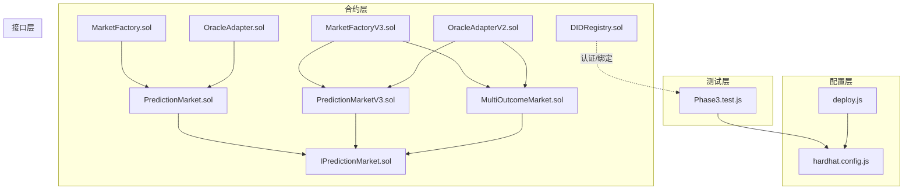
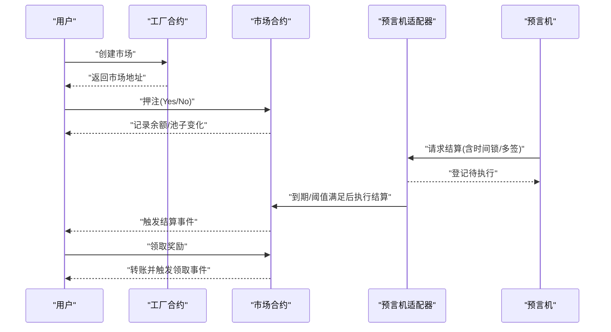
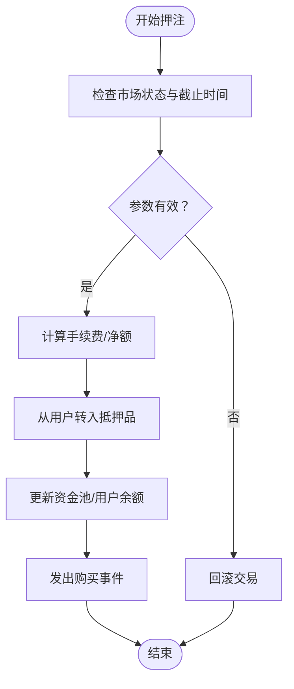
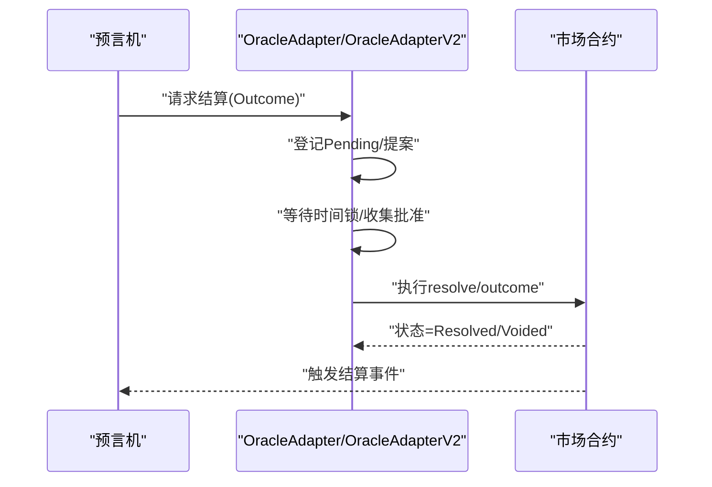
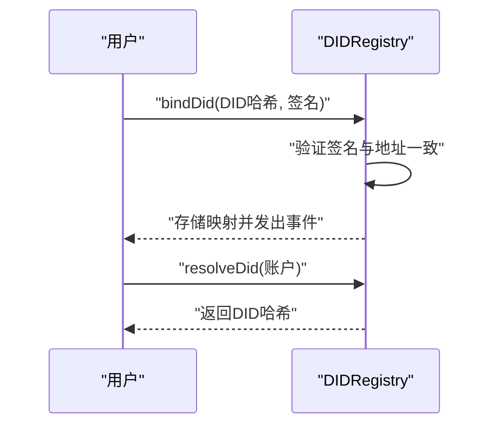
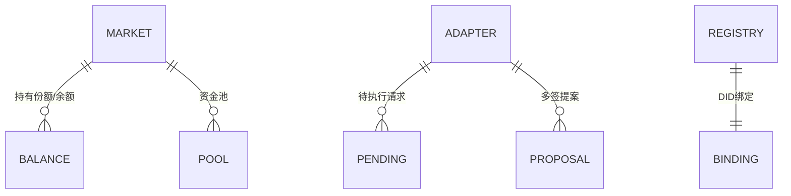
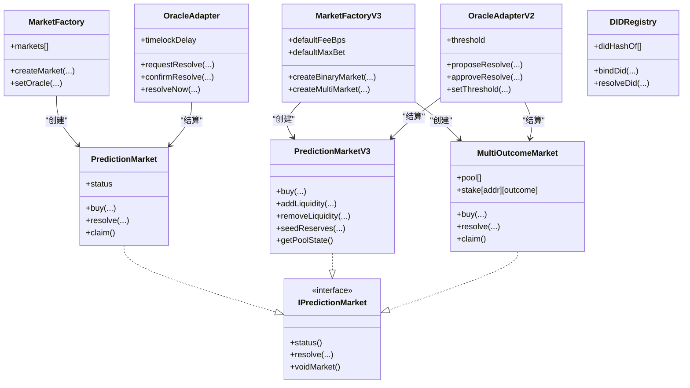

# 数据流设计

<cite>
**本文档引用的文件**
- [contracts/PredictionMarket.sol](file://contracts/PredictionMarket.sol)
- [contracts/OracleAdapter.sol](file://contracts/OracleAdapter.sol)
- [contracts/DIDRegistry.sol](file://contracts/DIDRegistry.sol)
- [contracts/MarketFactory.sol](file://contracts/MarketFactory.sol)
- [contracts/interfaces/IPredictionMarket.sol](file://contracts/interfaces/IPredictionMarket.sol)
- [contracts/OracleAdapterV2.sol](file://contracts/OracleAdapterV2.sol)
- [contracts/MultiOutcomeMarket.sol](file://contracts/MultiOutcomeMarket.sol)
- [contracts/MarketFactoryV3.sol](file://contracts/MarketFactoryV3.sol)
- [contracts/PredictionMarketV3.sol](file://contracts/PredictionMarketV3.sol)
- [test/Phase3.test.js](file://test/Phase3.test.js)
- [scripts/deploy.js](file://scripts/deploy.js)
- [hardhat.config.js](file://hardhat.config.js)
</cite>

## 目录
1. [简介](#简介)
2. [项目结构](#项目结构)
3. [核心组件](#核心组件)
4. [架构总览](#架构总览)
5. [详细组件分析](#详细组件分析)
6. [依赖关系分析](#依赖关系分析)
7. [性能考量](#性能考量)
8. [故障排查指南](#故障排查指南)
9. [结论](#结论)
10. [附录](#附录)

## 简介
本设计文档围绕PredictionDIDSimple系统的数据流进行深入剖析，覆盖用户押注、市场结算、DID认证以及预言机数据的完整流转过程。重点阐述组件间的数据传递机制、状态同步与一致性保障，事件驱动架构、异步处理与错误传播，以及数据模型设计、索引策略与查询优化方案，并解释数据安全、隐私保护与审计追踪的实现方式。

## 项目结构
系统采用分层与功能模块化组织：
- 合约层：包含市场合约、工厂合约、预言机适配器、DID注册表等核心业务合约
- 接口层：定义跨合约交互的标准接口
- 测试层：通过Hardhat测试验证数据流与业务流程
- 配置层：Hardhat配置与部署脚本

图表来源
- [contracts/MarketFactory.sol:44-61](file://contracts/MarketFactory.sol#L44-L61)
- [contracts/MarketFactoryV3.sol:44-97](file://contracts/MarketFactoryV3.sol#L44-L97)
- [contracts/OracleAdapter.sol:57-87](file://contracts/OracleAdapter.sol#L57-L87)
- [contracts/OracleAdapterV2.sol:51-93](file://contracts/OracleAdapterV2.sol#L51-L93)
- [contracts/DIDRegistry.sol:22-32](file://contracts/DIDRegistry.sol#L22-L32)
- [test/Phase3.test.js:1-78](file://test/Phase3.test.js#L1-L78)
- [hardhat.config.js:1-33](file://hardhat.config.js#L1-L33)
- [scripts/deploy.js:1-60](file://scripts/deploy.js#L1-L60)

章节来源
- [contracts/MarketFactory.sol:1-68](file://contracts/MarketFactory.sol#L1-L68)
- [contracts/MarketFactoryV3.sol:1-104](file://contracts/MarketFactoryV3.sol#L1-L104)
- [contracts/OracleAdapter.sol:1-96](file://contracts/OracleAdapter.sol#L1-L96)
- [contracts/OracleAdapterV2.sol:1-95](file://contracts/OracleAdapterV2.sol#L1-L95)
- [contracts/DIDRegistry.sol:1-39](file://contracts/DIDRegistry.sol#L1-L39)
- [test/Phase3.test.js:1-78](file://test/Phase3.test.js#L1-L78)
- [hardhat.config.js:1-33](file://hardhat.config.js#L1-L33)
- [scripts/deploy.js:1-60](file://scripts/deploy.js#L1-L60)

## 核心组件
- 预言机适配器（OracleAdapter/OracleAdapterV2）：负责市场结算请求的发起、时间锁/多签审批与最终执行，确保结算的去中心化与延迟生效
- 预言机市场合约（PredictionMarket/PredictionMarketV3/MultiOutcomeMarket）：处理用户押注、流动性管理、结算与奖励派发
- 工厂合约（MarketFactory/MarketFactoryV3）：统一创建市场、管理默认参数与暂停状态
- DID注册表（DIDRegistry）：提供基于签名的DID哈希绑定与解析能力
- 接口（IPredictionMarket）：定义市场合约必须实现的最小接口集

章节来源
- [contracts/OracleAdapter.sol:11-96](file://contracts/OracleAdapter.sol#L11-L96)
- [contracts/OracleAdapterV2.sol:11-95](file://contracts/OracleAdapterV2.sol#L11-L95)
- [contracts/PredictionMarket.sol:11-145](file://contracts/PredictionMarket.sol#L11-L145)
- [contracts/PredictionMarketV3.sol:12-218](file://contracts/PredictionMarketV3.sol#L12-L218)
- [contracts/MultiOutcomeMarket.sol:12-124](file://contracts/MultiOutcomeMarket.sol#L12-L124)
- [contracts/MarketFactory.sol:12-68](file://contracts/MarketFactory.sol#L12-L68)
- [contracts/MarketFactoryV3.sol:14-104](file://contracts/MarketFactoryV3.sol#L14-L104)
- [contracts/DIDRegistry.sol:12-39](file://contracts/DIDRegistry.sol#L12-L39)
- [contracts/interfaces/IPredictionMarket.sol:7-14](file://contracts/interfaces/IPredictionMarket.sol#L7-L14)

## 架构总览
系统采用事件驱动与角色权限控制相结合的架构：
- 事件驱动：所有关键操作均触发事件，便于外部服务订阅与审计
- 权限控制：通过OpenZeppelin AccessControl/Ownable实现角色授权与所有者控制
- 异步处理：时间锁与多签机制实现延迟生效与共识达成
- 数据一致性：通过状态枚举与只读/修改器约束，确保状态转换有序

图表来源
- [contracts/MarketFactory.sol:44-61](file://contracts/MarketFactory.sol#L44-L61)
- [contracts/PredictionMarket.sol:71-88](file://contracts/PredictionMarket.sol#L71-L88)
- [contracts/OracleAdapter.sol:57-78](file://contracts/OracleAdapter.sol#L57-L78)
- [contracts/OracleAdapterV2.sol:51-86](file://contracts/OracleAdapterV2.sol#L51-L86)
- [contracts/PredictionMarket.sol:106-123](file://contracts/PredictionMarket.sol#L106-L123)

## 详细组件分析

### 用户押注数据流
- 二元市场（PredictionMarket）：用户向市场合约转入抵押品，系统更新对应侧资金池与用户余额，并发出购买事件
- V3市场（PredictionMarketV3）：引入手续费、用户最大押注限制、流动性池与份额计算；购买时按CPMM公式计算份额
- 多结果市场（MultiOutcomeMarket）：支持2-8结果，按结果编号买入，资金池按结果维度维护

图表来源
- [contracts/PredictionMarket.sol:71-88](file://contracts/PredictionMarket.sol#L71-L88)
- [contracts/PredictionMarketV3.sol:100-120](file://contracts/PredictionMarketV3.sol#L100-L120)
- [contracts/MultiOutcomeMarket.sol:72-82](file://contracts/MultiOutcomeMarket.sol#L72-L82)

章节来源
- [contracts/PredictionMarket.sol:71-88](file://contracts/PredictionMarket.sol#L71-L88)
- [contracts/PredictionMarketV3.sol:100-120](file://contracts/PredictionMarketV3.sol#L100-L120)
- [contracts/MultiOutcomeMarket.sol:72-82](file://contracts/MultiOutcomeMarket.sol#L72-L82)

### 市场结算数据流
- 单一预言机路径（OracleAdapter）：请求结算后进入时间锁等待，到期后由适配器调用市场合约执行结算
- 多签路径（OracleAdapterV2）：提案创建后需多个预言机批准达到阈值后执行
- 市场合约状态：从Open切换至Resolved或Voided，触发相应事件

图表来源
- [contracts/OracleAdapter.sol:57-78](file://contracts/OracleAdapter.sol#L57-L78)
- [contracts/OracleAdapterV2.sol:51-86](file://contracts/OracleAdapterV2.sol#L51-L86)
- [contracts/PredictionMarket.sol:90-104](file://contracts/PredictionMarket.sol#L90-L104)

章节来源
- [contracts/OracleAdapter.sol:57-78](file://contracts/OracleAdapter.sol#L57-L78)
- [contracts/OracleAdapterV2.sol:51-86](file://contracts/OracleAdapterV2.sol#L51-L86)
- [contracts/PredictionMarket.sol:90-104](file://contracts/PredictionMarket.sol#L90-L104)

### DID认证数据流
- 用户通过绑定函数提交DID哈希与签名，系统验证签名与地址一致性后建立地址到DID哈希的映射，并发出绑定事件
- 解析接口用于查询某地址绑定的DID哈希

图表来源
- [contracts/DIDRegistry.sol:22-37](file://contracts/DIDRegistry.sol#L22-L37)

章节来源
- [contracts/DIDRegistry.sol:22-37](file://contracts/DIDRegistry.sol#L22-L37)

### 预言机数据与事件驱动
- 市场合约发出购买、结算、领取、作废等事件，供外部服务订阅
- 适配器发出请求、确认、多签提案等事件，形成完整的审计轨迹

图表来源
- [contracts/PredictionMarket.sol:34-41](file://contracts/PredictionMarket.sol#L34-L41)
- [contracts/OracleAdapter.sol:17-33](file://contracts/OracleAdapter.sol#L17-L33)
- [contracts/OracleAdapterV2.sol:17-31](file://contracts/OracleAdapterV2.sol#L17-L31)
- [contracts/DIDRegistry.sol:16-18](file://contracts/DIDRegistry.sol#L16-L18)

章节来源
- [contracts/PredictionMarket.sol:34-41](file://contracts/PredictionMarket.sol#L34-L41)
- [contracts/OracleAdapter.sol:17-33](file://contracts/OracleAdapter.sol#L17-L33)
- [contracts/OracleAdapterV2.sol:17-31](file://contracts/OracleAdapterV2.sol#L17-L31)
- [contracts/DIDRegistry.sol:16-18](file://contracts/DIDRegistry.sol#L16-L18)

## 依赖关系分析
- 工厂合约依赖OpenZeppelin Ownable与ERC20接口，负责市场创建与参数管理
- 市场合约依赖OpenZeppelin SafeERC20与ReentrancyGuard，确保转账安全与防重入
- 预言机适配器依赖AccessControl，实现角色授权与阈值控制
- 接口IPredictionMarket统一了不同版本市场的调用契约

图表来源
- [contracts/MarketFactory.sol:44-61](file://contracts/MarketFactory.sol#L44-L61)
- [contracts/MarketFactoryV3.sol:44-97](file://contracts/MarketFactoryV3.sol#L44-L97)
- [contracts/OracleAdapter.sol:57-87](file://contracts/OracleAdapter.sol#L57-L87)
- [contracts/OracleAdapterV2.sol:51-93](file://contracts/OracleAdapterV2.sol#L51-L93)
- [contracts/PredictionMarket.sol:11-145](file://contracts/PredictionMarket.sol#L11-L145)
- [contracts/PredictionMarketV3.sol:12-218](file://contracts/PredictionMarketV3.sol#L12-L218)
- [contracts/MultiOutcomeMarket.sol:12-124](file://contracts/MultiOutcomeMarket.sol#L12-L124)
- [contracts/interfaces/IPredictionMarket.sol:7-14](file://contracts/interfaces/IPredictionMarket.sol#L7-L14)

章节来源
- [contracts/MarketFactory.sol:12-68](file://contracts/MarketFactory.sol#L12-L68)
- [contracts/MarketFactoryV3.sol:14-104](file://contracts/MarketFactoryV3.sol#L14-L104)
- [contracts/OracleAdapter.sol:11-96](file://contracts/OracleAdapter.sol#L11-L96)
- [contracts/OracleAdapterV2.sol:11-95](file://contracts/OracleAdapterV2.sol#L11-L95)
- [contracts/PredictionMarket.sol:11-145](file://contracts/PredictionMarket.sol#L11-L145)
- [contracts/PredictionMarketV3.sol:12-218](file://contracts/PredictionMarketV3.sol#L12-L218)
- [contracts/MultiOutcomeMarket.sol:12-124](file://contracts/MultiOutcomeMarket.sol#L12-L124)
- [contracts/interfaces/IPredictionMarket.sol:7-14](file://contracts/interfaces/IPredictionMarket.sol#L7-L14)

## 性能考量
- 优化器与EVM版本：配置启用优化器与Cancun EVM版本，提升Gas效率
- 重入防护：多处使用ReentrancyGuard，避免复杂状态变更下的重入攻击
- 状态枚举与边界检查：通过状态枚举与输入校验减少无效分支
- 查询优化建议：
  - 使用事件日志作为主要查询入口，避免链上多次读取
  - 对高频查询字段（如用户余额、池子状态）在应用层缓存
  - 使用索引策略：按市场地址、用户地址、时间戳建立二级索引
- 异步处理：时间锁与多签降低即时风险，但增加延迟，需在用户体验与安全性间平衡

章节来源
- [hardhat.config.js:10-16](file://hardhat.config.js#L10-L16)
- [contracts/PredictionMarketV3.sol:12-52](file://contracts/PredictionMarketV3.sol#L12-L52)
- [contracts/MultiOutcomeMarket.sol:12-42](file://contracts/MultiOutcomeMarket.sol#L12-L42)

## 故障排查指南
- 预言机权限错误：仅拥有ORACLE_ROLE的账户可调用结算相关函数
- 时间锁未到期：在OracleAdapter中确认结算需等待时间锁到期
- 多签阈值不足：OracleAdapterV2需达到阈值才可执行
- 重复领取：状态为已结算或作废后，用户余额与领取标记防止重复派发
- 非预言机调用：onlyOracle修饰符确保只有授权预言机可执行结算

章节来源
- [contracts/OracleAdapter.sol:43-47](file://contracts/OracleAdapter.sol#L43-L47)
- [contracts/OracleAdapterV2.sol:66-77](file://contracts/OracleAdapterV2.sol#L66-L77)
- [contracts/PredictionMarket.sol:107-123](file://contracts/PredictionMarket.sol#L107-L123)
- [test/Phase3.test.js:62-76](file://test/Phase3.test.js#L62-L76)

## 结论
本系统通过清晰的角色权限、事件驱动与异步处理机制，实现了从用户押注到市场结算再到奖励派发的完整闭环。DID注册表为身份绑定提供基础能力。建议在生产环境中结合事件订阅与链下缓存，进一步优化查询性能与用户体验；同时严格遵循权限控制与状态约束，确保数据一致性与安全性。

## 附录
- 部署脚本：提供一键部署MockUSDC、预言机适配器、DID注册表与工厂合约的流程
- 测试用例：验证CPMM价格移动、多结果市场结算与多签阈值执行等关键场景

章节来源
- [scripts/deploy.js:6-53](file://scripts/deploy.js#L6-L53)
- [test/Phase3.test.js:7-77](file://test/Phase3.test.js#L7-L77)