# 架构设计

<cite>
**本文档引用的文件**
- [DIDRegistry.sol](file://contracts/DIDRegistry.sol)
- [MarketFactory.sol](file://contracts/MarketFactory.sol)
- [MarketFactoryV3.sol](file://contracts/MarketFactoryV3.sol)
- [PredictionMarket.sol](file://contracts/PredictionMarket.sol)
- [PredictionMarketV3.sol](file://contracts/PredictionMarketV3.sol)
- [MultiOutcomeMarket.sol](file://contracts/MultiOutcomeMarket.sol)
- [OracleAdapter.sol](file://contracts/OracleAdapter.sol)
- [IPredictionMarket.sol](file://contracts/interfaces/IPredictionMarket.sol)
- [hardhat.config.js](file://hardhat.config.js)
- [package.json](file://package.json)
- [deploy.js](file://scripts/deploy.js)
- [seed-markets.js](file://scripts/seed-markets.js)
- [resolve.js](file://scripts/resolve.js)
- [MarketFactory.test.js](file://test/MarketFactory.test.js)
</cite>

## 目录
1. [引言](#引言)
2. [项目结构](#项目结构)
3. [核心组件](#核心组件)
4. [架构概览](#架构概览)
5. [详细组件分析](#详细组件分析)
6. [依赖关系分析](#依赖关系分析)
7. [性能考量](#性能考量)
8. [故障排除指南](#故障排除指南)
9. [结论](#结论)
10. [附录](#附录)

## 引言
预测市场DID认证系统是一个基于以太坊的去中心化预测市场平台，采用DID（Decentralized Identifier）身份认证机制。该系统实现了二元和多结果预测市场，支持时间锁结算机制，提供完整的市场生命周期管理功能。

## 项目结构
该项目采用模块化的Solidity合约架构，主要包含以下层次：

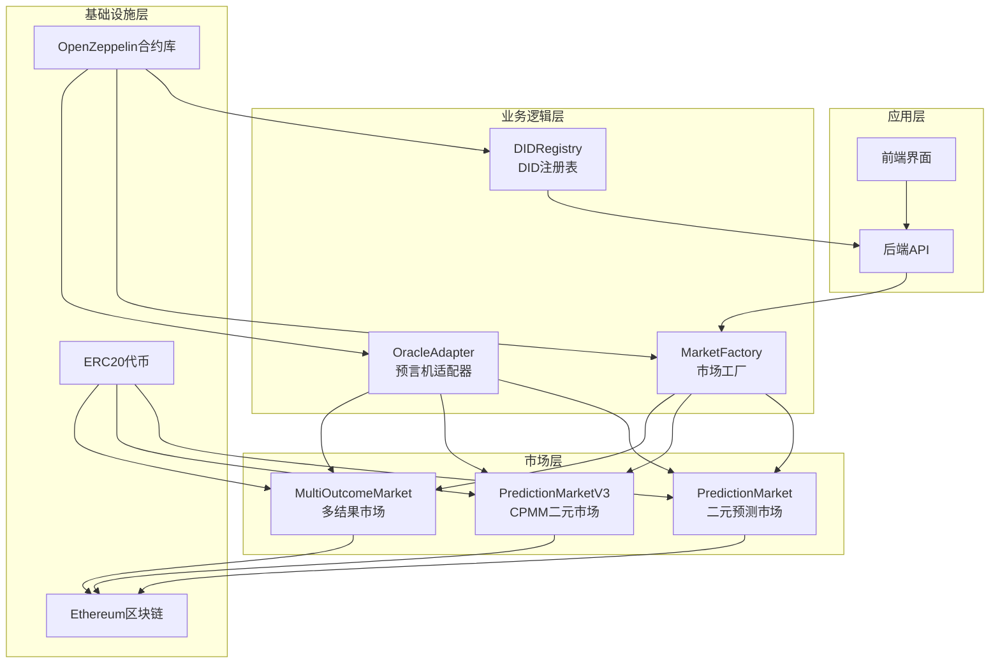

**图表来源**
- [DIDRegistry.sol:1-39](file://contracts/DIDRegistry.sol#L1-L39)
- [MarketFactory.sol:1-68](file://contracts/MarketFactory.sol#L1-L68)
- [OracleAdapter.sol:1-96](file://contracts/OracleAdapter.sol#L1-L96)
- [PredictionMarket.sol:1-145](file://contracts/PredictionMarket.sol#L1-L145)
- [PredictionMarketV3.sol:1-218](file://contracts/PredictionMarketV3.sol#L1-L218)
- [MultiOutcomeMarket.sol:1-124](file://contracts/MultiOutcomeMarket.sol#L1-L124)

**章节来源**
- [hardhat.config.js:1-33](file://hardhat.config.js#L1-L33)
- [package.json:1-22](file://package.json#L1-L22)

## 核心组件
系统由五个核心组件构成，每个组件都有明确的职责分工：

### DID注册表组件
DID注册表负责管理去中心化身份标识符，提供DID与用户地址的绑定服务。

### 市场工厂组件
市场工厂负责创建和管理各种类型的预测市场，支持二元市场和多结果市场。

### 预言机适配器组件
预言机适配器提供时间锁机制，确保市场结算的安全性和透明度。

### 预测市场组件
包含三种不同复杂度的预测市场实现，满足不同的业务需求。

### 接口定义组件
标准化的接口定义确保了组件间的互操作性和一致性。

**章节来源**
- [DIDRegistry.sol:10-39](file://contracts/DIDRegistry.sol#L10-L39)
- [MarketFactory.sol:10-68](file://contracts/MarketFactory.sol#L10-L68)
- [OracleAdapter.sol:9-96](file://contracts/OracleAdapter.sol#L9-L96)
- [IPredictionMarket.sol:6-15](file://contracts/interfaces/IPredictionMarket.sol#L6-L15)

## 架构概览
系统采用分层架构设计，实现了清晰的关注点分离：

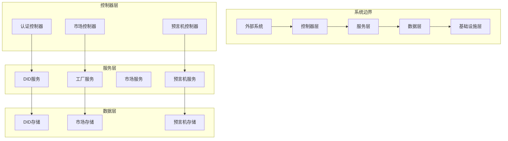

**图表来源**
- [DIDRegistry.sol:12-39](file://contracts/DIDRegistry.sol#L12-L39)
- [MarketFactory.sol:12-68](file://contracts/MarketFactory.sol#L12-L68)
- [OracleAdapter.sol:11-96](file://contracts/OracleAdapter.sol#L11-L96)

### 架构模式
系统采用了多种设计模式：

1. **工厂模式**：MarketFactory负责创建各种市场实例
2. **适配器模式**：OracleAdapter提供预言机访问控制
3. **观察者模式**：事件驱动的市场状态变更通知
4. **策略模式**：支持不同类型的市场实现

### 系统边界
- **内部边界**：智能合约之间的交互边界
- **外部边界**：与以太坊网络和用户应用的交互边界
- **安全边界**：访问控制和权限管理边界

## 详细组件分析

### DID注册表分析
DID注册表实现了去中心化身份管理的核心功能：

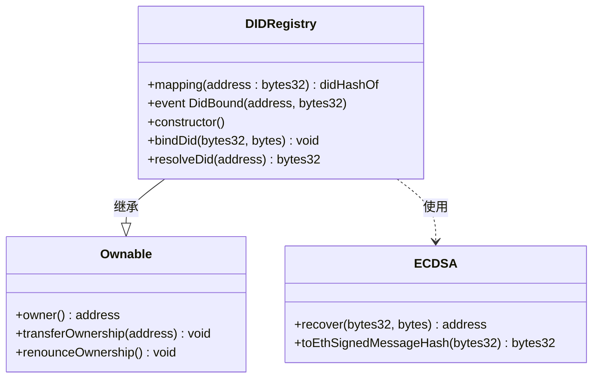

**图表来源**
- [DIDRegistry.sol:12-39](file://contracts/DIDRegistry.sol#L12-L39)

DID注册表的核心特性：
- **身份绑定**：将用户地址与DID哈希进行绑定
- **签名验证**：使用ECDSA验证绑定请求的真实性
- **查询接口**：提供DID解析功能

**章节来源**
- [DIDRegistry.sol:23-37](file://contracts/DIDRegistry.sol#L23-L37)

### 市场工厂分析
市场工厂提供了统一的市场创建和管理接口：

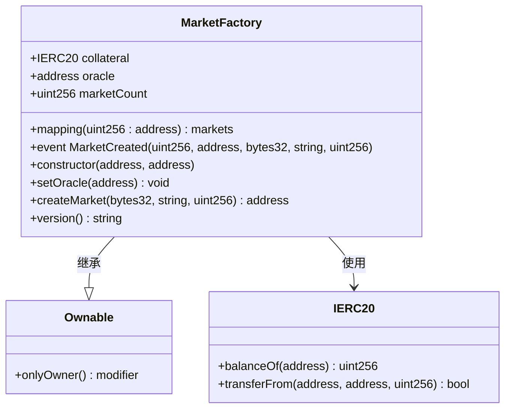

**图表来源**
- [MarketFactory.sol:12-68](file://contracts/MarketFactory.sol#L12-L68)

市场工厂的功能特性：
- **市场创建**：支持二元预测市场的批量创建
- **权限控制**：使用Ownable模式进行所有权管理
- **事件记录**：完整记录市场创建过程

**章节来源**
- [MarketFactory.sol:44-61](file://contracts/MarketFactory.sol#L44-L61)

### 预言机适配器分析
预言机适配器实现了时间锁机制，确保市场结算的安全性：

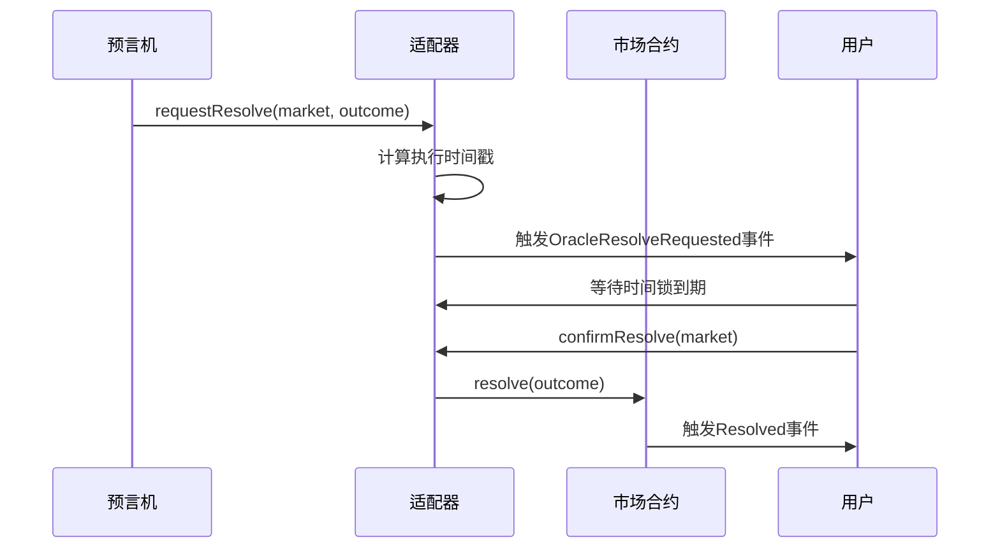

**图表来源**
- [OracleAdapter.sol:57-78](file://contracts/OracleAdapter.sol#L57-L78)

预言机适配器的关键特性：
- **时间锁机制**：防止恶意结算操作
- **角色管理**：使用AccessControl进行权限控制
- **快速路径**：支持无时间锁的紧急结算

**章节来源**
- [OracleAdapter.sol:57-94](file://contracts/OracleAdapter.sol#L57-L94)

### 预测市场分析
系统提供了三种不同复杂度的预测市场实现：

#### 传统二元市场
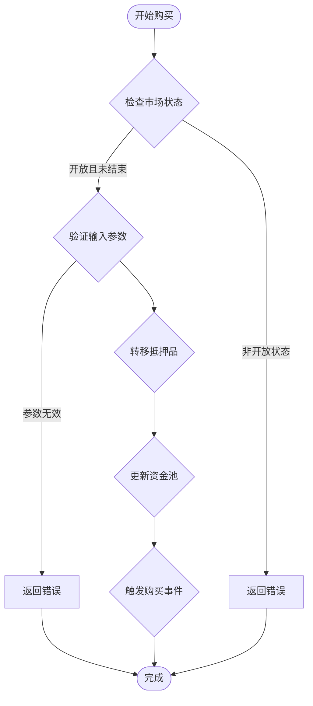

**图表来源**
- [PredictionMarket.sol:70-88](file://contracts/PredictionMarket.sol#L70-L88)

#### CPMM二元市场
CPMM（常数乘积做市商）模型实现了更复杂的流动性管理：

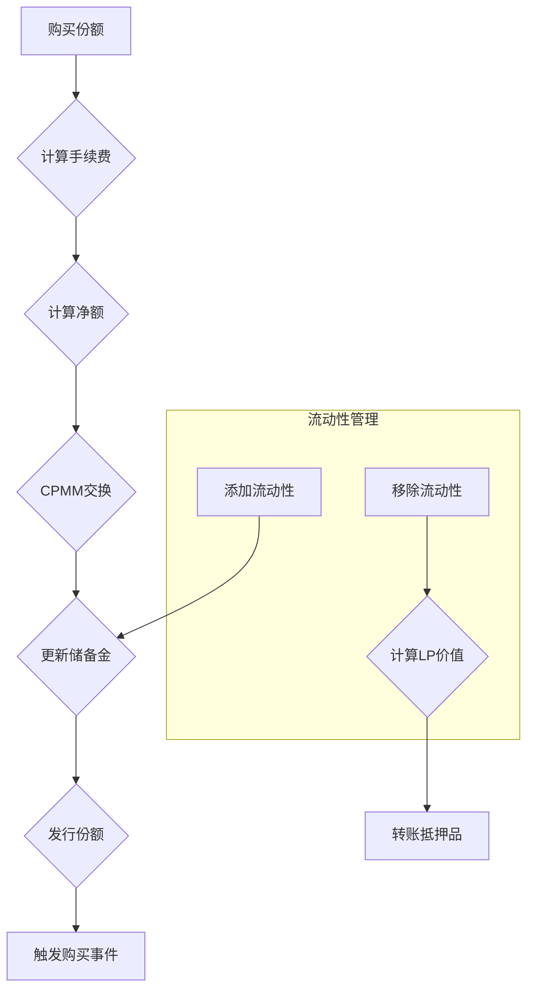

**图表来源**
- [PredictionMarketV3.sol:100-146](file://contracts/PredictionMarketV3.sol#L100-L146)

#### 多结果市场
多结果市场支持2-8个结果的预测：

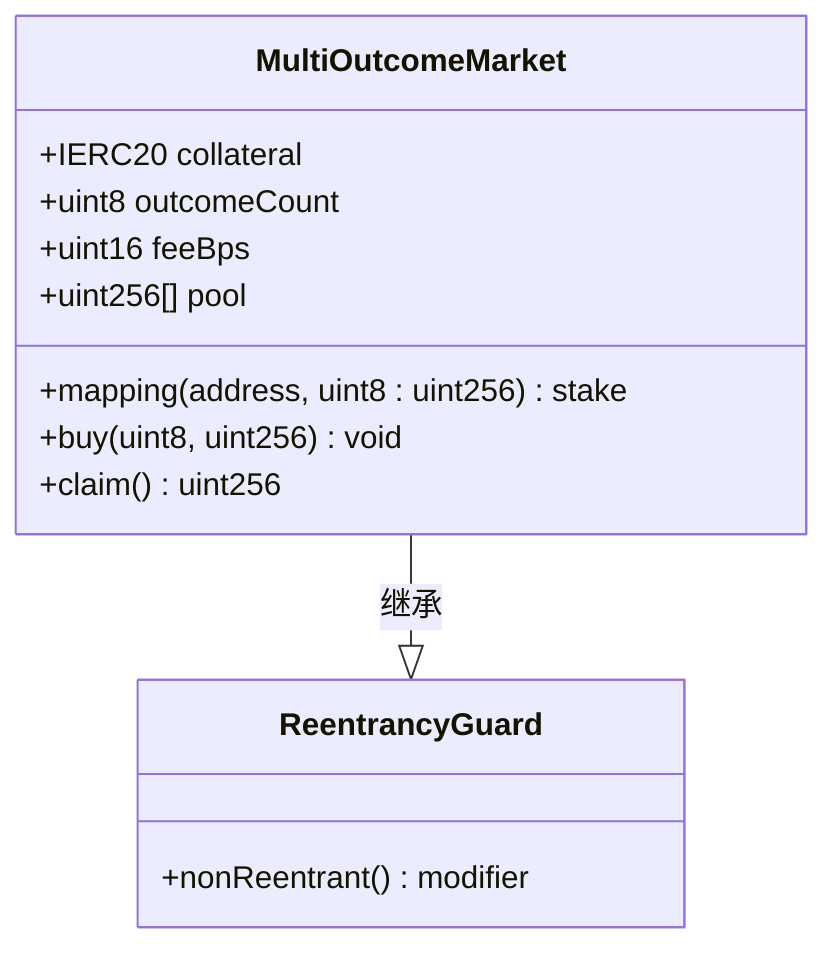

**图表来源**
- [MultiOutcomeMarket.sol:12-124](file://contracts/MultiOutcomeMarket.sol#L12-L124)

**章节来源**
- [PredictionMarketV3.sol:194-205](file://contracts/PredictionMarketV3.sol#L194-L205)

### 接口定义分析
标准化的接口确保了系统的可扩展性和互操作性：

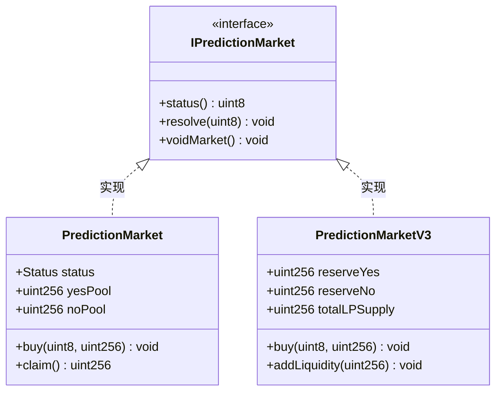

**图表来源**
- [IPredictionMarket.sol:7-15](file://contracts/interfaces/IPredictionMarket.sol#L7-L15)
- [PredictionMarket.sol:14-41](file://contracts/PredictionMarket.sol#L14-L41)
- [PredictionMarketV3.sol:15-46](file://contracts/PredictionMarketV3.sol#L15-L46)

**章节来源**
- [IPredictionMarket.sol:8-14](file://contracts/interfaces/IPredictionMarket.sol#L8-L14)

## 依赖关系分析

### 技术栈依赖
系统的技术栈采用模块化设计，主要依赖关系如下：

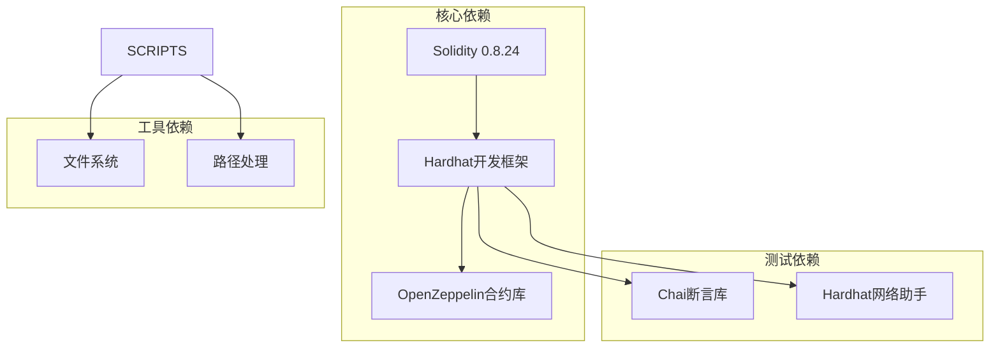

**图表来源**
- [package.json:15-21](file://package.json#L15-L21)
- [hardhat.config.js:10-16](file://hardhat.config.js#L10-L16)

### 组件间依赖
系统组件间的依赖关系体现了清晰的分层架构：

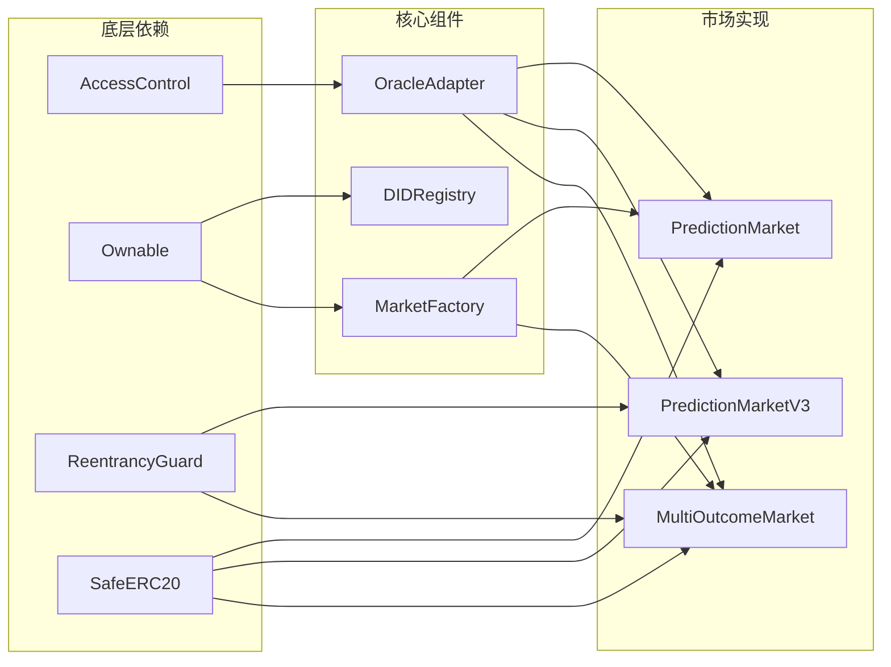

**图表来源**
- [DIDRegistry.sol:6-8](file://contracts/DIDRegistry.sol#L6-L8)
- [OracleAdapter.sol:6](file://contracts/OracleAdapter.sol#L6)
- [MarketFactory.sol:6-8](file://contracts/MarketFactory.sol#L6-L8)
- [PredictionMarketV3.sol:7-8](file://contracts/PredictionMarketV3.sol#L7-L8)

**章节来源**
- [package.json:15-21](file://package.json#L15-L21)

## 性能考量
系统在设计时充分考虑了性能优化和可扩展性：

### Gas费用优化
- **状态压缩**：使用紧凑的数据结构减少存储成本
- **批量操作**：支持批量市场创建和批量结算
- **事件优化**：合理使用事件日志减少链上存储

### 可扩展性设计
- **模块化架构**：各组件独立部署，便于扩展
- **接口抽象**：通过接口定义实现松耦合
- **版本演进**：支持渐进式功能升级

### 安全性考虑
- **重入攻击防护**：使用ReentrancyGuard保护关键函数
- **权限控制**：严格的访问控制机制
- **输入验证**：全面的参数验证和边界检查

## 故障排除指南
系统提供了完善的错误处理和调试机制：

### 常见问题诊断
1. **部署失败**：检查合约依赖和编译器版本
2. **交易回滚**：验证输入参数和状态检查
3. **Gas不足**：优化交易执行路径
4. **权限错误**：确认角色授权状态

### 调试工具
- **Hardhat调试器**：提供详细的执行跟踪
- **事件日志**：完整的操作历史记录
- **测试覆盖**：全面的单元测试和集成测试

**章节来源**
- [MarketFactory.test.js:8-29](file://test/MarketFactory.test.js#L8-L29)

## 结论
预测市场DID认证系统采用先进的区块链技术和优雅的架构设计，实现了去中心化身份认证与预测市场的有机结合。系统具有以下优势：

1. **技术先进性**：采用最新的Solidity特性和最佳实践
2. **架构合理性**：清晰的分层设计和模块化组织
3. **安全性保障**：多重安全机制和权限控制
4. **可扩展性**：支持功能演进和性能优化
5. **开发友好性**：完善的开发工具和测试框架

该系统为构建可信的去中心化预测市场生态奠定了坚实基础。

## 附录

### 部署配置
系统支持多种部署场景，包括本地开发、测试网络和主网部署。

### 监控指标
建议监控的关键指标包括：
- 交易成功率和失败率
- Gas使用效率
- 市场活动指标
- 用户参与度

### 维护计划
定期维护任务包括：
- 合约升级和审计
- 性能监控和优化
- 安全漏洞修复
- 功能增强和改进