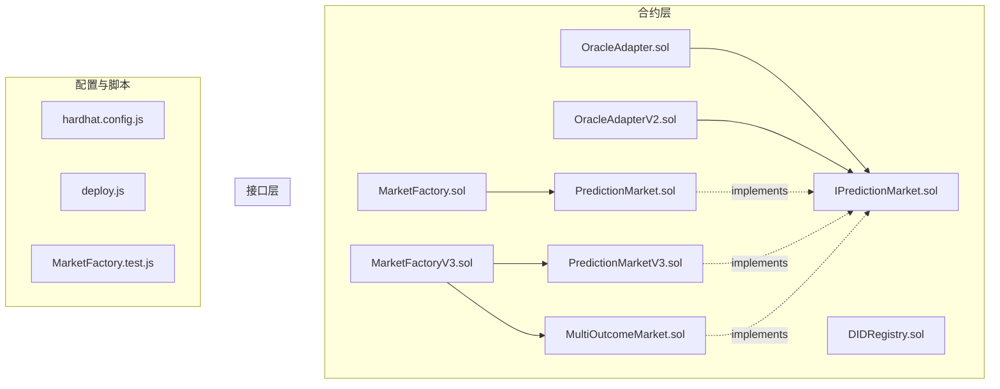
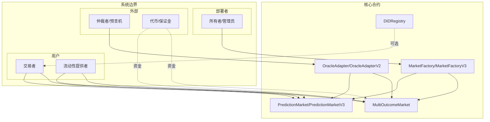
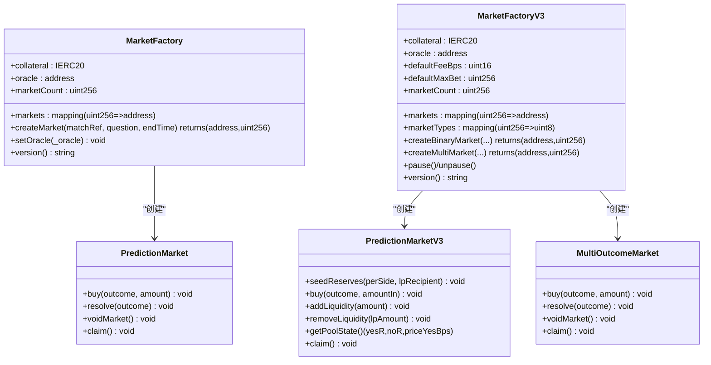
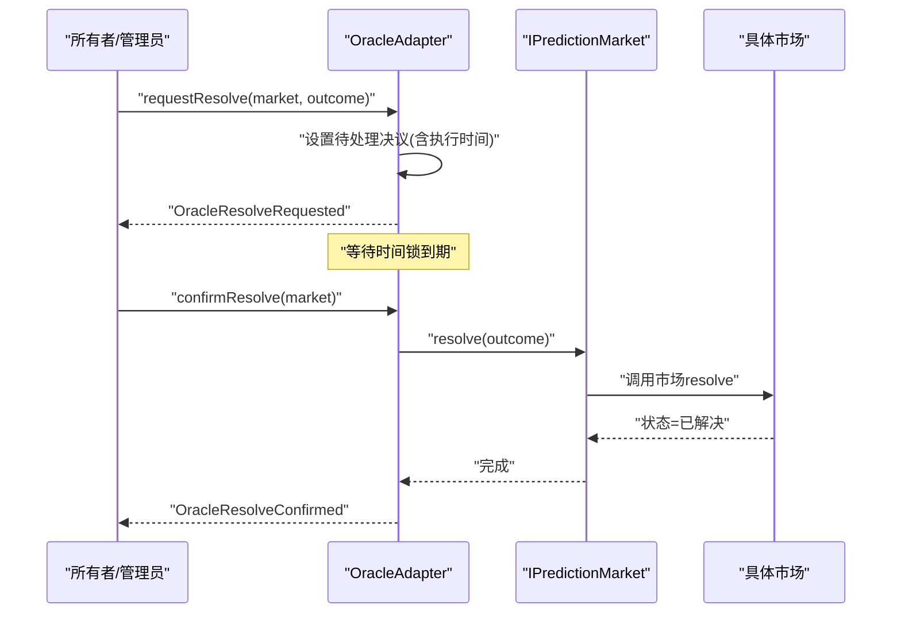
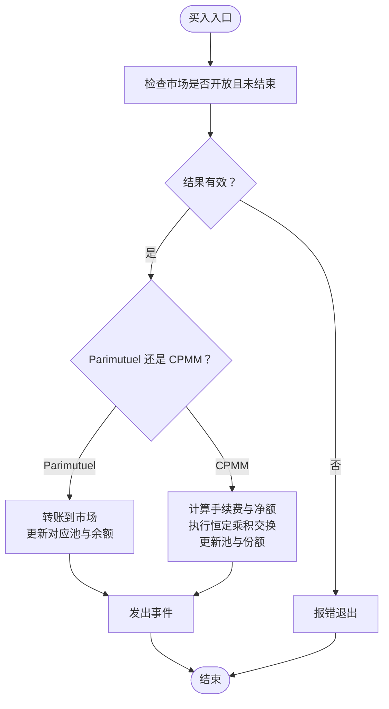
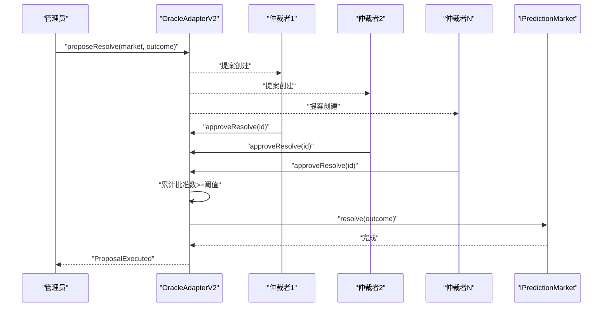
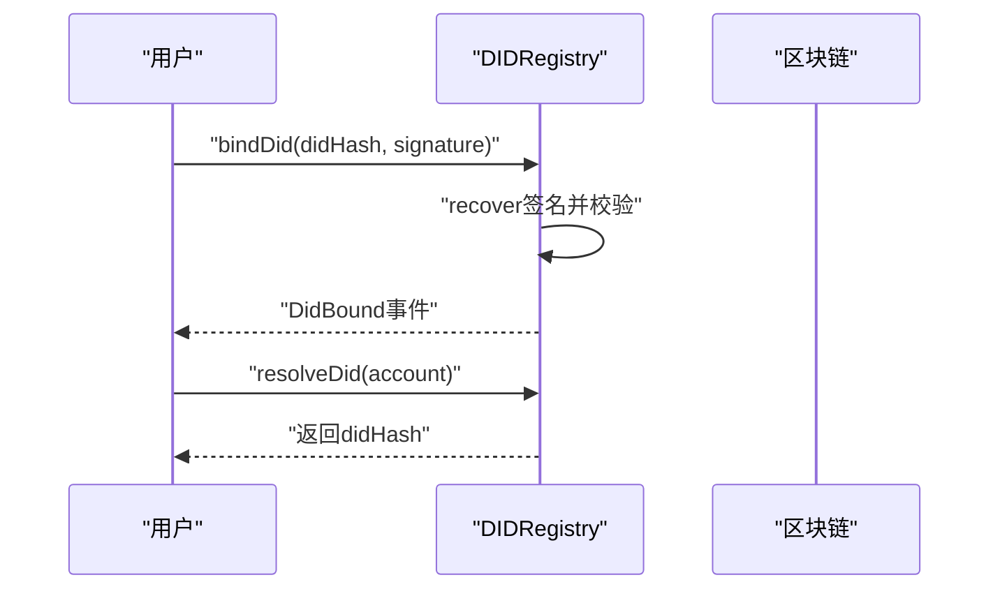
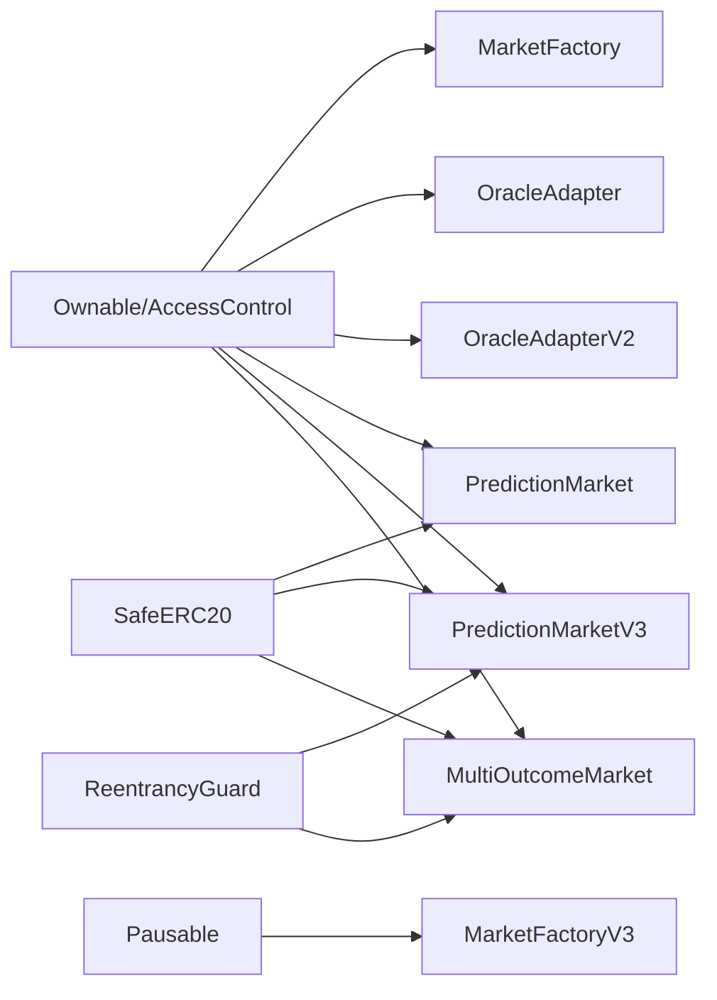

# 架构设计

<cite>
**本文引用的文件**
- [MarketFactory.sol](file://contracts/MarketFactory.sol)
- [PredictionMarket.sol](file://contracts/PredictionMarket.sol)
- [OracleAdapter.sol](file://contracts/OracleAdapter.sol)
- [DIDRegistry.sol](file://contracts/DIDRegistry.sol)
- [IPredictionMarket.sol](file://contracts/interfaces/IPredictionMarket.sol)
- [MarketFactoryV3.sol](file://contracts/MarketFactoryV3.sol)
- [PredictionMarketV3.sol](file://contracts/PredictionMarketV3.sol)
- [OracleAdapterV2.sol](file://contracts/OracleAdapterV2.sol)
- [MultiOutcomeMarket.sol](file://contracts/MultiOutcomeMarket.sol)
- [hardhat.config.js](file://hardhat.config.js)
- [deploy.js](file://scripts/deploy.js)
- [MarketFactory.test.js](file://test/MarketFactory.test.js)
</cite>

## 目录
1. [引言](#引言)
2. [项目结构](#项目结构)
3. [核心组件](#核心组件)
4. [架构总览](#架构总览)
5. [详细组件分析](#详细组件分析)
6. [依赖关系分析](#依赖关系分析)
7. [性能考量](#性能考量)
8. [故障排查指南](#故障排查指南)
9. [结论](#结论)
10. [附录](#附录)

## 引言
本架构设计文档面向预测市场系统，聚焦于工厂模式在市场创建与管理中的应用、Parimutuel 与 CPMM 模型的架构差异、时间锁定与多签名共识的安全设计、以及 DIDRegistry 的集成。文档通过系统边界图、组件交互图与数据流向图，帮助读者从高层到细节全面理解系统的设计理念与实现路径，并提供可扩展性、安全性与性能优化建议及版本演进与兼容性策略。

## 项目结构
该仓库采用按功能模块划分的组织方式：
- 合约层：核心业务合约（市场工厂、预测市场、适配器、注册表）与接口定义
- 接口层：统一的市场接口，便于不同版本市场实现的一致调用
- 配置与脚本：Hardhat 配置、部署脚本与测试用例
- Artifacts：编译产物与 ABI 导出

图表来源
- [MarketFactory.sol](file://contracts/MarketFactory.sol#L1-L60)
- [PredictionMarket.sol](file://contracts/PredictionMarket.sol#L1-L134)
- [OracleAdapter.sol](file://contracts/OracleAdapter.sol#L1-L83)
- [DIDRegistry.sol](file://contracts/DIDRegistry.sol#L1-L34)
- [IPredictionMarket.sol](file://contracts/interfaces/IPredictionMarket.sol#L1-L9)
- [MarketFactoryV3.sol](file://contracts/MarketFactoryV3.sol#L1-L94)
- [PredictionMarketV3.sol](file://contracts/PredictionMarketV3.sol#L1-L200)
- [OracleAdapterV2.sol](file://contracts/OracleAdapterV2.sol#L1-L83)
- [MultiOutcomeMarket.sol](file://contracts/MultiOutcomeMarket.sol#L1-L113)
- [hardhat.config.js](file://hardhat.config.js#L1-L30)
- [deploy.js](file://scripts/deploy.js#L1-L57)
- [MarketFactory.test.js](file://test/MarketFactory.test.js#L1-L28)

章节来源
- [hardhat.config.js](file://hardhat.config.js#L1-L30)
- [deploy.js](file://scripts/deploy.js#L1-L57)
- [MarketFactory.test.js](file://test/MarketFactory.test.js#L1-L28)

## 核心组件
- 市场工厂（MarketFactory/MarketFactoryV3）
  - 负责创建二元 Parimutuel 市场（v2）或二元 CPMM 市场与多结果市场（v3），并维护市场映射与计数
  - 提供版本标识与暂停/恢复能力（V3）
- 预测市场（PredictionMarket/PredictionMarketV3/MultiOutcomeMarket）
  - 实现 Parimutuel 或 CPMM 两种流动性模型；支持买票、结算、退费、声明兑付
  - V3 增加 LP 份额、手续费、最大投注限制、池状态查询等
- 仲裁适配器（OracleAdapter/OracleAdapterV2）
  - 提供时间锁定的单角色仲裁（v1）或多签共识（v2）；支持请求/确认或提案审批流程
- DID 注册表（DIDRegistry）
  - 可选的链上 DID 绑定与解析服务，用于身份绑定与验证

章节来源
- [MarketFactory.sol](file://contracts/MarketFactory.sol#L1-L60)
- [MarketFactoryV3.sol](file://contracts/MarketFactoryV3.sol#L1-L94)
- [PredictionMarket.sol](file://contracts/PredictionMarket.sol#L1-L134)
- [PredictionMarketV3.sol](file://contracts/PredictionMarketV3.sol#L1-L200)
- [MultiOutcomeMarket.sol](file://contracts/MultiOutcomeMarket.sol#L1-L113)
- [OracleAdapter.sol](file://contracts/OracleAdapter.sol#L1-L83)
- [OracleAdapterV2.sol](file://contracts/OracleAdapterV2.sol#L1-L83)
- [DIDRegistry.sol](file://contracts/DIDRegistry.sol#L1-L34)

## 架构总览
系统采用“工厂 + 市场 + 仲裁适配器 + 注册表”的分层架构。工厂负责创建市场实例，市场负责交易与结算，仲裁适配器负责安全的决议流程，注册表提供可选的身份绑定能力。不同版本的工厂与市场体现了模型演进：从 Parimutuel 到 CPMM，从二元到多结果，从单角色到多签共识。

图表来源
- [MarketFactory.sol](file://contracts/MarketFactory.sol#L1-L60)
- [MarketFactoryV3.sol](file://contracts/MarketFactoryV3.sol#L1-L94)
- [PredictionMarket.sol](file://contracts/PredictionMarket.sol#L1-L134)
- [PredictionMarketV3.sol](file://contracts/PredictionMarketV3.sol#L1-L200)
- [MultiOutcomeMarket.sol](file://contracts/MultiOutcomeMarket.sol#L1-L113)
- [OracleAdapter.sol](file://contracts/OracleAdapter.sol#L1-L83)
- [OracleAdapterV2.sol](file://contracts/OracleAdapterV2.sol#L1-L83)
- [DIDRegistry.sol](file://contracts/DIDRegistry.sol#L1-L34)

## 详细组件分析

### 工厂模式与市场创建
- MarketFactory（v2）
  - 仅创建二元 Parimutuel 市场，通过构造函数注入代币与仲裁适配器地址
  - 仅所有者可创建市场，返回市场地址与 ID，并发出事件
- MarketFactoryV3（v3）
  - 支持二元 CPMM 市场与多结果市场；内置暂停/恢复、默认费用、默认最大投注
  - 二元市场支持初始流动性注入与 LP 种子池；多结果市场支持 2–8 结果
  - 通过工厂映射维护市场类型（二元/多结果）

图表来源
- [MarketFactory.sol](file://contracts/MarketFactory.sol#L1-L60)
- [MarketFactoryV3.sol](file://contracts/MarketFactoryV3.sol#L1-L94)
- [PredictionMarket.sol](file://contracts/PredictionMarket.sol#L1-L134)
- [PredictionMarketV3.sol](file://contracts/PredictionMarketV3.sol#L1-L200)
- [MultiOutcomeMarket.sol](file://contracts/MultiOutcomeMarket.sol#L1-L113)

章节来源
- [MarketFactory.sol](file://contracts/MarketFactory.sol#L37-L54)
- [MarketFactoryV3.sol](file://contracts/MarketFactoryV3.sol#L37-L88)

### 仲裁适配器与 IPredictionMarket 接口
- OracleAdapter（v1）
  - 单角色权限，支持时间锁定的请求/确认流程；当时间锁为 0 时支持即时结算
  - 通过 IPredictionMarket 接口调用市场 resolve/void
- OracleAdapterV2（v2）
  - 多签共识（阈值提案），提案人自动批准，达到阈值后执行
  - 支持多结果市场（最多 8 个结果）的决议
- IPredictionMarket
  - 统一的市场接口，包含状态查询、resolve、void 等方法

图表来源
- [OracleAdapter.sol](file://contracts/OracleAdapter.sol#L48-L67)
- [IPredictionMarket.sol](file://contracts/interfaces/IPredictionMarket.sol#L1-L9)

章节来源
- [OracleAdapter.sol](file://contracts/OracleAdapter.sol#L1-L83)
- [OracleAdapterV2.sol](file://contracts/OracleAdapterV2.sol#L1-L83)
- [IPredictionMarket.sol](file://contracts/interfaces/IPredictionMarket.sol#L1-L9)

### Parimutuel 与 CPMM 的架构差异
- Parimutuel（v2）
  - 二元市场，资金池按结果聚合；兑付基于总池与胜方池的比例
  - 无 LP 份额与手续费；交易即直接买入对应方向的份额
- CPMM（v3）
  - 使用恒定乘积做市模型（X·Y），买卖按价格滑点计算
  - 引入 LP 份额、手续费收集、最大投注限制、池状态查询
  - 支持流动性添加/移除，提升资金效率与定价精度

图表来源
- [PredictionMarket.sol](file://contracts/PredictionMarket.sol#L64-L81)
- [PredictionMarketV3.sol](file://contracts/PredictionMarketV3.sol#L92-L111)

章节来源
- [PredictionMarket.sol](file://contracts/PredictionMarket.sol#L1-L134)
- [PredictionMarketV3.sol](file://contracts/PredictionMarketV3.sol#L1-L200)
- [MultiOutcomeMarket.sol](file://contracts/MultiOutcomeMarket.sol#L1-L113)

### 时间锁定机制与多签名共识
- 时间锁定（v1）
  - 请求阶段设置执行时间；确认阶段校验时间锁到期后执行
  - 适合单角色仲裁，降低即时操作风险
- 多签名共识（v2）
  - 提案阶段由仲裁者发起；每个仲裁者独立批准；达到阈值后自动执行
  - 提高抗审查与去中心化程度，适用于多方治理场景

图表来源
- [OracleAdapterV2.sol](file://contracts/OracleAdapterV2.sol#L44-L75)
- [IPredictionMarket.sol](file://contracts/interfaces/IPredictionMarket.sol#L1-L9)

章节来源
- [OracleAdapter.sol](file://contracts/OracleAdapter.sol#L1-L83)
- [OracleAdapterV2.sol](file://contracts/OracleAdapterV2.sol#L1-L83)

### DIDRegistry 集成
- 可选的链上 DID 绑定，用户通过签名绑定自己的 DID 哈希
- 提供解析接口，便于在前端或服务端进行身份核验
- 在预测市场中可用于用户身份验证与审计

图表来源
- [DIDRegistry.sol](file://contracts/DIDRegistry.sol#L19-L32)

章节来源
- [DIDRegistry.sol](file://contracts/DIDRegistry.sol#L1-L34)

## 依赖关系分析
- 组件耦合
  - 工厂与市场：工厂持有市场实例地址映射，便于版本化管理
  - 仲裁适配器与市场：通过 IPredictionMarket 接口解耦，支持不同版本市场
  - 注册表与用户：可选集成，不改变核心交易流程
- 外部依赖
  - OpenZeppelin 合约库：AccessControl、Ownable、Pausable、ReentrancyGuard、SafeERC20 等
  - EVM 版本：Cancun，支持更高效的执行环境

图表来源
- [MarketFactory.sol](file://contracts/MarketFactory.sol#L4-L6)
- [OracleAdapter.sol](file://contracts/OracleAdapter.sol#L4-L5)
- [OracleAdapterV2.sol](file://contracts/OracleAdapterV2.sol#L4-L5)
- [PredictionMarket.sol](file://contracts/PredictionMarket.sol#L4-L6)
- [PredictionMarketV3.sol](file://contracts/PredictionMarketV3.sol#L4-L6)
- [MultiOutcomeMarket.sol](file://contracts/MultiOutcomeMarket.sol#L4-L6)
- [MarketFactoryV3.sol](file://contracts/MarketFactoryV3.sol#L4-L8)

章节来源
- [hardhat.config.js](file://hardhat.config.js#L7-L13)

## 性能考量
- 优化器与 EVM 版本
  - 启用优化器，runs 设置为 200，兼顾 gas 与执行效率
  - 使用 Cancun EVM，支持更高效的指令集
- 交易路径优化
  - CPMM 通过恒定乘积减少多次查询成本，滑点与手续费计算在合约内完成
  - 多结果市场按需遍历池数组，避免不必要的存储读取
- 并发控制
  - ReentrancyGuard 防止重入攻击，保障资金安全
  - 批量操作建议在前端聚合，减少链上往返

章节来源
- [hardhat.config.js](file://hardhat.config.js#L9-L12)
- [PredictionMarketV3.sol](file://contracts/PredictionMarketV3.sol#L6-L6)
- [MultiOutcomeMarket.sol](file://contracts/MultiOutcomeMarket.sol#L6-L6)

## 故障排查指南
- 常见错误与定位
  - 市场未开放或已结束：检查状态与结束时间
  - 结果无效：确保 outcome 在允许范围内（二元为 0/1，多结果为 0..N-1）
  - 未满足时间锁：v1 适配器需等待时间锁到期后确认
  - 多签未达阈值：v2 适配器需确保足够仲裁者批准
  - 重复兑付：已兑付标记防止重复领取
- 调试建议
  - 使用 Hardhat 测试网络与本地节点进行复现
  - 通过事件日志追踪状态变化与资金流动
  - 对比 v2 与 v3 的行为差异，确认所用版本

章节来源
- [PredictionMarket.sol](file://contracts/PredictionMarket.sol#L64-L81)
- [OracleAdapter.sol](file://contracts/OracleAdapter.sol#L48-L67)
- [OracleAdapterV2.sol](file://contracts/OracleAdapterV2.sol#L44-L75)
- [MarketFactory.test.js](file://test/MarketFactory.test.js#L1-L28)

## 结论
该系统以工厂模式为核心，实现了从 Parimutuel 到 CPMM 的模型演进，从二元到多结果的扩展，并通过时间锁定与多签名共识提升了安全性与治理弹性。DIDRegistry 提供可选的身份绑定能力。通过接口抽象与版本化工厂，系统具备良好的可扩展性与向后兼容性。建议在生产环境中结合多签阈值与暂停机制，持续监控 gas 与滑点表现，并完善前端审计与用户引导。

## 附录
- 部署与运行
  - 使用 Hardhat 编译与测试，部署脚本初始化代币、仲裁适配器与工厂，并授予管理员权限
  - 通过脚本导出 ABI 与部署信息，便于前端集成
- 版本演进与兼容性
  - v2：Parimutuel 二元市场，简单可靠
  - v3：CPMM 二元与多结果市场，引入 LP 与手续费，增强资金效率
  - 通过接口统一与工厂映射，新旧版本可并存，逐步迁移

章节来源
- [deploy.js](file://scripts/deploy.js#L1-L57)
- [MarketFactoryV3.sol](file://contracts/MarketFactoryV3.sol#L1-L94)
- [IPredictionMarket.sol](file://contracts/interfaces/IPredictionMarket.sol#L1-L9)