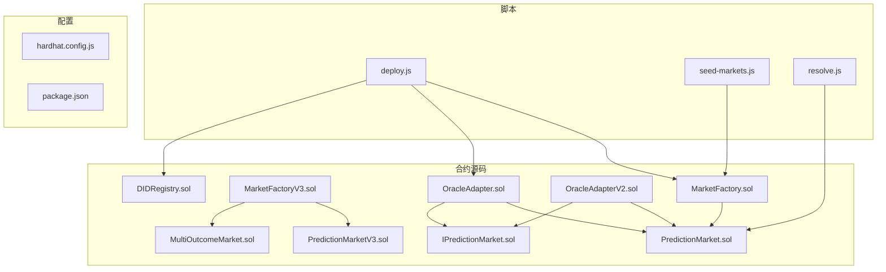
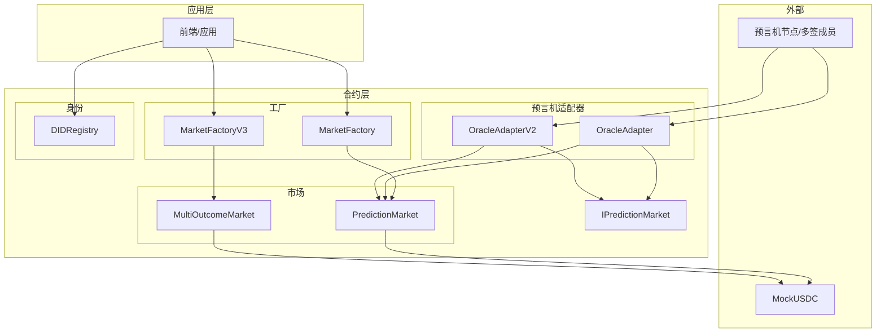
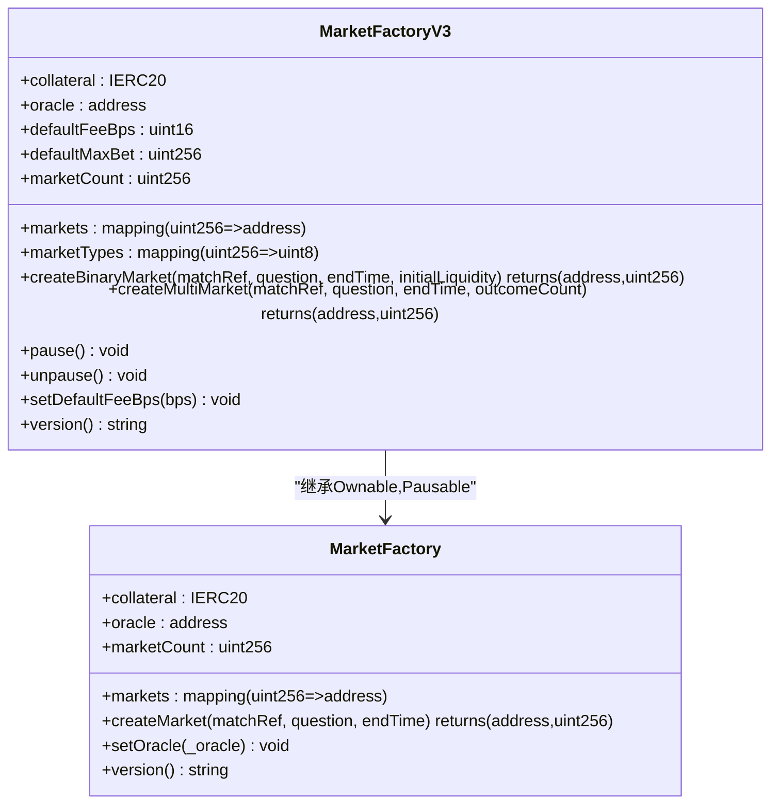
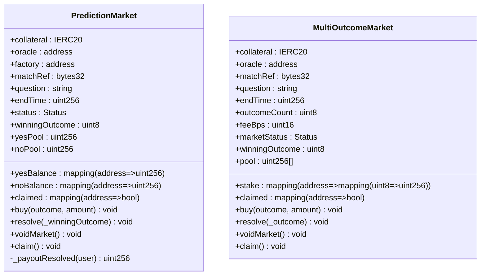
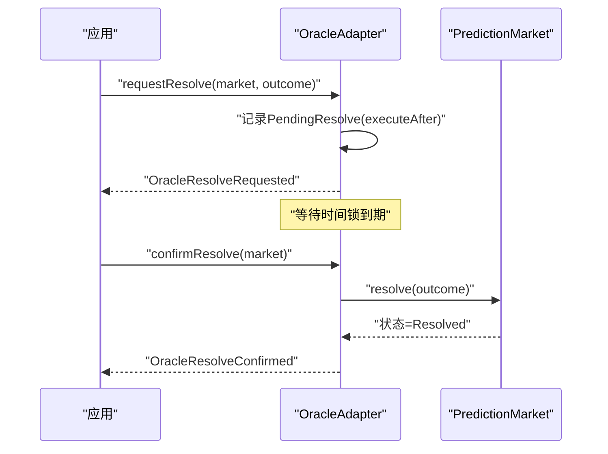
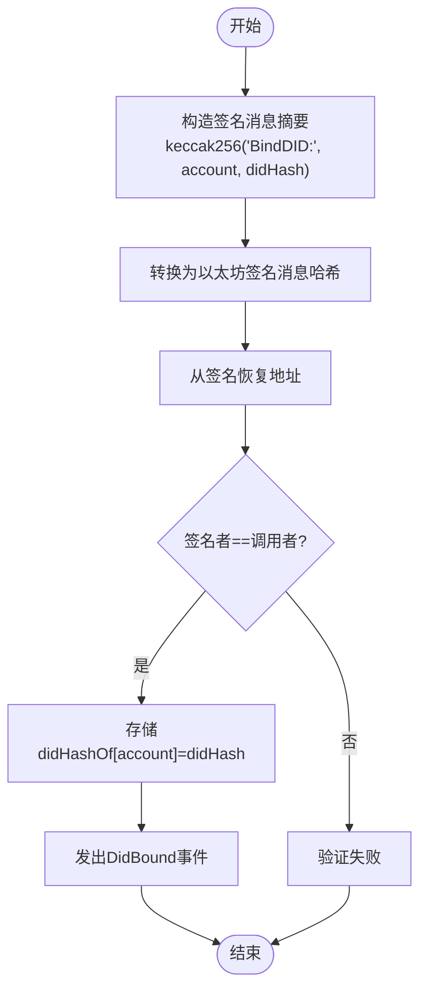
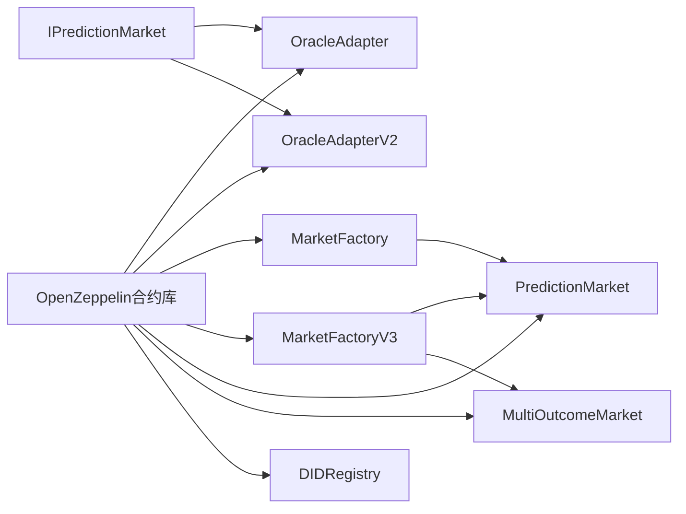

# 系统概览

<cite>
**本文档引用的文件**
- [PredictionMarket.sol](file://contracts/contracts/PredictionMarket.sol)
- [DIDRegistry.sol](file://contracts/contracts/DIDRegistry.sol)
- [MarketFactory.sol](file://contracts/contracts/MarketFactory.sol)
- [OracleAdapter.sol](file://contracts/contracts/OracleAdapter.sol)
- [IPredictionMarket.sol](file://contracts/contracts/interfaces/IPredictionMarket.sol)
- [MarketFactoryV3.sol](file://contracts/contracts/MarketFactoryV3.sol)
- [MultiOutcomeMarket.sol](file://contracts/contracts/MultiOutcomeMarket.sol)
- [OracleAdapterV2.sol](file://contracts/contracts/OracleAdapterV2.sol)
- [hardhat.config.js](file://contracts/hardhat.config.js)
- [package.json](file://contracts/package.json)
- [deploy.js](file://contracts/scripts/deploy.js)
- [seed-markets.js](file://contracts/scripts/seed-markets.js)
- [resolve.js](file://contracts/scripts/resolve.js)
- [MarketFactory.test.js](file://contracts/test/MarketFactory.test.js)
- [PredictionMarket.test.js](file://contracts/test/PredictionMarket.test.js)
</cite>

## 目录
1. [引言](#引言)
2. [项目结构](#项目结构)
3. [核心组件](#核心组件)
4. [架构总览](#架构总览)
5. [详细组件分析](#详细组件分析)
6. [依赖分析](#依赖分析)
7. [性能考量](#性能考量)
8. [故障排查指南](#故障排查指南)
9. [结论](#结论)
10. [附录](#附录)

## 引言
本系统是一个基于以太坊的预测市场基础设施，支持二元与多结果的互池式（parimutuel）市场，并通过DID（去中心身份）注册能力实现链上身份绑定。系统采用工厂-适配器-市场三层架构：工厂负责创建市场；预言机适配器负责对市场进行结算与作废操作（支持单签与多签两种模式）；市场合约负责处理用户押注、结算与奖励派发；DID注册表提供可选的身份哈希绑定能力。

系统目标：
- 提供透明、可审计的预测市场机制
- 通过预言机适配器实现可控的结算流程（单签或多签）
- 支持二元与多结果市场，满足不同场景需求
- 提供DID绑定能力，便于与外部身份系统对接

## 项目结构
仓库采用按功能分层的组织方式：
- contracts/contracts：核心合约源码（市场、工厂、适配器、DID注册表等）
- contracts/artifacts：编译产物与ABI
- contracts/scripts：部署与种子数据脚本
- contracts/test：单元测试
- contracts/hardhat.config.js：编译与网络配置
- contracts/package.json：构建与脚本命令

图表来源
- [MarketFactory.sol:1-68](file://contracts/contracts/MarketFactory.sol#L1-L68)
- [MarketFactoryV3.sol:1-104](file://contracts/contracts/MarketFactoryV3.sol#L1-L104)
- [OracleAdapter.sol:1-96](file://contracts/contracts/OracleAdapter.sol#L1-L96)
- [OracleAdapterV2.sol:1-95](file://contracts/contracts/OracleAdapterV2.sol#L1-L95)
- [PredictionMarket.sol:1-145](file://contracts/contracts/PredictionMarket.sol#L1-L145)
- [MultiOutcomeMarket.sol:1-124](file://contracts/contracts/MultiOutcomeMarket.sol#L1-L124)
- [DIDRegistry.sol:1-39](file://contracts/contracts/DIDRegistry.sol#L1-L39)
- [IPredictionMarket.sol:1-15](file://contracts/contracts/interfaces/IPredictionMarket.sol#L1-L15)
- [deploy.js:1-60](file://contracts/scripts/deploy.js#L1-L60)
- [seed-markets.js:1-37](file://contracts/scripts/seed-markets.js#L1-L37)
- [resolve.js:1-22](file://contracts/scripts/resolve.js#L1-L22)
- [hardhat.config.js:1-33](file://contracts/hardhat.config.js#L1-L33)
- [package.json:1-22](file://contracts/package.json#L1-L22)

章节来源
- [hardhat.config.js:1-33](file://contracts/hardhat.config.js#L1-L33)
- [package.json:1-22](file://contracts/package.json#L1-L22)

## 核心组件
- 市场合约（PredictionMarket/MultiOutcomeMarket）：处理用户押注、资金池管理、结算与奖励派发，支持二元与多结果市场。
- 工厂合约（MarketFactory/MarketFactoryV3）：统一部署与管理市场，支持二元V3与多结果市场类型。
- 预言机适配器（OracleAdapter/OracleAdapterV2）：提供结算与作废流程，支持单签时间锁与m-of-n多签。
- DID注册表（DIDRegistry）：提供链上DID哈希绑定与解析能力。
- 接口（IPredictionMarket）：定义市场合约必须实现的方法，确保适配器与多版本市场的兼容性。

章节来源
- [PredictionMarket.sol:1-145](file://contracts/contracts/PredictionMarket.sol#L1-L145)
- [MultiOutcomeMarket.sol:1-124](file://contracts/contracts/MultiOutcomeMarket.sol#L1-L124)
- [MarketFactory.sol:1-68](file://contracts/contracts/MarketFactory.sol#L1-L68)
- [MarketFactoryV3.sol:1-104](file://contracts/contracts/MarketFactoryV3.sol#L1-L104)
- [OracleAdapter.sol:1-96](file://contracts/contracts/OracleAdapter.sol#L1-L96)
- [OracleAdapterV2.sol:1-95](file://contracts/contracts/OracleAdapterV2.sol#L1-L95)
- [DIDRegistry.sol:1-39](file://contracts/contracts/DIDRegistry.sol#L1-L39)
- [IPredictionMarket.sol:1-15](file://contracts/contracts/interfaces/IPredictionMarket.sol#L1-L15)

## 架构总览
系统采用“工厂-适配器-市场”的分层架构，结合OpenZeppelin的安全库与访问控制，确保资金安全与权限清晰。DID注册表作为可选组件，用于链上身份绑定。

图表来源
- [MarketFactory.sol:1-68](file://contracts/contracts/MarketFactory.sol#L1-L68)
- [MarketFactoryV3.sol:1-104](file://contracts/contracts/MarketFactoryV3.sol#L1-L104)
- [PredictionMarket.sol:1-145](file://contracts/contracts/PredictionMarket.sol#L1-L145)
- [MultiOutcomeMarket.sol:1-124](file://contracts/contracts/MultiOutcomeMarket.sol#L1-L124)
- [OracleAdapter.sol:1-96](file://contracts/contracts/OracleAdapter.sol#L1-L96)
- [OracleAdapterV2.sol:1-95](file://contracts/contracts/OracleAdapterV2.sol#L1-L95)
- [DIDRegistry.sol:1-39](file://contracts/contracts/DIDRegistry.sol#L1-L39)
- [IPredictionMarket.sol:1-15](file://contracts/contracts/interfaces/IPredictionMarket.sol#L1-L15)

## 详细组件分析

### 工厂合约（MarketFactory/MarketFactoryV3）
- 职责
  - MarketFactory：部署二元预测市场，维护市场列表，提供版本查询。
  - MarketFactoryV3：支持二元V3市场与多结果市场，引入暂停机制、默认手续费与最大押注限制。
- 关键属性与方法
  - 抵押品代币、预言机地址、市场计数、市场映射。
  - 创建市场、设置预言机、版本查询、暂停/恢复。
- 设计要点
  - 使用OpenZeppelin Ownable与Pausable，确保权限与运营可控。
  - V3工厂支持初始流动性注入与费用策略配置。

图表来源
- [MarketFactory.sol:1-68](file://contracts/contracts/MarketFactory.sol#L1-L68)
- [MarketFactoryV3.sol:1-104](file://contracts/contracts/MarketFactoryV3.sol#L1-L104)

章节来源
- [MarketFactory.sol:1-68](file://contracts/contracts/MarketFactory.sol#L1-L68)
- [MarketFactoryV3.sol:1-104](file://contracts/contracts/MarketFactoryV3.sol#L1-L104)

### 市场合约（PredictionMarket/MultiOutcomeMarket）
- 职责
  - PredictionMarket：二元互池式市场，支持yes/no两方押注、结算与奖励派发。
  - MultiOutcomeMarket：N结果互池式市场，支持2-8个结果，收取手续费，支持多签结算。
- 关键属性与方法
  - 状态枚举、资金池、用户余额映射、事件。
  - buy/outcome, resolve, voidMarket, claim。
- 设计要点
  - 使用SafeERC20与ReentrancyGuard，保障资金安全。
  - V3市场引入手续费与最大押注限制，提升抗操纵能力。

图表来源
- [PredictionMarket.sol:1-145](file://contracts/contracts/PredictionMarket.sol#L1-L145)
- [MultiOutcomeMarket.sol:1-124](file://contracts/contracts/MultiOutcomeMarket.sol#L1-L124)

章节来源
- [PredictionMarket.sol:1-145](file://contracts/contracts/PredictionMarket.sol#L1-L145)
- [MultiOutcomeMarket.sol:1-124](file://contracts/contracts/MultiOutcomeMarket.sol#L1-L124)

### 预言机适配器（OracleAdapter/OracleAdapterV2）
- 职责
  - OracleAdapter：单签+时间锁模式，支持请求与确认两步结算，以及即时结算（时间锁为0）。
  - OracleAdapterV2：m-of-n多签模式，提案-批准-执行流程，满足更严格的治理要求。
- 关键属性与方法
  - 角色管理（AccessControl）、时间锁延迟、工厂地址、待处理结算映射、提案映射。
  - requestResolve/confirmResolve/resolveNow/voidMarket；proposeResolve/approveResolve/voidMarket。
- 设计要点
  - 通过onlyRole修饰符严格限制调用权限。
  - V2多签模式提升安全性与去中心化程度。

图表来源
- [OracleAdapter.sol:1-96](file://contracts/contracts/OracleAdapter.sol#L1-L96)
- [PredictionMarket.sol:1-145](file://contracts/contracts/PredictionMarket.sol#L1-L145)

章节来源
- [OracleAdapter.sol:1-96](file://contracts/contracts/OracleAdapter.sol#L1-L96)
- [OracleAdapterV2.sol:1-95](file://contracts/contracts/OracleAdapterV2.sol#L1-L95)

### DID注册表（DIDRegistry）
- 职责：将用户地址与DID哈希进行绑定，支持签名验证与解析。
- 关键属性与方法
  - didHashOf映射、bindDid(signature)、resolveDid(account)。
- 设计要点
  - 使用ECDSA与MessageHashUtils进行签名恢复与消息哈希转换。
  - 事件DidBound便于链上追踪。

图表来源
- [DIDRegistry.sol:1-39](file://contracts/contracts/DIDRegistry.sol#L1-L39)

章节来源
- [DIDRegistry.sol:1-39](file://contracts/contracts/DIDRegistry.sol#L1-L39)

### 接口（IPredictionMarket）
- 职责：定义市场合约必须实现的方法，保证适配器与多版本市场的统一交互。
- 方法：status()、resolve(winningOutcome)、voidMarket()。

章节来源
- [IPredictionMarket.sol:1-15](file://contracts/contracts/interfaces/IPredictionMarket.sol#L1-L15)

## 依赖分析
- 合约依赖
  - OpenZeppelin：AccessControl、Ownable、Pausable、ReentrancyGuard、SafeERC20、ECDSA、MessageHashUtils等。
  - 合约间耦合：工厂依赖市场合约；适配器依赖市场接口；DID注册表独立。
- 运行时依赖
  - Hardhat工具链、Solidity编译器、脚本命令。

图表来源
- [OracleAdapter.sol:1-96](file://contracts/contracts/OracleAdapter.sol#L1-L96)
- [OracleAdapterV2.sol:1-95](file://contracts/contracts/OracleAdapterV2.sol#L1-L95)
- [MarketFactory.sol:1-68](file://contracts/contracts/MarketFactory.sol#L1-L68)
- [MarketFactoryV3.sol:1-104](file://contracts/contracts/MarketFactoryV3.sol#L1-L104)
- [PredictionMarket.sol:1-145](file://contracts/contracts/PredictionMarket.sol#L1-L145)
- [MultiOutcomeMarket.sol:1-124](file://contracts/contracts/MultiOutcomeMarket.sol#L1-L124)
- [DIDRegistry.sol:1-39](file://contracts/contracts/DIDRegistry.sol#L1-L39)
- [IPredictionMarket.sol:1-15](file://contracts/contracts/interfaces/IPredictionMarket.sol#L1-L15)

章节来源
- [hardhat.config.js:1-33](file://contracts/hardhat.config.js#L1-L33)
- [package.json:1-22](file://contracts/package.json#L1-L22)

## 性能考量
- 编译优化
  - 启用Solidity优化器，runs=200，兼顾gas消耗与可读性。
  - EVM版本为Cancun，支持最新特性。
- 合约复杂度
  - 二元市场buy/claim路径简单，适合高频交易。
  - 多结果市场pool/stake映射增加存储开销，但支持更丰富场景。
- 安全性
  - ReentrancyGuard与SafeERC20降低重入与溢出风险。
  - AccessControl与onlyRole确保权限最小化。

章节来源
- [hardhat.config.js:10-16](file://contracts/hardhat.config.js#L10-L16)

## 故障排查指南
- 部署相关
  - 确保已先执行部署脚本，再执行种子与结算脚本。
  - 检查环境变量MARKET_ADDRESS与WINNING_OUTCOME是否正确设置。
- 权限相关
  - 非预言机地址调用resolve会失败；检查适配器角色授予。
- 市场状态
  - 市场未开放或已过截止时间无法购买；结算后才能领取奖励。
- 测试参考
  - 参考测试用例验证buy/resolve/claim流程与权限控制。

章节来源
- [deploy.js:1-60](file://contracts/scripts/deploy.js#L1-L60)
- [seed-markets.js:1-37](file://contracts/scripts/seed-markets.js#L1-L37)
- [resolve.js:1-22](file://contracts/scripts/resolve.js#L1-L22)
- [PredictionMarket.test.js:1-77](file://contracts/test/PredictionMarket.test.js#L1-L77)
- [MarketFactory.test.js:1-31](file://contracts/test/MarketFactory.test.js#L1-L31)

## 结论
本系统通过工厂-适配器-市场的分层设计，实现了可扩展、可审计的预测市场基础设施。二元与多结果市场满足多样化场景，单签/多签适配器提供灵活的治理模型，DID注册表为身份绑定提供基础。配合OpenZeppelin安全库与Hardhat工具链，系统在安全性、可维护性与可扩展性方面具备良好平衡。

## 附录
- 部署与使用
  - 编译：npm run compile
  - 本地节点：npm run node
  - 部署：npm run deploy:local（设置ORACLE_TIMELOCK_SECONDS）
  - 种子市场：npm run seed:local
  - 手动结算：MARKET_ADDRESS=... WINNING_OUTCOME=... npm run resolve:local
- 版本信息
  - MarketFactory：2.0.0-phase2
  - MarketFactoryV3：3.0.0-phase3

章节来源
- [package.json:5-14](file://contracts/package.json#L5-L14)
- [MarketFactory.sol:64-66](file://contracts/contracts/MarketFactory.sol#L64-L66)
- [MarketFactoryV3.sol:100-102](file://contracts/contracts/MarketFactoryV3.sol#L100-L102)