# 组件交互架构

<cite>
**本文档引用的文件**
- [DIDRegistry.sol](file://contracts/DIDRegistry.sol)
- [OracleAdapter.sol](file://contracts/OracleAdapter.sol)
- [OracleAdapterV2.sol](file://contracts/OracleAdapterV2.sol)
- [IPredictionMarket.sol](file://contracts/interfaces/IPredictionMarket.sol)
- [PredictionMarket.sol](file://contracts/PredictionMarket.sol)
- [PredictionMarketV3.sol](file://contracts/PredictionMarketV3.sol)
- [MultiOutcomeMarket.sol](file://contracts/MultiOutcomeMarket.sol)
- [MarketFactory.sol](file://contracts/MarketFactory.sol)
- [MarketFactoryV3.sol](file://contracts/MarketFactoryV3.sol)
- [deploy.js](file://scripts/deploy.js)
- [OracleAdapter.test.js](file://test/OracleAdapter.test.js)
- [Phase3.test.js](file://test/Phase3.test.js)
- [hardhat.config.js](file://hardhat.config.js)
</cite>

## 目录
1. [简介](#简介)
2. [项目结构](#项目结构)
3. [核心组件](#核心组件)
4. [架构概览](#架构概览)
5. [详细组件分析](#详细组件分析)
6. [依赖关系分析](#依赖关系分析)
7. [性能考虑](#性能考虑)
8. [故障排除指南](#故障排除指南)
9. [结论](#结论)

## 简介

本项目是一个基于以太坊的预测市场协议，实现了去中心化的预言机解决方案。系统通过OracleAdapter组件提供时间锁定和多签名共识机制，确保预言机决策的安全性和不可篡改性。DIDRegistry组件为身份验证提供了可选的链上DID哈希绑定功能。

该架构采用接口驱动的设计模式，通过IPredictionMarket接口实现了OracleAdapter与具体市场实现的解耦，支持多种市场类型（二元市场、多结果市场、CPMM市场）的统一管理。

## 项目结构

系统采用模块化设计，主要分为以下层次：

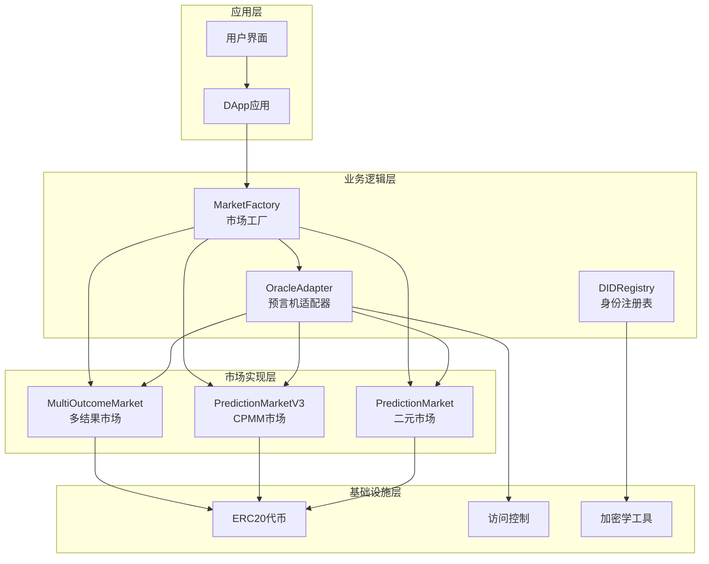

**图表来源**
- [MarketFactory.sol](file://contracts/MarketFactory.sol#L8-L60)
- [OracleAdapter.sol](file://contracts/OracleAdapter.sol#L7-L83)
- [DIDRegistry.sol](file://contracts/DIDRegistry.sol#L8-L34)

**章节来源**
- [MarketFactory.sol](file://contracts/MarketFactory.sol#L1-L60)
- [OracleAdapter.sol](file://contracts/OracleAdapter.sol#L1-L83)
- [DIDRegistry.sol](file://contracts/DIDRegistry.sol#L1-L34)

## 核心组件

### 预言机适配器组件

OracleAdapter是系统的核心协调组件，负责：
- 时间锁定机制：防止即时决议
- 多签名共识：需要多个预言机批准
- 市场状态管理：触发市场解析和作废

### 市场工厂组件

MarketFactory负责：
- 市场部署：创建新的预测市场实例
- 权限管理：设置Oracle地址
- 市场索引：维护市场列表

### 身份注册组件

DIDRegistry提供：
- DID绑定：将账户与DID哈希关联
- 身份验证：通过签名验证DID所有权
- 可选集成：作为身份验证的可选组件

**章节来源**
- [OracleAdapter.sol](file://contracts/OracleAdapter.sol#L7-L83)
- [MarketFactory.sol](file://contracts/MarketFactory.sol#L8-L60)
- [DIDRegistry.sol](file://contracts/DIDRegistry.sol#L8-L34)

## 架构概览

系统采用分层架构，通过接口实现松耦合设计：

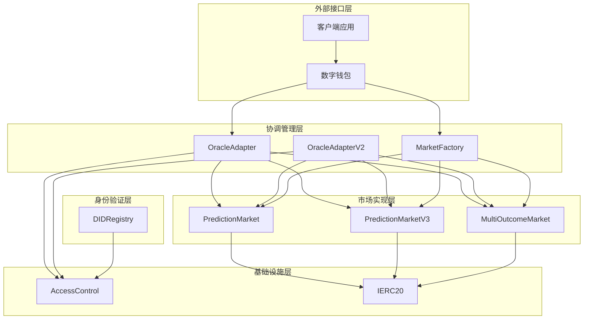

**图表来源**
- [IPredictionMarket.sol](file://contracts/interfaces/IPredictionMarket.sol#L4-L8)
- [OracleAdapter.sol](file://contracts/OracleAdapter.sol#L4-L5)
- [OracleAdapterV2.sol](file://contracts/OracleAdapterV2.sol#L4-L5)

## 详细组件分析

### OracleAdapter组件分析

OracleAdapter实现了时间锁定的预言机解决方案：

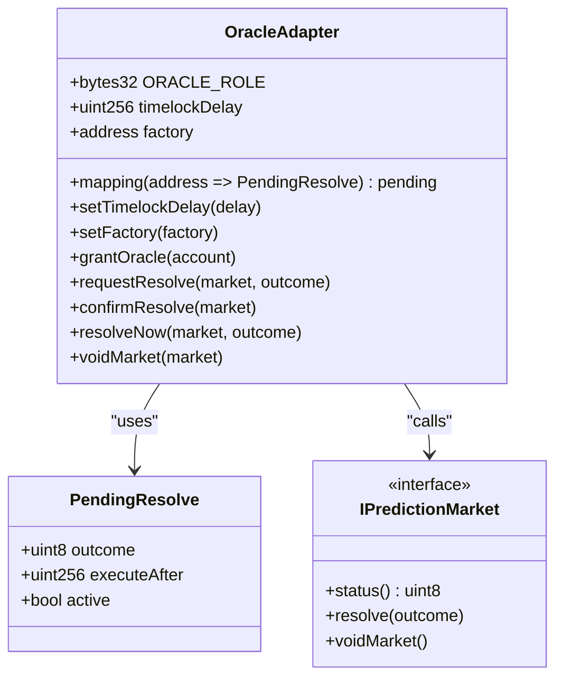

**图表来源**
- [OracleAdapter.sol](file://contracts/OracleAdapter.sol#L8-L34)
- [IPredictionMarket.sol](file://contracts/interfaces/IPredictionMarket.sol#L4-L8)

#### 时间锁定机制流程

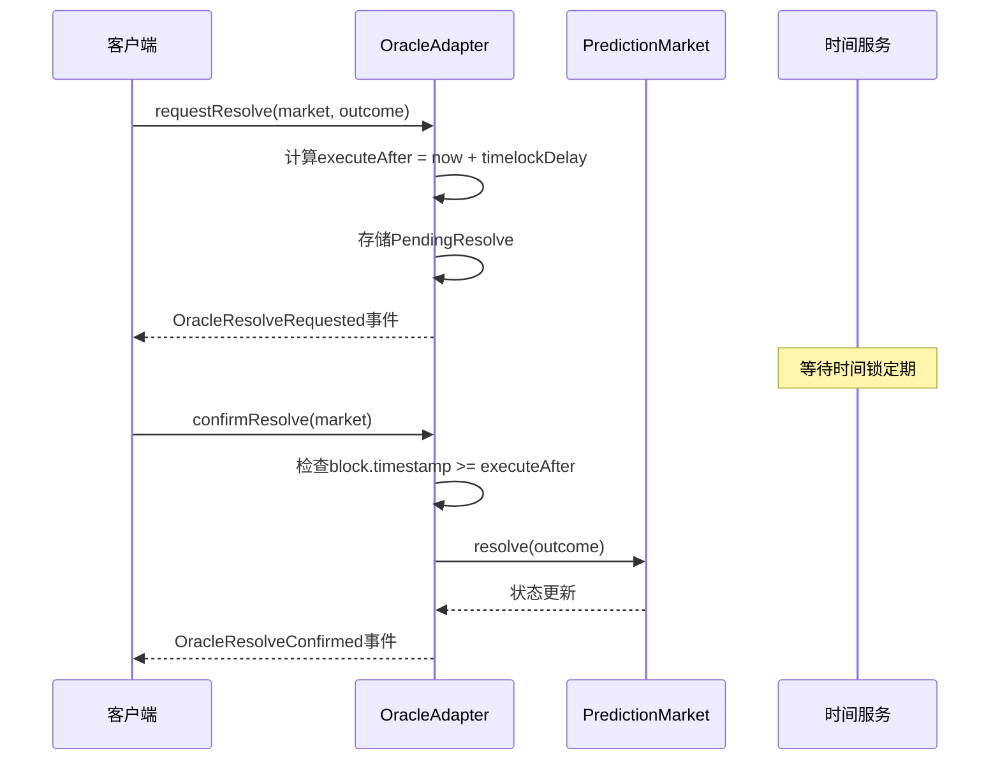

**图表来源**
- [OracleAdapter.sol](file://contracts/OracleAdapter.sol#L48-L67)
- [OracleAdapter.test.js](file://test/OracleAdapter.test.js#L6-L25)

**章节来源**
- [OracleAdapter.sol](file://contracts/OracleAdapter.sol#L1-L83)
- [OracleAdapter.test.js](file://test/OracleAdapter.test.js#L1-L50)

### OracleAdapterV2组件分析

OracleAdapterV2实现了多签名共识机制：

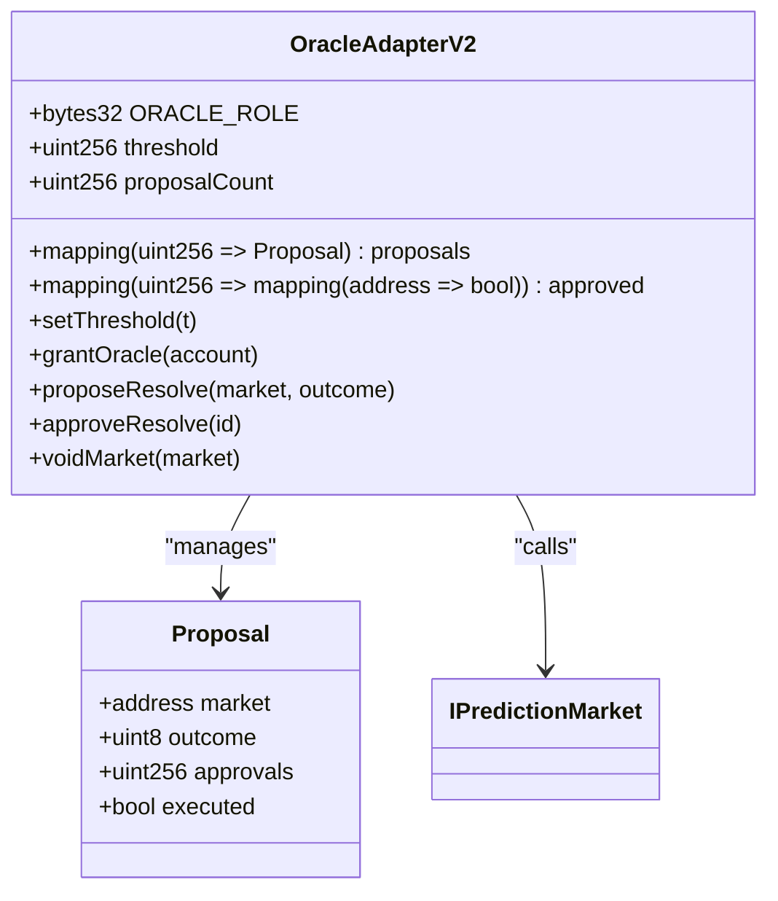

**图表来源**
- [OracleAdapterV2.sol](file://contracts/OracleAdapterV2.sol#L8-L33)
- [IPredictionMarket.sol](file://contracts/interfaces/IPredictionMarket.sol#L4-L8)

#### 多签名共识流程

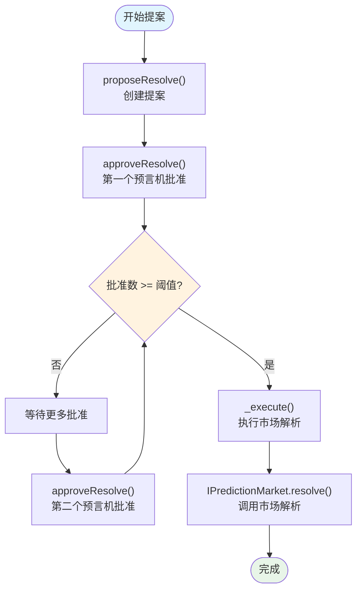

**图表来源**
- [OracleAdapterV2.sol](file://contracts/OracleAdapterV2.sol#L44-L75)

**章节来源**
- [OracleAdapterV2.sol](file://contracts/OracleAdapterV2.sol#L1-L83)
- [Phase3.test.js](file://test/Phase3.test.js#L52-L72)

### 市场实现组件分析

#### PredictionMarket组件

PredictionMarket实现了传统的二元预测市场：

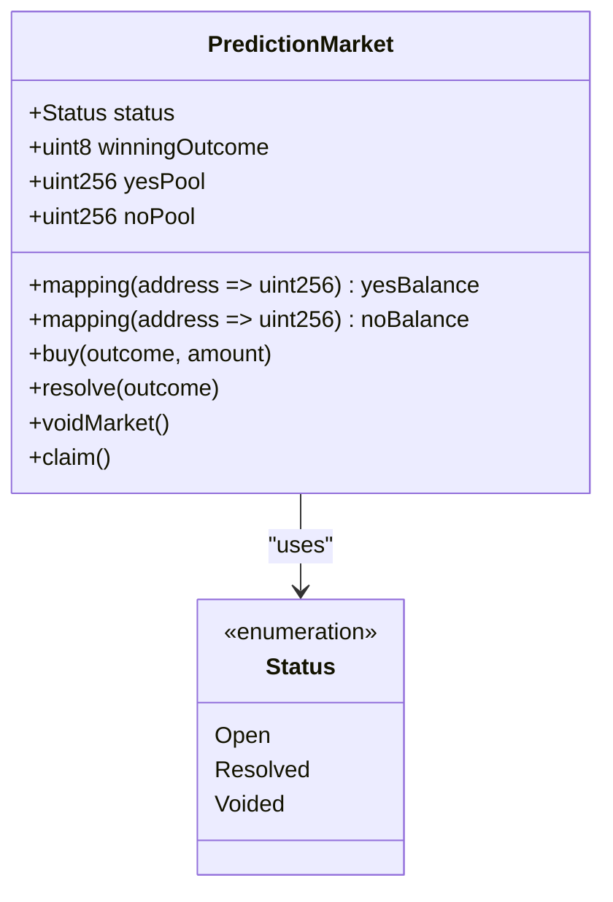

**图表来源**
- [PredictionMarket.sol](file://contracts/PredictionMarket.sol#L11-L25)

#### PredictionMarketV3组件

PredictionMarketV3实现了CPMM（常数乘法做市商）模型：

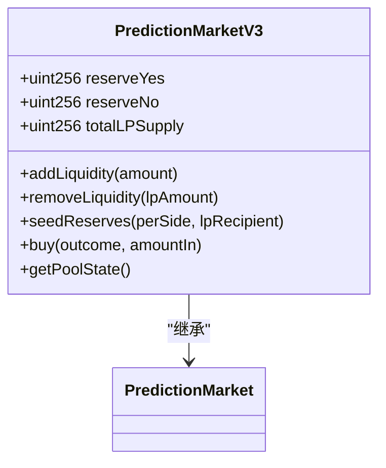

**图表来源**
- [PredictionMarketV3.sol](file://contracts/PredictionMarketV3.sol#L26-L28)

**章节来源**
- [PredictionMarket.sol](file://contracts/PredictionMarket.sol#L1-L134)
- [PredictionMarketV3.sol](file://contracts/PredictionMarketV3.sol#L1-L200)

### DIDRegistry组件分析

DIDRegistry提供了可选的身份验证功能：

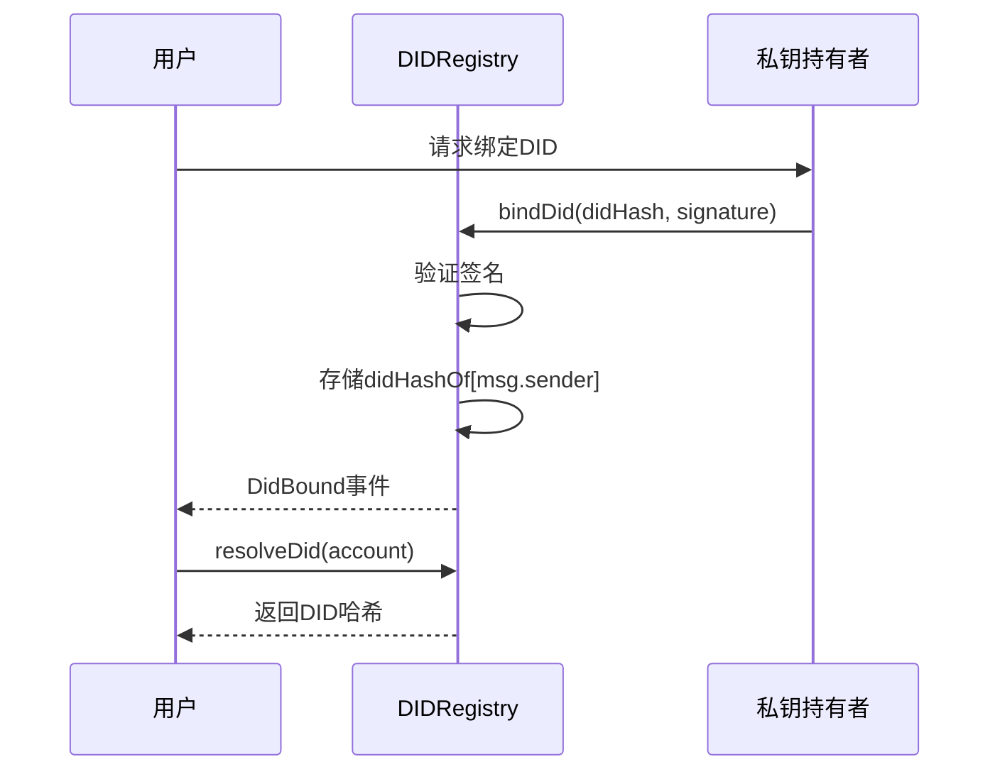

**图表来源**
- [DIDRegistry.sol](file://contracts/DIDRegistry.sol#L19-L32)

**章节来源**
- [DIDRegistry.sol](file://contracts/DIDRegistry.sol#L1-L34)

## 依赖关系分析

系统采用清晰的依赖层次结构：

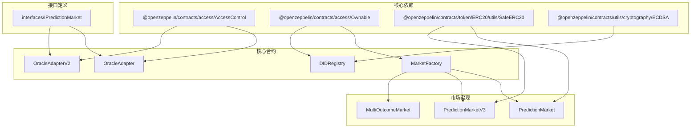

**图表来源**
- [OracleAdapter.sol](file://contracts/OracleAdapter.sol#L4-L5)
- [DIDRegistry.sol](file://contracts/DIDRegistry.sol#L4-L5)
- [PredictionMarket.sol](file://contracts/PredictionMarket.sol#L4-L5)

**章节来源**
- [OracleAdapter.sol](file://contracts/OracleAdapter.sol#L1-L83)
- [DIDRegistry.sol](file://contracts/DIDRegistry.sol#L1-L34)
- [PredictionMarket.sol](file://contracts/PredictionMarket.sol#L1-L134)

## 性能考虑

### 优化策略

1. **Gas优化**
   - 使用OpenZeppelin的安全转账库
   - 实现重入保护机制
   - 优化存储布局减少gas消耗

2. **时间复杂度**
   - 市场状态查询O(1)
   - 赔付计算O(1)到O(n)取决于市场类型
   - 批准检查O(1)

3. **存储优化**
   - 合理的数据结构选择
   - 避免重复存储相同信息
   - 使用映射而非数组存储索引

### 错误处理策略

系统实现了多层次的错误处理：

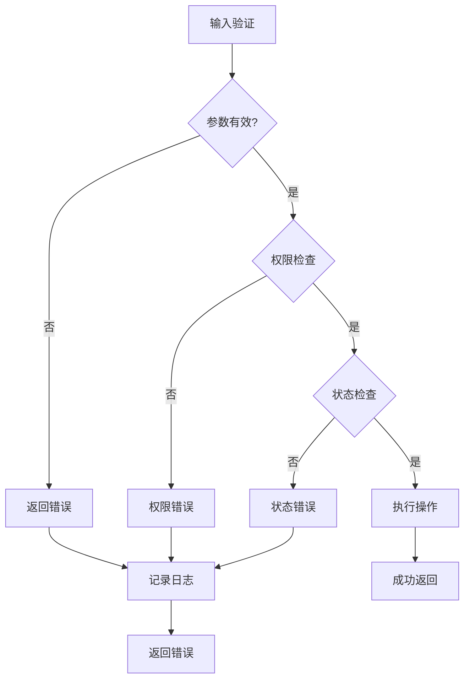

**章节来源**
- [OracleAdapter.sol](file://contracts/OracleAdapter.sol#L48-L81)
- [PredictionMarket.sol](file://contracts/PredictionMarket.sol#L64-L113)

## 故障排除指南

### 常见问题及解决方案

1. **时间锁定未生效**
   - 检查timelockDelay配置
   - 验证区块时间戳
   - 确认confirmResolve调用时机

2. **多签名共识失败**
   - 检查阈值设置
   - 验证预言机账户授权
   - 确认提案状态

3. **身份绑定失败**
   - 验证签名有效性
   - 检查消息格式
   - 确认账户匹配

### 调试工具

使用Hardhat测试框架进行调试：
- 部署脚本自动配置环境
- 测试用例覆盖关键场景
- 网络助手支持时间推进

**章节来源**
- [OracleAdapter.test.js](file://test/OracleAdapter.test.js#L1-L50)
- [Phase3.test.js](file://test/Phase3.test.js#L1-L74)
- [deploy.js](file://scripts/deploy.js#L1-L57)

## 结论

该预测市场系统通过精心设计的组件交互架构，实现了安全、可扩展的预言机解决方案。关键特性包括：

1. **解耦设计**：通过IPredictionMarket接口实现OracleAdapter与市场实现的完全解耦
2. **多重安全机制**：时间锁定和多签名共识确保决策安全性
3. **灵活的市场支持**：支持二元、多结果和CPMM等多种市场类型
4. **可选身份验证**：DIDRegistry提供可选的身份验证增强

系统架构具有良好的扩展性，可以轻松添加新的市场类型和安全机制。通过模块化设计，各个组件可以在不影响其他部分的情况下独立演进。