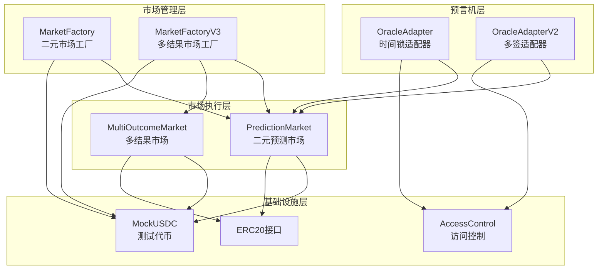
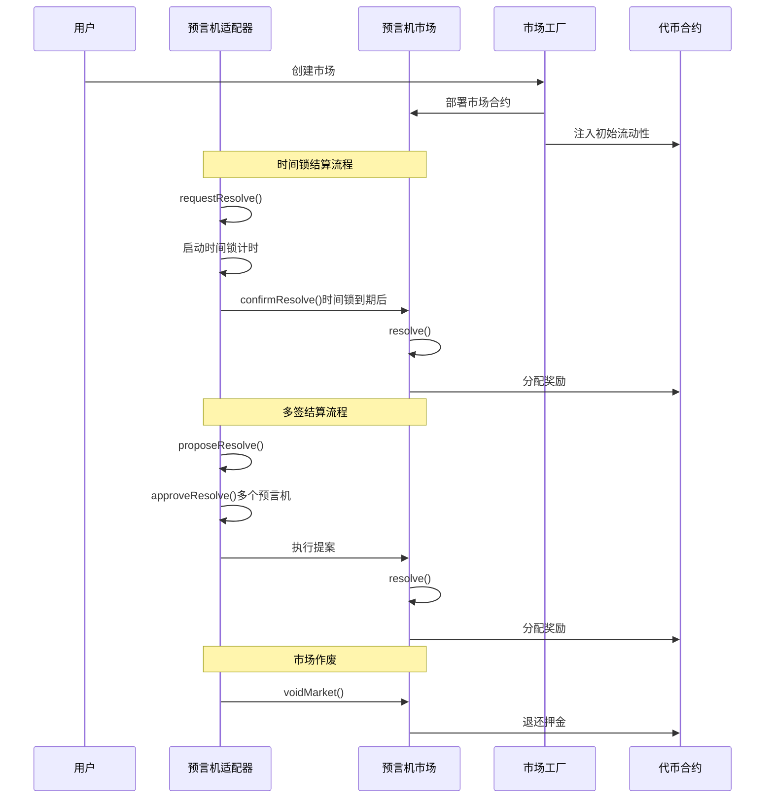
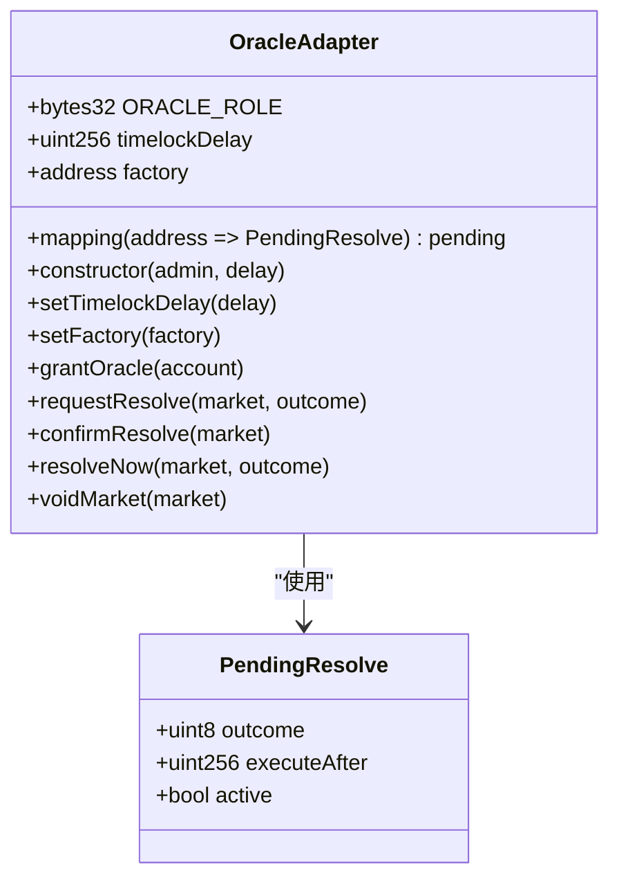
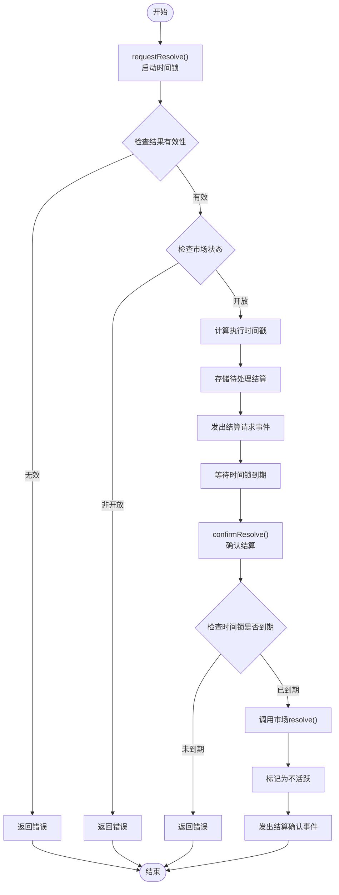
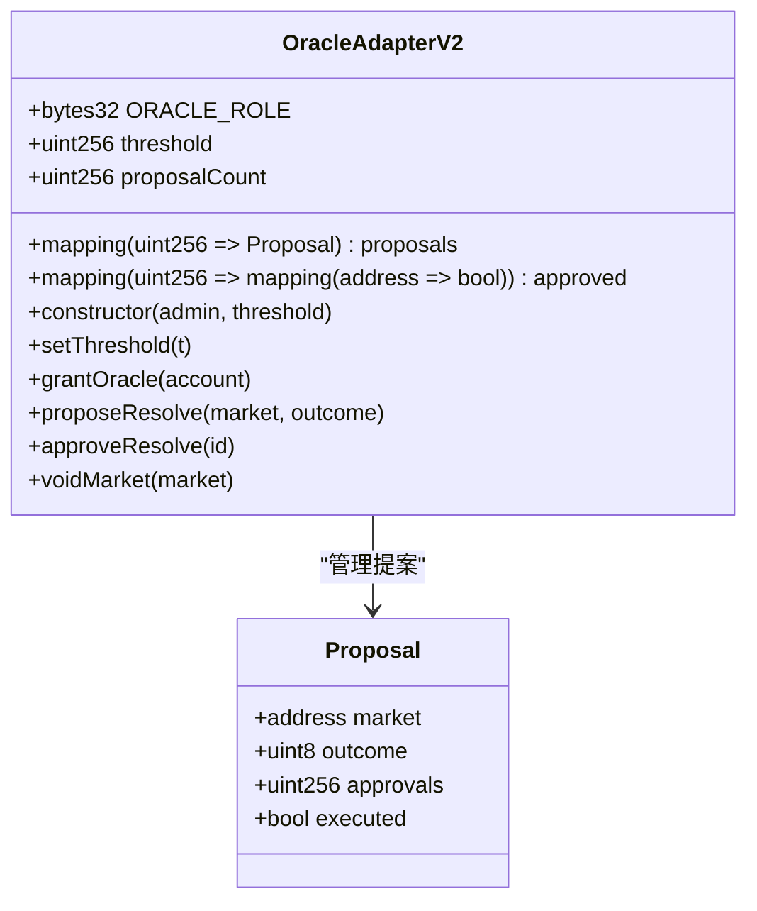
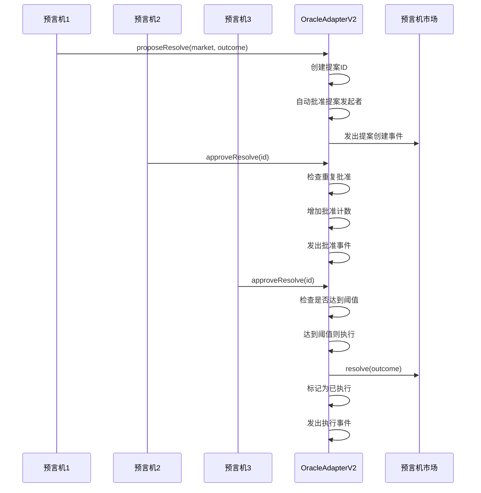
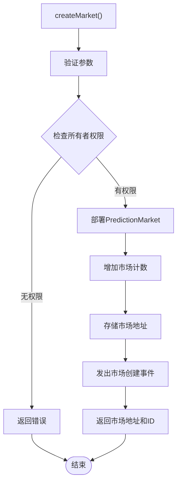

# 预言机集成架构

<cite>
**本文档引用的文件**
- [OracleAdapter.sol](file://contracts/OracleAdapter.sol)
- [OracleAdapterV2.sol](file://contracts/OracleAdapterV2.sol)
- [IPredictionMarket.sol](file://contracts/interfaces/IPredictionMarket.sol)
- [PredictionMarket.sol](file://contracts/PredictionMarket.sol)
- [MarketFactory.sol](file://contracts/MarketFactory.sol)
- [MarketFactoryV3.sol](file://contracts/MarketFactoryV3.sol)
- [OracleAdapter.test.js](file://test/OracleAdapter.test.js)
- [Phase3.test.js](file://test/Phase3.test.js)
- [deploy.js](file://scripts/deploy.js)
- [deploy-phase3.js](file://scripts/deploy-phase3.js)
</cite>

## 目录
1. [简介](#简介)
2. [项目结构](#项目结构)
3. [核心组件](#核心组件)
4. [架构概览](#架构概览)
5. [详细组件分析](#详细组件分析)
6. [依赖关系分析](#依赖关系分析)
7. [性能考虑](#性能考虑)
8. [故障排除指南](#故障排除指南)
9. [结论](#结论)
10. [附录](#附录)

## 简介
本文件详细阐述PredictionDIDSimple项目中的预言机集成架构，重点分析OracleAdapter和OracleAdapterV2的设计原理、时间锁机制和多签验证流程。该架构实现了去中心化的预言机数据获取、验证机制和结算触发条件，确保预测市场的公正性和安全性。

## 项目结构
该项目采用模块化设计，包含预言机适配器、市场工厂、预测市场合约等核心组件。整体架构遵循分层设计原则，各组件职责明确，便于维护和扩展。



**图表来源**
- [OracleAdapter.sol:1-96](file://contracts/OracleAdapter.sol#L1-L96)
- [OracleAdapterV2.sol:1-95](file://contracts/OracleAdapterV2.sol#L1-L95)
- [MarketFactory.sol:1-68](file://contracts/MarketFactory.sol#L1-L68)
- [MarketFactoryV3.sol:1-104](file://contracts/MarketFactoryV3.sol#L1-L104)

**章节来源**
- [OracleAdapter.sol:1-96](file://contracts/OracleAdapter.sol#L1-L96)
- [OracleAdapterV2.sol:1-95](file://contracts/OracleAdapterV2.sol#L1-L95)
- [MarketFactory.sol:1-68](file://contracts/MarketFactory.sol#L1-L68)
- [MarketFactoryV3.sol:1-104](file://contracts/MarketFactoryV3.sol#L1-L104)

## 核心组件
本项目的核心组件包括两个预言机适配器、市场工厂和预测市场合约。每个组件都实现了特定的功能和安全机制。

### OracleAdapter（时间锁适配器）
OracleAdapter是第一代预言机适配器，采用时间锁机制实现延迟结算功能。其主要特点包括：
- 基于OpenZeppelin AccessControl的角色权限管理
- 可配置的时间锁延迟机制
- 支持快速结算路径（时间锁为0时）
- 市场作废功能

### OracleAdapterV2（多签适配器）
OracleAdapterV2是第二代预言机适配器，采用m-of-n多签机制增强安全性。其主要特点包括：
- 基于提案系统的多签审批流程
- 可配置的阈值机制
- 自动批准功能（提案发起者自动批准）
- 完整的提案生命周期管理

### 市场工厂
市场工厂负责创建和管理预测市场合约，支持不同类型的市场创建：
- MarketFactory：创建二元预测市场
- MarketFactoryV3：创建二元CPMM市场和多结果市场

### 预测市场合约
预测市场合约实现具体的市场逻辑，包括：
- 二元市场（是/否）和多结果市场
- 资产池管理和资金分配
- 用户押注和奖励领取机制

**章节来源**
- [OracleAdapter.sol:9-40](file://contracts/OracleAdapter.sol#L9-L40)
- [OracleAdapterV2.sol:9-38](file://contracts/OracleAdapterV2.sol#L9-L38)
- [MarketFactory.sol:10-35](file://contracts/MarketFactory.sol#L10-L35)
- [MarketFactoryV3.sol:12-36](file://contracts/MarketFactoryV3.sol#L12-L36)

## 架构概览
预言机集成架构采用分层设计，实现了从数据输入到市场结算的完整流程。系统通过角色权限控制和多重安全机制确保操作的安全性。



**图表来源**
- [OracleAdapter.sol:57-87](file://contracts/OracleAdapter.sol#L57-L87)
- [OracleAdapterV2.sol:51-86](file://contracts/OracleAdapterV2.sol#L51-L86)
- [PredictionMarket.sol:90-104](file://contracts/PredictionMarket.sol#L90-L104)

## 详细组件分析

### OracleAdapter 设计分析

OracleAdapter采用时间锁机制实现延迟结算，确保市场数据的稳定性和完整性。

#### 核心数据结构


**图表来源**
- [OracleAdapter.sol:11-24](file://contracts/OracleAdapter.sol#L11-L24)

#### 时间锁机制流程


**图表来源**
- [OracleAdapter.sol:57-78](file://contracts/OracleAdapter.sol#L57-L78)

#### 关键安全特性
- **角色权限控制**：基于AccessControl的ORACLE_ROLE和DEFAULT_ADMIN_ROLE
- **输入验证**：严格的参数验证和状态检查
- **时间锁保护**：防止恶意提前结算
- **防重入攻击**：通过状态标志防止重入攻击

**章节来源**
- [OracleAdapter.sol:11-96](file://contracts/OracleAdapter.sol#L11-L96)

### OracleAdapterV2 设计分析

OracleAdapterV2采用多签机制增强预言机决策的安全性，支持m-of-n的批准流程。

#### 多签提案系统


**图表来源**
- [OracleAdapterV2.sol:11-26](file://contracts/OracleAdapterV2.sol#L11-L26)

#### 多签审批流程


**图表来源**
- [OracleAdapterV2.sol:51-86](file://contracts/OracleAdapterV2.sol#L51-L86)

#### 多签机制优势
- **去中心化决策**：避免单点故障
- **透明度**：所有提案和批准都有事件记录
- **灵活性**：可调整阈值适应不同风险级别
- **审计追踪**：完整的多签历史记录

**章节来源**
- [OracleAdapterV2.sol:11-95](file://contracts/OracleAdapterV2.sol#L11-L95)

### 市场工厂集成

市场工厂负责创建和管理预测市场合约，与预言机适配器紧密集成。

#### 市场创建流程


**图表来源**
- [MarketFactory.sol:43-61](file://contracts/MarketFactory.sol#L43-L61)

**章节来源**
- [MarketFactory.sol:12-68](file://contracts/MarketFactory.sol#L12-L68)
- [MarketFactoryV3.sol:14-104](file://contracts/MarketFactoryV3.sol#L14-L104)

## 依赖关系分析

预言机集成架构中的组件依赖关系清晰，遵循单一职责原则。

```mermaid
graph TB
subgraph "核心依赖"
AC[AccessControl<br/>@openzeppelin/contracts/access/AccessControl.sol]
IPRM[IPredictionMarket<br/>interfaces/IPredictionMarket.sol]
end
subgraph "OracleAdapter依赖"
OA[OracleAdapter.sol]
OA --> AC
OA --> IPRM
end
subgraph "OracleAdapterV2依赖"
OAV2[OracleAdapterV2.sol]
OAV2 --> AC
OAV2 --> IPRM
end
subgraph "市场合约依赖"
PM[PredictionMarket.sol]
PM --> IPRM
PM --> AC
end
subgraph "工厂合约依赖"
MF[MarketFactory.sol]
MF --> PM
MF --> AC
MF --> IERC20
end
subgraph "测试依赖"
OT[OracleAdapter.test.js]
PT[Phase3.test.js]
OT --> OA
PT --> OAV2
end
```

**图表来源**
- [OracleAdapter.sol:6-7](file://contracts/OracleAdapter.sol#L6-L7)
- [OracleAdapterV2.sol:6-7](file://contracts/OracleAdapterV2.sol#L6-L7)
- [IPredictionMarket.sol:6-14](file://contracts/interfaces/IPredictionMarket.sol#L6-L14)

**章节来源**
- [OracleAdapter.sol:6-7](file://contracts/OracleAdapter.sol#L6-L7)
- [OracleAdapterV2.sol:6-7](file://contracts/OracleAdapterV2.sol#L6-L7)
- [IPredictionMarket.sol:6-14](file://contracts/interfaces/IPredictionMarket.sol#L6-L14)

## 性能考虑

### 时间复杂度分析
- **OracleAdapter**：时间锁查询为O(1)，状态检查为O(1)
- **OracleAdapterV2**：提案查询为O(1)，批准检查为O(1)
- **市场工厂**：市场创建为O(1)，地址查询为O(1)

### 存储优化
- 使用紧凑的数据结构减少存储成本
- 通过映射实现高效的查找和更新
- 避免不必要的状态变量存储

### Gas费用优化
- 批量操作减少交易次数
- 条件检查前置避免昂贵的操作
- 使用安全的数学运算避免溢出检查

## 故障排除指南

### 常见错误及解决方案

#### 时间锁相关错误
- **错误**："timelock" - 时间锁未到期尝试确认结算
- **解决方案**：等待时间锁到期后再调用confirmResolve()

#### 权限相关错误
- **错误**："AccessControlUnauthorizedAccount" - 非授权用户调用
- **解决方案**：确保调用者具有ORACLE_ROLE或DEFAULT_ADMIN_ROLE

#### 市场状态错误
- **错误**："not open" - 市场状态不是开放
- **解决方案**：检查市场状态，确保市场处于Open状态

#### 参数验证错误
- **错误**："invalid outcome" - 结果编号超出范围
- **解决方案**：OracleAdapter使用0或1，OracleAdapterV2使用0-7

**章节来源**
- [OracleAdapter.test.js:22-26](file://test/OracleAdapter.test.js#L22-L26)
- [Phase3.test.js:69-76](file://test/Phase3.test.js#L69-L76)

### 调试建议
1. **事件监控**：监听关键事件以跟踪状态变化
2. **状态检查**：定期检查合约状态和余额
3. **日志记录**：使用事件记录重要的业务操作
4. **单元测试**：编写全面的测试覆盖边界情况

## 结论
PredictionDIDSimple项目的预言机集成架构通过OracleAdapter和OracleAdapterV2实现了灵活且安全的预言机解决方案。时间锁机制提供了延迟结算的安全保障，而多签机制进一步增强了决策的去中心化程度。该架构设计合理，组件职责明确，为预测市场的可靠运行提供了坚实基础。

## 附录

### 部署配置选项

#### 环境变量
- `ORACLE_TIMELOCK_SECONDS`：时间锁延迟秒数（默认120秒）
- `ORACLE_MULTISIG_THRESHOLD`：多签阈值（默认2）
- `DEFAULT_FEE_BPS`：默认手续费基点数（默认30）

#### 部署脚本
- `scripts/deploy.js`：第一阶段部署（OracleAdapter）
- `scripts/deploy-phase3.js`：第三阶段部署（OracleAdapterV2）

**章节来源**
- [deploy.js:8](file://scripts/deploy.js#L8)
- [deploy-phase3.js:8-9](file://scripts/deploy-phase3.js#L8-L9)

### 维护策略
1. **定期审计**：定期审查合约代码和权限配置
2. **监控告警**：建立关键事件的监控和告警机制
3. **升级准备**：为未来功能升级预留接口
4. **备份恢复**：建立完整的备份和恢复策略