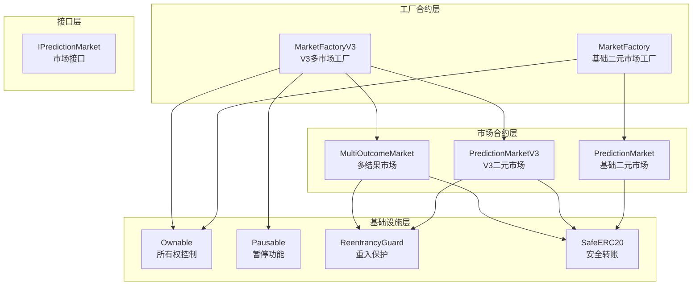
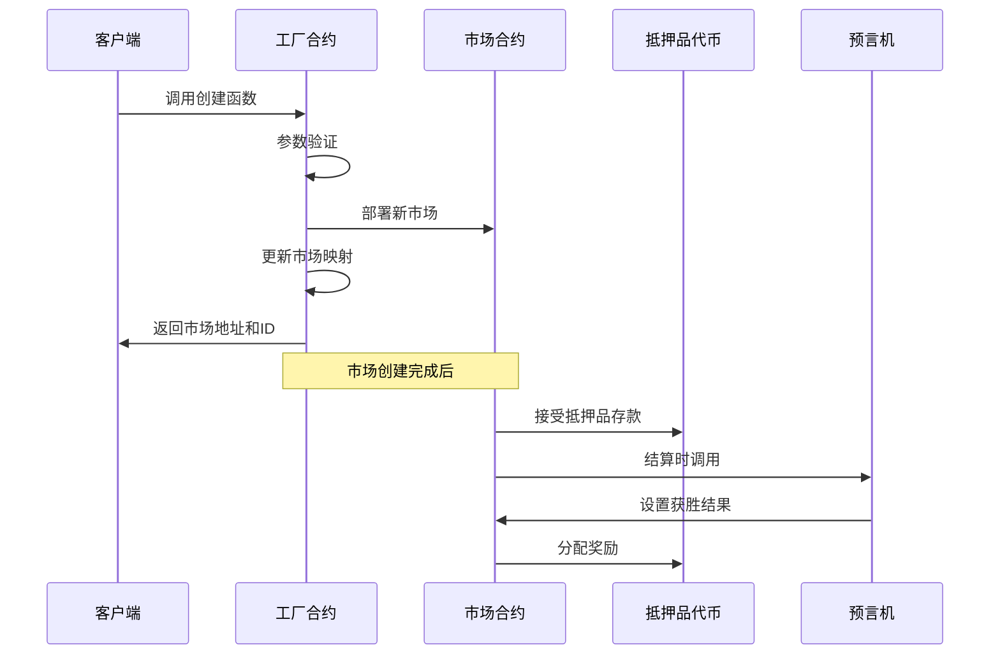
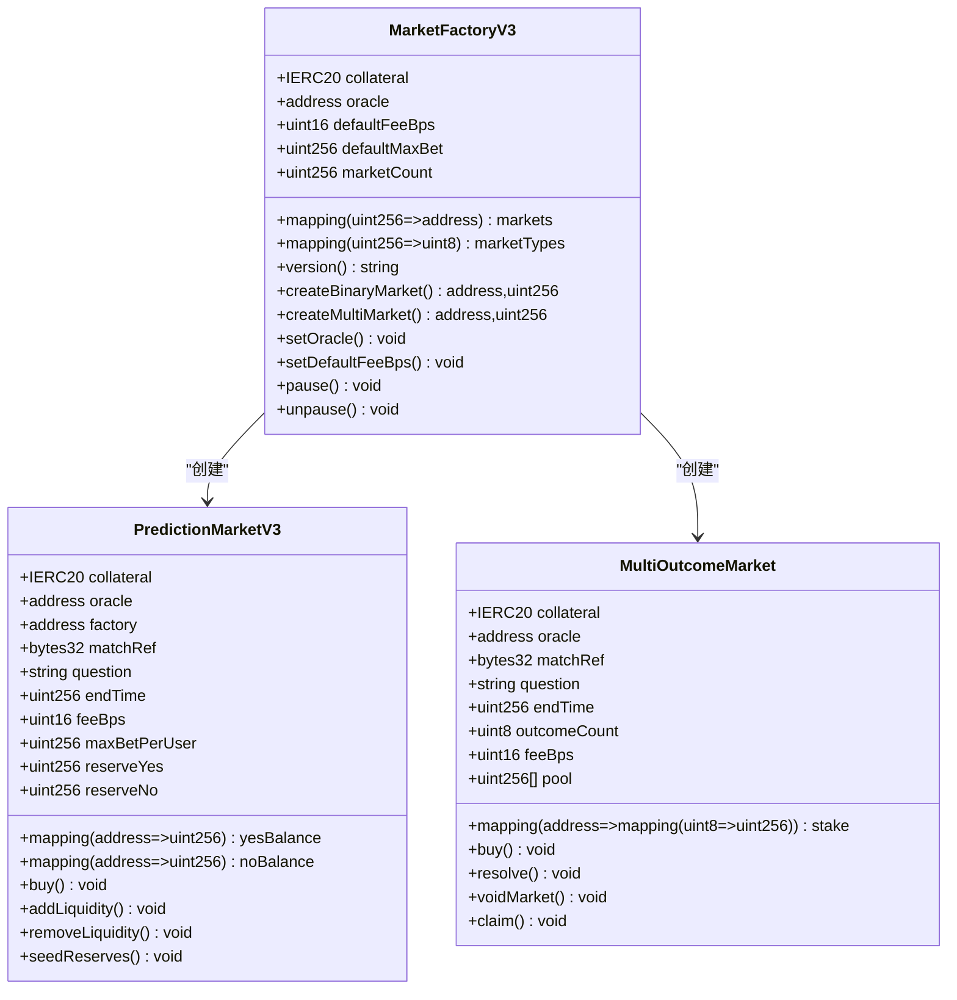
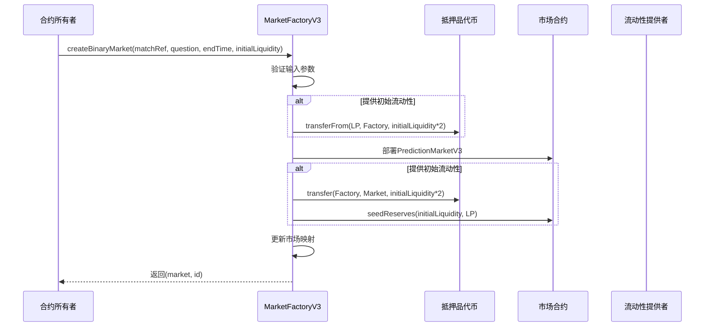
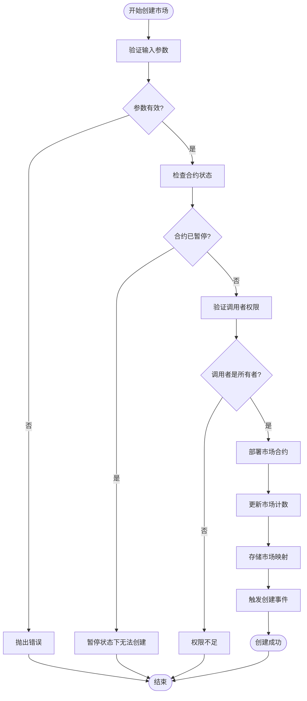
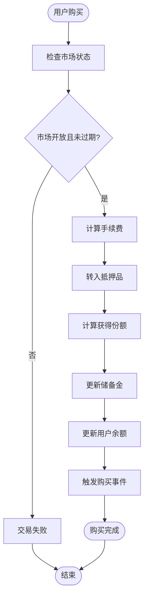
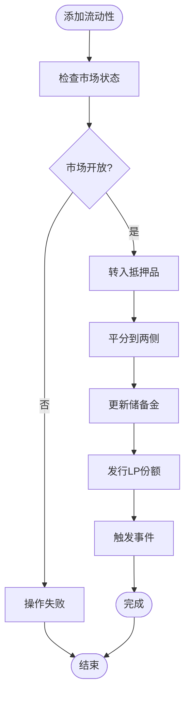
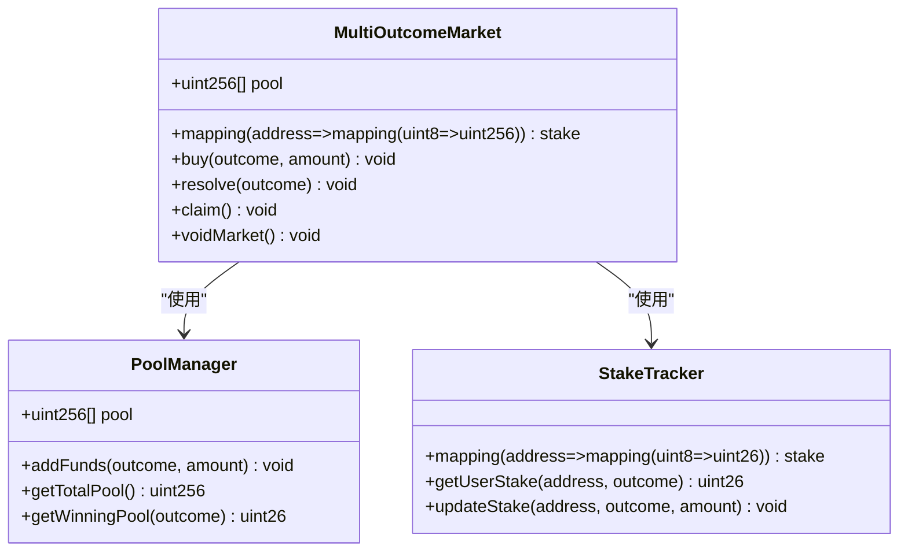
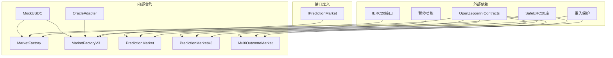

# MarketFactory合约技术文档

<cite>
**本文档引用的文件**
- [MarketFactory.sol](file://contracts/MarketFactory.sol)
- [MarketFactoryV3.sol](file://contracts/MarketFactoryV3.sol)
- [PredictionMarket.sol](file://contracts/PredictionMarket.sol)
- [PredictionMarketV3.sol](file://contracts/PredictionMarketV3.sol)
- [MultiOutcomeMarket.sol](file://contracts/MultiOutcomeMarket.sol)
- [IPredictionMarket.sol](file://contracts/interfaces/IPredictionMarket.sol)
- [MarketFactory.test.js](file://test/MarketFactory.test.js)
- [seed-markets.js](file://scripts/seed-markets.js)
- [deploy.js](file://scripts/deploy.js)
- [hardhat.config.js](file://hardhat.config.js)
</cite>

## 目录
1. [简介](#简介)
2. [项目结构](#项目结构)
3. [核心组件](#核心组件)
4. [架构概览](#架构概览)
5. [详细组件分析](#详细组件分析)
6. [依赖关系分析](#依赖关系分析)
7. [性能考量](#性能考量)
8. [故障排除指南](#故障排除指南)
9. [结论](#结论)

## 简介

MarketFactory系列合约是一套基于工厂模式设计的预测市场部署系统，负责创建和管理各种类型的预测市场合约。该系统从基础的二元预测市场（MarketFactory）演进到支持CPMM机制的V3版本（MarketFactoryV3），实现了从简单互池式市场到复杂流动性提供市场的完整解决方案。

系统采用OpenZeppelin的AccessControl和Pausable等安全组件，确保了合约的安全性和可控性。通过工厂模式，系统实现了标准化的市场创建流程、参数验证机制和合约部署管理。

## 项目结构

MarketFactory系列合约的项目结构清晰地展示了从基础版本到高级版本的演进：

**图表来源**
- [MarketFactory.sol:1-68](file://contracts/MarketFactory.sol#L1-L68)
- [MarketFactoryV3.sol:1-104](file://contracts/MarketFactoryV3.sol#L1-L104)
- [PredictionMarket.sol:1-145](file://contracts/PredictionMarket.sol#L1-L145)
- [PredictionMarketV3.sol:1-218](file://contracts/PredictionMarketV3.sol#L1-L218)
- [MultiOutcomeMarket.sol:1-124](file://contracts/MultiOutcomeMarket.sol#L1-L124)

**章节来源**
- [MarketFactory.sol:1-68](file://contracts/MarketFactory.sol#L1-L68)
- [MarketFactoryV3.sol:1-104](file://contracts/MarketFactoryV3.sol#L1-L104)

## 核心组件

### MarketFactory（基础版本）

MarketFactory是系统的第一个版本，专注于创建基础的二元预测市场。其核心特性包括：

- **单一职责**：专门创建Yes/No预测市场
- **参数验证**：确保抵押品地址、预言机地址有效
- **事件记录**：完整的市场创建事件追踪
- **版本管理**：提供版本标识功能

### MarketFactoryV3（高级版本）

MarketFactoryV3代表了系统的重大升级，引入了多项新功能：

- **多市场支持**：同时支持二元市场和多结果市场
- **CPMM机制**：实现常数乘积做市商模型
- **流动性管理**：支持LP份额管理和流动性提供
- **暂停功能**：合约级别的暂停和恢复机制
- **默认参数**：提供合理的默认配置参数

**章节来源**
- [MarketFactory.sol:10-66](file://contracts/MarketFactory.sol#L10-L66)
- [MarketFactoryV3.sol:12-102](file://contracts/MarketFactoryV3.sol#L12-L102)

## 架构概览

MarketFactory系列合约采用了经典的工厂模式架构，通过抽象化的创建流程实现了高度的模块化和可扩展性：

**图表来源**
- [MarketFactory.sol:44-61](file://contracts/MarketFactory.sol#L44-L61)
- [MarketFactoryV3.sol:45-97](file://contracts/MarketFactoryV3.sol#L45-L97)

## 详细组件分析

### MarketFactoryV3 详细分析

MarketFactoryV3是系统的核心，实现了复杂的多市场管理功能：

#### 类结构图

**图表来源**
- [MarketFactoryV3.sol:14-97](file://contracts/MarketFactoryV3.sol#L14-L97)
- [PredictionMarketV3.sol:12-79](file://contracts/PredictionMarketV3.sol#L12-L79)
- [MultiOutcomeMarket.sol:12-65](file://contracts/MultiOutcomeMarket.sol#L12-L65)

#### 创建流程序列图

**图表来源**
- [MarketFactoryV3.sol:45-74](file://contracts/MarketFactoryV3.sol#L45-L74)

#### 参数验证流程

**图表来源**
- [MarketFactoryV3.sol:45-74](file://contracts/MarketFactoryV3.sol#L45-L74)

**章节来源**
- [MarketFactoryV3.sol:14-102](file://contracts/MarketFactoryV3.sol#L14-L102)

### PredictionMarketV3 详细分析

PredictionMarketV3实现了CPMM（常数乘积做市商）机制，提供了更复杂的市场功能：

#### CPMM交换算法

**图表来源**
- [PredictionMarketV3.sol:101-120](file://contracts/PredictionMarketV3.sol#L101-L120)

#### 流动性管理

**图表来源**
- [PredictionMarketV3.sol:123-133](file://contracts/PredictionMarketV3.sol#L123-L133)

**章节来源**
- [PredictionMarketV3.sol:12-218](file://contracts/PredictionMarketV3.sol#L12-L218)

### MultiOutcomeMarket 详细分析

MultiOutcomeMarket支持2-8个结果的预测市场，实现了多结果的互池式机制：

#### 多结果资金池管理

**图表来源**
- [MultiOutcomeMarket.sol:29-31](file://contracts/MultiOutcomeMarket.sol#L29-L31)

**章节来源**
- [MultiOutcomeMarket.sol:12-124](file://contracts/MultiOutcomeMarket.sol#L12-L124)

## 依赖关系分析

MarketFactory系列合约建立了清晰的依赖层次结构：

**图表来源**
- [MarketFactory.sol:6-8](file://contracts/MarketFactory.sol#L6-L8)
- [MarketFactoryV3.sol:6-10](file://contracts/MarketFactoryV3.sol#L6-L10)

**章节来源**
- [MarketFactory.sol:6-8](file://contracts/MarketFactory.sol#L6-L8)
- [MarketFactoryV3.sol:6-10](file://contracts/MarketFactoryV3.sol#L6-L10)

## 性能考量

### Gas优化策略

MarketFactory系列合约在设计时充分考虑了Gas效率：

1. **状态变量压缩**：合理使用uint类型减少存储成本
2. **批量操作**：支持批量市场创建和批量部署
3. **条件检查**：在函数开始处进行快速失败检查
4. **内存优化**：避免不必要的数组复制和字符串操作

### 可扩展性设计

- **工厂模式**：便于添加新的市场类型
- **接口抽象**：通过IPredictionMarket统一市场接口
- **模块化设计**：每个市场类型独立维护
- **配置参数**：支持动态调整手续费和限制

## 故障排除指南

### 常见问题及解决方案

#### 权限相关问题

**问题**：调用createMarket失败
**原因**：非合约所有者调用
**解决方案**：确保只有合约所有者可以调用创建函数

#### 参数验证失败

**问题**：创建市场时报错"collateral"或"oracle"
**原因**：抵押品地址或预言机地址为零地址
**解决方案**：检查合约部署时传入的有效地址

#### 市场状态异常

**问题**：购买失败显示"not open"
**原因**：市场已结算或已作废
**解决方案**：检查市场状态和截止时间

#### 流动性问题

**问题**：添加流动性失败
**原因**：市场未开放或金额无效
**解决方案**：确认市场状态和输入金额

### 调试技巧

1. **事件监控**：监听MarketCreated、Bought、Resolved等关键事件
2. **状态查询**：使用markets映射和marketCount查询市场状态
3. **参数验证**：在调用前验证所有输入参数
4. **Gas限制**：合理设置Gas Limit避免交易失败

**章节来源**
- [MarketFactory.test.js:8-29](file://test/MarketFactory.test.js#L8-L29)

## 结论

MarketFactory系列合约展现了从基础到高级的完整演进历程。从简单的二元市场创建到支持CPMM机制的复杂市场管理，系统在保持简洁性的同时实现了强大的功能扩展。

关键优势包括：
- **安全性**：基于OpenZeppelin的安全组件
- **可扩展性**：模块化的工厂模式设计
- **灵活性**：支持多种市场类型和配置选项
- **可观测性**：完整的事件记录和状态查询

未来发展方向建议：
- 支持更多市场类型和自定义参数
- 实现更精细的权限控制系统
- 增强市场监控和治理功能
- 优化Gas消耗和用户体验