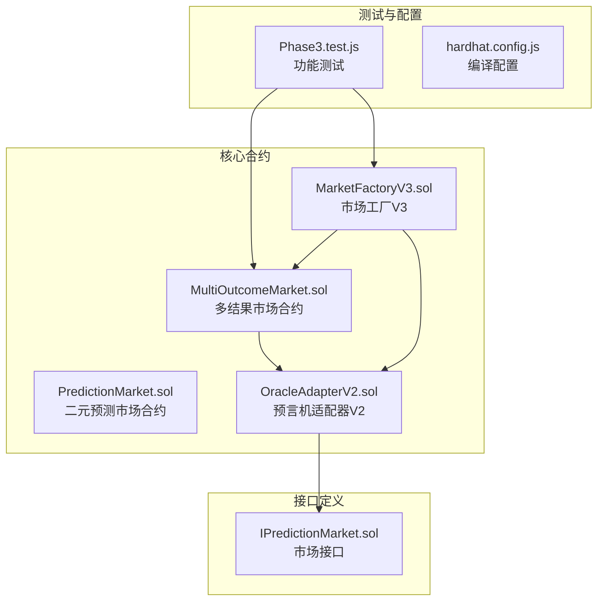
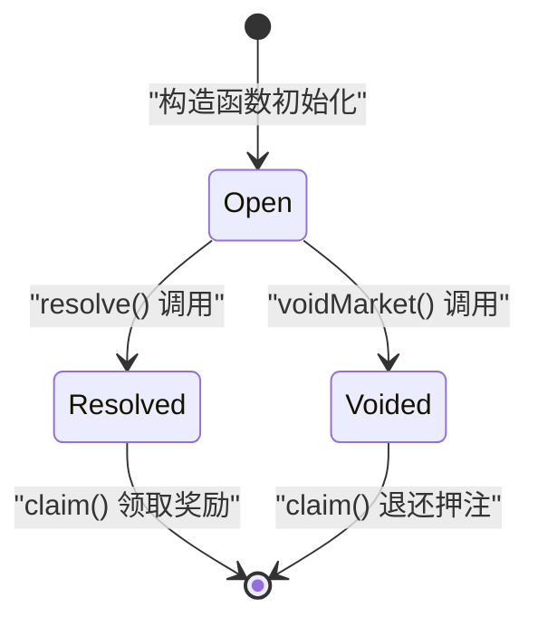
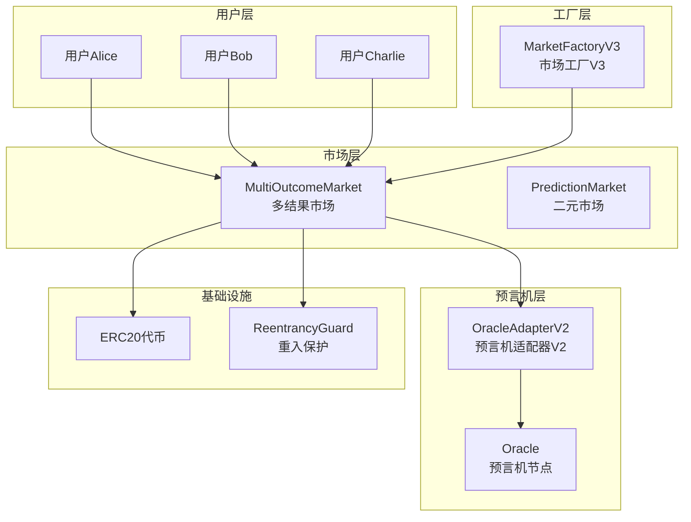
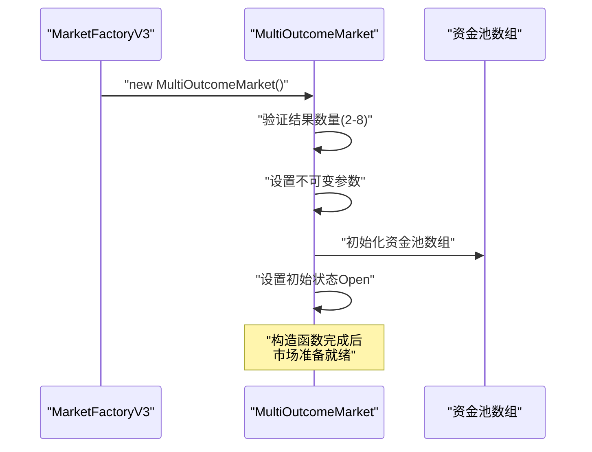
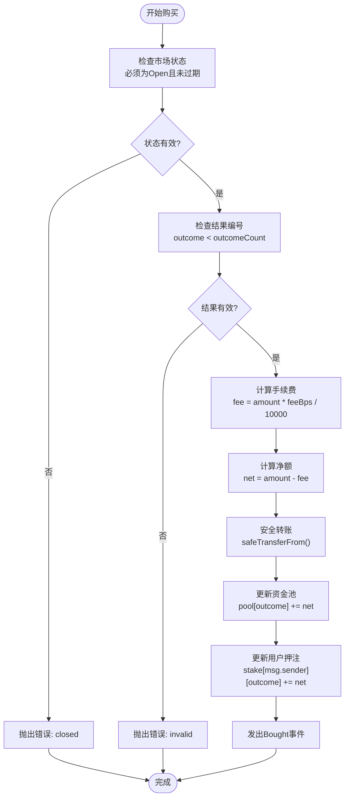
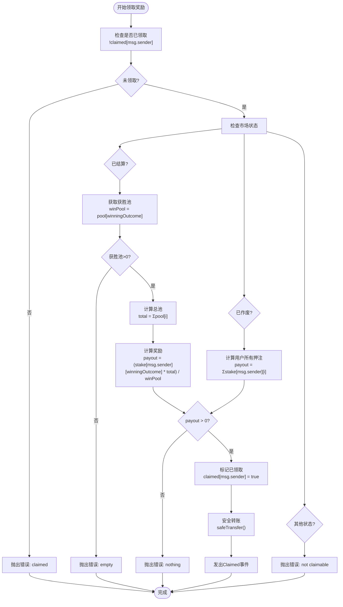
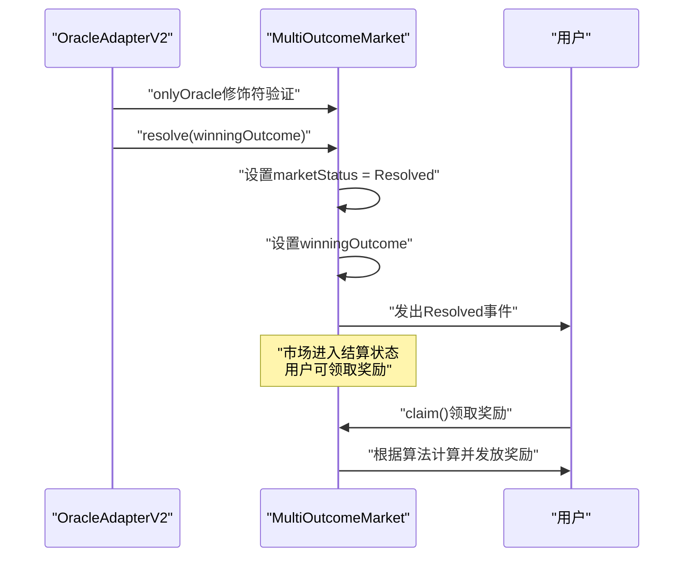
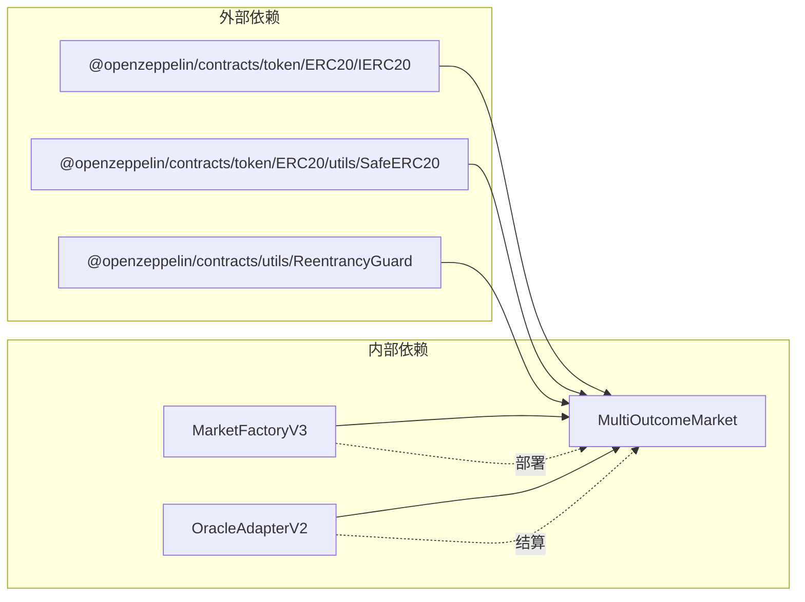
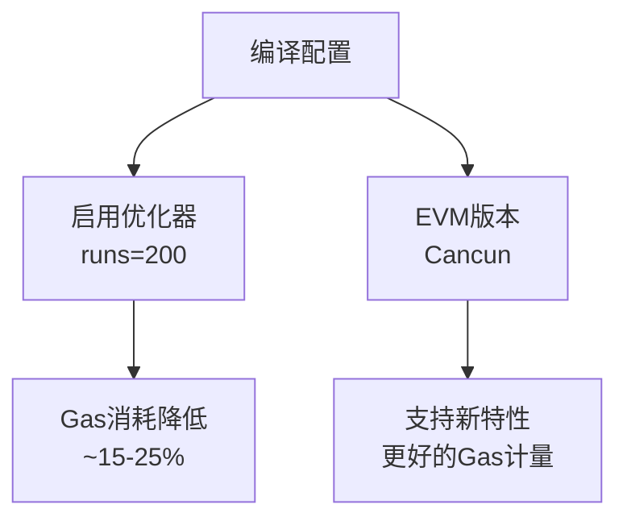

# MultiOutcomeMarket合约技术文档

<cite>
**本文档引用的文件**
- [MultiOutcomeMarket.sol](file://contracts/MultiOutcomeMarket.sol)
- [PredictionMarket.sol](file://contracts/PredictionMarket.sol)
- [MarketFactoryV3.sol](file://contracts/MarketFactoryV3.sol)
- [OracleAdapterV2.sol](file://contracts/OracleAdapterV2.sol)
- [IPredictionMarket.sol](file://contracts/interfaces/IPredictionMarket.sol)
- [Phase3.test.js](file://test/Phase3.test.js)
- [hardhat.config.js](file://hardhat.config.js)
</cite>

## 目录
1. [简介](#简介)
2. [项目结构](#项目结构)
3. [核心组件](#核心组件)
4. [架构概览](#架构概览)
5. [详细组件分析](#详细组件分析)
6. [依赖关系分析](#依赖关系分析)
7. [性能考虑](#性能考虑)
8. [故障排除指南](#故障排除指南)
9. [结论](#结论)
10. [附录](#附录)

## 简介

MultiOutcomeMarket合约是一个基于Parimutuel（互池式）模型的多结果预测市场智能合约，支持2-8个结果的预测市场。该合约实现了复杂的结果资金池管理、动态结果数量支持和收益分配算法，为用户提供了一个灵活且高效的预测市场平台。

与传统的二元预测市场相比，MultiOutcomeMarket提供了更强大的功能扩展，包括：
- 动态结果数量支持（2-8个结果）
- 独立的资金池隔离机制
- 复杂的收益分配算法
- 多结果状态管理和结算流程

## 项目结构

该项目采用模块化设计，主要包含以下核心组件：



**图表来源**
- [MultiOutcomeMarket.sol:1-124](file://contracts/MultiOutcomeMarket.sol#L1-L124)
- [MarketFactoryV3.sol:1-104](file://contracts/MarketFactoryV3.sol#L1-L104)

**章节来源**
- [MultiOutcomeMarket.sol:1-124](file://contracts/MultiOutcomeMarket.sol#L1-L124)
- [MarketFactoryV3.sol:1-104](file://contracts/MarketFactoryV3.sol#L1-L104)

## 核心组件

### 主要数据结构

MultiOutcomeMarket合约的核心数据结构包括：

| 数据结构 | 类型 | 描述 | 默认值 |
|---------|------|------|--------|
| `collateral` | IERC20 | 抵押品代币合约地址 | 不可变 |
| `oracle` | address | 预言机地址 | 不可变 |
| `matchRef` | bytes32 | 比赛引用哈希 | 不可变 |
| `question` | string | 预测问题描述 | 空字符串 |
| `endTime` | uint256 | 市场截止时间戳 | 0 |
| `outcomeCount` | uint8 | 结果数量（2-8） | 0 |
| `feeBps` | uint16 | 手续费基点数 | 0 |
| `marketStatus` | Status | 市场状态枚举 | Open |
| `winningOutcome` | uint8 | 获胜结果编号 | 0 |

### 状态枚举



**图表来源**
- [MultiOutcomeMarket.sol:15-27](file://contracts/MultiOutcomeMarket.sol#L15-L27)

**章节来源**
- [MultiOutcomeMarket.sol:15-31](file://contracts/MultiOutcomeMarket.sol#L15-L31)

## 架构概览

MultiOutcomeMarket采用分层架构设计，结合了预言机驱动的结算机制和安全的金融合约模式：



**图表来源**
- [MultiOutcomeMarket.sol:12-13](file://contracts/MultiOutcomeMarket.sol#L12-L13)
- [MarketFactoryV3.sol:14-17](file://contracts/MarketFactoryV3.sol#L14-L17)

## 详细组件分析

### 构造函数与初始化

MultiOutcomeMarket的构造函数负责初始化所有核心参数和状态：



**图表来源**
- [MultiOutcomeMarket.sol:44-65](file://contracts/MultiOutcomeMarket.sol#L44-L65)

### 购买流程（buy函数）

购买流程实现了安全的押注机制，包含手续费计算和资金池更新：



**图表来源**
- [MultiOutcomeMarket.sol:72-82](file://contracts/MultiOutcomeMarket.sol#L72-L82)

### 收益分配算法

MultiOutcomeMarket实现了独特的收益分配算法，基于用户在获胜结果上的押注占总资金池的比例：



**图表来源**
- [MultiOutcomeMarket.sol:99-122](file://contracts/MultiOutcomeMarket.sol#L99-L122)

### 预言机结算流程

MultiOutcomeMarket通过预言机进行市场结算，确保结果的公正性和不可篡改性：



**图表来源**
- [MultiOutcomeMarket.sol:84-90](file://contracts/MultiOutcomeMarket.sol#L84-L90)

**章节来源**
- [MultiOutcomeMarket.sol:72-122](file://contracts/MultiOutcomeMarket.sol#L72-L122)

## 依赖关系分析

### 组件耦合度分析

MultiOutcomeMarket合约展现了良好的模块化设计，主要依赖关系如下：



**图表来源**
- [MultiOutcomeMarket.sol:6-8](file://contracts/MultiOutcomeMarket.sol#L6-L8)
- [MarketFactoryV3.sol:8-10](file://contracts/MarketFactoryV3.sol#L8-L10)

### 错误处理机制

MultiOutcomeMarket实现了多层次的错误处理机制：

| 错误类型 | 触发条件 | 错误消息 | 防护措施 |
|---------|---------|---------|---------|
| `closed` | 市场非开放或已过期 | "closed" | 状态检查和时间戳验证 |
| `invalid` | 结果编号无效或金额为0 | "invalid" | 参数范围验证 |
| `claimed` | 重复领取奖励 | "claimed" | 领取状态检查 |
| `empty` | 获胜池为空 | "empty" | 资金池有效性检查 |
| `not claimable` | 市场状态不允许领取 | "not claimable" | 状态机验证 |
| `nothing` | 应付金额为0 | "nothing" | 奖励计算验证 |

**章节来源**
- [MultiOutcomeMarket.sol:38-42](file://contracts/MultiOutcomeMarket.sol#L38-L42)
- [MultiOutcomeMarket.sol:72-122](file://contracts/MultiOutcomeMarket.sol#L72-L122)

## 性能考虑

### Gas消耗优化

MultiOutcomeMarket在设计上考虑了Gas效率：

1. **存储布局优化**
   - 使用紧凑的数据结构减少存储槽占用
   - 合理的变量排序避免额外的Gas开销

2. **循环优化**
   - 在收益计算中使用固定次数的循环（最多8次）
   - 避免不必要的数组操作

3. **安全库使用**
   - 采用SafeERC20库确保转账安全性
   - 防止重入攻击的ReentrancyGuard保护

### 编译器优化

项目配置启用了Solidity编译器优化器：



**图表来源**
- [hardhat.config.js:10-16](file://hardhat.config.js#L10-L16)

**章节来源**
- [hardhat.config.js:10-16](file://hardhat.config.js#L10-L16)

## 故障排除指南

### 常见问题诊断

| 问题症状 | 可能原因 | 解决方案 |
|---------|---------|---------|
| `closed`错误 | 市场已关闭或已过期 | 检查市场状态和截止时间 |
| `invalid`错误 | 结果编号超出范围 | 确保结果编号在[0, outcomeCount-1]范围内 |
| `claimed`错误 | 重复领取奖励 | 检查用户领取状态映射 |
| `empty`错误 | 获胜池为空 | 验证市场结算结果和资金池状态 |
| `not claimable`错误 | 市场状态不支持领取 | 确认市场处于Resolved或Voided状态 |

### 调试建议

1. **状态监控**
   ```javascript
   // 检查市场状态
   const status = await market.status();
   console.log('Market Status:', status);
   
   // 检查资金池状态
   const pools = await market.pool();
   console.log('Pool Balances:', pools);
   ```

2. **用户余额查询**
   ```javascript
   // 查询用户在特定结果上的押注
   const stake = await market.stake(userAddress, outcomeIndex);
   console.log('User Stake:', stake);
   ```

3. **事件监听**
   ```javascript
   // 监听购买事件
   market.on('Bought', (user, outcome, amount) => {
       console.log(`User ${user} bought ${amount} tokens on outcome ${outcome}`);
   });
   ```

**章节来源**
- [MultiOutcomeMarket.sol:68-122](file://contracts/MultiOutcomeMarket.sol#L68-L122)

## 结论

MultiOutcomeMarket合约代表了预测市场技术的重要进步，通过以下关键创新实现了更高的灵活性和效率：

1. **多结果支持**：突破传统二元市场的限制，支持2-8个结果的预测
2. **资金池隔离**：每个结果拥有独立的资金池，提高了资金管理的精确性
3. **智能收益分配**：基于用户押注占总资金池比例的公平分配机制
4. **安全架构**：结合预言机驱动的结算和多重安全防护机制

该合约的设计充分考虑了实际应用场景的需求，在保持简洁性的同时提供了强大的功能扩展能力，为构建复杂的预测市场生态系统奠定了坚实基础。

## 附录

### API参考

#### 公共函数

| 函数名 | 参数 | 返回值 | 权限 | 描述 |
|-------|------|--------|------|------|
| `buy` | `uint8 outcome, uint256 amount` | `void` | 所有用户 | 购买指定结果的份额 |
| `resolve` | `uint8 winningOutcome` | `void` | 预言机 | 结算市场并确定获胜结果 |
| `voidMarket` | `void` | `void` | 预言机 | 作废市场并允许退款 |
| `claim` | `void` | `void` | 所有用户 | 领取奖励或退还押注 |
| `status` | `void` | `uint8` | 所有用户 | 获取市场状态 |

#### 状态查询函数

| 函数名 | 参数 | 返回值 | 描述 |
|-------|------|--------|------|
| `collateral` | `void` | `IERC20` | 抵押品代币地址 |
| `oracle` | `void` | `address` | 预言机地址 |
| `matchRef` | `void` | `bytes32` | 比赛引用哈希 |
| `question` | `void` | `string` | 预测问题描述 |
| `endTime` | `void` | `uint256` | 截止时间戳 |
| `outcomeCount` | `void` | `uint8` | 结果数量 |
| `feeBps` | `void` | `uint16` | 手续费基点数 |
| `marketStatus` | `void` | `Status` | 市场状态枚举 |
| `winningOutcome` | `void` | `uint8` | 获胜结果编号 |

### 使用示例

#### 创建多结果市场

```javascript
// 通过MarketFactoryV3创建3结果市场
const factory = await ethers.getContractAt("MarketFactoryV3", factoryAddress);
const tx = await factory.createMultiMarket(
    ethers.id("match-ref"),
    "Group Winner?",
    endTime,
    3 // 3个结果
);
```

#### 下注示例

```javascript
// 用户Alice下注到结果0
await market.connect(alice).buy(0, ethers.parseUnits("100", 6));
```

#### 结算和领取

```javascript
// 预言机结算市场
await oracleAdapter.proposeResolve(marketAddress, 0);

// 用户领取奖励
await market.connect(alice).claim();
```

**章节来源**
- [Phase3.test.js:31-53](file://test/Phase3.test.js#L31-L53)
- [MarketFactoryV3.sol:76-97](file://contracts/MarketFactoryV3.sol#L76-L97)