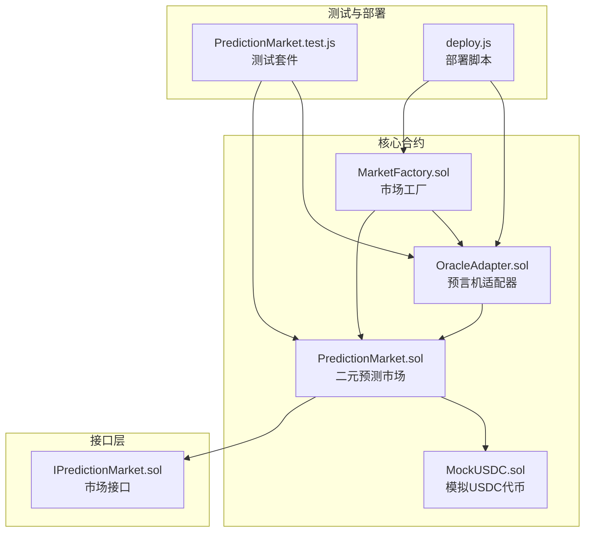
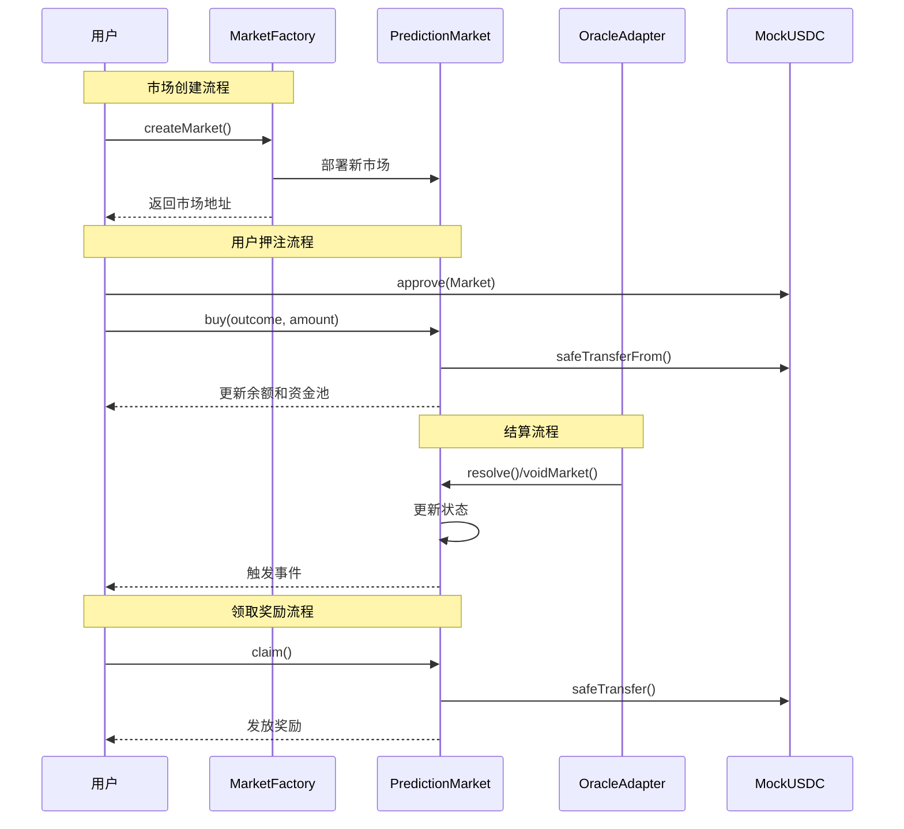
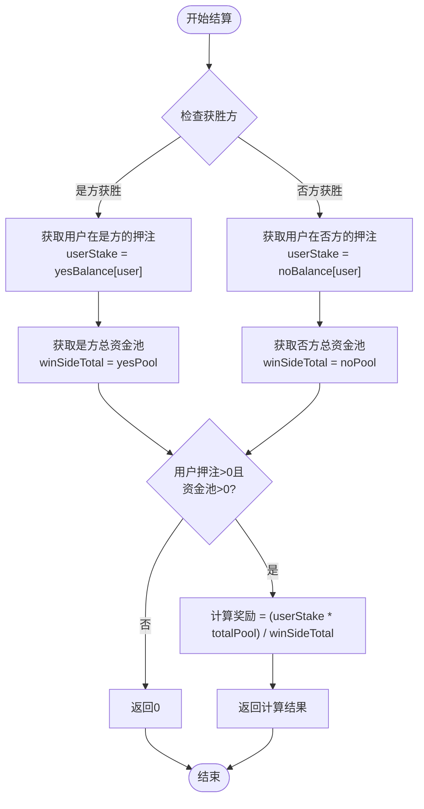
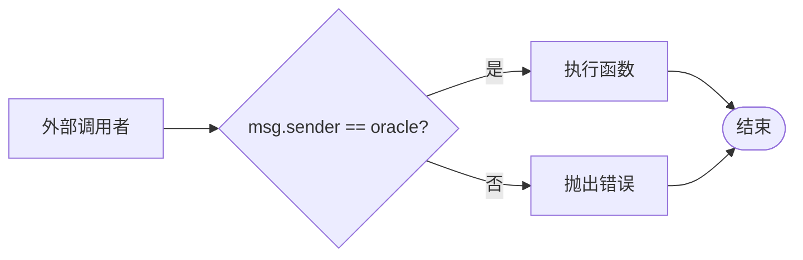
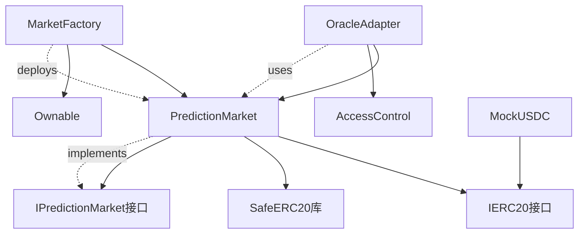

# PredictionMarket合约

<cite>
**本文档引用的文件**
- [PredictionMarket.sol](file://contracts/PredictionMarket.sol)
- [IPredictionMarket.sol](file://contracts/interfaces/IPredictionMarket.sol)
- [OracleAdapter.sol](file://contracts/OracleAdapter.sol)
- [MarketFactory.sol](file://contracts/MarketFactory.sol)
- [MockUSDC.sol](file://contracts/MockUSDC.sol)
- [PredictionMarket.test.js](file://test/PredictionMarket.test.js)
- [deploy.js](file://scripts/deploy.js)
</cite>

## 目录
1. [简介](#简介)
2. [项目结构](#项目结构)
3. [核心组件](#核心组件)
4. [架构概览](#架构概览)
5. [详细组件分析](#详细组件分析)
6. [依赖关系分析](#依赖关系分析)
7. [性能考虑](#性能考虑)
8. [故障排除指南](#故障排除指南)
9. [结论](#结论)
10. [附录](#附录)

## 简介
PredictionMarket合约实现了基于互惠池（parimutuel）机制的二元预测市场。该合约支持用户对"是"或"否"两种结果进行押注，通过智能合约自动管理资金池，并在市场结算时按照预定义的算法分配奖励。合约采用OpenZeppelin的安全实践，包括安全的ERC20转账和访问控制机制。

## 项目结构
该项目采用模块化设计，包含多个相互协作的合约：



**图表来源**
- [PredictionMarket.sol:1-145](file://contracts/PredictionMarket.sol#L1-L145)
- [OracleAdapter.sol:1-96](file://contracts/OracleAdapter.sol#L1-L96)
- [MarketFactory.sol:1-68](file://contracts/MarketFactory.sol#L1-L68)

**章节来源**
- [PredictionMarket.sol:1-145](file://contracts/PredictionMarket.sol#L1-L145)
- [OracleAdapter.sol:1-96](file://contracts/OracleAdapter.sol#L1-L96)
- [MarketFactory.sol:1-68](file://contracts/MarketFactory.sol#L1-L68)

## 核心组件
PredictionMarket合约包含以下关键组件：

### 状态管理
- **市场状态枚举**: Open(开放)、Resolved(已结算)、Voided(已作废)
- **时间戳管理**: endTime字段控制市场关闭时间
- **资金池管理**: separate pools for "yes" and "no" outcomes

### 数据结构
- **映射存储**: 用户余额、已领取标记
- **不可变参数**: 抵押品代币、预言机地址、工厂地址、比赛引用
- **公开状态**: 当前市场状态、获胜结果

### 互惠池机制
合约实现了经典的parimutuel机制：
- 所有押注资金进入相应的资金池
- 结算时按用户在获胜方的押注占比分配总池
- 失败方的押注归零，成功方分享总池

**章节来源**
- [PredictionMarket.sol:14-41](file://contracts/PredictionMarket.sol#L14-L41)
- [PredictionMarket.sol:125-143](file://contracts/PredictionMarket.sol#L125-L143)

## 架构概览
PredictionMarket采用分层架构设计，通过工厂模式和适配器模式实现松耦合：



**图表来源**
- [MarketFactory.sol:43-61](file://contracts/MarketFactory.sol#L43-L61)
- [PredictionMarket.sol:70-88](file://contracts/PredictionMarket.sol#L70-L88)
- [OracleAdapter.sol:57-94](file://contracts/OracleAdapter.sol#L57-L94)

## 详细组件分析

### 构造函数与初始化
构造函数负责设置市场的基本参数和验证输入的有效性：

**参数验证规则**:
- 抵押品地址必须有效（非零地址）
- 预言机地址必须有效（非零地址）
- 截止时间必须在未来
- 初始化市场状态为Open

**初始化流程**:
1. 设置不可变参数
2. 初始化资金池为0
3. 设置初始状态为Open

**章节来源**
- [PredictionMarket.sol:49-68](file://contracts/PredictionMarket.sol#L49-L68)

### 互惠池计算算法
互惠池机制的核心算法实现：



**算法特点**:
- 公平分配：按用户在获胜方的押注占比分配总池
- 风险共担：失败方的押注归零，成功方分享总池
- 无手续费：直接按比例分配，不扣除任何费用

**图表来源**
- [PredictionMarket.sol:125-143](file://contracts/PredictionMarket.sol#L125-L143)

**章节来源**
- [PredictionMarket.sol:125-143](file://contracts/PredictionMarket.sol#L125-L143)

### 安全机制与访问控制

#### onlyOracle修饰符
预言机权限控制系统确保只有授权的预言机可以执行结算操作：

**安全特性**:
- 单一权限模型：仅预言机地址可调用
- 编译时检查：在编译时验证权限
- 明确错误消息："not oracle"

**权限管理流程**:


**图表来源**
- [PredictionMarket.sol:43-47](file://contracts/PredictionMarket.sol#L43-L47)

**章节来源**
- [PredictionMarket.sol:43-47](file://contracts/PredictionMarket.sol#L43-L47)

### 事件系统与日志记录

合约定义了完整的事件系统用于跟踪关键操作：

| 事件类型 | 触发时机 | 参数 | 用途 |
|---------|---------|------|------|
| Bought | 用户购买份额时 | user, outcome, amount | 记录押注详情 |
| Resolved | 市场结算时 | winningOutcome | 标识获胜结果 |
| Claimed | 用户领取奖励时 | user, amount | 记录奖励发放 |
| MarketVoided | 市场作废时 | - | 标识市场状态变更 |

**章节来源**
- [PredictionMarket.sol:38-41](file://contracts/PredictionMarket.sol#L38-L41)

### 错误处理与边界条件

合约实现了全面的输入验证和错误处理：

**主要错误条件**:
- "collateral": 抵押品地址为零
- "oracle": 预言机地址为零  
- "end in past": 截止时间在当前时间之前
- "not open": 市场状态不是Open
- "ended": 超过截止时间
- "invalid outcome": 结果编号无效(>1)
- "zero amount": 押注金额为零
- "already claimed": 重复领取奖励
- "not claimable": 市场状态不允许领取
- "nothing to claim": 无可领取的奖励

**章节来源**
- [PredictionMarket.sol:58-67](file://contracts/PredictionMarket.sol#L58-L67)
- [PredictionMarket.sol:71-88](file://contracts/PredictionMarket.sol#L71-L88)
- [PredictionMarket.sol:107-123](file://contracts/PredictionMarket.sol#L107-L123)

## 依赖关系分析

### 合约间依赖关系



**图表来源**
- [PredictionMarket.sol:6-12](file://contracts/PredictionMarket.sol#L6-L12)
- [OracleAdapter.sol:6-11](file://contracts/OracleAdapter.sol#L6-L11)
- [MarketFactory.sol:6-8](file://contracts/MarketFactory.sol#L6-L8)

### 外部依赖分析

**OpenZeppelin库依赖**:
- SafeERC20: 提供安全的ERC20转账功能
- IERC20: ERC20代币标准接口
- AccessControl: 角色基础的访问控制
- Ownable: 所有权管理模式

**依赖关系影响**:
- 安全性：利用经过审计的OpenZeppelin组件
- 可维护性：标准化的接口和模式
- 兼容性：遵循ERC20标准

**章节来源**
- [PredictionMarket.sol:6-12](file://contracts/PredictionMarket.sol#L6-L12)
- [OracleAdapter.sol:6-11](file://contracts/OracleAdapter.sol#L6-L11)
- [MarketFactory.sol:6-8](file://contracts/MarketFactory.sol#L6-L8)

## 性能考虑

### Gas优化策略
- **存储优化**: 使用映射而非数组减少存储成本
- **状态检查**: 在函数开始处进行快速失败检查
- **批量操作**: 支持多用户同时参与市场活动
- **内存效率**: 避免不必要的中间变量创建

### 可扩展性设计
- **模块化架构**: 各合约职责单一，易于独立升级
- **接口抽象**: 通过接口实现松耦合设计
- **工厂模式**: 支持批量创建相似合约
- **适配器模式**: 为未来扩展提供接口

## 故障排除指南

### 常见部署问题

**问题1: 部署失败 - "collateral" 或 "oracle" 错误**
- **原因**: 抵押品或预言机地址为零
- **解决方案**: 确保提供有效的合约地址
- **参考**: [PredictionMarket.sol:58-59](file://contracts/PredictionMarket.sol#L58-L59)

**问题2: 时间锁配置问题**
- **原因**: 时间锁延迟设置不当
- **解决方案**: 检查OracleAdapter的时间锁配置
- **参考**: [OracleAdapter.sol:36-40](file://contracts/OracleAdapter.sol#L36-L40)

### 运行时问题

**问题3: 无法购买份额**
- **原因**: 市场已关闭或超过截止时间
- **解决方案**: 检查市场状态和时间戳
- **参考**: [PredictionMarket.sol:71-75](file://contracts/PredictionMarket.sol#L71-L75)

**问题4: 领取奖励失败**
- **原因**: 市场未结算或用户已领取
- **解决方案**: 确认市场状态和领取状态
- **参考**: [PredictionMarket.sol:107-123](file://contracts/PredictionMarket.sol#L107-L123)

### 测试验证

**单元测试覆盖**:
- 基本购买功能测试
- 结算后奖励分配测试
- 失败者无法领取测试
- 重复领取拒绝测试
- 非预言机权限测试

**章节来源**
- [PredictionMarket.test.js:36-76](file://test/PredictionMarket.test.js#L36-L76)

## 结论
PredictionMarket合约实现了功能完整、安全性高的二元预测市场。其核心优势包括：

1. **简洁高效**: 采用经典的parimutuel机制，算法简单透明
2. **安全可靠**: 基于OpenZeppelin的安全实践，完善的权限控制
3. **可扩展性强**: 模块化设计支持未来功能扩展
4. **易于集成**: 标准化的接口和事件系统

该合约适合构建去中心化预测市场基础设施，为用户提供透明、公平的预测投注体验。

## 附录

### API参考

#### 构造函数
- **参数**: 抵押品地址、预言机地址、工厂地址、比赛引用、问题描述、截止时间
- **返回**: 无
- **错误**: "collateral"、"oracle"、"end in past"

#### buy函数
- **参数**: outcome(0=是,1=否)、amount
- **返回**: 无
- **错误**: "not open"、"ended"、"invalid outcome"、"zero amount"

#### resolve函数
- **参数**: winningOutcome(0=是,1=否)
- **返回**: 无
- **错误**: "not open"、"invalid outcome"

#### voidMarket函数
- **参数**: 无
- **返回**: 无
- **错误**: "not open"

#### claim函数
- **参数**: 无
- **返回**: 无
- **错误**: "already claimed"、"not claimable"、"nothing to claim"

### 使用示例

**创建市场**:
```javascript
// 通过MarketFactory创建新市场
const factory = await ethers.getContract("MarketFactory");
const marketAddress = await factory.createMarket(
    matchRef,      // 比赛引用
    question,      // 预测问题
    endTime        // 截止时间
);
```

**用户购买**:
```javascript
// 授权并购买份额
await collateral.connect(user).approve(marketAddr, amount);
await market.connect(user).buy(0, amount); // 购买"是"方
```

**市场结算**:
```javascript
// 通过OracleAdapter结算
await adapter.connect(oracle).resolveNow(marketAddr, 0); // "是"方获胜
```

**领取奖励**:
```javascript
// 获胜者领取奖励
await market.connect(winner).claim();
```

**章节来源**
- [MarketFactory.sol:43-61](file://contracts/MarketFactory.sol#L43-L61)
- [PredictionMarket.test.js:37-54](file://test/PredictionMarket.test.js#L37-L54)
- [deploy.js:26-32](file://scripts/deploy.js#L26-L32)