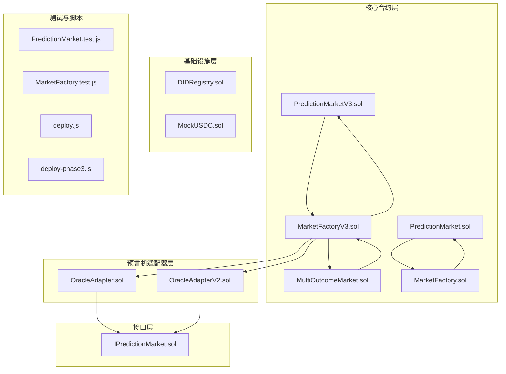
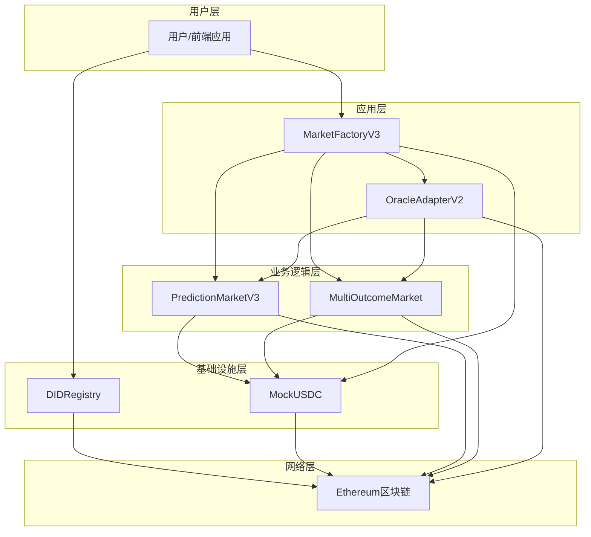
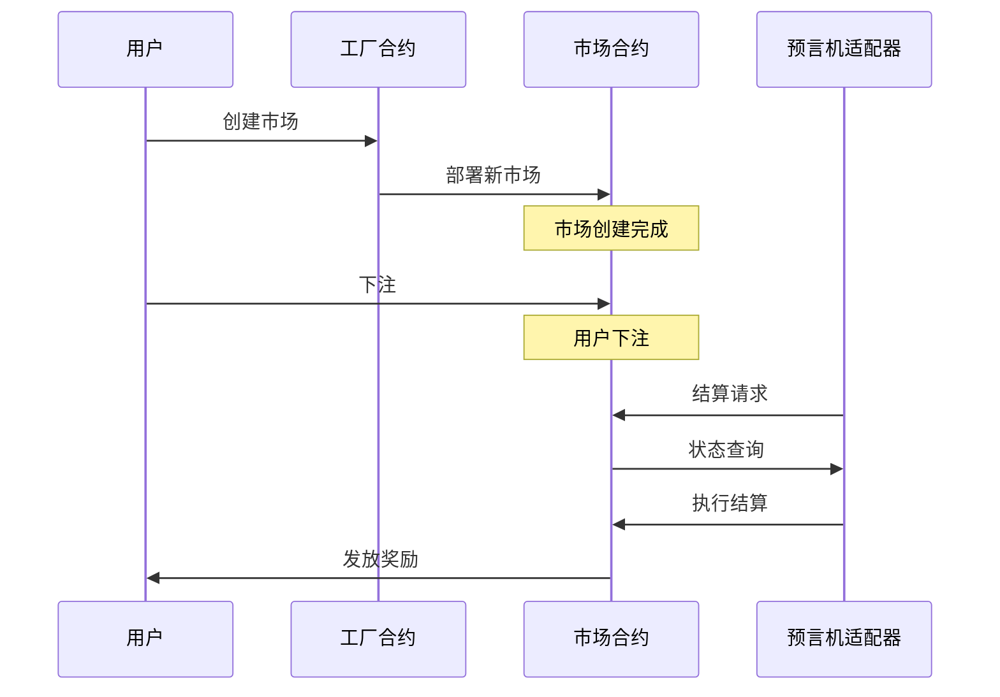
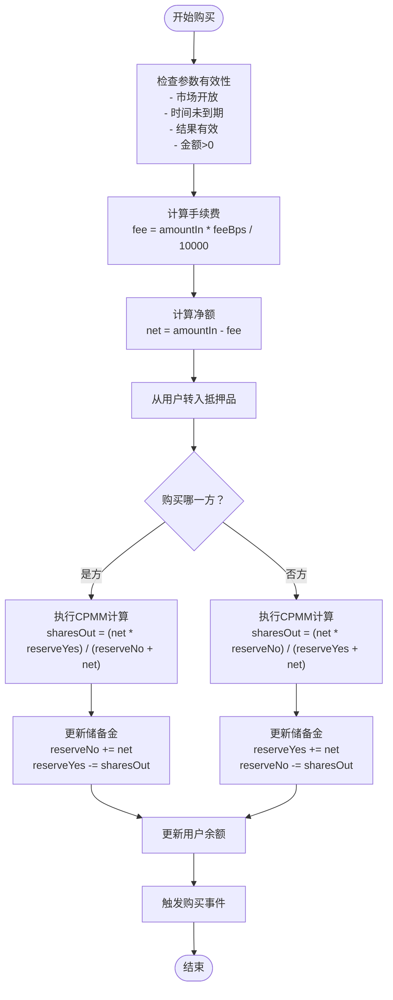
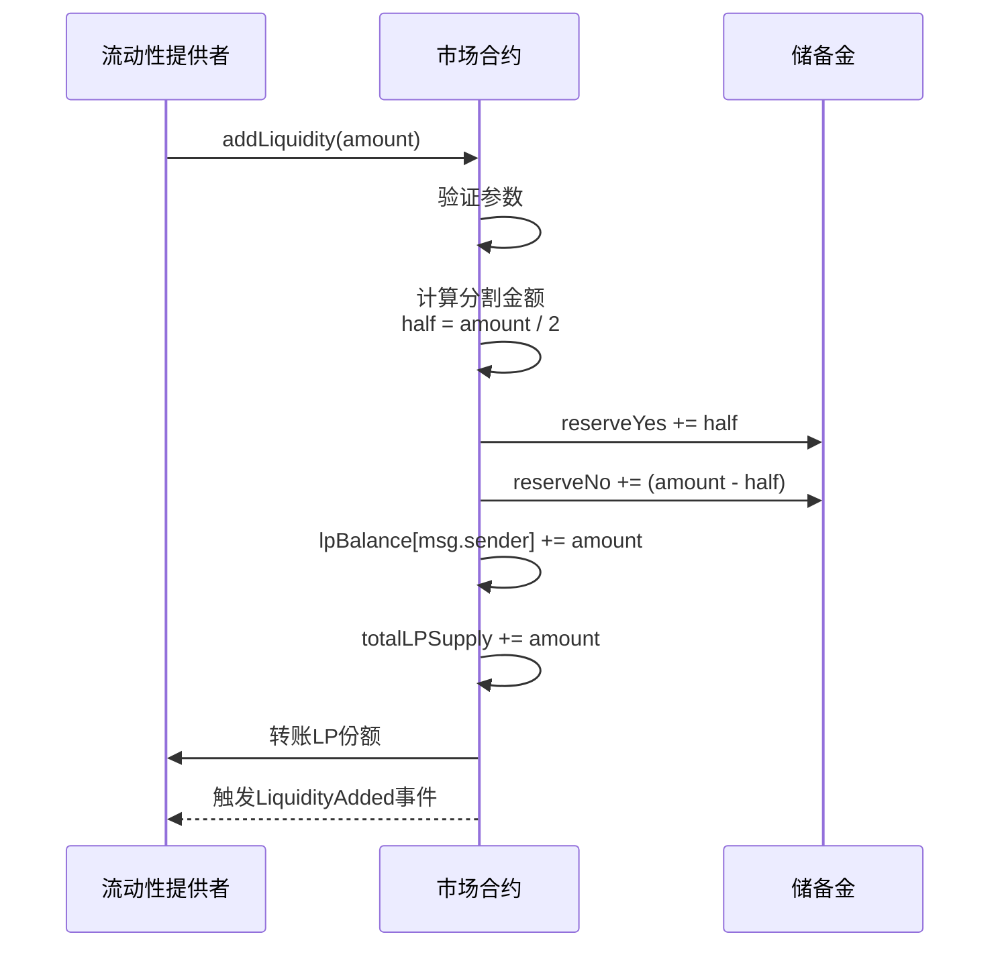
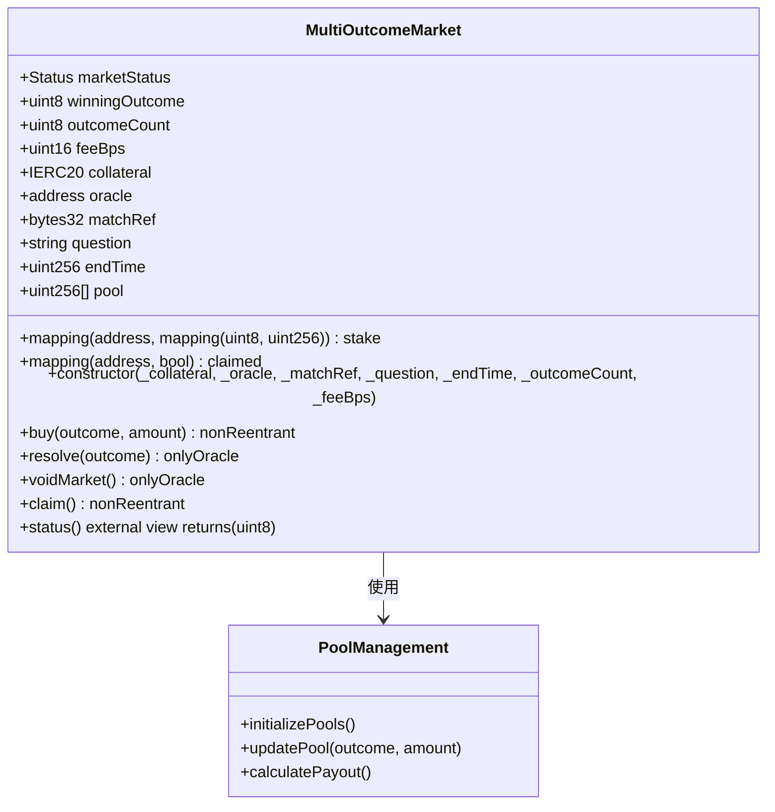
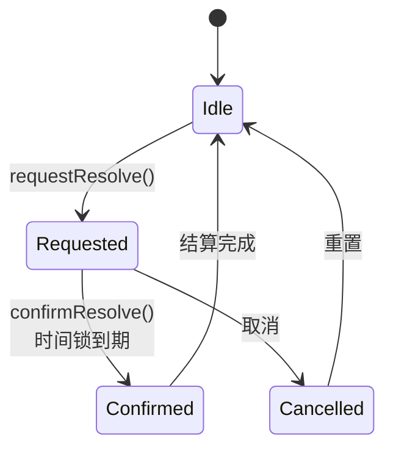
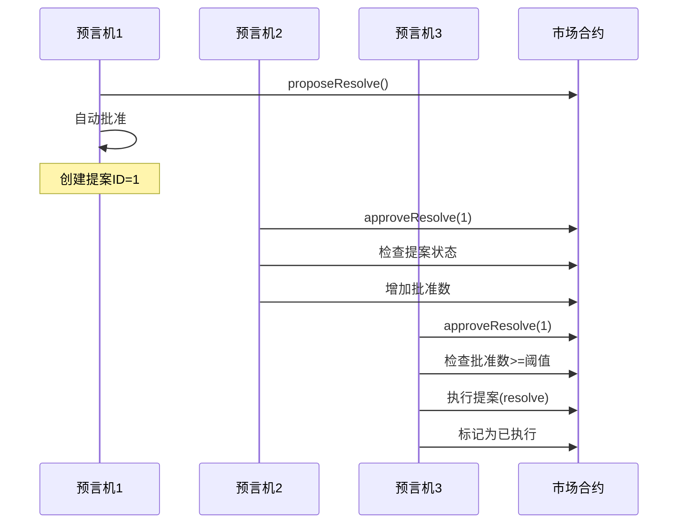
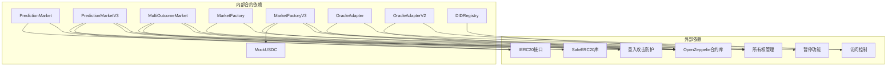
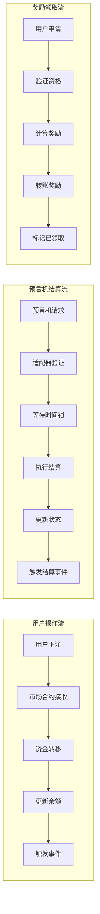

# 核心合约

<cite>
**本文档引用的文件**
- [PredictionMarket.sol](file://contracts/PredictionMarket.sol)
- [PredictionMarketV3.sol](file://contracts/PredictionMarketV3.sol)
- [MultiOutcomeMarket.sol](file://contracts/MultiOutcomeMarket.sol)
- [MarketFactory.sol](file://contracts/MarketFactory.sol)
- [MarketFactoryV3.sol](file://contracts/MarketFactoryV3.sol)
- [IPredictionMarket.sol](file://contracts/interfaces/IPredictionMarket.sol)
- [OracleAdapter.sol](file://contracts/OracleAdapter.sol)
- [OracleAdapterV2.sol](file://contracts/OracleAdapterV2.sol)
- [DIDRegistry.sol](file://contracts/DIDRegistry.sol)
- [MockUSDC.sol](file://contracts/MockUSDC.sol)
- [PredictionMarket.test.js](file://test/PredictionMarket.test.js)
- [MarketFactory.test.js](file://test/MarketFactory.test.js)
- [deploy.js](file://scripts/deploy.js)
- [deploy-phase3.js](file://scripts/deploy-phase3.js)
</cite>

## 目录
1. [简介](#简介)
2. [项目结构](#项目结构)
3. [核心组件](#核心组件)
4. [架构概览](#架构概览)
5. [详细组件分析](#详细组件分析)
6. [依赖关系分析](#依赖关系分析)
7. [性能考虑](#性能考虑)
8. [故障排除指南](#故障排除指南)
9. [结论](#结论)
10. [附录](#附录)

## 简介
本项目是一个基于以太坊的预测市场协议，实现了多种类型的预测市场合约，包括传统的二元预测市场、基于常数乘积做市商(CPMM)模型的二元预测市场，以及支持多结果的预测市场。系统采用工厂模式进行合约部署，并通过预言机适配器实现去中心化的市场结算机制。

该协议支持两种预言机模式：
- 单一预言机模式（OracleAdapter）
- 多签共识模式（OracleAdapterV2）

同时集成了DID（去中心化身份）注册功能，为用户提供链上身份绑定服务。

## 项目结构
项目采用按功能分层的组织方式，主要包含以下模块：



**图表来源**
- [PredictionMarket.sol:1-145](file://contracts/PredictionMarket.sol#L1-L145)
- [PredictionMarketV3.sol:1-218](file://contracts/PredictionMarketV3.sol#L1-L218)
- [MultiOutcomeMarket.sol:1-124](file://contracts/MultiOutcomeMarket.sol#L1-L124)
- [MarketFactory.sol:1-68](file://contracts/MarketFactory.sol#L1-L68)
- [MarketFactoryV3.sol:1-104](file://contracts/MarketFactoryV3.sol#L1-L104)

**章节来源**
- [PredictionMarket.sol:1-145](file://contracts/PredictionMarket.sol#L1-L145)
- [MarketFactory.sol:1-68](file://contracts/MarketFactory.sol#L1-L68)
- [MarketFactoryV3.sol:1-104](file://contracts/MarketFactoryV3.sol#L1-L104)

## 核心组件
本节详细介绍各个核心合约的功能、数据结构和交互关系。

### PredictionMarket（传统二元预测市场）
这是最基础的预测市场实现，采用互池式（Parimutuel）模型，支持"是/否"两种结果。

**主要特性：**
- 互池式资金管理：所有投注汇集到统一资金池
- 简单的二元结果：0=是，1=否
- 预言机驱动的结算机制
- 支持市场作废和奖励领取

**核心数据结构：**
- `Status` 枚举：Open(开放)、Resolved(已结算)、Voided(已作废)
- `yesPool/noPool`：分别存储"是"/"否"方的资金池余额
- `yesBalance/noBalance`：用户在各结果上的押注余额
- `collateral/oracle/factory/matchRef`：不可变的配置参数

**关键接口：**
- `buy(outcome, amount)`：购买预测份额
- `resolve(winningOutcome)`：预言机结算市场
- `voidMarket()`：作废市场
- `claim()`：领取奖励

**章节来源**
- [PredictionMarket.sol:9-145](file://contracts/PredictionMarket.sol#L9-L145)

### PredictionMarketV3（CPMM二元预测市场）
这是升级版的二元预测市场，采用常数乘积做市商(CPMM)模型，支持流动性提供和手续费收入。

**主要特性：**
- CPMM做市商模型：基于恒定乘积公式
- 流动性池：支持LP提供流动性
- 手续费机制：按交易额收取手续费
- 防重入攻击保护
- 用户最大押注限制

**核心数据结构：**
- `reserveYes/reserveNo`：做市商储备金
- `lpBalance/totalLPSupply`：流动性池份额
- `collectedFees`：已收集手续费
- `feeBps/maxBetPerUser`：手续费率和用户最大押注

**关键接口：**
- `buy(outcome, amountIn)`：CPMM购买逻辑
- `addLiquidity(amount)`：添加流动性
- `removeLiquidity(lpAmount)`：移除流动性
- `seedReserves(perSide, lpRecipient)`：初始化流动性池

**章节来源**
- [PredictionMarketV3.sol:10-218](file://contracts/PredictionMarketV3.sol#L10-L218)

### MultiOutcomeMarket（多结果预测市场）
支持2-8个结果的预测市场，同样采用CPMM模型。

**主要特性：**
- 支持2-8个结果
- CPMM做市商模型
- 统一的手续费机制
- 防重入攻击保护

**核心数据结构：**
- `pool[]`：各结果的资金池数组
- `stake[address][uint8]`：用户在各结果上的押注
- `outcomeCount`：结果数量配置

**关键接口：**
- `buy(outcome, amount)`：购买特定结果的份额
- 其他接口与V3版本类似

**章节来源**
- [MultiOutcomeMarket.sol:10-124](file://contracts/MultiOutcomeMarket.sol#L10-L124)

### MarketFactory（工厂合约 - V2）
传统工厂合约，用于部署PredictionMarket。

**主要功能：**
- 部署新的预测市场
- 管理市场ID映射
- 设置预言机地址
- 触发MarketCreated事件

**章节来源**
- [MarketFactory.sol:12-68](file://contracts/MarketFactory.sol#L12-L68)

### MarketFactoryV3（工厂合约 - V3）
升级版工厂合约，支持多种市场类型。

**主要功能：**
- 部署二元V3市场（带初始流动性）
- 部署多结果市场
- 管理市场类型映射
- 支持暂停/恢复功能
- 默认配置管理

**章节来源**
- [MarketFactoryV3.sol:14-104](file://contracts/MarketFactoryV3.sol#L14-L104)

## 架构概览
系统采用分层架构设计，从底层基础设施到上层应用合约形成清晰的层次结构。



**图表来源**
- [MarketFactoryV3.sol:14-104](file://contracts/MarketFactoryV3.sol#L14-L104)
- [OracleAdapterV2.sol:11-95](file://contracts/OracleAdapterV2.sol#L11-L95)
- [MockUSDC.sol](file://contracts/MockUSDC.sol)

### 预言机适配器架构
系统提供两种预言机模式：



**图表来源**
- [OracleAdapter.sol:57-87](file://contracts/OracleAdapter.sol#L57-L87)
- [OracleAdapterV2.sol:51-86](file://contracts/OracleAdapterV2.sol#L51-L86)

## 详细组件分析

### PredictionMarketV3 详细分析

#### CPMM数学模型
PredictionMarketV3采用恒定乘积做市商模型，其核心公式为：
- `x * y = k`（常数k保持不变）
- 购买份额：`sharesOut = (net * reserveSide) / (oppositeReserve + net)`
- 注入资金：`reserveOpposite += net`
- 取出份额：`reserveSide -= sharesOut`



**图表来源**
- [PredictionMarketV3.sol:101-120](file://contracts/PredictionMarketV3.sol#L101-L120)
- [PredictionMarketV3.sol:194-205](file://contracts/PredictionMarketV3.sol#L194-L205)

#### 流动性提供机制


**图表来源**
- [PredictionMarketV3.sol:122-133](file://contracts/PredictionMarketV3.sol#L122-L133)

**章节来源**
- [PredictionMarketV3.sol:101-218](file://contracts/PredictionMarketV3.sol#L101-L218)

### MultiOutcomeMarket 详细分析

#### 多结果资金池管理
MultiOutcomeMarket支持2-8个结果，每个结果都有独立的资金池：



**图表来源**
- [MultiOutcomeMarket.sol:12-124](file://contracts/MultiOutcomeMarket.sol#L12-L124)

#### 奖励计算算法
多结果市场的奖励计算基于用户在获胜结果上的押注占该结果总池的比例：

```
奖励 = 用户在获胜结果的押注 × (所有结果总池 / 获胜结果池)
```

**章节来源**
- [MultiOutcomeMarket.sol:100-123](file://contracts/MultiOutcomeMarket.sol#L100-L123)

### 预言机适配器详细分析

#### OracleAdapter（单一预言机模式）


**图表来源**
- [OracleAdapter.sol:17-24](file://contracts/OracleAdapter.sol#L17-L24)

#### OracleAdapterV2（多签模式）


**图表来源**
- [OracleAdapterV2.sol:51-86](file://contracts/OracleAdapterV2.sol#L51-L86)

**章节来源**
- [OracleAdapter.sol:11-96](file://contracts/OracleAdapter.sol#L11-L96)
- [OracleAdapterV2.sol:11-95](file://contracts/OracleAdapterV2.sol#L11-L95)

## 依赖关系分析

### 合约间依赖关系


**图表来源**
- [PredictionMarket.sol:6-8](file://contracts/PredictionMarket.sol#L6-L8)
- [PredictionMarketV3.sol:6-8](file://contracts/PredictionMarketV3.sol#L6-L8)
- [MultiOutcomeMarket.sol:6-8](file://contracts/MultiOutcomeMarket.sol#L6-L8)

### 数据流分析


**图表来源**
- [PredictionMarketV3.sol:101-120](file://contracts/PredictionMarketV3.sol#L101-L120)
- [OracleAdapter.sol:57-87](file://contracts/OracleAdapter.sol#L57-L87)

**章节来源**
- [PredictionMarket.sol:70-123](file://contracts/PredictionMarket.sol#L70-L123)
- [PredictionMarketV3.sol:148-179](file://contracts/PredictionMarketV3.sol#L148-L179)

## 性能考虑

### Gas优化策略
1. **批量操作优化**：MultiOutcomeMarket支持批量计算，减少循环开销
2. **状态检查缓存**：使用本地变量缓存状态，避免重复读取
3. **条件判断优化**：在buy函数中先进行参数验证，避免不必要的计算
4. **存储槽优化**：合理安排状态变量布局，减少存储费用

### 可扩展性设计
1. **工厂模式**：通过工厂合约集中管理市场部署
2. **接口抽象**：IPredictionMarket接口提供统一的市场操作接口
3. **模块化设计**：预言机适配器支持不同的结算模式
4. **配置分离**：通过工厂合约管理默认配置

### 安全性考虑
1. **重入攻击防护**：所有外部调用均使用`nonReentrant`修饰符
2. **权限控制**：使用OpenZeppelin的AccessControl实现细粒度权限
3. **输入验证**：严格的参数验证和边界检查
4. **时间锁机制**：OracleAdapter提供时间锁防止恶意结算

## 故障排除指南

### 常见问题及解决方案

#### 1. 市场无法结算
**问题症状**：调用`resolve()`或`voidMarket()`失败
**可能原因**：
- 调用者不是预言机地址
- 市场状态不是Open
- 结果编号无效

**解决方案**：
- 确保调用者具有ORACLE_ROLE权限
- 检查市场状态是否为Open
- 验证结果编号在有效范围内

#### 2. 交易被重入攻击防护阻止
**问题症状**：调用`buy()`、`addLiquidity()`等函数失败
**可能原因**：
- 合约处于重入攻击防护状态
- 合同间相互调用导致状态冲突

**解决方案**：
- 确保没有在回调函数中再次调用同一合约
- 检查是否有其他合约正在与市场合约交互

#### 3. 奖励无法领取
**问题症状**：调用`claim()`返回"not claimable"或"nothing to claim"
**可能原因**：
- 市场状态不允许领取
- 用户已经领取过奖励
- 用户在获胜结果上没有押注

**解决方案**：
- 确认市场已结算或作废
- 检查`claimed`状态
- 验证用户在获胜结果上有押注

#### 4. 流动性提供失败
**问题症状**：调用`addLiquidity()`失败
**可能原因**：
- 市场状态不是Open
- 金额为0或不足
- 合约余额不足

**解决方案**：
- 确保市场处于Open状态
- 检查输入金额的有效性
- 验证合约有足够的抵押品

**章节来源**
- [PredictionMarket.test.js:72-76](file://test/PredictionMarket.test.js#L72-L76)
- [PredictionMarket.test.js:64-70](file://test/PredictionMarket.test.js#L64-L70)

### 调试技巧
1. **事件监控**：监听关键事件（如Bought、Resolved、Claimed）来跟踪状态变化
2. **状态查询**：使用`status()`、`getPoolState()`等只读函数检查合约状态
3. **Gas消耗分析**：使用不同输入参数测试gas消耗，识别性能瓶颈
4. **边界测试**：测试极端情况（最大押注、最小流动性等）

## 结论
本预测市场协议提供了完整的去中心化预测市场解决方案，具有以下特点：

**技术优势：**
- 支持多种市场模型（互池式、CPMM）
- 提供灵活的预言机结算机制
- 包含完善的权限控制和安全防护
- 具备良好的可扩展性和可维护性

**应用场景：**
- 体育赛事预测
- 政治事件预测
- 金融产品价格预测
- 企业业绩预测

**未来发展：**
- 可集成更多预言机源
- 支持更复杂的市场类型
- 优化用户体验和gas效率
- 增强跨链兼容性

该协议为构建去中心化预测市场生态奠定了坚实的基础，既适合初学者学习，也为专业开发者提供了丰富的技术参考。

## 附录

### 部署配置说明

#### 第二阶段部署参数
- **时间锁延迟**：可通过环境变量`ORACLE_TIMELOCK_SECONDS`配置，默认120秒
- **预言机角色**：部署者自动获得ORACLE_ROLE权限
- **MockUSDC**：用于测试的稳定币合约

#### 第三阶段部署参数
- **多签阈值**：可通过环境变量`ORACLE_MULTISIG_THRESHOLD`配置，默认2
- **默认手续费**：可通过环境变量`DEFAULT_FEE_BPS`配置，默认30基点
- **默认最大押注**：固定为10,000 USDC

**章节来源**
- [deploy.js:8-32](file://scripts/deploy.js#L8-L32)
- [deploy-phase3.js:8-24](file://scripts/deploy-phase3.js#L8-L24)

### 测试用例概览
项目包含完整的测试套件，覆盖核心功能：

1. **PredictionMarket测试**：验证基本的买卖、结算、领取功能
2. **MarketFactory测试**：验证市场创建和事件触发
3. **OracleAdapter测试**：验证预言机结算流程
4. **Phase3测试**：验证V3版本的高级功能

**章节来源**
- [PredictionMarket.test.js:1-77](file://test/PredictionMarket.test.js#L1-L77)
- [MarketFactory.test.js:1-31](file://test/MarketFactory.test.js#L1-L31)