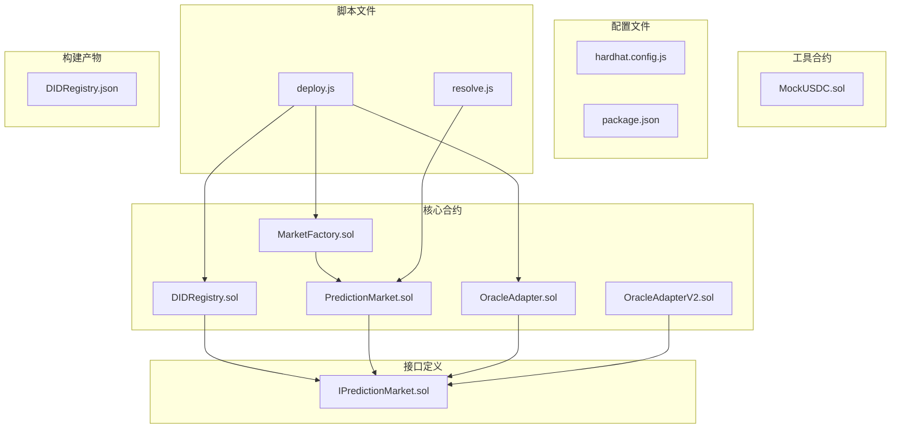
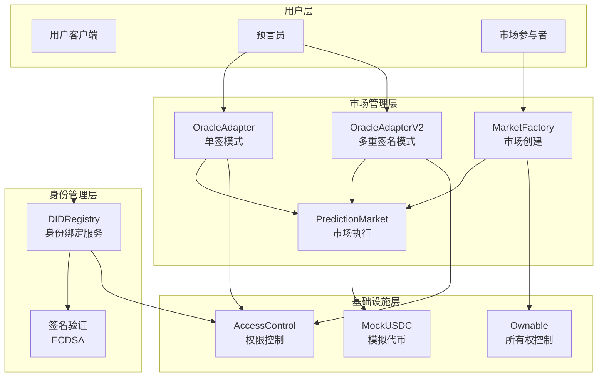
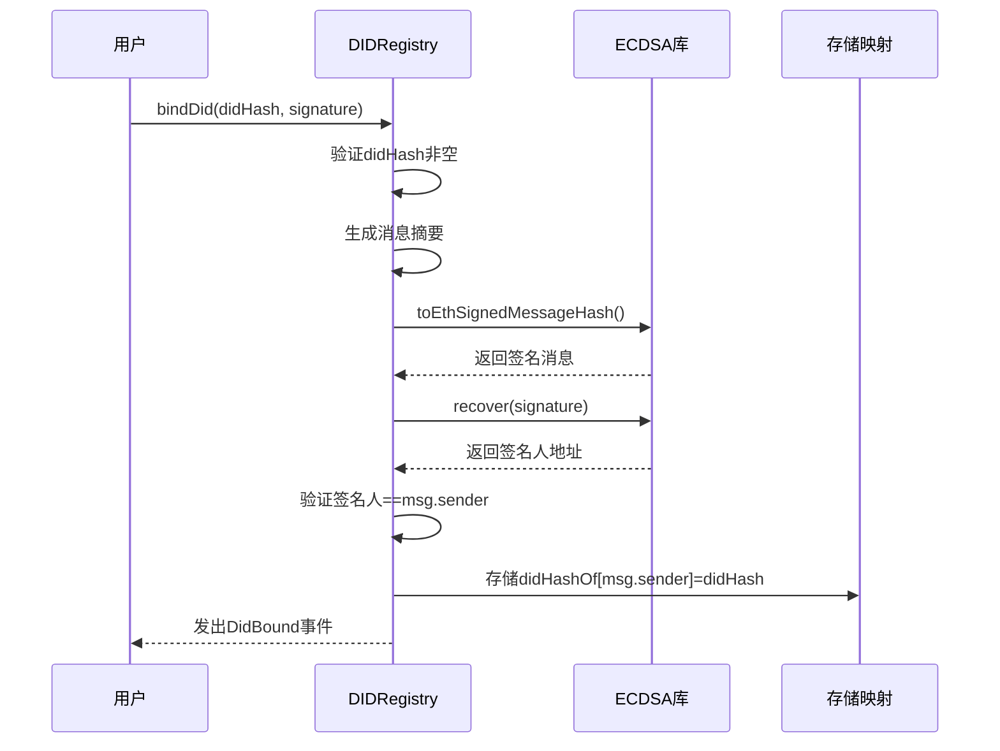
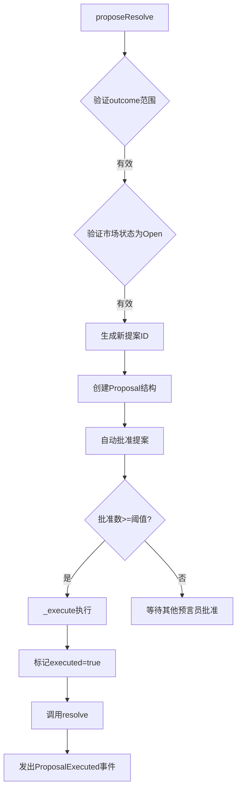
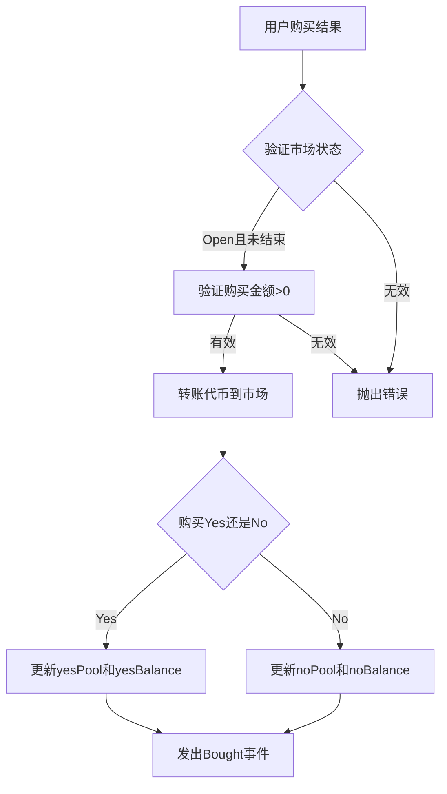
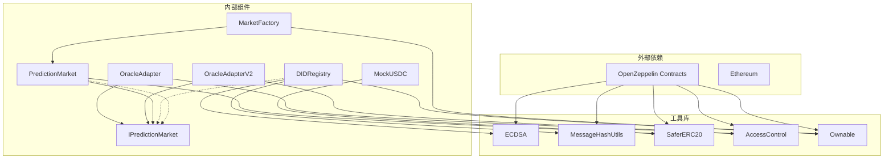

# DID注册合约

<cite>
**本文档引用的文件**
- [DIDRegistry.sol](file://contracts/DIDRegistry.sol)
- [OracleAdapter.sol](file://contracts/OracleAdapter.sol)
- [OracleAdapterV2.sol](file://contracts/OracleAdapterV2.sol)
- [IPredictionMarket.sol](file://contracts/interfaces/IPredictionMarket.sol)
- [PredictionMarket.sol](file://contracts/PredictionMarket.sol)
- [MarketFactory.sol](file://contracts/MarketFactory.sol)
- [MockUSDC.sol](file://contracts/MockUSDC.sol)
- [hardhat.config.js](file://hardhat.config.js)
- [deploy.js](file://scripts/deploy.js)
- [resolve.js](file://scripts/resolve.js)
- [package.json](file://package.json)
- [DIDRegistry.json](file://artifacts/contracts/DIDRegistry.sol/DIDRegistry.json)
</cite>

## 目录
1. [简介](#简介)
2. [项目结构](#项目结构)
3. [核心组件](#核心组件)
4. [架构概览](#架构概览)
5. [详细组件分析](#详细组件分析)
6. [依赖关系分析](#依赖关系分析)
7. [性能考虑](#性能考虑)
8. [故障排除指南](#故障排除指南)
9. [结论](#结论)

## 简介

DID注册合约是一个基于以太坊的去中心化身份标识符（Decentralized Identifier, DID）绑定服务系统。该系统实现了可选的链上DID哈希绑定功能，为预测市场平台提供身份验证和信誉管理能力。通过与预言机系统的深度集成，DID注册合约支持在预测市场中进行身份验证和结果确认。

该系统采用模块化设计，包含DID注册服务、预言机适配器、市场工厂和模拟代币等核心组件，为去中心化金融应用提供了完整的身份管理和市场治理基础设施。

## 项目结构

项目采用清晰的模块化组织结构，主要分为以下几类文件：



**图表来源**
- [DIDRegistry.sol](file://contracts/DIDRegistry.sol#L1-L34)
- [PredictionMarket.sol](file://contracts/PredictionMarket.sol#L1-L134)
- [MarketFactory.sol](file://contracts/MarketFactory.sol#L1-L60)
- [OracleAdapter.sol](file://contracts/OracleAdapter.sol#L1-L83)
- [OracleAdapterV2.sol](file://contracts/OracleAdapterV2.sol#L1-L83)

**章节来源**
- [hardhat.config.js](file://hardhat.config.js#L1-L30)
- [package.json](file://package.json#L1-L22)

## 核心组件

### DID注册服务

DID注册服务是整个系统的核心身份管理组件，负责处理去中心化身份标识符的绑定和解析。

**主要特性：**
- 基于ECDSA的数字签名验证
- 链上DID哈希存储
- 所有权控制的访问权限
- 事件驱动的身份状态跟踪

**数据结构：**
- `didHashOf`: 映射地址到DID哈希值的存储结构
- `DidBound`事件：记录身份绑定操作的日志

**章节来源**
- [DIDRegistry.sol](file://contracts/DIDRegistry.sol#L8-L33)

### 预言机适配器

预言机适配器提供两种不同的市场结果确认机制：

#### OracleAdapter（单签模式）
- 基于时间锁的延迟执行
- 单个预言员的直接确认
- 快速路径和标准路径两种执行方式

#### OracleAdapterV2（多重签名模式）
- 多签阈值控制系统
- 提案-批准-执行的治理流程
- 支持多结果选项的复杂市场

**章节来源**
- [OracleAdapter.sol](file://contracts/OracleAdapter.sol#L7-L83)
- [OracleAdapterV2.sol](file://contracts/OracleAdapterV2.sol#L7-L83)

### 预测市场合约

预测市场合约实现了一个基于泊松分布的预测市场机制，支持二元和多元结果的市场交易。

**核心功能：**
- Parimutuel池化机制
- 智能价格调整算法
- 自动化结算和赔付
- 争议解决和市场作废

**章节来源**
- [PredictionMarket.sol](file://contracts/PredictionMarket.sol#L7-L134)

## 架构概览

系统采用分层架构设计，各组件之间通过明确定义的接口进行交互：



**图表来源**
- [DIDRegistry.sol](file://contracts/DIDRegistry.sol#L9-L33)
- [OracleAdapter.sol](file://contracts/OracleAdapter.sol#L8-L83)
- [OracleAdapterV2.sol](file://contracts/OracleAdapterV2.sol#L8-L83)
- [PredictionMarket.sol](file://contracts/PredictionMarket.sol#L8-L134)
- [MarketFactory.sol](file://contracts/MarketFactory.sol#L9-L60)

## 详细组件分析

### DID注册合约详细分析

DID注册合约实现了完整的身份绑定和验证机制：

#### 绑定流程



**图表来源**
- [DIDRegistry.sol](file://contracts/DIDRegistry.sol#L19-L28)

#### 解析流程

```mermaid
flowchart TD
A[调用resolveDid(account)] --> B{检查账户是否存在}
B --> |存在| C[从存储映射读取didHashOf[account]]
B --> |不存在| D[返回bytes32(0)]
C --> E[返回DID哈希值]
D --> F[返回零哈希值]
```

**图表来源**
- [DIDRegistry.sol](file://contracts/DIDRegistry.sol#L30-L32)

**章节来源**
- [DIDRegistry.sol](file://contracts/DIDRegistry.sol#L1-L34)

### 预言机适配器组件分析

#### OracleAdapter（单签模式）

OracleAdapter提供了简单直接的市场结果确认机制：

**关键特性：**
- 时间锁延迟执行防止抢先交易
- 即时确认和请求-确认两种模式
- 访问控制的角色管理

**执行流程：**

```mermaid
sequenceDiagram
participant Oracle as 预言员
participant Adapter as OracleAdapter
participant Market as PredictionMarket
Oracle->>Adapter : requestResolve(market, outcome)
Adapter->>Adapter : 验证市场状态为Open
Adapter->>Adapter : 计算executeAfter = now + timelockDelay
Adapter->>Adapter : 设置PendingResolve结构
Adapter-->>Oracle : 发出OracleResolveRequested事件
Note after 10 : Adapter执行确认
Oracle->>Adapter : confirmResolve(market)
Adapter->>Adapter : 验证pending.active
Adapter->>Adapter : 验证block.timestamp >= executeAfter
Adapter->>Market : 调用resolve(outcome)
Adapter-->>Oracle : 发出OracleResolveConfirmed事件
```

**图表来源**
- [OracleAdapter.sol](file://contracts/OracleAdapter.sol#L48-L67)

#### OracleAdapterV2（多重签名模式）

OracleAdapterV2实现了更复杂的治理机制：

**核心机制：**
- 提案-批准-执行的三阶段流程
- 可配置的阈值控制系统
- 支持多结果选项的市场

**提案流程：**



**图表来源**
- [OracleAdapterV2.sol](file://contracts/OracleAdapterV2.sol#L44-L75)

**章节来源**
- [OracleAdapter.sol](file://contracts/OracleAdapter.sol#L1-L83)
- [OracleAdapterV2.sol](file://contracts/OracleAdapterV2.sol#L1-L83)

### 预测市场合约分析

预测市场合约实现了泊松分布的市场定价模型：

**价格计算机制：**



**图表来源**
- [PredictionMarket.sol](file://contracts/PredictionMarket.sol#L64-L81)

**章节来源**
- [PredictionMarket.sol](file://contracts/PredictionMarket.sol#L1-L134)

## 依赖关系分析

系统采用模块化设计，各组件之间的依赖关系清晰明确：



**图表来源**
- [DIDRegistry.sol](file://contracts/DIDRegistry.sol#L4-L6)
- [OracleAdapter.sol](file://contracts/OracleAdapter.sol#L4-L5)
- [OracleAdapterV2.sol](file://contracts/OracleAdapterV2.sol#L4-L5)
- [PredictionMarket.sol](file://contracts/PredictionMarket.sol#L4-L5)
- [MarketFactory.sol](file://contracts/MarketFactory.sol#L4-L6)

**章节来源**
- [DIDRegistry.sol](file://contracts/DIDRegistry.sol#L1-L34)
- [OracleAdapter.sol](file://contracts/OracleAdapter.sol#L1-L83)
- [OracleAdapterV2.sol](file://contracts/OracleAdapterV2.sol#L1-L83)
- [PredictionMarket.sol](file://contracts/PredictionMarket.sol#L1-L134)
- [MarketFactory.sol](file://contracts/MarketFactory.sol#L1-L60)

## 性能考虑

### Gas优化策略

系统在多个层面实现了Gas优化：

1. **存储布局优化**
   - 使用紧凑的数据结构减少存储槽占用
   - 合理的映射使用避免不必要的存储开销

2. **计算优化**
   - 预先计算常量值避免重复计算
   - 使用位运算优化条件判断

3. **函数调用优化**
   - 合理的函数拆分避免重复代码
   - 使用内联函数减少调用开销

### 安全考虑

系统实现了多层次的安全防护：

1. **访问控制**
   - 使用OpenZeppelin的AccessControl实现细粒度权限管理
   - Ownable模式确保所有权安全

2. **输入验证**
   - 严格的参数验证防止恶意输入
   - 状态检查确保操作的原子性

3. **重入攻击防护**
   - SafeERC20库防止代币转移回退攻击
   - ReentrancyGuard防止重入攻击

## 故障排除指南

### 常见问题及解决方案

#### DID绑定失败
**问题描述：** `invalid sig` 错误
**可能原因：**
- 签名者不是消息发送者
- DID哈希为空值
- 签名格式不正确

**解决方案：**
1. 确保使用正确的私钥进行签名
2. 验证didHash参数的有效性
3. 检查签名的ECDSA格式

#### 预言机操作失败
**问题描述：** `timelock` 或 `no pending` 错误
**可能原因：**
- 时间锁延迟未过期
- 未正确发起请求
- 市场状态已改变

**解决方案：**
1. 等待时间锁延迟到期
2. 确保按顺序执行requestResolve和confirmResolve
3. 验证市场状态仍为Open

#### 市场交易失败
**问题描述：** `not open` 或 `ended` 错误
**可能原因：**
- 市场已结束或已结算
- 购买金额为0或无效
- 结果参数超出范围

**解决方案：**
1. 检查市场结束时间和状态
2. 验证购买金额大于0
3. 确保结果参数在有效范围内

**章节来源**
- [DIDRegistry.sol](file://contracts/DIDRegistry.sol#L19-L28)
- [OracleAdapter.sol](file://contracts/OracleAdapter.sol#L48-L67)
- [PredictionMarket.sol](file://contracts/PredictionMarket.sol#L64-L81)

## 结论

DID注册合约系统提供了一个完整、安全、高效的去中心化身份管理解决方案。通过精心设计的模块化架构和严格的安全措施，该系统能够满足预测市场平台对身份验证和信誉管理的需求。

### 主要优势

1. **安全性强**：基于ECDSA的数字签名验证，确保身份绑定的真实性和完整性
2. **灵活性高**：支持单签和多重签名两种预言机模式，适应不同场景需求
3. **可扩展性好**：模块化设计便于功能扩展和维护
4. **成本效益**：经过优化的Gas消耗，降低用户的操作成本

### 技术特色

- **链上身份绑定**：将DID哈希存储在区块链上，确保不可篡改性
- **智能合约集成**：与预测市场合约无缝集成，提供完整的身份验证流程
- **多重签名治理**：支持去中心化治理，提高系统的透明度和可信度
- **事件驱动架构**：通过事件日志实现完整的审计追踪

该系统为去中心化金融应用提供了一个可靠的基础设施，为未来的扩展和升级奠定了坚实的基础。