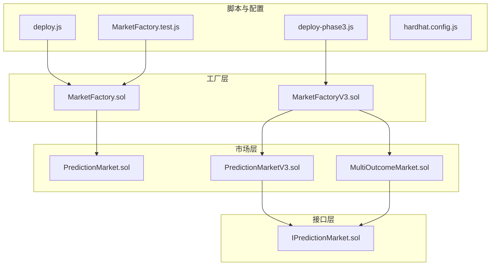
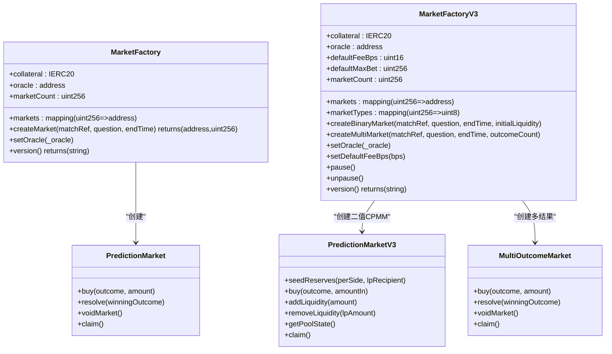
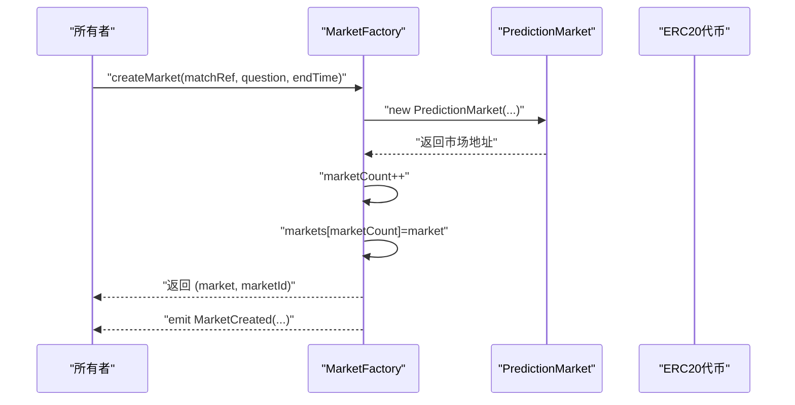
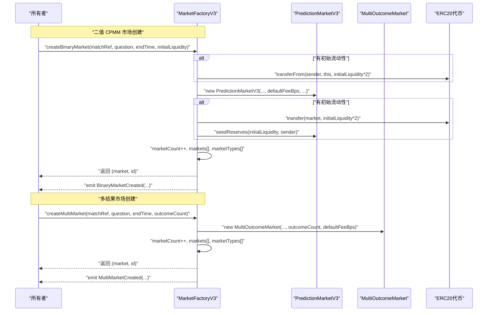
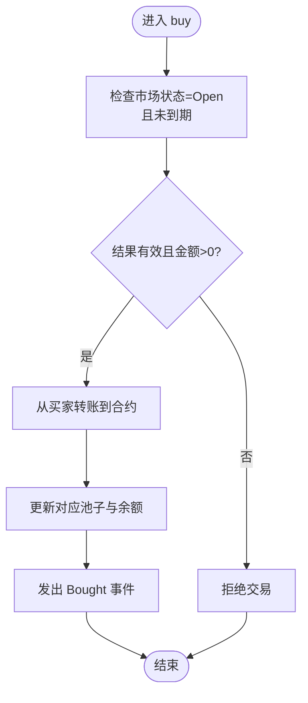
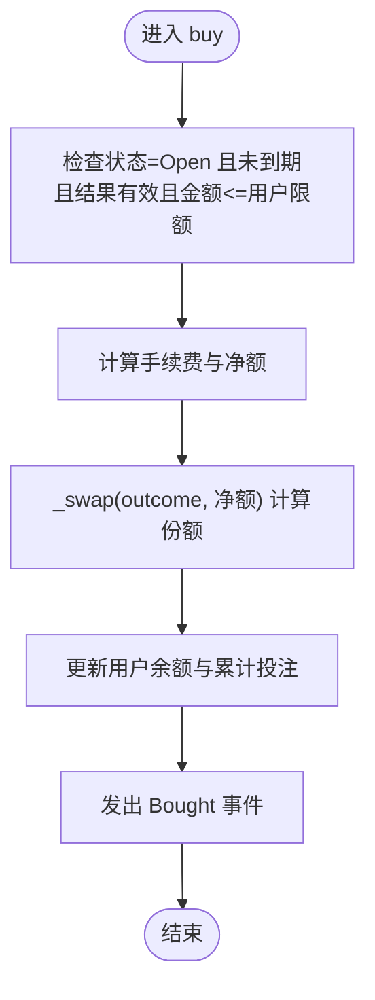
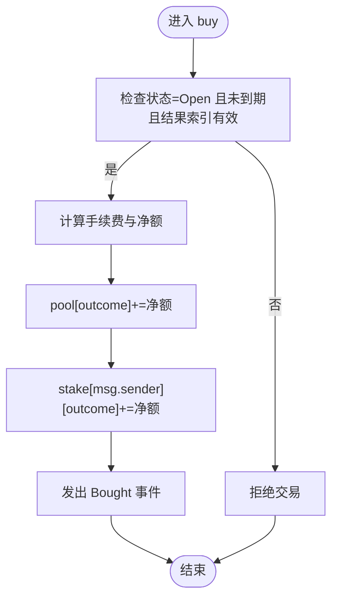
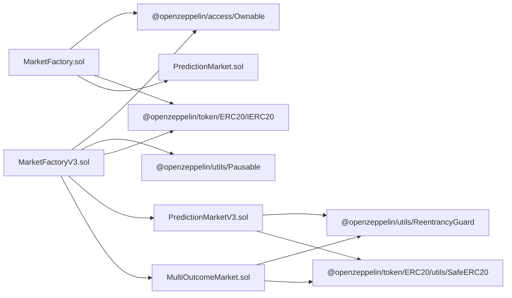

# 市场工厂合约

<cite>
**本文引用的文件**
- [MarketFactory.sol](file://contracts/MarketFactory.sol)
- [MarketFactoryV3.sol](file://contracts/MarketFactoryV3.sol)
- [PredictionMarket.sol](file://contracts/PredictionMarket.sol)
- [PredictionMarketV3.sol](file://contracts/PredictionMarketV3.sol)
- [MultiOutcomeMarket.sol](file://contracts/MultiOutcomeMarket.sol)
- [IPredictionMarket.sol](file://contracts/interfaces/IPredictionMarket.sol)
- [deploy.js](file://scripts/deploy.js)
- [deploy-phase3.js](file://scripts/deploy-phase3.js)
- [MarketFactory.test.js](file://test/MarketFactory.test.js)
- [hardhat.config.js](file://hardhat.config.js)
</cite>

## 目录
1. [简介](#简介)
2. [项目结构](#项目结构)
3. [核心组件](#核心组件)
4. [架构总览](#架构总览)
5. [详细组件分析](#详细组件分析)
6. [依赖关系分析](#依赖关系分析)
7. [性能考量](#性能考量)
8. [故障排查指南](#故障排查指南)
9. [结论](#结论)
10. [附录](#附录)

## 简介
本技术文档聚焦于预测市场工厂合约，系统性解析 MarketFactory（基础版）与 MarketFactoryV3（高级版）的工厂模式实现机制。文档涵盖：
- 工厂合约如何创建与管理预测市场实例
- 构造函数参数、市场创建流程与事件触发机制
- MarketFactoryV3 相比基础版的增强能力：CPMM 支持、多结果市场创建、流动性提供者集成
- 部署示例与市场创建代码片段路径
- 所有权管理与访问控制机制
- 市场生命周期管理与状态跟踪

## 项目结构
该仓库采用按合约类型分层组织方式，核心文件如下：
- 工厂合约：MarketFactory（基础版）、MarketFactoryV3（高级版）
- 市场合约：PredictionMarket（基础二值市场）、PredictionMarketV3（CPMM二值市场）、MultiOutcomeMarket（N结果市场）
- 接口：IPredictionMarket（市场接口）
- 脚本：部署脚本（Phase2/Phase3）、测试用例
- 配置：Hardhat 配置

图表来源
- [MarketFactory.sol](file://contracts/MarketFactory.sol#L1-L60)
- [MarketFactoryV3.sol](file://contracts/MarketFactoryV3.sol#L1-L94)
- [PredictionMarket.sol](file://contracts/PredictionMarket.sol#L1-L134)
- [PredictionMarketV3.sol](file://contracts/PredictionMarketV3.sol#L1-L200)
- [MultiOutcomeMarket.sol](file://contracts/MultiOutcomeMarket.sol#L1-L113)
- [IPredictionMarket.sol](file://contracts/interfaces/IPredictionMarket.sol#L1-L9)
- [deploy.js](file://scripts/deploy.js#L1-L57)
- [deploy-phase3.js](file://scripts/deploy-phase3.js#L1-L43)
- [MarketFactory.test.js](file://test/MarketFactory.test.js#L1-L28)
- [hardhat.config.js](file://hardhat.config.js#L1-L30)

章节来源
- [MarketFactory.sol](file://contracts/MarketFactory.sol#L1-L60)
- [MarketFactoryV3.sol](file://contracts/MarketFactoryV3.sol#L1-L94)
- [PredictionMarket.sol](file://contracts/PredictionMarket.sol#L1-L134)
- [PredictionMarketV3.sol](file://contracts/PredictionMarketV3.sol#L1-L200)
- [MultiOutcomeMarket.sol](file://contracts/MultiOutcomeMarket.sol#L1-L113)
- [IPredictionMarket.sol](file://contracts/interfaces/IPredictionMarket.sol#L1-L9)
- [deploy.js](file://scripts/deploy.js#L1-L57)
- [deploy-phase3.js](file://scripts/deploy-phase3.js#L1-L43)
- [MarketFactory.test.js](file://test/MarketFactory.test.js#L1-L28)
- [hardhat.config.js](file://hardhat.config.js#L1-L30)

## 核心组件
- MarketFactory（基础版）
  - 职责：仅创建二值（Yes/No）预测市场实例；通过 Ownable 实现所有权控制；记录市场计数与映射；发出 MarketCreated 事件。
  - 关键字段：collateral（不可变 ERC20 代币地址）、oracle（不可变）、marketCount、markets 映射。
  - 关键方法：setOracle（仅所有者）、createMarket（仅所有者，whenNotPaused 在 V3 中体现）、version。
- MarketFactoryV3（高级版）
  - 职责：支持二值 CPMM 市场与多结果市场；继承 Ownable 与 Pausable；默认费用、最大下注额可配置；支持初始流动性注入；记录市场类型（二值/多结果）。
  - 关键字段：defaultFeeBps、defaultMaxBet、marketCount、markets 映射、marketTypes 映射。
  - 关键方法：pause/unpause（仅所有者）、setOracle/setDefaultFeeBps（仅所有者）、createBinaryMarket（支持初始流动性）、createMultiMarket、version。
- PredictionMarket（基础二值市场）
  - 职责：Parimutuel 二值市场；状态机（Open/Resolved/Voided）；购买、结算、认领、作废。
  - 关键字段：collateral、oracle、factory、matchRef、question、endTime、状态、池子余额等。
  - 关键方法：buy、resolve（仅 Oracle）、voidMarket（仅 Oracle）、claim。
- PredictionMarketV3（CPMM 二值市场）
  - 职责：基于恒定乘积做市商模型（CPMM）的二值市场；支持 LP、手续费、用户最大下注限制；提供流动性添加/移除、价格查询。
  - 关键字段：feeBps、maxBetPerUser、reserveYes/reserveNo、totalLPSupply、lpBalance、userBetTotal、collectedFees。
  - 关键方法：seedReserves（工厂播种）、buy、addLiquidity、removeLiquidity、resolve（仅 Oracle）、voidMarket（仅 Oracle）、claim、getPoolState。
- MultiOutcomeMarket（多结果市场）
  - 职责：N 结果（2-8）parimutuel 市场；支持购买、结算、认领、作废。
  - 关键字段：outcomeCount、pool 数组、stake 映射。
  - 关键方法：buy、resolve（仅 Oracle）、voidMarket（仅 Oracle）、claim。
- IPredictionMarket（市场接口）
  - 职责：统一的市场操作接口（状态查询、结算、作废）。

章节来源
- [MarketFactory.sol](file://contracts/MarketFactory.sol#L1-L60)
- [MarketFactoryV3.sol](file://contracts/MarketFactoryV3.sol#L1-L94)
- [PredictionMarket.sol](file://contracts/PredictionMarket.sol#L1-L134)
- [PredictionMarketV3.sol](file://contracts/PredictionMarketV3.sol#L1-L200)
- [MultiOutcomeMarket.sol](file://contracts/MultiOutcomeMarket.sol#L1-L113)
- [IPredictionMarket.sol](file://contracts/interfaces/IPredictionMarket.sol#L1-L9)

## 架构总览
工厂模式在本项目中的实现要点：
- 工厂负责创建具体市场实例，并维护市场 ID 到地址的映射。
- 基础版工厂仅创建二值市场；高级版工厂同时支持二值 CPMM 与多结果市场。
- 市场合约内部封装状态机与资金逻辑，工厂仅负责实例化与元数据登记。
- 访问控制通过 Ownable 与自定义 onlyOracle 修饰符实现。

图表来源
- [MarketFactory.sol](file://contracts/MarketFactory.sol#L1-L60)
- [MarketFactoryV3.sol](file://contracts/MarketFactoryV3.sol#L1-L94)
- [PredictionMarket.sol](file://contracts/PredictionMarket.sol#L1-L134)
- [PredictionMarketV3.sol](file://contracts/PredictionMarketV3.sol#L1-L200)
- [MultiOutcomeMarket.sol](file://contracts/MultiOutcomeMarket.sol#L1-L113)

## 详细组件分析

### MarketFactory（基础版）
- 构造函数参数
  - _collateral：不可为零地址，作为市场结算代币
  - _oracle：不可为零地址，作为唯一可结算/作废的外部身份
- 创建流程
  - 仅所有者调用 createMarket
  - 内部构造 PredictionMarket 实例，传入 collateral、oracle、factory、matchRef、question、endTime
  - 自增 marketCount，登记 markets 映射，发出 MarketCreated 事件
- 事件触发
  - MarketCreated：包含 marketId、market 地址、matchRef、question、endTime
- 版本信息
  - version 返回固定字符串标识版本

图表来源
- [MarketFactory.sol](file://contracts/MarketFactory.sol#L37-L54)
- [PredictionMarket.sol](file://contracts/PredictionMarket.sol#L44-L62)

章节来源
- [MarketFactory.sol](file://contracts/MarketFactory.sol#L1-L60)
- [PredictionMarket.sol](file://contracts/PredictionMarket.sol#L1-L134)

### MarketFactoryV3（高级版）
- 构造函数参数
  - _collateral、_oracle：同上
  - _feeBps：默认手续费（基点），用于二值 CPMM 与多结果市场
- 增强功能
  - 继承 Pausable：pause/unpause 控制市场创建
  - 默认参数：defaultFeeBps、defaultMaxBet（默认 10,000 USDC）
  - 市场类型映射：marketTypes 记录 0=二值 V3、1=多结果
  - 二值 CPMM 市场：createBinaryMarket 支持初始流动性注入（由工厂播种）
  - 多结果市场：createMultiMarket 支持 2-8 结果
- 事件触发
  - BinaryMarketCreated：二值 CPMM 市场创建
  - MultiMarketCreated：多结果市场创建
- 版本信息
  - version 返回固定字符串标识版本

图表来源
- [MarketFactoryV3.sol](file://contracts/MarketFactoryV3.sol#L37-L88)
- [PredictionMarketV3.sol](file://contracts/PredictionMarketV3.sol#L49-L90)
- [MultiOutcomeMarket.sol](file://contracts/MultiOutcomeMarket.sol#L39-L59)

章节来源
- [MarketFactoryV3.sol](file://contracts/MarketFactoryV3.sol#L1-L94)

### PredictionMarket（基础二值市场）
- 状态机
  - Open：开放交易
  - Resolved：已结算
  - Voided：作废
- 资金与购买
  - buy：校验状态、时间、结果有效性与金额；从买家转账到合约；更新池子与余额；记录累计投注
- 结算与认领
  - resolve（仅 Oracle）：设置状态与胜出结果
  - voidMarket（仅 Oracle）：设置作废状态
  - claim：根据状态计算派彩，SafeERC20 转账给用户
- 事件
  - Bought、Resolved、Claimed、MarketVoided

图表来源
- [PredictionMarket.sol](file://contracts/PredictionMarket.sol#L64-L81)

章节来源
- [PredictionMarket.sol](file://contracts/PredictionMarket.sol#L1-L134)

### PredictionMarketV3（CPMM 二值市场）
- CPMM 机制
  - 恒定乘积公式：reserveYes × reserveNo = K
  - buy/outcome 时按公式计算获得份额 sharesOut
  - addLiquidity：按比例向两侧注入，LP 份额按总供应量分配
  - removeLiquidity：按 LP 持仓比例返还资产
- 手续费与限额
  - 买入收取 feeBps 基点手续费，资金进入合约
  - 用户单次下注上限由 maxBetPerUser 控制
- 流动性播种
  - 仅工厂可调用 seedReserves，播种后 LP 获得等值份额
- 事件
  - Bought、LiquidityAdded、LiquidityRemoved、Resolved、Claimed、MarketVoided

图表来源
- [PredictionMarketV3.sol](file://contracts/PredictionMarketV3.sol#L92-L111)
- [PredictionMarketV3.sol](file://contracts/PredictionMarketV3.sol#L178-L188)

章节来源
- [PredictionMarketV3.sol](file://contracts/PredictionMarketV3.sol#L1-L200)

### MultiOutcomeMarket（多结果市场）
- 结果范围
  - 2-8 个结果，初始化时创建对应池子
- 购买与结算
  - buy：按结果索引累加池子与用户对应结果的投注
  - resolve（仅 Oracle）：标记胜出结果
  - voidMarket（仅 Oracle）：标记作废
  - claim：按胜出池与用户在胜出结果的投注占比计算派彩
- 事件
  - Bought、Resolved、Claimed、MarketVoided

图表来源
- [MultiOutcomeMarket.sol](file://contracts/MultiOutcomeMarket.sol#L65-L74)

章节来源
- [MultiOutcomeMarket.sol](file://contracts/MultiOutcomeMarket.sol#L1-L113)

### 访问控制与所有权管理
- Ownable
  - 仅所有者可调用 setOracle、setDefaultValue、pause/unpause、create* 等关键方法
- onlyOracle 修饰符
  - 仅 oracle 可调用 resolve、voidMarket 等结算类方法
- Pausable
  - 仅所有者可暂停/恢复；当暂停时，V3 的 createBinaryMarket/createMultiMarket 不可调用

章节来源
- [MarketFactory.sol](file://contracts/MarketFactory.sol#L32-L35)
- [MarketFactoryV3.sol](file://contracts/MarketFactoryV3.sol#L31-L32)
- [PredictionMarket.sol](file://contracts/PredictionMarket.sol#L39-L42)
- [PredictionMarketV3.sol](file://contracts/PredictionMarketV3.sol#L44-L47)
- [MultiOutcomeMarket.sol](file://contracts/MultiOutcomeMarket.sol#L34-L37)

### 市场生命周期与状态跟踪
- 生命周期阶段
  - Open：可交易
  - Resolved：已结算，派彩
  - Voided：作废，原路退还
- 状态跟踪
  - 合约内以枚举状态表示当前阶段
  - 工厂侧以 marketTypes 区分市场类型
  - 事件用于链上可观测的状态变更

章节来源
- [PredictionMarket.sol](file://contracts/PredictionMarket.sol#L11-L25)
- [PredictionMarketV3.sol](file://contracts/PredictionMarketV3.sol#L12-L24)
- [MultiOutcomeMarket.sol](file://contracts/MultiOutcomeMarket.sol#L12-L23)
- [MarketFactoryV3.sol](file://contracts/MarketFactoryV3.sol#L19-L19)

## 依赖关系分析
- 工厂到市场的依赖
  - MarketFactory 依赖 PredictionMarket
  - MarketFactoryV3 依赖 PredictionMarketV3 与 MultiOutcomeMarket
- 市场到接口的依赖
  - PredictionMarketV3 与 MultiOutcomeMarket 实现 IPredictionMarket 的部分能力（状态查询、结算、作废）
- 外部依赖
  - OpenZeppelin：Ownable、Pausable、ReentrancyGuard、SafeERC20、IERC20
- 部署脚本依赖
  - deploy.js：部署 MockUSDC、OracleAdapter、MarketFactory，并建立关联
  - deploy-phase3.js：部署 MockUSDC、OracleAdapterV2、MarketFactoryV3，并设置默认费用

图表来源
- [MarketFactory.sol](file://contracts/MarketFactory.sol#L4-L6)
- [MarketFactoryV3.sol](file://contracts/MarketFactoryV3.sol#L4-L8)
- [PredictionMarketV3.sol](file://contracts/PredictionMarketV3.sol#L4-L6)
- [MultiOutcomeMarket.sol](file://contracts/MultiOutcomeMarket.sol#L4-L6)

章节来源
- [MarketFactory.sol](file://contracts/MarketFactory.sol#L1-L60)
- [MarketFactoryV3.sol](file://contracts/MarketFactoryV3.sol#L1-L94)
- [PredictionMarketV3.sol](file://contracts/PredictionMarketV3.sol#L1-L200)
- [MultiOutcomeMarket.sol](file://contracts/MultiOutcomeMarket.sol#L1-L113)

## 性能考量
- 优化器与 EVM 版本
  - Hardhat 配置启用优化器，runs=200，EVM 版本为 Cancun，有助于降低 gas 成本与提升执行效率
- 交易路径
  - 基础版：直接转账与状态更新，gas 开销较低
  - V3：CPMM 计算与 LP 份额处理增加计算复杂度，但提供更好的流动性与价格发现
- 事件日志
  - 事件用于链上可观测性，建议在批量创建或大量交易场景中关注事件体积对存储的影响

章节来源
- [hardhat.config.js](file://hardhat.config.js#L7-L13)

## 故障排查指南
- 常见错误与定位
  - “collateral”或“oracle”为零地址：构造函数参数校验失败
  - “not open”或“ended”：市场状态或时间限制导致交易被拒绝
  - “invalid outcome”或“invalid”：结果索引越界或输入非法
  - “zero amount”或“zero”：购买金额为零
  - “already claimed”：重复认领
  - “not oracle”：非授权方调用结算/作废
  - “not claimable”：市场未结算或未作废
  - “insufficient seed”：播种时合约余额不足
  - “max bet”：超过用户单次下注上限
- 调试建议
  - 使用测试用例验证 createMarket 事件与市场属性
  - 在本地网络使用 Hardhat 进行复现与断点调试
  - 检查合约间事件是否正确发出，确保前端监听正常

章节来源
- [MarketFactory.test.js](file://test/MarketFactory.test.js#L1-L28)
- [PredictionMarket.sol](file://contracts/PredictionMarket.sol#L64-L113)
- [PredictionMarketV3.sol](file://contracts/PredictionMarketV3.sol#L92-L165)
- [MultiOutcomeMarket.sol](file://contracts/MultiOutcomeMarket.sol#L65-L111)

## 结论
MarketFactory 与 MarketFactoryV3 通过工厂模式实现了对预测市场的标准化创建与管理。基础版专注于二值市场，高级版引入 CPMM、多结果市场与 LP 机制，显著提升了市场深度与用户体验。配合 OpenZeppelin 的安全组件与严格的访问控制，系统在功能扩展的同时保持了安全性与可审计性。部署脚本与测试用例为实际落地提供了参考路径。

## 附录

### 部署示例与市场创建代码片段路径
- Phase2 部署（基础版）
  - 部署脚本：[deploy.js](file://scripts/deploy.js#L25-L28)
  - 设置工厂与授权：[deploy.js](file://scripts/deploy.js#L30-L31)
  - 市场创建与事件断言：[MarketFactory.test.js](file://test/MarketFactory.test.js#L17-L26)
- Phase3 部署（高级版）
  - 部署脚本：[deploy-phase3.js](file://scripts/deploy-phase3.js#L18-L20)
  - 设置 Oracle 与代币额度：[deploy-phase3.js](file://scripts/deploy-phase3.js#L22-L23)
- 市场创建（基础版）
  - 工厂创建方法：[MarketFactory.sol](file://contracts/MarketFactory.sol#L37-L54)
- 市场创建（高级版）
  - 二值 CPMM 创建（含初始流动性）：[MarketFactoryV3.sol](file://contracts/MarketFactoryV3.sol#L37-L66)
  - 多结果创建：[MarketFactoryV3.sol](file://contracts/MarketFactoryV3.sol#L68-L88)

章节来源
- [deploy.js](file://scripts/deploy.js#L1-L57)
- [deploy-phase3.js](file://scripts/deploy-phase3.js#L1-L43)
- [MarketFactory.test.js](file://test/MarketFactory.test.js#L1-L28)
- [MarketFactory.sol](file://contracts/MarketFactory.sol#L37-L54)
- [MarketFactoryV3.sol](file://contracts/MarketFactoryV3.sol#L37-L88)