# 核心合约详解

<cite>
**本文档引用的文件**
- [MarketFactory.sol](file://contracts/MarketFactory.sol)
- [MarketFactoryV3.sol](file://contracts/MarketFactoryV3.sol)
- [PredictionMarket.sol](file://contracts/PredictionMarket.sol)
- [PredictionMarketV3.sol](file://contracts/PredictionMarketV3.sol)
- [MultiOutcomeMarket.sol](file://contracts/MultiOutcomeMarket.sol)
- [OracleAdapter.sol](file://contracts/OracleAdapter.sol)
- [OracleAdapterV2.sol](file://contracts/OracleAdapterV2.sol)
- [DIDRegistry.sol](file://contracts/DIDRegistry.sol)
- [IPredictionMarket.sol](file://contracts/interfaces/IPredictionMarket.sol)
- [MarketFactory.test.js](file://test/MarketFactory.test.js)
- [OracleAdapter.test.js](file://test/OracleAdapter.test.js)
- [deploy.js](file://scripts/deploy.js)
</cite>

## 目录
1. [简介](#简介)
2. [项目结构](#项目结构)
3. [核心组件](#核心组件)
4. [架构概览](#架构概览)
5. [详细组件分析](#详细组件分析)
6. [依赖关系分析](#依赖关系分析)
7. [性能考虑](#性能考虑)
8. [故障排除指南](#故障排除指南)
9. [结论](#结论)

## 简介

PredictionDIDSimple 是一个基于以太坊的预测市场协议，提供了完整的去中心化预测市场解决方案。该协议采用工厂模式设计，支持二元预测市场和多结果预测市场，并通过预言机适配器实现安全的市场决议机制。系统还集成了DID（去标识化身份）注册功能，为用户提供身份绑定服务。

本技术文档深入解析了核心合约模块的功能、实现细节和使用方法，包括工厂模式实现、市场逻辑、预言机机制和身份绑定功能。

## 项目结构

项目采用模块化设计，主要包含以下核心组件：

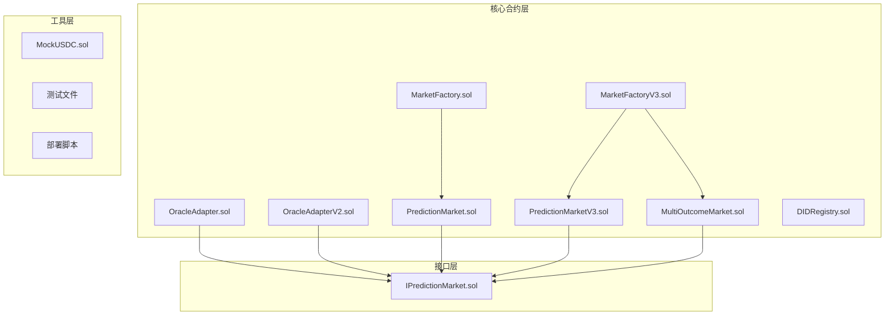

**图表来源**
- [MarketFactory.sol](file://contracts/MarketFactory.sol#L1-L60)
- [MarketFactoryV3.sol](file://contracts/MarketFactoryV3.sol#L1-L94)
- [PredictionMarket.sol](file://contracts/PredictionMarket.sol#L1-L134)
- [PredictionMarketV3.sol](file://contracts/PredictionMarketV3.sol#L1-L200)
- [MultiOutcomeMarket.sol](file://contracts/MultiOutcomeMarket.sol#L1-L113)
- [OracleAdapter.sol](file://contracts/OracleAdapter.sol#L1-L83)
- [OracleAdapterV2.sol](file://contracts/OracleAdapterV2.sol#L1-L83)
- [DIDRegistry.sol](file://contracts/DIDRegistry.sol#L1-L34)

**章节来源**
- [MarketFactory.sol](file://contracts/MarketFactory.sol#L1-L60)
- [MarketFactoryV3.sol](file://contracts/MarketFactoryV3.sol#L1-L94)
- [PredictionMarket.sol](file://contracts/PredictionMarket.sol#L1-L134)
- [PredictionMarketV3.sol](file://contracts/PredictionMarketV3.sol#L1-L200)
- [MultiOutcomeMarket.sol](file://contracts/MultiOutcomeMarket.sol#L1-L113)
- [OracleAdapter.sol](file://contracts/OracleAdapter.sol#L1-L83)
- [OracleAdapterV2.sol](file://contracts/OracleAdapterV2.sol#L1-L83)
- [DIDRegistry.sol](file://contracts/DIDRegistry.sol#L1-L34)

## 核心组件

### 工厂模式实现

系统实现了两代工厂模式，从简单的二元市场工厂到支持多结果市场的工厂V3。

**章节来源**
- [MarketFactory.sol](file://contracts/MarketFactory.sol#L8-L60)
- [MarketFactoryV3.sol](file://contracts/MarketFactoryV3.sol#L10-L94)

### 市场逻辑

系统支持两种市场类型：传统的二元预测市场和基于CPMM（常数乘法做市商）的V3市场，以及多结果市场。

**章节来源**
- [PredictionMarket.sol](file://contracts/PredictionMarket.sol#L7-L134)
- [PredictionMarketV3.sol](file://contracts/PredictionMarketV3.sol#L8-L200)
- [MultiOutcomeMarket.sol](file://contracts/MultiOutcomeMarket.sol#L8-L113)

### 预言机机制

提供两种预言机适配器：时间锁适配器和多重签名适配器，确保市场决议的安全性。

**章节来源**
- [OracleAdapter.sol](file://contracts/OracleAdapter.sol#L7-L83)
- [OracleAdapterV2.sol](file://contracts/OracleAdapterV2.sol#L7-L83)

### 身份绑定功能

DIDRegistry提供去标识化身份绑定服务，支持用户身份验证和授权。

**章节来源**
- [DIDRegistry.sol](file://contracts/DIDRegistry.sol#L8-L34)

## 架构概览

系统采用分层架构设计，各组件职责明确，耦合度低：

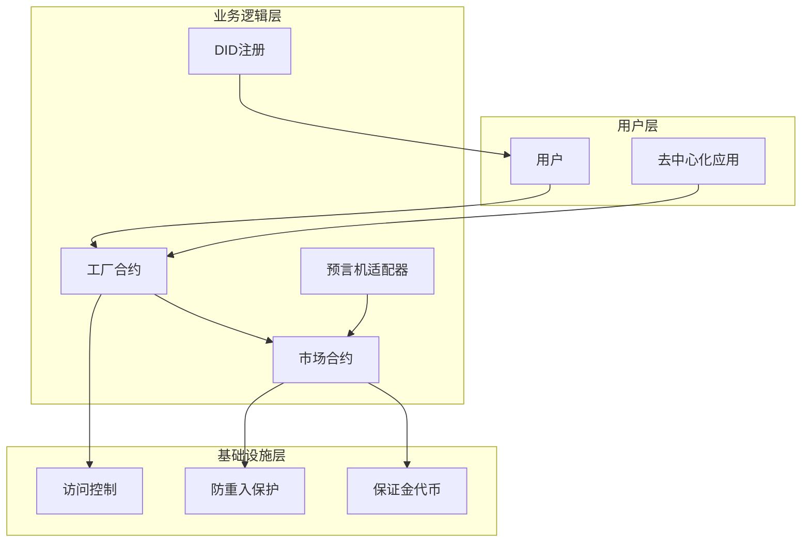

**图表来源**
- [MarketFactory.sol](file://contracts/MarketFactory.sol#L4-L6)
- [PredictionMarketV3.sol](file://contracts/PredictionMarketV3.sol#L4-L6)
- [OracleAdapter.sol](file://contracts/OracleAdapter.sol#L4-L5)
- [DIDRegistry.sol](file://contracts/DIDRegistry.sol#L4-L6)

## 详细组件分析

### MarketFactory 合约分析

MarketFactory是第一代工厂合约，专门用于创建二元预测市场。

#### 核心功能

- **市场创建**：创建新的二元预测市场实例
- **所有权管理**：基于Ownable的访问控制
- **事件记录**：记录市场创建过程

#### 主要函数

| 函数名 | 参数 | 返回值 | 权限 | 功能描述 |
|--------|------|--------|------|----------|
| `setOracle` | `_oracle: address` | `void` | `onlyOwner` | 设置预言机地址 |
| `createMarket` | `matchRef, question, endTime` | `(address, uint256)` | `onlyOwner` | 创建新市场 |
| `version` | `()` | `string` | `public` | 返回版本信息 |

#### 访问控制机制

- 使用OpenZeppelin的Ownable实现单一所有者控制
- 所有关键操作都需要所有者权限

**章节来源**
- [MarketFactory.sol](file://contracts/MarketFactory.sol#L32-L58)

### MarketFactoryV3 合约分析

MarketFactoryV3是第二代工厂合约，支持二元市场和多结果市场。

#### 核心功能

- **双模式支持**：同时支持二元和多结果市场
- **暂停机制**：基于Pausable的紧急暂停功能
- **默认配置**：提供默认费用和最大投注额设置

#### 主要函数

| 函数名 | 参数 | 返回值 | 权限 | 功能描述 |
|--------|------|--------|------|----------|
| `pause` | `()` | `void` | `onlyOwner` | 暂停所有操作 |
| `unpause` | `()` | `void` | `onlyOwner` | 恢复操作 |
| `createBinaryMarket` | `matchRef, question, endTime, initialLiquidity` | `(address, uint256)` | `onlyOwner whenNotPaused` | 创建二元市场 |
| `createMultiMarket` | `matchRef, question, endTime, outcomeCount` | `(address, uint256)` | `onlyOwner whenNotPaused` | 创建多结果市场 |

#### 市场类型映射

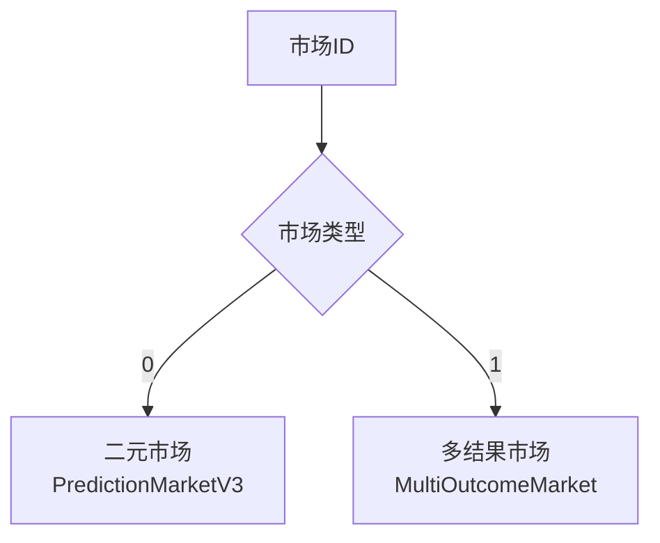

**图表来源**
- [MarketFactoryV3.sol](file://contracts/MarketFactoryV3.sol#L19-L88)

**章节来源**
- [MarketFactoryV3.sol](file://contracts/MarketFactoryV3.sol#L10-L94)

### PredictionMarket 合约分析

PredictionMarket是第一代二元预测市场合约，采用传统帕拉穆特尔模型。

#### 核心数据结构

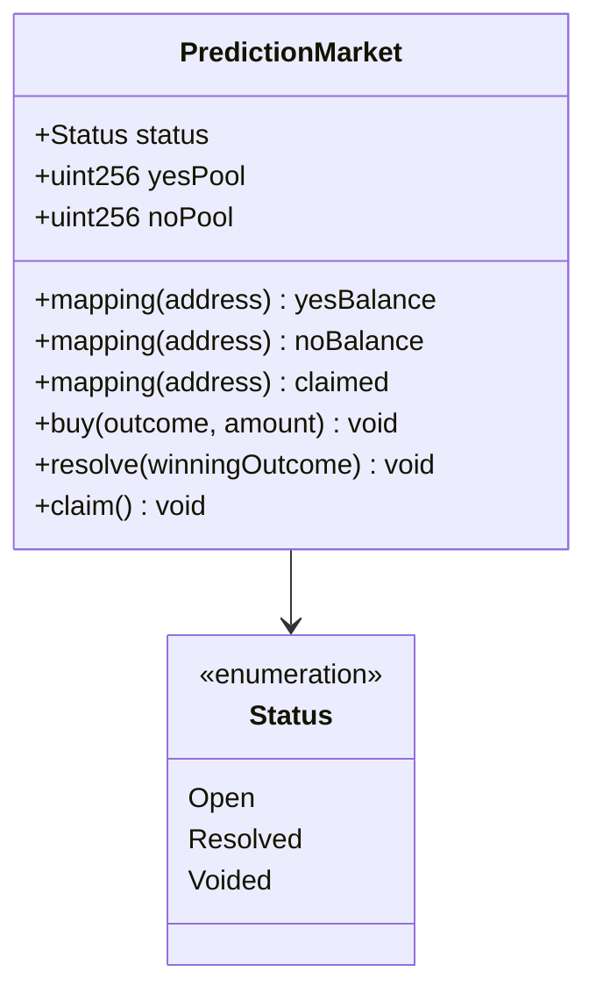

**图表来源**
- [PredictionMarket.sol](file://contracts/PredictionMarket.sol#L11-L37)

#### 核心算法

**派彩计算公式**：
```
派彩金额 = 投注金额 × 总池子 / 赢方池子
```

#### 主要函数

| 函数名 | 参数 | 返回值 | 权限 | 功能描述 |
|--------|------|--------|------|----------|
| `buy` | `outcome, amount` | `void` | `public` | 购买市场头寸 |
| `resolve` | `_winningOutcome` | `void` | `onlyOracle` | 决定市场结果 |
| `voidMarket` | `()` | `void` | `onlyOracle` | 取消市场并退款 |
| `claim` | `()` | `void` | `public` | 提取派彩或退款 |

**章节来源**
- [PredictionMarket.sol](file://contracts/PredictionMarket.sol#L64-L134)

### PredictionMarketV3 合约分析

PredictionMarketV3是第二代二元预测市场合约，采用CPMM模型和流动性提供机制。

#### 核心特性

- **CPMM模型**：使用恒定乘法做市商算法
- **流动性挖矿**：支持LP提供流动性
- **费用机制**：可配置的交易费用
- **防重入保护**：使用ReentrancyGuard

#### 核心算法

**CPMM交换公式**：
```
输出份额 = (输入金额 × 源储备) / (目标储备 + 输入金额)
```

#### 主要函数

| 函数名 | 参数 | 返回值 | 权限 | 功能描述 |
|--------|------|--------|------|----------|
| `buy` | `outcome, amountIn` | `void` | `nonReentrant` | 购买市场头寸 |
| `addLiquidity` | `amount` | `void` | `nonReentrant` | 添加流动性 |
| `removeLiquidity` | `lpAmount` | `void` | `nonReentrant` | 移除流动性 |
| `seedReserves` | `perSide, lpRecipient` | `void` | `external` | 种子资金池 |

#### 流动性挖矿流程

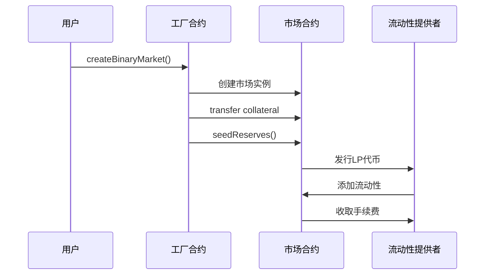

**图表来源**
- [MarketFactoryV3.sol](file://contracts/MarketFactoryV3.sol#L46-L65)
- [PredictionMarketV3.sol](file://contracts/PredictionMarketV3.sol#L76-L90)

**章节来源**
- [PredictionMarketV3.sol](file://contracts/PredictionMarketV3.sol#L8-L200)

### MultiOutcomeMarket 合约分析

MultiOutcomeMarket支持2-8个结果的预测市场。

#### 核心功能

- **多结果支持**：支持2到8个不同结果
- **帕拉穆特尔模型**：与传统市场相同的派彩机制
- **费用分离**：每笔交易收取固定费用

#### 数据结构

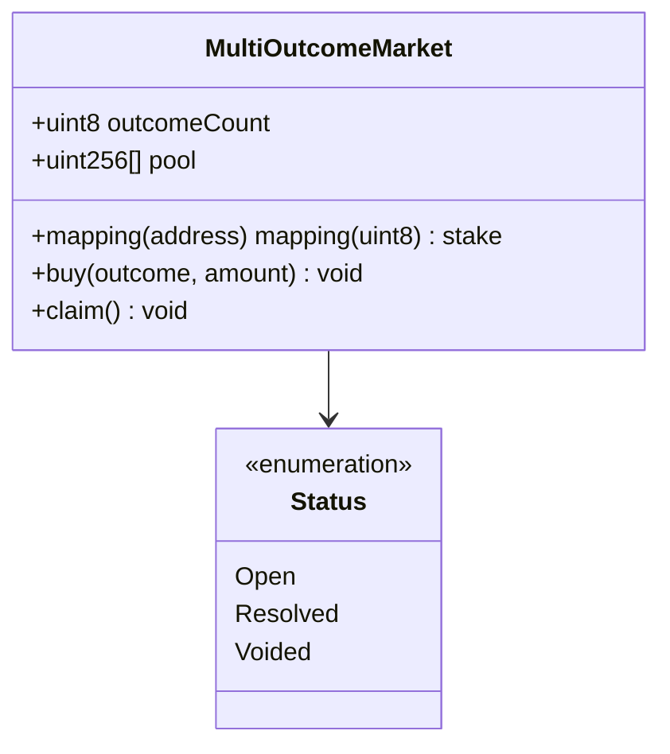

**图表来源**
- [MultiOutcomeMarket.sol](file://contracts/MultiOutcomeMarket.sol#L12-L27)

#### 主要函数

| 函数名 | 参数 | 返回值 | 权限 | 功能描述 |
|--------|------|--------|------|----------|
| `buy` | `outcome, amount` | `void` | `nonReentrant` | 购买特定结果头寸 |
| `claim` | `()` | `void` | `nonReentrant` | 提取派彩或退款 |
| `resolve` | `_outcome` | `void` | `onlyOracle` | 决定市场结果 |

**章节来源**
- [MultiOutcomeMarket.sol](file://contracts/MultiOutcomeMarket.sol#L65-L113)

### OracleAdapter 合约分析

OracleAdapter提供时间锁机制的预言机适配器。

#### 核心机制

- **时间锁**：防止即时市场决议
- **角色管理**：基于AccessControl的角色控制
- **快速通道**：当时间锁为0时的直接执行

#### 主要函数

| 函数名 | 参数 | 返回值 | 权限 | 功能描述 |
|--------|------|--------|------|----------|
| `requestResolve` | `market, outcome` | `void` | `onlyRole(ORACLE_ROLE)` | 请求市场决议 |
| `confirmResolve` | `market` | `void` | `onlyRole(ORACLE_ROLE)` | 确认市场决议 |
| `resolveNow` | `market, outcome` | `void` | `onlyRole(ORACLE_ROLE)` | 立即执行决议 |
| `voidMarket` | `market` | `void` | `onlyRole(ORACLE_ROLE)` | 取消市场 |

#### 时间锁流程

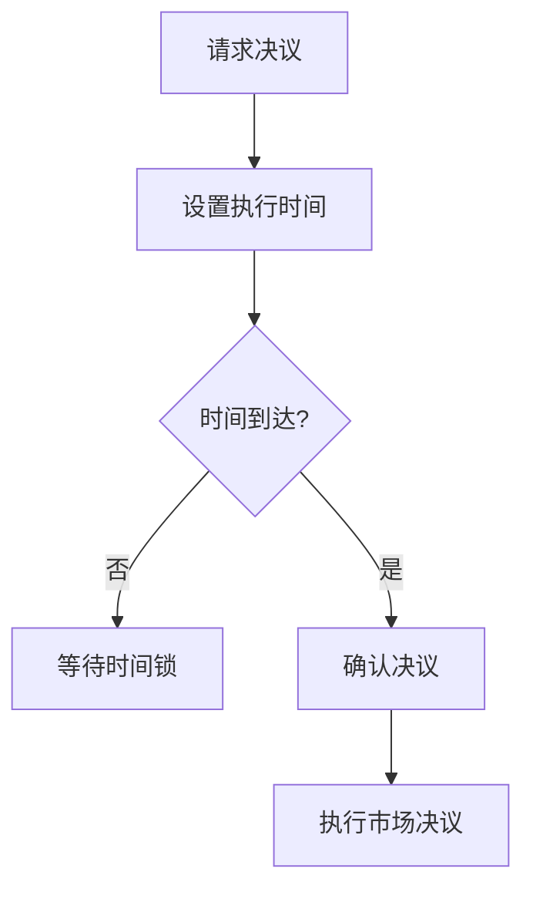

**图表来源**
- [OracleAdapter.sol](file://contracts/OracleAdapter.sol#L48-L67)

**章节来源**
- [OracleAdapter.sol](file://contracts/OracleAdapter.sol#L7-L83)

### OracleAdapterV2 合约分析

OracleAdapterV2提供多重签名机制的预言机适配器。

#### 核心机制

- **多重签名**：需要m个签名中的n个批准
- **提案系统**：支持提案创建和批准流程
- **阈值控制**：可配置的批准阈值

#### 主要函数

| 函数名 | 参数 | 返回值 | 权限 | 功能描述 |
|--------|------|--------|------|----------|
| `proposeResolve` | `market, outcome` | `uint256` | `onlyRole(ORACLE_ROLE)` | 创建决议提案 |
| `approveResolve` | `id` | `void` | `onlyRole(ORACLE_ROLE)` | 批准提案 |
| `voidMarket` | `market` | `void` | `onlyRole(ORACLE_ROLE)` | 取消市场 |

#### 多重签名流程

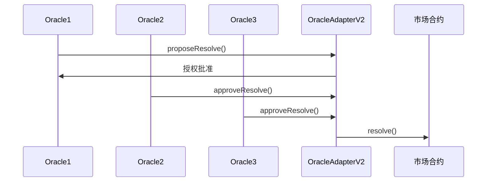

**图表来源**
- [OracleAdapterV2.sol](file://contracts/OracleAdapterV2.sol#L44-L75)

**章节来源**
- [OracleAdapterV2.sol](file://contracts/OracleAdapterV2.sol#L7-L83)

### DIDRegistry 合约分析

DIDRegistry提供去标识化身份绑定服务。

#### 核心功能

- **身份绑定**：将用户地址绑定到DID哈希
- **签名验证**：使用ECDSA验证绑定请求
- **身份解析**：提供DID哈希查询功能

#### 主要函数

| 函数名 | 参数 | 返回值 | 权限 | 功能描述 |
|--------|------|--------|------|----------|
| `bindDid` | `didHash, signature` | `void` | `public` | 绑定DID到用户地址 |
| `resolveDid` | `account` | `bytes32` | `public view` | 查询用户DID哈希 |

#### 身份绑定流程

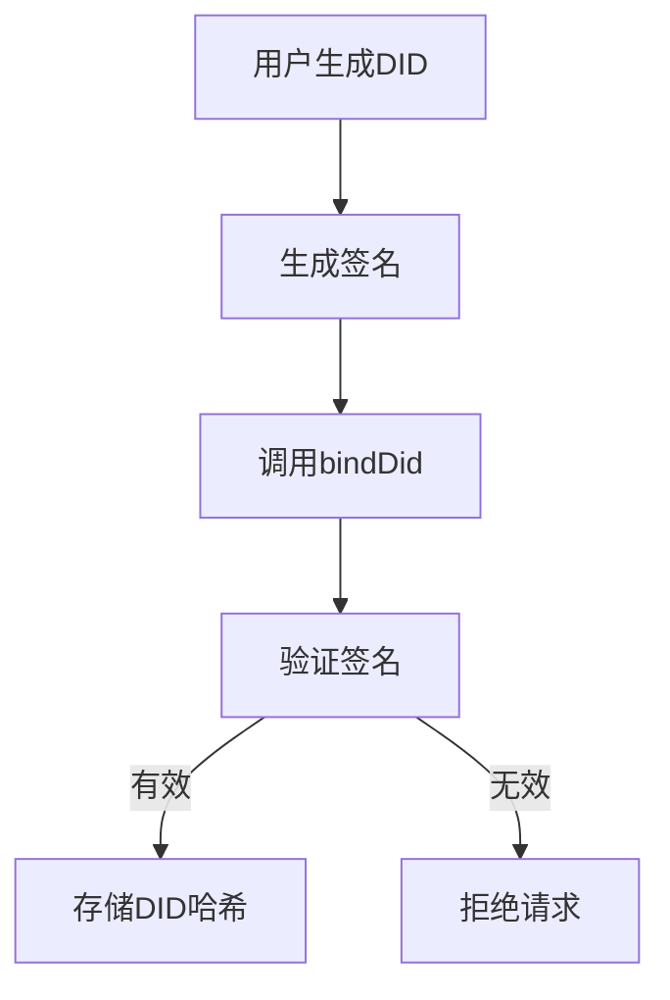

**图表来源**
- [DIDRegistry.sol](file://contracts/DIDRegistry.sol#L19-L28)

**章节来源**
- [DIDRegistry.sol](file://contracts/DIDRegistry.sol#L8-L34)

## 依赖关系分析

系统合约间存在清晰的依赖关系：

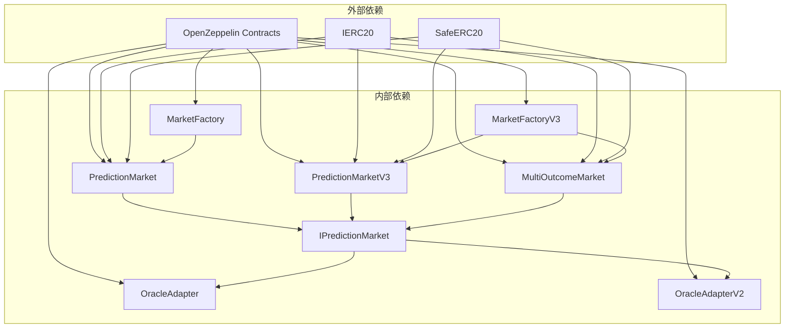

**图表来源**
- [MarketFactory.sol](file://contracts/MarketFactory.sol#L4-L6)
- [PredictionMarketV3.sol](file://contracts/PredictionMarketV3.sol#L4-L6)
- [OracleAdapter.sol](file://contracts/OracleAdapter.sol#L4-L5)
- [IPredictionMarket.sol](file://contracts/interfaces/IPredictionMarket.sol#L4-L8)

### 访问控制机制

系统采用多层次的访问控制机制：

1. **基础访问控制**：Ownable（单一所有者）
2. **角色访问控制**：AccessControl（多角色）
3. **合约内修饰符**：onlyOracle等专用权限

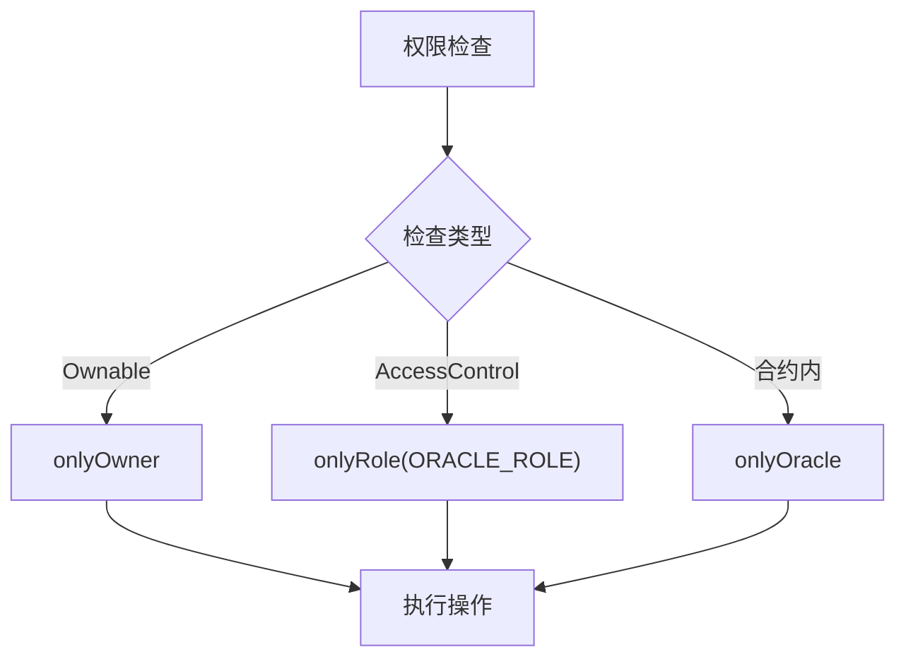

**图表来源**
- [MarketFactory.sol](file://contracts/MarketFactory.sol#L39-L42)
- [OracleAdapter.sol](file://contracts/OracleAdapter.sol#L44-L46)
- [PredictionMarket.sol](file://contracts/PredictionMarket.sol#L39-L42)

**章节来源**
- [MarketFactory.sol](file://contracts/MarketFactory.sol#L39-L42)
- [OracleAdapter.sol](file://contracts/OracleAdapter.sol#L44-L46)
- [PredictionMarket.sol](file://contracts/PredictionMarket.sol#L39-L42)

## 性能考虑

### Gas优化策略

1. **状态变量压缩**：合理使用uint8、uint16等小整数类型
2. **批量操作**：在可能的情况下合并状态更新
3. **循环优化**：避免不必要的数组遍历

### 安全考虑

1. **防重入保护**：所有外部调用都使用nonReentrant修饰符
2. **输入验证**：严格的参数验证和边界检查
3. **权限控制**：最小权限原则的应用

## 故障排除指南

### 常见错误及解决方案

| 错误类型 | 触发条件 | 解决方案 |
|----------|----------|----------|
| `not open` | 市场已关闭或已决议 | 检查市场状态和时间戳 |
| `invalid outcome` | 结果编号超出范围 | 验证结果编号在有效范围内 |
| `zero amount` | 投注金额为0 | 确保投注金额大于0 |
| `timelock` | 时间锁未到期 | 等待时间锁结束或调整时间锁设置 |
| `already claimed` | 已经提取过派彩 | 检查claim状态映射 |

### 调试建议

1. **状态检查**：使用`status()`函数检查市场当前状态
2. **余额查询**：使用`balanceOf()`查询用户余额
3. **事件监控**：监听相关事件了解操作历史

**章节来源**
- [PredictionMarket.sol](file://contracts/PredictionMarket.sol#L64-L113)
- [OracleAdapter.test.js](file://test/OracleAdapter.test.js#L20-L25)

## 结论

PredictionDIDSimple核心合约模块展现了现代DeFi协议的设计理念，通过工厂模式实现了灵活的市场创建机制，通过CPMM模型提供了高效的流动性挖矿功能，通过多重预言机适配器确保了市场决议的安全性。系统的模块化设计使得各组件职责明确，易于维护和扩展。

未来可以考虑的改进方向：
1. **Gas优化**：进一步优化常用操作的Gas消耗
2. **功能扩展**：支持更多类型的预测市场
3. **安全性增强**：引入更高级的安全审计机制
4. **用户体验**：提供更友好的前端交互界面