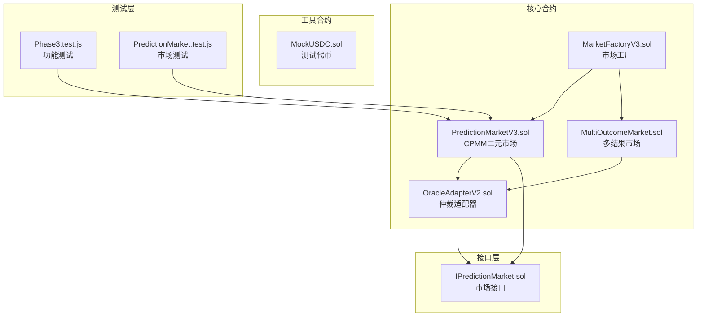
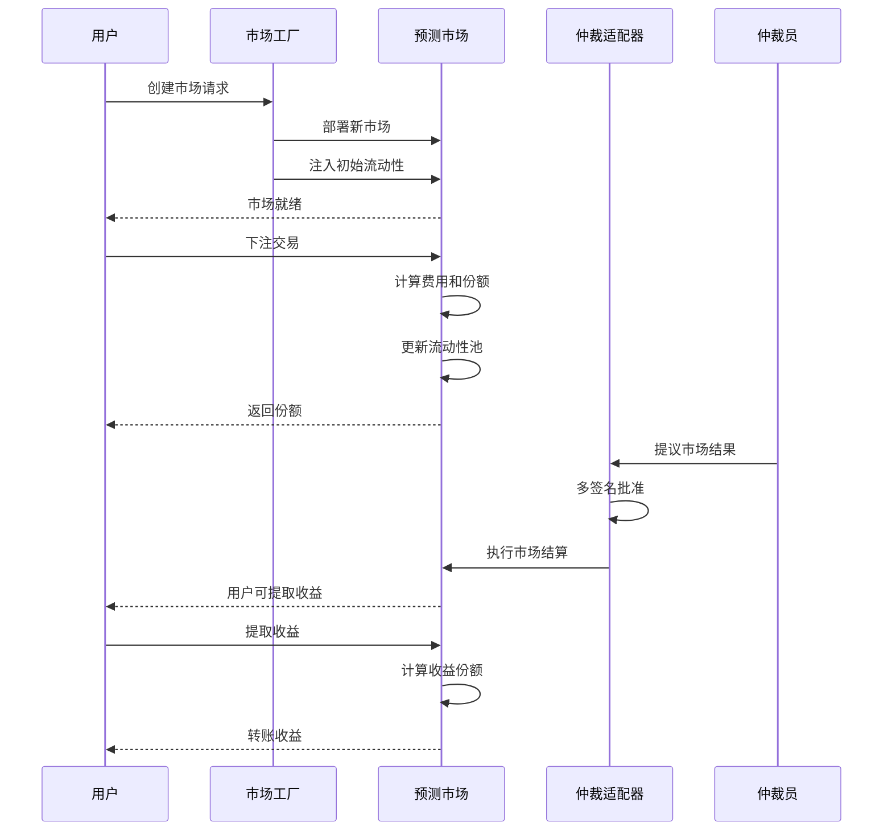
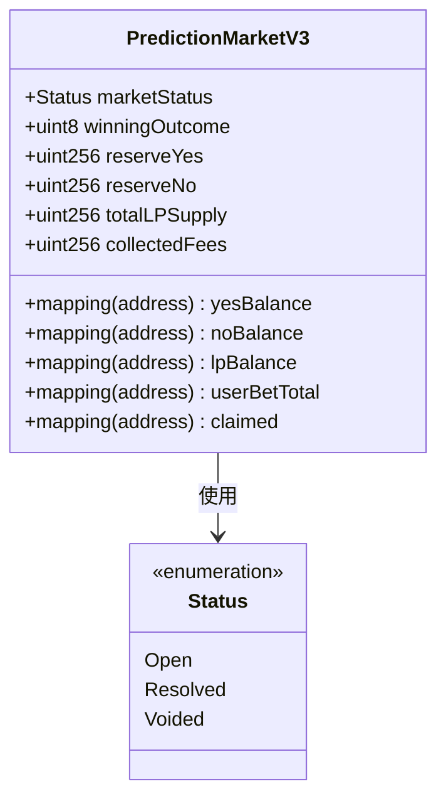
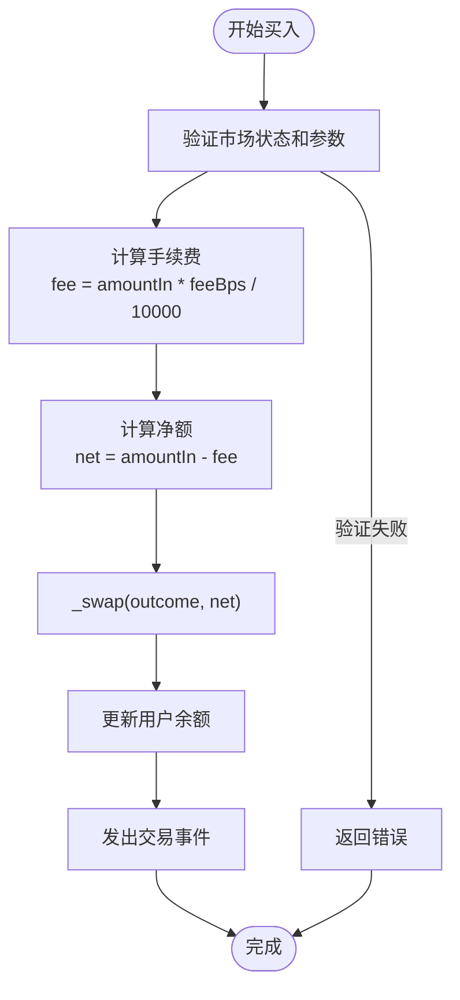
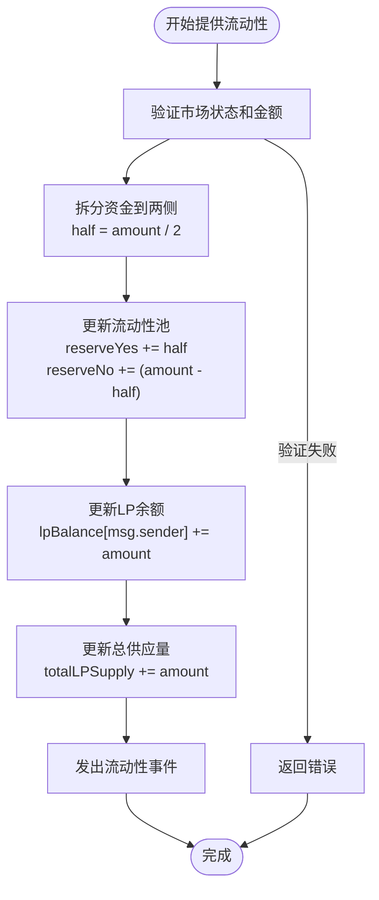
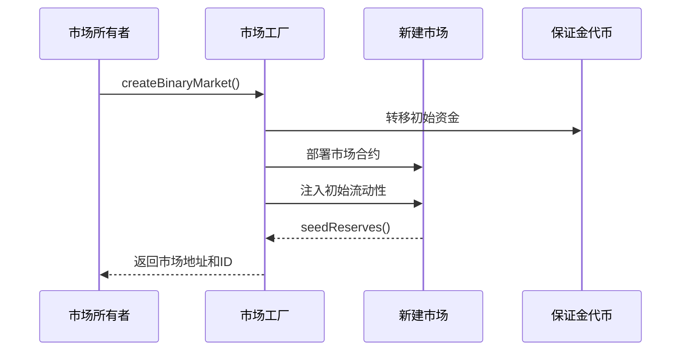
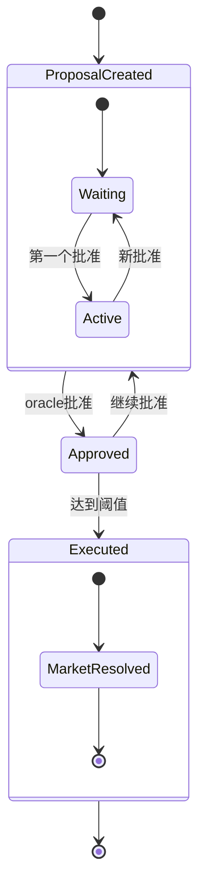
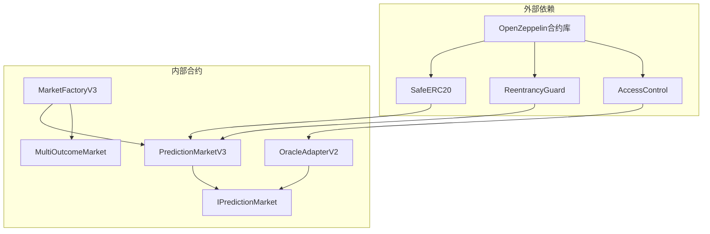

# CPMM预测市场

<cite>
**本文档引用的文件**
- [PredictionMarketV3.sol](file://contracts/PredictionMarketV3.sol)
- [MarketFactoryV3.sol](file://contracts/MarketFactoryV3.sol)
- [MultiOutcomeMarket.sol](file://contracts/MultiOutcomeMarket.sol)
- [OracleAdapterV2.sol](file://contracts/OracleAdapterV2.sol)
- [IPredictionMarket.sol](file://contracts/interfaces/IPredictionMarket.sol)
- [MockUSDC.sol](file://contracts/MockUSDC.sol)
- [Phase3.test.js](file://test/Phase3.test.js)
- [PredictionMarket.test.js](file://test/PredictionMarket.test.js)
- [deploy.js](file://scripts/deploy.js)
</cite>

## 目录
1. [简介](#简介)
2. [项目结构](#项目结构)
3. [核心组件](#核心组件)
4. [架构概览](#架构概览)
5. [详细组件分析](#详细组件分析)
6. [依赖关系分析](#依赖关系分析)
7. [性能考虑](#性能考虑)
8. [故障排除指南](#故障排除指南)
9. [结论](#结论)
10. [附录](#附录)

## 简介

CPMM预测市场是一个基于常数乘积做市商（Constant Product Market Maker, CPMM）模型的去中心化预测市场系统。该系统实现了二元预测市场的自动做市机制，通过流动性池提供价格发现功能，并允许用户进行流动性提供和交易。

### 主要特性
- **常数乘积做市商模型**：基于数学公式确保市场流动性
- **流动性池管理**：支持流动性提供者添加和移除流动性
- **费用结构**：采用百分比手续费模式
- **多签名仲裁**：通过OracleAdapterV2实现多重签名决议
- **风险控制**：包含重入保护、时间限制等安全机制

## 项目结构

该项目采用模块化设计，主要包含以下核心模块：

**图表来源**
- [PredictionMarketV3.sol](file://contracts/PredictionMarketV3.sol#L1-L200)
- [MarketFactoryV3.sol](file://contracts/MarketFactoryV3.sol#L1-L94)
- [MultiOutcomeMarket.sol](file://contracts/MultiOutcomeMarket.sol#L1-L113)
- [OracleAdapterV2.sol](file://contracts/OracleAdapterV2.sol#L1-L83)

**章节来源**
- [PredictionMarketV3.sol](file://contracts/PredictionMarketV3.sol#L1-L200)
- [MarketFactoryV3.sol](file://contracts/MarketFactoryV3.sol#L1-L94)

## 核心组件

### 市场状态管理
系统定义了三种市场状态：
- **Open（开放）**：市场正常运营，允许交易和流动性操作
- **Resolved（已解决）**：市场已根据仲裁结果结算
- **Voided（无效）**：市场被仲裁员宣布无效

### 流动性池结构
每个市场维护两个独立的流动性池：
- **reserveYes**：支持"是"结果的流动性池
- **reserveNo**：支持"否"结果的流动性池
- **totalLPSupply**：总流动性供应量

### 用户余额管理
系统跟踪以下用户状态：
- **yesBalance**：用户持有的"是"份额
- **noBalance**：用户持有的"否"份额
- **lpBalance**：用户的流动性份额
- **userBetTotal**：用户的累计投注总额

**章节来源**
- [PredictionMarketV3.sol](file://contracts/PredictionMarketV3.sol#L12-L35)

## 架构概览

**图表来源**
- [MarketFactoryV3.sol](file://contracts/MarketFactoryV3.sol#L37-L66)
- [PredictionMarketV3.sol](file://contracts/PredictionMarketV3.sol#L92-L165)
- [OracleAdapterV2.sol](file://contracts/OracleAdapterV2.sol#L44-L75)

## 详细组件分析

### PredictionMarketV3 合约分析

#### 数据结构设计

**图表来源**
- [PredictionMarketV3.sol](file://contracts/PredictionMarketV3.sol#L12-L35)

#### 核心交易流程

##### 买入操作流程

**图表来源**
- [PredictionMarketV3.sol](file://contracts/PredictionMarketV3.sol#L92-L111)
- [PredictionMarketV3.sol](file://contracts/PredictionMarketV3.sol#L178-L188)

##### 流动性提供流程

**图表来源**
- [PredictionMarketV3.sol](file://contracts/PredictionMarketV3.sol#L113-L123)

#### 价格计算机制

CPMM模型使用常数乘积公式：`x * y = k`

对于二元市场，价格计算基于以下公式：
- **Yes价格**：`P_yes = reserveNo / (reserveYes + reserveNo)`
- **No价格**：`P_no = reserveYes / (reserveYes + reserveNo)`
- **价格精度**：以千分之五（bps）表示，便于UI显示

**章节来源**
- [PredictionMarketV3.sol](file://contracts/PredictionMarketV3.sol#L171-L176)

### MarketFactoryV3 工厂模式

#### 市场创建流程

**图表来源**
- [MarketFactoryV3.sol](file://contracts/MarketFactoryV3.sol#L37-L66)

**章节来源**
- [MarketFactoryV3.sol](file://contracts/MarketFactoryV3.sol#L37-L66)

### MultiOutcomeMarket 对比分析

#### Parimutuel模型特点

| 特性 | CPMM模型 | Parimutuel模型 |
|------|----------|----------------|
| **资金池** | 分离的Yes/No池 | 统一的投注池 |
| **价格发现** | 通过常数乘积公式 | 通过总投注额比例 |
| **流动性** | 持续可用 | 仅在开放期间有效 |
| **收益分配** | 按份额比例分配 | 按胜出池比例分配 |
| **费用处理** | 立即计入池中 | 从总池中扣除 |

**章节来源**
- [MultiOutcomeMarket.sol](file://contracts/MultiOutcomeMarket.sol#L8-L113)

### OracleAdapterV2 仲裁机制

#### 多签名决议流程

**图表来源**
- [OracleAdapterV2.sol](file://contracts/OracleAdapterV2.sol#L14-L27)
- [OracleAdapterV2.sol](file://contracts/OracleAdapterV2.sol#L57-L75)

**章节来源**
- [OracleAdapterV2.sol](file://contracts/OracleAdapterV2.sol#L44-L81)

## 依赖关系分析

**图表来源**
- [PredictionMarketV3.sol](file://contracts/PredictionMarketV3.sol#L4-L6)
- [OracleAdapterV2.sol](file://contracts/OracleAdapterV2.sol#L4-L5)

**章节来源**
- [PredictionMarketV3.sol](file://contracts/PredictionMarketV3.sol#L4-L6)
- [OracleAdapterV2.sol](file://contracts/OracleAdapterV2.sol#L4-L5)

## 性能考虑

### Gas优化策略

1. **批量操作优化**
   - 合并状态更新操作
   - 减少存储槽访问次数
   - 使用本地变量缓存状态

2. **条件检查优化**
   - 在函数开始处进行快速失败检查
   - 避免重复的数值验证
   - 使用位运算优化除法操作

3. **内存管理**
   - 最小化数组分配
   - 避免不必要的字符串操作
   - 使用静态长度数组

### 安全机制

1. **重入保护**
   - 使用ReentrancyGuard修饰器
   - 防止递归调用攻击

2. **权限控制**
   - 仅授权的仲裁员可以结算市场
   - 工厂合约可以播种流动性

3. **输入验证**
   - 严格的参数范围检查
   - 时间戳和状态验证

## 故障排除指南

### 常见问题及解决方案

#### 交易失败
**问题**：用户无法进行交易
**可能原因**：
- 市场未开放或已结束
- 投注超过用户上限
- 合约余额不足

**解决方案**：
- 检查市场状态和时间限制
- 验证用户余额和限额设置
- 确认合约有足够的流动性

#### 流动性提供失败
**问题**：流动性提供操作失败
**可能原因**：
- 市场状态不正确
- 金额为零或负数
- 合约资金不足

**解决方案**：
- 确保市场处于Open状态
- 验证输入金额的有效性
- 检查合约的代币余额

#### 收益提取问题
**问题**：用户无法提取收益
**可能原因**：
- 市场尚未结算
- 用户已提取过收益
- 市场状态不正确

**解决方案**：
- 等待仲裁员结算市场
- 检查用户是否已标记为已提取
- 验证市场状态为Resolved或Voided

**章节来源**
- [PredictionMarketV3.sol](file://contracts/PredictionMarketV3.sol#L92-L165)

## 结论

CPMM预测市场系统通过常数乘积做市商模型提供了高效的去中心化预测市场解决方案。相比传统的Parimutuel模型，CPMM具有以下优势：

1. **持续流动性**：流动性池提供24/7的市场流动性
2. **价格发现**：基于供需关系的动态价格形成机制
3. **用户体验**：即时交易和流动性提供，无需等待结算
4. **收益分配**：明确的LP份额和交易费用分配机制

系统的安全性通过多重机制保障：
- 多签名仲裁确保结果可信
- 重入保护防止恶意攻击
- 权限控制确保操作安全
- 输入验证防止数据污染

## 附录

### 函数接口文档

#### 核心交易函数

| 函数名 | 参数 | 返回值 | 描述 |
|--------|------|--------|------|
| `buy(uint8 outcome, uint256 amountIn)` | outcome: 0或1 amountIn: 投注金额 | sharesOut: 获得份额 | 下注购买预测份额 |
| `addLiquidity(uint256 amount)` | amount: 流动性金额 | 无 | 添加流动性提供份额 |
| `removeLiquidity(uint256 lpAmount)` | lpAmount: 移除份额 | 无 | 移除流动性并提取资金 |
| `claim()` | 无 | 无 | 提取已结算的收益 |

#### 市场管理函数

| 函数名 | 参数 | 返回值 | 描述 |
|--------|------|--------|------|
| `resolve(uint8 outcome)` | outcome: 胜出结果 | 无 | 仲裁员结算市场 |
| `voidMarket()` | 无 | 无 | 仲裁员宣布市场无效 |
| `status()` | 无 | uint8: 市场状态 | 查询当前市场状态 |

#### 查询函数

| 函数名 | 参数 | 返回值 | 描述 |
|--------|------|--------|------|
| `getPoolState()` | 无 | (uint256 yesR, uint256 noR, uint256 priceYesBps) | 获取流动性池状态 |
| `reserveYes()` | 无 | uint256: Yes池余额 | 查询Yes池余额 |
| `reserveNo()` | 无 | uint256: No池余额 | 查询No池余额 |

### 实际计算示例

#### 示例场景：流动性提供
假设市场初始状态：
- reserveYes = 1000 USDC
- reserveNo = 1000 USDC
- totalLPSupply = 2000 LP

用户添加流动性100 USDC：
1. 拆分资金：50 USDC到Yes池，50 USDC到No池
2. 更新池余额：Yes池=1050，No池=1050
3. 发行LP份额：100 LP
4. 更新总供应量：totalLPSupply = 2100

#### 示例场景：购买份额
用户购买Yes份额100 USDC：
1. 计算手续费：100 * 0.1% = 0.1 USDC
2. 净额：99.9 USDC
3. 计算份额：99.9 * 1000 / (1000 + 99.9) ≈ 90.9份额
4. 更新池余额：Yes池=909.1，No池=1099.9
5. 更新用户余额：yesBalance增加90.9份额

### 业务场景演示

#### 场景1：价格波动影响
当大量资金流入Yes池时：
- Yes池增加，No池相对减少
- Yes价格上升，No价格下降
- 价格向50%均衡点回归

#### 场景2：流动性挖矿
流动性提供者通过：
- 提供平衡的资金分配
- 承担价格波动风险
- 获得交易费用分成
- 参与市场治理

#### 场景3：风险控制
系统内置风险控制机制：
- 最大单用户投注限制
- 市场结束时间控制
- 多签名仲裁机制
- 重入保护安全措施

**章节来源**
- [Phase3.test.js](file://test/Phase3.test.js#L6-L27)
- [PredictionMarket.test.js](file://test/PredictionMarket.test.js#L34-L50)