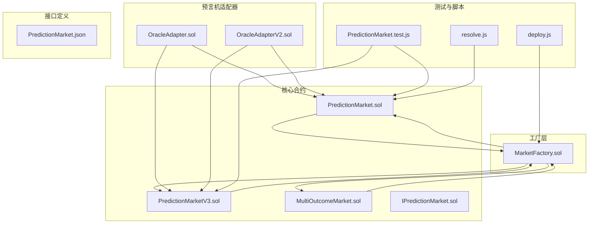
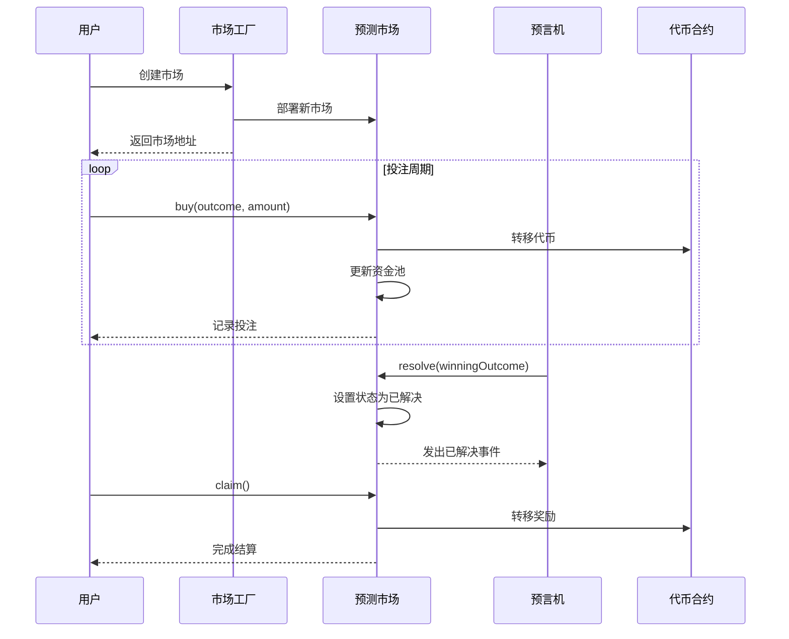
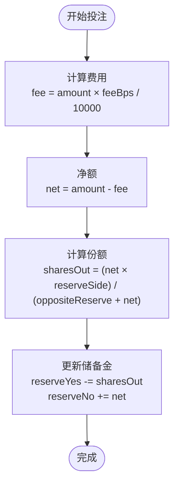
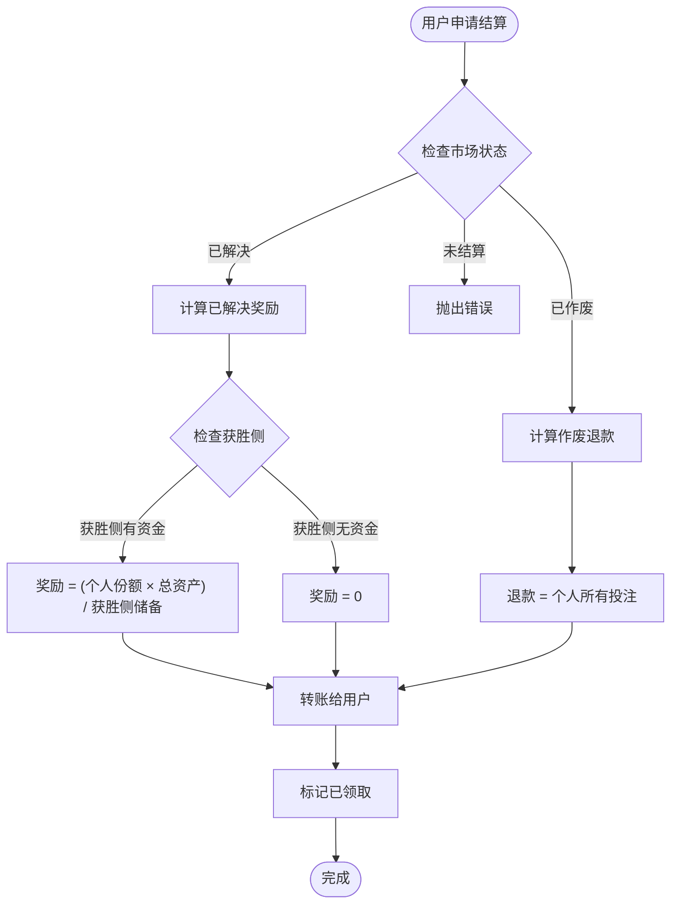
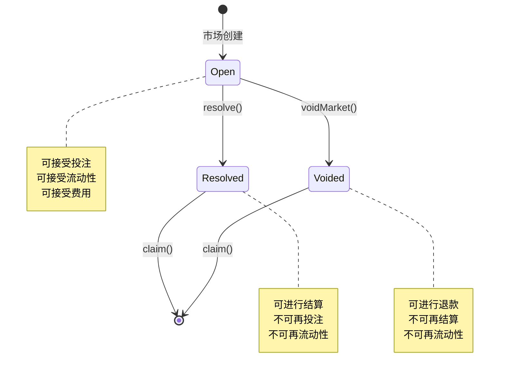
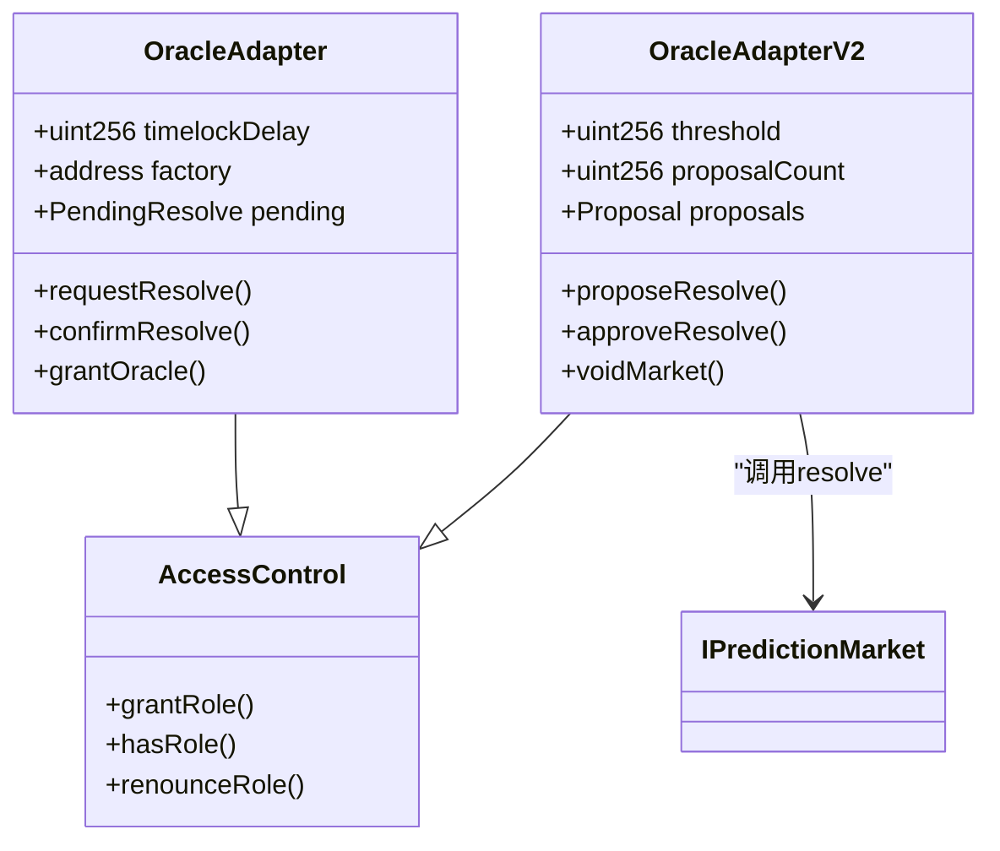
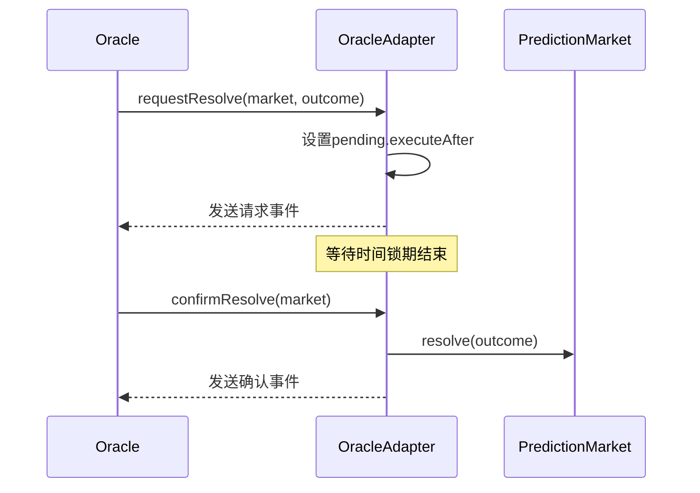
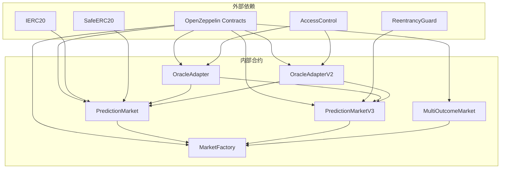

# 二元预测市场

<cite>
**本文档引用的文件**
- [PredictionMarket.sol](file://contracts/PredictionMarket.sol)
- [PredictionMarketV3.sol](file://contracts/PredictionMarketV3.sol)
- [IPredictionMarket.sol](file://contracts/interfaces/IPredictionMarket.sol)
- [MarketFactory.sol](file://contracts/MarketFactory.sol)
- [MultiOutcomeMarket.sol](file://contracts/MultiOutcomeMarket.sol)
- [OracleAdapter.sol](file://contracts/OracleAdapter.sol)
- [OracleAdapterV2.sol](file://contracts/OracleAdapterV2.sol)
- [PredictionMarket.test.js](file://test/PredictionMarket.test.js)
- [deploy.js](file://scripts/deploy.js)
- [resolve.js](file://scripts/resolve.js)
- [PredictionMarket.json](file://artifacts/contracts/PredictionMarket.sol/PredictionMarket.json)
</cite>

## 目录
1. [简介](#简介)
2. [项目结构](#项目结构)
3. [核心组件](#核心组件)
4. [架构概览](#架构概览)
5. [详细组件分析](#详细组件分析)
6. [依赖关系分析](#依赖关系分析)
7. [性能考虑](#性能考虑)
8. [故障排除指南](#故障排除指南)
9. [结论](#结论)
10. [附录](#附录)

## 简介

这是一个基于以太坊的二元预测市场系统，实现了Parimutuel（共担赔付）机制。该系统允许用户对二元事件（是/否）进行投注，通过资金池共享的方式实现风险共担和收益分配。

系统的核心特性包括：
- Parimutuel共同赔付机制
- 时间锁定的结算流程
- 多层次权限控制系统
- 安全的重入保护
- 支持市场创建、投注、结算和退款

## 项目结构



**图表来源**
- [MarketFactory.sol](file://contracts/MarketFactory.sol#L1-L60)
- [PredictionMarket.sol](file://contracts/PredictionMarket.sol#L1-L134)
- [PredictionMarketV3.sol](file://contracts/PredictionMarketV3.sol#L1-L200)

**章节来源**
- [MarketFactory.sol](file://contracts/MarketFactory.sol#L1-L60)
- [PredictionMarket.sol](file://contracts/PredictionMarket.sol#L1-L134)
- [PredictionMarketV3.sol](file://contracts/PredictionMarketV3.sol#L1-L200)

## 核心组件

### 预测市场合约

系统提供了两个版本的二元预测市场合约：

#### PredictionMarket（基础版本）
- 实现了最简化的Parimutuel机制
- 直接的资金池管理（yesPool/noPool）
- 基础的权限控制
- 无费用机制

#### PredictionMarketV3（增强版本）
- 实现了CPMM（常数乘积做市商）模型
- 内置流动性池（reserveYes/reserveNo）
- 费用收集机制（feeBps）
- 用户投注上限控制（maxBetPerUser）
- 更完善的LP（流动性提供者）支持

### 工厂模式

MarketFactory负责：
- 创建新的预测市场实例
- 维护市场列表
- 设置Oracle地址
- 管理市场计数

### 预言机适配器

提供多种权限控制方案：
- OracleAdapter：单Oracle授权，带时间锁
- OracleAdapterV2：多签授权（m-of-n）

**章节来源**
- [PredictionMarket.sol](file://contracts/PredictionMarket.sol#L7-L134)
- [PredictionMarketV3.sol](file://contracts/PredictionMarketV3.sol#L8-L200)
- [MarketFactory.sol](file://contracts/MarketFactory.sol#L8-L60)
- [OracleAdapter.sol](file://contracts/OracleAdapter.sol#L7-L44)
- [OracleAdapterV2.sol](file://contracts/OracleAdapterV2.sol#L7-L83)

## 架构概览



**图表来源**
- [MarketFactory.sol](file://contracts/MarketFactory.sol#L37-L54)
- [PredictionMarket.sol](file://contracts/PredictionMarket.sol#L64-L113)
- [OracleAdapter.sol](file://contracts/OracleAdapter.sol#L22-L28)

## 详细组件分析

### Parimutuel共同赔付机制

#### 基础版本计算公式

在PredictionMarket中，获胜者的奖励计算采用以下公式：

```
获胜者奖励 = (个人投注额 × 总资金池) / 获胜侧总资金
```

其中：
- 个人投注额：用户在获胜侧的投注金额
- 总资金池：yesPool + noPool
- 获胜侧总资金：获胜侧的资金池总额

#### 增强版本计算公式

在PredictionMarketV3中，采用CPMM模型：



**图表来源**
- [PredictionMarketV3.sol](file://contracts/PredictionMarketV3.sol#L178-L188)

#### 结算算法



**图表来源**
- [PredictionMarket.sol](file://contracts/PredictionMarket.sol#L97-L113)
- [PredictionMarketV3.sol](file://contracts/PredictionMarketV3.sol#L151-L165)

**章节来源**
- [PredictionMarket.sol](file://contracts/PredictionMarket.sol#L115-L132)
- [PredictionMarketV3.sol](file://contracts/PredictionMarketV3.sol#L190-L198)

### 状态管理系统



**图表来源**
- [PredictionMarket.sol](file://contracts/PredictionMarket.sol#L11-L15)
- [PredictionMarketV3.sol](file://contracts/PredictionMarketV3.sol#L12-L24)

#### 状态转换规则

| 状态 | 允许操作 | 禁止操作 |
|------|----------|----------|
| Open | buy(), addLiquidity() | resolve(), voidMarket() |
| Resolved | claim() | buy(), addLiquidity() |
| Voided | claim() | buy(), addLiquidity() |

**章节来源**
- [PredictionMarket.sol](file://contracts/PredictionMarket.sol#L83-L95)
- [PredictionMarketV3.sol](file://contracts/PredictionMarketV3.sol#L137-L149)

### 权限控制系统



**图表来源**
- [OracleAdapter.sol](file://contracts/OracleAdapter.sol#L8-L44)
- [OracleAdapterV2.sol](file://contracts/OracleAdapterV2.sol#L8-L83)

#### 权限控制机制

1. **单Oracle模式**（OracleAdapter）
   - 单一Oracle账户拥有resolve权限
   - 带有时间锁延迟，防止立即结算
   - 适合简单场景

2. **多签模式**（OracleAdapterV2）
   - m-of-n多签授权机制
   - 提案-批准-执行流程
   - 更高的安全性

**章节来源**
- [OracleAdapter.sol](file://contracts/OracleAdapter.sol#L30-L44)
- [OracleAdapterV2.sol](file://contracts/OracleAdapterV2.sol#L29-L83)

### 时间锁定机制



**图表来源**
- [OracleAdapter.sol](file://contracts/OracleAdapter.sol#L22-L28)
- [OracleAdapter.test.js](file://test/OracleAdapter.test.js#L6-L25)

**章节来源**
- [OracleAdapter.sol](file://contracts/OracleAdapter.sol#L14-L18)
- [OracleAdapter.test.js](file://test/OracleAdapter.test.js#L6-L25)

## 详细组件分析

### PredictionMarket（基础版本）

#### 核心数据结构

| 数据结构 | 类型 | 描述 |
|----------|------|------|
| collateral | IERC20 | 保证金代币合约 |
| oracle | address | Oracle地址 |
| factory | address | 工厂合约地址 |
| matchRef | bytes32 | 比赛参考标识 |
| question | string | 市场问题描述 |
| endTime | uint256 | 投注截止时间 |
| status | Status | 市场状态 |
| winningOutcome | uint8 | 获胜结果 |
| yesPool | uint256 | 是侧资金池 |
| noPool | uint256 | 否侧资金池 |
| yesBalance | mapping | 用户在是侧的余额 |
| noBalance | mapping | 用户在否侧的余额 |
| claimed | mapping | 用户是否已领取 |

#### 核心函数接口

##### buy() - 投注函数
**参数：**
- outcome: uint8 - 投注结果（0=是，1=否）
- amount: uint256 - 投注金额

**返回值：** 无

**错误处理：**
- "not open" - 市场未开放
- "ended" - 投注已结束
- "invalid outcome" - 结果无效
- "zero amount" - 投注金额为零

##### resolve() - 解决市场
**参数：**
- _winningOutcome: uint8 - 获胜结果

**返回值：** 无

**权限控制：** 仅Oracle可调用

##### voidMarket() - 市场作废
**参数：** 无

**返回值：** 无

**权限控制：** 仅Oracle可调用

##### claim() - 领取奖励
**参数：** 无

**返回值：** 无

**错误处理：**
- "already claimed" - 已经领取过
- "not claimable" - 无法领取
- "nothing to claim" - 无可领取金额

**章节来源**
- [PredictionMarket.sol](file://contracts/PredictionMarket.sol#L64-L113)

### PredictionMarketV3（增强版本）

#### 新增功能

1. **流动性池机制**
   - reserveYes: 是侧储备金
   - reserveNo: 否侧储备金
   - totalLPSupply: 流动性供应总量

2. **费用机制**
   - feeBps: 费用比例（基点）
   - collectedFees: 已收集费用

3. **用户限制**
   - maxBetPerUser: 用户最大投注额
   - userBetTotal: 用户累计投注额

#### 核心函数扩展

##### addLiquidity() - 添加流动性
**参数：**
- amount: uint256 - 添加的流动性金额

**返回值：** 无

##### removeLiquidity() - 移除流动性
**参数：**
- lpAmount: uint256 - 移除的LP份额

**返回值：** 无

##### getPoolState() - 获取池状态
**参数：** 无

**返回值：**
- yesR: uint256 - 是侧储备金
- noR: uint256 - 否侧储备金
- priceYesBps: uint256 - 是侧概率（基点）

**章节来源**
- [PredictionMarketV3.sol](file://contracts/PredictionMarketV3.sol#L76-L177)

### MultiOutcomeMarket（多结果市场）

虽然不是二元市场，但其Parimutuel机制与PredictionMarket类似：

#### 核心特点
- 支持2-8个结果
- 统一的池化机制
- 相同的结算逻辑

**章节来源**
- [MultiOutcomeMarket.sol](file://contracts/MultiOutcomeMarket.sol#L1-L113)

## 依赖关系分析



**图表来源**
- [PredictionMarket.sol](file://contracts/PredictionMarket.sol#L4-L9)
- [PredictionMarketV3.sol](file://contracts/PredictionMarketV3.sol#L4-L10)
- [MarketFactory.sol](file://contracts/MarketFactory.sol#L4-L6)

### 关键依赖关系

1. **OpenZeppelin依赖**
   - SafeERC20用于安全的ERC20操作
   - ReentrancyGuard防止重入攻击
   - AccessControl提供权限管理

2. **合约间依赖**
   - MarketFactory创建和管理所有市场
   - OracleAdapter协调市场结算
   - 所有市场都依赖工厂的配置

**章节来源**
- [PredictionMarket.sol](file://contracts/PredictionMarket.sol#L4-L9)
- [PredictionMarketV3.sol](file://contracts/PredictionMarketV3.sol#L4-L10)
- [MarketFactory.sol](file://contracts/MarketFactory.sol#L4-L6)

## 性能考虑

### Gas优化策略

1. **存储访问优化**
   - 使用映射而非数组减少Gas消耗
   - 合理的数据结构设计避免重复计算

2. **条件检查顺序**
   - 将最可能失败的检查放在前面
   - 减少不必要的状态读取

3. **批量操作**
   - 在可能的情况下合并操作
   - 避免重复的代币转移

### 安全考虑

1. **重入保护**
   - PredictionMarketV3使用ReentrancyGuard
   - 所有外部调用前进行状态检查

2. **权限控制**
   - 使用AccessControl确保只有授权账户可操作
   - Oracle权限分离，避免单一故障点

3. **边界检查**
   - 严格验证输入参数范围
   - 防止整数溢出和下溢

## 故障排除指南

### 常见错误及解决方案

#### 投注相关错误

| 错误信息 | 可能原因 | 解决方案 |
|----------|----------|----------|
| "not open" | 市场已关闭或已解决 | 检查市场状态和时间 |
| "ended" | 投注时间已过 | 确认endTime设置正确 |
| "invalid outcome" | 结果参数无效 | 确保outcome为0或1 |
| "zero amount" | 投注金额为零 | 检查输入金额 |

#### 结算相关错误

| 错误信息 | 可能原因 | 解决方案 |
|----------|----------|----------|
| "already claimed" | 用户已领取奖励 | 检查claimed映射状态 |
| "not claimable" | 市场状态不允许领取 | 确认市场已解决或作废 |
| "nothing to claim" | 无可领取金额 | 检查用户是否有有效投注 |

#### 权限相关错误

| 错误信息 | 可能原因 | 解决方案 |
|----------|----------|----------|
| "not oracle" | 调用者无Oracle权限 | 确认Oracle地址设置 |
| "timelock" | 时间锁未到期 | 等待时间锁期结束 |

**章节来源**
- [PredictionMarket.test.js](file://test/PredictionMarket.test.js#L56-L69)

### 调试工具和方法

1. **测试覆盖**
   - 使用Hardhat测试框架
   - 包含边界情况和异常场景测试

2. **日志记录**
   - 详细的事件日志
   - 状态变更跟踪

3. **部署脚本**
   - 自动化部署流程
   - 配置验证

**章节来源**
- [PredictionMarket.test.js](file://test/PredictionMarket.test.js#L1-L70)
- [deploy.js](file://scripts/deploy.js#L1-L57)

## 结论

二元预测市场系统通过实现Parimutuel共同赔付机制，为用户提供了一个安全、透明且高效的预测市场平台。系统的主要优势包括：

1. **简洁高效**：基础版本提供最小可行的Parimutuel实现
2. **灵活扩展**：增强版本支持复杂的CPMM模型
3. **安全可靠**：多重权限控制和重入保护
4. **易于集成**：标准化的接口和事件系统

建议在生产环境中优先考虑PredictionMarketV3版本，因为它提供了更好的用户体验和更完善的功能集。

## 附录

### API参考

#### PredictionMarket接口

| 函数名 | 参数 | 返回值 | 权限 | 描述 |
|--------|------|--------|------|------|
| buy | outcome:uint8, amount:uint256 | void | 任意用户 | 进行投注 |
| resolve | _winningOutcome:uint8 | void | Oracle | 解决市场 |
| voidMarket | 无 | void | Oracle | 作废市场 |
| claim | 无 | void | 任意用户 | 领取奖励 |
| status | 无 | uint8 | 任意用户 | 获取市场状态 |

#### PredictionMarketV3接口

| 函数名 | 参数 | 返回值 | 权限 | 描述 |
|--------|------|--------|------|------|
| buy | outcome:uint8, amountIn:uint256 | void | 任意用户 | 进行投注 |
| addLiquidity | amount:uint256 | void | 任意用户 | 添加流动性 |
| removeLiquidity | lpAmount:uint256 | void | 任意用户 | 移除流动性 |
| resolve | _outcome:uint8 | void | Oracle | 解决市场 |
| voidMarket | 无 | void | Oracle | 作废市场 |
| claim | 无 | void | 任意用户 | 领取奖励 |
| status | 无 | uint8 | 任意用户 | 获取市场状态 |
| getPoolState | 无 | (uint256,uint256,uint256) | 任意用户 | 获取池状态 |

### 最佳实践

1. **部署阶段**
   - 验证所有地址配置
   - 设置适当的费用比例
   - 配置Oracle权限

2. **运营阶段**
   - 定期监控市场状态
   - 及时处理结算请求
   - 维护Oracle团队

3. **安全维护**
   - 定期审计合约代码
   - 更新权限配置
   - 监控gas使用情况