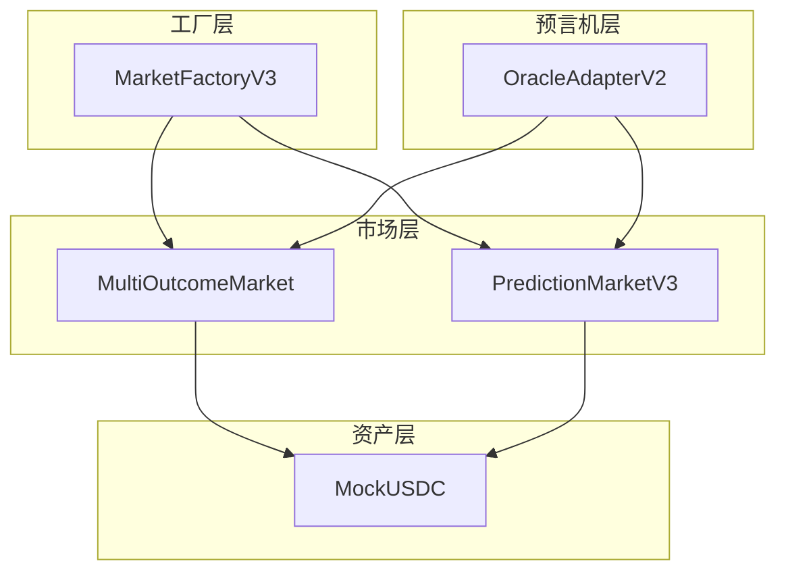
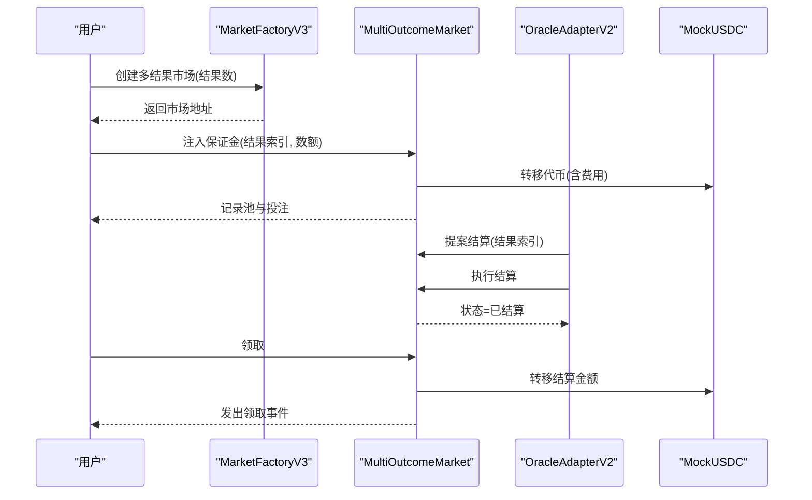
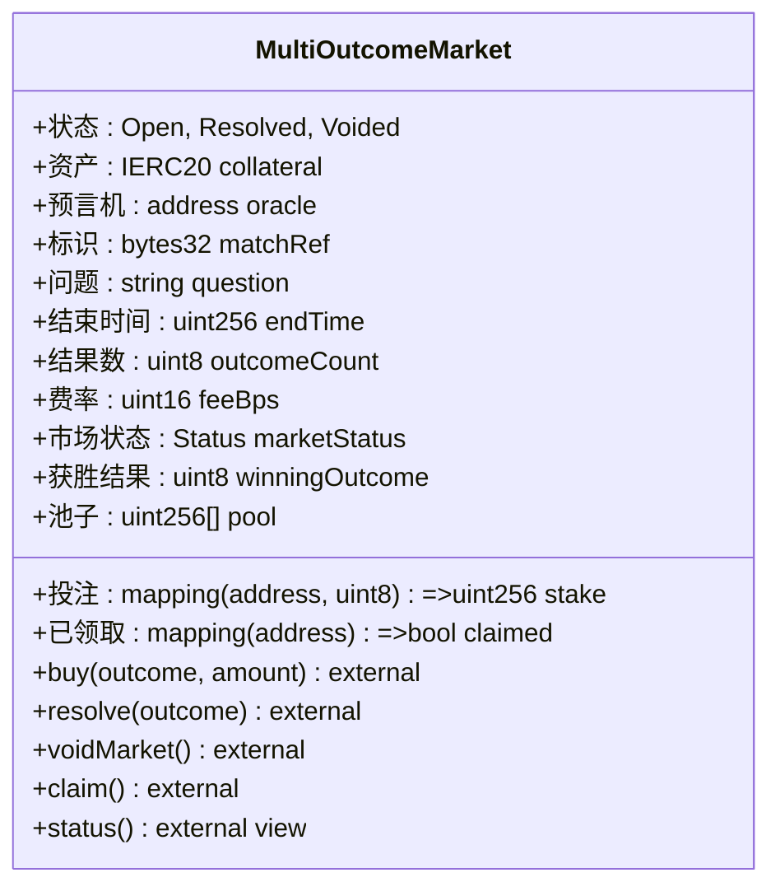
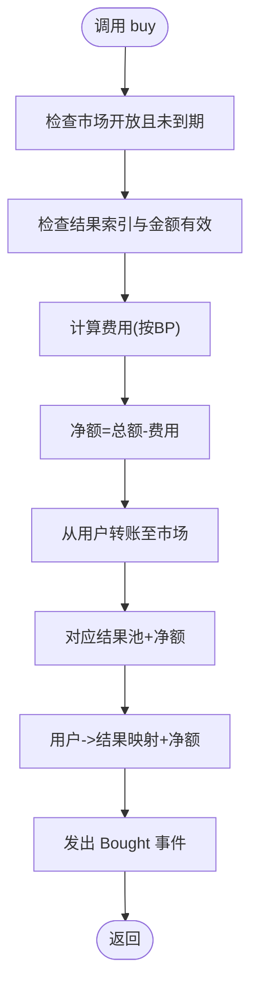
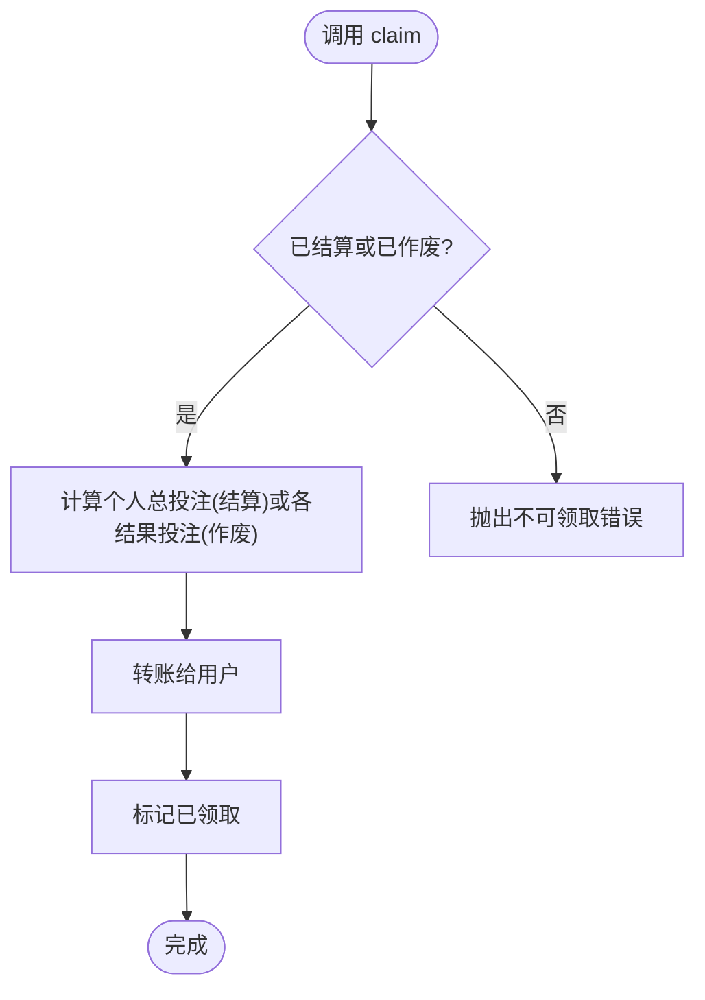
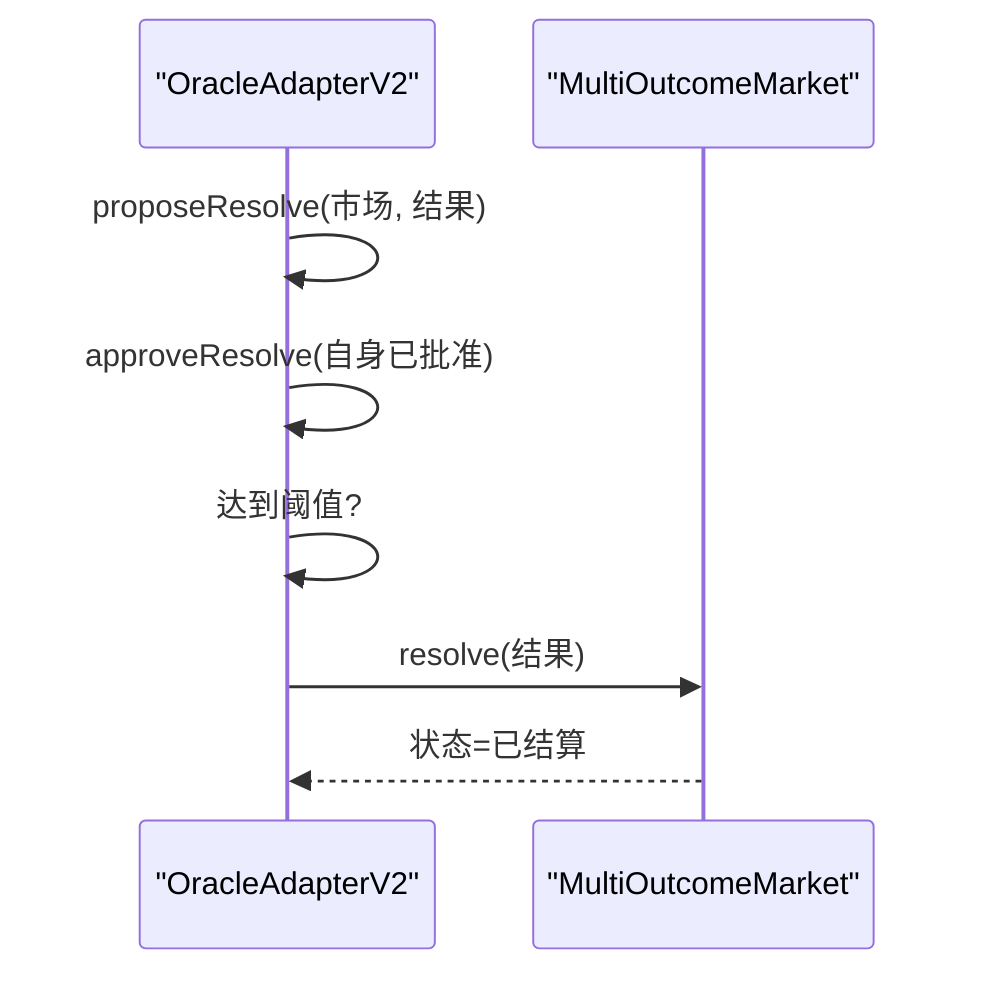
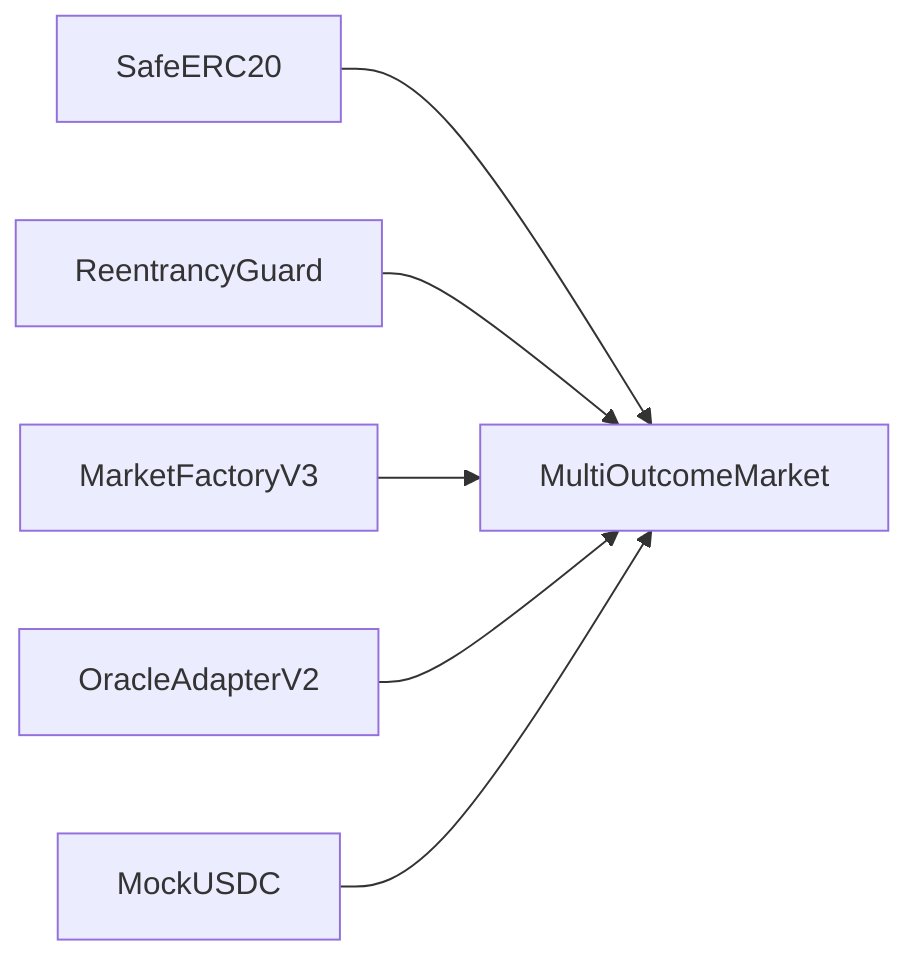

# 多结果预测市场

<cite>
**本文引用的文件**
- [MultiOutcomeMarket.sol](file://contracts/MultiOutcomeMarket.sol)
- [MarketFactoryV3.sol](file://contracts/MarketFactoryV3.sol)
- [OracleAdapterV2.sol](file://contracts/OracleAdapterV2.sol)
- [PredictionMarketV3.sol](file://contracts/PredictionMarketV3.sol)
- [MockUSDC.sol](file://contracts/MockUSDC.sol)
- [Phase3.test.js](file://test/Phase3.test.js)
- [IPredictionMarket.sol](file://contracts/interfaces/IPredictionMarket.sol)
</cite>

## 目录
1. [简介](#简介)
2. [项目结构](#项目结构)
3. [核心组件](#核心组件)
4. [架构总览](#架构总览)
5. [详细组件分析](#详细组件分析)
6. [依赖关系分析](#依赖关系分析)
7. [性能考量](#性能考量)
8. [故障排查指南](#故障排查指南)
9. [结论](#结论)
10. [附录：接口与示例](#附录接口与示例)

## 简介
本文件面向“多结果预测市场（MultiOutcomeMarket）”的技术文档，聚焦于N结果（2-8个结果）预测市场的实现机制，涵盖以下方面：
- 多结果资金池管理与费用分离机制
- 结算算法与收益分配规则
- 各结果分支的独立资金池与投注处理逻辑
- 核心函数接口说明（如 buy、resolve、claim）
- 业务应用场景（如选举预测、体育赛事分组赛等）
- 计算示例与流程图解
- 与二元市场的差异、扩展性与性能优化建议
- 最佳实践与常见问题解决方案

## 项目结构
多结果预测市场位于合约目录中，配合工厂与预言机适配器共同构成完整的市场生命周期：
- MultiOutcomeMarket.sol：多结果parimutuel市场核心逻辑
- MarketFactoryV3.sol：统一工厂，支持二元CPMM与多结果市场创建
- OracleAdapterV2.sol：多签预言机适配器，用于提案与执行结算
- PredictionMarketV3.sol：二元CPMM市场（对比参考）
- MockUSDC.sol：测试代币（6位小数）
- Phase3.test.js：多结果市场用例与行为验证
- IPredictionMarket.sol：市场接口定义

图表来源
- [MarketFactoryV3.sol](file://contracts/MarketFactoryV3.sol#L68-L88)
- [MultiOutcomeMarket.sol](file://contracts/MultiOutcomeMarket.sol#L14-L27)
- [OracleAdapterV2.sol](file://contracts/OracleAdapterV2.sol#L44-L81)
- [MockUSDC.sol](file://contracts/MockUSDC.sol#L6-L16)

章节来源
- [MarketFactoryV3.sol](file://contracts/MarketFactoryV3.sol#L1-L94)
- [MultiOutcomeMarket.sol](file://contracts/MultiOutcomeMarket.sol#L1-L113)
- [OracleAdapterV2.sol](file://contracts/OracleAdapterV2.sol#L1-L83)
- [MockUSDC.sol](file://contracts/MockUSDC.sol#L1-L17)
- [Phase3.test.js](file://test/Phase3.test.js#L29-L50)

## 核心组件
- 多结果市场（MultiOutcomeMarket）
  - 资产与权限：可替代代币作为保证金、唯一预言机地址、比赛标识、问题描述、结束时间、结果数量、费率（BP）
  - 状态：开放、已结算、已作废
  - 数据结构：按结果索引的池子数组、用户到结果的投注映射、已领取标记
  - 关键事件：购买、结算、领取、作废
- 工厂（MarketFactoryV3）
  - 支持创建二元CPMM市场与多结果市场；记录市场类型（0=二元，1=多结果）
- 预言机适配器（OracleAdapterV2）
  - 多签提案与执行机制，支持设置阈值、批准、执行结算或作废
- 对比参考：二元CPMM市场（PredictionMarketV3），用于对比费用收集、流动性、价格函数等

章节来源
- [MultiOutcomeMarket.sol](file://contracts/MultiOutcomeMarket.sol#L12-L37)
- [MarketFactoryV3.sol](file://contracts/MarketFactoryV3.sol#L11-L22)
- [OracleAdapterV2.sol](file://contracts/OracleAdapterV2.sol#L8-L33)
- [PredictionMarketV3.sol](file://contracts/PredictionMarketV3.sol#L12-L47)

## 架构总览
多结果市场的运行时交互如下：
- 用户通过工厂创建多结果市场
- 用户在市场开放期内向指定结果注入保证金（扣除费用后进入对应池）
- 预言机通过适配器发起结算提案，达到阈值后执行
- 用户在结算后进行领取，按比例分配总池与个人投注份额

图表来源
- [MarketFactoryV3.sol](file://contracts/MarketFactoryV3.sol#L68-L88)
- [MultiOutcomeMarket.sol](file://contracts/MultiOutcomeMarket.sol#L65-L111)
- [OracleAdapterV2.sol](file://contracts/OracleAdapterV2.sol#L44-L81)
- [MockUSDC.sol](file://contracts/MockUSDC.sol#L14-L16)

## 详细组件分析

### 多结果市场（MultiOutcomeMarket）类图

图表来源
- [MultiOutcomeMarket.sol](file://contracts/MultiOutcomeMarket.sol#L12-L37)
- [MultiOutcomeMarket.sol](file://contracts/MultiOutcomeMarket.sol#L65-L111)

章节来源
- [MultiOutcomeMarket.sol](file://contracts/MultiOutcomeMarket.sol#L1-L113)

### 投注与费用分离机制
- 输入校验：仅开放且未到期；结果索引有效；投注金额大于0
- 费用计算：按 BP 比例收取，净额进入对应池与用户投注映射
- 资金转移：从用户转移到市场合约
- 事件：记录购买行为

图表来源
- [MultiOutcomeMarket.sol](file://contracts/MultiOutcomeMarket.sol#L65-L74)

章节来源
- [MultiOutcomeMarket.sol](file://contracts/MultiOutcomeMarket.sol#L65-L74)

### 结算与收益分配规则
- 结算触发：仅预言机可调用，需市场处于开放状态且结果索引有效
- 作废：市场可被预言机作废，状态置为 Voided
- 领取逻辑：
  - 已结算：按“个人该结果投注份额 × 总池 / 获胜池”计算
  - 已作废：按个人所有结果的投注总和返还
  - 其他状态不可领取
- 防重复领取：使用布尔标记避免重复

图表来源
- [MultiOutcomeMarket.sol](file://contracts/MultiOutcomeMarket.sol#L89-L111)

章节来源
- [MultiOutcomeMarket.sol](file://contracts/MultiOutcomeMarket.sol#L76-L111)

### 预言机适配器（OracleAdapterV2）与多签流程
- 多签提案：创建提案并自动批准自身，累计到阈值后执行
- 执行路径：调用市场合约的 resolve 或 voidMarket
- 事件：提案创建、批准、执行、作废

图表来源
- [OracleAdapterV2.sol](file://contracts/OracleAdapterV2.sol#L44-L81)
- [MultiOutcomeMarket.sol](file://contracts/MultiOutcomeMarket.sol#L76-L81)

章节来源
- [OracleAdapterV2.sol](file://contracts/OracleAdapterV2.sol#L1-L83)
- [MultiOutcomeMarket.sol](file://contracts/MultiOutcomeMarket.sol#L76-L81)

### 与二元市场的差异与对比
- 市场模型
  - 多结果：parimutuel，按结果池独立管理，结算时以获胜池与总池计算回报
  - 二元CPMM：使用流动性池（reserveYes/reserveNo），采用恒定乘积价格函数
- 费用与激励
  - 多结果：直接从投注中抽取费用，进入池内
  - 二元CPMM：交易费用计入合约并可由LP分享
- 流动性
  - 多结果：无LP机制，仅池子
  - 二元CPMM：支持流动性提供与移除
- 接口与事件
  - 多结果：buy、resolve、voidMarket、claim
  - 二元CPMM：buy、addLiquidity、removeLiquidity、resolve、claim 及价格查询

章节来源
- [MultiOutcomeMarket.sol](file://contracts/MultiOutcomeMarket.sol#L65-L111)
- [PredictionMarketV3.sol](file://contracts/PredictionMarketV3.sol#L92-L165)

## 依赖关系分析
- MultiOutcomeMarket 依赖 OpenZeppelin 的 SafeERC20 与 ReentrancyGuard
- 工厂负责创建多结果市场并将市场类型标记为多结果
- 预言机适配器通过角色控制与多签机制驱动市场结算
- 测试用例验证多结果市场的创建、投注与结算流程

图表来源
- [MultiOutcomeMarket.sol](file://contracts/MultiOutcomeMarket.sol#L4-L10)
- [MarketFactoryV3.sol](file://contracts/MarketFactoryV3.sol#L68-L88)
- [OracleAdapterV2.sol](file://contracts/OracleAdapterV2.sol#L44-L81)
- [MockUSDC.sol](file://contracts/MockUSDC.sol#L14-L16)

章节来源
- [MultiOutcomeMarket.sol](file://contracts/MultiOutcomeMarket.sol#L1-L113)
- [MarketFactoryV3.sol](file://contracts/MarketFactoryV3.sol#L1-L94)
- [OracleAdapterV2.sol](file://contracts/OracleAdapterV2.sol#L1-L83)
- [MockUSDC.sol](file://contracts/MockUSDC.sol#L1-L17)

## 性能考量
- 存储访问
  - 池子数组与映射读写为 O(1)，但领取时需遍历所有结果计算总池，复杂度 O(N)
  - 在结果数上限为8的情况下，开销可控
- 事件与转账
  - 事件发出与代币转账为常数级操作，整体开销低
- 重入保护
  - 使用 ReentrancyGuard 修饰器确保关键函数的可重入安全
- 扩展性建议
  - 若未来需要更高结果数，可考虑将池子改为映射以降低初始化成本
  - 领取时的总池计算可引入缓存字段（需谨慎处理状态变更）

[本节为通用性能讨论，不直接分析具体文件]

## 故障排查指南
- 无法购买
  - 检查市场是否开放且未到期
  - 检查结果索引是否在 [0, outcomeCount) 范围内
  - 检查代币授权与余额
- 结算失败
  - 确认调用者具备预言机角色
  - 确认市场仍处于开放状态
  - 确认结果索引有效
- 领取失败
  - 确认市场已结算或已作废
  - 确认未重复领取
  - 确认存在可领取金额
- 多签未生效
  - 检查阈值设置与批准次数
  - 检查提案是否已被执行

章节来源
- [MultiOutcomeMarket.sol](file://contracts/MultiOutcomeMarket.sol#L65-L111)
- [OracleAdapterV2.sol](file://contracts/OracleAdapterV2.sol#L44-L81)

## 结论
多结果预测市场通过简单的 parimutuel 机制实现了对2-8个结果的统一管理，具备清晰的费用分离、独立池管理和公平的结算分配。结合多签预言机适配器，系统在安全性与可审计性上得到保障。与二元CPMM相比，多结果市场更偏向于“结果导向”的预测，适合体育赛事分组、选举等多结果场景。

[本节为总结性内容，不直接分析具体文件]

## 附录：接口与示例

### 核心函数接口
- buy(outcomeIndex:uint8, amount:uint256) external
  - 功能：向指定结果注入保证金（扣除费用后进入池）
  - 触发事件：Bought
- resolve(winningOutcome:uint8) external onlyOracle
  - 功能：由预言机设定获胜结果并关闭市场
  - 触发事件：Resolved
- voidMarket() external onlyOracle
  - 功能：由预言机将市场作废
  - 触发事件：MarketVoided
- claim() external nonReentrant
  - 功能：在已结算状态下按比例领取；在已作废状态下返还全部投注
  - 触发事件：Claimed
- status() external view returns (uint8)
  - 功能：返回当前市场状态

章节来源
- [MultiOutcomeMarket.sol](file://contracts/MultiOutcomeMarket.sol#L61-L111)

### 业务场景应用
- 体育赛事：小组赛阶段的小组冠军、季军争夺等多结果竞猜
- 政治选举：多候选人或多党派的胜负预测
- 赛事表现：某项指标的排名预测（前3名、前5名等）

[本节为概念性说明，不直接分析具体文件]

### 计算示例（基于测试用例）
- 场景：创建一个3结果的多结果市场，Alice分别向结果0与结果1投注，随后预言机将结果0设为获胜，Alice领取
- 步骤概览
  - 工厂创建多结果市场（3结果）
  - Alice向结果0投注100单位，向结果1投注50单位
  - 预言机多签提案并执行结算，标记结果0为获胜
  - Alice领取：按其在结果0的投注占获胜池的比例，获得总池的相应份额
- 参考测试用例
  - [Phase3.test.js](file://test/Phase3.test.js#L29-L50)

章节来源
- [Phase3.test.js](file://test/Phase3.test.js#L29-L50)

### 与二元市场的差异要点
- 多结果市场
  - 无LP，仅池子
  - 结算按获胜池与总池计算回报
  - 费用直接从投注中抽取
- 二元CPMM市场
  - 有流动性池与价格函数
  - 交易费用计入合约，可由LP分享
  - 支持流动性添加/移除

章节来源
- [MultiOutcomeMarket.sol](file://contracts/MultiOutcomeMarket.sol#L65-L111)
- [PredictionMarketV3.sol](file://contracts/PredictionMarketV3.sol#L92-L165)

### 最佳实践
- 合理设置费率（BP）与结束时间，平衡流动性与成本
- 在高并发场景下注意领取函数的批量处理策略（若适用）
- 使用多签预言机提升治理安全性
- 对外暴露只读查询接口（如 pool、stake）以便前端展示

[本节为通用建议，不直接分析具体文件]