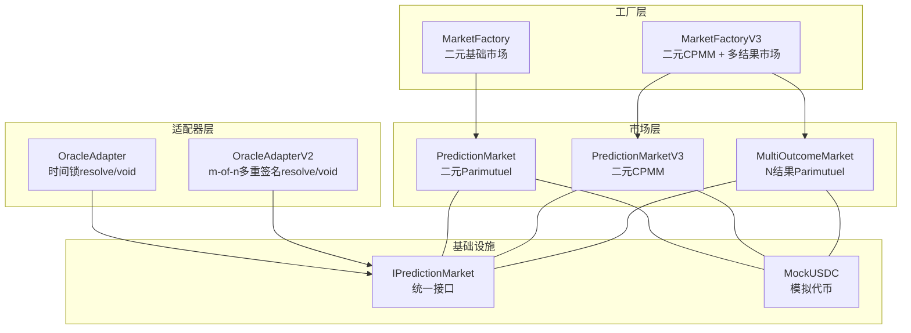
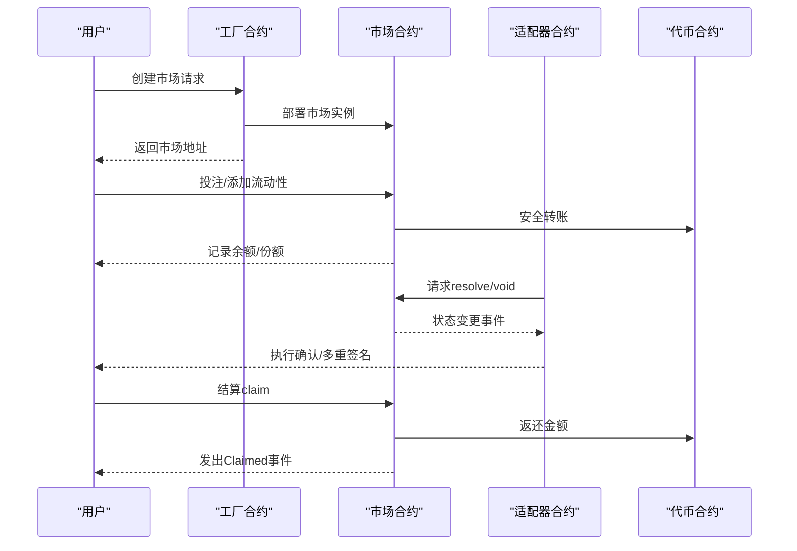
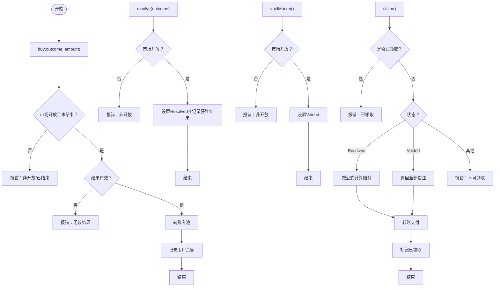
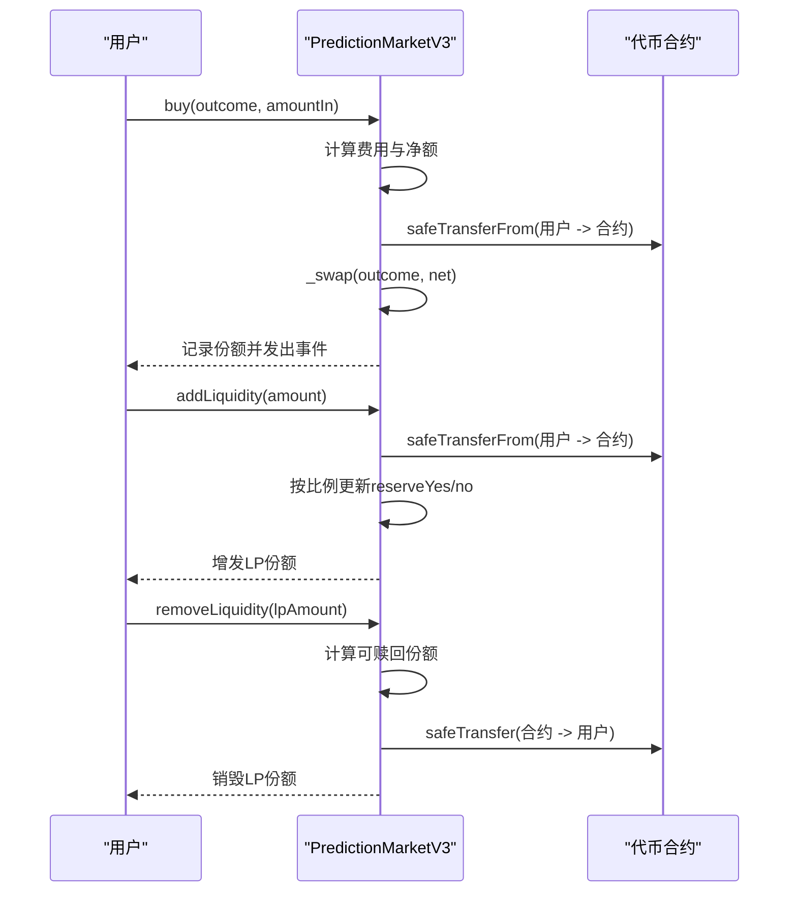
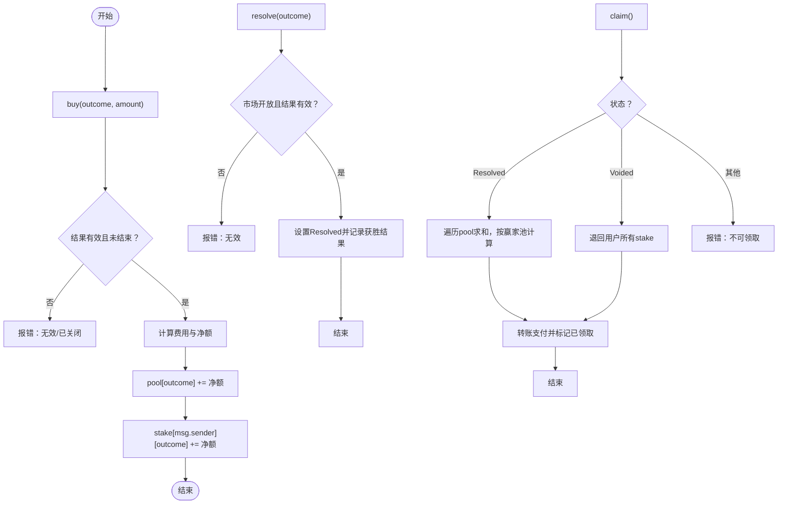
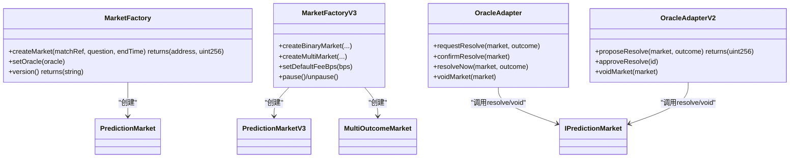
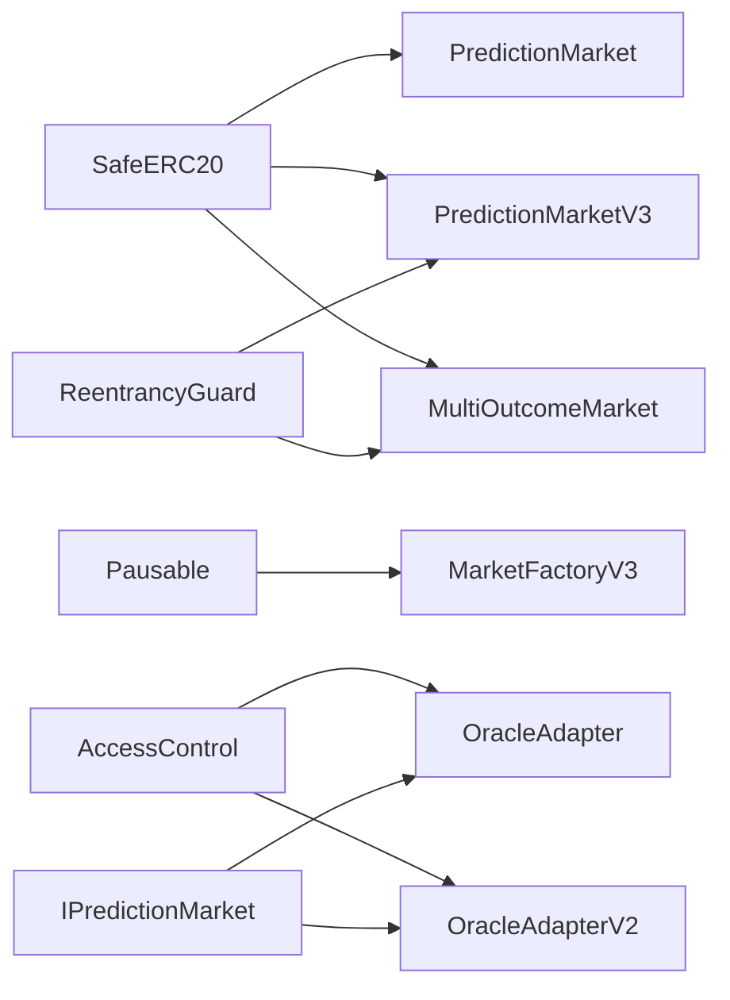

# 预测市场合约

<cite>
**本文引用的文件**
- [contracts/PredictionMarket.sol](file://contracts/PredictionMarket.sol)
- [contracts/PredictionMarketV3.sol](file://contracts/PredictionMarketV3.sol)
- [contracts/MultiOutcomeMarket.sol](file://contracts/MultiOutcomeMarket.sol)
- [contracts/interfaces/IPredictionMarket.sol](file://contracts/interfaces/IPredictionMarket.sol)
- [contracts/MarketFactory.sol](file://contracts/MarketFactory.sol)
- [contracts/MarketFactoryV3.sol](file://contracts/MarketFactoryV3.sol)
- [contracts/OracleAdapter.sol](file://contracts/OracleAdapter.sol)
- [contracts/OracleAdapterV2.sol](file://contracts/OracleAdapterV2.sol)
- [test/PredictionMarket.test.js](file://test/PredictionMarket.test.js)
- [scripts/deploy.js](file://scripts/deploy.js)
</cite>

## 目录
1. [简介](#简介)
2. [项目结构](#项目结构)
3. [核心组件](#核心组件)
4. [架构总览](#架构总览)
5. [详细组件分析](#详细组件分析)
6. [依赖关系分析](#依赖关系分析)
7. [性能考量](#性能考量)
8. [故障排查指南](#故障排查指南)
9. [结论](#结论)
10. [附录：接口与使用示例](#附录接口与使用示例)

## 简介
本技术文档面向预测市场合约系列，系统性阐述三类核心市场实现：
- PredictionMarket（基础版二元预测市场，采用Parimutuel共同赔付机制）
- PredictionMarketV3（CPMM做市商模型，支持流动性池、费用与LP份额分配）
- MultiOutcomeMarket（多结果市场，支持2-8结果的Parimutuel）

文档涵盖市场状态管理与生命周期控制、投注与结算流程、价格计算与流动性机制、接口定义与错误处理，并提供可执行的业务场景示例与最佳实践建议。

## 项目结构
该仓库采用按功能模块划分的组织方式，核心合约位于 contracts 目录，测试用例位于 test 目录，部署脚本位于 scripts 目录。工厂合约负责创建具体市场实例，适配器合约提供权威来源的结算授权与时间锁/多重签名机制。

图表来源
- [contracts/MarketFactory.sol](file://contracts/MarketFactory.sol#L37-L54)
- [contracts/MarketFactoryV3.sol](file://contracts/MarketFactoryV3.sol#L37-L88)
- [contracts/PredictionMarket.sol](file://contracts/PredictionMarket.sol#L44-L62)
- [contracts/PredictionMarketV3.sol](file://contracts/PredictionMarketV3.sol#L49-L73)
- [contracts/MultiOutcomeMarket.sol](file://contracts/MultiOutcomeMarket.sol#L39-L59)
- [contracts/OracleAdapter.sol](file://contracts/OracleAdapter.sol#L48-L75)
- [contracts/OracleAdapterV2.sol](file://contracts/OracleAdapterV2.sol#L44-L75)
- [contracts/interfaces/IPredictionMarket.sol](file://contracts/interfaces/IPredictionMarket.sol#L4-L8)

章节来源
- [contracts/MarketFactory.sol](file://contracts/MarketFactory.sol#L1-L60)
- [contracts/MarketFactoryV3.sol](file://contracts/MarketFactoryV3.sol#L1-L94)
- [contracts/PredictionMarket.sol](file://contracts/PredictionMarket.sol#L1-L134)
- [contracts/PredictionMarketV3.sol](file://contracts/PredictionMarketV3.sol#L1-L200)
- [contracts/MultiOutcomeMarket.sol](file://contracts/MultiOutcomeMarket.sol#L1-L113)
- [contracts/OracleAdapter.sol](file://contracts/OracleAdapter.sol#L1-L83)
- [contracts/OracleAdapterV2.sol](file://contracts/OracleAdapterV2.sol#L1-L83)
- [contracts/interfaces/IPredictionMarket.sol](file://contracts/interfaces/IPredictionMarket.sol#L1-L9)

## 核心组件
- PredictionMarket（基础二元Parimutuel）
  - 资产：collateral（ERC20）、yesPool/noPool
  - 投注：buy(outcome, amount)，按结果分别入池
  - 结算：resolve/void，claim按赢家池比例返还
- PredictionMarketV3（二元CPMM）
  - 资产：reserveYes/reserveNo、totalLPSupply、collectedFees
  - 流动性：addLiquidity/removeLiquidity、seedReserves
  - 交易：buy，按恒定乘积公式计算份额
  - 结算：resolve/void，claim按赢家池比例返还
- MultiOutcomeMarket（N结果Parimutuel）
  - 资产：pool数组、stake映射
  - 投注：buy(outcome, amount)，按结果入池
  - 结算：resolve/void，claim按赢家池比例返还
- 工厂合约
  - MarketFactory：创建基础二元市场
  - MarketFactoryV3：创建二元CPMM与多结果市场
- 适配器合约
  - OracleAdapter：时间锁resolve/void
  - OracleAdapterV2：m-of-n多重签名resolve/void

章节来源
- [contracts/PredictionMarket.sol](file://contracts/PredictionMarket.sol#L11-L37)
- [contracts/PredictionMarketV3.sol](file://contracts/PredictionMarketV3.sol#L12-L42)
- [contracts/MultiOutcomeMarket.sol](file://contracts/MultiOutcomeMarket.sol#L12-L32)
- [contracts/MarketFactory.sol](file://contracts/MarketFactory.sol#L37-L54)
- [contracts/MarketFactoryV3.sol](file://contracts/MarketFactoryV3.sol#L37-L88)
- [contracts/OracleAdapter.sol](file://contracts/OracleAdapter.sol#L48-L75)
- [contracts/OracleAdapterV2.sol](file://contracts/OracleAdapterV2.sol#L44-L75)

## 架构总览
预测市场体系通过工厂合约统一创建不同类型的市场，适配器合约提供权威来源的结算授权，确保在可预期的时间窗口内完成resolve或void操作。各市场合约均内置状态机与访问控制，保障资金安全与结算公平。

图表来源
- [contracts/MarketFactory.sol](file://contracts/MarketFactory.sol#L37-L54)
- [contracts/MarketFactoryV3.sol](file://contracts/MarketFactoryV3.sol#L37-L88)
- [contracts/PredictionMarket.sol](file://contracts/PredictionMarket.sol#L64-L113)
- [contracts/PredictionMarketV3.sol](file://contracts/PredictionMarketV3.sol#L92-L165)
- [contracts/MultiOutcomeMarket.sol](file://contracts/MultiOutcomeMarket.sol#L65-L111)
- [contracts/OracleAdapter.sol](file://contracts/OracleAdapter.sol#L48-L75)
- [contracts/OracleAdapterV2.sol](file://contracts/OracleAdapterV2.sol#L44-L75)

## 详细组件分析

### PredictionMarket（基础二元Parimutuel）
- 市场状态
  - Open：开放投注
  - Resolved：已结算
  - Voided：取消
- 关键数据结构
  - collateral：保证金代币
  - yesPool/noPool：Yes/No两方池子
  - yesBalance/noBalance：用户持有份额
  - claimed：是否已领取
- 投注流程
  - buy(outcome, amount)：校验状态、时间、结果有效性；转账入池；记录用户余额
- 结算流程
  - resolve：仅Oracle调用，设置获胜结果
  - voidMarket：仅Oracle调用，标记取消
  - claim：根据状态计算赔付，SafeERC20转账
- 赔付公式
  - 获胜侧：用户份额 × 总池 / 获胜池
  - 取消：退回全部投注

图表来源
- [contracts/PredictionMarket.sol](file://contracts/PredictionMarket.sol#L64-L132)

章节来源
- [contracts/PredictionMarket.sol](file://contracts/PredictionMarket.sol#L11-L134)

### PredictionMarketV3（CPMM做市商模型）
- 市场状态
  - Open：开放交易
  - Resolved：已结算
  - Voided：取消
- 关键数据结构
  - reserveYes/reserveNo：流动性池
  - totalLPSupply：LP总供应量
  - lpBalance：LP余额
  - collectedFees：累计手续费
  - userBetTotal：用户单次最大投注限制
- 流动性管理
  - seedReserves：工厂播种初始流动性
  - addLiquidity：按比例增加流动性
  - removeLiquidity：按比例赎回流动性
- 交易与价格
  - buy：收取费用，按恒定乘积公式计算份额
  - getPoolState：返回池子状态与Yes价格（千分之五表示50%）
- 结算与领取
  - resolve/void：仅Oracle调用
  - claim：按赢家池比例计算赔付

图表来源
- [contracts/PredictionMarketV3.sol](file://contracts/PredictionMarketV3.sol#L76-L135)
- [contracts/PredictionMarketV3.sol](file://contracts/PredictionMarketV3.sol#L178-L188)

章节来源
- [contracts/PredictionMarketV3.sol](file://contracts/PredictionMarketV3.sol#L12-L200)

### MultiOutcomeMarket（多结果Parimutuel）
- 支持2-8个结果
- 关键数据结构
  - pool：各结果池子
  - stake：用户在各结果上的投注
  - feeBps：每笔投注收取的费用（千分比）
- 投注与结算
  - buy：按结果入池，扣除费用后计入用户stake
  - resolve：仅Oracle调用，设置获胜结果
  - voidMarket：仅Oracle调用，标记取消
  - claim：按赢家池比例计算赔付

图表来源
- [contracts/MultiOutcomeMarket.sol](file://contracts/MultiOutcomeMarket.sol#L65-L111)

章节来源
- [contracts/MultiOutcomeMarket.sol](file://contracts/MultiOutcomeMarket.sol#L12-L113)

### 工厂合约与适配器合约
- MarketFactory
  - 仅所有者可创建基础二元市场
  - 绑定collateral与oracle，记录市场列表
- MarketFactoryV3
  - 仅所有者可创建二元CPMM与多结果市场
  - 支持暂停/恢复，配置默认费用与最大投注
  - 二元市场支持播种初始流动性
- OracleAdapter
  - 时间锁resolve/void，支持即时resolve（当时间锁为0）
- OracleAdapterV2
  - m-of-n多重签名resolve/void，支持阈值配置

图表来源
- [contracts/MarketFactory.sol](file://contracts/MarketFactory.sol#L37-L54)
- [contracts/MarketFactoryV3.sol](file://contracts/MarketFactoryV3.sol#L37-L88)
- [contracts/OracleAdapter.sol](file://contracts/OracleAdapter.sol#L48-L75)
- [contracts/OracleAdapterV2.sol](file://contracts/OracleAdapterV2.sol#L44-L75)
- [contracts/interfaces/IPredictionMarket.sol](file://contracts/interfaces/IPredictionMarket.sol#L4-L8)

章节来源
- [contracts/MarketFactory.sol](file://contracts/MarketFactory.sol#L1-L60)
- [contracts/MarketFactoryV3.sol](file://contracts/MarketFactoryV3.sol#L1-L94)
- [contracts/OracleAdapter.sol](file://contracts/OracleAdapter.sol#L1-L83)
- [contracts/OracleAdapterV2.sol](file://contracts/OracleAdapterV2.sol#L1-L83)
- [contracts/interfaces/IPredictionMarket.sol](file://contracts/interfaces/IPredictionMarket.sol#L1-L9)

## 依赖关系分析
- 继承与库
  - PredictionMarketV3、MultiOutcomeMarket继承ReentrancyGuard，防止重入攻击
  - 使用SafeERC20进行代币安全转账
  - MarketFactoryV3集成Pausable，支持暂停/恢复
- 接口契约
  - IPredictionMarket定义了统一的resolve/void/status接口，适配器通过该接口与市场交互
- 内部依赖
  - 三类市场均依赖OracleAdapter/OracleAdapterV2进行权威结算
  - 工厂合约负责初始化与部署，适配器负责授权

图表来源
- [contracts/PredictionMarket.sol](file://contracts/PredictionMarket.sol#L4-L9)
- [contracts/PredictionMarketV3.sol](file://contracts/PredictionMarketV3.sol#L4-L10)
- [contracts/MultiOutcomeMarket.sol](file://contracts/MultiOutcomeMarket.sol#L4-L6)
- [contracts/MarketFactoryV3.sol](file://contracts/MarketFactoryV3.sol#L6-L11)
- [contracts/OracleAdapter.sol](file://contracts/OracleAdapter.sol#L4-L8)
- [contracts/OracleAdapterV2.sol](file://contracts/OracleAdapterV2.sol#L4-L8)
- [contracts/interfaces/IPredictionMarket.sol](file://contracts/interfaces/IPredictionMarket.sol#L4-L8)

章节来源
- [contracts/PredictionMarket.sol](file://contracts/PredictionMarket.sol#L4-L10)
- [contracts/PredictionMarketV3.sol](file://contracts/PredictionMarketV3.sol#L4-L10)
- [contracts/MultiOutcomeMarket.sol](file://contracts/MultiOutcomeMarket.sol#L4-L6)
- [contracts/MarketFactoryV3.sol](file://contracts/MarketFactoryV3.sol#L6-L11)
- [contracts/OracleAdapter.sol](file://contracts/OracleAdapter.sol#L4-L8)
- [contracts/OracleAdapterV2.sol](file://contracts/OracleAdapterV2.sol#L4-L8)
- [contracts/interfaces/IPredictionMarket.sol](file://contracts/interfaces/IPredictionMarket.sol#L4-L8)

## 性能考量
- 交易Gas优化
  - 使用SafeERC20减少重复检查
  - CPMM中_swap与addLiquidity/removeLiquidity均为O(1)计算
- 存储空间
  - PredictionMarket：常量数量映射，适合短期市场
  - PredictionMarketV3：LP余额与用户投注总额映射，适合长期流动性
  - MultiOutcomeMarket：pool数组长度固定为2-8，stake映射按用户维度扩展
- 并发与重入
  - 所有外部函数均启用nonReentrant，避免重入攻击
- 可扩展性
  - MarketFactoryV3支持暂停，便于维护与升级
  - OracleAdapter/OracleAdapterV2提供灵活的授权机制

## 故障排查指南
- 常见错误与定位
  - “not open/ended”：市场未开放或已结束
  - “invalid outcome”：结果超出范围
  - “zero amount/zero”：投注金额为0
  - “already claimed”：重复领取
  - “not oracle”：非授权调用
  - “not claimable”：当前状态不可领取
  - “empty”：赢家池为空
- 调试建议
  - 使用getPoolState查看CPMM池子状态与价格
  - 在测试中参考现有断言，验证resolve/void后的claim行为
  - 检查OracleAdapter/OracleAdapterV2的时间锁或多重签名进度

章节来源
- [contracts/PredictionMarket.sol](file://contracts/PredictionMarket.sol#L64-L113)
- [contracts/PredictionMarketV3.sol](file://contracts/PredictionMarketV3.sol#L92-L165)
- [contracts/MultiOutcomeMarket.sol](file://contracts/MultiOutcomeMarket.sol#L65-L111)
- [contracts/OracleAdapter.sol](file://contracts/OracleAdapter.sol#L48-L75)
- [contracts/OracleAdapterV2.sol](file://contracts/OracleAdapterV2.sol#L44-L75)

## 结论
该预测市场合约体系提供了从基础Parimutuel到CPMM做市商再到多结果市场的完整能力谱系。通过工厂与适配器的解耦设计，实现了部署、授权与结算的清晰分离。在安全性方面，采用ReentrancyGuard、AccessControl与时间锁/多重签名等机制，确保资金与决策过程的安全可控。建议在生产环境中结合暂停机制与严格的费用策略，持续监控池子健康度与价格偏离情况。

## 附录：接口与使用示例

### 基础接口定义
- IPredictionMarket
  - status() external view returns (uint8)
  - resolve(uint8 winningOutcome) external
  - voidMarket() external

章节来源
- [contracts/interfaces/IPredictionMarket.sol](file://contracts/interfaces/IPredictionMarket.sol#L4-L8)

### PredictionMarket（基础二元）
- 构造参数
  - _collateral：保证金代币地址
  - _oracle：Oracle地址
  - _factory：工厂地址
  - _matchRef：比赛引用标识
  - _question：问题描述
  - _endTime：结束时间戳
- 主要方法
  - buy(outcome, amount)
  - resolve(winningOutcome)
  - voidMarket()
  - claim()

章节来源
- [contracts/PredictionMarket.sol](file://contracts/PredictionMarket.sol#L44-L113)

### PredictionMarketV3（CPMM二元）
- 构造参数
  - _collateral/_oracle/_factory/_matchRef/_question/_endTime/_feeBps/_initialLiquidity/_maxBetPerUser
- 主要方法
  - seedReserves(perSide, lpRecipient)
  - buy(outcome, amountIn)
  - addLiquidity(amount)
  - removeLiquidity(lpAmount)
  - resolve(outcome)
  - voidMarket()
  - claim()
  - status() external view returns (uint8)
  - getPoolState() external view returns (yesR, noR, priceYesBps)

章节来源
- [contracts/PredictionMarketV3.sol](file://contracts/PredictionMarketV3.sol#L49-L176)

### MultiOutcomeMarket（多结果）
- 构造参数
  - _collateral/_oracle/_matchRef/_question/_endTime/_outcomeCount/_feeBps
- 主要方法
  - buy(outcome, amount)
  - resolve(outcome)
  - voidMarket()
  - claim()
  - status() external view returns (uint8)

章节来源
- [contracts/MultiOutcomeMarket.sol](file://contracts/MultiOutcomeMarket.sol#L39-L111)

### 工厂与适配器
- MarketFactory
  - createMarket(matchRef, question, endTime)
  - setOracle(oracle)
- MarketFactoryV3
  - createBinaryMarket(matchRef, question, endTime, initialLiquidity)
  - createMultiMarket(matchRef, question, endTime, outcomeCount)
  - setDefaultFeeBps(bps)
  - pause()/unpause()
- OracleAdapter
  - requestResolve(market, outcome)
  - confirmResolve(market)
  - resolveNow(market, outcome)
  - voidMarket(market)
- OracleAdapterV2
  - proposeResolve(market, outcome)
  - approveResolve(id)
  - voidMarket(market)

章节来源
- [contracts/MarketFactory.sol](file://contracts/MarketFactory.sol#L37-L54)
- [contracts/MarketFactoryV3.sol](file://contracts/MarketFactoryV3.sol#L37-L88)
- [contracts/OracleAdapter.sol](file://contracts/OracleAdapter.sol#L48-L75)
- [contracts/OracleAdapterV2.sol](file://contracts/OracleAdapterV2.sol#L44-L75)

### 使用示例与业务场景
- 场景一：基础二元市场
  - 步骤：部署工厂与适配器 -> 创建市场 -> 用户投注 -> Oracle时间锁确认结算 -> 用户领取
  - 参考测试：[test/PredictionMarket.test.js](file://test/PredictionMarket.test.js#L34-L68)
- 场景二：CPMM二元市场
  - 步骤：部署工厂V3与适配器V2 -> 播种初始流动性 -> 用户购买份额 -> 观察价格变化 -> 结算与领取
  - 参考脚本：[scripts/deploy.js](file://scripts/deploy.js#L15-L31)
- 场景三：多结果市场
  - 步骤：部署工厂V3 -> 创建多结果市场 -> 用户在不同结果上投注 -> 结算与按赢家池比例领取

章节来源
- [test/PredictionMarket.test.js](file://test/PredictionMarket.test.js#L1-L70)
- [scripts/deploy.js](file://scripts/deploy.js#L1-L57)