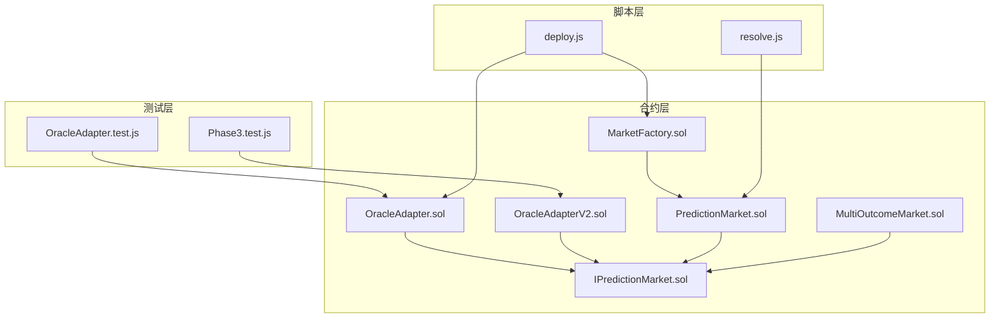
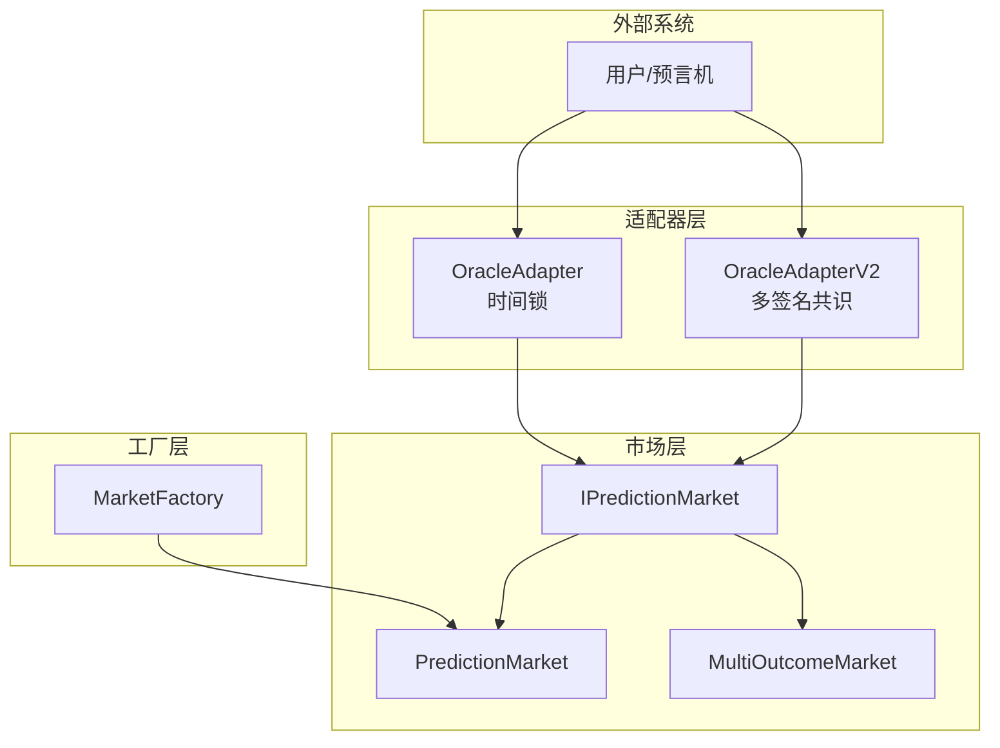
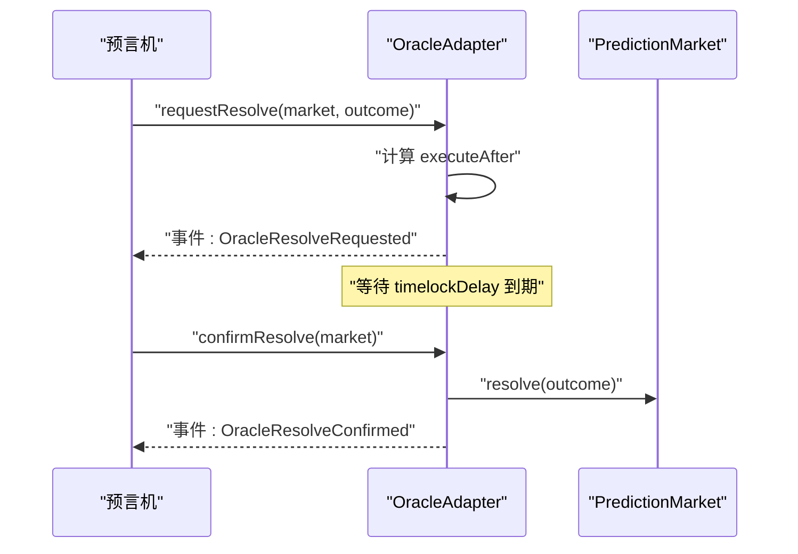
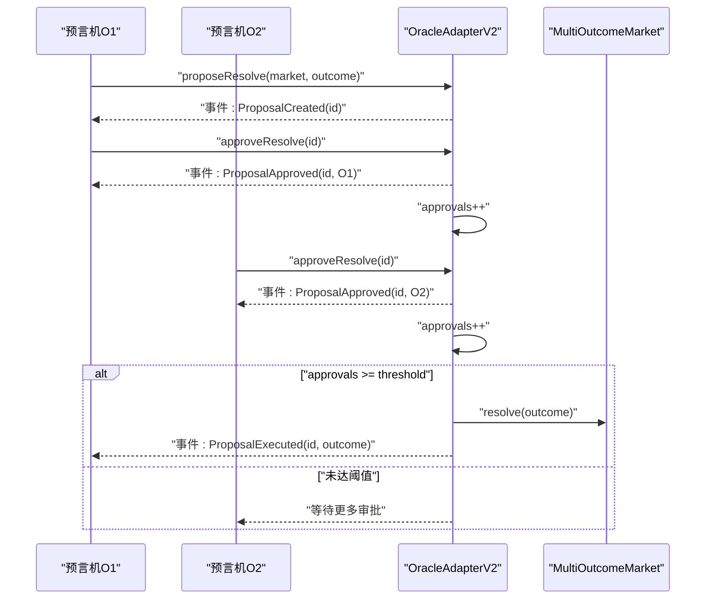
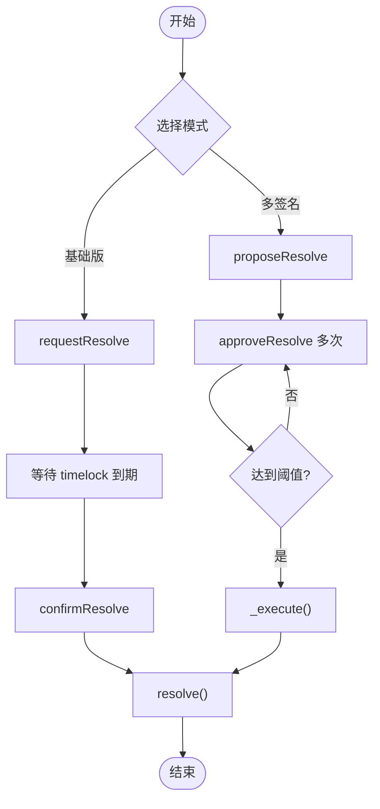
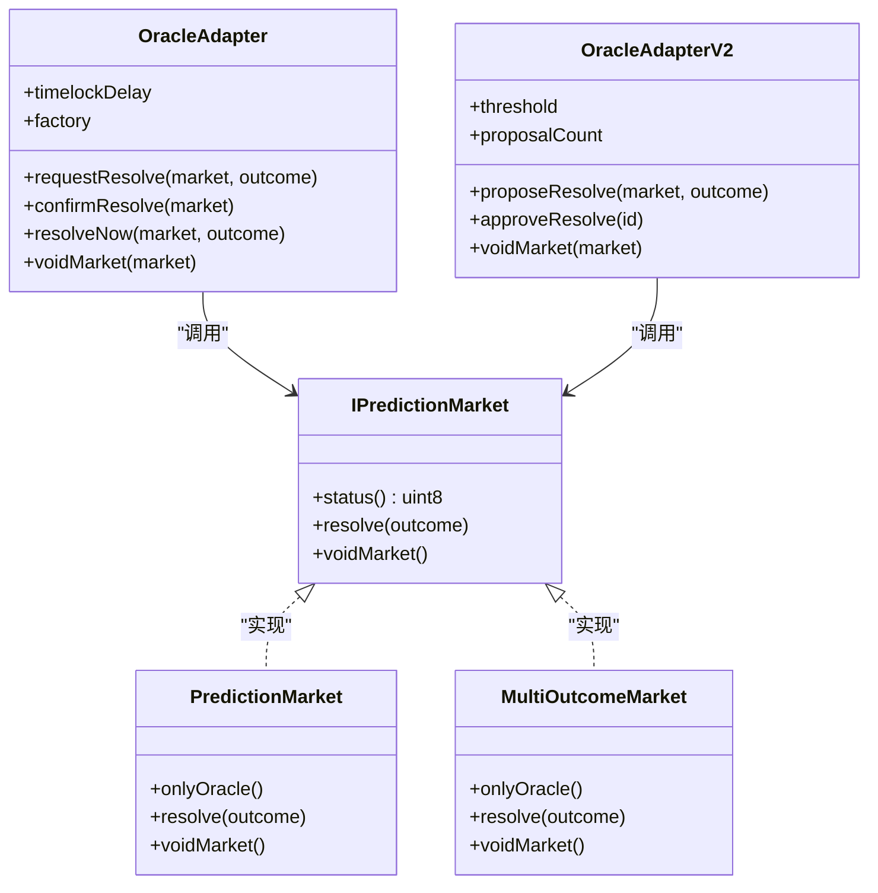

# 预言机适配器

<cite>
**本文引用的文件**
- [OracleAdapter.sol](file://contracts/OracleAdapter.sol)
- [OracleAdapterV2.sol](file://contracts/OracleAdapterV2.sol)
- [IPredictionMarket.sol](file://contracts/interfaces/IPredictionMarket.sol)
- [PredictionMarket.sol](file://contracts/PredictionMarket.sol)
- [MultiOutcomeMarket.sol](file://contracts/MultiOutcomeMarket.sol)
- [MarketFactory.sol](file://contracts/MarketFactory.sol)
- [OracleAdapter.test.js](file://test/OracleAdapter.test.js)
- [Phase3.test.js](file://test/Phase3.test.js)
- [deploy.js](file://scripts/deploy.js)
- [resolve.js](file://scripts/resolve.js)
</cite>

## 目录
1. [简介](#简介)
2. [项目结构](#项目结构)
3. [核心组件](#核心组件)
4. [架构总览](#架构总览)
5. [详细组件分析](#详细组件分析)
6. [依赖关系分析](#依赖关系分析)
7. [性能考量](#性能考量)
8. [故障排查指南](#故障排查指南)
9. [结论](#结论)
10. [附录](#附录)

## 简介
本技术文档面向预言机适配器合约，系统性阐述两类适配器的设计与实现：
- OracleAdapter（基础版）：基于“时间锁”的单方解决机制，支持请求-确认两阶段流程与即时解决路径。
- OracleAdapterV2（多签名共识版）：基于“m-of-n 多方签名”的共识解决机制，支持提案-投票-阈值触发执行。

文档同时覆盖与市场合约的交互流程、部署与配置指南、安全与风险控制，以及不同模式的适用场景与选择标准。

## 项目结构
本仓库围绕预测市场生态构建，核心文件组织如下：
- 合约层：OracleAdapter、OracleAdapterV2、PredictionMarket、MultiOutcomeMarket、MarketFactory、接口定义等。
- 测试层：OracleAdapter.test.js、Phase3.test.js 等，覆盖时间锁与多签名共识的关键流程。
- 脚本层：deploy.js（部署）、resolve.js（直接调用市场 resolve 的示例脚本）。

图表来源
- [OracleAdapter.sol](file://contracts/OracleAdapter.sol#L1-L83)
- [OracleAdapterV2.sol](file://contracts/OracleAdapterV2.sol#L1-L83)
- [IPredictionMarket.sol](file://contracts/interfaces/IPredictionMarket.sol#L1-L9)
- [PredictionMarket.sol](file://contracts/PredictionMarket.sol#L1-L134)
- [MultiOutcomeMarket.sol](file://contracts/MultiOutcomeMarket.sol#L1-L113)
- [MarketFactory.sol](file://contracts/MarketFactory.sol#L1-L60)
- [OracleAdapter.test.js](file://test/OracleAdapter.test.js#L1-L50)
- [Phase3.test.js](file://test/Phase3.test.js#L1-L74)
- [deploy.js](file://scripts/deploy.js#L1-L57)
- [resolve.js](file://scripts/resolve.js#L1-L20)

章节来源
- [OracleAdapter.sol](file://contracts/OracleAdapter.sol#L1-L83)
- [OracleAdapterV2.sol](file://contracts/OracleAdapterV2.sol#L1-L83)
- [IPredictionMarket.sol](file://contracts/interfaces/IPredictionMarket.sol#L1-L9)
- [PredictionMarket.sol](file://contracts/PredictionMarket.sol#L1-L134)
- [MultiOutcomeMarket.sol](file://contracts/MultiOutcomeMarket.sol#L1-L113)
- [MarketFactory.sol](file://contracts/MarketFactory.sol#L1-L60)
- [OracleAdapter.test.js](file://test/OracleAdapter.test.js#L1-L50)
- [Phase3.test.js](file://test/Phase3.test.js#L1-L74)
- [deploy.js](file://scripts/deploy.js#L1-L57)
- [resolve.js](file://scripts/resolve.js#L1-L20)

## 核心组件
- OracleAdapter（基础版）
  - 角色与权限：通过 AccessControl 管理 DEFAULT_ADMIN_ROLE 与 ORACLE_ROLE；仅 ORACLE_ROLE 可发起解决与作废。
  - 时间锁机制：requestResolve 设置执行时间点 executeAfter，confirmResolve 在时间到达后执行 resolve。
  - 快速路径：当 timelockDelay 为 0 时，可直接 resolveNow。
  - 市场交互：调用 IPredictionMarket.resolve 或 IPredictionMarket.voidMarket。
- OracleAdapterV2（多签名共识版）
  - 角色与权限：同样使用 AccessControl，ORACLE_ROLE 拥有提案与审批权限。
  - 提案与审批：proposeResolve 创建提案，多个 ORACLE_ROLE 持有人 approveResolve 进行投票，达到阈值 threshold 即自动执行。
  - 执行逻辑：_execute 内部完成 resolve，并标记已执行，防止重复执行。
  - 市场交互：与基础版一致，调用 IPredictionMarket.resolve 或 IPredictionMarket.voidMarket。
- 市场合约
  - PredictionMarket：二元市场（Yes/No），支持 resolve 与 voidMarket，仅 oracle 可调用。
  - MultiOutcomeMarket：多结果市场（2-8 结果），支持 resolve 与 voidMarket，仅 oracle 可调用。
- 工厂与接口
  - MarketFactory：负责部署 PredictionMarket 实例，绑定 collateral、oracle、factory 等参数。
  - IPredictionMarket：统一的市场接口，暴露 status、resolve、voidMarket。

章节来源
- [OracleAdapter.sol](file://contracts/OracleAdapter.sol#L1-L83)
- [OracleAdapterV2.sol](file://contracts/OracleAdapterV2.sol#L1-L83)
- [IPredictionMarket.sol](file://contracts/interfaces/IPredictionMarket.sol#L1-L9)
- [PredictionMarket.sol](file://contracts/PredictionMarket.sol#L1-L134)
- [MultiOutcomeMarket.sol](file://contracts/MultiOutcomeMarket.sol#L1-L113)
- [MarketFactory.sol](file://contracts/MarketFactory.sol#L1-L60)

## 架构总览
预言机适配器作为“中间层”，在市场合约与外部预言机之间建立受控通道，确保解决与作废操作满足预设的安全策略。

图表来源
- [OracleAdapter.sol](file://contracts/OracleAdapter.sol#L1-L83)
- [OracleAdapterV2.sol](file://contracts/OracleAdapterV2.sol#L1-L83)
- [IPredictionMarket.sol](file://contracts/interfaces/IPredictionMarket.sol#L1-L9)
- [PredictionMarket.sol](file://contracts/PredictionMarket.sol#L1-L134)
- [MultiOutcomeMarket.sol](file://contracts/MultiOutcomeMarket.sol#L1-L113)
- [MarketFactory.sol](file://contracts/MarketFactory.sol#L1-L60)

## 详细组件分析

### OracleAdapter（基础版）时间锁机制
- 请求阶段
  - 输入：market 地址、outcome（0/1）。
  - 校验：outcome 合法性、市场状态为开放。
  - 行为：计算 executeAfter = 当前区块时间 + timelockDelay，写入 pending 映射并发出事件。
- 确认阶段
  - 输入：market 地址。
  - 校验：存在待处理、当前时间 >= executeAfter。
  - 行为：标记 pending 为非活跃，调用市场 resolve 并发出事件。
- 快速路径
  - 当 timelockDelay 为 0 时，可直接 resolveNow，绕过请求-确认流程。
- 作废流程
  - 校验：市场状态为开放。
  - 行为：调用市场 voidMarket，用于退款与重置。

图表来源
- [OracleAdapter.sol](file://contracts/OracleAdapter.sol#L48-L67)
- [IPredictionMarket.sol](file://contracts/interfaces/IPredictionMarket.sol#L5-L7)
- [PredictionMarket.sol](file://contracts/PredictionMarket.sol#L83-L89)

章节来源
- [OracleAdapter.sol](file://contracts/OracleAdapter.sol#L11-L81)
- [OracleAdapter.test.js](file://test/OracleAdapter.test.js#L6-L25)

### OracleAdapterV2（多签名共识机制）
- 提案阶段
  - 输入：market 地址、outcome（0-7）。
  - 校验：outcome 合法性、市场状态为开放。
  - 行为：自增 proposalCount 生成 id，初始化 Proposal 并记录 approvals=0，立即对发起者进行一次 _approve。
- 审批阶段
  - 输入：proposal id。
  - 校验：未执行、未重复审批。
  - 行为：记录审批、增加 approvals；若达到阈值 threshold，则触发 _execute。
- 执行阶段
  - 输入：proposal id。
  - 校验：未执行。
  - 行为：标记 executed=true，调用市场 resolve 并发出事件。
- 作废流程
  - 输入：market 地址。
  - 校验：市场状态为开放。
  - 行为：调用市场 voidMarket。

图表来源
- [OracleAdapterV2.sol](file://contracts/OracleAdapterV2.sol#L44-L75)
- [IPredictionMarket.sol](file://contracts/interfaces/IPredictionMarket.sol#L5-L7)
- [MultiOutcomeMarket.sol](file://contracts/MultiOutcomeMarket.sol#L76-L81)

章节来源
- [OracleAdapterV2.sol](file://contracts/OracleAdapterV2.sol#L11-L81)
- [Phase3.test.js](file://test/Phase3.test.js#L52-L72)

### 与市场合约的交互流程
- 解决请求的发起
  - 基础版：OracleAdapter.requestResolve -> 记录 PendingResolve。
  - 多签名版：OracleAdapterV2.proposeResolve -> 创建 Proposal。
- 验证与执行
  - 基础版：OracleAdapter.confirmResolve -> 调用 IPredictionMarket.resolve。
  - 多签名版：OracleAdapterV2._execute -> 调用 IPredictionMarket.resolve。
- 作废
  - 两者均支持 OracleAdapter.voidMarket / OracleAdapterV2.voidMarket -> IPredictionMarket.voidMarket。

图表来源
- [OracleAdapter.sol](file://contracts/OracleAdapter.sol#L48-L67)
- [OracleAdapterV2.sol](file://contracts/OracleAdapterV2.sol#L44-L75)
- [IPredictionMarket.sol](file://contracts/interfaces/IPredictionMarket.sol#L5-L7)

章节来源
- [PredictionMarket.sol](file://contracts/PredictionMarket.sol#L83-L95)
- [MultiOutcomeMarket.sol](file://contracts/MultiOutcomeMarket.sol#L76-L87)

## 依赖关系分析
- 角色与权限
  - OracleAdapter 与 OracleAdapterV2 均继承 AccessControl，通过 DEFAULT_ADMIN_ROLE 授权 ORACLE_ROLE。
  - 仅持有 ORACLE_ROLE 的地址可调用 resolve/voidMarket 相关方法。
- 接口契约
  - IPredictionMarket 统一了市场接口，保证适配器与不同市场合约的解耦。
- 市场约束
  - PredictionMarket 与 MultiOutcomeMarket 均要求 resolve/voidMarket 仅由 oracle 调用，且市场状态必须为 Open。

图表来源
- [OracleAdapter.sol](file://contracts/OracleAdapter.sol#L1-L83)
- [OracleAdapterV2.sol](file://contracts/OracleAdapterV2.sol#L1-L83)
- [IPredictionMarket.sol](file://contracts/interfaces/IPredictionMarket.sol#L1-L9)
- [PredictionMarket.sol](file://contracts/PredictionMarket.sol#L1-L134)
- [MultiOutcomeMarket.sol](file://contracts/MultiOutcomeMarket.sol#L1-L113)

章节来源
- [OracleAdapter.sol](file://contracts/OracleAdapter.sol#L4-L6)
- [OracleAdapterV2.sol](file://contracts/OracleAdapterV2.sol#L4-L6)
- [IPredictionMarket.sol](file://contracts/interfaces/IPredictionMarket.sol#L4-L8)
- [PredictionMarket.sol](file://contracts/PredictionMarket.sol#L39-L42)
- [MultiOutcomeMarket.sol](file://contracts/MultiOutcomeMarket.sol#L34-L37)

## 性能考量
- 时间锁与多签名的权衡
  - 基础版：低延迟，适合高吞吐、低风险场景；但缺乏多方共识。
  - 多签名版：引入共识成本，提升抗审查与抗篡改能力，适合高价值或高风险场景。
- 存储与映射
  - 基础版：pending 映射按市场维度存储，空间复杂度 O(M)。
  - 多签名版：proposals 映射 + approved 映射，空间复杂度 O(P + O·P)，其中 P 为提案数，O 为预言机数量。
- 交易开销
  - 多签名版本外层需多次 approve，链上 gas 成本更高；建议合理设置阈值以平衡安全性与效率。

## 故障排查指南
- 常见错误与定位
  - “timelock”：基础版 confirmResolve 未到时间锁到期，需等待或调整 timelockDelay。
  - “not open”：resolve/voidMarket 仅在市场状态为 Open 时允许，检查市场是否已结束或已解决。
  - “invalid outcome/outcome”：基础版仅支持 0/1，多签名版支持 0-7，确保 outcome 范围正确。
  - “approved/executed”：多签名版重复审批或已执行会失败，检查提案状态与审批记录。
- 测试参考
  - 时间锁流程与退款测试：OracleAdapter.test.js。
  - 多签名阈值生效测试：Phase3.test.js。
- 调试建议
  - 使用 Hardhat 测试工具与时间推进工具模拟时间锁到期。
  - 通过事件日志核对 pending/Proposal 状态变化。

章节来源
- [OracleAdapter.test.js](file://test/OracleAdapter.test.js#L6-L48)
- [Phase3.test.js](file://test/Phase3.test.js#L52-L72)
- [OracleAdapter.sol](file://contracts/OracleAdapter.sol#L60-L67)
- [OracleAdapterV2.sol](file://contracts/OracleAdapterV2.sol#L53-L75)

## 结论
- 选择建议
  - 基础版（时间锁）：适用于快速解决、低争议场景，强调响应速度与成本控制。
  - 多签名版（共识）：适用于高价值、高风险场景，强调去中心化共识与抗审查能力。
- 最佳实践
  - 明确 timelockDelay 或 threshold 的设定，结合业务风险与 SLA。
  - 严格控制 ORACLE_ROLE 分配，避免单点故障。
  - 在部署脚本中统一初始化并导出关键地址与参数，便于运维与审计。

## 附录

### 部署与配置指南
- 部署步骤
  - 部署 MockUSDC、OracleAdapter（或 OracleAdapterV2）、DIDRegistry、MarketFactory。
  - 将 MarketFactory 的 oracle 地址指向适配器，授予适配器 ORACLE_ROLE。
  - 可选：设置 timelockDelay（基础版）或 threshold（多签名版）。
- 关键环境变量
  - ORACLE_TIMELOCK_SECONDS：基础版时间锁秒数，默认 120。
- 示例脚本
  - deploy.js：自动化部署并输出部署清单。
  - resolve.js：直接调用市场 resolve 的示例脚本（不推荐在生产中绕过适配器）。

章节来源
- [deploy.js](file://scripts/deploy.js#L7-L31)
- [OracleAdapter.sol](file://contracts/OracleAdapter.sol#L30-L42)
- [OracleAdapterV2.sol](file://contracts/OracleAdapterV2.sol#L29-L38)

### 安全考虑与风险控制
- 权限控制
  - 仅 DEFAULT_ADMIN_ROLE 可设置阈值、时间锁、授权 ORACLE_ROLE。
- 抗重放与防篡改
  - 基础版：通过 timelockDelay 延迟执行，降低短期价格操纵风险。
  - 多签名版：通过阈值与多方审批，降低单一节点被攻陷的风险。
- 市场状态一致性
  - 适配器与市场合约均校验市场状态为 Open，避免在已结束或已解决状态下重复操作。
- 事件与审计
  - 全面事件记录（请求、确认、提案、审批、执行、作废），便于审计与回溯。

章节来源
- [OracleAdapter.sol](file://contracts/OracleAdapter.sol#L36-L46)
- [OracleAdapterV2.sol](file://contracts/OracleAdapterV2.sol#L35-L42)
- [PredictionMarket.sol](file://contracts/PredictionMarket.sol#L83-L95)
- [MultiOutcomeMarket.sol](file://contracts/MultiOutcomeMarket.sol#L76-L87)

### 不同模式的适用场景与选择标准
- 基础版（时间锁）
  - 适用：高频、低争议、快速结算的二元市场。
  - 选择标准：对延迟敏感、信任单一权威源、无需多方共识。
- 多签名版（共识）
  - 适用：高价值、高风险、需要多方共识的多结果市场。
  - 选择标准：抗审查需求强、多方治理、可接受更高的 gas 成本与延迟。

章节来源
- [OracleAdapter.sol](file://contracts/OracleAdapter.sol#L7-L8)
- [OracleAdapterV2.sol](file://contracts/OracleAdapterV2.sol#L7-L8)
- [MultiOutcomeMarket.sol](file://contracts/MultiOutcomeMarket.sol#L8-L9)